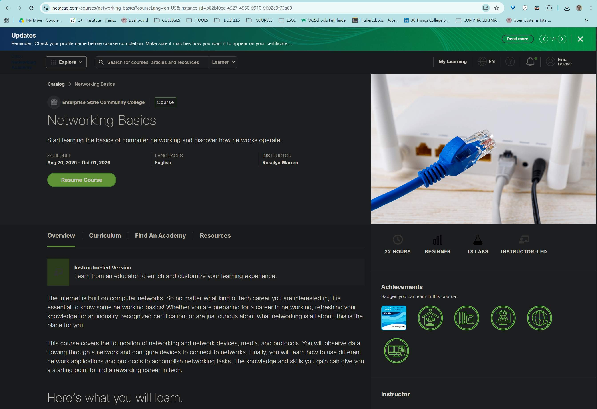

<!-- 🔗 Custom Stylesheet -->
<link rel="stylesheet" href="../../_css/main.css">

<!-- 🖼️ Site Logo -->

# Assignments Schedule (CIS 161 - Networking Intro)

(Semester 1 — Fall 2026)

## 📅 Week 1

### MODULE:  Cisco Networking Basics

- [x] Watch Cisco Network Academy Overview video
- [] Review Networking Basics link
- [] Review OSI Reference
- [x] Get Access to Netacad.com #GOTCHA:  Currently says "Enrollment is disabled or inactive"
  - #SOLVED: It seems that the **Netacad** course did not open up until the previous video was watched. So, it seems there are `digital prerequisites` for accessing certain courses and platforms, although the ACCESS KEYS have already been entered

- [x] (Optional) Created Discord server 

---

## 📅 Week 2

