<!-- Custom stylesheet -->
<link rel="stylesheet" href="../../_css/main.css">

<!-- Site logo -->


> [🏚️ README](../../../README.md) | [📁 Courses](../../index.md) | [📚 Vocabulary](../../Vocabulary.md) | [🗓️ Assignments Schedule](../Assignments_Schedule.md) | [🔖 Bookmark](#bookmark)

# Fiber Optics Technician | Getting Started — NOTES
> via ESCC CIS 161 - Networking Intro
>
> The following are my notes


---


---

## Welcome

Welcome to the first step in your journey to become a Fiber Optics Technician and Installer in the State of Alabama! Watch the video below to learn why this is the right career for you.

- Aubix - A company that hires for IT

- Fiber is very important in the state of Alabama
- 11/1 unmet fiber optic trade jobs
- Teach fiber splicing, importance of fiber, and WHY fiber is the lifeblood of our digital economy


- A big factor in bringing fiber to the community is a trained workforce
- Alabama Community College System is a big factor in brining that training to the people


> **Note**
> 
> Throughout this course, you will see red 'CONTINUE' buttons like the one you just clicked. If a 'CONTINUE' button is locked and says, "Complete the content above before moving on," there is something you need to do before continuing.
> 
> Alert boxes like the one above contain reminders about the content that needs to be completed before the 'CONTINUE' button will appear. For example, if there is a video, you will need to watch it the whole way through.
> 
> Once you have completed the content, the button will unlock. Click it to continue.


---


## ACCS Credential

The **ACCS Innovation Center** developed this course through a partnership with telecommunications providers.

Upon completing the course, you will earn an ACCS Credential, which indicates to employers that you have attained these competencies.

ACCS-Credentialed courses are vetted by the ACCS Credentialing Committee against the ACCCP qualities of a valuable credential. This is a non-credit course. However, if you choose to continue into a short Certificate program that follows, you will receive pre-determined, articulated credit toward completing that program.


---

As you learn about some of the tasks completed by Fiber Optics Technicians, you'll notice there's a lot that goes into the role. Watch the video below to learn about the training process for new techs.


---


Course Activities

This course is divided up into modules, and each module contains multiple lessons. At the end of each module, you will take a short quiz. In total, the online portion of the course will take about 20 hours. After completing the online portion, you will sign up for a 2-day, in-person lab.

In this course, you will review and interact with the materials in four different stages: Learn, Practice, Assess, and Apply. Click each + below to read more about each stage.


---


---


Knowledge Checks

As mentioned above, knowledge checks are NOT quizzes. They are practice questions to help you recall what you've just learned, and check that you've understood what you've read/watched before moving on!

Test out the various types of knowledge checks below.

- Multiple choice, single select
- Matching
- Drag Sorting

---

# 🧰 Module 1 | The Basics of Fiber

## 🟣  1.1 - Keys to Success

- **Untayus Taylor** - Alabama Power

- Show up ready to work
- Pay attention
- Let the guys know you are trying to understand and learn what they are teaching
- Embrace not knowing and wanting to learn it; be ready to learn
- If you want to learn it you will

## 🟣  1.2 - Broadband Connections
    
Let's take a look at how broadband is expanding throughout Alabama. Use the arrows to click through the slides below.  

> "Broadband expansion is really exciting for Alabama. Fast, reliable internet has become essential to modern life. We shop online for everything from food to medicine to furniture."

- broadband expansion = fast reliable internet

We talk by video with family members across the world. We work from home and take classes like this one online because we have a connection to a fiber optic cable nearby. But ***not all Alabamians can do this, especially in rural areas*** of our state. 

---

Internet data moves rapidly into the state to large data sources. This data is speeding across new fiber optic lines. These lines serve big cities with high-speed internet, but today, **only 25% of Alabama addresses have access to this kind of high-speed service**.

---

Most Alabamians get their internet on older, slower networks, and some of us who live in rural areas still have no service at all. Your job will change this. **Alabama is investing millions of dollars to lay miles and miles of this fast fiber optic cable** to the small communities who don’t have it.

---

High-speed internet access means new industries and opportunities. With your help, small businesses can thrive in rural towns, emergency responders can get to your neighbor faster, and more Alabamians can train online from home for better jobs.

---

Data Needs

Alabamians want and need practical access to data. Below you will find common uses of broadband connections. Click on each card to flip and learn more.  


1.  ▶️ Internet Searches
    ◀️ Gain information from global resources
    
2.  ▶️ Web Transactions
    ◀️ Purchases, hotel reservations, flights, online banking
    
3.  ▶️ Career Advancement
    ◀️ Complete educational courses online for credit
    
4.  ▶️ News and Trends
    ◀️ Access updates from news agencies
    
5.  ▶️ Entertainment
    ◀️ Stream football, church, and movies
    
6.  ▶️ Social Media
    ◀️ Connect with friends and family from far away
    
7.  ▶️ Emergency Alerts
    ◀️ Access weather warnings on a phone
    
8.  ▶️ Public Safety Announcements
    ◀️ Receive Amber Alerts from Law Enforcement
    
9.  ▶️ Communication
    ◀️ Email, chat, phone and video conferencing

---


## 🟣  1.3 - Old Technology vs. New Technology
    
In this lesson, we are going to look at the old and new technology found in Alabama networks. Click through the slides to learn more.

Modern Need

Fast internet is something we need now. We need it to work, to communicate, to keep us safe. The problem is how to do it? How to get fast internet to everyone, no matter where they live?

---

Modern Problem

How do phone, internet, and cable companies send Alabamians the most data in the fastest, most efficient way?

---

Modern Solution

Send data on **two types of cables** - **Ethernet** and **Fiber Optic**. 


---

Alabama Networks

**Fiber optic cable is definitely the future**, but most networks you’ll work on in Alabama will have a ***combination of older ethernet and newer fiber optic cables.***

---

**Ethernet Cable**

Ethernet cable technology has been around since the 80’s. Copper wires are bundled together to create a cable. Electrical signals are sent down the copper wires, and the wires can be twisted together to make new connections. **These signals will move quickly over short distances, but weaken the farther they travel.** They work great covering short spans, like room-to-room inside buildings and homes. These cables can be easily cut and reconnected with simple tools like pliers and wire strippers.

> - Ethernet works great covering short spans like room-to-room


On the job, you’ll hear these cables called **CAT5, CAT6, or CAT7**. We’re always improving our technology, so these are just names for different generations, or categories, of ethernet cable as they get faster and faster. You’ll see these cables on power lines, and they can also be buried underground. Most of the wiring inside homes and offices is ethernet cable. These cables have plugs that are very recognizable, and most devices we use come with ethernet receptors built into them.

**Fiber Optic Cable**

Fiber Optic cables are different. Instead of copper wire, the core of this cable is a tiny glass or plastic tube that’s the **thickness of a human hair**. Because these fibers are so thin, they are lighter than ethernet and many more of them can be bundled together into a single cable. Instead of electricity, data moves through these cables using pulses of light. **Light travels so much faster than electricity**, it’s not even close! It’s like comparing a little league football team to the SEC champion. **A single fiber optic cable can run up to 60 miles** before experiencing signal loss! This makes fiber better for covering long distances between data sources and rural areas.


**Fiber cable is more complex to cut and connect**, though. It **requires a lot of practice**, and **equipment that costs thousands of dollars**. There are different types of fiber optic cable, but on the job, you’ll just hear it called “Fiber.” Fiber cable is also run on power lines, usually below ethernet cable, and it can also be buried underground. Since this is newer technology, ***you’ll need an adapter to connect a fiber cable to a common device like the modem from your cable company.***


> ## 🧵 What the sentence means
> 
> It means that **fiber-optic cable can be installed overhead on the same utility poles that carry electrical power lines**.
> 
> In the usual arrangement, the fiber cable is attached **lower on the pole than the energized electrical conductors**. The course’s phrase “below Ethernet cable” is likely imprecise shorthand for *below other communications cables*—or it may simply be mistaken, because Ethernet is normally a local network cable inside a building, not a typical utility-pole cable.
> 
> ## ⚡ Power lines vs. fiber
> 
> A common U.S. utility pole has vertical “zones”:
> 
> | Pole location | Usually carries | Why it is there |
> |---|---|---|
> | Top | High-voltage primary power conductors | Keeps the most hazardous conductors highest and separated. |
> | Middle | Lower-voltage electrical equipment/conductors, neutral, transformers | Electrical distribution to nearby buildings. |
> | Safety separation zone | Required empty vertical space | Helps protect communications workers from contact with energized power conductors. |
> | Lower portion | Telephone, cable-TV coax, and fiber-optic cable | This is the communications space. |
> 
> Fiber is generally categorized as a **communications line**, so it is normally placed in the communications space below the power/supply space. Safety standards require separation between the highest communications attachment and the electrical conductors above it; the exact clearance depends on the electrical configuration and installation details. [standards.ieee](https://standards.ieee.org/wp-content/uploads/import/documents/interpretations/ir571.pdf)
> 
> ## 🌐 Why fiber can be near power
> 
> Fiber sends data as **pulses of light through glass or plastic**, not as electrical current through copper conductors.
> 
> That provides two important advantages:
> 
> - Fiber itself does not carry normal network electrical signals, so it is not susceptible to electromagnetic interference from nearby power lines in the way copper data cables can be.
> - Many aerial fiber designs are **all-dielectric**—they contain no conductive metal—making them suitable for installation near electrical infrastructure when installed under the applicable engineering and safety rules. [thefoa](https://thefoa.org/tech/ref/appln/ElecUtil.html)
> 
> That does **not** mean anyone can hang fiber wherever they want. Shared utility poles are carefully engineered for clearance, mechanical loading, grounding/bonding where applicable, worker safety, sag between poles, wind, ice, and local utility requirements.
> 
> ## 🧱 What “run on power lines” can mean
> 
> The wording can refer to either of two different installations:
> 
> 1. **Most common: same poles, below the power wires.**  
>    Fiber is suspended from a messenger wire or uses a self-supporting cable, attached to the lower communications portion of utility poles. This is probably what your course means. [ecmag](https://www.ecmag.com/magazine/articles/article-detail/integrated-systems-fiber-technology-electrical-utilities-techniques-installing-fiber-power)
> 
> 2. **Specialized utility installation: directly on or within power-line infrastructure.**  
>    Utilities can use specially designed fiber systems—such as optical power attached cable or fiber integrated with ground/shield wire—to connect substations and utility equipment. These are not ordinary residential ISP installations and require specialized equipment and trained electrical/fiber crews. [thefoa](https://thefoa.org/tech/ref/appln/ElecUtil.html)
> 
> ## ✅ Plain-English rewrite
> 
> A more precise version of the course statement would be:
> 
> > “Aerial fiber-optic cable may be installed on utility poles that also carry electrical power lines. In typical joint-use pole installations, the fiber is placed in the lower communications space, beneath the power conductors and with required safety clearance.”
> 
> ## 🧠 Key correction: “Ethernet cable”
> 
> “Ethernet cable” usually means a copper twisted-pair cable such as Cat5e, Cat6, or Cat6A, generally used **inside homes, offices, and buildings**. It is not normally the cable being referenced when discussing lines strung between utility poles.
> 
> The likely intended wording was one of these:
> 
> - “Fiber cable is commonly run **below power lines**.”
> - “Fiber cable may be run below **telephone and cable-TV lines**.”
> - “Fiber cable is installed in the **communications space** on a shared utility pole.”
> 
> So, at the precise level: **fiber is not ordinarily run “below Ethernet cable”; it is ordinarily attached below electrical supply conductors on a shared utility pole.**

---

**Now that you have learned a little bit about ethernet cables and fiber optic cables, let's review how they are similar and different.** 

## **How are they similar?**

The main similarity between ethernet and fiber is the physical location of the cabling. **Both ethernet cable and fiber optic cables can be hung on power poles or can be buried underground.**

## **How are they different?**

The main differences between ethernet and fiber are shown in the table below. 

  

| Old Technology  <br>Ethernet Cable | New Technology  <br>Fiber Optic Cable |
| --- | --- |
| made of copper wire,  bundled into a cable | made of tiny glass or plastic tubes, bundled into a cable |
| data moves using electricity | data moves using light beam pulses  <br>(light is faster than electricity) |
| cut and connect with simple tools | cut and connect with expensive, professional tools |
| familiar plugs work with most devices | requires adapters to plug into most devices |
| 100-foot max run before signal loss | 60-mile max run before signal loss |


> ## 🟢 Yes — this clarification changes it
> 
> With the full lesson text, the course is saying that **both copper Ethernet cabling and fiber-optic cabling can be installed outdoors in two broad physical pathways**:
> 
> 1. **Aerial** — suspended above ground on poles or other supports.
> 2. **Underground** — placed in conduit/duct, or sometimes designed for direct burial.
> 
> So the intended “similarity” is about **where the cable may be installed**, not how the two cable types transmit data.
> 
> ## 🧵 What “Ethernet cable” means here
> 
> In this course, “Ethernet cable” almost certainly means **copper twisted-pair network cable**, such as Cat5e, Cat6, or Cat6A—not necessarily a short patch cable between a PC and a switch.
> 
> There are special outdoor-rated copper Ethernet cables made for outside-plant use. Depending on the cable design and the installation plan, these can be:
> 
> - Installed in underground conduit.
> - Direct-buried if the cable is specifically rated for direct burial.
> - Run aerially between buildings or poles when it is an appropriate outdoor/aerial design, often lashed to a supporting messenger wire.
> - Installed in ways that protect it from sunlight, water, temperature changes, physical damage, and mechanical tension. [commscope](https://www.commscope.com/globalassets/digizuite/53956-customer-owned-copper-osp-guide-co-112386-en-3-7-18-pdf.pdf)
> 
> Likewise, outside-plant fiber can be aerial, installed in conduit, or direct-buried. Aerial fiber might be lashed to a messenger wire, use a Figure-8 cable with an integrated messenger, or be all-dielectric self-supporting (ADSS). [thefoa](https://www.thefoa.org/tech/ref/OSP/cable.html)
> 
> ## ⚠️ The important practical nuance
> 
> The statement is **technically true but overly broad**.
> 
> It does *not* mean:
> 
> > “Any normal indoor Cat5e/Cat6 Ethernet patch cable can be hung from a power pole or buried in dirt.”
> 
> That would be incorrect and unsafe. Indoor Ethernet cable is generally not made to withstand UV exposure, moisture, tension from long aerial spans, weather, or burial conditions.
> 
> It means:
> 
> > “If the proper outdoor-rated cable and approved installation method are used, both copper Ethernet cabling and fiber-optic cabling can travel above ground on poles or below ground.”
> 
> Aerial telecommunications installations can support optical fiber, balanced twisted-pair copper, and coaxial cable. [bicsi](https://www.bicsi.org/docs/default-source/publications/bicsi-g2-2-22-preview.pdf?sfvrsn=26d1ad7_8)
> 
> ## ⚡ “On power poles” does not mean “on power wires”
> 
> The wording **“hung on power poles”** means the cable is attached to the *pole structure*, not attached directly to energized power conductors.
> 
> A simplified shared utility-pole layout is:
> 
> ```text
>               Top of pole
>                    │
>        Electrical power conductors
>                    │
>           Electrical equipment
>                    │
>        Required safety separation
>                    │
>    Communications space:
>    • Telephone copper
>    • Cable-TV coax
>    • Fiber optic cable
>    • In some cases, outdoor-rated
>      twisted-pair Ethernet/data cable
>                    │
>               Ground level
> ```
> 
> The electrical supply conductors occupy the upper part of the pole. Communications cables—including fiber and, where deployed, outdoor-rated copper data cable—are placed lower down with specified clearance, engineering, and utility permission.
> 
> ## 🔍 How they differ
> 
> The next course table is likely comparing the actual transmission media, not physical location:
> 
> | Feature | Copper Ethernet cable | Fiber-optic cable |
> |---|---|---|
> | Signal type | Electrical signals | Pulses of light |
> | Main material | Copper conductors | Glass or plastic optical fibers |
> | Electrical interference | Can be affected by EMI/RFI, especially near electrical equipment | Immune to electromagnetic interference |
> | Distance | Standard Ethernet over twisted-pair copper is commonly limited to 100 m per channel/link segment | Can operate over much longer distances, depending on fiber type and optics |
> | Electricity | Conductive; can create grounding, lightning, surge, and electrical-potential concerns outdoors | The fiber strand itself is nonconductive; some fiber cable designs may still contain metal strength members |
> | Typical role | Device-to-switch and short building/campus runs | Building backbone, campus links, ISP networks, and longer/high-bandwidth links |
> 
> For example, if two school buildings are 60 meters apart, outdoor-rated copper Ethernet *could* work technically if installed correctly. But for a 500-meter building-to-building link—or a link in an electrically noisy area—fiber is generally the better fit because it supports longer runs and does not conduct electrical current.
> 
> ## ✅ Best study-note wording
> 
> Write the course point this way:
> 
> > **Similarity:** Both copper Ethernet cable and fiber-optic cable can be used outdoors and installed either aerially on utility/support poles or underground, provided the cable is rated for the environment and installed using the proper method.
> 
> > **Important qualification:** “Hung on power poles” means attached to a utility pole in the communications space, not connected to or hung from energized electrical power lines.
> 
> > **Key difference:** Copper Ethernet transmits electrical signals over copper conductors; fiber transmits light through optical strands.

---

## 🟣  1.4 - Dissecting an Ethernet Cable


Now that you’re familiar with the basics of ethernet and fiber cables, let’s take a closer look at how both are put together. First, let’s look at a basic ethernet cable. **Use the arrows to click through the slides below.**  

Slide 1


This is a piece of ethernet CAT5E cable.  


Slide 2


All cables are labeled on the outside like this so they’re easy to identify. 


Slide 3


Inside the cable covering are 8 copper wires twisted into 4 pairs.  Each wire has a protective colored coating so you can identify which wire you’re working with.


Slide 4


You'll always find the same four colors: orange, green, blue, and brown. For each color, there is one solid wire and one striped wire.


Slide 5


To connect this cable to a device, you need a male connector that looks like this.


Slide 6


To attach the connector, you untwist the wires, spread them out in order, and insert them into the connector. Once secured in the connector, **trim off the extra length of wire**.


Slide 7


This connector then plugs into common devices in your home or business.

- T-568A & T-568B
- both alternate stripe / solid from left to right
- PatterN starts with a striped pin on PIN 1


- Q: What's the FILL for pins 4, 5, and 6?
- My answer: solid, stripe, solid 


- Different color assignments between the two version for pins 
- Use alphabetical order to remember
- PINS 3 and 6 are ORANGE on A and GREEN on B
- 4 is always solid blue ; 5 is always striped blue
- 7/8 is striped/solid brown


---

Now that you are familiar with the T-568A and T-568B, let's practice the color similarities and differences.  Complete the two activities below. 

- MNEMONIC?: GOLR


## 🟣  1.5 - Dissecting a Fiber Cable
    
Now let’s look at a fiber optic cable. Remember, **the core is the only part of this cable that carries data**. It is as tiny as a hair, but inside of it, data travels at super high speeds over really long distances. This glass core is delicate and requires the protection of several layers of coating. If you cut into a fiber cable, you’ll find the core at the center, surrounded by multiple protective layers. Click on each part to learn more.


    
## 🟣  1.6 - Single Mode and Multi Mode
    


There are **two kinds of optical fiber**: **multi mode** and **single mode**. ***Multi mode is an older technology with a larger core***, and more room for light to bounce around as it reflects off of the cladding. You won't see much multi mode fiber on the job, but you need to know it exists. What you will work with **most often is single mode fiber**. Single mode fiber has a much smaller core, and this means there is **less room for light to bounce around and therefore lose strength**.  

| **Single Mode** | Multi Mode |
| --- | --- |
| *   the outer jacket color is **yellow**<br>*   can transmit up to **6.2 miles**<br>*   used for running Internet to homes  and businesses | *   the outer jacket color is **blue**<br>*   will only work at a max of **1800 feet**<br>*   used inside of buildings to tie equipment together |


## 🟣  1.7 - Spectrum of Light
    

One question you might have at this point is, “Will I be able to see these pulses of light that are pushing data through the core?” The answer is, “No.” There are two reasons you will not be able to see the light in the core:

1.  The core is covered by layers of protective materials (e.g., cladding, jacket).
2.  The light pulsing inside the core is in the **infrared (IR) zone** of the spectrum of electromagnetic radiation. IR light is outside of the range of wavelengths humans can see.


## **Electromagnetic Spectrum**

The **electromagnetic (EM) spectrum** includes wavelengths of all sizes. Click each number below (in order) to learn more about the EM spectrum. You can click the images that pop up to see them bigger.


---


Light used in fiber optic technology falls into the **near range of infrared radiation**, with wavelengths measuring **800 nm - 1600 nm**.  You’ll learn more about specific wavelengths later in the course.

> ⚠️☠️☢️ #GOTCHA #DANGER!: It is dangerous to look directly into a fiber optic cable because the light could damage your eyes.


---

## **Infrared Zone**

There are **specific wavelengths** within the infrared zone that **produce the highest quality fiber optic signals**, so these are the wavelengths that fiber equipment uses to send data.  Think about these like **old school radio channels**. To hear the best audio, you have to dial into the right channel. You can’t hear the song on the radio clearly until you dial the exact channel.  Same thing with fiber optics. The best stations for fiber optic transmission are 1310 nm, 1490 nm, 1550 nm, and 1610 nm. That’s why all fiber equipment is calibrated to run on these frequencies.  You’ll learn more about these frequencies when we dive deeper into testing fiber optic networks.


> 📌 #TIP:  The best stations for fiber optic transmission are **1310 nm**, **1490 nm**, **1550 nm**, and **1610 nm**

#PROOF


---


# 🧰 Module 2.1 - Data and Networks

Everyone wants fast internet, but do you know the story of how far and how fast that data has to travel to reach you. Let’s say you’re at home and you click on a website that’s hosted in the United Kingdom. How does that data get to you? To find out, use the arrows to click through the slides below.  

Trans-Atlantic Submarine Cable


The data has to cross the ocean through an **undersea cable**. This map shows the **Tata TGN-Atlantic cable**, which connects Highbridge, United Kingdom to Wall Township, New Jersey. (Image Source: TeleGeography(opens in a new tab))

---

US Submarine Cable


The **Confluence-1 undersea cable** connects Wall Township, New Jersey and other cities along the East Coast of the United States, including **Jacksonville, Florida**. **Jacksonville is the closest connection to Alabama**. (Image Source: TeleGeography(opens in a new tab))

---

Data Centers


**Alabama has data centers in Birmingham, Montgomery, and Huntsville**. To get to the data center in Montgomery, the data passes through the data center in Tallahassee. (Image Source: Google Maps(opens in a new tab))

---

ISP Main Network


From **Montgomery**, the data goes to your **local Internet Service Provider (ISP)**. From the **central office of your ISP**, the data continues on a **network of fiber cables strung on poles or buried underground** until it gets close to your home.


---


The Last Mile


Getting from the main network to your home is called  “**the last mile**.” While this distance is tiny compared to how far that data has traveled already, a lot of money and labor go into connecting individual homes and businesses to the main network. As a Fiber Optics Technician, this is where you'll be doing most of your work.


> - **Fiber Optics Technicians** do most of their work in the **last mmile**


## 🟣 2.2 - Passive Optical Networks


Trunk Cables


Large fiber cables called **trunk cables** run through Alabama like interstates. There’s **a lot of traffic on these trunk cables** and it’s moving very fast. This map shows the path of a trunk cable running through an Alabama town.

> - **trunk cables:** ???


---


Networks


From the large trunks, smaller cables branch off. Networks are formed from the branches to serve our communities. This map shows the run of smaller cables in an Alabama community. 

---


## Passive Optical Network (PON)

The most common type of network that serves Alabama communities is a Passive Optical Network or PON. This type of network is specifically designed for transmitting video, data, and voice traffic is called a PON, short for Passive Optical Network.  A PON moves data signals using light and reflection instead of electrical power. 

**P** - Passive (***no electricity required***)

**O** - Optical (powered by reflected light) 

**N** - Network (a group of interconnected things)


> - **passive optical network (PON):** the most common type of network that serves Alabama communities; specifically designed to transmit video, data, and voice traffic; moves data signals using light and reflection instead of electrical power

(STOPPED HERE 9/11/26: https://alabama.instructure.com/courses/208537/assignments/6638279?module_item_id=20286509)


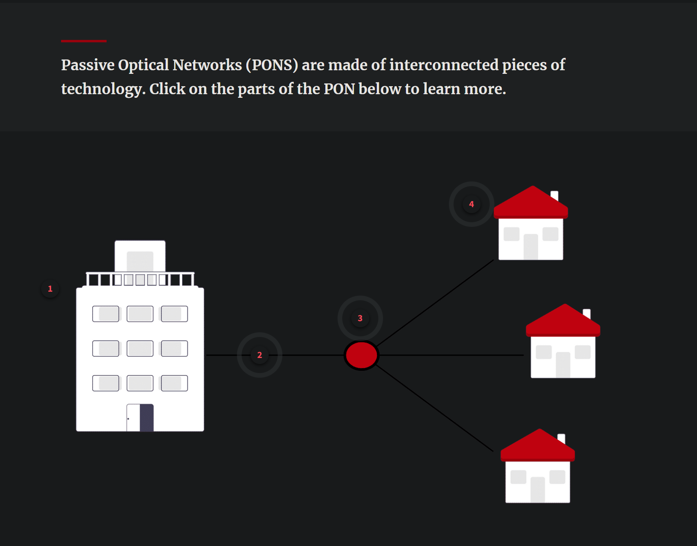

**Optical Line Terminal (OLT)**

OLT stands for Optical Line Terminal. 

  

**O** \- Optical (the action of light)

**L -** Line (a length of material)

**T** \- Terminal (one end of something)

  

The OLT is a piece of hardware at the beginning of the network. You may also hear it called the Head End. It's the translator and manager of data traffic on a network. Cable, phone, and internet providers send electrical data to the OLT, and the OLT converts the electrical data into light signals. It then manages the sending and receiving of these light signals to the rest of the network.

> - **OLT:** another term for `head end`

---


**Single Mode Fiber**

Single mode fiber cable is the “backbone” of the network. It’s the fastest type of fiber, and it’s used over long distances with very little attenuation, or signal loss. Fiber cables can be installed underground or strung across power poles. **Aerial cables** are quick to install and easy to access for techs. These are the lower lines on a power pole. The lines above it are electrical. Underground cables are blown through sturdy tubes, and protected from storm damage and harsh weather. Empty tubes can be  laid during trenching to make it easy to add more fiber in the future.


---


**Splitters / Multiport Service Terminal (MST)**

This part of a PON is a Multiport Service Terminal (MST) or more commonly called a splitter.  Splitters take a single light pulse of data and separate it into multiple beams of light. In this picture, one cable goes in, and 3 cables go out, all sending the same signal. ***Mirrors are used to split the light signal and send it on without the need for electricity.*** Splitters are housed in weatherproof boxes. These boxes have many different names, including splice enclosures, distribution panels, taps, house boxes, etc. You’ll quickly learn what names your company uses for all of their equipment.


---


**Optical Network Terminal (ONT)**

**O** - Optical (the action of light)

**N** - Network (a group of interconnected things)

**T** \- Terminal (the end of something)

  

The ONT is hardware at the end of the data’s journey on the PON. It is a box connected to the outside or inside of the home, and it translates light pulses back into electrical data for phones, cable, internet data. The ONT can also translate electrical pulses coming from a customer’s device into light pulses to send back to the central office ONT. Devices used in the home are connected to this ONT physically with a cable or using Wi-Fi.


---

#PROOF

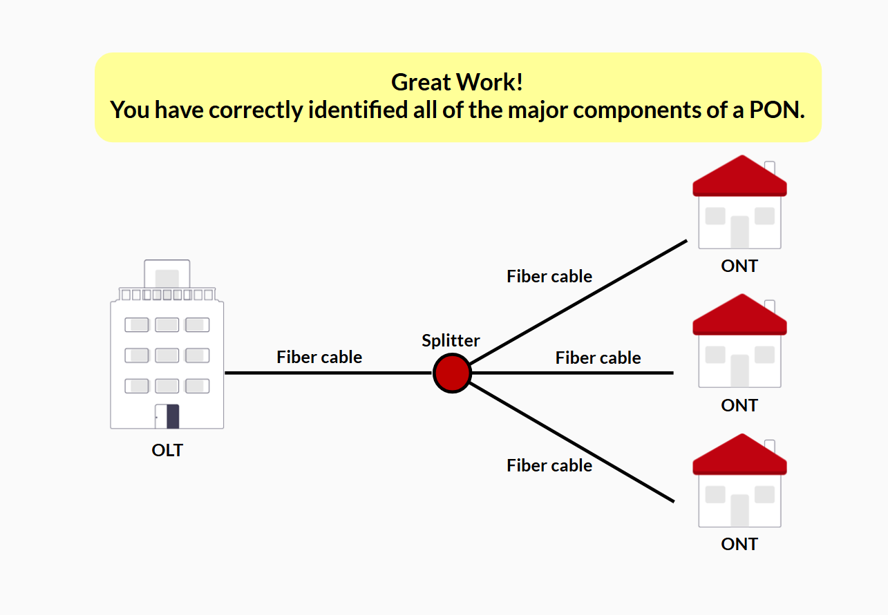


---

# 🧰 Module 3 - Anatomy of a Cable


## 🟣 3.1 - Cutting Fiber

Cutting a fiber optic cable is a common task required for many jobs. There are several tips to keep in mind when performing this task:

1.  Always make sure you have the correct length and location.
    
2.  Too much fiber is always better than coming up short.
    
3.  Handle the fiber with care when preparing the fiber for cutting.
    
4.  Do not bend the fiber too tightly when replacing the cable after cutting.


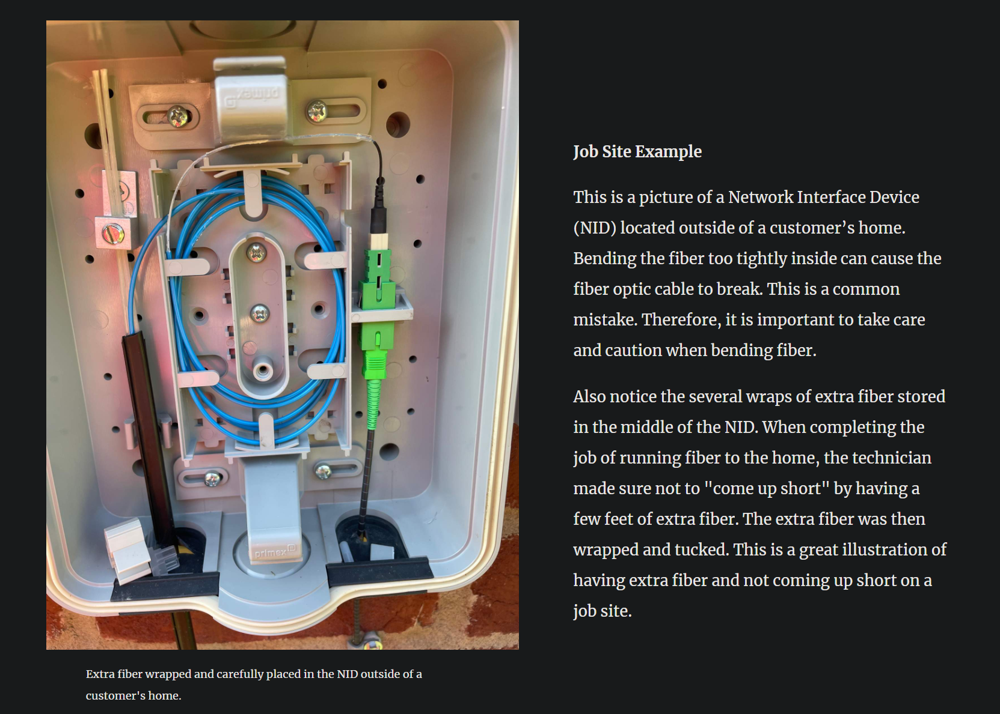

**Job Site Example**

This is a picture of a Network Interface Device (NID) located outside of a customer’s home. Bending the fiber too tightly inside can cause the fiber optic cable to break. This is a common mistake. Therefore, it is important to take care and caution when bending fiber. 

Also notice the several wraps of extra fiber stored in the middle of the NID. When completing the job of running fiber to the home, the technician made sure not to "come up short" by having a few feet of extra fiber. The extra fiber was then wrapped and tucked. This is a great illustration of having extra fiber and not coming up short on a job site. 

---

**VIDEO NOTES:**

- David Thompson Alabama Power
- Measure twice, cut once
- If you don't cut the fiber the right way/ place it can be thousands of dollars mistake
- you can take down a bank, aburn university, a whole city if you are not careful by cutting the wrong thing


---


## 🟣 3.2 - History of Fiber and Color

Scroll through the timeline below, to learn the story of the Fiber Optic industry.

- **1800s**: Since the 1800s, inventors have experimented with communications using light and reflection.

- **1970s**: In the 1970s, researchers discovered that extremely pure forms of glass tubing allowed light signals to travel much faster and farther than metal wires. This discovery began our fiber optics adventure.

- **1980s**: In the 1980s, the first large fiber backbones were placed in the United States. This laid the foundation for a more interconnected world. 

- **1990s**: In the 1990s, the use of Ethernet cables and PONs emerged and the Internet became available to the public.

- **2000s**: In the 2000s, Fiber to the Home networks emerged using PONs and fiber to connect multiple homes with splitters. 

- **2010s**: In the 2010s, high count cables were introduced. 

- **Today**: Today, fiber optic technology provides the backbone for broadband connections and has a wide impact on society.  


---


## 

**Color**

Color has been important throughout the history of fiber. As fiber optic technologies have become more complex, color has become increasingly critical for identifying fibers. A fiber’s **color can indicate its type**, **number in a cable**, etc. Each color in a collection of fibers provides Fiber Optics Technicians critical insight to what they are working with.

In this module, you will learn about the three main categories of color code that Fiber Optics Technicians use today:

1. Outer Jacket Color Code

2. Inner Fiber Color Code

3. High Count Cable Ring Marks

#PROOF

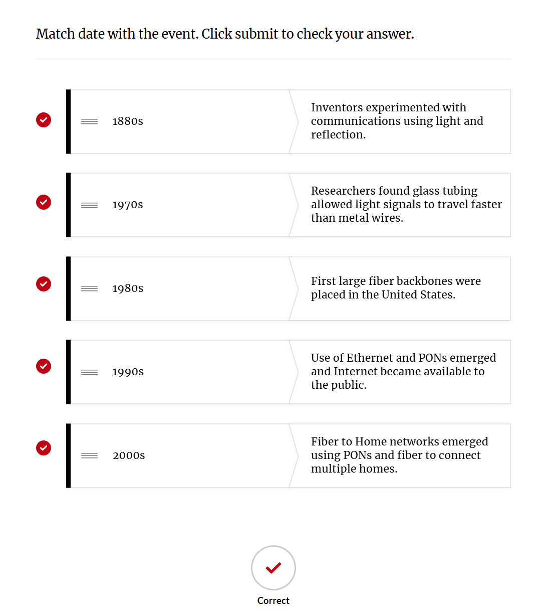

## 🟣 3.3 - Outer Jackets

The first category of color code to learn is the outer jacket color. This is your first piece of information about the fiber in front of you. 

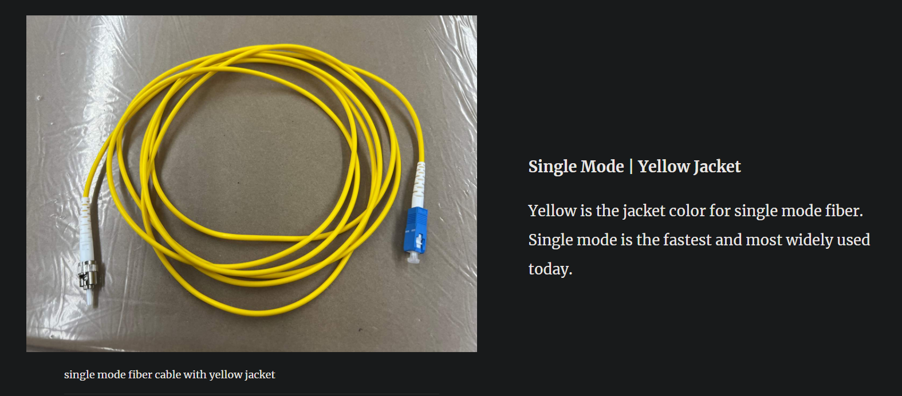

**Single Mode | Yellow Jacket**

Yellow is the jacket color for single mode fiber. **Single mode is the fastest and most widely used today.**

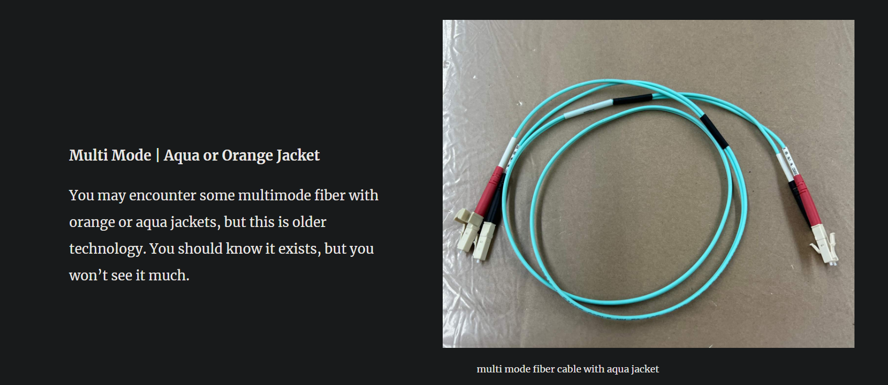

**Multi Mode | Aqua or Orange Jacket**

You may encounter some multimode fiber with orange or aqua jackets, but this is older technology. You should know it exists, but you won’t see it much.

**Color Based on Location**

In addition to single mode and multi mode, you need to know the terms premise cable and outside plant cable (OSP). 


**Premise Cables | Bright Colors**

Premise cables are used to connect devices inside a building. Their jackets have bright colors, like yellow. (or orange, or aqua, or green)

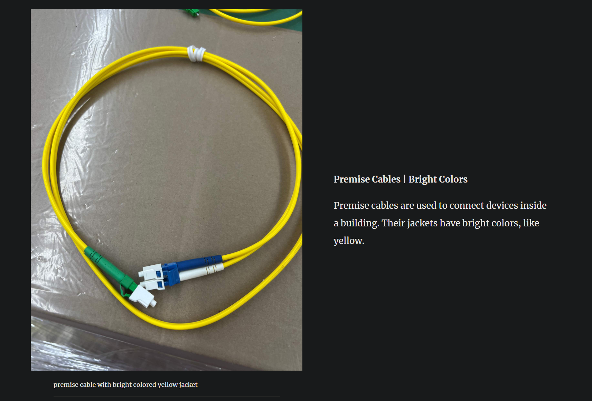

**Outside Plant Cable (OSP) | Black Jacket**

Like the name states, outside plant cables are used outside of buildings. They have more protection from the elements, and are covered in a black jacket. This black jacket helps protect the cables from moisture and sun exposure.

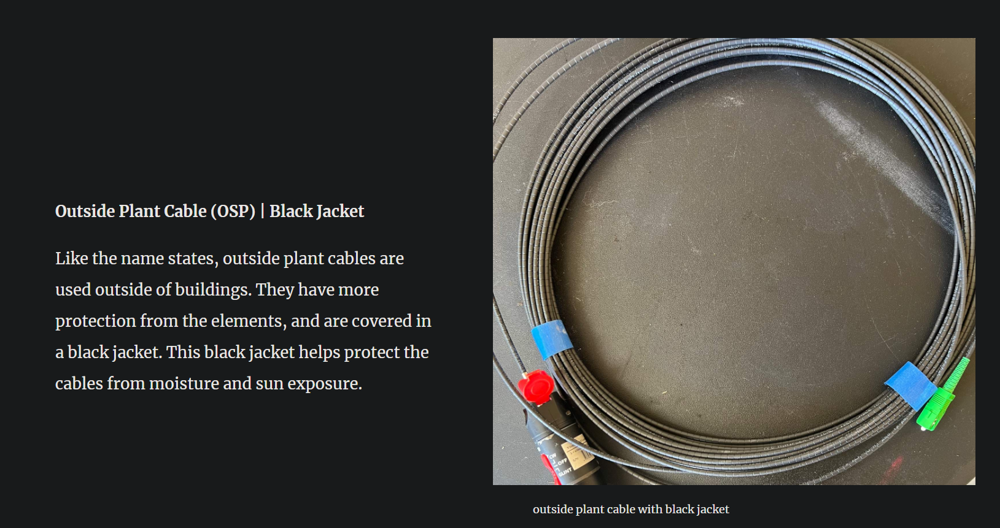

The outer jacket will also have a full description of the cable printed along its length. Everything you need to know is written on the jacket. Click on the hotspots below to learn more. 

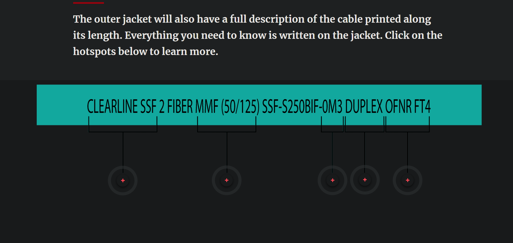


- **Manufacturer:** the company who made the fiber optic cable
- **Fiber type:** MMF = multi-mode fiber; SM = single-mode
- **Fiber grade:** grade of the fiber optical glass inside
- **Construction:** type of cable construction
- **Rating:** cable rating; gives installers info on where this type of fiber optic cable can be safely installed

---


## 🟣 3.4 - Inner Fiber

**Inner Fiber Color Code**

The next color code to memorize is the **inner fiber code**. It’s incredible how many fibers can fit inside a fiber cable. It would be chaos without a predictable order! Optical fiber strands inside a cable are sectioned into **groups of 12 colors**, and these colors repeat in a predictable pattern for easy identification. The color pattern helps techs splice the correct fibers together. Blue coated fibers connect to blue, green to green, pink to pink, and so on.

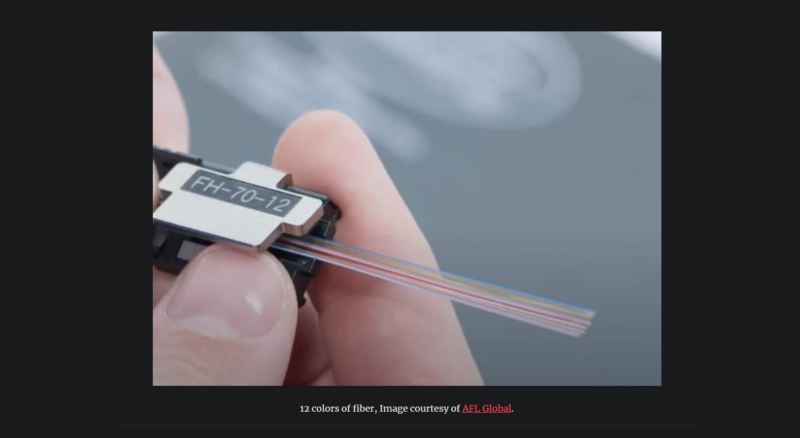

#MNEMONIC

A quick way to memorize these is to **break them into chunks**, like a phone number.  It also helps to have an image to link to each chunk of colors. Below is one idea, but feel free to create your own associations. 

5-GROUPS

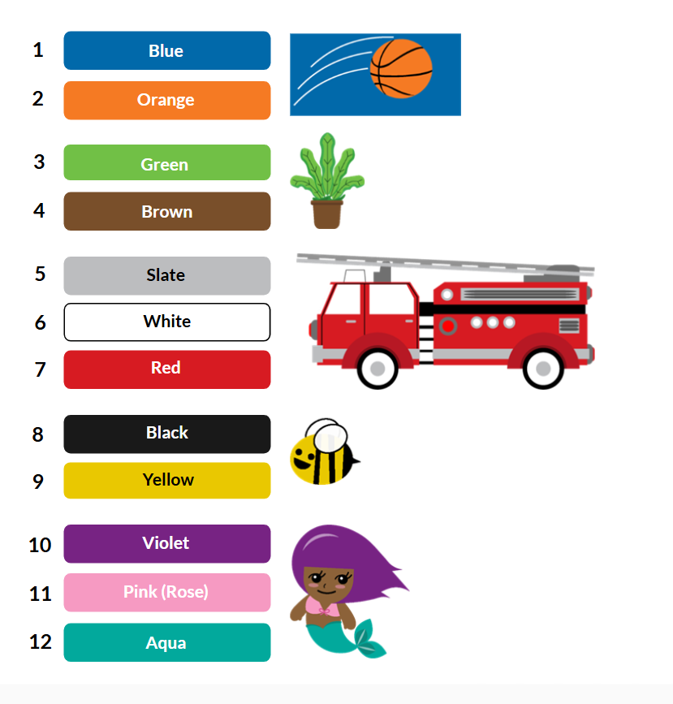

> The orange basketball is about to hit my green plan sitting on top of that red firetruck

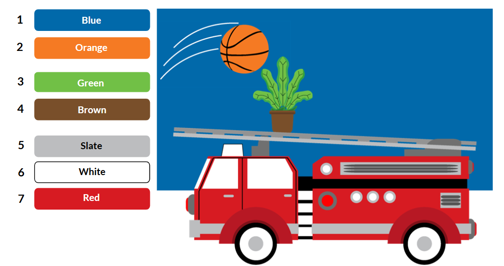

Now there's a bumblebee near my plant and a mermaid sitting on the firetruck


---


## 🟣 3.5 - High Count Cable

Now that you've memorized the 12-color system, let's see what happens when there are more than 12 fibers in a cable! For example, a 48-fiber cable is made up of four sets of 12 fibers each. If there are four blue fibers, how do you know which blue is Fiber 1?

**Binder Units**

When you first enter a high count cable, each set of 12 is grouped as a **binder unit**. Binder units can be wrapped in **binder yarn** or a **buffer tube**. These groupings follow the same 12-color system you learned for individual fibers.

Just like the first fiber in a 12-fiber set is blue, the first binder unit is also blue. Second is orange, third is green, and so on.

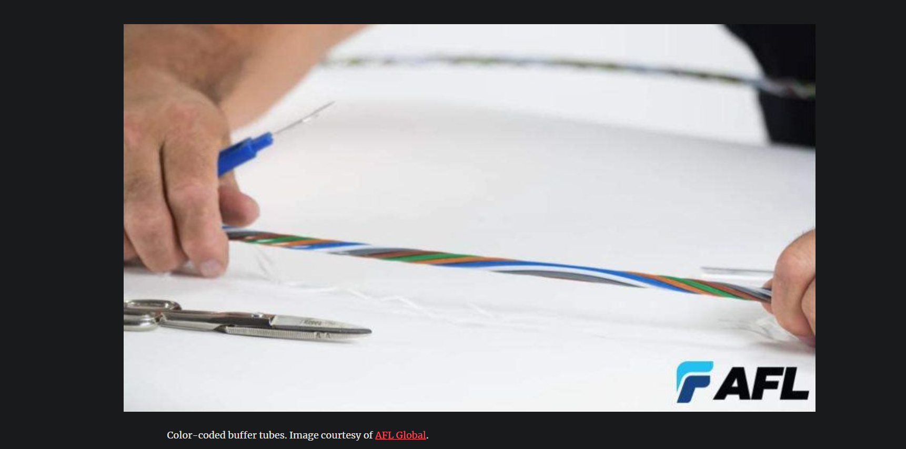

There are lots of different ways to organize the fibers within a cable. They **vary by manufacturer and type of cable**. But one thing is always the same: The 12-color system.


Binder units can contain individual fibers or multiple 12-fiber sets. When each binder unit contains individual fibers, you can use the table below to look up fiber numbers. This table shows the number of each fiber in a 144-fiber cable. It is **arranged by binder unit color (columns) and fiber coating color (rows)**.


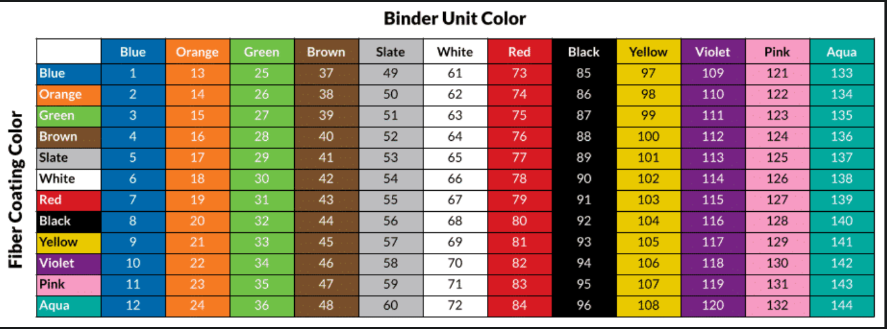

---


If there are multiple 12-fiber sets within each binder unit, each set can be in another binder unit or joined together as a ribbon.

In the image shown here, there are six binder units held together by binder yarn. Within each binder unit, there are 12 ribbons of 12 fibers each.

6 x 6 x 12 = 432 fibers!

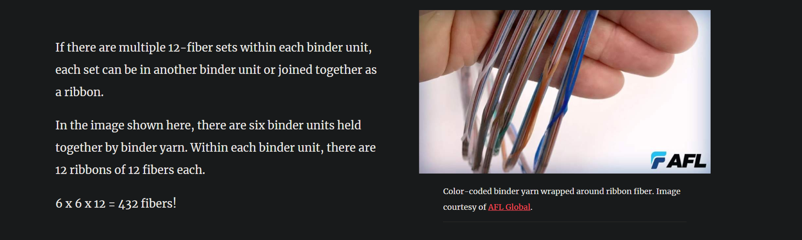

**Did you know high count cables can have more than 12 binder units?**

The **largest cables have 3456 fibers**! That's 24 binder units, with 12 sets of 12 fibers in each.

When binder yarn is used, **each set is wrapped with two strands of yarn**. Binder Units 1-12 have two strands of the same color. Binder Units 13-24 have one colored strand and one clear strand.

For example, Binder Unit 1  will have two blue strands and Binder Unit 13 will have one blue strand and one clear strand.

---

**Ring Markings**

Ring markings are also used to tell fibers apart when there are more than 12. These are especially important when fibers have been removed from their binder units for splicing. Ring markings are also used to number ribbons within a binder unit.

Read through the slides below to learn how ring markings are used.

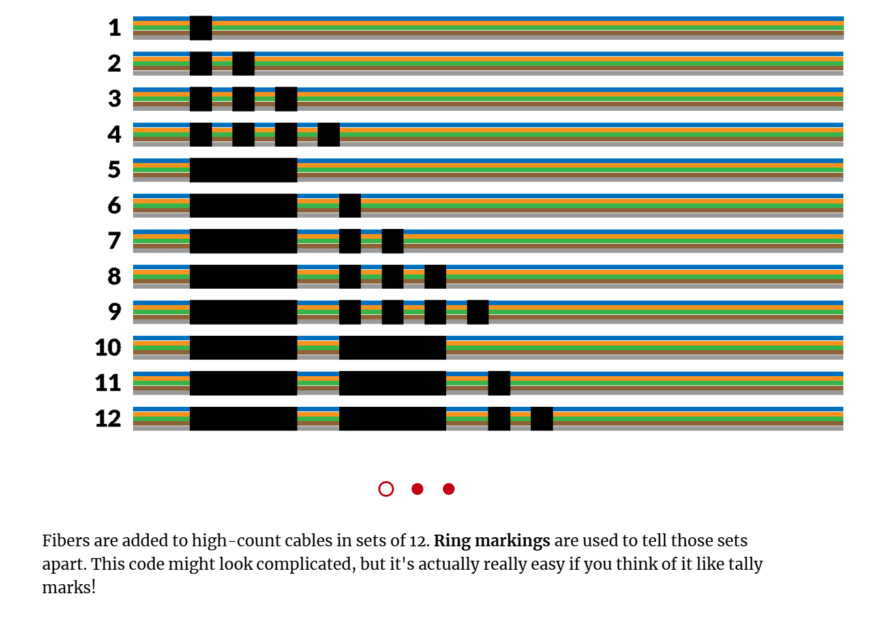

Fibers are added to high-count cables in sets of 12. **Ring markings** are used to tell those sets apart. This code might look complicated, but it's actually really easy if you think of it like tally marks!

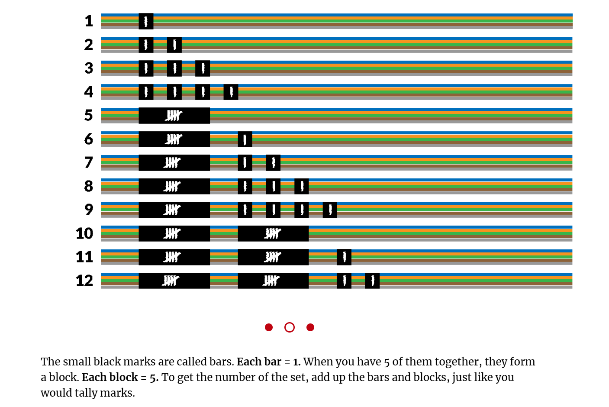

The small black marks are called bars. **Each bar = 1.** When you have 5 of them together, they form a block. **Each block = 5.** To get the number of the set, add up the bars and blocks, just like you would tally marks.

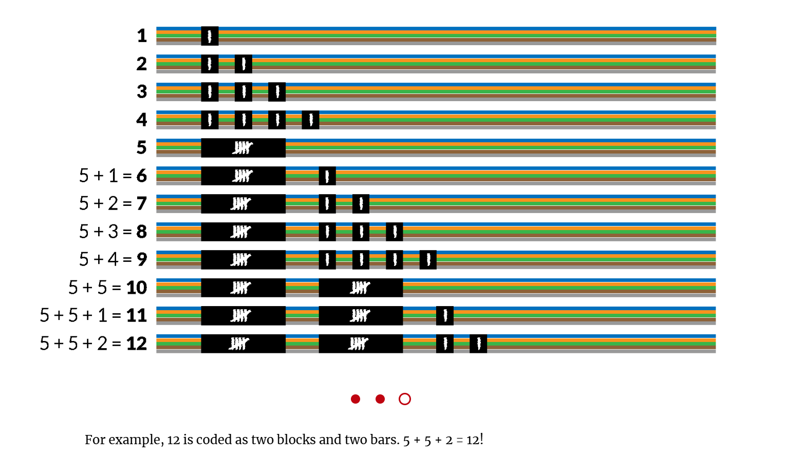

For example, 12 is coded as two blocks and two bars. 5 + 5 + 2 = 12!


---


## 🟣 3.6 - Cable Construction

All fiber cables will have the same basic parts (core, cladding, strength members, etc.), but there are lots of ways for manufacturers to arrange these parts. Click through the slides to learn more about a few common arrangements. 

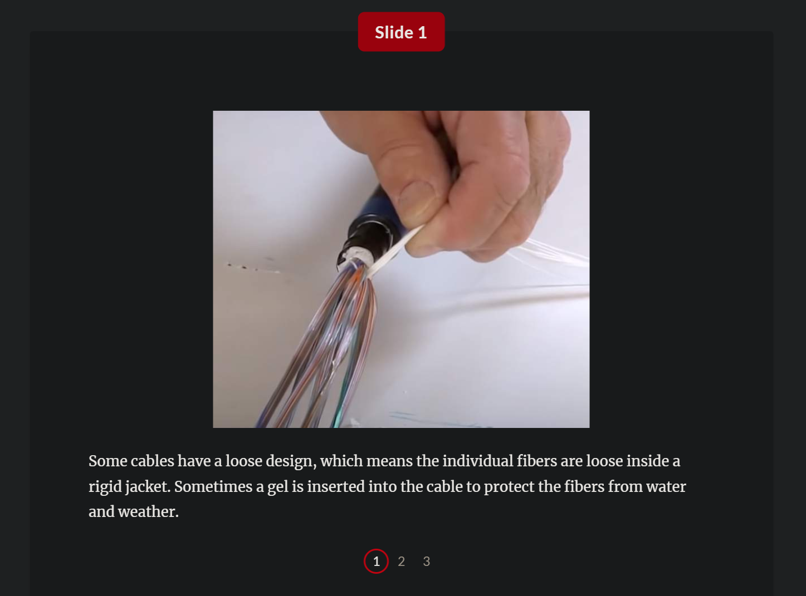

Some cables have a loose design, which means the individual fibers are loose inside a rigid jacket. Sometimes a gel is inserted into the cable to protect the fibers from water and weather.


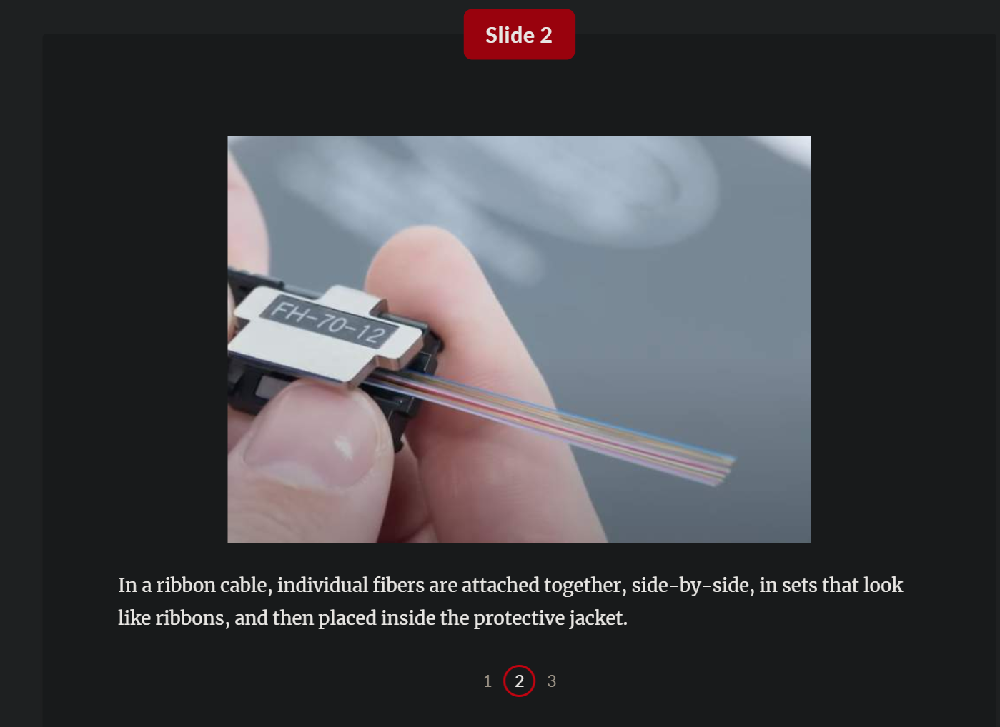

In a ribbon cable, individual fibers are attached together, side-by-side, in sets that look like ribbons, and then placed inside the protective jacket.  

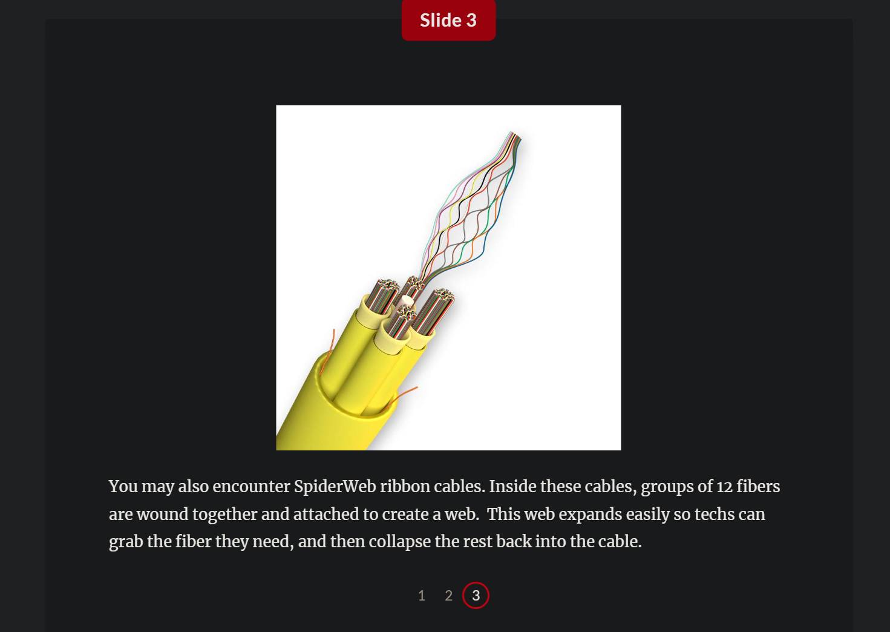

You may also encounter SpiderWeb ribbon cables. Inside these cables, groups of 12 fibers are wound together and attached to create a web.  This **web expands easily** so techs can **grab the fiber they need, and then collapse the rest back into the cable**.

**Evolving Technology**

Fiber technology is always evolving, getting faster and more efficient. Therefore, keeping up to date on new equipment, manufacturers, and changes to color standards and processes is important. Learning about the basic technology and color standards in this course is just the beginning of your journey.


---


## 🟣 3.7 - Simplex and Duplex Fiber Cables

Fiber cables are made in two forms: Simplex and Duplex. 


**Simplex Cables**

Simplex cables contain a single strand of fiber, and are used to send a signal in one direction. Simplex fiber is like a one-way street. 

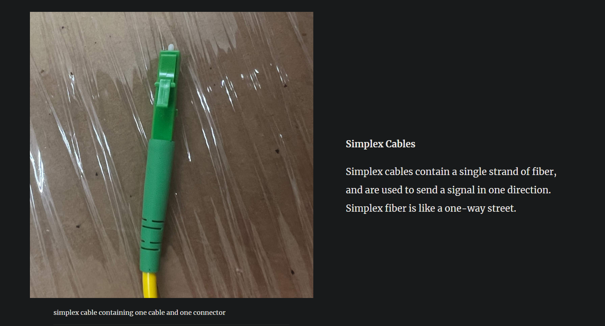

**Duplex Cables** 

Duplex fiber cables have two fibers, held together in a zipcord style. ***Duplex cables are used with devices that require separate send and receive fibers.***

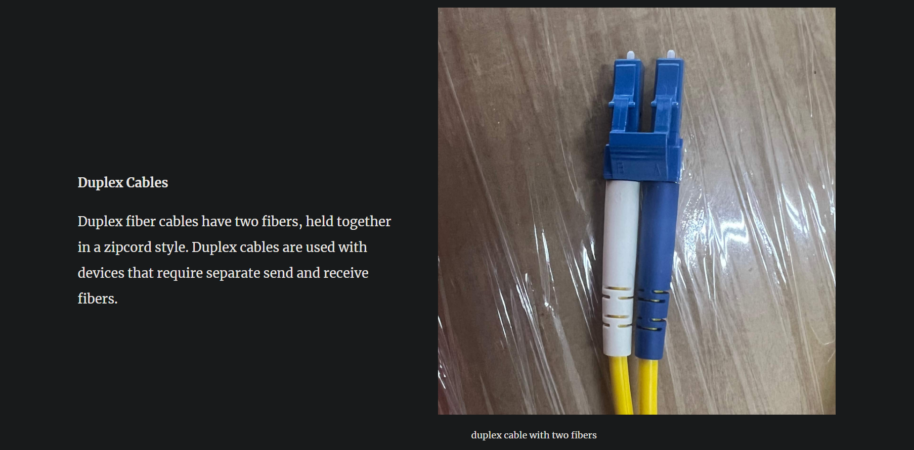


#PROOF


---


# 🧰 Module 4 - Connector Types

## 🟣 4.1 - Fiber Optic Connectors

A fiber optic cable is not complete without its connector. When you think about a connector, you probably envision an ethernet plug - they’re everywhere. A fiber connector is the same thing in the fiber world, it just looks a little different. You have this incredibly fast fiber cable sending data at lightning speeds to customers, but you can’t plug a bare fiber into your equipment. You need a connector to correctly align the fiber and then hold it in place snugly. 

Like all technologies, connectors have evolved over time. Each generation of connectors retains more and more signal strength as light travels through the connector to the device. If you search for fiber connectors on the internet, you’ll be overwhelmed by the variety of connectors available. To be a successful tech, though, you can focus on the three most common connectors: LC, SC and ST. Each of these styles comes in simplex (single fiber) or duplex (double fibers). Let’s take a quick look at these three styles.

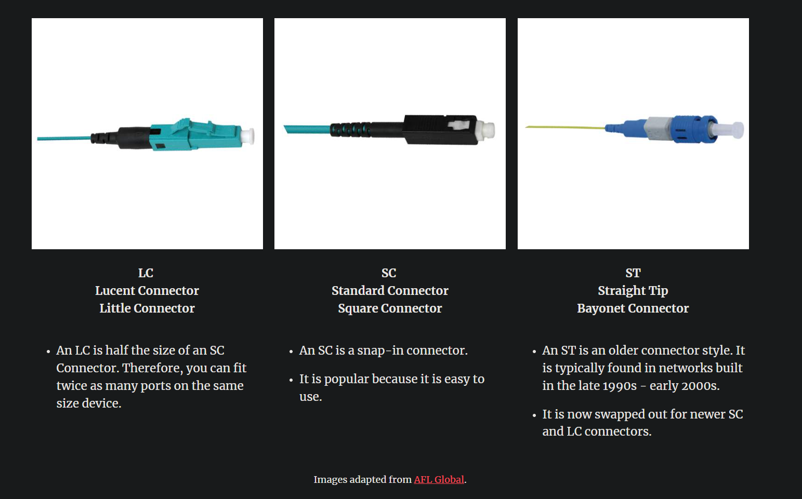

LC 

Lucent Connector

Little Connector


An LC is half the size of an SC Connector. Therefore, you can fit twice as many ports on the same size device.
SC Connector
SC 

Standard Connector

Square Connector


An SC is a snap-in connector. 
It is popular because it is easy to use.
ST Connector
ST

Straight Tip

Bayonet Connector


An ST is an older connector style. It is typically found in networks built in the late 1990s - early 2000s. 
It is now swapped out for newer SC and LC connectors. 


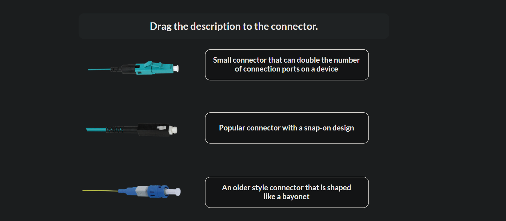

---


## 🟣 4.2 - Parts of a Fiber Optic Connector

It’s important to be able to identify different kinds of connectors, because each one fits into a specific receptor. Just like you can’t plug an ethernet cable into a fiber port, you can’t plug an SC connector into an ST port. So how do you know which connector to use? 

Most of the time, your company will give you the exact equipment you need to make a connection. Though you won’t have to make that decision often, understanding your equipment will help you be a more successful fiber tech.

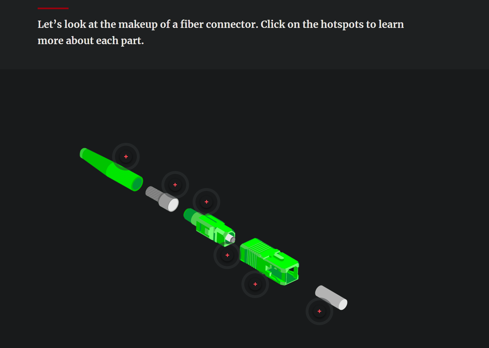

**Boot / Bare Buffer**

Covers the joint where the fiber and the connector meet. Gives extra strength to the fiber and keeps the cable from bending too sharply near the connection.

**Crimp Eyelet**

Holds the fiber in place, and transfers any pulling or pushing force from the fiber to the connector.

**Connector Sub Assembly**

Holds ferrule in place


**Ferrule**

A tube made of ceramic or metal with a precise hole drilled through the middle. A bare fiber is inserted into the ferrule, and is held in proper alignment.

**Connector Housing**

Covers the sub assembly and has the mechanism that clicks the connector into a receptor.

**Dust Cap**

Keeps dust and debris out of the connector when it is not plugged in.


---

Great job learning about the parts of a fiber optic connector! Now let's take a look at what each of these parts may look like when coming out of packaging from a manufacturer. The interactive below includes the three types of connectors that you learned about earlier in this course: ST, SC, and LC. As you click through, notice that the look of the dust cap and boot vary slightly in appearance for ST, SC, and LC. 


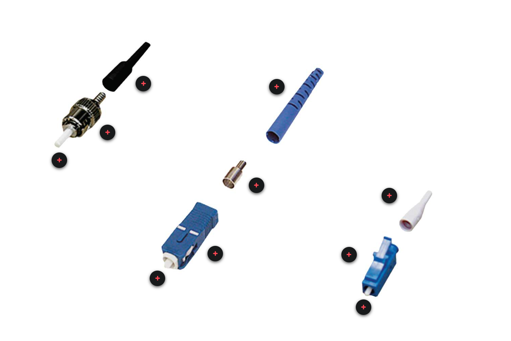


**End Faces**

When you hear fiber techs talk about connectors like LC and SC, you’re also going to hear them say ‘LC APC connector,’ or ‘SC UPC connector.’ What do these additional letters stand for and what do they mean? They are describing the shape of the ferrule’s **end face**. The end face is where the ferrules touch one another.

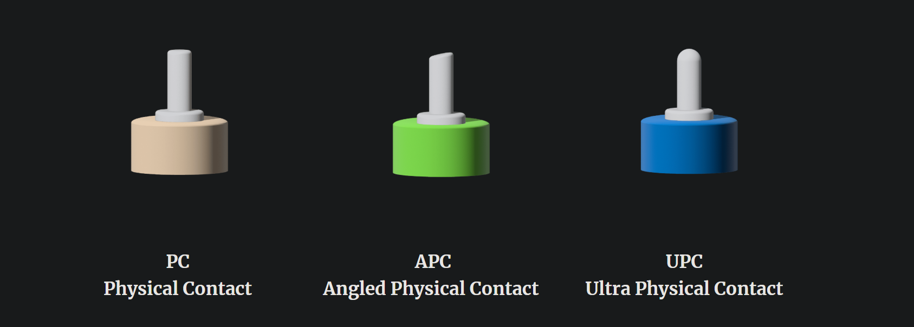


PC

Physical Contact

APC Angled Physical Contact
 APC

Angled Physical Contact

UPC Ultra Physical Contact
UPC

Ultra Physical Contact

Remember, the goal is to reduce the amount of signal loss in every connection. Curved and angled end faces create less back reflection when they touch than flat end faces. This is important to know because you have to match adapters with the correct connector style (LC, SC, ST), and also with the correct type of endface (UPC, APC). For example, an ***LC- UPC connector paired with an LC-APC connector will not work together.***

> - goal is to reduce the amount of signal loss in every connection

---


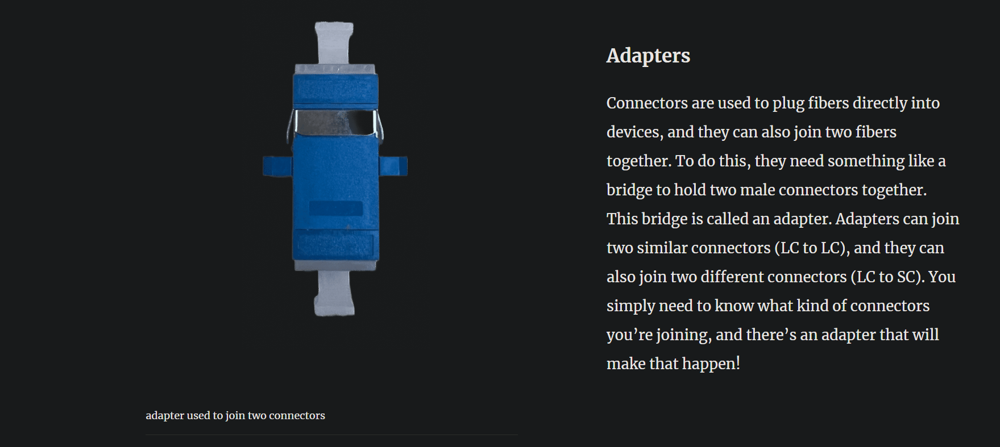

**Adapters**

Connectors are used to plug fibers directly into devices, and they can also join two fibers together. To do this, they need something like a bridge to hold two male connectors together. This bridge is called an adapter. Adapters can join two similar connectors (LC to LC), and they can also join two different connectors (LC to SC). You simply need to know what kind of connectors you’re joining, and there’s an adapter that will make that happen!

> - #TIP:  Adapters can not only adapt between genders, but also between connector typs (SC, ST, etc.)

---


## 🟣 4.3 - Naming Connectors

Wow! You have learned a lot about fiber so far in this course! Let's take a minute to review and practice some concepts. Click on the card to flip and check your answer. 

Great job reviewing several concepts covered so far in the course. Now let's practice combining these concepts together.  

Practice One

Looking at the picture below and decide:

Is the cable Duplex or Simplex?
Is the cable Single Mode or Multi Mode? 
What is the connector type on each side: LC, SC, or ST? 
Check your answer by clicking on the hotspots.


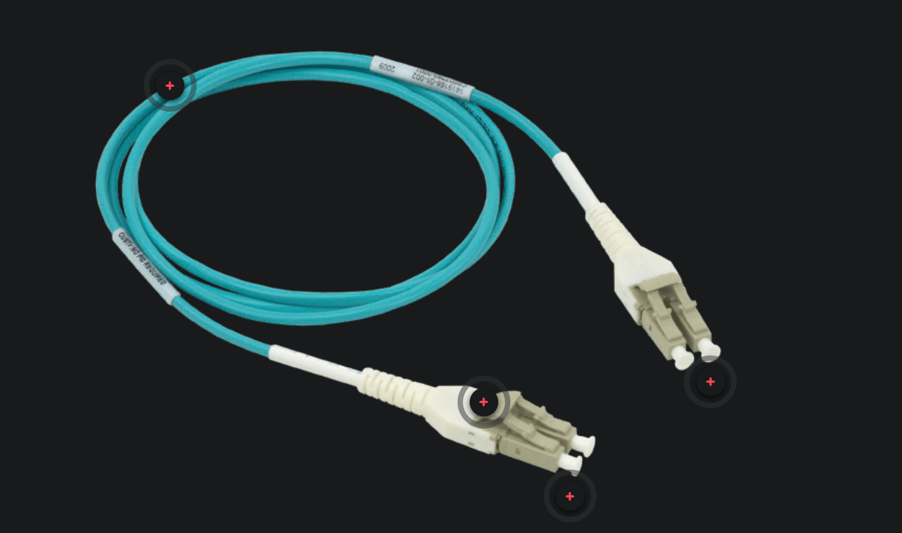


Great job! This is a LC to LC Duplex Multi Mode Fiber Optic Cable!

---


Practice Two

Looking at the picture below and decide:

Is the cable Duplex or Simplex?
Is the cable Single Mode or Multi Mode? 
What is the connector type on each side: LC, SC, or ST? 
Check your answer by clicking on the hotspots.

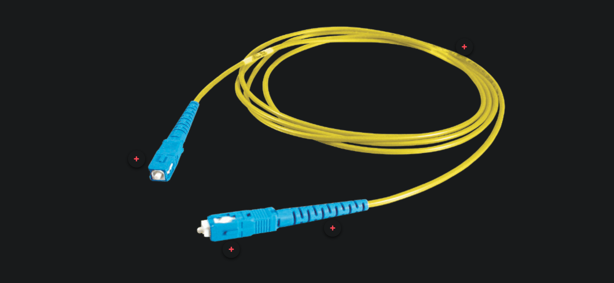

Great job! This is a SC to SC Simplex Single Mode Fiber Optic Cable!


---

#PROOF


---


# 🧰 Module 5 - Preparing

## 🟣 5.1 - Preparing for the Workday

We’re finally jumping into the big fiber story and going to work! Before we start spooling fiber off our trucks and splicing, we need to talk about how important it is to be prepared each day. Arriving prepared for the day will make you a valuable member of your fiber team.  Let’s learn **how successful fiber techs prepare for the job each day**.

---


- [x] Wear appropriate, clean work clothes.
- [x] Know where the crew is meeting. A central office or a location in the field?
- [x] Factor in travel time and traffic, so you don’t feel rushed.
- [x] Arrive on time. Each day is scheduled in time slots. If you’re late, it affects the entire day.
- [x] Take care of personal needs like food before work.
- [x] Check personal equipment in your toolbox or belt to be sure it is clean and ready.
- [x] Inventory equipment on your truck or splice trailer.

---

## Workspace Scenarios: #CASE_STUDY


> - #TIP: Build the habit of checking your tool belt or box after each job, and again before work begins each day.


---

## 🟣 5.2 - Safety Procedures

#VIDEO - Alabama Power Skills for Success

- David Thompson
- Saftety is first concern
- Diff applications depending on where you are workintg
- Put out cones, traffic control, signs
- Alabama Power gives you all the safety equipment you need
- They give you a blank check to buy cones saftey glasses hard hats (PPE - personal protective equipment)
- They give all that to you
- training, manuals on traffic control, lockout tagout, the training is phenomenal
- they want you to go home to your family safely at night

---

Safety is extremely important. Like David said in the video, your company will have ongoing training sessions on best practices and safety equipment, and they will teach you exactly how to use their equipment. Click through the slide deck below, to learn safety basics for working with fiber.

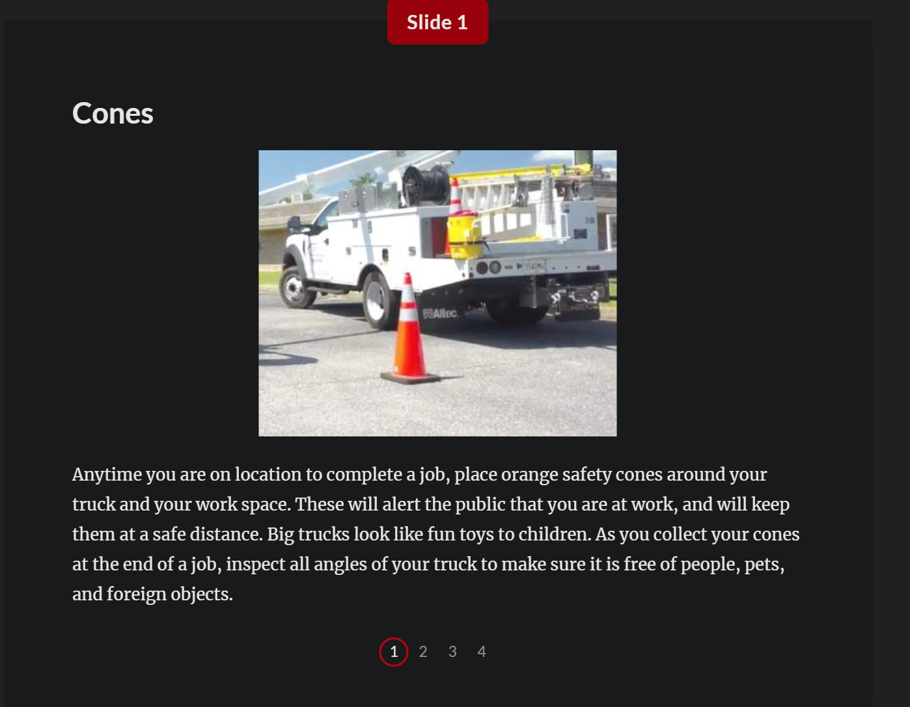

**Cones**

bucket truck with orange cone placed near the back
Anytime you are on location to complete a job, **place orange safety cones around your truck and your work space**. These will alert the public that you are at work, and will keep them at a safe distance. Big trucks look like fun toys to children. As you collect your cones at the end of a job, inspect all angles of your truck to make sure it is free of people, pets, and foreign objects.

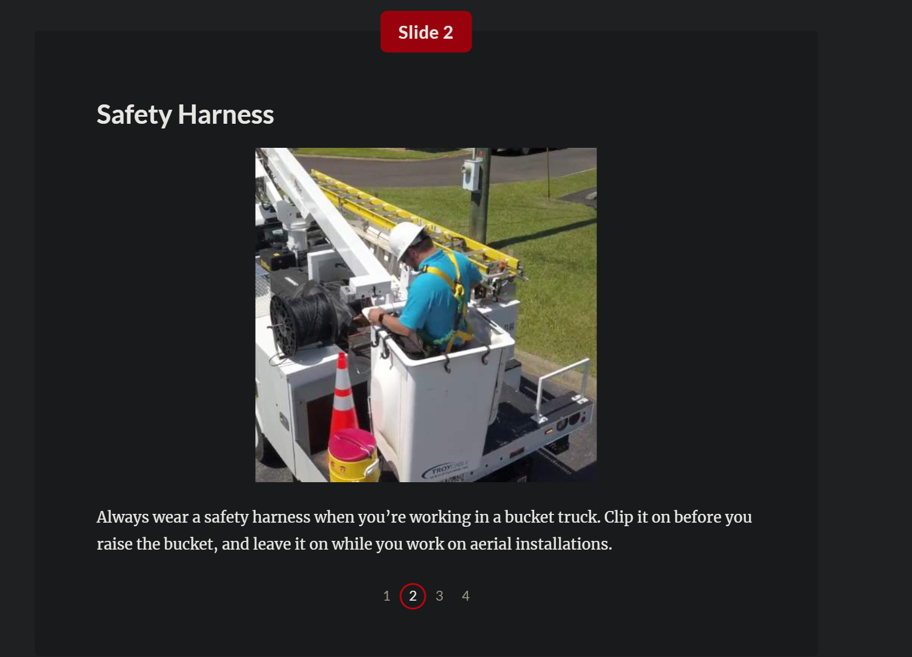

**Safety Harness**

technician in bucket of truck wearing a safety harness
**Always wear a safety harness when you’re working in a bucket truck.** Clip it on before you raise the bucket, and leave it on while you work on aerial installations.

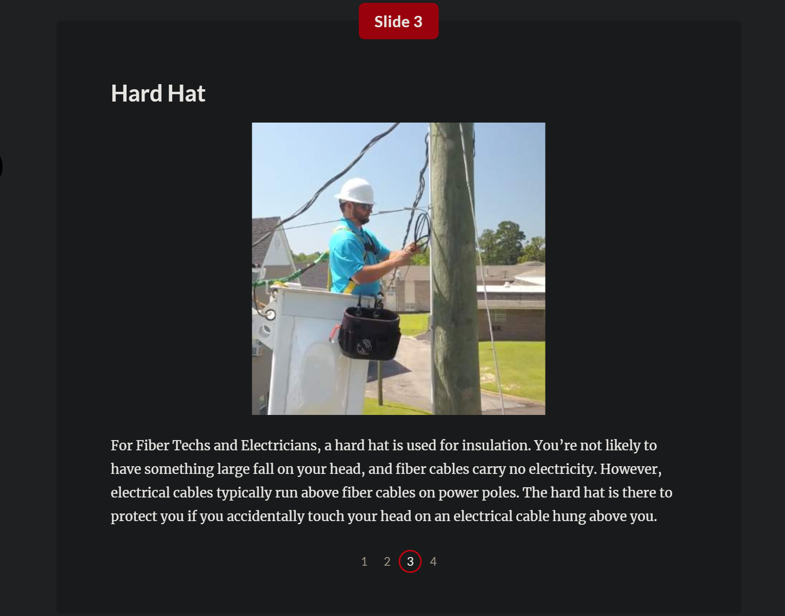

**Hard Hat**

technician in bucket of truck wearing a hard hat
For Fiber Techs and Electricians, a hard hat is used for insulation. You’re not likely to have something large fall on your head, and fiber cables carry no electricity. However, electrical cables typically run above fiber cables on power poles. The hard hat is there to protect you if you accidentally touch your head on an electrical cable hung above you.

**Ladders**

***Climbing a tall ladder and working up high can take some getting used to.*** Always wear a climbing harness when you’re on a ladder. It allows you to free both hands to do your work, and it keeps you tethered securely to the pole while you’re working.

> - ⚠️ #GOTCHA: Always wear a climbing harness when you’re on a ladder!


---

## 🟣 5.3 - Professional Perspective

#VIDEO

- David Thompson
- he started as a telecommunications electrician power delivery
- everything was analog, now all converted to VOIP to digital
- Everything has been converted from Tandy portable suitcase computer to Worldwide WEb
- our tech is in the middle if not leading in a lot of tech
- on leading edge of tech, getting trained, every day something new
- he graduated in 82 in a degree in electronic theory
- he thinks the job he does now probably makes more than a computer science role


---

## 🟣 5.4 - Typical Workday

The roles and responsibilities of a Fiber Optic Installer can vary based on company. Below you will find the description of three different typical workdays. For some small companies, a Fiber Optic Installer may be required to perform the tasks included on all three tabs. Where larger companies may have the work divided out to specialized roles: Installer Technician, Lineman, and Underground Installer.

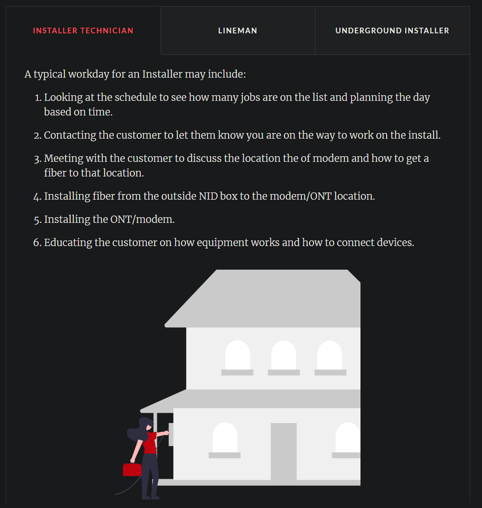


A typical workday for an Installer may include:

1.  Looking at the schedule to see how many jobs are on the list and planning the day based on time.
2.  Contacting the customer to let them know you are on the way to work on the install.
3.  Meeting with the customer to discuss the location the of modem and how to get a fiber to that location.
4.  Installing fiber from the outside NID box to the modem/ONT location.
5.  Installing the ONT/modem.
6.  Educating the customer on how equipment works and how to connect devices.

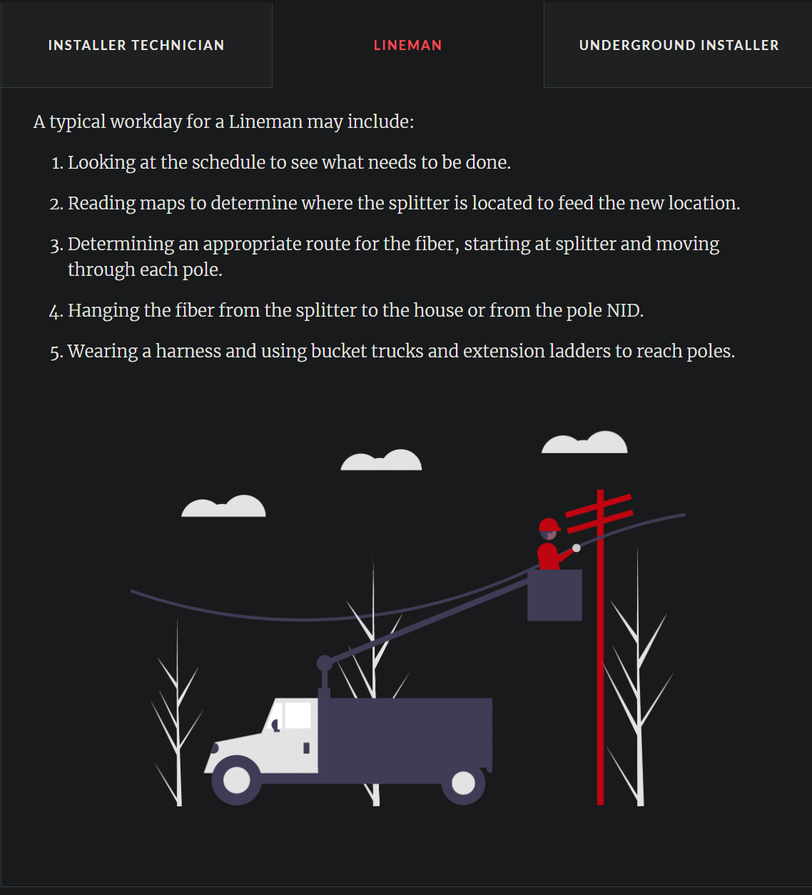

A typical workday for a Lineman may include:

1.  Looking at the schedule to see what needs to be done.
2.  Reading maps to determine where the splitter is located to feed the new location.
3.  Determining an appropriate route for the fiber, starting at splitter and moving through each pole.
4.  Hanging the fiber from the splitter to the house or from the pole NID.
5.  Wearing a harness and using bucket trucks and extension ladders to reach poles.

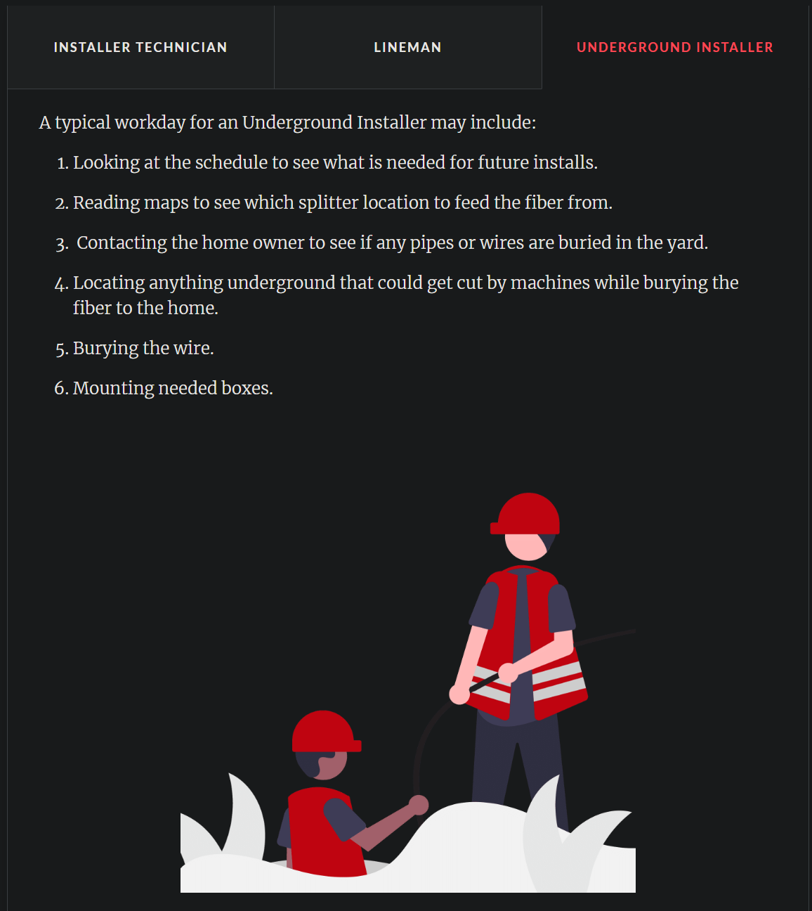


A typical workday for an Underground Installer may include: 

1.  Looking at the schedule to see what is needed for future installs.
2.  Reading maps to see which splitter location to feed the fiber from.
3.   Contacting the home owner to see if any pipes or wires are buried in the yard.
4.  Locating anything underground that could get cut by machines while burying the fiber to the home.
5.  Burying the wire.
6.  Mounting needed boxes.

Depending on location, some companies separate the Installer Technician role into Outside and Inside Installers. Outside Installers place the fiber into the outside NID box and run the fiber into the home. The Inside Installers then pick up the remaining in-home parts of the installation.


> ## 🧭 Definition: NID
> 
> **NID = Network Interface Device.** In fiber work, it is a protected enclosure/connection point for fiber—used to terminate, splice, manage slack, and protect the connection from weather and strain. [corning](https://www.corning.com/optical-communications/asean/en/home/products/network-interface-devices-nids.html)
> 
> ## In the described job
> 
> The likely path is:
> 
> **Splitter → fiber distribution cable/terminal on poles → pole NID or terminal → fiber drop cable → house-side NID → indoor ONT/router** 🌐➡️🏠
> 
> - A **splitter** divides one optical signal to serve multiple customer drops; it can be housed in a pole-mounted or other outdoor enclosure. [weunionfiber](https://www.weunionfiber.com/how-does-a-fiber-optic-splitter-work-a-comprehensive-guide/)
> - A **pole NID** is an enclosure on a utility pole where a technician may access or connect the fiber drop. 📍
> - A **house NID** is the exterior box at the customer location where the aerial drop cable terminates and is protected. From there, fiber continues toward the ONT inside. 🏠🔧
> - The **ONT** is generally the powered device that converts the fiber’s optical signal into usable Ethernet/Internet service—not the NID. 💡➡️🖧


---

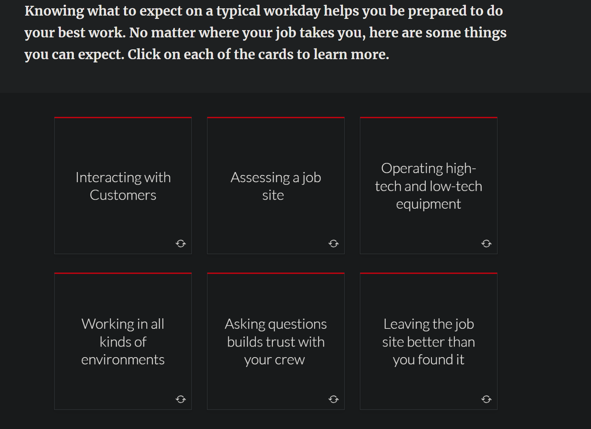

1.  ▶️ Interacting with Customers
    ◀️You represent your company! Customers getting internet for their homes are excited to see you. Customers with service outages will be stressed and need understanding.
   
2.  ▶️ Assessing a job site  
    ◀️You’ll begin making decisions based on what you see as you arrive at each location.
    
3.  ▶️ Operating high-tech and low-tech equipment
    ◀️For some job tasks, you’ll use equipment worth thousands of dollars. Other tasks will require you to use wire strippers and pliers.
    
4.  ▶️ Working in all kinds of environments
    ◀️Some tasks can be completed in an air conditioned trailer. Others are outside on the side of a truck. Fiber Optic work continues in all seasons, even in the rain!
    
5.  ▶️ Asking questions builds trust with your crew 
    ◀️It’s always better to ask questions than pretend to know something you don’t. Your crew is there to support you.
    
6.  ▶️ Leaving the job site better than you found it
    ◀️Clean up all trash, organize your equipment, inform the customer of the work you’ve completed and how that work benefits them.


#PROOF


#PROOF #GRADES thru Quiz 5


---


# 🧰 Module 6 - Splicing

## 🟣  6.1 - Tools of the Trade

Fiber Optics Technicians complete many tasks during a workday. Watch the video below to learn about the first skill Eric learned in the field.  

#VIDEO

- Eric Smith - C Spire
- First skil he used wsas splicing fiber, cleaning, cleaving, wrapping
- You can do it in your sleep after awhile
- Give everyone about a year to get comfortable with it. A year and a half

---

**Splicing**

Welcome to the action part of the story: splicing! In this part of the course, you’ll watch fiber techs perform the surgical skills needed to splice (join) two fiber optic cables together.

Splicing happens thousands of times a day in Alabama, but you’re needed to do even more! As a Fiber Tech, you’ll work in air conditioned splice trailers, on the side of a truck out in the country, or even in the air in a bucket truck!

Whether you’re connecting two large 288-count fiber cables together near a commercial data center or a single fiber to a home, you’ll work with both very high-tech and very old school tools to complete your splices. During the hands-on lab, you’ll get to practice splicing fibers hundreds of times, doing exactly what the techs in these videos are doing. Your splicing skills will connect your Alabama neighbors to the fiber optic story. Let’s take a look at some industry professionals in the field using tools.

---

#VIDEO

- Alabam Power
- Fujikure 90s: 
  - single fibers, use to do actual splicing and to heat the tubes up
  - Cleave with CT50 cleavers
  - 3 degrees is the max that it will splice at
  - Use corning fiber gel cleaner and fiber-clean
  - even a small particle can cause a disruption in traffic from micro bends
  - 3 different types of strippers - clean everything off the fiber, then wipe it down, then cleave it

---


## 🟣  6.2 - Splicing a Fiber Cable

As you learn more about splicing, you will find there are several splicing methods used in the field. **Fusion splicing** is a common splicing method used **for connecting single mode fiber**. This method permanently binds the ends of two fibers together using the heat of an electric arc. The table below shows the pros and cons of fusion splicing. 

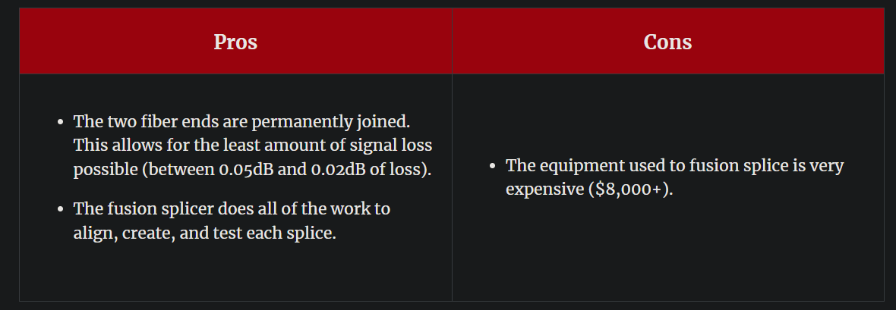

| Pros | Cons |
| --- | --- |
| *   The two fiber ends are permanently joined. This allows for the least amount of signal loss possible (between 0.05dB and 0.02dB of loss).  <br>    <br>*   The fusion splicer does all of the work to align, create, and test each splice. | *   The equipment used to fusion splice is very expensive ($8,000+). |

**TOOLS:**


**Fiber Cutters**

This tool is used to cut the fiber through all parts before stripping.

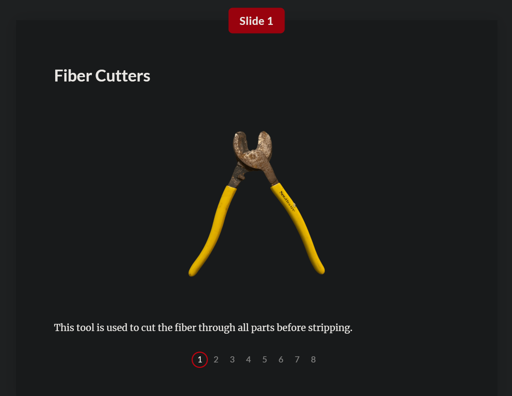

**Fiber Stripper**

This tool is used to cut off the buffer tube without damaging the fiber. Next, it is used to remove the cladding. 

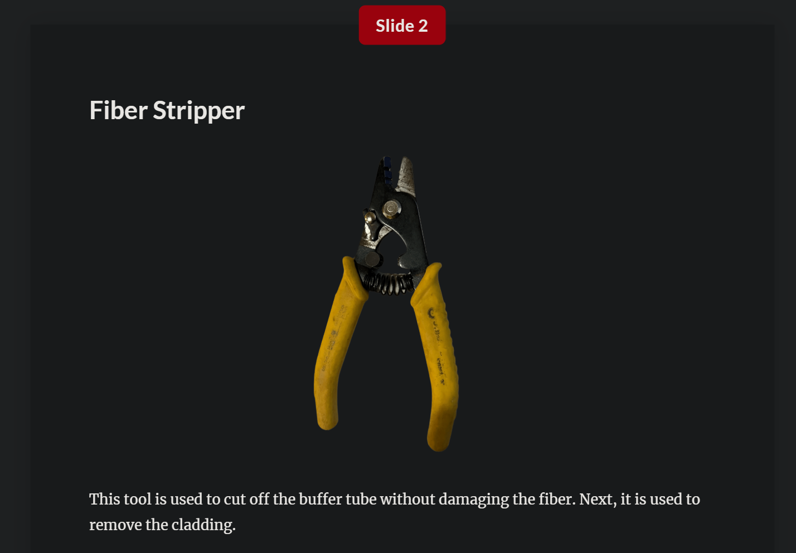


**Needle Nose Pliers**

This tool is used to pull away the outer jackets to get to the fiber. 

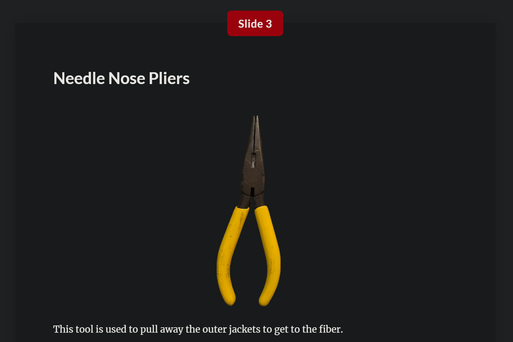


**Optical Cleaning Wipes**

This tool is used to remove the weather gel from the fiber.  It is also used to clean the fiber before it is cleaved and terminated. 

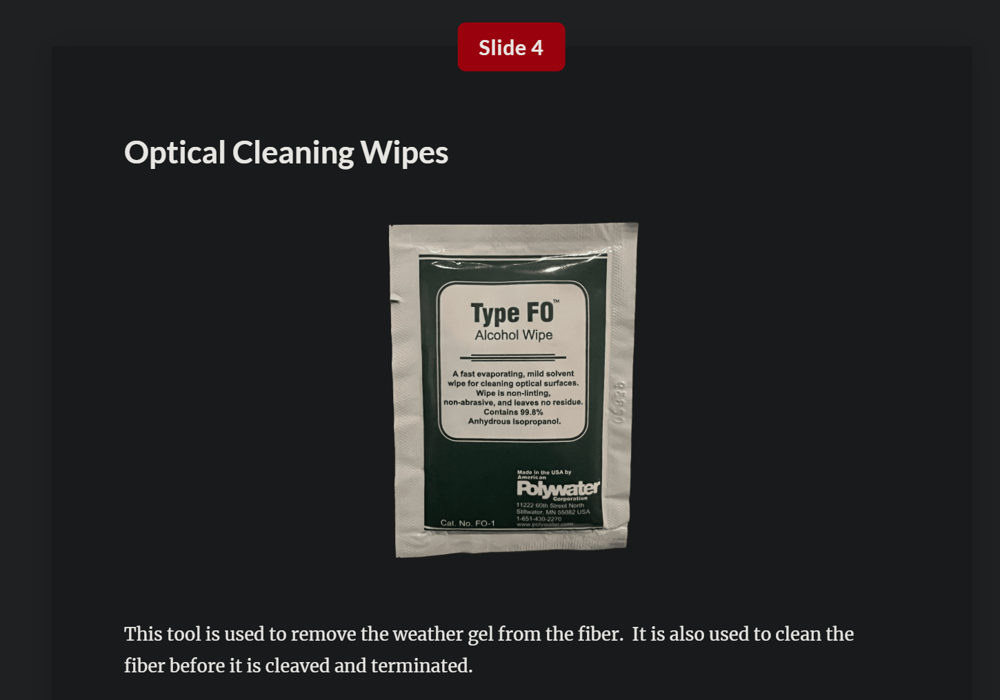


**One Click Cleaner**

This tool is used to clean the end of the fiber connector, before plugging it into any equipment. 

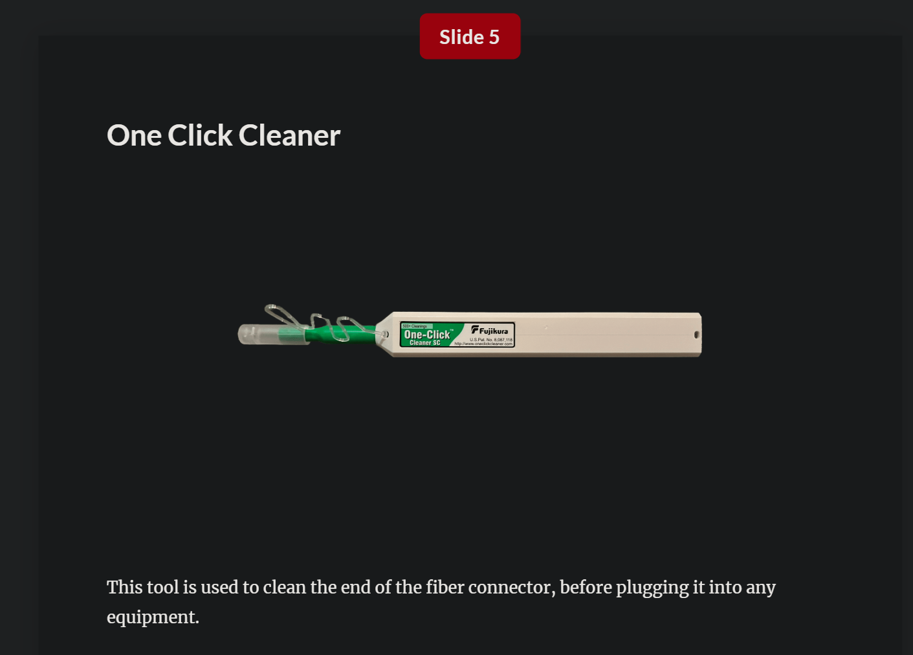


**Cleaver**

This tool is used to cut the stripped fiber to the exact length needed for a splice. 

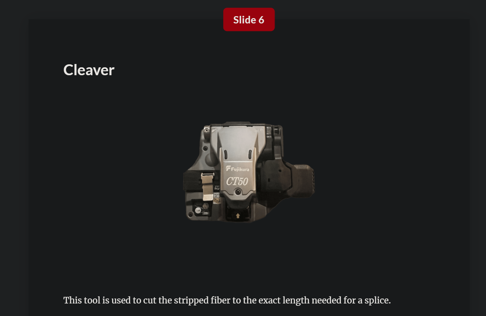


**Fusion Splicer**

This tool is used to "weld" or terminate the fibers together for a more pure connection. 

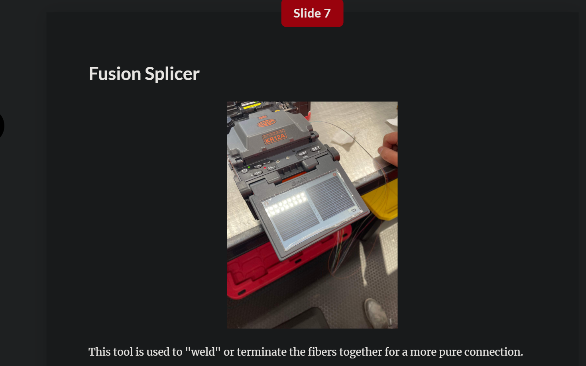


**OTDR**

This tool is used to test the performance of newly installed fiber links and to detect problems that may exist in them.  Its purpose is to detect, locate, and measure elements at a location on a fiber optic link. **OTDR works like radar**.  It sends a pulse down the fiber and looks for a return signal.  Simply by connecting one end of the fiber, an OTDR can calculate **fiber attenuation, uniformity, splice and connector**.  In simple terms, it will test a fiber to make sure the signal is good or detect the location of a break or a bad termination. 

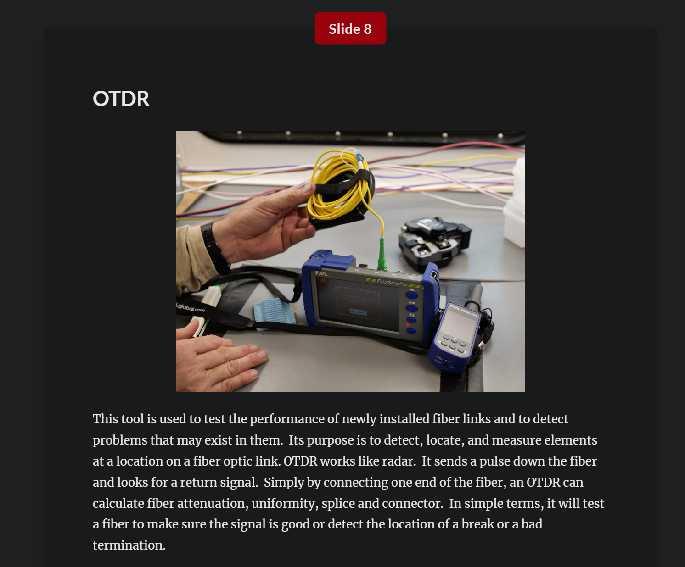


---

Read and answer each question.  Check your answer by flipping the card. 

1.  ▶️ What is a fusion splice?
    ◀️ A connection of two fibers using heat to join them
    
2.  ▶️ What does a fusion splice do?
    ◀️ Permanently binds two fibers together via the heat of an electric arc.
    
3.  ▶️ What tools are required for fusion splicing?
    ◀️ Fiber stripper, pliers, optical cleaning wipes, cleaning alcohol, cleaver, heat shrink sleeves, fusion splicer, and OTDR.
    
4.  ▶️ What’s great about a fusion splice?
    ◀️ The machine does all of the work to align, create, and test each splice. It is a permanent joining with the least amount of signal loss, 0.05 - 0.2dB.
    
5.  ▶️ Any drawbacks to fusion splicing?
    ◀️ The equipment is very expensive ($8000+).
    
6.  ▶️ On which type of fiber is fusion splicing used? 
    ◀️ When splicing single mode fiber.

---

> - #TIP: The fusion splicer will test the fiber after fusing


---


## 🟣  6.3 - Fusion Splicing


Now let’s look at a fusion splice, step by step. Remember, you’ll get hands-on practice with these steps over and over in the lab portion of this course. You’ll also have lots of help on the job as you learn this new skill.

#VIDEO

- insert one side of the fiber in the splice protective sleeve
- Strip the fiber's coating
- Clean the fiber with alcohol wipes removing any dirt or coating particles
- Cleave the ends of the fibers precisely at a 90degree angle
- Brace the fibers in the fusion splicing device
- Start the fusion splicing process
- Heat shrink the protective sleeve around the splice (**shrink wrap tube**)

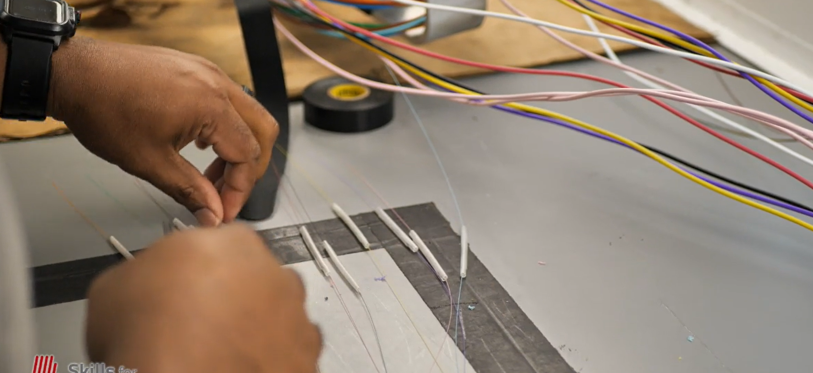

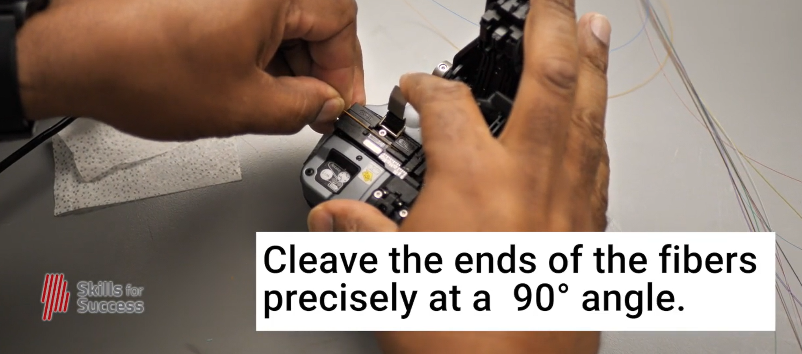

---

#PROOF


Let's review the tools needed for fusion splicing. 

Take a look at each picture and identify the name of the tool. Click on the card to flip and check your answer.

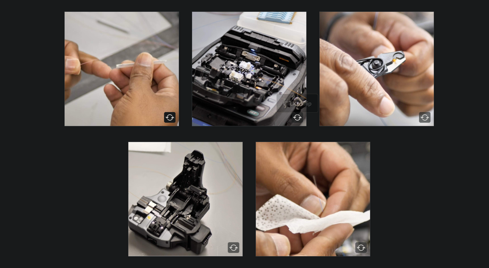


---


## 🟣  6.4 - Fusion Splicer Readings


Fusion splicers are expensive and powerful tools for Fiber Optics Technicians. The image below shows the readings for a successful splice. Click on the hot spots to learn more about what is shown on screen.

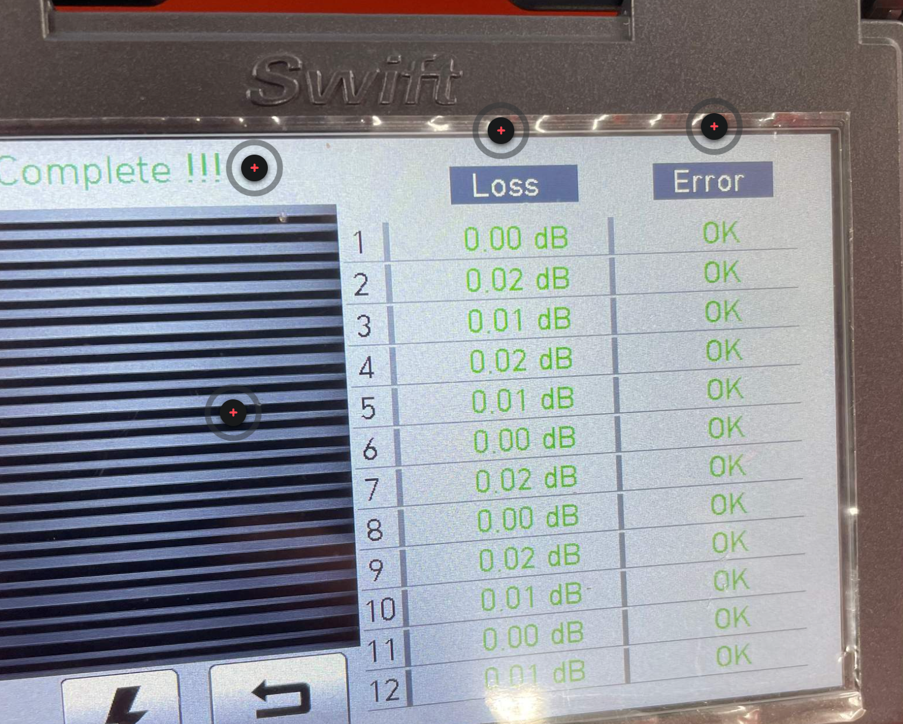

**Fiber Image**

A visual of each fiber is shown on screen. 

**User Prompt**

Statuses appear at the top providing information to the technician.

**Loss Column**

This column provides the amount of loss for each fiber.

**Error Column**

This column provides error messages for each fiber.  

---


What if the splice doesn’t work? The fusion splicer will tell you exactly what went wrong. The image below shows the screen reading for an unsuccessful splice. Click on the hotspot to learn more about what is shown on screen.

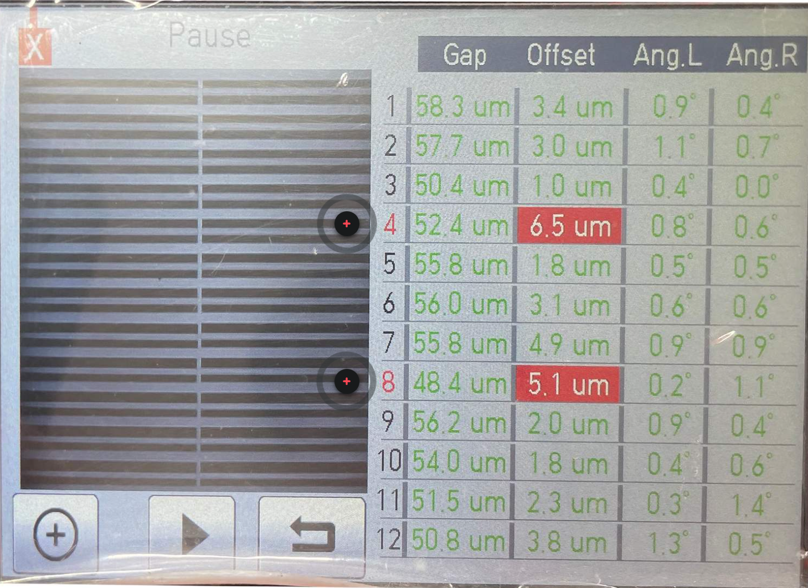


---


## 🟣  6.5 - Ribbon Splicing


Some jobs are going to call for **splicing huge cables with hundreds of fibers inside**. An example of this is when a tech extends a main trunk line farther into a rural area.  A cable with 288 fibers in it will be attached to another cable with 288 fibers. That’s a lot of splicing!  In these cases, some companies choose to create RIBBON fusion splices with a special **ribbon fusion splicer**.  This splicer **can join up to 12 fibers at a time** in a ribbon splicer. It looks like a colorful ribbon.

#CASE_STUDY

> when a tech extends a main trunk line farther into a rural area

Let's take a closer look at how to create ribbon fusion splices. 

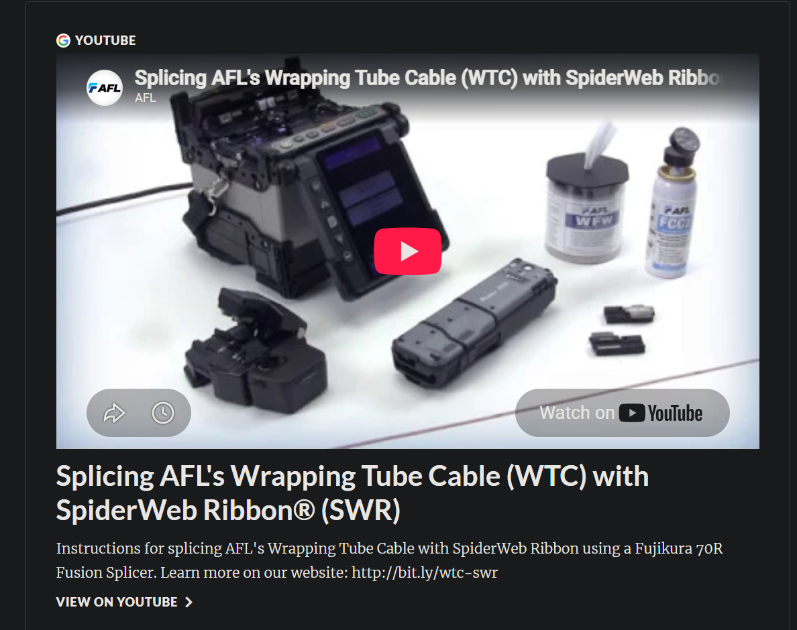

https://www.youtube.com/watch?v=trYr_Gfr3J4

## 1️⃣ PREPARE/CLEAN TOOLS AND WORK ENVIRONMENT

### 🛠️ Tools needed:
   - Fujikura 70R fusion splidcer


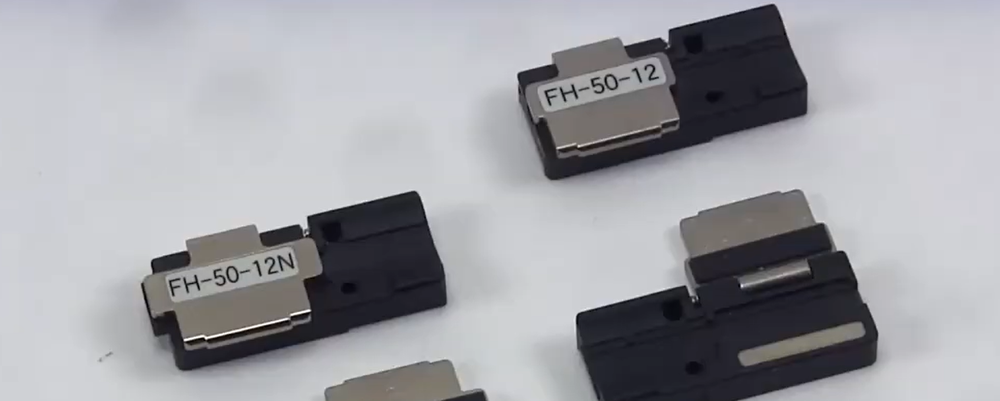

- RSO3 thermal stripper
- CT30 high precision cleaver
- (optional) AFL vgroove cleaning kit
- Lint free chem wipes
- AFL FCC cleaning fluid
- 12MM ribbon splicer sleeve

SETTINGS: FUSION SPLICER
- 12 fibers
- 40mm max protection sleeve
- single or multi-mode

HIGH HEAT ON THERMAL STRIPPER
- on RS03 - setting 4 is correct

CLEANLINESS OF EQUIPMENT
- Splicer and vgroove must be free of dust and debris
- thermal stripper - ensure no dust/debris on fiber holder channel, blades, stripping channel
- clean retention pads and rollers

CREATE a snag-free ENVIRONMENT

## 2️⃣ PREPARE FIBER FOR SPLICING

- fIBER nees to be prepared to be spliced
- When working with SPIDERWEB RIBBON, avoid OVERHANDLING the bundles and strands
- Spiderweb ribbon can be secured with foam retention pad in a splicing tray, or possibly transition tube

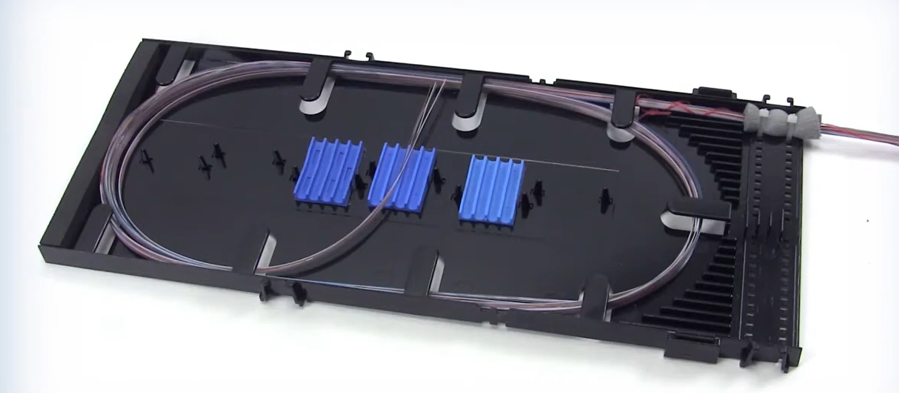

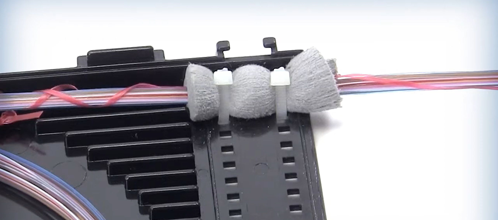

- binders should be tied and cut at the tray entrance to maintain traceability
- measure and cut

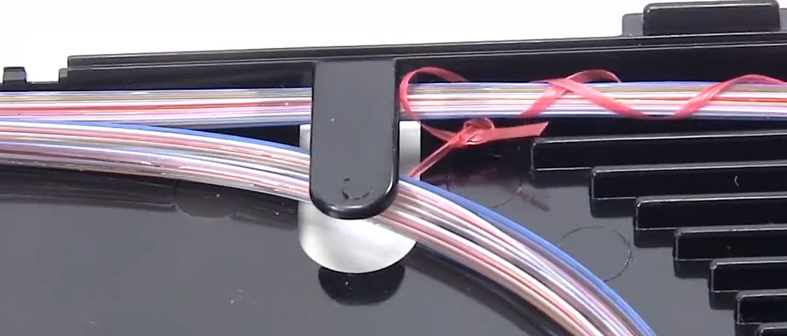

#### @3:05 - TOOLS PART OVER - NOW  

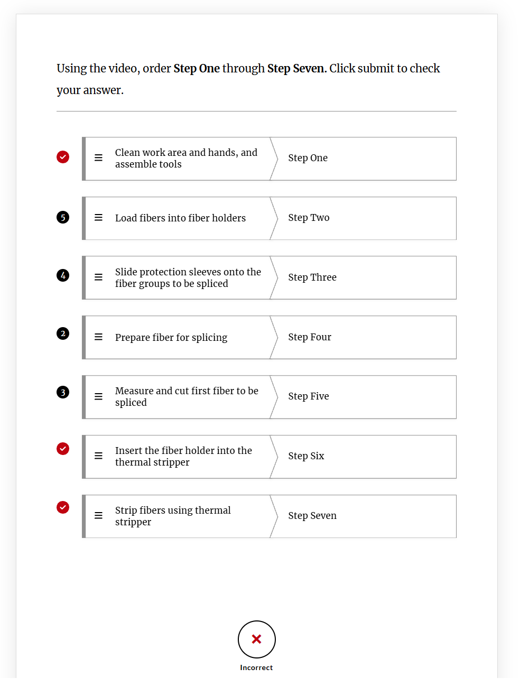

## 3️⃣ MEASURE AND CUT FIRST RIBBON

- measure and cut the first fiber to be spliced 
- possible to store at least one service loop in the tray

## 4️⃣ SLIDE PROTECTIVE SLEEVE ONTO FIBER GROUPS TO BE SPLICED

- slice protection sleeve (heat shrink tubing) on the fiber to be spliced
- before aligning fibers make sure hands free of dirt/contamination
- take 18-20" of fiber and align the length by sliding fingers up the fibers slowly to ensure correct orientation and none are crossed.
- repeat on last 6 inches to be spliced
- consistent method of loading fibers into fiber holders helps prevent transposition
- always install with blue fiber twoard the hinge of the fiber holder
- always install fiber holder into fusion splicer with the hinge to the heater

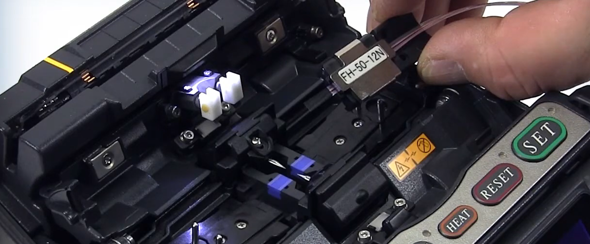

## 5️⃣ LOAD FIBERS IN FIBER HOLDER

- install fibers into fiber holder with about 4 inches exposed
- make sure the blue fiber is to the hinge
- maintain the fibers in the holder channel and slowly draw them back until aprox 1" exposed 1 inch
- examine for any cross fibers or debris, can cause broken fibers - the fiber should be removed and reset into the fiber-holder
- slowly secure the clamps of the fiber holder in place
- make sure all 12 fibers are seated in the fiber holder and in the correct orientation
- keep the amojnt of fiber displayed to a minimum
- inspect the thermal stripper to be sure it is clean and ready for use
  - incl. checking the stripping channel, the slide, blades, friction pad (use brush to clean)

## 6️⃣ INSERT FIBER HOLDER INTO THERMAL STRIPPER

- insert loaded fiber holder into the thermal stripper and ensure it is fully seated
- confirm all fibers are lying flat in the stripping channel and they are not crossed
- verify proper length of fiber to be stripped is ready and slowly close the cover of the thermal stripper
- once cover is closed, firm pressure needs to be applied at the thumb locations on each side of the blades, it must continue  during the entire stripping process

## 7️⃣ STRIP FIBERS WITH THERMAL STRIPPER

- after ready light turns from red to green, open slide in steady/firm motion maintaining pressure on each thumb location, continue to slide the stripper to open position
- open carrier cover and confirm that all coating has been removed - if any coating remains, this step will need to be completed
- once all coating has been removed slide the fiber holder out being careful not to damage the exposed 125 micron fibers
- inspect the holder to confirm that all 12 fibers are present and not damaged

## SET FIBER HOLDER WITH STRIPPED FIBER IN SAFE LOCATION

- set the fiber holder with stripped fiber in a safe location
- clean all debris from thermal stripper

> - clean fibers are essential to successful splicing and maintaining proper equipment performance

@6:49 - https://youtu.be/trYr_Gfr3J4?si=ilZeiXCi9QppsiYc&t=409 CLEANING

## CLEAN FIBERS WITH CLEANING FLUID

- dampen a lint-free wipe with AFL fiber prep fluid or approved cleaner
- clean a group of fibers until a squeak is heard
- use a clean surface on the fibers for each pass
- **Flick** the fibers to align them and remove any adhesion from the cleaning fluids
- inspect the fibers and ensure all are free of cleaning fluid
- ensure no broken or crossed fibers
- should not be splayed excessively

## PREPARE A HIGH-PRECISION CLEAVER

- a high-precision cleaver is needed when splicing ribbon fiber (AFL CT30 in this case) 


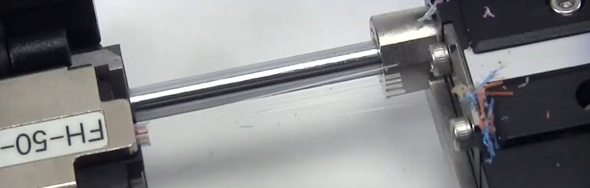


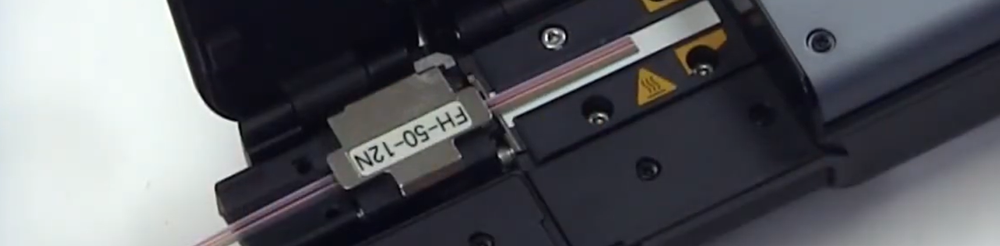

-  be sure ct30 is activated and ready to cleave

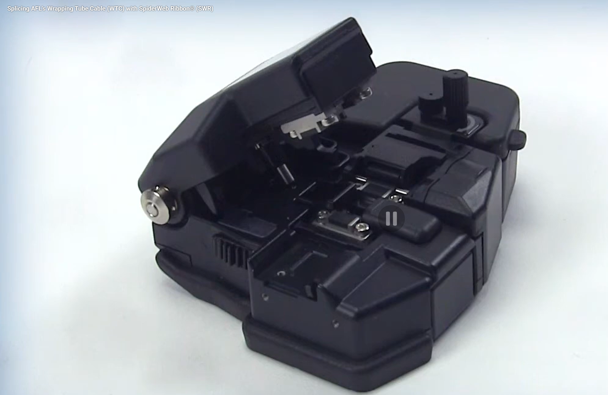

-  inspect the cleaver blade region to be sure it is free of fiber shards
-  install loaded fiber holder in the cleaver
-  make sure its fully seated and snapped down
-  ensure all 12 fibers are long enough to be resting on the rubber roller

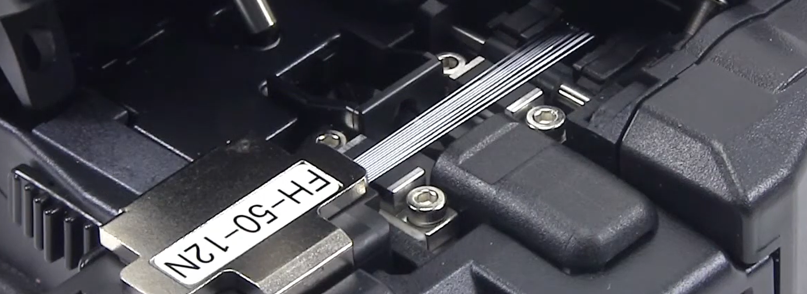


- make sure the fibers are not too long or bowed and that they are flat and not crossed
- there should be no debris
- depress top of CT30 firmly to activate the cleave action
- advance the fiber chard collection wheel if applicable

## REMOVE CLEAVED FIBERS AND FIBER HOLDER FOR INSPECTION

- remove the fiber holder for inspection
- examine for damaged or missing fibers
- DO NOT RE-CLEAN AFTER CLEAVING

## SET FIBER HOLDER INTO SPLICER

- Set the fiber holder into the splicer with the hinge side toward the heater

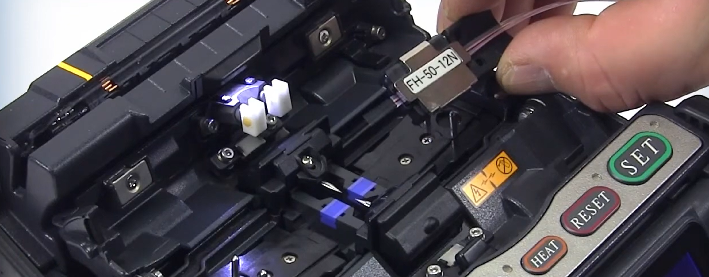

- helps prevent transposition while ribbon splicing
- ensure its firmly seated and that fiber exiting splicer won't pinch or bind when covers are closed
- confirm all 12 fibers are properly seated in the appropriate v-groove and no visible debris

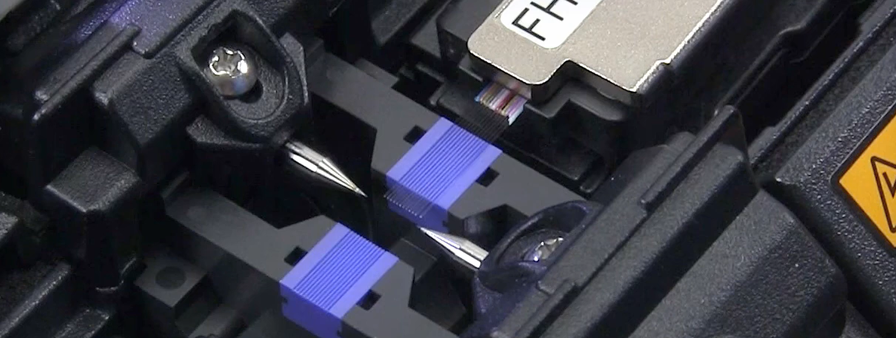

- ***if fibers not aligned properly, remove fiber holder and place it again***
- if still not aligned, a lint-free swab or similar may be used to manually manipulate the fibers to help seat them
- repeat this process on the fibers to be spliced to

## INSTALL SECOND FIBER HOLDER IN SPLICER TO INITIATE SPLICING

- once the second fiber holder has been installed the 70R will activate automatically closing the splice chamber covers and initiating the splice process

## COVER AUTOMATICALLY OPENS ONCE SPLICE COMPLETED

- once splice is completed the 70R automatically opens the splice cover

## INSPECT SPLICE AND COMPUTER RESULTS

- compare the splice results to local requirements
- mechanical strength of the splice has been tested by proof test

## BREAK AND RESPLICE IF NEEDED

- if splice has defects or doesn't meet the minimum loss requirements it will have to be broken and the process repeated

## POSITION SPLICE SLEEVE ON ONE SIDE AND CAREFULLY LIFT OUT

- position splice sleeve close to the fiber holder and lift the clamp on the opposite side to release the tension from the proof-test 
- support splice sleeve and release the second fiber holder clamp
- holding fibers taut, use the positioning ribs on the heater to **center to splice sleeve over the splice**

## LOWER SPLICE INTO THE HEATER

- keep tension on the fibers and lower the centered splice sleeve into the heater
- this will trigger the 70R's heater cover to close and initiate the heater
- remove the heated sleeve and inspect for defects
- it is common for SWR to appear rolled in the sleeve - this is not a defect
- set splice sleeve to cool prior to installing into a splice tray


## REVIEW

> - #GOTCHA: Cleaning is essential to succesful splicing
> - Splicing should be conducted in a snag-free, well-organized work area

- equipment should be calibrated and cleaned
- fusion splicers should be properly ARC-calibrated

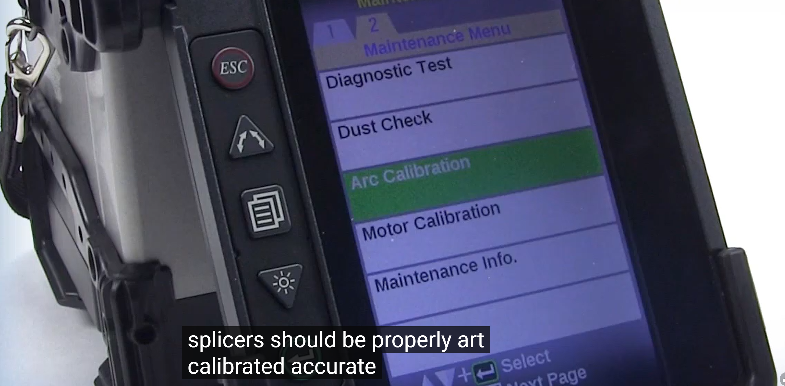

- accurate counts of cleaves should be noted before rotating or replacing blades
- thermal strippers should be cleaned a properly adjusted
- SWR should not be overhandled at the point you wish to splice


#PROOF

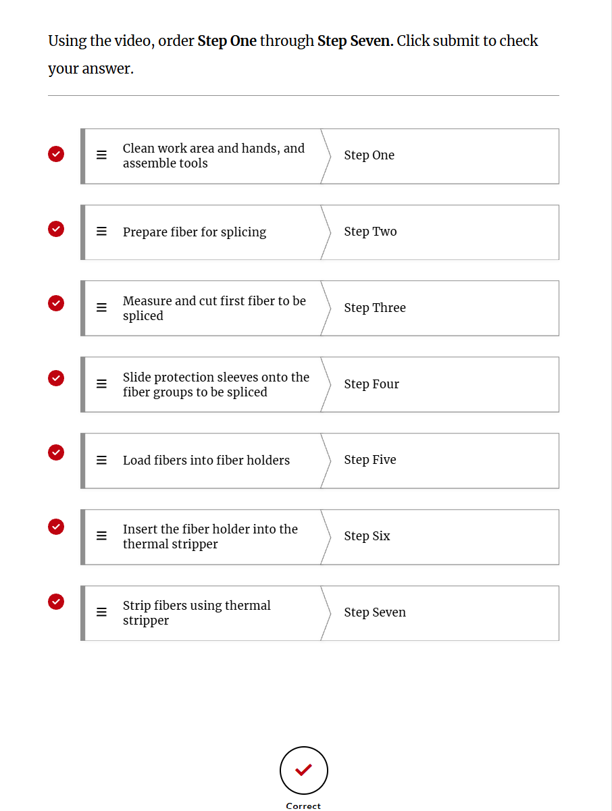

#PROOF

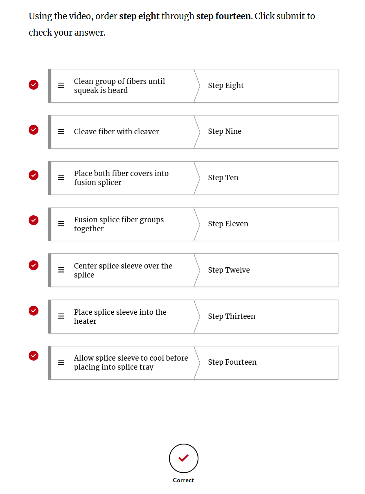


---


## 🟣  6.6 - Mid Sheath Splicing

#VIDEO

- David Thompson
- main backbone cable that comes around the road
- lateral cable runs off into the buildings
- you have to open the cable up and expose or express all the tubes 
- express the fibers you need
- cut the ones you need and weld them together with a splicing machine
- $14-15K Fujikora splicing machines
- all equipment is very expensive
- OTDRs to troubleshoot the fiber, light sources, power meters, fusion splicers
- single fiber splice is what they do, but he knows that with ribbon fiber you can do 12 at a time

---

As you become more advanced, you'll be able to make a **mid sheath splice**. Your job print may require pulling a couple of fibers from a larger cable, and you don’t want to cut the entire cable and have to resplice all of the remaining cables back together. ***Mid sheath splicing is a method to access these few fibers in the middle of the cable without cutting the whole thing.***

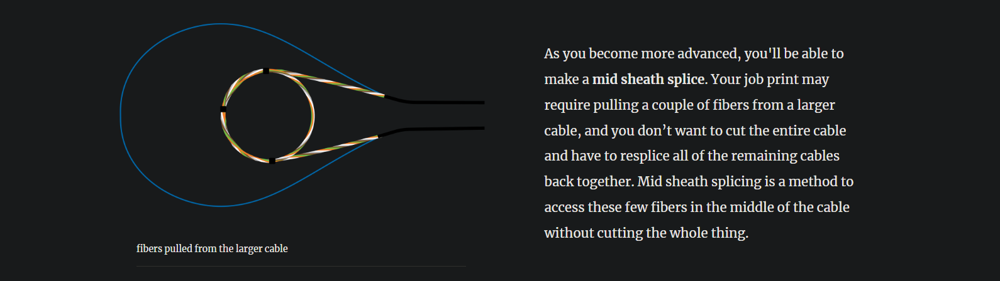


#PROOF


---


