<!-- Custom stylesheet -->
<link rel="stylesheet" href="../../_css/main.css">

<!-- Site logo -->


> [🏚️ README](../../../README.md) | [📁 Courses](../../index.md) | [📚 Vocabulary](../../Vocabulary.md) | [🗓️ Assignments Schedule](../Assignments_Schedule.md) | [🔖 Bookmark](#bookmark)

# CIS 161 - Networking Intro — NOTES: Week 3

> The following are my notes on the **Cisco Networking Academy** Networking Basics course


---

> ✍🏼 THIS WEEK: 
> - Module 5, 6, 7, Checkpoint Exam 2: Network Access


# MODULE 5:  Communication Principles

## 5.0. Introduction

5.0.2 What Will I Learn in this Module?

**Module Title:** Communication Principles

**Module Objective:** Explain the importance of standards and protocols in network communications.

| Topic Title                  | Topic Objective                           |
| ---------------------------- | ----------------------------------------- |
| Communication Protocols      | Describe network communication protocols. |
| Communication Standards      | Describe network communication standards. |
| Network Communication Models | Compare the OSI and TCP/IP models.        |

---

5.1 Communication Protocols

5.1.1 Communication Protocols

Communication in our daily lives takes many forms and occurs in many environments. We have different expectations depending on whether we are chatting via the internet or participating in a job interview. Each situation has its corresponding expected behaviors and styles.

Before beginning to communicate with each other, we e**stablish rules or agreements to govern the conversation**. These agreements include the following:

- What method of communication should we use?
- What language should we use?
- Do we need to confirm that our messages are received?

These rules, or **protocols**, must be followed in order for the message to be successfully delivered and understood. Among the protocols that govern successful human communication are these:

- An identified sender and receiver
- Agreed upon method of communicating (face-to-face, telephone, letter, photograph)
- Common language and grammar
- Speed and timing of delivery
- Confirmation or acknowledgment requirements

The techniques that are used in network communications share these fundamentals with human conversations.

Think about the commonly accepted protocols for sending text messages to your friends.

---

5.1.2 Why Protocols Matter

Just like humans, computers use rules, or protocols, in order to communicate. Protocols are required for computers to properly communicate across the network. In both a wired and wireless environment, a local network is defined as an area where all hosts must "speak the same language", which, in computer terms means they must "share a common protocol".

If everyone in the same room spoke a different language, they would not be able to communicate. Likewise, if devices in a local network did not use the same protocols, they would not be able to communicate.

Networking protocols define many aspects of communication over the local network. As shown in the table, these include message format, message size, timing, encoding, encapsulation, and message patterns.

| Protocol Characteristic | Description                                                                                                                                                                                                                                                                                                                                                                                                                                                         |
| ----------------------- | ------------------------------------------------------------------------------------------------------------------------------------------------------------------------------------------------------------------------------------------------------------------------------------------------------------------------------------------------------------------------------------------------------------------------------------------------------------------- |
| Message format          | When a message is sent, it must use a specific format or structure. Message formats depend on the type of message and the channel that is used to deliver the message.                                                                                                                                                                                                                                                                                              |
| Message size            | The rules that govern the size of the pieces communicated across the network are very strict. They can also be different, depending on the channel used. When a long message is sent from one host to another over a network, it may be necessary to break the message into smaller pieces in order to ensure that the message can be delivered reliably.                                                                                                           |
| Timing                  | Many network communication functions are dependent on timing. Timing determines the speed at which the bits are transmitted across the network. It also affects when an individual host can send data and the total amount of data that can be sent in any one transmission.                                                                                                                                                                                        |
| Encoding                | Messages sent across the network are first converted into bits by the sending host. Each bit is encoded into a pattern of sounds, light waves, or electrical impulses depending on the network media over which the bits are transmitted. The destination host receives and decodes the signals in order to interpret the message.                                                                                                                                  |
| Encapsulation           | Each message transmitted on a network must include a header that contains addressing information that identifies the source and destination hosts, otherwise it cannot be delivered. Encapsulation is the process of adding this information to the pieces of data that make up the message. In addition to addressing, there may be other information in the header that ensures that the message is delivered to the correct application on the destination host. |
| Message pattern         | Some messages require an acknowledgment before the next message can be sent. This type of request/response pattern is a common aspect of many networking protocols. However, there are other types of messages that may be simply streamed across the network, without concern as to whether they reach their destination.                                                                                                                                          |

---

5.1.3 Check Your Understanding - Communication Protocols

> Networking protocols typically specify the maximum size for a message. In the case of Ethernet, there is also a minimum size of 64 bytes. In addition, Ethernet specifies a method for encoding the bits so that the destination can decode the message.

---

5.2 Communication Standards

5.2.1 Video - Devices in a Bubble

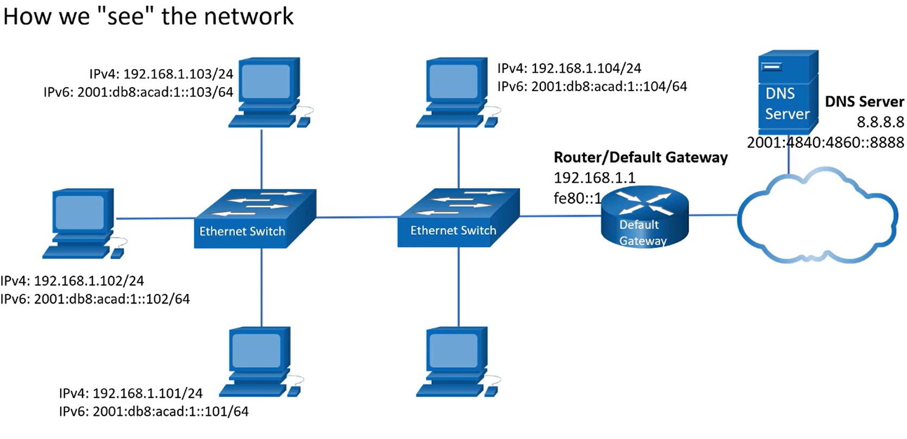

> The only thing a device knows is its own address information


> The answer to these questions is **protocols**

> **packets**

> DHCP/ICMPv6 - Protocol examples


> TCP is a protocol used to guarantee reliability. If any packets don't make it to the destination, TCP re-sends them

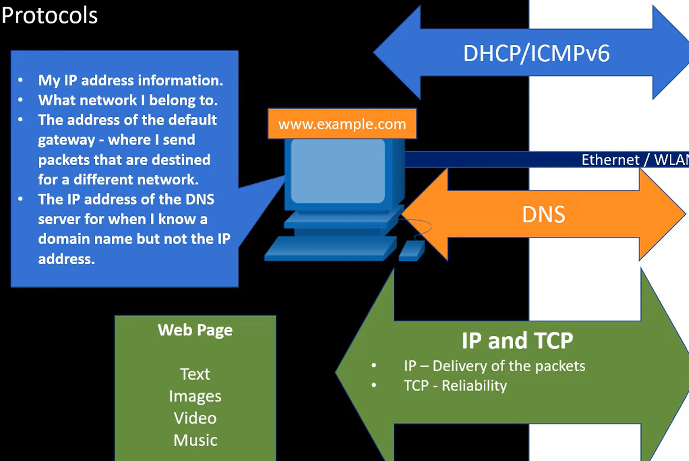

---

### 5.2.2 The Internet and Standards

With the increasing number of new devices and technologies coming online, how is it possible to manage all the changes and still reliably deliver services such as email? The answer is internet standards.

A standard is a set of rules that determines how something must be done. Networking and internet standards ensure that all devices connecting to the network implement the same set of rules or protocols in the same manner. Using standards, it is possible for different types of devices to send information to each other over the internet. For example, the way in which an email is formatted, forwarded, and received by all devices is done according to a standard. If one person sends an email via a personal computer, another person can use a mobile phone to receive and read the email as long as the mobile phone uses the same standards as the personal computer.

> - **standard**: a set of rules that determines how something must be done.

---

5.2.3 Network Standards Organizations
An internet standard is the end result of a comprehensive cycle of discussion, problem solving, and testing. These different standards are developed, published, and maintained by a variety of organizations, as shown in the figure. When a new standard is proposed, each stage of the development and approval process is recorded in a numbered **Request for Comments (RFC)** document so that the evolution of the standard is tracked. RFCs for internet standards are published and managed by the Internet Engineering Task Force (IETF).

Other standards organizations that support the internet are shown in the figure.


---

5.2.4 Check Your Understanding - Communications Standards

> Protocols are the rules that govern network communications including the message format, message size, timing and encapsulation.

---

5.3 Network Communication Models

5.3.1 Video - Network Protocols

- Computer networks use protocols
- **protocols:** the rules used to govern networking / computer communication
- language, formal/informal, greeting, all protocols that help govern human communication
- common NETWORK protocols:
  - **Ethernet**: network interface card (NIC) to NIC in the same network
  - **IP:** governs comms from original source to final destination, using routers
  - **TCP:** transmission control protocol; ensures information gets there reliably, and ensures packets are ordered properly
  - **HTTP:** Hypertext transfer protocol; governs the exchange/transfer of HTML (hyper text markup language)

---

5.3.2 Video - The Protocol Stack

- **protocol stack:**
  - When a device creates a message it is using various layers of the OSI Model

### TCP/IP MODEL

Layers

- **APPLICATION:** HTTP
- **TRANSPORT:** TCP
- **INTERNET:** IP
- **NETWORK ACCESS:** ETHERNET

---

### 5.3.3 The TCP/IP Model

Layered models help us visualize how the various protocols work together to enable network communications. A layered model depicts the operation of the protocols occurring within each layer, as well as the interaction with the layers above and below it. The layered model has many benefits:

- Assists in protocol design, because protocols that operate at a specific layer have defined information that they act upon and a defined interface to the layers above and below.
- Fosters competition because products from different vendors can work together.
- **Enables technology changes to occur at one level without affecting the other levels.**
- Provides a common language to describe networking functions and capabilities.

The first layered model for internetwork communications was created in the early 1970s and is referred to as the **internet model**. It defines four categories of functions that must occur in order for communications to be successful. The suite of TCP/IP protocols that are used for internet communications follows the structure of this model, as shown in the table. Because of this, the internet model is commonly referred to as the TCP/IP model.

| TCP/IP Model Layer | Description                                                             |
| ------------------ | ----------------------------------------------------------------------- |
| Application        | Represents data to the user, plus encoding and dialog control.          |
| Transport          | Supports communication between various devices across diverse networks. |
| Internet           | Determines the best path through the network.                           |
| Network Access     | Controls the hardware devices and media that make up the network.       |

> - Layered model

> - **Internet model**: first layered model; created in early 1970s; 4 categories of functions; AKA: TCP/IP Model

---

5.3.4 The OSI Reference Model

There are two basic types of models that we use to describe the functions that must occur in order for network communications to be successful: protocol models and reference models.

- **Protocol model -** This model closely matches the structure of a particular protocol suite. A **protocol suite** includes the set of related protocols that typically provide all the functionality required for people to communicate with the data network. The TCP/IP model is a protocol model because it describes the functions that occur at each layer of protocols within the TCP/IP suite.
- **Reference model -** This type of model describes the functions that must be completed at a particular layer, but does not specify exactly how a function should be accomplished. A reference model is not intended to provide a sufficient level of detail to define precisely how each protocol should work at each layer. The primary purpose of a reference model is to aid in clearer understanding of the functions and processes necessary for network communications.

The most widely known internetwork reference model was created by the **Open Systems Interconnection** (OSI) project at the International Organization for Standardization (ISO). It is used for **data network design**, **operation specifications**, and **troubleshooting**. This model is commonly referred to as the OSI model.

| OSI Model Layer  | Description                                                                                                                                                                                                             |
| ---------------- | ----------------------------------------------------------------------------------------------------------------------------------------------------------------------------------------------------------------------- |
| 7 - Application  | The application layer contains protocols used for **process-to-process communications**.                                                                                                                                |
| 6 - Presentation | The presentation layer provides for common representation of the data transferred between application layer services.                                                                                                   |
| 5 - Session      | The session layer **provides services** to the presentation layer to organize its dialogue and to manage data exchange.                                                                                                 |
| 4 - Transport    | The transport layer defines services to segment, transfer, and reassemble the data for individual communications between the end devices.                                                                               |
| 3 - Network      | The network layer provides services to exchange the individual pieces of data over the network between identified end devices.                                                                                          |
| 2 - Data Link    | The data link layer protocols describe **methods for exchanging data frames between devices** over a common media.                                                                                                      |
| 1 - Physical     | The physical layer protocols describe the **mechanical, electrical, functional, and procedural** means to activate, maintain, and de-activate physical connections for a bit transmission to and from a network device. |

> - 2 BASIC types of models: **protocol models** and **reference models**

---

5.3.5 OSI Model and TCP/IP Model Comparison

Because TCP/IP is the protocol suite in use for internet communications, why do we need to learn the OSI model as well?

The TCP/IP model is a method of visualizing the interactions of the various protocols that make up the TCP/IP protocol suite. It does not describe general functions that are necessary for all networking communications. It describes the networking functions specific to those protocols in use in the TCP/IP protocol suite. For example, at the network access layer, the TCP/IP protocol suite does not specify which protocols to use when transmitting over a physical medium, nor the method of encoding the signals for transmission. OSI Layers 1 and 2 discuss the necessary procedures to access the media and the physical means to send data over a network.

The protocols that make up the TCP/IP protocol suite can be described in terms of the OSI reference model. The functions that occur at the internet layer in the TCP/IP model are contained in the network layer of the OSI Model, as shown in the figure. The transport layer functionality is the same between both models. However, the network access layer and the application layer of the TCP/IP model are further divided in the OSI model to describe discrete functions that must occur at these layers.

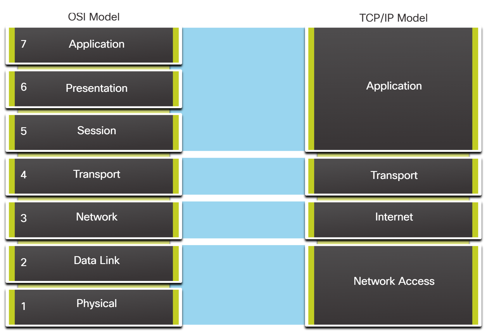

The key similarities are in the transport and network layers; however, the two models differ in how they relate to the layers above and below each layer:

- OSI Layer 3, the network layer, maps directly to the TCP/IP internet layer. This layer is used to describe protocols that address and route messages through an internetwork.
- OSI Layer 4, the transport layer, maps directly to the TCP/IP transport layer. This layer describes general services and functions that provide ordered and reliable delivery of data between source and destination hosts.
- The TCP/IP application layer includes several protocols that provide specific functionality to a variety of end user applications. The OSI model Layers 5, 6, and 7 are used as references for application software developers and vendors to produce applications that operate on networks.
- Both the TCP/IP and OSI models are commonly used when referring to protocols at various layers. Because the OSI model separates the data link layer from the physical layer, it is commonly used when referring to these lower layers.

> - the OSI model separates the data link layer from the physical layer; The OSI model data link and network layers correspond to the network access layer in the TCP/IP model.

> - IP addressing occurs at the network layer.

---

5.4. Communication Principles Summary

5.4.3 Communications Principles Quiz

> An initialism is an abbreviation made from the first letters of a phrase, where you pronounce each letter separately. [1]  
> Common Examples
>
> • FBI: Federal Bureau of Investigation (pronounced F-B-I)
> • ATM: Automated Teller Machine (pronounced A-T-M)
> • HTML: HyperText Markup Language (pronounced H-T-M-L) [1, 2]
>
> Initialism vs. Acronym
> People often confuse initialisms with acronyms, but they differ in how you say them out loud:
>
> • Initialism: You say every single letter out loud (for example, DVD is D-V-D).
> • Acronym: You say the letters together as one new word (for example, NASA sounds like a regular word, not N-A-S-A). [1, 2]
>
> Would you like me to give you more examples or show you how to form the plural of an initialism?
> AI can make mistakes, so double-check responses
>
> [2] https://www.grammarly.com/commonly-confused-words/acronym-vs-initialism


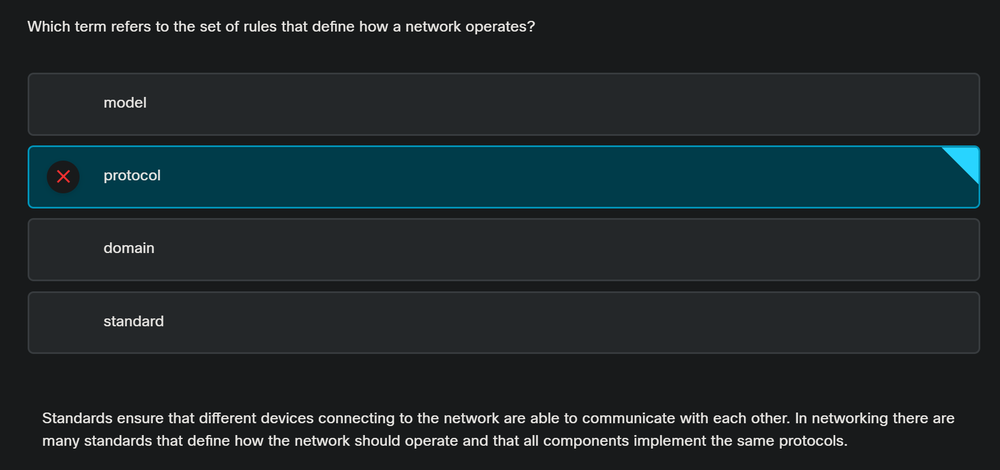

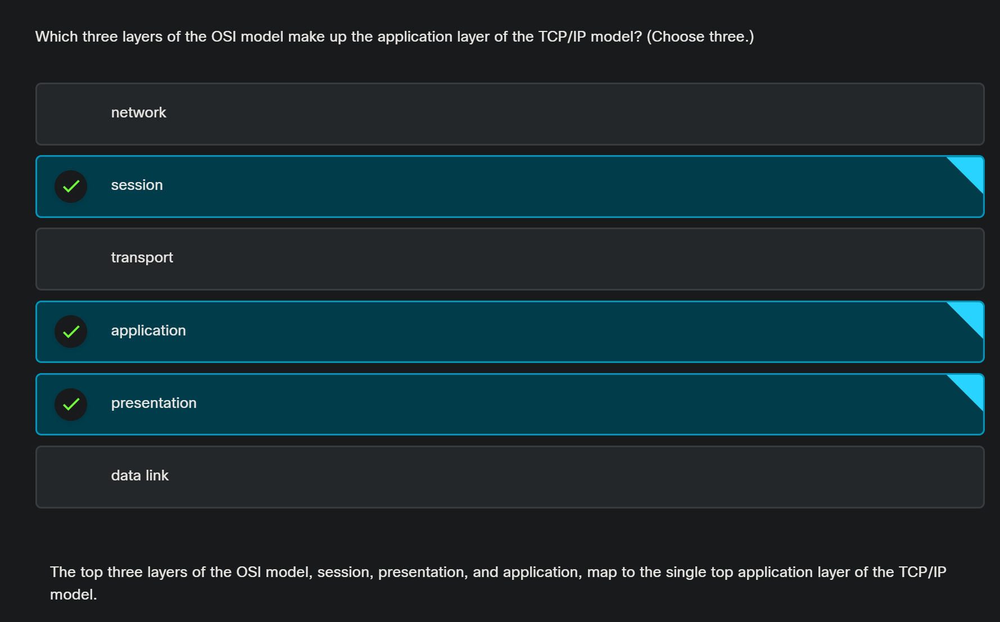

#PROOF


---

# MODULE 6: Network Media

## 6.0 Introduction

6.0.2 What Will I Learn in this Module?

**Module Title:** Network Media

**Module Objective:** Describe common network media.

| Topic Title         | Topic Objective                          |
| ------------------- | ---------------------------------------- |
| Network Media Types | Describe common types of network cables. |

---

6.1 Network Media Types

6.1.1 Video - Network Media Types

- **network media:** provides the connectivity and path for communications to travel; copper (unshielded twisted pair (UPP)) or wireless
- **UPP:** unshielded twisted pair (ethernet cable, cat5, cat5e, cat6, etc); each pair is color coded to match up; provided connectivity between a NIC or a port on a router; RJ-45 connector used for almost all types of ethernet connection
- **Coaxial cable:** copper; BNC or F-type connectors; differs significantly from twisted pair, has single copper core surrounded by plastic insulator and wire mesh shield
- **Fiber optic cable:** glass or plastic; solid core surrounded by 2nd layer of glass or plastic; carries only light waves; NOT AFFECTED BY ELECTROMAGNETIC INTERFERENCE; CAN CARRY LIGHT SIGNALS longer distances than copper; 
- There are different types of fiber optics so there are a lot of variations in the types of speed each fiber optic cable will support


---


6.1.2 Three Media Types

Data is transmitted across a network on media. The media provides the channel over which the message travels from source to destination.

Modern networks primarily use three types of media to interconnect devices, as shown in the figure:

*   **Metal wires within cables** - Data is encoded into electrical impulses.
*   **Glass or plastic fibers within cables (fiber-optic cable)** - Data is encoded into pulses of light.
*   **Wireless transmission** - Data is encoded via modulation of specific frequencies of electromagnetic waves.
   


**NETWORK MEDIA CRITERIA:**

The four main criteria for choosing network media are these:

*   What is the maximum distance that the media can successfully carry a signal?
*   What is the environment in which the media will be installed?
*   What is the amount of data and at what speed must it be transmitted?
*   What is the cost of the media and installation?
   

---


6.1.3 Common Network Cables
The three most common network cables are twisted-pair, coaxial cable, and fiber-optic cable.

Twisted-Pair Cable

Ethernet technology generally uses twisted-pair cables to interconnect devices. Because Ethernet is the foundation for most local networks, twisted-pair is the most commonly encountered type of network cabling.

In twisted-pair, wires are grouped in pairs and twisted together to reduce interference. The pairs of wires are colored so that you can identify the same wire at each end. Typically, in each pair, one of the wires is a solid color and its partner is the same color striped onto a white background.


**Coaxial Cable**

Coaxial was one of the earliest types of network cabling developed. Coaxial cable is the kind of copper cable used by cable TV companies. It is also used for connecting the various components which make up satellite communication systems. Coaxial cable has a single rigid copper core that conducts the signal. This core is typically surrounded by a layer of insulation, braided metal shielding, and a protective jacket. It is used as a **high-frequency** transmission line to carry high-frequency or broadband signals.


Fiber-Optic Cable

Fiber-optic cable can be either glass or plastic with a diameter about the same as a human hair and it can carry digital information at very high speeds over long distances. Because light is used instead of electricity, electrical interference does not affect the signal. Fiber-optic cables have many uses as well as communications. They are also used in **medical imaging, medical treatment, and mechanical engineering inspection**.

They have a ***very high bandwidth***, which enables them to carry very large amounts of data. Fiber is used in **backbone networks**, large **enterprise environments**, and **large data centers**. It is also used extensively by **telephone companies**.


---

6.2. Network Media Summary

**Network Media Types**  
Communication transmits across a network on media. The media provides the channel over which the message travels from source to destination.

Modern networks primarily use three types of media to interconnect devices are:

*   **Metal wires within cables** - Data is encoded into electrical impulses.
*   **Glass or plastic fibers within cables (fiber-optic cable)** - Data is encoded into pulses of light.
*   **Wireless transmission** - Data is encoded via modulation of specific frequencies of electromagnetic waves.

The four main criteria for choosing media are the following:

*   What is the maximum distance that the media can successfully carry a signal?
*   What is the environment in which the media will be installed?
*   What is the amount if data and at what speed must is be transmitted?
*   What is the cost of the media installation?

The three most common network cables are twisted-pair, coaxial cable, and fiber-optic cable. Ethernet technology generally uses twisted-pair cables to interconnect devices. Coaxial cable is the kind of copper cable used by cable TV companies. It is also used for connecting the various components which make up satellite communication systems. Fiber-optic cable can be either glass or plastic with a diameter about the same as a human hair and it can carry digital information at very high speeds over long distances. Because light is used instead of electricity, electrical interference does not affect the signal.

---

#CASE_STUDY

> A network technician is extending the network from the main office building over several hundred meters to a new security station. The security station needs a high speed connection to support video surveillance of the main building. What type of cable is best suited to connect the security station to the rest of the main office network?


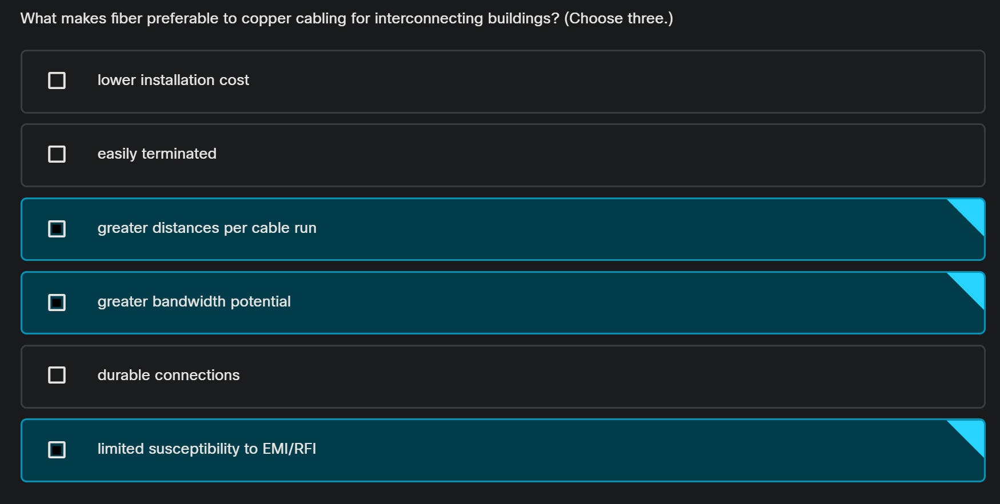


#CASE_STUDY

> A network administrator in a small office is upgrading the local network within the building. New network cables are needed to connect office computers and networking devices. Which network media should the administrator use?

#PROOF


---

# MODULE 7: The Access Layer

## 7.0 Introduction


> How does a message get delivered? When you write a letter and place it in the envelope, you need to make sure it has the correct address information to be delivered to the recipient. In your network, the process of placing one message format (the letter) inside another message format (the envelope) is called encapsulation.

7.0.2 What Will I Learn in this Module?

**Module Title:** The Access Layer

**Module Objective:** Explain how communication occurs on Ethernet networks.

| Topic Title | Topic Objective |
| --- | --- |
| Encapsulation and the Ethernet Frame | Explain the process of encapsulation and Ethernet framing. |
| The Access Layer | Explain how to improve network communication at the access layer. |

---


## 7.1 Encapsulation and the Ethernet Frame


### 7.1.1 Video - The Fields of the Ethernet Frame

Ethernet is technology commonly used in local area networks. Devices access the Ethernet LAN using an Ethernet Network Interface Card (NIC). Each Ethernet NIC has a unique address permanently embedded on the card known as a Media Access Control (MAC) address. The MAC address for both the source and destination are fields in an Ethernet frame.

**ETHERNET FRAME:**


- preamble
- start frame delimiter
- destination mac address
- source mac address
- length or type
- data (IPv4 or IPv6 packet)
- frame check sequence (FCS)


---

### 7.1.2 Encapsulation


When sending a letter, the letter writer uses an accepted format to ensure that the letter is delivered and understood by the recipient. In the same way, a message that is sent over a computer network follows specific format rules in order for it to be delivered and processed.

The process of placing one message format (the letter) inside another message format (the envelope) is called encapsulation. De-encapsulation occurs when the process is reversed by the recipient and the letter is removed from the envelope. Just as a letter is encapsulated in an envelope for delivery, so computer messages are encapsulated.

Each computer message is encapsulated in a specific format, called a frame, before it is sent over the network. A frame acts like an envelope; it provides the address of the intended destination and the address of the source host. The format and contents of a frame are determined by the type of message being sent and the channel over which it is communicated. Messages that are not correctly formatted are not successfully delivered to or processed by the destination host.

**Analogy**

A common example of requiring the correct format in human communications is when sending a letter. Click Play in the figure to view an animation of formatting and encapsulating a letter.

An envelope has the address of the sender and receiver, each located at the proper place on the envelope. If the destination address and formatting are not correct, the letter is not delivered.

The process of placing one message format (the letter) inside another message format (the envelope) is called encapsulation. De-encapsulation occurs when the process is reversed by the recipient and the letter is removed from the envelope.

The animation shows an envelope with a stamp, a sender of 4085 SE Pine Street, Ocala, Florida 34471 and a recipient at 1400 Main Street, Canton, Ohio 44203. The envelope opens and shows a letter: dear Jane, I just returned from my trip. I thought you might like to see my pictures. John. A breakout table appears with the following headings: Recipient (destination) location address, sender (source) location address, salutation (start of message indicator), recipient (destination) identifier, content of letter (encapsulated data) sender (source) identifier, end of frame (end of message indicator). The next row has envelope addressing under the first 2 sections, then encapsulated letter under the next 4 sections. The 1400 Main Street Canton, Ohio 44203 goes in a new row under the recipient (destination) and envelope addressing sections. The 4085 SE Pine Street Ocala, Florida 34471 goes under the sender (source) and envelope addressing sections. The dear goes under the salutation (start of message indicator) and encapsulated letter sections. The Jane goes under the recipient (destination) identifier and encapsulated letter sections. The words I just returned from my trip. I thought you might like to see my pictures. Goes under the content of letter (encapsulated data) and encapsulated letter sections. The word John goes under the sender (source) identifier and encapsulated letter sections. The stamp on the letter goes under the end of frame (end of message indicator) section.

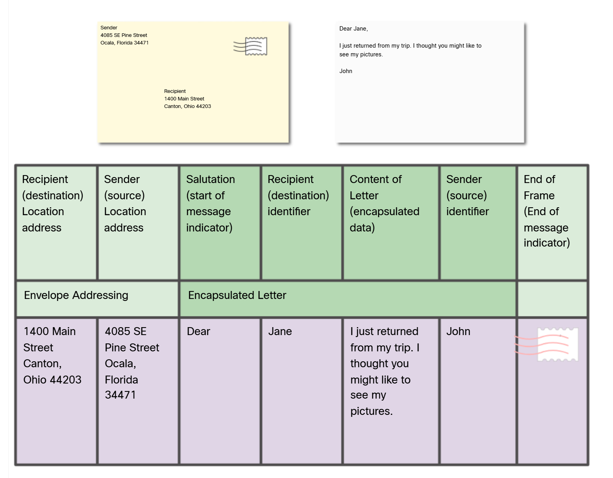

---

> - Encapsulation is the process of prepending protocol information with information from another protocol.

> - When an Ethernet frame is sent out an interface, the Destination MAC address indicates the MAC address of the device, which is on this network, that will receive the Ethernet frame.

> - The Preamble and Start Frame Delimiter (SFD) indicate the beginning of an Ethernet frame.


> The Ethernet protocol primarily operates at Layer 2 (the Data Link Layer) and Layer 1 (the Physical Layer) of the OSI model. [1]  
> Ethernet Layer Breakdown 
> 
> • Layer 2 (Data Link Layer): Handles MAC addresses, framing, and media access control (MAC and LLC sublayers). 
> • Layer 1 (Physical Layer): Handles the physical media, cables, electrical or optical signals, and binary transmission. [1, 2, 3, 4, 5]  
> 
> Would you like to explore how Ethernet frames are structured, or how it compares to the TCP/IP network model? 
> AI can make mistakes, so double-check responses
> 
> [1] https://www.networkacademy.io/ccna/ethernet/ethernet-technologies-overview
> [2] https://www.reddit.com/r/networking/comments/63zmcq/question_ethernet_is_under_osi_data_link_layer/
> [3] https://www.professormesser.com/network-plus/n10-008/n10-008-video/understanding-the-osi-model-3/
> [4] https://www.youtube.com/watch?v=kCuyS7ihr_E
> [5] https://www.youtube.com/watch?v=v4sRKGarh5Q


---

7.2 The Access Layer

### 7.2.1 Video - Ethernet Switches

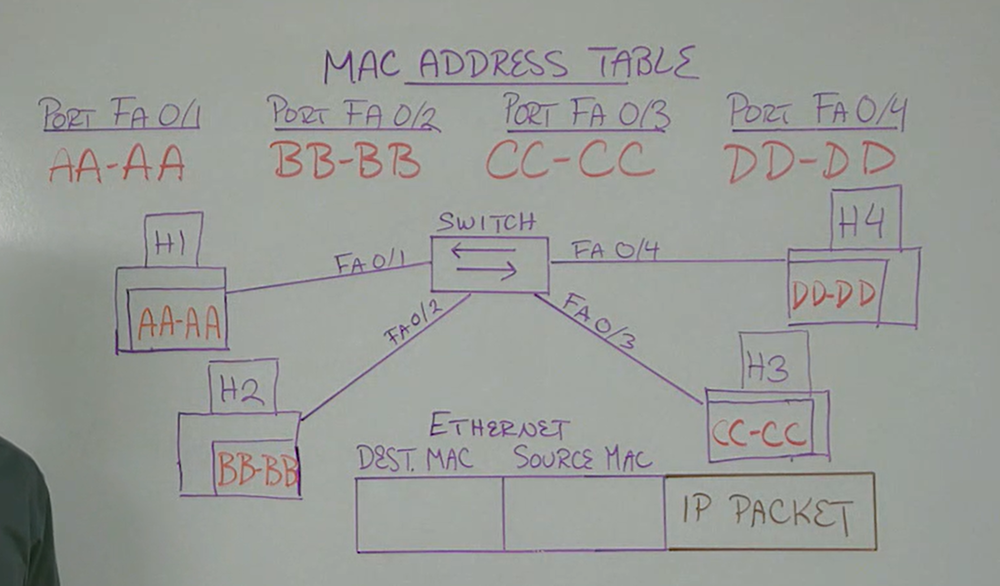

- ethernet switches operate at **layer 2 data link** of the OSI models
- they make forwarding decisions based on layer 2, ethernet header information of the ethernet frame
- switches have MAC address tables


---

### 7.2.2 Video - MAC Address Tables

- how a switch builds its MAC address table
- makes decisions based on ethernet header of ethernet frame

> "FA" (or more accurately, "Fa") stands for FastEthernet in network addressing and topology diagrams because it follows the specific interface naming conventions established by Cisco Systems, the industry standard for networking equipment. 
> While "FE" makes sense as an acronym for the words Fast Ethernet, network operating systems (like Cisco IOS) abbreviate interface types using the first two letters of the primary technology name to keep command-line interface (CLI) commands short and distinct: 
> 
> • Fa = FastEthernet (100 Mbps) 
> • Gi or G = GigabitEthernet (1 Gbps) 
> • Te or T = TenGigabitEthernet (10 Gbps) 
> • Eth or E = Ethernet (10 Mbps) 
> • Se or S = Serial 
> 
> Because network diagrams are usually drawn to mirror the exact configuration of the physical hardware ports (such as  for FastEthernet slot 0, port 1), diagram tools and network engineers stick to Fa to maintain consistency between the visual map and the actual device configuration. 
> Are you building a network diagram for a specific project or studying for a networking certification (like Cisco CCNA)? If you share what you're working on, I can help you clarify other standard interface abbreviations or diagramming symbols. 


> - **Unknown unicast** is a type of network traffic where a data frame has a specific single destination, but the network switch does not know which port the destination device is on.

> - all devices on the network see the frame, but they ignore it unless it matches their MAC address

> - switches retain their MAC table info for about 5 months

---

7.2.3 Check Your Understanding - The Access Layer

> - Ethernet switches make their forwarding decision based on destination MAC address.


> - Ethernet switches add entries to their MAC address table based on the source MAC address.

>Z- When a switch receives an Ethernet frame and the destination MAC address of that frame is not in its MAC address table, the switch will forward the frame out all ports **except in the incoming port**.


> ## 💡 Sidebar: “Hub” Does Not Always Mean the Same Thing
> 
> The word **hub** simply means a central connection point, but its meaning depends on the technology.
> 
> - A **USB hub** adds USB ports to one computer. It is still common for connecting items like keyboards, flash drives, cameras, and external storage.
> - An **Ethernet hub** was an older network device that connected wired devices but repeated all network traffic to every port. It has largely been replaced by Ethernet switches.
> - An **Ethernet switch** is the modern wired-network equivalent: it connects devices by Ethernet cable and sends traffic only to the device that should receive it.
> 
> **Quick example:** An 8-port USB 3 hub expands a laptop’s USB connections. An 8-port Ethernet switch expands the number of wired devices that can join a home network.

---

## 7.3. The Access Layer Summary

**Encapsulation and the Ethernet Frame**

The process of placing one message format inside another message format is called encapsulation. De-encapsulation occurs when the process is reversed by the recipient and the letter is removed from the envelope. Just as a letter is encapsulated in an envelope for delivery, so computer messages are encapsulated. A message that is sent over a computer network follows specific format rules for it to be delivered and processed.

The Ethernet protocol standards define many aspects of network communication including frame format, **frame size**, timing, and encoding. The format for Ethernet frames specifies the location of the destination and source MAC addresses, and additional information including preamble for sequencing and timing, start of frame delimiter, length and type of frame, and frame check sequence (FCS) to detect transmission errors.


**The Access Layer**

The access layer is the part of the network in which people gain access to other hosts and to shared files and printers. The access layer provides the first line of networking devices that connect hosts to the wired Ethernet network. Within an Ethernet network, each host can connect directly to an access layer networking device using an Ethernet cable. Ethernet hubs contain multiple ports that are used to connect hosts to the network. Only one message can be sent through an Ethernet hub at a time. Two or more messages sent at the same time will cause a collision. Because excessive retransmissions can clog up the network and slow down network traffic, hubs are now considered obsolete and have been replaced by Ethernet switches.

An Ethernet switch is a device that is used at Layer 2. When a host sends a message to another host connected to the same switched network, the switch accepts and decodes the frames to read the MAC address portion of the message. A table on the switch, called a MAC address table, contains a list of all the active ports and the host MAC addresses that are attached to them. When a message is sent between hosts, the switch checks to see if the destination MAC address is in the table. If it is, the switch builds a temporary connection, called a circuit, between the source and destination ports. Ethernet switches also allow for sending and receiving frames over the same Ethernet cable simultaneously. This improves the performance of the network by eliminating collisions.

**HOW A SWITCH BUILDS THE MAC ADDRESS TABLE:**

**A switch builds the MAC address table** by examining the source MAC address of each frame that is sent between hosts. When a new host sends a message or responds to a flooded message, the switch immediately learns its MAC address and the port to which it is connected. The table is dynamically updated each time a new source MAC address is read by the switch.


---


7.3.3 The Access Layer Quiz

> - The purpose of the FCS (Frame Check Sequence) field in a network frame is to detect if any errors occurred during transmission and reception

> - A network switch uses the ***source MAC address and the incoming port*** of an **incoming data frame** to keep its MAC address table current


> A network switch uses the source MAC address and the incoming port of an incoming data frame to keep its MAC address table current. [1]  
> How It Works 
> 
> • Learning: When a frame enters a port, the switch reads the source MAC address. 
> • Recording: If the address is not in the table, the switch adds it along with the port number. 
> • Refreshing: If the address is already listed, the switch resets its aging timer to keep the entry active. 
> • Forwarding vs. Maintenance: While the destination MAC address determines where the frame goes next, only the source address and incoming port are used to update the table. [2, 3]  
> 
> [1] https://brainly.com/question/31914736
> [2] https://itexamanswers.net/exam-item/which-information-does-a-switch-use-to-populate-the-mac-address-table
> [3] https://www.ciscopress.com/articles/article.asp?p=3089352&seqNum=6


#SIDEBAR:

> A host on an Ethernet network will discard the frame if it receives a unicast destination MAC address that does not match its own. [1]  
> How It Works 
> 
> • MAC Checking: The network interface card (NIC) checks the destination MAC address of every incoming frame. 
> • No Match: If the address does not match the host's physical address, the device drops or ignores the frame. 
> • No Forwarding: Regular end hosts do not forward or route frames meant for other machines; only network devices like switches or routers do that. 
> • Efficiency: This action saves system resources and ensures only the intended recipient processes the data. [1, 2, 3, 4]  
> 
> If you're studying networking basics, would you like to know what happens if the MAC address does match, or how broadcast frames are handled differently? 
> 
> [1] https://brainly.com/question/58604082
> [2] https://itexamanswers.net/exam-item/what-will-a-host-on-an-ethernet-network-do-if-it-receives-a-frame-with-a-destination-mac-address-that-does-not-match-its-own-mac-address
> [3] https://www.chegg.com/homework-help/questions-and-answers/host-ethernet-network-receives-frame-unicast-destination-mac-address-match-mac-address-dis-q192796601
> [4] https://brainly.com/question/43774958


#SIDEBAR:

> Think of networking addresses like getting a package delivered to you at a hotel room. 
> Your Logical Address is like your room number. It tells people exactly where you are right now, but it changes if you move to a different hotel. Your Physical Address is like your fingerprint. It belongs to you, it never changes, and it is permanently stamped onto you by nature. 
> Here is the quick breakdown you need to know for the CompTIA Network+ exam: 
> 🏢 The Core Differences 
> 
> | Feature | Physical Address | Logical Address  |
> | --- | --- | --- |
> | Common Name | MAC Address (Media Access Control) | IP Address (Internet Protocol)  |
> | OSI Layer | Layer 2 (Data Link Layer) | Layer 3 (Network Layer)  |
> | How it is assigned | Burned into the hardware by the manufacturer. | Given by software or your router (via DHCP).  |
> | Can it change? | No. It stays the same forever. | Yes. It changes depending on what network you connect to.  |
> | Example Format | (Hexadecimal) | (IPv4) or  (IPv6)  |
> 
> 📦 How They Work Together (The Mail Delivery Metaphor) 
> Imagine you want to send a letter to a friend named Alice who lives in another state. 
> 
> 1. The Envelope (Logical Address / IP): You write Alice's home address on the envelope. This is the Logical Address. The postal service (or routers) uses this long-distance address to get the letter across the country from city to city. This address never changes during the journey. 
> 2. The Mail Trucks (Physical Address / MAC): To actually move the letter, it goes into a local mail truck. The truck drives it to the airport. The truck has a specific license plate (Physical Address). At the airport, the letter is moved to an airplane (a new Physical Address). 
> 3. The Hops: Every time the data jumps to a new device (a "hop"), the physical MAC address changes to represent the specific hardware carrying it right then. But inside, the logical IP address on the envelope stays exactly the same so it knows the ultimate destination. [1, 2]  
> 
> 🎓 Key Network+ Terms to Remember 
> 
> • Switch vs. Router: Switches use Physical (MAC) addresses to send data to the right computer inside a single room or building. Routers use Logical (IP) addresses to send data between entirely different networks across the world. 
> • ARP (Address Resolution Protocol): This is the glue between both worlds. When your computer knows the destination's IP address (Logical) but needs to know which hardware wire to shoot it down (Physical), it uses ARP to look up the matching MAC address. [1]  
> 
> Would you like to practice a couple of multiple-choice exam questions on this topic to see how Network+ will test you? 
> 
> AI responses may include mistakes.
> 
> [1] https://www.youtube.com/watch?v=kQmO_0mOwG4
> [2] https://www.cloudi-fi.com/glossary/what-is-a-mac-address


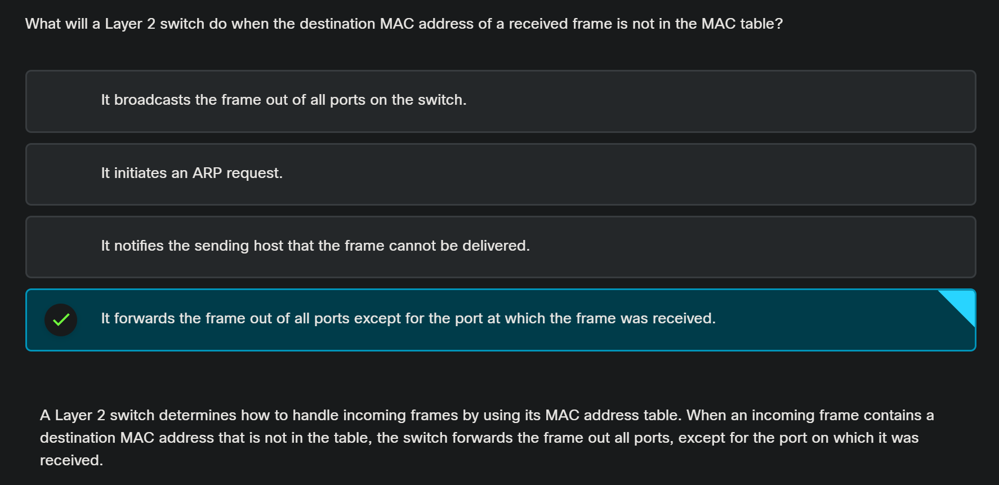

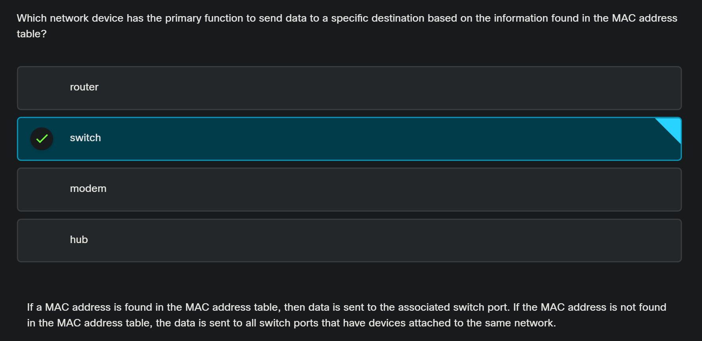


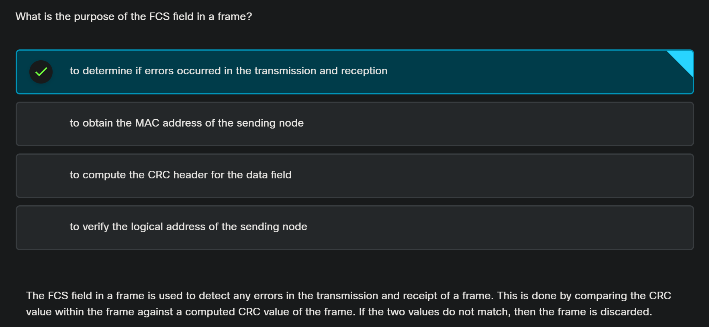


## ✅ Correct answer

> **one function of a layer 2 switch: Determines which interface is used to forward a frame based on the destination MAC address.**
> 
> A Layer 2 switch receives an Ethernet frame, checks its **destination MAC address**, and looks it up in its MAC address table. If it finds a matching entry, it forwards the frame only through the port connected to that destination device. [ciscopress](https://www.ciscopress.com/articles/article.asp?p=3089352&seqNum=6)
> 
> ## 🧠 How the switch learns
> 
> A switch builds its MAC address table by looking at the **source MAC address** of incoming frames—not the destination MAC address.
> 
> For example:
> 
> - A frame enters port 3 with source MAC address `AA:AA:AA:AA:AA:AA`.
> - The switch records: `AA:AA:AA:AA:AA:AA → Port 3`.
> - Later, if another device sends a frame *to* `AA:AA:AA:AA:AA:AA`, the switch knows to send it out port 3. [ciscopress](https://www.ciscopress.com/articles/article.asp?p=3089352&seqNum=6)
> 
> ## ❌ Why the other choices are wrong
> 
> | Choice | Why it is incorrect |
> |---|---|
> | Duplicates the electrical signal of each frame to every port | That describes a **hub**, a Layer 1 device. A switch normally sends known unicast traffic only to the correct port. |
> | Learns the port assigned to a host by examining the destination MAC address | A switch learns host locations from the frame’s **source** MAC address and the incoming port. |
> | Forwards data based on logical addressing | Logical addressing means an **IP address**, which is a Layer 3 function performed by a router or Layer 3 switch. A Layer 2 switch uses MAC addresses. |
> 
> ## ⚠️ One important exception
> 
> If the switch does **not** yet have the destination MAC address in its table, it does not know which one port to use. It performs an **unknown-unicast flood**: it sends the frame out all other ports in that VLAN except the port on which the frame arrived. [ciscopress](https://www.ciscopress.com/articles/article.asp?p=3089352&seqNum=6)
> 
> **Easy memory tip:**  
> - **Source MAC = learn**  
> - **Destination MAC = forward**


> ## 🔌 What “interface” means here
> 
> You are right—the word **interface** can be vague. In this question, **interface** simply means a **physical switch port**: the socket on the switch where an Ethernet cable plugs in.
> 
> So this answer:
> 
> > “Determines which interface is used to forward a frame based on the destination MAC address”
> 
> means:
> 
> > **The switch decides which physical Ethernet port to send the frame out of by checking the destination MAC address.**
> 
> Cisco often uses *interface* as the general technical name for a network connection point. It can mean a physical Ethernet port, a wireless connection, or even a virtual connection, depending on context. But for this basic Layer 2-switch question, read it as **switch port**.
> 
> ## 🧠 Simple example
> 
> Imagine a switch with three computers connected:
> 
> | Device | Connected switch port | MAC address |
> |---|---:|---|
> | PC-A | Port 1 | `AA:AA` |
> | PC-B | Port 2 | `BB:BB` |
> | PC-C | Port 3 | `CC:CC` |
> 
> If PC-A sends an Ethernet frame to PC-B:
> 
> 1. The frame arrives at the switch on **Port 1**.
> 2. The switch reads the destination MAC address: `BB:BB`.
> 3. Its MAC address table says `BB:BB` is on **Port 2**.
> 4. The switch forwards the frame out **Port 2 only**.
> 
> In this example, **Port 2 is the interface used to forward the frame.**
> 
> ## 🗣️ Better novice wording
> 
> A clearer version of the correct choice would be:
> 
> > **Uses the destination MAC address to choose the correct switch port for sending a frame.**
> 
> That wording says exactly what the question intends without assuming you already know Cisco’s broader use of *interface*.


> ## 🧭 Physical address
> 
> A **physical address** is a device network interface’s **MAC address** (Media Access Control address). It identifies the actual network adapter—such as an Ethernet or Wi‑Fi adapter—on a **local network**.
> 
> Example: `00:1A:2B:3C:4D:5E`
> 
> MAC addresses operate at **OSI Layer 2 (Data Link)**. They are used to deliver data frames from one device to another on the same local network segment. Although often factory-assigned, MAC addresses can sometimes be changed or spoofed in software. [techtarget](https://www.techtarget.com/whatis/video/MAC-address-vs-IP-address-explained)
> 
> ## 🗺️ Logical address
> 
> A **logical address** is an **IP address**. It is assigned through network configuration—manually, by DHCP, or other software—and identifies both the network and the device’s location within it.
> 
> Examples: `192.168.1.25` (IPv4) or `2001:db8::25` (IPv6)
> 
> IP addresses operate at **OSI Layer 3 (Network)** and enable routers to send packets **between different networks**, including across the Internet. They can change when a device joins a different network. [portnox](https://www.portnox.com/cybersecurity-101/authentication/mac-address/)
> 
> ## 🚚 Simple analogy
> 
> A MAC address is like identifying the specific door for a delivery on the current street; an IP address is the full address that lets the delivery travel through many cities to reach the correct area.


> ## 🔀 What a switch does
> 
> The correct statement is:
> 
> > **Frame forwarding decisions are based on MAC address and port mappings in the MAC Address table.**
> 
> A switch keeps a **MAC address table** (also called a CAM table). Each entry records:
> 
> ```text
> MAC address → switch port → VLAN
> ```
> 
> When a frame arrives, the switch performs two separate tasks:
> 
> 1. **Learn:** It reads the **source MAC address** and associates it with the port where the frame arrived.
> 2. **Forward:** It reads the **destination MAC address**, looks it up in the table, and decides where—or whether—to send the frame. [cisco](https://www.cisco.com/c/en/us/td/docs/switches/lan/c9000/lyr2-fwd/cdp-lldp-mac-udld/cdp-lldp-mac-udld-configuration-guide/c-configure-mac.html)
> 
> ## 🧠 Forwarding outcomes
> 
> | Destination MAC result | Switch action |
> |---|---|
> | Known and located on a different port | Forwards the frame only through that specific port |
> | Unknown/not in the table | Floods it out all other active ports in the same VLAN—not back through the incoming port |
> | Known but mapped to the incoming port | Filters/drops it; there is no reason to send it back onto the same network segment |
> | Broadcast MAC address | Floods it to all ports in the VLAN except the incoming port |
> 
> ## ⚠️ Key distinction
> 
> The switch learns from the **source** MAC address, not the destination MAC address.
> 
> An unknown destination MAC address is **not dropped** under ordinary switching behavior. It is an *unknown unicast* frame, so the switch floods it; once the destination device replies, the switch sees that reply’s source MAC address and learns which port leads to that device. [cisco](https://www.cisco.com/c/en/us/td/docs/switches/lan/c9000/lyr2-fwd/cdp-lldp-mac-udld/cdp-lldp-mac-udld-configuration-guide/c-configure-mac.html)


#PROOF

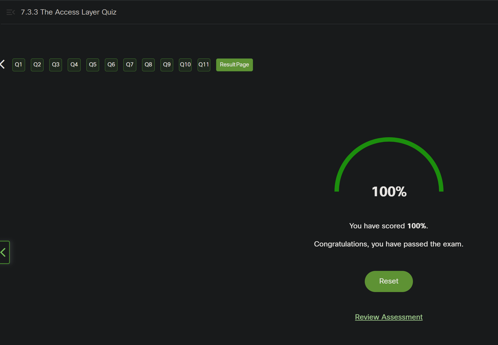

> ## 🧩 Why the Host Discards It
> 
> Every Ethernet frame has a **destination MAC address**—the Layer 2 hardware address identifying the intended recipient on the local network.
> 
> When a host’s network adapter receives a frame, it checks that destination MAC address first:
> 
> - If the address matches the host’s own MAC address, the host accepts the frame and passes its contents up for further processing.
> - If it is a broadcast address, or a multicast address the host is listening for, the host may also accept it.
> - If it is a normal **unicast** MAC address belonging to someone else, the host discards the frame.
> 
> The host does not first remove the Ethernet header and examine the destination IP address. The destination MAC check happens at the data-link layer before the IP packet would normally be passed to the network layer.
> 
> ## 🔀 Easy Mix-Ups
> 
> A host is not a switch. A **switch** may forward a received frame to another port based on its MAC address table. A normal host does not forward other hosts’ Ethernet frames.
> 
> Also, “receives” does not necessarily mean “accepts for processing.” The network adapter can detect a frame and inspect its destination MAC address, then reject it because the frame was addressed to a different device.
> 
> In short: a unicast Ethernet frame addressed to another MAC is not for that host, so it is discarded.

> ## 🗂️ Similar Words, Different Actions
> 
> The potentially confusing term you are remembering is probably **filtering**.
> 
> In Ethernet-switch terminology, a switch may **filter a frame**—meaning it deliberately does **not forward** that frame out any other switch port. In practice, that outcome is also often described as the switch **dropping** the frame.
> 
> A classic case:
> 
> - A frame enters a switch on Port 3.
> - The switch’s MAC address table says the destination MAC is also reachable on Port 3.
> - Sending the frame back out Port 3 would be pointless.
> - The switch **filters** the frame: it does not forward it anywhere else.
> 
> Cisco-oriented explanations describe that as a switch forwarding/filtering decision, and other networking sources may call the same outcome a “silent drop.” [learningnetwork.cisco](https://learningnetwork.cisco.com/s/question/0D53i00000Kt6XPCAZ/switch-forwarding-and-filtering-logic)
> 
> ## ⚠️ Do Not Mix Them Up
> 
> | Term | Who does it? | Meaning in this context |
> |---|---|---|
> | **Discard** | A host/NIC | The destination unicast MAC is not this host’s MAC, so the NIC does not accept the frame for normal processing. |
> | **Filter** | Usually a switch/bridge | The switch chooses not to forward a received frame to another port—commonly because the destination is known to be on the ingress port. |
> | **Drop** | Host, switch, firewall, or other device | General result: the device stops processing or forwarding the frame/packet. The precise reason depends on the device and context. |
> | **Flood** | A switch/bridge | The destination unicast MAC is unknown to the switch, so it sends the frame out all eligible ports in the VLAN except the arrival port. |
> | **Forward** | A switch/bridge or router | The device sends traffic onward. A Layer 2 switch forwards a frame; a router removes the incoming frame and sends the IP packet in a newly built outgoing frame. |
> 
> ## 🧠 Why “Filter” Is Easy to Misremember
> 
> “Filter” sounds like a host checking whether a MAC address matches, which is a reasonable informal description. But in Cisco switching lessons, **filtering** normally labels the switch’s no-forwarding decision—not the end host’s receive decision.
> 
> The result can look the same on the wire: the frame goes no farther because of that device. But the reason is different:
> 
> - **Host:** “This unicast frame is not addressed to me; do not accept it.”
> - **Switch:** “The intended device is already on the port where this frame arrived; do not send it out another port.”
> 
> ## 🛑 What It Is Not
> 
> Terms such as **delete**, **cancel**, or **remove from the media** are not the normal Ethernet terms for the host’s action here.
> 
> A host cannot retract a frame from the cable, and it does not erase a frame from the network for other devices. It simply declines to accept that nonmatching unicast frame into its normal protocol stack. Cisco sources distinguish switch behaviors such as forwarding and flooding based on MAC-table lookup outcomes; if the destination MAC is absent, the switch floods rather than discards solely because it does not recognize the address. [cisco](https://www.cisco.com/c/en/us/td/docs/dcn/nx-os/nexus3548/102x/configuration/layer-2-switching/cisco-nexus-3548-nx-os-layer-2-switching-configuration-guide-102x/m-configuring-mac-address-tables.pdf/1000)


---

#PROOF #CISCO_PACKET_TRACER #COURSE_COMPLETION

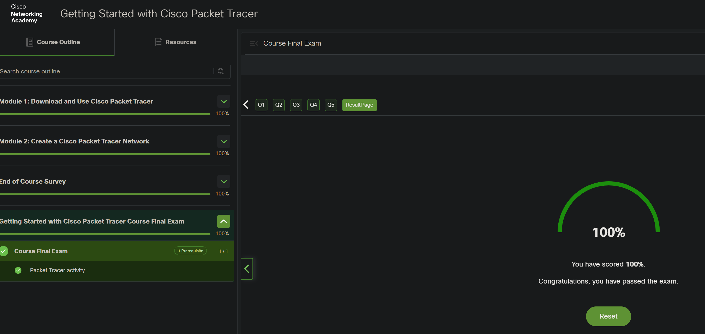

---

#PROOF #CISCO_NETWORKING_ACADEMY #ACHIEVEMENTS #ASSIGNMENTS

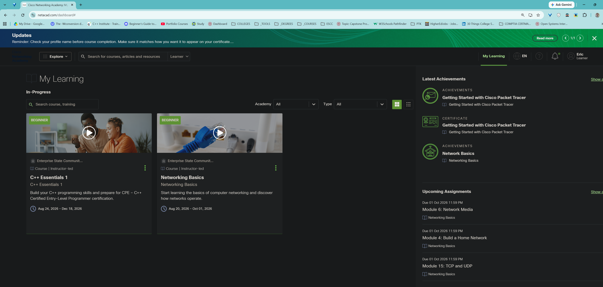


---

**TCP/IP MODEL**

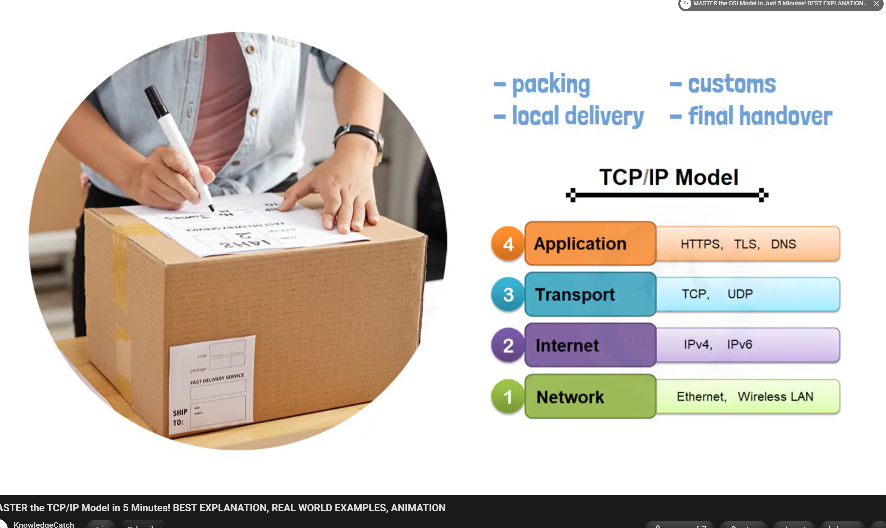

- Network Interface layer ~ neighborhood postman; AKA Link Layer; first step of journey
- Internet IP Layer: POSTAL address checked and best route is chosen, ensureing it moves smothely through customs
- Transport Layer: TCP Like using a tracking delivery service; UDP is faster and simpler better for livestreaming
- APPLICATION Layer: THE part you actually interact with; websites, email, videos
- Makes sure bank app online games and video calls work seamlessly

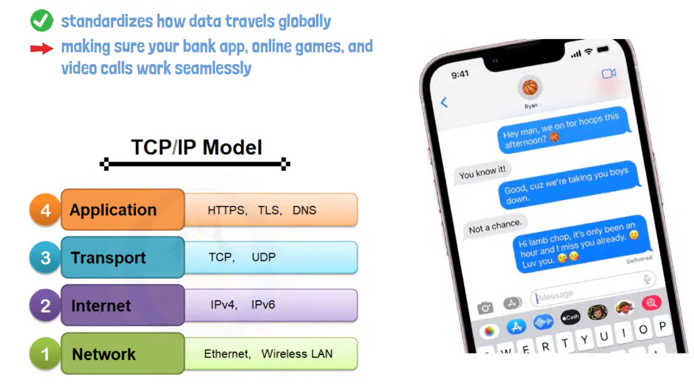https://www.youtube.com/watch?v=tK61YFdO3Kw

#MNEMONIC
All Teachers Inspire Networking
(A.T.I.N.)

> ### Core Elements of Communication
> 
> The three elements that all communication methods have in common are:
> 
> * **Message source (Sender):** The entity, person, or device that originates the message or data.
> * **Transmission medium (Channel):** The physical pathway, cable, or wireless frequency over which the message travels.
> * **Message destination (Receiver):** The final entity, person, or device that receives and interprets the message.


> ## 🧭 Sidebar: The “Message Data” Trap in Networking Fundamentals
> 
> ### ⚠️ The Pitfall
> 
> Beginners often assume that **every** communication method must include **message data** (the actual content or payload). This feels intuitive: if two devices are “talking,” there must be *something* being said, right?
> 
> In networking fundamentals, that assumption can lead you to pick the wrong answer on concept checks and certification-style questions.
> 
> ***
> 
> ### 🔑 The Core Idea
> 
> All communication methods share **three structural elements**:
> 
> - **Message source (sender)** – the originator of the communication  
> - **Transmission medium (channel)** – the physical or wireless path  
> - **Message destination (receiver)** – the endpoint that receives/interprets  
> 
> These three are **always required**, even if nothing that looks like “real data” is being sent. [itexamanswers](https://itexamanswers.net/module-5-communication-principles-quiz-answers.html)
> 
> **Message data**, however, is **not** universal.
> 
> ***
> 
> ### 🧩 Why “Message Data” Isn’t Always Present
> 
> In networking vocabulary:
> 
> - **Signal** = the electrical, optical, or radio representation on the medium.   
> - **Data / message** = the meaningful information or payload that a user or application cares about. 
> 
> Many legitimate communication methods exist **only to manage the channel**, not to carry user content:
> 
> - **Keepalive signals** that say “I’m still here” with no application payload.   
> - **Clock/synchronization pulses** that coordinate timing but carry no message.   
> - **ACK/NACK frames** that confirm receipt or request retransmission, often with minimal or no data field.   
> - **Simple status indicators** (like a light being on/off) that encode a condition as a signal, not as rich message data. 
> 
> In these cases, there is still:
> 
> - a **source**,  
> - a **medium**, and  
> - a **destination**,  
> 
> but there may be **no substantive message data** in the payload sense. [itexamanswers](https://itexamanswers.net/module-5-communication-principles-quiz-answers.html)
> 
> ***
> 
> ### 🛠 How to Avoid the Trap
> 
> When you see questions about “what all communication methods have in common”:
> 
> 1. **Think structure, not content.**  
>    Ask: “What must exist for *any* signal to travel?” → source, medium, destination.
> 
> 2. **Treat “message data” as optional payload.**  
>    Ask: “Could this method work with only control/status information?” If yes, then message data isn’t universal.
> 
> 3. **Remember the exam vocabulary:**  
>    - **Signal** ≠ **message data**  
>    - **Control/status traffic** can exist without user-level data. 
> 
> ***
> 
> ### 💡 Quick Mental Model
> 
> - **Source + Medium + Destination** = the **road, car, and driver** – always needed.  
> - **Message data** = the **cargo** – often present, but not required for the vehicle to move.
> 
> If you keep that separation clear, you’ll avoid a common newbie mistake in networking fundamentals and certification prep. [itexamanswers](https://itexamanswers.net/module-5-communication-principles-quiz-answers.html)


---

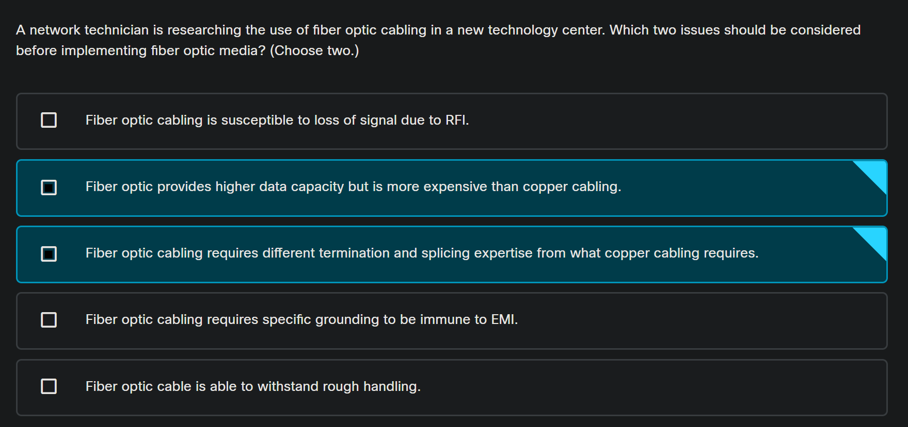

A network technician is researching the use of fiber optic cabling in a new technology center. Which two issues should be considered before implementing fiber optic media? (Choose two.)

Fiber optic cabling is susceptible to loss of signal due to RFI.   1 of 5

Fiber optic provides higher data capacity but is more expensive than copper cabling.   2 of 5

Fiber optic cabling requires different termination and splicing expertise from what copper cabling requires.   3 of 5

Fiber optic cabling requires specific grounding to be immune to EMI.   4 of 5

Fiber optic cable is able to withstand rough handling.   5 of 5

> ## ✅ Correct Choices
> 
> **B and C** are the correct answers. 
> 
> - **B. Fiber optic provides higher data capacity but is more expensive than copper cabling.**  
>   - Fiber supports much higher bandwidth and longer distances than copper, but the cable, transceivers, and installation labor typically cost more. 
> 
> - **C. Fiber optic cabling requires different termination and splicing expertise from what copper cabling requires.**  
>   - Terminating and splicing fiber uses specialized tools (cleavers, fusion splicers, polishers) and skills different from punching down or crimping copper. 
> 
> ## ❌ Why the Other Options Are Wrong
> 
> - **A. “Fiber optic cabling is susceptible to loss of signal due to RFI.”**  
>   - False. Fiber uses light, not electrical signals, so it is immune to RFI and EMI. 
> 
> - **D. “Fiber optic cabling requires specific grounding to be immune to EMI.”**  
>   - False. Fiber doesn’t need grounding for EMI immunity; it’s inherently immune because it carries light, not current. 
> 
> - **E. “Fiber optic cable is able to withstand rough handling.”**  
>   - Generally false as a design assumption. Fiber is more fragile than copper and can be damaged by tight bends, crushing, or rough handling; it must be installed and managed carefully. 
> 
> So for the exam question, the two issues to consider are **higher cost** and **different termination/splicing expertise** (B and C).


---

How much data can be encapsulated into a normal sized Ethernet frame before it is sent over the network?

0 to 1024 bytes   1 of 4

64 to 1518 bytes   2 of 4

32 to 1500 bytes   3 of 4

46 to 1500 bytes   4 of 4


> ## ✅ Answer
> 
> **1,500 bytes** of payload (data) can be encapsulated into a normal-sized Ethernet frame. 
> 
> ## 📘 Explanation
> 
> - **Standard Ethernet MTU:** The maximum payload (MTU) for a normal Ethernet frame is **1,500 bytes**.   
> - **Frame structure (simplified):**
>   - Preamble + SFD: 8 bytes (physical layer, not counted in “frame size” by some texts)  
>   - Destination MAC: 6 bytes  
>   - Source MAC: 6 bytes  
>   - EtherType/Length: 2 bytes  
>   - **Payload (data): up to 1,500 bytes** ← what the question is asking  
>   - Frame Check Sequence (FCS): 4 bytes  
>   - Total on the wire (excluding preamble/SFD in some definitions): **1,518 bytes**; with preamble/SFD: **1,526 bytes**. 
> 
> Many networking courses and exams treat “normal sized Ethernet frame” as meaning the standard MTU of **1,500 bytes of data**. 
> 
> If your quiz offers multiple choice, look for **1,500 bytes** as the correct option.
> 
> ## ✅ Correct Answer
> 
> **46 to 1500 bytes** (option 4) is correct. 
> 
> ## 📘 Why 46–1500 Bytes?
> 
> - **Maximum payload (MTU):** A standard Ethernet frame can carry up to **1,500 bytes** of data.   
> - **Minimum payload:** Ethernet requires a **minimum frame size of 64 bytes** from destination MAC through FCS.  
>   - Header (Dst 6 + Src 6 + Type 2) = 14 bytes  
>   - FCS = 4 bytes  
>   - So minimum payload = 64 − 14 − 4 = **46 bytes**.   
> - If the upper-layer data is less than 46 bytes, the sender adds a **padding** field to reach 46 bytes. 
> 
> So the amount of *data* that can be encapsulated in a normal Ethernet frame is **46 to 1500 bytes**.

---

What are two actions performed by a Cisco switch? (Choose two.)

- utilizing the MAC address table to forward frames via the destination MAC address   1 of 5
- building a routing table that is based on the first IP address in the frame header   2 of 5
- using the source MAC addresses of frames to build and maintain a MAC address table   3 of 5
- forwarding frames with unknown destination IP addresses to the default gateway   4 of 5
- examining the destination MAC address to add new entries to the MAC address table   5 of 5


---


> ## 🧭 Short Answer
> 
> Even though Linksys was once owned by Cisco, **home Linksys routers do not use Cisco IOS or Cisco interface naming conventions**. They’re consumer products with completely different software and UI, so you won’t see `Fa0/8`–style names on them. 
> 
> ## 🏢 vs 🏠 Cisco Enterprise vs Linksys Consumer
> 
> ### 1. Ownership and product lines
> 
> - **Cisco Systems**  
>   - Enterprise networking: switches, routers, firewalls running **Cisco IOS / IOS‑XE / NX‑OS**, using CLI with names like `Fa0/1`, `Gi0/24`, etc. 
> - **Linksys**  
>   - Originally a Cisco brand for **home/SOHO** gear.  
>   - Sold by Cisco to Belkin in 2013; now a separate company.  
>   - Runs consumer firmware with a **web UI / app**, not Cisco IOS. 
> 
> So even historically, Linksys was Cisco’s **consumer** line, not their enterprise CLI-based line.
> 
> ### 2. Interface naming and configuration
> 
> - **Cisco enterprise devices**  
>   - Configured via CLI (`configure terminal`, `interface Gi0/1`, etc.)  
>   - Use structured interface names: `Fa`, `Gi`, `Te` + slot/port. 
> - **Linksys home routers**  
>   - Configured via browser UI or mobile app.  
>   - Ports shown as `LAN1–LAN4`, `Internet/WAN`, `Wi‑Fi`, etc.  
>   - No IOS, no `interface Fa0/8` commands, no Cisco-style MAC table commands. 
> 
> Being “a Cisco brand” (and now not even that) never meant Linksys used Cisco’s **enterprise CLI and naming standards**. They were always aimed at non‑technical home users.
> 
> ## ✅ Practical takeaway for your studies
> 
> - For **Network+ / Cisco-based courses and labs**, assume Cisco naming (`Fa0/8`, `Gi0/1`, etc.) only on **Cisco enterprise gear or simulators** (Packet Tracer, real IOS switches/routers).  
> - For **home routers/gateways** (Linksys, Netgear, Arris, etc.), expect simple labels like `LAN1–4`, `WAN`, `Wi‑Fi`, and no Cisco-style interface names.

> ## 🧒 ELI‑Novice: What “slot/module” Means Here
> 
> You’re **not** being asked to think about NIC cards or PC motherboards. In this context, **“slot/module” just means “which physical card or unit inside the switch.”** 
> 
> ## 🧱 Think of a Switch Like a Building
> 
> Imagine a switch as a building with floors and rooms:
> 
> - **Slot/module** = which **floor** (which card or unit)  
> - **Port** = which **room** on that floor (which physical jack)
> 
> On a small, fixed switch (the kind you’ll mostly see):
> 
> - The whole switch is just **one floor** → floor **0**  
> - All the ports are rooms on that one floor → port **1, 2, 3… 24/48**
> 
> So:
> 
> - `Fa0/8` =  
>   - `Fa` = FastEthernet port  
>   - `0` = the only “floor” (slot 0) in this switch  
>   - `8` = port number 8 on that floor  
> 
> You never have to think about motherboard slots; it’s just Cisco’s way of saying: **“port 8 on module 0.”** 
> 
> ## 🏠 Home Router vs Cisco Switch (in this view)
> 
> - **Home router**:  
>   - Labels: `LAN1`, `LAN2`, `LAN3`, `LAN4`  
>   - No slot/module idea shown to you.
> - **Cisco switch**:  
>   - Labels: `Fa0/1`, `Fa0/2`, … `Fa0/24`  
>   - Internally thinks in “slot/module + port,” but for your class, just treat `0` as “the switch itself” and the second number as “which port.” 
> 
> If it helps: for your exams and labs, mentally translate:
> 
> - `Fa0/8` → “FastEthernet port 8 on this switch.”


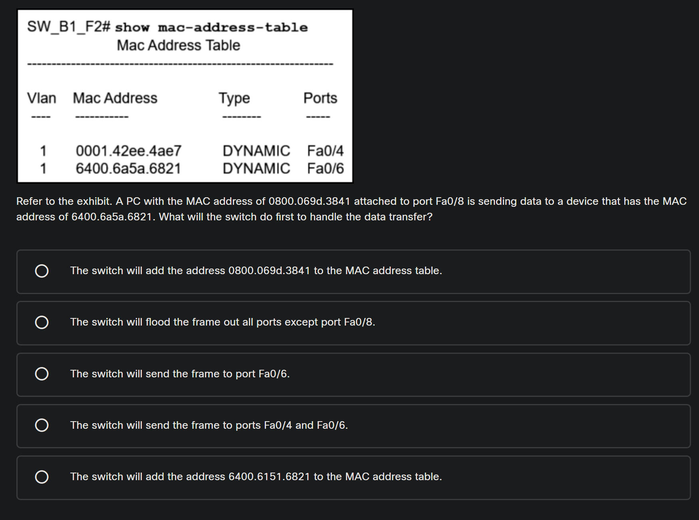


> ## ✅ Order of Operations on a Cisco Switch
> 
> When a frame arrives on a switch port, the switch does this **in order**:
> 
> 1. **Learns the source MAC first**  
>    - It reads the **source MAC address** and the incoming port.  
>    - It **adds or updates** that MAC → port entry in the MAC address table. 
> 
> 2. **Then decides how to forward the frame**  
>    - It looks up the **destination MAC** in the MAC address table.  
>    - If the destination MAC is **unknown** (not in the table), it **floods** the frame out all ports in the same VLAN **except the port it came in on**. 
> 
> So: **MAC table update (learning) happens before the flooding decision.** 
> 
> ## 🧠 Why This Order Matters
> 
> - The switch always learns from the **source** MAC, regardless of whether it knows the destination.  
> - Even if the frame will be flooded, the source MAC is still recorded first so future frames to that MAC can be forwarded intelligently. 
> 
> For your quiz:  
> - The switch **writes/updates the MAC address table using the source MAC first**, then **floods** if the destination MAC is unknown.

---


#PROOF

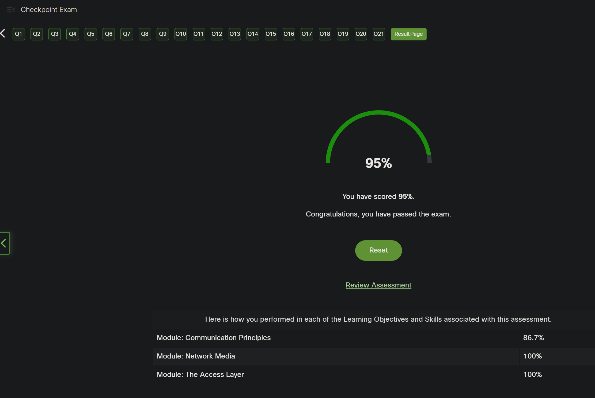

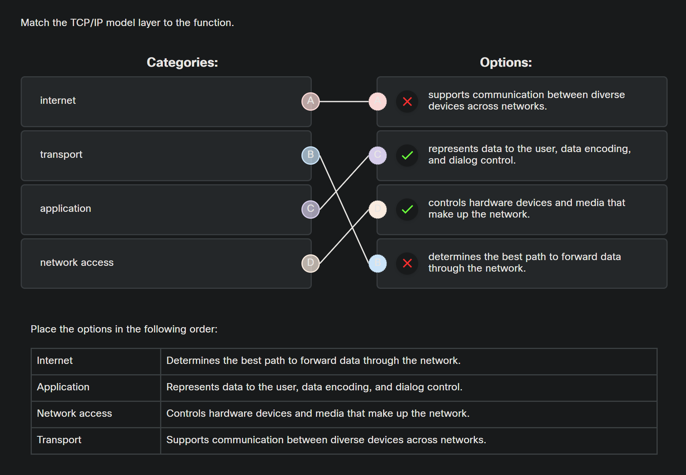

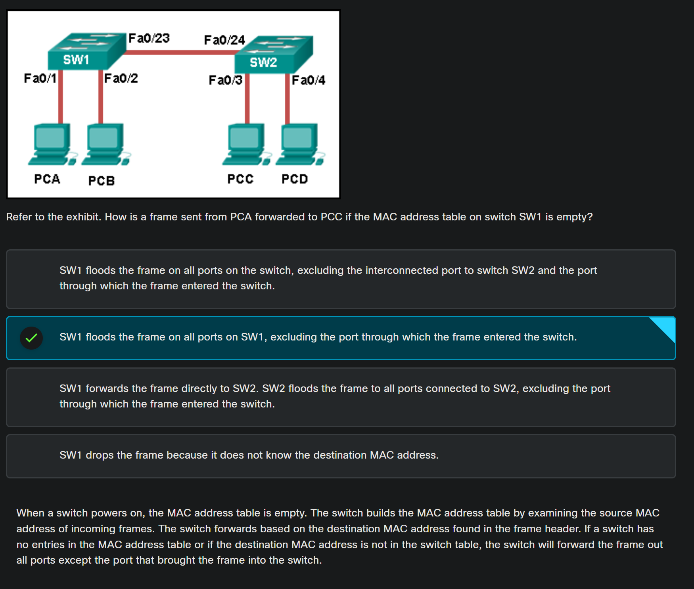

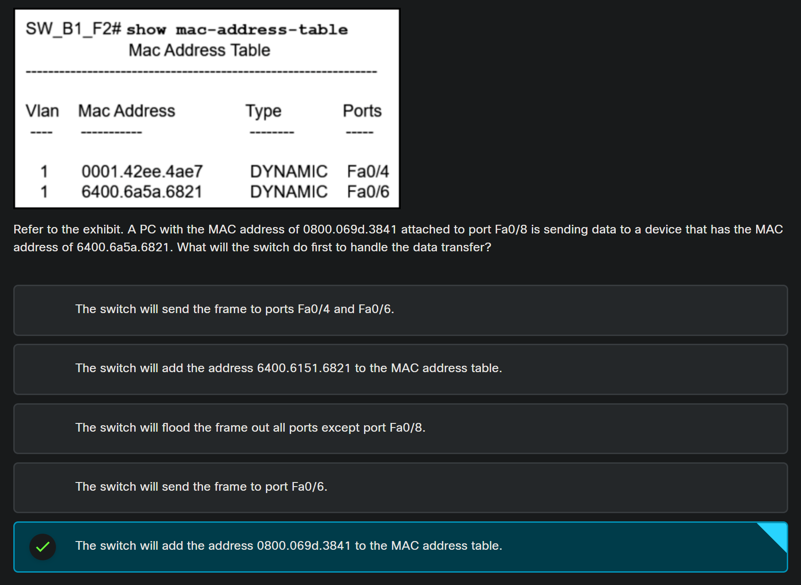


---
