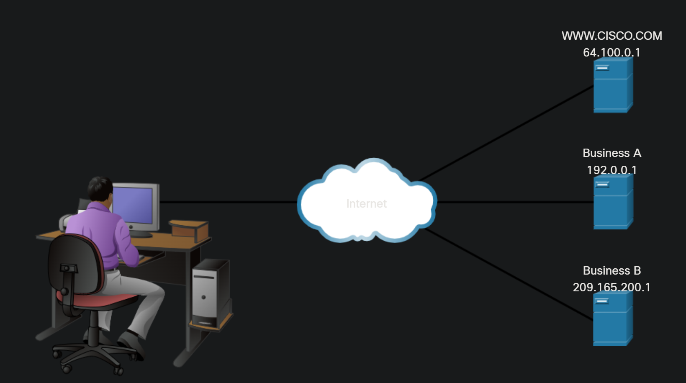
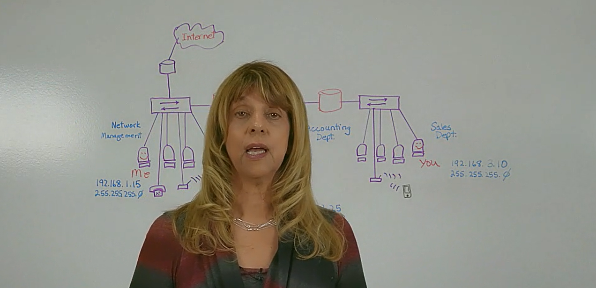
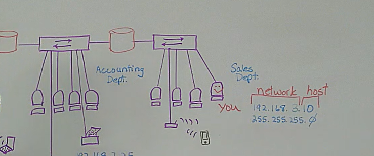
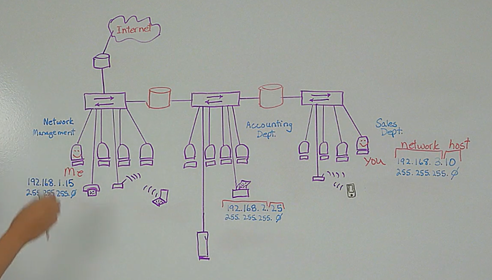
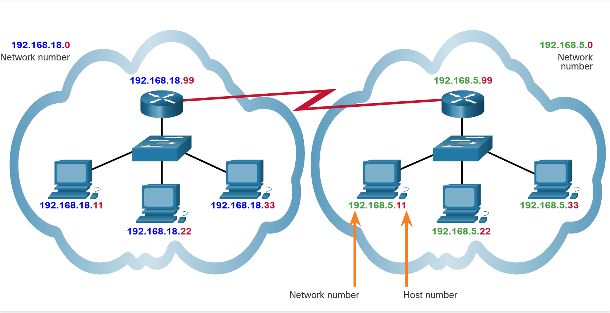
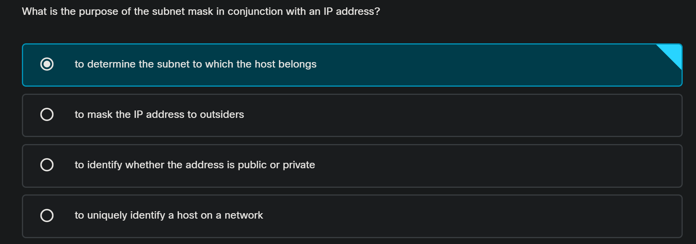
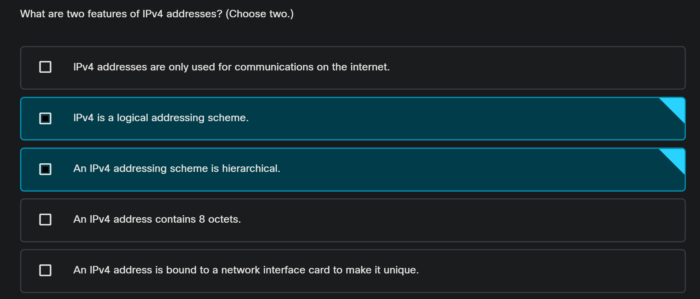
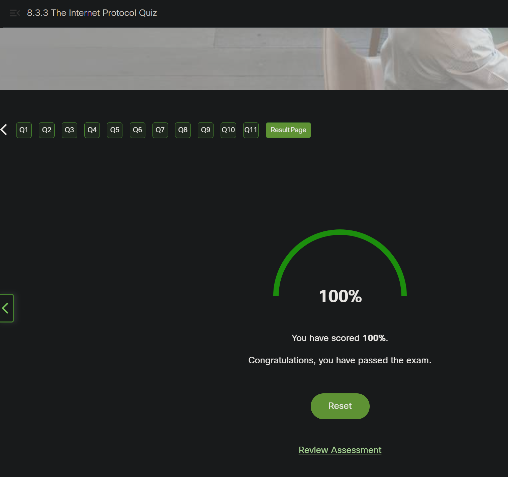

<!-- Custom stylesheet -->
<link rel="stylesheet" href="../../_css/main.css">

<!-- Site logo -->


> [🏚️ README](../../../README.md) | [📁 Courses](../../index.md) | [📚 Vocabulary](../../Vocabulary.md) | [🗓️ Assignments Schedule](../Assignments_Schedule.md) | [🔖 Bookmark](#bookmark)

# CIS 161 - Networking Intro — NOTES: Week 4

> The following are my notes on the **Cisco Networking Academy** Networking Basics course


---

> ✍🏼 THIS WEEK: 
> - Module 8, 9, 10, 11, Checkpoint Exam 3: The Internet Protocol


# MODULE 8: The Internet Protocol

## 📖 8.0 Introduction

### 🟣 8.0.2 What Will I Learn in this Module?

8.0.2 What Will I Learn in this Module?

| Topic Title | Topic Objective |
| --- | --- |
| Purpose of an IPv4 Address | Explain the purpose of an IPv4 address. |
| The IPv4 Address Structure | Explain how IPv4 addresses and subnets are used together. |

---

## 📖 8.1. Purpose of an IPv4 Address


### 🟣 8.1.1 The IPv4 Address

A host needs an IPv4 address to participate on the internet and almost all LANs today. **The IPv4 address is a logical network address** that **identifies a particular host**. It must be properly configured and unique within the LAN, for local communication. It must also be properly configured and unique in the world, for remote communication. This is how a host is able to communicate with other devices on the internet.

An IPv4 address is assigned to the network interface connection for a host. **This connection is usually a network interface card (NIC) installed in the device.** Examples of end-user devices with network interfaces include workstations, servers, network printers, and IP phones. Some servers can have more than one NIC and each of these has its own IPv4 address. **Router interfaces** that provide connections to an IP network **will also have an IPv4 address**.

> - An IPv4 address is assigned to the network interface connection for a host (often a NIC card installed in the device)

> - Examples of end-user devices with network interfaces include workstations, servers, network printers, and IP phones.

> - #NOTE: Some servers can have more than one NIC, each with its own unique IPv4 address

Every packet sent across the internet has a source and destination IPv4 address. This information is required by networking devices to ensure the information gets to the destination and any replies are returned to the source.



---


### 🟣 8.1.2 Octets and Dotted-Decimal Notation

IPv4 addresses are 32 bits in length. Here is an IPv4 address in binary:  
**11010001101001011100100000000001**

> - IPv4 addresses are 32 bits in length

Notice how difficult this address is to read. Imagine having to configure devices with a series of 32 bits! For this reason, the 32 bits are grouped into four 8-bit bytes called octets like this:  
**11010001.10100101.11001000.00000001**

> - #TIP: 32-bits can be grouped and expressed as **four (4) 8-bit octets**

That's better, but still difficult to read. That's why we convert each octet into its decimal value, separated by a decimal point or period. The above binary IPv4 becomes this dotted-decimal representation:  
**209.165.200.1**

> **Note**: For now, you do not need to know how to convert between binary and decimal number systems.

### 🟣 8.1.3 Packet Tracer - Connect to a Web Server

See [Exercise 8.1.3](../Exercises/wk_04/08.01.03__PacketTracer_ConnectWebServer.md)

## 📖 8.2. The IPv4 Address Structure

### 🟣 8.2.1 Video - The IPv4 Address Structure



- How IP addresses work in a multi-network environment
- How does IP know when a device is on a different network?
- Network Management Dept, Accounting Dept, Sales Dept
- Every IP address has a structure, including a network component and a host component



- All the devices in the sales dept local network will have to have the same first 3 octets of their IP address because this network is represented by `192.168.3`
- The individual host numbers (the last octet) will have to be **unique** (no other device on that local network can have the same IP address)

- The Accounting dept network is `192.168.2` network
- Network Mgmt is on the `192.168.1` network

> - The last octet identifies the **host**

> - #GOTCHA: If your IP address doesn't match what your LAN is assigned (the first 3 octets), you WILL NOT be able to COMMUNICATE

#CASE_STUDY

> Jim borrows a laptop from Network Management and tried to use it in the Sales Department — it won't be able to communicate over the IP network. (ie, the internet won't work)



### 🟣 8.2.2 Networks and Hosts

The **logical 32-bit IPv4 address** is hierarchical and is made up of two parts, the network and the host. In the figure, the network portion is blue, and the host portion is red. Both parts are required in an IPv4 address. Both networks have the subnet mask 255.255.255.0. The **subnet mask** is **used to identify the network on which the host is connected.**

> Purpose of the subnet mask: ???

As an example, there is a host with an IPv4 address 192.168.5.11 with a subnet mask of 255.255.255.0. The first three octets, (192.168.5), identify the network portion of the address, and the last octet, (11) identifies the host. This is known as **hierarchical addressing** because the network portion indicates the network on which each unique host address is located. ***Routers only need to know how to reach each network, rather than needing to know the location of each individual host.***

> - **hierarchical addressing:** ???

With IPv4 addressing, **multiple logical networks can exist on one physical network** if the network portion of the logical network host addresses is different. For example: three hosts on a single, physical local network have the same network portion of their IPv4 address (192.168.18) and three other hosts have different network portions of their IPv4 addresses (192.168.5). The hosts with the same network number in their IPv4 addresses will be able to communicate with each other, but **will not be able to communicate with the other hosts without the use of routing**. In this example, there is one physical network and two logical IPv4 networks.

Another example of a hierarchical network is the **telephone system**. With a telephone number, the country code, area code, and exchange represent the network address and the remaining digits represent a local phone number.




### 🟣 8.2.3 Check Your Understanding - IPv4 Address Structure


> ## ✅ Your notes are right—**for a /24**
> 
> The statement “the first 3 octets identify the network” is **not always true**. It is true in the examples from your notes because every example uses the subnet mask `255.255.255.0`, also called `/24`.
> 
> With `/24`:
> 
> ```text
> IP address:   192.168.5.11
> Subnet mask:  255.255.255.0  = /24
> Network:      192.168.5.0
> ```
> 
> The first three octets are network bits because the mask has `255` in those three positions. That leaves the fourth octet as the host portion. Your notes accurately describe that specific subnet-mask situation. [github](https://github.com/superbeppe98/cisco-networking-basics/blob/main/8_The_Internet_Protocol.md)
> 
> ## 🧠 The rule to use instead
> 
> The **subnet mask**, not the position of an octet by itself, determines which part is the network and which part is the host.
> 
> - A mask bit of `1` means the matching IP-address bit belongs to the **network**.
> - A mask bit of `0` means the matching IP-address bit belongs to the **host**.
> - `255` in a mask octet means all 8 bits of that octet are network bits.
> - `0` in a mask octet means all 8 bits of that octet are host bits. [cisco](https://www.cisco.com/c/en/us/support/docs/ip/routing-information-protocol-rip/13788-3.html)
> 
> ## 🔎 Apply it to the question
> 
> Host-A has:
> 
> ```text
> IP address:   172.16.4.100
> Subnet mask:  255.255.0.0
> ```
> 
> Break down the mask:
> 
> | Mask octet | Meaning |
> |---|---|
> | `255` | First octet is network |
> | `255` | Second octet is network |
> | `0` | Third octet is host |
> | `0` | Fourth octet is host |
> 
> So this is a `/16` network—not a `/24` network:
> 
> ```text
> 172.16.4.100 /16
> ^^^^^^^^^^^
> Network portion: 172.16
> Host portion:        4.100
> ```
> 
> To find the network address, set the whole host portion to zero:
> 
> ```text
> 172.16.4.100
> 255.255.0.0
> -------------
> 172.16.0.0
> ```
> 
> Therefore, the correct answer is **172.16.0.0**. Cisco’s explanation likewise identifies `255.255.0.0` as the traditional Class B default mask, where the first two octets are the network portion; it identifies `255.255.255.0` as the mask where the first three octets are the network portion. [cisco](https://www.cisco.com/c/en/us/support/docs/ip/routing-information-protocol-rip/13788-3.html)
> 
> ## ⚖️ Why `172.16.4.0` feels tempting
> 
> `172.16.4.0` would be correct **if** the subnet mask were `255.255.255.0` (`/24`):
> 
> | Host IP | Mask | Network address |
> |---|---|---|
> | `172.16.4.100` | `255.255.255.0` (`/24`) | `172.16.4.0` |
> | `172.16.4.100` | `255.255.0.0` (`/16`) | `172.16.0.0` |
> 
> Your course is introducing the simpler `/24` pattern first, where “first three octets = network” is a useful shortcut. As soon as the mask changes, however, use the **mask rule** rather than the shortcut.
> 
> ## 📌 Study phrase
> 
> > **Count the 255s in the subnet mask—not the octets in the IP address.**
> 
> For whole-octet masks:
> 
> ```text
> 255.0.0.0       = /8  = first 1 octet is network
> 255.255.0.0     = /16 = first 2 octets are network
> 255.255.255.0   = /24 = first 3 octets are network
> ```
> 
> Later, you will also see masks such as `255.255.255.192` (`/26`), where the network/host boundary falls **inside** the fourth octet.


## 📖 8.3. The Internet Protocol Summary

### 🟣 8.3.1 What Did I Learn in this Module?



> #### Purpose of the IPv4 Address
> 
> The IPv4 address is a logical network address that identifies a particular host. It must be properly configured and unique within the LAN, for local communication. It must also be properly configured and unique in the world, for remote communication.
> 
> An IPv4 address is assigned to the network interface connection for a host. This connection is usually a NIC installed in the device.
> 
> Every packet sent across the internet has a source and destination IPv4 address. This information is required by networking devices to ensure the information gets to the destination and any replies are returned to the source.

> #### The IPv4 Address Structure
> 
> The logical 32-bit IPv4 address is hierarchical and is made up of two parts, the network, and the host. As an example, there is a host with an IPv4 address 192.168.5.11 with a subnet mask of 255.255.255.0. The first three octets, (192.168.5), identify the network portion of the address, and the last octet, (11) identifies the host. This is known as hierarchical addressing because the network portion indicates the network on which each unique host address is located.
> 
> Routers only need to know how to reach each network, rather than needing to know the location of each individual host. With IPv4 addressing, multiple logical networks can exist on one physical network if the network portion of the logical network host addresses is different.


### 🟣 8.3.2 Webster - Reflection Questions


### 🟣 8.3.3 The Internet Protocol Quiz

> ## 🧠 Short answer
> 
> A **subnet** is a group of IP addresses that share the same network identity, as defined by a subnet mask. Devices in the same subnet can normally communicate directly on the local network; traffic for a different subnet must go through a router. [cisco](https://www.cisco.com/c/en/us/support/docs/ip/routing-information-protocol-rip/13790-8.pdf)
> 
> You are noticing a real terminology shortcut: learning materials often say “network” when they mean “subnet,” because at the beginner level they often function as the same practical idea.
> 
> ## 🧩 Separate the terms
> 
> | Term | What it means | Example with `172.16.4.100/16` |
> |---|---|---|
> | **Network portion** | The bits/octets the mask marks as the shared network identifier | `172.16` |
> | **Host portion** | The remaining bits that identify one device within that network | `4.100` |
> | **Network address** / **subnet address** | The address representing the subnet itself; all host bits are `0` | `172.16.0.0` |
> | **Subnet** | The whole group/range of addresses sharing that network portion | `172.16.0.0/16` |
> | **Subnet mask** | The rule that separates network bits from host bits | `255.255.0.0` or `/16` |
> 
> So these are related, but they are **not literally interchangeable**:
> 
> - The **network portion** is part of each IP address.
> - A **subnet** is the collection of addresses that have that same network portion.
> - The **network/subnet address** is the special “name” for that collection. Cisco describes a network address as common to all devices on that network, while a host address identifies a particular device. [cisco](https://www.cisco.com/c/en/us/support/docs/ip/routing-information-protocol-rip/13790-8.pdf)
> 
> ## 🏘️ An analogy
> 
> Think about a street:
> 
> ```text
> Street name: Oak Street
> House number: 100
> ```
> 
> - **Network portion** = `Oak Street`
> - **Host portion** = `100`
> - **Subnet** = every address on Oak Street
> - **Network address** = a label for the street itself, rather than any one house
> - **Subnet mask** = the rule that tells you where “street name” ends and “house number” begins
> 
> For `172.16.4.100` with `255.255.0.0`:
> 
> ```text
> 172.16 | 4.100
> network| host
> ```
> 
> Every address beginning with `172.16` is in the same `/16` subnet:
> 
> ```text
> 172.16.0.0/16     network/subnet address
> 172.16.0.1        usable host address
> 172.16.4.100      usable host address
> 172.16.200.50     usable host address
> 172.16.255.255    broadcast address
> ```
> 
> All of those share the network portion `172.16`, so they belong to subnet **172.16.0.0/16**.
> 
> ## ✂️ Why it is called a “subnet”
> 
> “Subnet” means **sub-network**: a smaller logical network created from a larger address block. Subnetting divides a network into smaller portions by using some bits that originally could have been host bits as additional network-identifying bits. [cisco](https://www.cisco.com/c/en/us/support/docs/ip/routing-information-protocol-rip/13790-8.pdf)
> 
> For example, the private address block `172.16.0.0/16` can be divided into smaller `/24` subnets:
> 
> ```text
> 172.16.0.0/24
> 172.16.1.0/24
> 172.16.2.0/24
> ...
> 172.16.255.0/24
> ```
> 
> In a `/24`, the first three octets are network bits. Thus:
> 
> ```text
> 172.16.4.100/24 → subnet 172.16.4.0/24
> ```
> 
> But with a `/16`, only the first two octets are network bits:
> 
> ```text
> 172.16.4.100/16 → subnet 172.16.0.0/16
> ```
> 
> ## 📌 How to read course wording
> 
> When your course says:
> 
> > “The first three octets identify the network.”
> 
> Mentally translate it to:
> 
> > “**With the `/24` mask being used in this example**, the first three octets are the network portion, and the devices sharing those three octets belong to the same subnet.”
> 
> That translation keeps the core idea correct while preventing the common mistake of assuming the first three octets are *always* the network. A subnet mask determines the boundary between the network and host portions. [portnox](https://www.portnox.com/cybersecurity-101/networking/what-is-a-subnet-mask/)


#CASE_STUDY

> The IT group needs to design and deploy IPv4 network connectivity in a new high school computer lab. The network design requires multiple logical networks be deployed on one physical network.  Which technology is required to enable computers on different logical networks to communicate with each other?

- [ ] switching   1 of 4
- [ ] mapping   2 of 4
- [ ] routing   3 of 4 #CORRECT?
- [ ] hosting   4 of 4



#PROOF 100%



---

# MODULE 9: IPv4 and Network Segmentation

## 📖 9.0 Introduction

### 🟣 


## 📖 9.0. Introduction


### 🟣 9.0.1 Webster - Why Should I Take this Module?


### 🟣 9.0.2 What Will I Learn in this Module?


## 📖 9.1. IPv4 Unicast, Broadcast, and Multicast


### 🟣 9.1.1 Video - IPv4 Unicast


### 🟣 9.1.2 Unicast


### 🟣 9.1.3 Video - IPv4 Broadcast


### 🟣 9.1.4 Broadcast


### 🟣 9.1.5 Video - IPv4 Multicast


### 🟣 9.1.6 Multicast


### 🟣 9.1.7 Activity - Unicast, Broadcast, or Multicast


## 📖 9.2. Types of IPv4 Addresses


### 🟣 9.2.1 Public and Private IPv4 Addresses


### 🟣 9.2.2 Routing to the Internet


### 🟣 9.2.3 Activity - Pass or Block IPv4 Addresses


### 🟣 9.2.4 Special Use IPv4 Addresses


### 🟣 9.2.5 Legacy Classful Addressing


### 🟣 9.2.6 Assignment of IP Addresses


### 🟣 9.2.7 Activity - Public or Private IPv4 Address


### 🟣 9.2.8 Check Your Understanding - Types of IPv4 Addresses


## 📖 9.3. Network Segmentation


### 🟣 9.3.1 Video - Network Segmentation


### 🟣 9.3.2 Broadcast Domains and Segmentation


### 🟣 9.3.3 Problems with Large Broadcast Domains


### 🟣 9.3.4 Reasons for Segmenting Networks


### 🟣 9.3.5 Check Your Understanding - Network Segmentation


## 📖 9.4. IPv4 and Network Segmentation Summary


### 🟣 9.4.1 What Did I Learn in this Module?


### 🟣 9.4.2 Webster - Reflection Questions


### 🟣 9.4.3 IPv4 and Network Segmentation Quiz


---

# MODULE 10: IPv6 Addressing Formats and Rules

## 📖 10.0 Introduction

### 🟣 


## 📖 10.0. Introduction


### 🟣 10.0.1 Webster - Why Should I Take this Module?


### 🟣 10.0.2 What Will I Learn in this Module?


## 📖 10.1. IPv4 Issues


### 🟣 10.1.1 The Need for IPv6


### 🟣 10.1.2 IPv4 and IPv6 Coexistence


### 🟣 10.1.3 Check Your Understanding - IPv4 Issues


## 📖 10.2. IPv6 Addressing


### 🟣 10.2.1 Hexadecimal Number System


### 🟣 10.2.2 IPv6 Addressing Formats


### 🟣 10.2.3 Video - IPv6 Formatting Rules


### 🟣 10.2.4 Rule 1 – Omit Leading Zeros


### 🟣 10.2.5 Rule 2- Double Colon


### 🟣 10.2.6 Activity - IPv6 Address Representations


## 📖 10.3. IPv6 Addressing Formats and Rules Summary


### 🟣 10.3.1 What Did I Learn in this Module?


### 🟣 10.3.2 Webster - Reflection Questions


### 🟣 10.3.3 IPv6 Addressing Formats and Rules Quiz


---

# MODULE 11: Dynamic Addressing with DHCP


## 📖 11.0. Introduction


### 🟣 11.0.1 Webster - Why Should I Take this Module?


### 🟣 11.0.2 What Will I Learn in this Module?


## 📖 11.1. Static and Dynamic Addressing


### 🟣 11.1.1 Static IPv4 Address Assignment


### 🟣 11.1.2 Dynamic IPv4 Address Assignment


### 🟣 11.1.3 DHCP Servers


### 🟣 11.1.4 Check Your Understanding - Static and Dynamic Addressing


## 📖 11.2. DHCPv4 Configuration


### 🟣 11.2.1 Video - DHCPv4 Operation


### 🟣 11.2.2 Video - DHCP Service Configuration


### 🟣 11.2.3 Packet Tracer - Configure DHCP on a Wireless Router


## 📖 11.3. Dynamic Addressing with DHCP Summary


### 🟣 11.3.1 What Did I Learn in this Module?


### 🟣 11.3.2 Webster - Reflection Questions


### 🟣 11.3.3 Dynamic Addressing with DHCP Quiz


---

## 📖 CHECKPOINT EXAM: The Internet Protocol

---

