<!-- Custom stylesheet -->
<link rel="stylesheet" href="../../_css/main.css">

<!-- Site logo -->

> [🏚️ README](../../../README.md) | [📁 Courses](../../index.md) | [📚 Vocabulary](../../Vocabulary.md) | [🗓️ Assignments Schedule](../Assignments_Schedule.md) | [🔖 Bookmark](#bookmark)

# CIS 161 - Networking Intro — NOTES: Week 5

> The following are my notes on the **Cisco Networking Academy** Networking Basics course

---

> ✍🏼 THIS WEEK:
>
> - Module 12, 13, 14, Checkpoint Exam 4: Communication Between Networks

# MODULE 12: Gateways to Other Networks

## 📖 12.0 Introduction

### 🟣 12.0.1 Webster - Why Should I Take this Module?

### 🟣 12.0.2 What Will I Learn in this Module?

## 📖 12.1. Network Boundaries

### 🟣 12.1.1 Video - Gateways to Other Networks

> In this lesson, I'm going to talk about gateways, and in particular, default gateways. So what's a gateway? Okay, a gateway, as the word implies, is a way for traffic to leave one local network and be forwarded to other remote networks. So basically, think about the default gateway as the door out of the room. Okay, the room that I'm in right now, if I want to go out to the hallway, I'm going to have to exit through the door. When a computer wants to send a message off of its same local network, it needs to also exit its local network, and to go out and be forwarded to the actual destination. As we learned earlier, computers figure out whether or not a destination is on their same local network by going through a process of binary ANDing, which takes the subnet mask and ANDs it with the destination IP address to determine if the network portion of the address is exactly the same as the network portion of the sending host. So in the case of where that is not true, the computer has to actually send the packet to the gateway. We learned that every host on a network has to have, at the very minimum, an IP address and a subnet mask. Now, if that host intends on speaking to destinations that are not on its local network, it also has to be configured with the address of its default gateway. Usually in today's network, the default gateway configured on a device is the router interface that the traffic would come to first on its path to the internet. So basically, if we were to look at me, over here in the network management department, and if I was trying to reach a server that was out on the internet, my traffic would basically travel up through my switch and it would end up at the address assigned to the interface, router interface closest to me on the path to the internet. Now, if we go to a different host, say, for example, this one in the accounting department, and they were trying to reach the exact same server, their traffic would travel again through their switch, but they would enter the router at a different router interface. So the default gateway configured on hosts in the accounting department is different than my default gateway configured in my network management department. Once the host determines that the address of the destination is not on its same local network, what it does is it ARPs for the MAC address of the default gateway. Now, this is important to remember, because one of the problems that you find in networks frequently is because there's a mistake made, the default gateway address is not on the same local network. For example, if I accidentally configured this with 11 instead of one... My computer would not be able to send traffic using ARP to its default gateway address. So we have to be very careful when we are configuring network settings that we have the correct IP address, the correct subnet masks, so that my computer can accurately predict who is on its own local network and who is off the local network located on a remote network, and the default gateway address so that it knows what router to send traffic to in order to go off of its own local network.

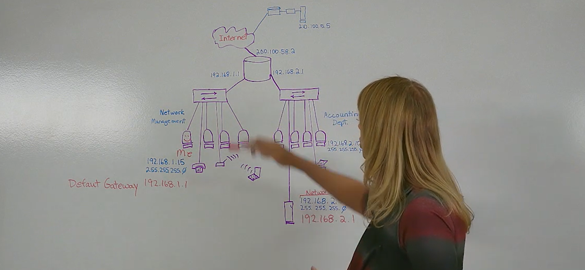

- default gateway config on hosts in the marketing dept is different than the default gateway in the network management dept

### 🟣 12.1.2 Routers as Gateways

The router provides a gateway through which hosts on one network can communicate with hosts on different networks. Each interface on a router is connected to a separate network.

The IPv4 address assigned to the interface identifies which local network is connected directly to it.

Every host on a network must use the router as a gateway to other networks. Therefore, each host must know the IPv4 address of the router interface connected to the network where the host is attached. This address is known as the default gateway address. It can be either statically configured on the host or received dynamically by DHCP.

When a wireless router is configured to be a DHCP server for the local network, it automatically sends the correct interface IPv4 address to the hosts as the default gateway address. In this manner, all hosts on the network can use that IPv4 address to forward messages to hosts located at the ISP and get access to hosts on the internet. Wireless routers are usually set to be DHCP servers by default.

The IPv4 address of that local router interface becomes the default gateway address for the host configuration. The default gateway is provided, either statically or by DHCP.

When a wireless router is configured as a DHCP server, it provides its own internal IPv4 address as the default gateway to DHCP clients. It also provides them with their respective IPv4 address and subnet mask, as shown in the figure.

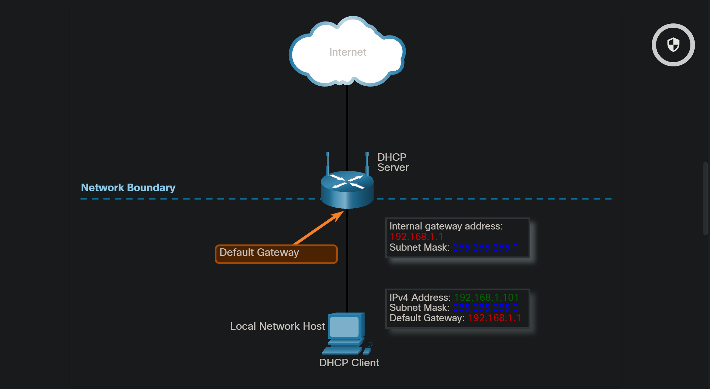

---

### 🟣 12.1.3 Routers as Boundaries Between Networks

The wireless router acts as a DHCP server for all local hosts attached to it, either by Ethernet cable or wirelessly. These local hosts are referred to as being located on an internal, or inside, network. Most DHCP servers are configured to assign private addresses to the hosts on the internal network, rather than internet routable public addresses. This ensures that, by default, the internal network is not directly accessible from the internet.

The default IPv4 address configured on the local wireless router interface is usually the first host address on that network. **Internal hosts** must be assigned **addresses within the same network** as the wireless router, either statically configured, or through DHCP. When configured as a DHCP server, the wireless router provides addresses in this range. It also provides the subnet mask information and its own interface IPv4 address as the default gateway, as shown in the figure.

> - default IPv4 address configured on the local wireless router interface is usually the first host address on that network

Many ISPs also use DHCP servers to provide IPv4 addresses to the internet side of the wireless router installed at their customer sites. The network assigned to the internet side of the wireless router is referred to as the external, or outside, network.

When a wireless router is connected to the ISP, it acts like a DHCP client to receive the correct external network IPv4 address for the internet interface. ISPs usually provide an internet-routable address, which enables hosts connected to the wireless router to have access to the internet.

The wireless router serves as the boundary between the local internal network and the external internet.

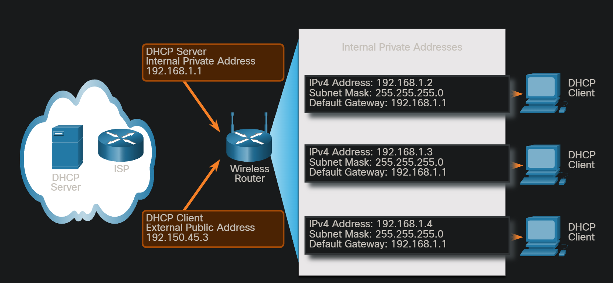

---

### 🟣 12.1.4 Check Your Understanding - Network Boundaries

For two hosts that are on the same network, which of the following statements are true? (Choose three.)

That’s right.

Hosts will typically always have different MAC and IP addresses. However, hosts on the same network will use the same default gateway address. A host on another network would use a different default gateway address.

---

For two hosts, each on a different network, which of the following statements are true? (Choose three.)

That’s right.

Hosts will typically always have different MAC and IP addresses. However, hosts on the same network will use the same default gateway address. A host on another network would use a different default gateway address.

---

## 📖 12.2. Network Address Translation

### 🟣 12.2.1 Video - Introduction to NAT

- Private IP addresses
- NAT is needed going from private address to public address
- Private can be used within organization, but when you need to go outside your org, across the public internet, you need to have a REGISTERED PUBLIC IP address
- Privatre IP Networks:

| IP          | GATEWAY       |
| ----------- | ------------- |
| 192.168.0.0 | 255.255.255.0 |
| 172.16.0.0  | 255.255.0.0   |
| 10.0.0.0    | 255.0.0.0     |

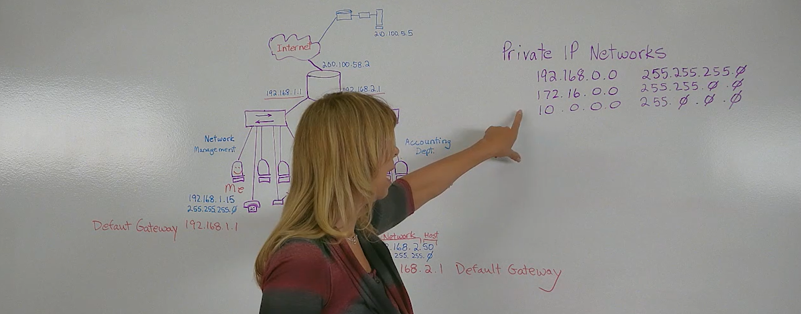

- The 192.168.0 network is most common for home networks and small organizations
- 172.16 only uses 16 bits for the network mask so you can have many more IPs
- 10.0.0.0 is used **primarily for very large enterprises**

- The internet will only route registered public IP addresses -- that's why NAT was developed
- **Network Addressed Translation:** a private-addressed host can send traffic over the internet
- The router

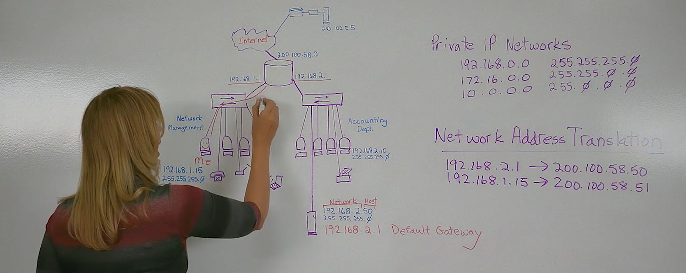

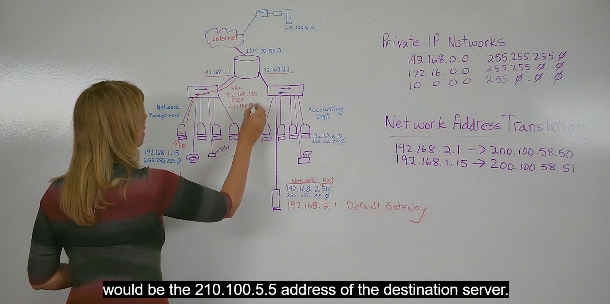

#PROOF

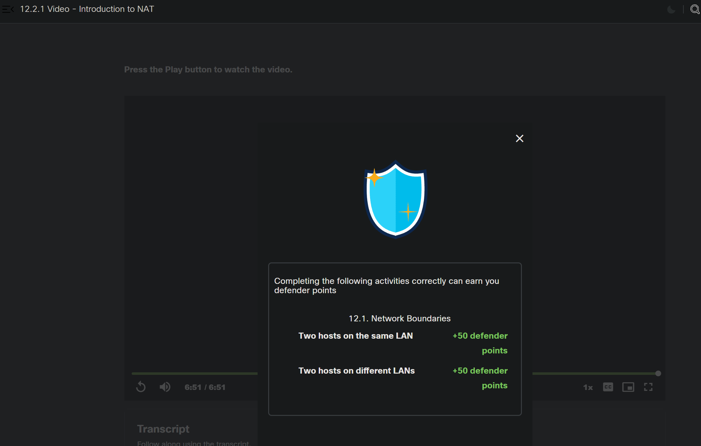

---

### 🟣 12.2.2 Packet Tracer - Examine NAT on a Wireless Router

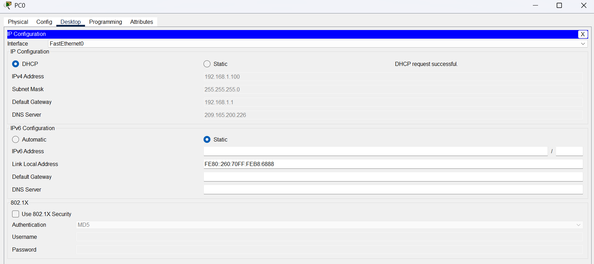

PC0
192.168.1.100  | 192.168.1.1

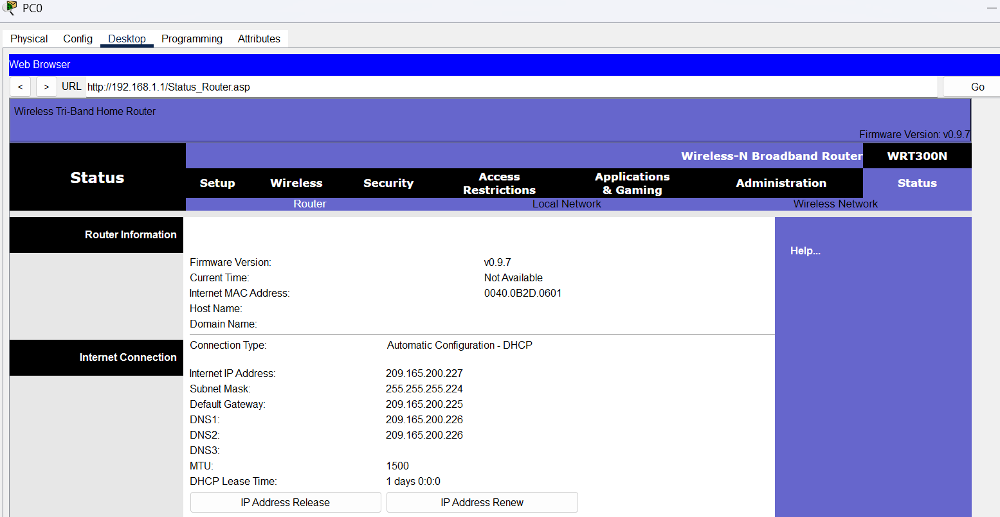

ISP address: 209.165.200.227

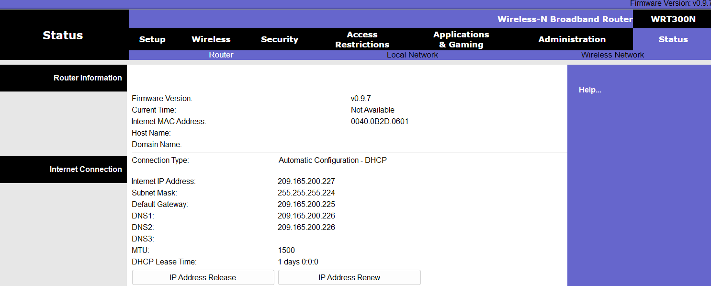

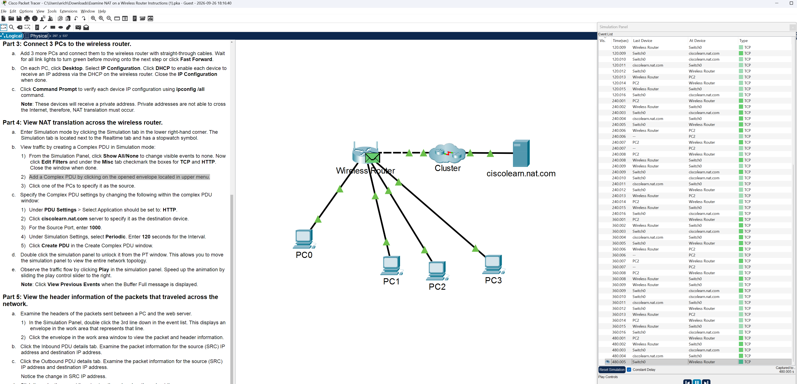

#PROOF

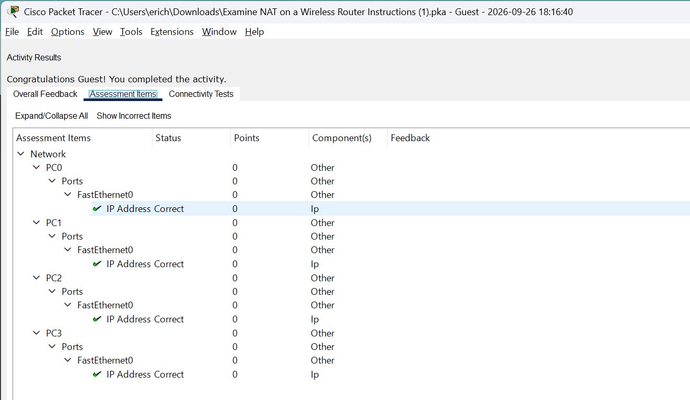

## 📖 12.3. Gateways to Other Networks Summary

### 🟣 12.3.1 What Did I Learn in this Module?

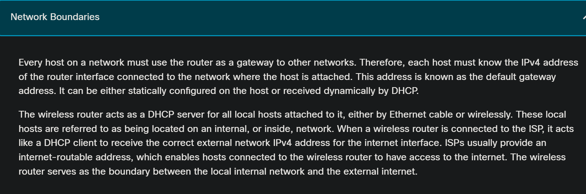

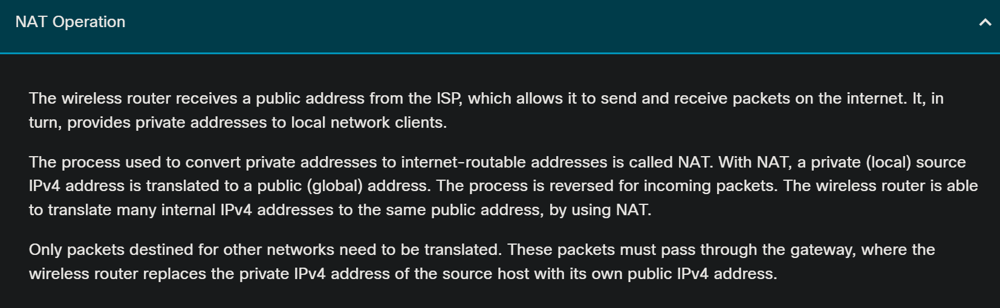

**Network Boundaries**

Every host on a network must use the router as a gateway to other networks. Therefore, each host must know the IPv4 address of the router interface connected to the network where the host is attached. This address is known as the default gateway address. It can be either statically configured on the host or received dynamically by DHCP.

The wireless router acts as a DHCP server for all local hosts attached to it, either by Ethernet cable or wirelessly. These local hosts are referred to as being located on an internal, or inside, network. When a wireless router is connected to the ISP, it acts like a DHCP client to receive the correct external network IPv4 address for the internet interface. ISPs usually provide an internet-routable address, which enables hosts connected to the wireless router to have access to the internet. The wireless router serves as the boundary between the local internal network and the external internet.

**NAT Operation**

The wireless router receives a public address from the ISP, which allows it to send and receive packets on the internet. It, in turn, provides private addresses to local network clients.

The process used to convert private addresses to internet-routable addresses is called NAT. With NAT, a private (local) source IPv4 address is translated to a public (global) address. The process is reversed for incoming packets. The wireless router is able to translate many internal IPv4 addresses to the same public address, by using NAT.

Only packets destined for other networks need to be translated. These packets must pass through the gateway, where the wireless router replaces the private IPv4 address of the source host with its own public IPv4 address.

### 🟣 12.3.2 Webster - Reflection Questions

### 🟣 12.3.3 Gateways to Other Networks Quiz

---

# MODULE 13: The ARP Process

## 📖 13.0 Introduction

### 🟣 13.0.1 Webster - Why Should I Take this Module

### 🟣 13.0.2 What Will I Learn in this Module?

## 📖 13.1. MAC and IP

### 🟣 13.1.1 Destination on Same Network

### 🟣 13.1.2 Destination on Remote Network

### 🟣 13.1.3 Packet Tracer - Identify MAC and IP Addresses

### 🟣 13.1.4 Check Your Understanding - MAC and IP

## 📖 13.2. Broadcast Containment

### 🟣 13.2.1 Video - The Ethernet Broadcast

### 🟣 13.2.2 Broadcast Domains

### 🟣 13.2.3 Access Layer Communication

### 🟣 13.2.4 Video - Address Resolution Protocol

### 🟣 13.2.5 ARP

### 🟣 13.2.6 Check Your Understanding - Broadcast Containment

## 📖 13.3. The ARP Process Summary

### 🟣 13.3.1 What Did I Learn in this Module?

### 🟣 13.3.2 Webster - Reflection Questions

### 🟣 13.3.3 The ARP Process Quiz

---

# MODULE 14: Routing Between Networks

## 📖 14.0 Introduction

### 🟣 14.0.1 Webster - Why Should I Take this Module?

### 🟣 14.0.2 What Will I Learn in this Modules?

## 📖 14.1. The Need for Routing

### 🟣 14.1.1 Video - Dividing the Local Network

### 🟣 14.1.2 Now We Need Routing

### 🟣 14.1.3 Check Your Understanding - The Need for Routing

## 📖 14.2. The Routing Table

### 🟣 14.2.1 Video - Router Packet Forwarding

### 🟣 14.2.2 Video - Messages Within and Between Networks - Part 1

### 🟣 14.2.3 Video - Messages Within and Between Networks - Part 2

### 🟣 14.2.4 Routing Table Entries

### 🟣 14.2.5 The Default Gateway

### 🟣 14.2.6 Check Your Understanding - Select the Default Gateway

### 🟣 14.2.7 Check Your Understanding - The Routing Table

## 📖 14.3. Create a LAN

### 🟣 14.3.1 Local Area Networks

### 🟣 14.3.2 Local and Remote Network Segments

### 🟣 14.3.3 Packet Tracer - Observe Traffic Flow in a Routed Network

### 🟣 14.3.4 Packet Tracer - Create a LAN

## 📖 14.4. Routing Between Networks Summary

### 🟣 14.4.1 What Did I Learn in this Module?

### 🟣 14.4.2 Webster - Reflection Questions

### 🟣 14.4.3 Routing Between Networks Quiz

---

## CHECKPOINT EXAM: Communication Between Networks

---
