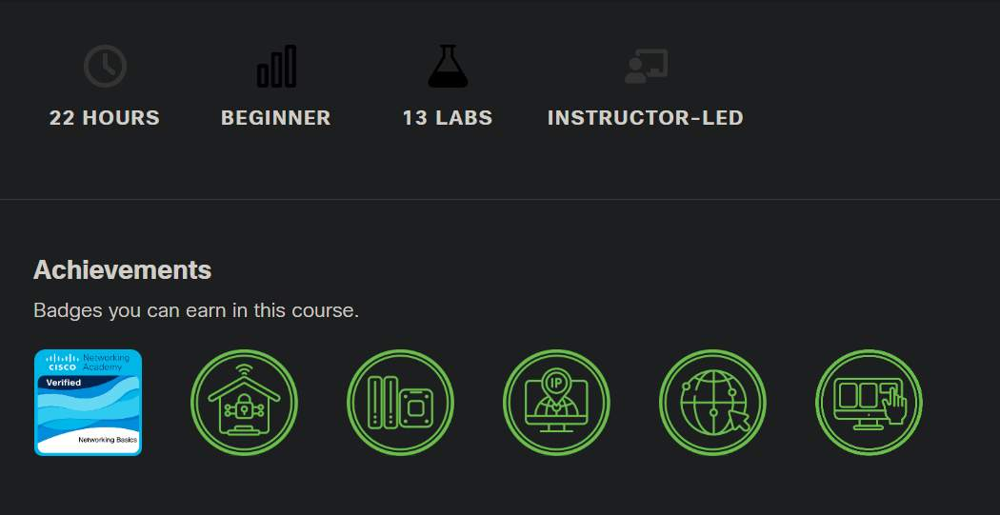

<!-- 🔗 Custom Stylesheet -->
<link rel="stylesheet" href="../../../_css/main.css">

<!-- 🖼️ Site Logo -->

# NOTES: Week 1 (CIS 161 - Networking Intro)

---

# Cisco Networking Basics

>  - #SOLVED: It seems that the **Netacad** course did not open up until the previous video was watched. So, it seems there are `digital prerequisites` for accessing certain courses and platforms, although the ACCESS KEYS have already been entered

**Available Badges:**

## Overview

**Instructor-led Version**

Learn from an educator to enrich and customize your learning experience.

The internet is built on computer networks. So no matter what kind of tech career you are interested in, it is essential to know some networking basics! Whether you are preparing for a career in networking, refreshing your knowledge for an industry-recognized certification, or are just curious about what networking is all about, this is the place for you.  
  
This course covers the foundation of networking and network devices, media, and protocols. You will observe data flowing through a network and configure devices to connect to networks. Finally, you will learn how to use different network applications and protocols to accomplish networking tasks. The knowledge and skills you gain can give you a starting point to find a rewarding career in tech.

Here’s what you will learn.

## 🗃️ My Knowledge Check

## 🗃️ Course Introduction

- First Time in this Course
- Student Resources
- Download Cisco Packet Tracer

## 🗃️ Module 1: Communication in a Connected World

### - 1.0. Introduction
  - 1.0.1 Webster - Why Should I Take this Module?
  - 1.0.2 What Will I Learn in this Module?

### - 1.1. Network Types
  - 1.1.1 Video - Welcome to the World of Networking
  - 1.1.2 Everything is Online
  - 1.1.3 Who Owns “The Internet”?
  - 1.1.4 Local Networks
  - 1.1.5 Mobile Devices
  - 1.1.6 Connected Home Devices
  - 1.1.7 Other Connected Devices
  - 1.1.8 Check Your Understanding - Network Types

### - 1.2. Data Transmission
  - 1.2.1 Video - Types of Personal Data
  - 1.2.2 The Bit
  - 1.2.3 Common Methods of Data Transmission
  - 1.2.4 Check Your Understanding - Data Transmission

### - 1.3. Bandwidth and Throughput
  - 1.3.1 Bandwidth
  - 1.3.2 Throughput
  - 1.3.3 Video - Throughput
  - 1.3.4 Check Your Understanding - Bandwidth and Throughput

### - 1.4. Communications in a Connected World Summary
  - 1.4.1 What Did I Learn in this Module?
  - 1.4.2 Webster - Reflection Questions
  - 1.4.3 Communications in a Connected World Quiz

## 🗃️ Module 2: Network Components, Types, and Connections

### - 2.0. Introduction
  - 2.0.1 Webster - Why Should I Take this Module?
  - 2.0.2 What Will I Learn in this Module?

### - 2.1. Clients and Servers
  - 2.1.1 Video - Clients and Servers
  - 2.1.2 Client and Server Roles
  - 2.1.3 Peer-to-Peer Networks
  - 2.1.4 Peer-to-Peer Applications
  - 2.1.5 Multiple Roles in the Network
  - 2.1.6 Check Your Understanding - Clients and Servers

### - 2.2. Network Components
  - 2.2.1 Video - Network Infrastructure Symbols
  - 2.2.2 Network Infrastructure
  - 2.2.3 End Devices
  - 2.2.4 Check Your Understanding - Network Components

### - 2.3. ISP Connectivity Options
  - 2.3.1 ISP Services
  - 2.3.2 ISP Connections
  - 2.3.3 Cable and DSL Connections
  - 2.3.4 Additional Connectivity Options
  - 2.3.5 Check Your Understanding - ISP Connectivity Options

### - 2.4. Network Components, Types, and Connections Summary
  - 2.4.1 What Did I Learn in this Module?
  - 2.4.2 Webster - Reflection Questions
  - 2.4.3 Network Components, Types, and Connections Quiz

... etc ...

(*through module 17 and more*)

---

