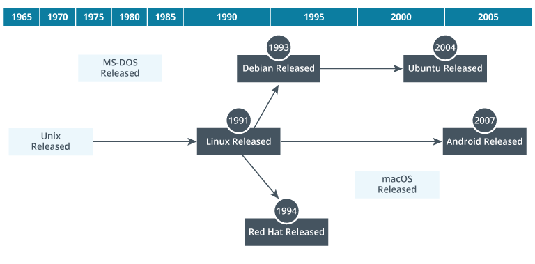
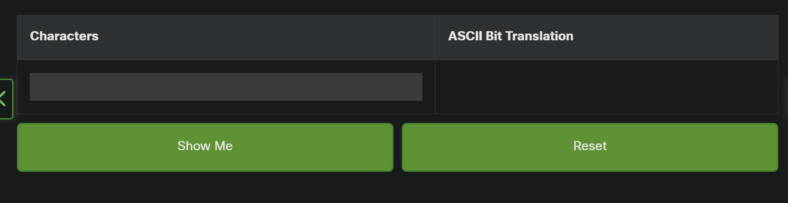
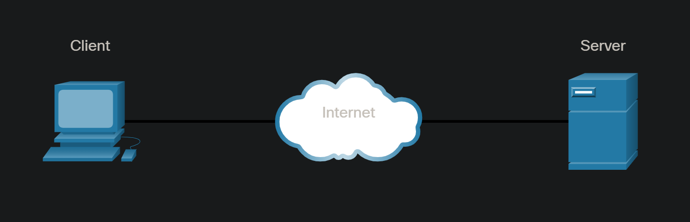
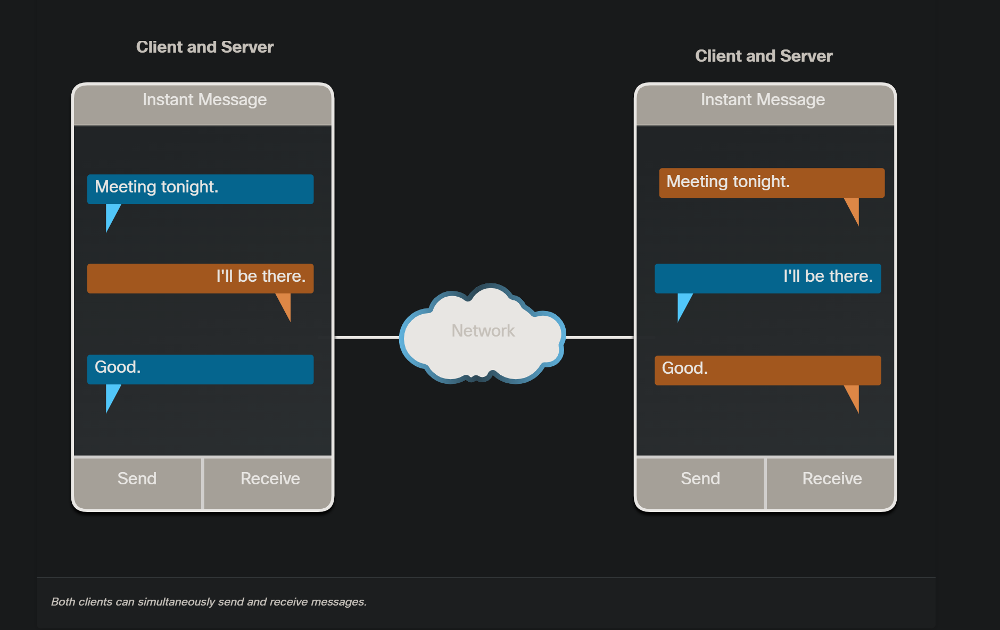
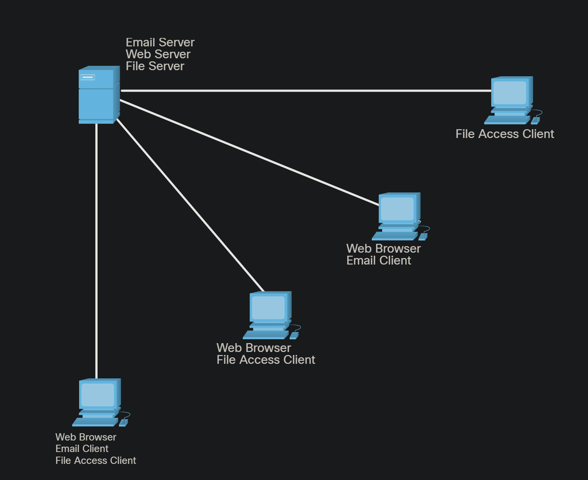
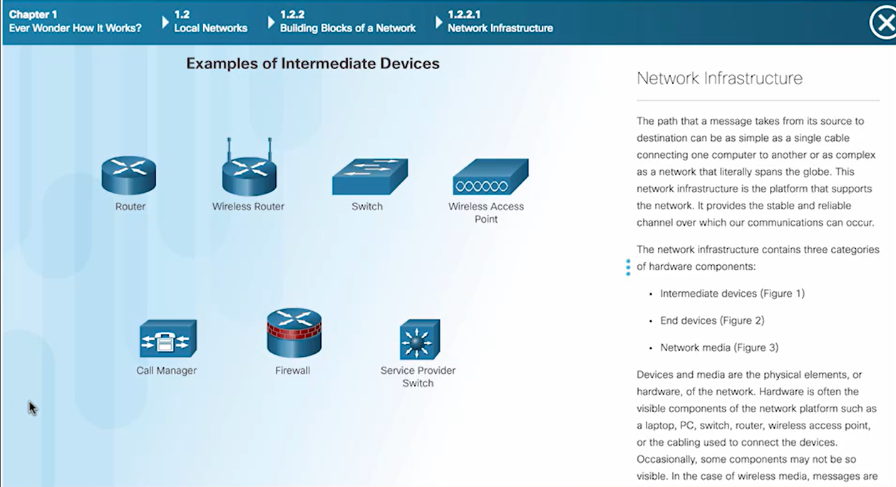
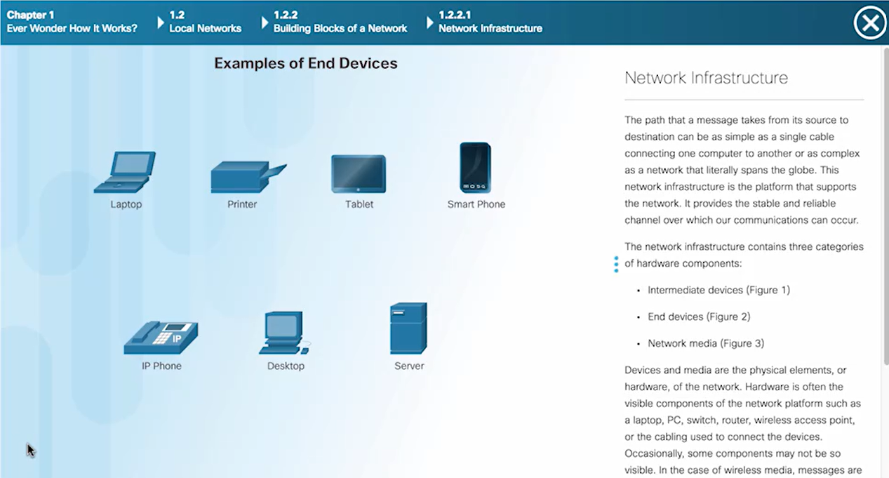

<!-- Custom stylesheet -->
<link rel="stylesheet" href="../../_css/main.css">

<!-- Site logo -->

> [🏚️ README](../../../README.md) | [📁 Courses](../../index.md) | [📚 Vocabulary](../../Vocabulary.md) | [🗓️ Assignments Schedule](../Assignments_Schedule.md) | [🔖 Bookmark](#bookmark)

# CIS 171 - Linux I:    NOTES: Week 2 - IT Support Fundamentals (Aug 24 - 31)

## ⭐ **This week, you will:**

- N/A

- - -

> The following are my notes on the **CompTIA: Linux+ CertMaster Perform** V8 learning platform course

## 📖 1.1 - Use Linux Basics

Working with Linux begins with an understanding of the command line. Linux servers are primarily managed from the command line, using shells such as Bash. Bash enforces a particular syntax or way of structuring commands. In addition, Linux holds its configurations in text files, so it's critical that sysadmins can edit these files to manage system settings. Man pages are available as quick reference documents to help administrators recall the function of specific commands and any available options.

> - 📌 #TIP: Bash is a common command line shell used to manage Linux machines

> - **man page:** Quick reference docs to help admins understand the purpose, available options, and syntax of a command

Misconfigurations or physical failures may provide troubleshooting opportunities, so sysadmins should follow a **standard methodology** to help **narrow the scope** of problems, **solve the root cause** of the issue, and **manage documentation** related to configuration issues.

**Exam Objectives**

*   1.1.2 Linux concepts > **Filesystem Hierarchy Standard**
*   1.1.3 Linux concepts > **Server architectures**
*   1.1.4 Linux concepts > **Distributions**
*   1.1.5 Linux concepts > **GUI**
*   1.5.1 Shell operations > **Common environmental variables**
*   1.5.5 Shell operations > **Basic Shell Utilities**
*   2.1.1 Manage file system > **Utilities**
*   2.2.6 Manage local accounts > **List**
*   4.2.10 Shell Scripting > **Variables**
*   5.2.1 Troubleshoot Linux > **Common issues**

### 🟣 1.1.1 Linux Distributions

**Operating systems** are layers between computer hardware and user programs, like web browsers or word processors. Operating systems provide an environment for these programs to run and enable users to manage computer components, like turning off a web camera or printing documents. Microsoft Windows, Apple macOS, and Linux are the three most common operating systems.

> - **operating system:** Software that facilitates the control and configuration of the computer device via device drivers, services, and one or more user interfaces.

Linux is unique among these three because it is **open-source**. The source code that makes up the operating system is available to anyone at no cost. Any person can change the Linux source code to customize the operating system. Most people will never do this, but the possibility exists. Windows and macOS are **closed-source** or **proprietary**, meaning they don't expose the operating system's programming code and don't allow anyone else to modify it.

> - **open-source**: Licensing model that grants permissive rights to end-users, such as to install, use, modify, and distribute a software product and its source code, as long as redistribution permits the same rights.

> - **proprietary:** Software code or security research that remains in the ownership of the developer and may only be used under permitted licence conditions; closed-source

Linux is a powerful and flexible operating system, so it is commonly used on **servers** to support massive amounts of email traffic, web browsing, file storage, and more. Almost all cloud computing platforms employ Linux, making it a very common choice for high-tech environments. Linux is a useful desktop operating system for day-to-day use, too. It can be an excellent option for home users, business professionals, and developers.

> - **server:** A server provides shared resources on the network and allows clients to access this information. The advantage of a server-based system is that resources can be administered and secured centrally. Servers must be kept secure by careful configuration (running only necessary services) and maintenance (OS and application updates, malware/intrusion detection, and so on). Where a network is connected to the Internet, servers storing private information or running local network services should be protected by firewalls so as not to be accessible from the Internet.

Because anyone can create and release their own version of Linux, there are thousands of different options. These individual releases are called distributions (or "**distro**" for short). Distributions are purpose-specific versions of Linux that address a specific need, such as system security or application hosting.

> - **distro:** One of several fully functional operating systems and members of the Linux family that run the Linux kernel, GNU software, and additional components; distribution

Many distributions trace their history back to one of two specific Linux distributions: **Red Hat Linux** or **Debian Linux**. One of the main differences between these two distros is how they manage software. The distros derived from Red Hat Linux use different software managers than those derived from Debian Linux. The software is also packaged differently.

Some of the most common distros include:

*   Fedora Linux
*   Ubuntu Desktop, Server, Core
*   Red Hat Enterprise Linux (RHEL)
*   Rocky Linux
*   AlmaLinux
*   Linux Mint
*   Debian
*   openSUSE

Figure 1. Linux Release Timeline

> **🏷️ Image Description**:  After the release of Linux in 1991, the two major branches, Debian and Red Hat, followed quickly and generated hundreds of distros.

Many of these distributions fulfill specific roles in the marketplace, including desktop or workstation computers, servers, IoT devices, mobile devices, or other functions. While mobile and **IoT** implementations are common, **the focus of this course is on server deployments**. One of the most important characteristics of a distribution is its included software.

> - 📌 #TIP: This course focuses on *Linux for SERVER DEPLOYMENTS*

> - **IoT:** internet of things; Devices that can report state and configuration data and be remotely managed over IP networks.

Some Linux distributions contain **end-user applications**, such as word processors or presentation software. Others contain server services, such as web services or file storage. Still other distributions include security software or creative applications, such as music editing.

Linux server deployments are put to use in the following ways:

*   **Webserver:** Hosts one or more websites.
*   **Name resolution:** Hosts Domain Name System (DNS) name resolution services.
*   **File:** Stores business data, usually in some form of text document.
*   **Print:** Manages the print process and access to print services.
*   **Log:** Centralizes and stores log files from other systems.
*   **Virtualization/container:** Hosts virtual machine or container virtualization software.
*   **Database:** Hosts one or more databases.
*   **Cluster:** Works with other cluster nodes to host high-performance, fault-tolerant services.

> - **DNS:** domain name system; Service that maps fully qualified domain name labels to IP addresses on most TCP/IP networks, including the Internet. Also known as "DNS."

> - **virtual machine:** Guest operating system installed on a host computer using virtualization software (a hypervisor), such as Microsoft Hyper-V or VMware. Also known as a "VM."

> - **container:** Type of virtualization applied by a host operating system to provision an isolated execution environment for an application.

> - **DevOps:** A combination of software development and systems operations, and refers to the practice of integrating one discipline with the other.

> - **DevSecOps:** A combination of software development, security operations, and systems operations, and refers to the practice of integrating each discipline with the others.

**Linux is heavily involved in modern infrastructure management.** A **DevOps** approach to the management of such Linux servers and services works toward high quality, iterative, and frequent updates and releases. Linux tends to include security in design and implementation throughout the development lifecycle. This approach is sometimes called **DevSecOps**.

> - 📌 #TIP: Most commands are consistent across distributions. A few commands, such as those for software management, may be specific to one group of distributions or another. For example, Red Hat Linux uses the `rpm`, `yum`, and `dnf` commands to manage software, while Debian Linux uses `dpkg` and `apt` or `aptitude`.

---

### 🟣 1.1.2 Linux Interfaces

One distinguishing characteristic of Linux compared to other operating systems is its reliance on the **command-line interface (CLI)**. Linux administrators frequently use the CLI for everyday tasks, while administrators of other platforms often use graphical user interface (GUI) utilities. The installation of a GUI is often optional with Linux and may be frowned upon for performance and security reasons.

> - **CLI:** command-line interface; A text-based interface between the user and the operating system that accepts input in the form of commands

> - **GUI:** graphical user interface; A text-based interface between the user and the operating system that accepts input in the form of commands

> - ⚠️ #GOTCHA: Avoid installing GUIs on Linux servers because they tax hardware resources like memory and processor time

A GUI consumes a great many hardware resources, specifically memory and processor time. Desktop systems might need a user-friendly GUI but **servers usually do not**. On a server, these hardware resources should be dedicated to the service provided, such as handling database queries or managing print jobs.

The CLI has these characteristics:

*   **Speed:** It’s usually quicker to execute a series of commands at the CLI (assuming you know the commands).
*   **Performance:** CLI environments consume fewer hardware resources, leaving those resources free to support the server’s purpose.
*   **Scriptability:** You can write CLI commands to a text file, which the system then reads and executes in a consistent, efficient, repeatable, and scheduled manner. This is called scripting.
*   **Nonintuitive:** Commands are often difficult to relate to or understand, with no apparent logic.
*   **Inconsistent:** Many commands differ from each other in small but distinctive ways, making it difficult to recall exactly how to use them.

## Common Command-line Interfaces

Command-line interfaces are available in Linux, Windows, and macOS. Users in a CLI type commands using a specific syntax, and the system processes the commands. At first, this input may seem intimidating or difficult, but CLI environments get easier with use. **These environments are usually faster and offer automation options that are not available in GUIs.**

Figure 1. Command Examples

> **🏷️ Image Description**: Several sample commands and their output, including `whoami`, `pwd`, and `date`.

## Common Graphical User Interfaces

Just as there are many different Linux distros, there are also many different Linux graphical environments. Windows and macOS users have one GUI available to them—whatever graphical environment Microsoft and Apple choose to provide. Linux users have the freedom to install zero, one, or many GUI environments and switch between them.

> - 📌 #TIP: Linux users can install multiple GUIs and switch between them at will!

These GUIs are usually distinguished by two characteristics: **user-friendly interface and performance**. Some users like the look and feel of a particular GUI over others. In addition, some GUIs consume more processor time and memory than others do. Luckily, many options are available in the Linux world.

Common GUI environments include **GNOME**, KDE Plasma, Cinnamon, and MATE.

> - **GNOME:** The default desktop environment for most Linux distributions that run the X Window System or Wayland.

Figure 2. GUI Example

> **🏷️ Image Description**: An Ubuntu GUI with running apps and menus.

#BUSINESS_NEEDS

Another important attribute of Linux GUIs is support for **graphics-based applications**, such as **web browsers**, **presentation software** (eg, MS PowerPoint), and **image-editing programs** (eg, Adobe Photoshop). These types of software are critical to today's business environments and users.

Linux graphical interfaces provide many accessibility features that are worth exploring. Some of these include **high-contrast displays**, screen readers, **magnifiers**, visual alerts, and **keyboard sticky keys**.

---

### 🟣 1.1.3 Command Shells

A software component called a **shell** provides the command-line interface (CLI). The shell accepts user input, processes the input for syntax, and provides output back to the user. The default shell for most Linux distributions is **bash**, and this is the shell that sysadmins should be prepared to work with.

> - **shell:** System component providing a command interpreter by which the user can use a kernel interface and operate the OS.

> - **bash:** Command interpreter and scripting language for Unix-like systems.

Other common Linux shells include ksh, or **KornShell**, which is common among Unix servers; **Zsh**, or Z Shell, with quite powerful scripting capabilities; and **Fish**, or friendly interactive shell, an interface that provides a user-friendly experience and web-based configurations.

By way of comparison, Windows Server also uses shells: the traditional, DOS-like cmd.exe shell and Microsoft PowerShell. The current (at the time of this writing) default shell for macOS is the Zsh.

> - 📌 #TIP: Bash is the Linux default and the only shell to concern yourself with for CompTIA Linux+.

---

🔖 Bookmark: 

Lesson 1.1.14 Lesson Review

#CASE_STUDY

> Risha has just rebooted the system after reinstalling an application as part of her solution implementation. As she logs in, she identifies that the application will still not start correctly.

- **bash** stands for 'Bourne again shell'

---

A webmaster is implementing an order processing system on the company's website.

Which of the following server roles should the webmaster implement with the order processing application?

answer

A
Clustering

B
VPN

C
Monitoring

D
Database

---

Lesson 1.2

- **privilege escalation:** allows users to perform tasks that require higher permissions

- You'll accomplish this using commands like su (switch user) and sudo (superuser do)

---

### 🟣 1.2.1 Vim and nano

**VIM**

- insert mode
- command mode

(toggle with `i` key)

- execute mode: enter with `:` colon char

- `:wq`: save and quit in vim

- four basic functions: create/open, edit, save, close.

- `shift + r` replaces a text
- `d`, `w` to delete a word under the cursor
- `u` to undo last change
- `dd` cut an entire line
- `p` paste
- `/` {word}: search for a word
- `?` {word}: will search backward
- `n`: jump to next match
- `:w`: save changes
- `:q!`: quit without saving

 - steeper learning curve but advanced features for power users

**NANO**

- Use for quick and simple edits

- simple user friendly editor - doesn't use modes so you can start typing right away, like Notepad or MS Word

- Navigate with arrow keys
- `ctrl + SHIFT + _`, then `{line number}`: jump to a line
- home & end keys
- ctrl > or ctrl <: jump to word
- ctrl a to mark text
- ctrl k to cut
- alt 6 to copy
- ctrl u to paste
- ctrl w to search for text
- ctrl w enter for next occurence
- ctro o to save changes
- ctrl x to exit

---

### 🟣 1.2.5

Lab: Use the Nano Editor

#CASE_STUDY

> Configure DNS name resolution on the IT-Laptop computer by replacing existing nameserver info in nano

---

### 🟣 1.2.6 su and sudo Commands

- three types of accounts on Linux systems: root, standard user, and service
- **root:** the default admin account in linux

> - ⚠️ #GOTCHA: Logging in with root grants broad access and for safety/security purposes is not recommended

> - 📌 #BEST_PRACTICE: log on with a standard user account, then if necessary, switch to root using the `su` (substitute/switch user) command.

- `su root`: switches from standard user to root
- `exit`: leave root user and return to standard user
- `su - root`: switch from standard user to root with root profile

- Sysadmins can edit a file named `/etc/sudoers` to delegate specific tasks to individual users and groups

- **delegation**: good for security

- To accomplish a delegated task, simply precede the command with `sudo`. You will usually be prompted for **your password** and given a warning to be careful on the system.

> - ⚠️ #GOTCHA: Ensure using the `-l` flag when switching to another user, like this `su -l johndoe` to ensure the destination users environment takes place, else it will use the current user's environment variables.

> - ⚠️ #GOTCHA: `root` access is locked by default for new installations of **Ubuntu** since at least 2012

---

Live Lab: Exploring the Linux Environment

> The Resources area is used to show the VMs you have available to you plus any downloadable files that may be needed during a lab.
> 
> *   You can choose an ISO disc, as instructed to load into the VM by selecting the arrow in the DVD Drive/ No Media button.
> *   You can open the VM in a new window and access **CTRL + ALT + DEL** for the VM environment as well.

- `hostname`
- `ip a`: check network adapter config
- `ls -a`: Display all files in your home directory, including hidden items

- `n`: in `man` - navigates to the next instance
- `SHIFT + n` in `man` - navigates to the previous instance

---

## 🟣 1.2.8 Common Directories in Linux

With so many Linux distributions available, administrators rely on the Filesystem Hierarchy Standard (FHS) to understand the default location of particular resources. There are three common directories that administrators work with on a regular basis.

*   **`/home/username`** Each standard user has a specific and private directory used to store personal files, profile settings, and other data. These user directories are subdirectories of `/home`.
*   **`/etc`** Most system configuration files are stored in the `/etc` directory.
*   **`/var/log`** Log files for the system and applications are stored in the `/var/log` directory.

Figure 1. The /home Directory

Description

Use the command `ls /home` to display a few existing user directories.

---

> - **Filesystem Hierarchy Standard:** A set of guidelines for the names of files and directories and their locations on Linux systems.

- **`/home/username`**: the main place where your data and user files are stored
- **`/etc`**: most system config files
- **`/var/log`**: log files for both system and applications

#CASE_STUDY

> You are configuring a Linux server and need to allow a user named evanp to restart the nginx service without granting them full administrative privileges. What should you do?

answer

A
Edit the /etc/sudoers file to allow evanp to run the systemctl restart nginx command with sudo.

B
Log in as root and restart the service for evanp whenever they need it.

C
Share the root password with evanp so they can use the su-root command to restart the service.

D
Add evanp to the root group so they can restart the service.

#CASE_STUDY

> You are a system administrator managing a Linux server. A junior administrator needs to restart the Apache web server service but does not need full root access.

What is the BEST way to grant them the necessary permissions while maintaining security best practices?

answer

A
Log in as root yourself and restart the service for the junior administrator.

B
Edit the /etc/sudoers file to allow the junior administrator to execute the systemctl restart apache2 command with sudo.

C
Add the junior administrator to the root group to give them full administrative privileges.

D
Provide the junior administrator with the root password so they can use the su - root command to restart the service.

#CASE_STUDY

> You are tasked with training a new junior sysadmin on using text editors in a Linux environment. The junior sysadmin asks for your recommendation on whether to use Vim or nano for editing configuration files. Based on the scenario, which of the following would be the most appropriate recommendation and justification?

answer

A
Recommend nano because it is simpler to use and sufficient for basic editing tasks, which are common for sysadmins.

B
Recommend Vim because it does not require learning any commands or modes, making it easier for beginners.

C
Recommend Vim because it is more powerful and allows for advanced editing features, which are essential for all sysadmins.

D
Recommend nano because it is the only text editor available on all Linux distributions by default.

---

### 🟣 1.3 MODULE QUIZ

#CASE_STUDY

> A manager submits a help desk ticket in regards to permissions for a directory. The ticket states that general users should be able to view and change files, a member of the department should be able to view and run programs, and anyone else can only view files. Which permissions does a technician create to satisfy the request?

answer

A
drw-r-xr--

B
dr-xrw-r-x

C
-r--rw-r-x

D
-rw-r-xr--

---

#CASE_STUDY

> A company has recently updated its DNS server to include a new hostname, engineering-system56, which resolves to the IP address 192.168.3.109.

However, users are still unable to access the system using the hostname.

What should you do to resolve the issue?

answer

A
Configure the users’ computers to use a different DNS server.

B
Assign a static IP address to engineering-system56.

C
Reinstall the operating system on engineering-system56.

D
Restart the DNS server to ensure the new entry is applied.

---

#CASE_STUDY

> You are tasked with editing a configuration file on a Linux server that does not have a graphical interface. The file requires only minor changes, and you are unfamiliar with advanced text editor commands. Which text editor should you use, and why?

answer

A
nano, because it is simpler and does not require knowledge of multiple modes.

B
nano, because it is the only text editor available on Linux servers.

C
Vim, because it is more powerful and allows for advanced editing features.

D
Vim, because it is the default editor on all Linux distributions.

---

#CASE_STUDY

> A technician reviews common .mount user files. What file would the technician use to have an absolute path to storage to mount?

A
Naming conventions

B
Where

C
What

D
Options

---

#CASE_STUDY

> You are tasked with writing a Bash script that continuously checks if a specific file exists in a directory.
>
>If the file exists, the script should print a message and stop checking. If the file does not exist, the script should wait for 5 seconds and check again.
>
>Which of the following scripts correctly implements this functionality?

answer

A
while [ ! -f /path/to/file.txt ] do echo "File does not exist. Checking again in 5 seconds..." sleep 5 done echo "File exists."

B
while [ ! -f /path/to/file.txt ] do echo "File exists." sleep 5 done/codeblock>

C
while [ -f /path/to/file.txt ] do echo "File exists." sleep 5 done

D
while [ -f /path/to/file.txt ] do echo "File does not exist. Checking again in 5 seconds..." sleep 5 done echo "File exists."

---

#CASE_STUDY

> You have added a new directory /custom/bin to the PATH environment variable using the command export PATH=$PATH:/custom/bin.

However, after closing and reopening the terminal, the change is no longer effective.

What is the MOST likely reason for this behavior?

answer

A
The PATH variable cannot be modified to include custom directories.

B
The export command only modifies the PATH variable temporarily for the current session.

C
The export command was not executed with administrative privileges.

D
The /custom/bin directory does not contain any executable files.

---

