<!-- Custom stylesheet -->
<link rel="stylesheet" href="../../_css/main.css">

<!-- Site logo -->


> [🏚️ README](../../../README.md) | [📁 Courses](../../index.md) | [📚 Vocabulary](../../Vocabulary.md) | [🗓️ Assignments Schedule](../Assignments_Schedule.md) | [🔖 Bookmark](#bookmark)


# CIS 171 - Linux I:  <br> NOTES: 

> The following are my notes on the **CompTIA: Linux+ CertMaster Perform** V8 learning platform course
> The represent sparse notes thrown together, not perfectly organizized while cramming to complete assignments
> It seems it will be better to complete the assignments and then go take notes later based on the format the labs are given in (it gives you the instructions and)

## 📖 ??? - Live Lab: Manage Group Accounts


Scenario
You are a junior Linux systems administrator at a mid-sized software development company. The company recently reorganized its departments, and your manager has tasked you with updating the group accounts and user memberships on the Linux server to reflect the new structure.

This task is critical to ensure that team members have the correct access permissions and that the server remains organized and secure.

Your Mission is to:

Create, rename, and delete Linux group accounts.
Add and remove users from groups.
Display and verify group memberships.
Automate group management tasks using a basic shell script.
Exam Objectives
This activity is designed to test your understanding of and ability to apply content examples in the following CompTIA Linux+ objectives:

2.2: Given a scenario, perform local account management in a Linux environment.
4.2: Given a scenario, perform automated tasks using shell scripting.

---

Implementing Access Control
As a Linux administrator, it is your job to implement a role-based access control (RBAC) system that is organized and auditable.

Administrators use RBAC because it assigns permissions to groups instead of individual users, which makes managing access easier.
This process keeps things organized, secure, and easier to track and update as needed.
The /etc directory is an important directory that contains nearly all of the system configuration files in Linux.
Because the company reorganized, you need to maintain security by making sure only those who need access have the appropriate permissions.

Using the /etc Directory
In this section, you will be configuring account membership in the /etc/group file.

REMEMBER: This lab is designed for you to learn syntax and spacing by typing in the commands. Ensure you double-check the command before entering.

This lab is hosted in a Linux container that automatically logs you in as the root user.

Important Security Note: It is critical to understand that you should not use the root account in a production environment; instead login with a user account and elevate permissions as needed.

Display the contents of the /etc/group file with the command cat /etc/group.

Observe the structure of the file. Each line represents a group and follows this format:

group_name:x:group_id:group_members

group_name: The name of the group.
x: Placeholder for the group password (usually not used).
group_id: The unique numeric ID assigned to the group.
group_members: A comma-separated list of users in the group.

Answer the following question to check your understanding:

What is the GID of the root group?

---

Create and Rename Group Accounts
You will create group accounts for the engineering and operations teams. By creating groups such as "engineering" and "operations," you can assign permissions and access rights to specific roles rather than individual users. This simplifies the management of permissions and ensures that users in the same role have consistent access to resources.

Create the engineering group with a numeric group ID of 8000 by using the groupadd command: groupadd -g 8000 engineering.

The -g option in the groupadd command is used to specify the numeric Group ID (GID) for the group being created. This allows you to assign a specific GID to the group instead of letting the system automatically generate one.

Now, create an operations group with a numeric group ID of 8001: groupadd -g 8001 operations.

Verify both groups were created by using the tail command again to display the last few lines of the /etc/group file: tail /etc/group.

The tail command is used to display the last few lines of the /etc/group file. This is helpful for quickly verifying recent changes, such as renaming a group, without having to scroll through the entire file.

Next, with the groupmod command, rename the operations group to devops: groupmod -n devops operations

The -n option in the groupmod command is used to rename an existing group. This allows you to change the group's name while keeping its Group ID (GID) and other settings intact.

Now, verify the group name change with the tail command again to display the last few lines of the /etc/group file: tail /etc/group.

Confirm that you created the engineering group and renamed the devops group

---

Add Users to Groups
You will create user accounts and add them to the groups you created.

Create two user accounts with the useradd command: useradd testuser1.

Using the same command, add a testuser2 account: useradd testuser2.

Now, with the usermod command, add the testuser1 account to the engineering and devops groups.

```sh
usermod -aG engineering testuser1

usermod -aG devops testuser1
```

The -aG options will append the user to the group in case the user is a member to other groups. Check out man usermod for more information.

Without the -a option, the user would be removed from all other groups and only added to the specified group, which could cause unintended permission issues.

Repeat the above steps, but this time add testuser2 to the engineering and devops groups.

Verify the group memberships for both users by using the grep command: grep testuser /etc/group.

Confirm that you added both users to the engineering and devops groups.

---


Verify Group Memberships
You will display group memberships for users.

Change your account to the testuser1 user with the su command: su - testuser1.

You do not need to know the user's password because you are the root user. The root user may become any other user without knowing or using the user's password.

Ensure you include a space on either side of the - between su and testuser1

Check your accounts group memberships: groups.

Use the same command to show the group memberships for testuser2 by adding the intended user account: groups testuser2.

You do NOT have to be root or use privilege escalation to display group membership for yourself or other users.

Exit the testuser1 account and return to the root user account for the next exercise by simply using the exit command: exit.

Confirm that you checked group memberships for testuser1 and testuser2.


---

Remove a User from a Group
It is important to always keep role-based access control (RBAC) in mind when managing users in an organization. In the event that a user no longer requires access to a group, you should remove them. You will remove the testuser2 account from the devops group.

First, display the testuser2's group memberships again using the groups command: groups testuser2.

Next, remove testuser2 from the devops group with the gpasswd command: gpasswd -d testuser2 devops.

The gpasswd command is used to administer a group's membership. The -d option specifically removes a user from a group, ensuring they no longer have access to the permissions associated with that group.

Use the groups command to verify that testuser2 is no longer a member of the devops group: groups testuser2.

Confirm that you removed testuser2 from the devops group.


---


Automate Group Management with a Shell Script
Create a simple shell script to automate creating groups and adding users. Automating repetitive tasks like managing users and groups saves time and effort, especially in environments with many users and groups.

Create a script named group_manager.sh: vi /etc/group_manager.sh

Since you are using the vi editor, press the i key to enter Insert mode.

The vi editor opens in Command mode, which does not allow you to enter text. Press the i key to switch to Insert mode, where you will be able to enter text.

Add the following content to the script:

```sh
#!/bin/bash

group_name=$1
group_id=$2
user1=$3
user2=$4

# Create the group
groupadd -g $group_id $group_name

# Add users to the group
usermod -aG $group_name $user1
usermod -aG $group_name $user2

# Output success message
echo "Group $group_name created with GID $group_id. Users $user1 and $user2 added."
```

- #!/bin/bash: Specifies that the script should be executed using the Bash shell.
- group_name=$1, group_id=$2, user1=$3, user2=$4: These variables take input arguments passed to the script when it is executed.
- groupadd -g $group_id $group_name: Creates a group with the specified name and group ID. If the group already exists or the GID is in use, the command will fail.
- usermod -aG $group_name $user1 and usermod -aG $group_name $user2: Appends the specified users to the group without removing them from other groups.
- echo: Outputs a confirmation message to indicate that the group was created and the users were successfully added.
Press the ESC key to exit vi's Insert mode, then press :wq to write your changes and quit vi.

Next, make the script file executable by using the chmod command.

chmod +x /etc/group_manager.sh

Once, the file is executable, it will show up as green in the directory.

Run the script to create a new group and add users: /etc/group_manager.sh devteam 8003 testuser1 testuser2.

Verify the group and user memberships: grep devteam /etc/group.

Verify script created and groups with correct users have been created.

---

Grade Lab
You have completed the following tasks:

Viewed and modified the /etc/group file.
Created, renamed, and deleted group accounts.
Added and removed users from groups.
Automated group management tasks using a shell script.
Please ensure you check your work to submit for a grade.

Select check boxes to mark all tasks complete.
Submit responses to all questions/activities.
Select:

Submit in the bottom right corner, then Yes, end my lab to score and record your grade.
Save & Exit in the top corner to save your progress and return. You will have seven (7) days to complete your progress.


---


## 📖 2.2.12 - Live Lab: Manage Group Accounts


Which of the following permissions allows a user to access resources managed by another group?

answer

A
SUID


B
GPedit


C
SGID


D
EGID

> ## 🐧 Correct answer: C — SGID
> 
> **SGID** (*Set Group ID*) allows a program to run with the permissions of the file’s owning group. This can let a user access resources that belong to that group, even if the user’s usual primary group is different.
> 
> For shared directories, SGID also makes new files inherit the directory’s group ownership, helping a team work with the same group permissions. [redhat](https://www.redhat.com/en/blog/suid-sgid-sticky-bit)


---


You have a project directory /specialproj that you want to share only with members of the projdev group. Some members of the projdev group are also members of a larger group called productdev.

What should you do to meet the requirements for the /specialproj directory?

answer

A
Keep the ownership of the /specialproj directory as yourself and add your account to the projdev group.


B
Grant all projdev group members root level permissions.


C
Change the group ownership of the /specialproj directory to projdev and ensure the correct access permissions are configured for the group.


D
Change the permissions of the /specialproj directory to give all groups access to it.


> ## ✅ Correct answer: C
> 
> **C — Change the group ownership of `/specialproj` to `projdev` and ensure the correct access permissions are configured for the group.**
> 
> Linux permissions apply based on the directory’s assigned group. Making `projdev` the group owner and giving that group appropriate permissions—typically `rwx` for a shared project directory—lets only `projdev` members access it. Members of the broader `productdev` group do **not** automatically gain access just because some users belong to both groups. [redhat](https://www.redhat.com/en/blog/linux-file-permissions-explained)
> 
> For example:
> 
> ```bash
> sudo chgrp projdev /specialproj
> sudo chmod 770 /specialproj
> ```
> 
> `770` gives the owner and `projdev` full directory access while giving everyone else no access.


---

What is the meaning behind an exit code with the value 2 in relation to the groupadd command?

answer

A
GID not unique.


B
Group does not exist.


C
Cannot update group file.


D
Invalid command syntax. #CORRECT


#PROOF


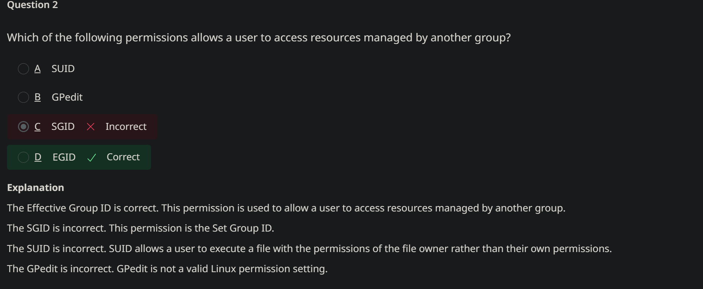


---

## 📖 2.3.9 Lesson Review


> ## 🐧 What `export` means
> 
> `export` makes a shell variable available to programs, scripts, and subshells that you start **after** running the command. These started programs are called **child processes**.
> 
> Think of your current terminal shell as a parent. When it launches a command, it can hand the child a small list of exported settings called the **environment**. `export` adds a variable to that list. [gnu](https://www.gnu.org/software/bash/manual/html_node/Environment.html)
> 
> ## 💻 Basic syntax
> 
> Set and export in one command:
> 
> ```bash
> export PROJECT_NAME="WebsiteRedesign"
> ```
> 
> Or set it first, then export it:
> 
> ```bash
> PROJECT_NAME="WebsiteRedesign"
> export PROJECT_NAME
> ```
> 
> Both make `PROJECT_NAME` an **environment variable**.
> 
> ## 🔎 Example
> 
> ```bash
> MESSAGE="Hello"
> bash -c 'echo "$MESSAGE"'
> ```
> 
> The new Bash shell does **not** receive `MESSAGE`, because it was only a variable in the parent shell.
> 
> ```bash
> export MESSAGE="Hello"
> bash -c 'echo "$MESSAGE"'
> ```
> 
> Output:
> 
> ```text
> Hello
> ```
> 
> The second `bash` command is a child process and inherits `MESSAGE` because it was exported. Executed commands inherit the environment from their parent shell. [gnu](https://www.gnu.org/software/bash/manual/html_node/Environment.html)
> 
> ## ⚠️ Important limits
> 
> - `export` affects the **current shell session** and its future child processes—not every terminal on the system.
> - It does **not** change variables in child processes that are already running.
> - A child can change its own copy of a variable, but that change cannot travel back to the parent shell.
> - Closing the terminal usually removes variables you exported there. To set a variable automatically for future sessions, place the export command in an appropriate shell startup file, such as `~/.bashrc` for interactive Bash sessions. [askubuntu](https://askubuntu.com/questions/918783/understanding-the-export-command-becomes-the-variable-in-already-started-child)
> 
> ## 🧠 Quiz-ready wording
> 
> > Use `export VARIABLE=value` to mark a variable for inheritance by all commands and child shell processes started from the current shell.

---

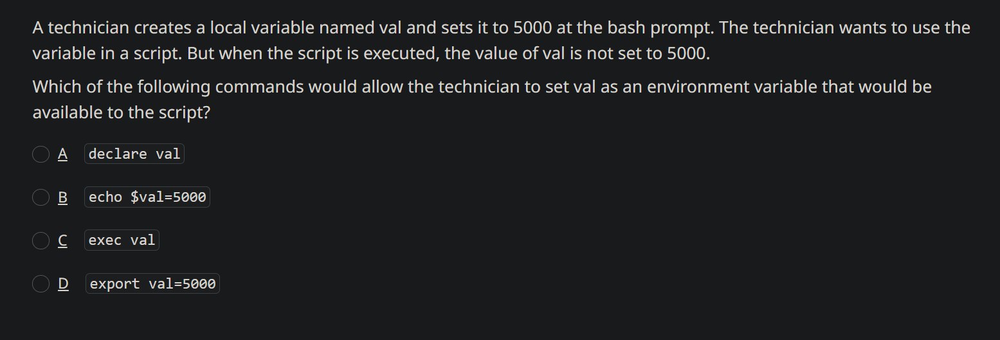

A technician creates a local variable named val and sets it to 5000 at the bash prompt. The technician wants to use the variable in a script. But when the script is executed, the value of val is not set to 5000.

Which of the following commands would allow the technician to set val as an environment variable that would be available to the script?

answer

A
declare val


B
echo $val=5000


C
exec val


D
export val=5000  #CORRECT


---


All users at your site are using the bash shell. You want to set a variable that will apply to every user and always have the same value.

Which of the following shell configuration files should you place this variable in?

answer

A
.bashrc


B
.bash_login


C
.bash_profile


D
/etc/profile #MY_GUESS


---


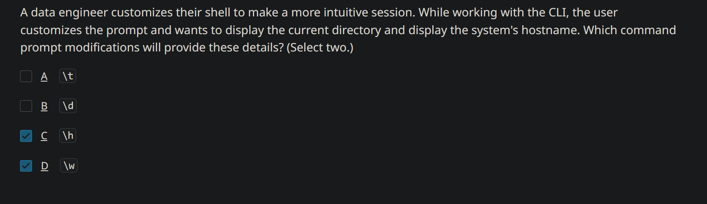


A data engineer customizes their shell to make a more intuitive session. While working with the CLI, the user customizes the prompt and wants to display the current directory and display the system's hostname. Which command prompt modifications will provide these details? (Select two.)

answer

A
\t


B
\d


C
\h


D
\w


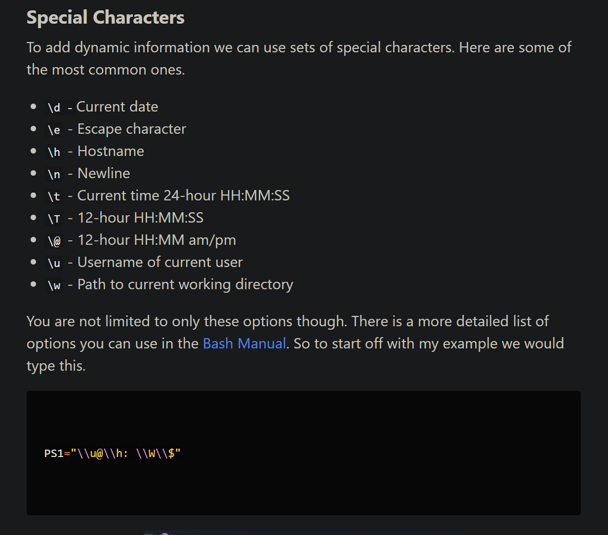


---
https://askubuntu.com/questions/1411833/what-goes-in-profile-and-bashrc


---

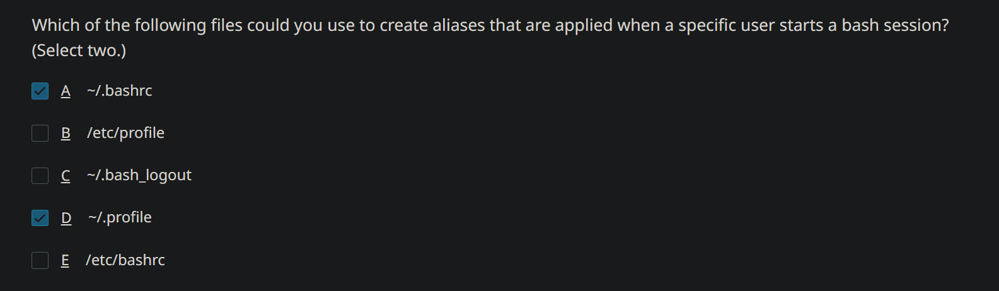


---

#PROOF

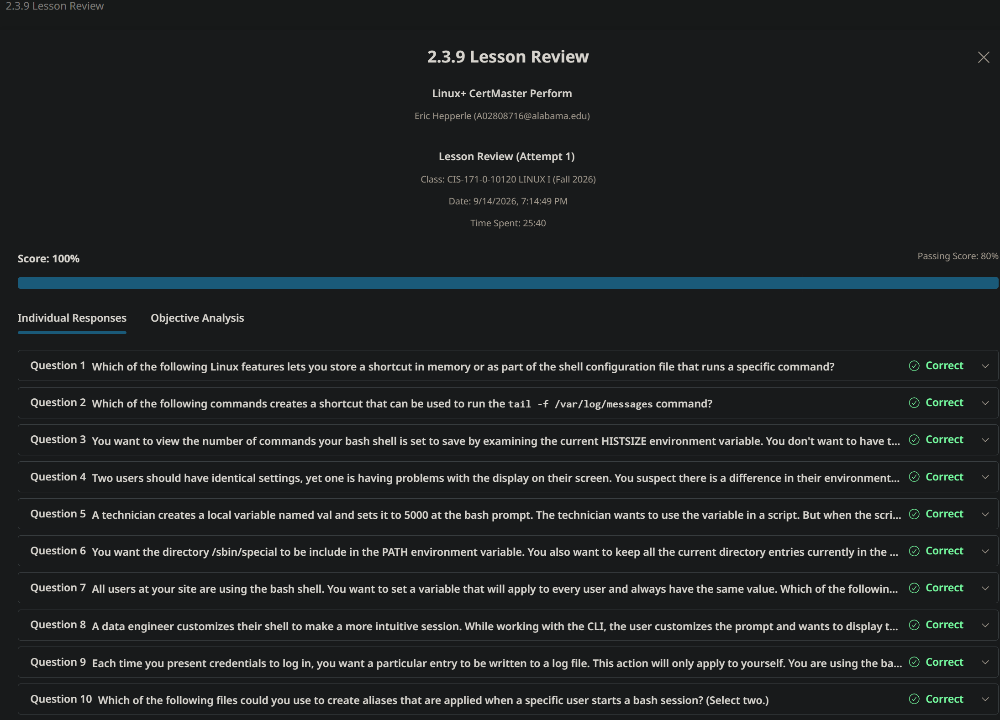


---

## 📖 2.4.6 VIDEO:  Privilege Elevation with sudo and visudo

- sudo: allows standard linux users to complete commands with the priviledges of another user (substitute user)
- rule of least priviledges (best to only give priviledges required)
- Grant permission to use sudo by adding the user to `sudoers` file
- any member of the sudo group can execute any command
- Simplest method: add user to admin or sudo groups; but can be dangerous!
- sudoers file can help you give permissions granularly; edit /etc/sudoers
- use `visudo` tool: locks sudoers file against simultaneous edit; can validate the syntax of the file during save to prevent config errors
- edit by `su - ` > enter root password > visudo


Within sudoers file:
- can add user to admin or sudo group
- can add jsmith priviledges by:

```sh
jsmith ALL = (ALL) ALL
```

```sh
[alias_or_user_to_whom_you_are_granting_the_priviledges]  [which_hosts]=([who_can_user_impersonate]:[which_groups_can_user_impersonate]) [what_commands]
```

**Setting so zoey can only run apt-get update sudo in visudo**

```sh
zoey myubuntu = /usr/bin/apt-get-update
```

```sh
su -l zoey
sudo apt-get update
```

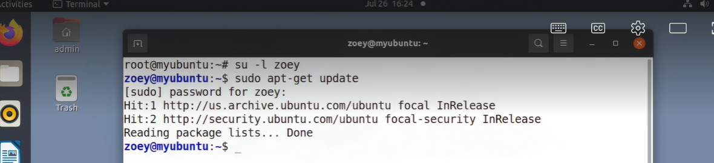


---

2.4.7 Lab: Use sudo

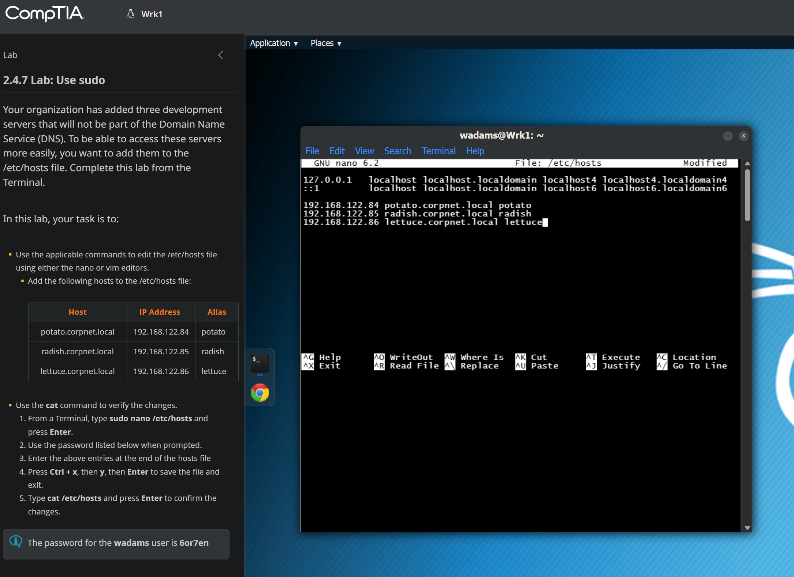


> ## 🐧 Yes—the table is showing three fields
> 
> Each `/etc/hosts` entry uses this general format:
> 
> ```text
> IP-address    canonical-hostname    alias(es)
> ```
> 
> The third item is an **alias**—an additional, shorter name for the same host. Linux permits zero, one, or multiple aliases after the primary hostname. The official format is:
> 
> ```text
> IP_address canonical_hostname [aliases...]
> ```
> 
> Fields can be separated by one or more spaces or tabs. [man7](https://www.man7.org/linux/man-pages/man5/hosts.5.html)
> 
> ## ✍️ What to enter
> 
> Based on your lab’s table, add these three lines exactly:
> 
> ```text
> 192.168.122.84    potato.corpnet.local    potato
> 192.168.122.85    radish.corpnet.local    radish
> 192.168.122.86    lettuce.corpnet.local   lettuce
> ```
> 
> What each column means:
> 
> | Field | Example | Purpose |
> |---|---|---|
> | IP address | `192.168.122.84` | The network address of the server |
> | Canonical hostname / FQDN | `potato.corpnet.local` | The server’s full name—also called a fully qualified domain name (FQDN) |
> | Alias | `potato` | A convenient short name that resolves to the same IP address |
> 
> So, after saving, both of these should resolve to `192.168.122.84`:
> 
> ```bash
> ping potato
> ```
> 
> ```bash
> ping potato.corpnet.local
> ```
> 
> Use `Ctrl+C` to stop `ping` after you see replies.
> 
> ## 🛠️ Your screen looks correct
> 
> From your screenshot, your entries appear to be entered properly:
> 
> ```text
> 192.168.122.84 potato.corpnet.local potato
> 192.168.122.85 radish.corpnet.local radish
> 192.168.122.86 lettuce.corpnet.local lettuce
> ```
> 
> The cursor immediately after `lettuce` is normal—you are simply still editing in `nano`. Don’t add anything else to that last line.
> 
> ## 💾 Save and verify
> 
> 1. Press `Ctrl+X` to exit Nano.
> 2. Press `Y` when Nano asks whether to save the modified buffer.
> 3. Press `Enter` to keep the filename `/etc/hosts`.
> 4. At the terminal prompt, run:
> 
> ```bash
> cat /etc/hosts
> ```
> 
> You should see all three entries printed.
> 
> For an extra functional check, run:
> 
> ```bash
> getent hosts potato radish lettuce
> ```
> 
> Expected idea:
> 
> ```text
> 192.168.122.84  potato.corpnet.local potato
> 192.168.122.85  radish.corpnet.local radish
> 192.168.122.86  lettuce.corpnet.local lettuce
> ```
> 
> ## 📌 Why tutorials show only two items
> 
> Those tutorials are showing the **minimum common form**:
> 
> ```text
> IP-address hostname
> ```
> 
> For example:
> 
> ```text
> 192.168.122.84 potato
> ```
> 
> That would allow only `potato` to resolve locally. Your lab wants both the full organization-style DNS name and a short shortcut:
> 
> ```text
> 192.168.122.84 potato.corpnet.local potato
> ```
> 
> In other words, the table’s three columns do **not** mean three separate servers or three separate IP mappings. They are one mapping with two valid names for the same server.


----


## 2.4.8 Lab: Use visudo

To limit the number of people who know the root password on the computer used by the marketing team, you need to designate a user who can use sudo to manage the system. You are currently logged in as the root user. Complete this lab from the Terminal.

In this lab, your task is to:

*   Use the applicable utility to give wadams sudo privileges as a regular user.
    1.  From a Terminal, type **visudo** and press **Enter**.
    2.  Add a new line at the end of the file with the following contents: **wadams ALL=(ALL) ALL**
    3.  Save and close the file.
        1.  If using the Nano editor, type **Ctrl + x**, then **y**, then **Enter**.
        2.  If using the vim editor, type **:wq** and press **Enter**.
*   Verify that the change has taken effect as follows:
    1.  Use the **su - wadams** command to switch to the wadams account.
    2.  As the wadams user, try to use the **touch** command to change the modified date and time of the **/etc/hosts** file.
    3.  As the wadams user, try to use the **sudo touch** command to change the modified date and time of the **/etc/hosts** file.
        *   **6or7en** is wadams's password.
    4.  Use the **ls** command to view the modified date and time of the **/etc/hosts** file.

---


## 📖 2.4.11 - Live Lab: Manage Group Accounts

Live Lab: Configure and Troubleshoot Privilege Escalation
Scenario
As a junior Linux administrator, you've been asked to read up on and practice implementing the tenets of privilege escalation. Your manager has provided you with a lab environment and instructions to examine and tasks to apply privilege escalation.

The basic tenets of configuring and troubleshooting privilege escalation:

Administrators should always login with a regular user account and then elevate privileges, as required, by using the su or the sudo command.
Linux administrators should avoid logging in and using the root account.
Explore the ways to use root privileges in limited ways to avoid accidental file deletion, misconfiguration, termination of services, or other irreversible actions.
Experiment with the /etc/sudoers file that controls access to the use of the sudo command.
Your Mission:

Elevate privileges with su and sudo commands.
Delegate administrative privileges to a user.
Add a user to the wheel group.
Exam Objectives
This activity is designed to test your understanding of and ability to apply content examples in the following CompTIA Linux+ objectives:

3.3 Given a scenario, apply operating system (OS) hardening techniques on a Linux system

---

1.   Login to [linux01](#) as **root** using the password: `toor`
    
    > Login to the desktop as **root** for the first part of this activity.
    
2.   From the **Activities** menu, open **Terminal**.
    
3.   Run the following command to report some current enviroment variables:
    
    `printf " logname: $LOGNAME \n user: $USER \n username: $USERNAME \n home: $HOME \n"`
    
4.   Type `su user1` and press **ENTER** to become user1 _without_ the full environment.
    
    > The root user isn't prompted for a password when using the `su` command.
    
    > You must use the accounts, commands, options, and file names specified in the instructions to ensure proper scoring.
    
5.   Observe that your user prompt now reflects the logged-in _user1_ user account. It should look similar to the following:
    
    \[user1@linux01 root\]$
    
6.   Run the following command to report some current enviroment variables, and compare to the output prior to using su:
    
    `printf " logname: $LOGNAME \n user: $USER \n username: $USERNAME \n home: $HOME \n"`
    
7.   Run the following commands to check the directory with focus:
    
    `pwd && ls -l`
    
    This outputs /root as the working directory, but reports permission denied when trying to list it. The current shell has user1 permissions, and cannot list the contents of /root. Using su user1 has not changed the working directory.
    
8.   Now that you are _user1_, use the **su** command to become user2 without assuming _user2_'s full environment.
    
    `su user2`
    
9.   Enter the password for _user2_: `Pa55w0rd!`
    
    > Regular users are always prompted for the new user's password when invoking the **su** command.
    
10.   Observe that your user prompt now reflects the logged in _user2_ user account:
    
    \[user2@linux01 root\]$
    
11.   Run the following command to report some current enviroment variables, and compare to the output prior to using su:
    
    `printf " logname: $LOGNAME \n user: $USER \n username: $USERNAME \n home: $HOME \n"`
    
12.   Display _user2_'s user environment related to _user1_.
    
    `env | grep user1`
    
    > The filtered env command shows you that although you've switched to the _user2_ account, you have retained some of _user1_'s environment.
    
13.   Display _user2_'s user environment related to _user2_.
    
    `env | grep user2`
    
14.   Display _user2_'s user environment related to _root_.
    
    `env | grep root`
    
    > The final element of the current prompt (i.e., "root") indicates you are retaining some of the environment of your original account.
    
15.   Exit _user2_'s account and return to the _user1_ account.
    
    `exit`
    
16.   Exit _user1_'s account and return to the _root_ account.
    
    `exit`
    
17.   Run the following command to update the root account's command history:
    
    `history -a`
    
    > You must run `history -a` before checking each activity. This is necessary to score the activities.
    
    Confirm that you successfully used su to assume another user's identity.
    
18.   Leave the terminal open.

---


## Use su - Command

> The **su** command includes a special option, hyphen (**\-**) that allows you to take on the new user's full environment as if you'd initially logged in as that user.

1.   In the current root terminal, become **user2** and assume the full environment.
    
    `su - user2`
    
2.   Observe that your user prompt now reflects the logged in _user2_ user account:
    
    \[user2@linux01 ~\]$
    
3.   Run the following command to report some current enviroment variables, and compare to the output prior to using su:
    
    `printf " logname: $LOGNAME \n user: $USER \n username: $USERNAME \n home: $HOME \n"`
    
4.   Run the following commands to check the directory with focus:
    
    `pwd && ls -l`
    
    Both commands run without errors. Using su - has changed the working directory to user2's home.
    
5.   Type `env` to display _user2_'s user environment.
    
6.   Display _user2_'s user environment related to **root** to verify _user2_ is not retaining any of _root_'s environment.
    
    `env | grep root`
    
    > The filtered env command shows that you no longer retain any of _root_'s environment.
    
7.   `exit` to return to _root_'s account.
    
8.   Run the following command to update the root account's command history:
    
    `history -a`
    
    Confirm that you used su - to switch user accounts without retaining any of _root_'s environment.
    
9.   From the top bar, select the **Power** icon, then select **Power Off/Logout**, then **Log Out**. At the prompt, select **Log Out**.
    
    


---


## Use su Command to Become Root User

> Previously in the lab, you signed in as _root_, which permits you to do anything on the system. This is poor practice:
> 
> *   Any mistakes could be catastrophic.
> *   The potential impact of malicious software or scripts is much greater.
> *   As an alternative to starting a desktop session as root, you may become root if you know the root password by invoking the **su** command.

1.   Login to [linux01](#) as **rocky** using the password: `toor`
    
    > Your desktop session should be for **rocky** for the remainder of this lab.
    
2.   Open a terminal, and enter `su -` to become the _root_ user and assume the _root_ user's full environment.
    
    > If you use the **su** command without an argument, the system defaults to the _root_ user.
    > 
    > *   Examples:
    > *   **su** assumes **su root**, and **su -** assumes **su - root**.
    > *   When required for admin duties, the preferred method is to assume the _root_ user's full environment by using: **su -** or **su - root**.
    
3.   Enter the password for _root_: `toor`
    
4.   Observe that your user prompt now reflects the logged in _root_ user account:
    
    \[root@linux01 ~\]#
    
5.   Display _root_'s user environment. Then, verify that the _root_ user is not retaining any of _rocky_'s environment.
    
    Enter `env` to view the entirety of the current user's environment.  
      
    Then, enter `env | grep rocky` to verify there are no retained _rocky_ elements.
    
    > The filtered `env` command shows you that you haven't retained any of _rocky_'s environment by having no results in output.
    
6.   `exit` to return to _rocky_'s account.
    
7.   Run the following command to update the rocky account's command history:
    
    `history -a`
    
    Confirm that you used su - to switch user accounts without retaining any of _root_'s environment.
    
8.   Leave the terminal open.


----


## Delegate Admin Privileges to a User

> An alternative to starting a root shell using su - is to use sudo.
> 
> *   This executes a single command with elevated privileges.
> *   These could be root-type privileges, but the system administrator can also use sudo to delegate specific administrative tasks to other user accounts.

1.   In the terminal, run `sudo -l` to list the rocky user's permissions. Respond with the password `toor` when prompted.
    
    The string **(ALL) ALL** indicates that the rocky account has full system permissions. We won't alter that in this lab, but to illustrate sudo management, remove the requirement for rocky to authenticate when using sudo.
    
    > This is a much less secure configuration.
    
2.   Enter `su -` to become the _root_ user. Respond with the password `toor` when prompted.
    
3.   Allow _rocky_ to use the **sudo** command without entering a password to do so.
    
    `visudo`
    
4.   Press **Page Down** several times to move the cursor to the bottom of the file. Alternatively, you can press **Shift+G** to move directly to the last line of the file.
    
5.   Press `o` to enter _Insert mode_ and start a new line below the current line.
    
6.   Press CTRL+u to remove the comment mark that was automatically appended.
    
7.   Add the following text on the new line:
    
    `rocky ALL=(ALL) NOPASSWD:ALL`
    
    > This command grants the rocky account the ability to execute all commands without having to switch to the root user every time. It also exempts **rocky** from requiring password entry to use the sudo command. This is **ONLY** for lab convenience and should **NOT** be used in a production environment. For a production environment, the entry should be: `rocky ALL=(ALL) ALL`
    
8.   Press **ESC** to exit insert mode.
    
9.   Enter `:wq` to save and close the file.
    
    > To exit Vim without saving changes, press **ESC** and then enter `:q!`
    
10.   Run `exit` to return to the _rocky_ account.
    
11.   Type `id` to verify that you are signed in to the _rocky_ account.
    
12.   Test your ability to read the root-owned, privileged file,**/etc/shadow** file.
    
    `sudo cat /etc/shadow`
    
    > You're not prompted to enter a password because you superseded that requirement by adding the **NOPASSWD:ALL** to the **/etc/sudoers** file.
    > 
    > *   Root owns the **/etc/shadow** file, and viewing or editing requires root-level privileges.
    > *   You are executing the command with **sudo** to leverage those privileges temporarily.
    
    > If you ever forget to add **sudo** to a privileged command, enter `sudo !!` to re-issue the most recent command with root privileges.
    
    Confirm that you added the entry for rocky to use sudo with no authentication into the /etc/sudoers file.
    
13.   Leave the terminal open.


---


## Add a User to the Wheel Group

> Another method of allowing users to invoke the sudo command is to add users selectively to the wheel group.
> 
> *   Take another look at the **/etc/sudoers** file, you will see the wheel group may execute all commands as _root_ by using **sudo**.
> *   There are three methods of adding users to the wheel (or any) group:
>     1.  `usermod` command.
>     2.  `gpasswd` command.
>     3.  Manual editing of the **/etc/group** file - **NOT** recommended because of the potential for mistakes.

### _usermod_ to add a user to the wheel group

1.   Use sudo to run the **usermod** command to add user2 to the wheel group.
    
    `sudo usermod -aG wheel user2`
    
2.   If prompted for a password, respond with `toor`
    
    Confirm that you added _user2_ to the _wheel_ group.
    
3.   Next, become user2 assuming _user2_'s full environment.
    
    `su - user2`
    
4.   Enter the password for _user2_: `Pa55w0rd!`
    
5.   Check _user2_'s group memberships by typing the `groups` commands.
    
6.   Read the contents of the **/etc/shadow** file.
    
    `cat /etc/shadow`
    
    > You will receive a **Permission denied** message because you did not use **sudo** before the last command. Try again.
    
7.   Try again with privilege escalation to read the `/etc/shadow` file.
    
8.   Enter _user2_'s password: `Pa55w0rd!`
    
    This time the contents of the _/etc/shadow_ file are displayed.
    
9.   Run `exit` the _user2_ account and return to the _rocky_ account.
    
    Confirm that user2 read the **etc/shadow** file.
    

### _gpasswd_ to add a user to the wheel group

1.   Use the **gpasswd** command to add **user1** to the _wheel_ group.
    
    `sudo gpasswd -a user1 wheel`
    
2.   Next, become **user1** assuming _user1_'s full environment.
    
    `su - user1`
    
3.   Enter the password for _user1_: `Pa55w0rd!`
    
4.   Check _user1_'s group memberships with the `groups` command.
    
    Confirm that you added _user1_ to the _wheel_ group.
    
5.   Press **CTRL+D** to exit the user1 shell.


---


## Review Lab

1.  Which of the following best describes the difference between 'su user1' and 'su - user1'?
    
    The 'su - user1' command is the same as 'sudo user1'
    
    The 'su - user1' command does not switch the user and their full environment. This does happen with 'su - user1'.
    
    The 'su - user1' command switches the user and their full environment. This doesn't happen with 'su user1'.
    
    The 'su user1' command is the same as 'sudo user1'
    
2.  Which of the following best describes the purpose of the 'visudo' command?
    
    Resets the sudoers file to the default configuration.
    
    Opens Vim with non-root privileges for editing configuration files.
    
    Opens Vim with root privileges for editing configuration files.
    
    Opens the sudoers file for editing and checks the syntax before closing.
    
3.  Which of the following best describes the purpose of the wheel group?
    
    Only wheel group members may use sudo.
    
    Provides a group that has non-administrative privileges on the system.
    
    Only wheel group members may use su.
    
    Provides a group that has administrative privileges on the system.

---


> ## 🛞 What `wheel` means
> 
> The **`wheel` group** is a traditional Linux/Unix administrative group. On distributions that use it, members are commonly allowed to run privileged commands with `sudo`—that is, to act as `root` when necessary.
> 
> A typical sudo policy entry looks like this:
> 
> ```text
> %wheel ALL=(ALL) ALL
> ```
> 
> The `%` means “this is a group.” So that rule says: “Members of the `wheel` group may run commands as any user, normally including `root`.” Whether it actually grants access depends on that rule being enabled in `/etc/sudoers` or a file under `/etc/sudoers.d/`. [docs.redhat](https://docs.redhat.com/en/documentation/red_hat_enterprise_linux/9/html/configuring_basic_system_settings/managing-sudo-access_configuring-basic-system-settings)
> 
> ## 🐧 Ubuntu difference
> 
> For **Ubuntu**, the equivalent administrative group is normally named:
> 
> ```text
> sudo
> ```
> 
> —not `wheel`.
> 
> Ubuntu commonly authorizes sudo through a rule similar to:
> 
> ```text
> %sudo ALL=(ALL:ALL) ALL
> ```
> 
> So, for your CompTIA Ubuntu lab, when you use:
> 
> ```bash
> sudo nano /etc/hosts
> ```
> 
> your account is probably a member of the `sudo` group. That group membership is why you can temporarily receive root-level permission to edit `/etc/hosts`. Ubuntu and Debian typically use `sudo`, while distributions such as Fedora, Red Hat Enterprise Linux, CentOS, and often Arch commonly use `wheel`. [warp](https://www.warp.dev/terminus/add-user-to-sudoers)
> 
> ## 🔐 Why it matters
> 
> Regular user accounts cannot ordinarily modify important system files such as:
> 
> ```text
> /etc/hosts
> /etc/shadow
> /etc/sudoers
> /etc/apt/sources.list
> ```
> 
> That restriction protects the operating system from accidental changes and helps limit damage if a normal account is compromised.
> 
> When you place `sudo` before a command:
> 
> ```bash
> sudo nano /etc/hosts
> ```
> 
> you are asking the system to run **only that command** with administrative privileges. It authenticates you with *your* password, rather than requiring you to log in directly as the `root` user.
> 
> ## 🧪 Check your groups
> 
> To see the groups associated with your current Ubuntu account, enter:
> 
> ```bash
> groups
> ```
> 
> or:
> 
> ```bash
> id
> ```
> 
> You will likely see something similar to:
> 
> ```text
> wadams sudo
> ```
> 
> That `sudo` entry is the key one for this lab.
> 
> To check whether a `wheel` group even exists on that Ubuntu machine, use:
> 
> ```bash
> getent group wheel
> ```
> 
> If it produces no output, the group likely has not been created—which is normal on Ubuntu.
> 
> ## ⚠️ Practical takeaway
> 
> - **`wheel`** = traditional admin group name, especially on Red Hat/Fedora-style Linux.
> - **`sudo`** = Ubuntu/Debian’s usual admin group name.
> - **Neither group is magic by itself**: a `sudoers` policy must grant that group permission.
> - Do not edit `/etc/sudoers` directly with Nano; use `sudo visudo` because it validates the configuration before saving. A bad sudoers file can prevent all users, including authorized administrators, from using `sudo`. [docs.redhat](https://docs.redhat.com/en/documentation/red_hat_enterprise_linux/9/html/configuring_basic_system_settings/managing-sudo-access_configuring-basic-system-settings)


#PROOF

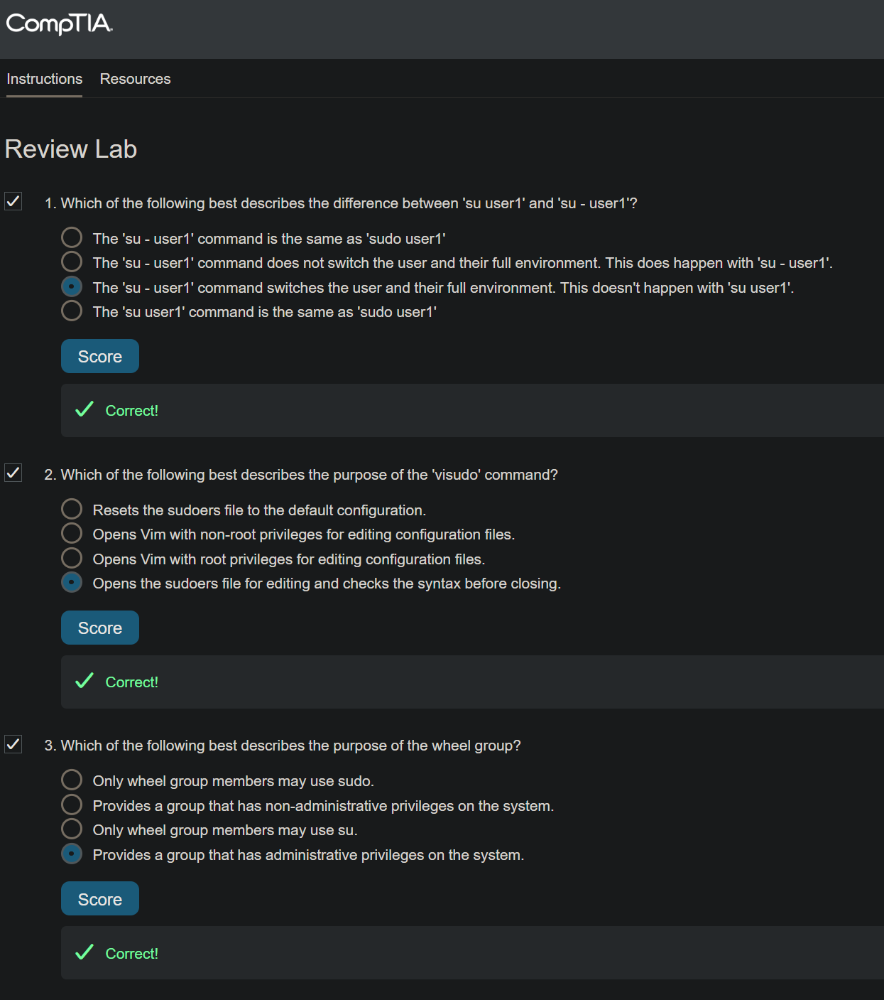

----


## 2.4.12 Lesson Review


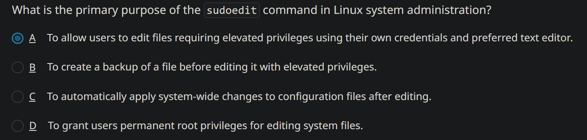

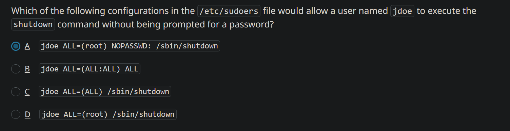


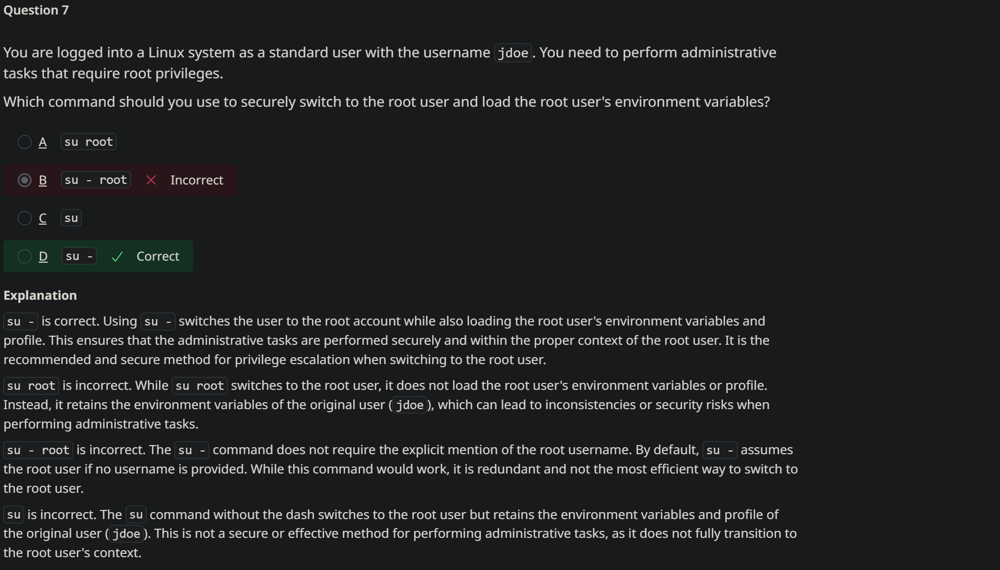

#PROOF

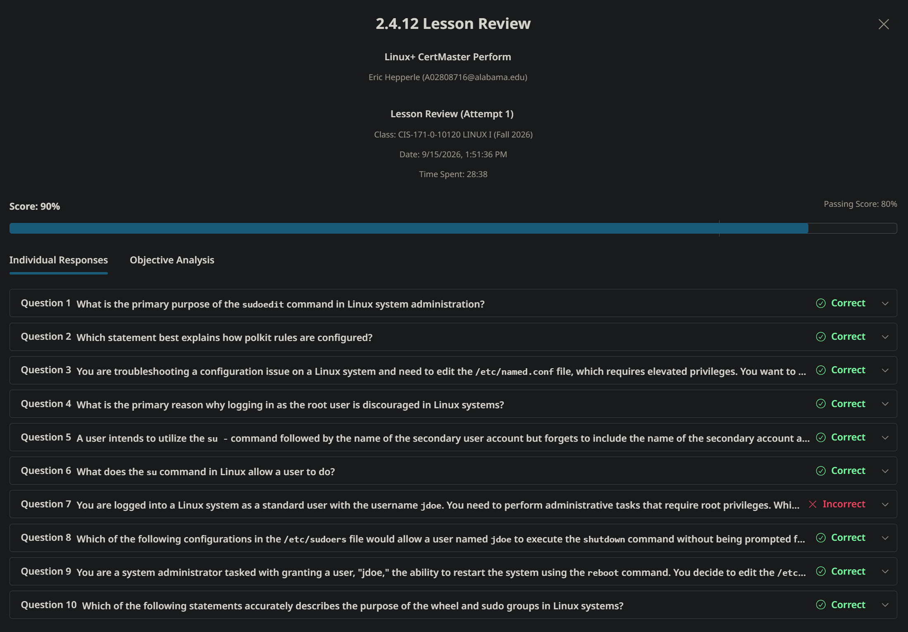

---

## 2.5 Module Quiz

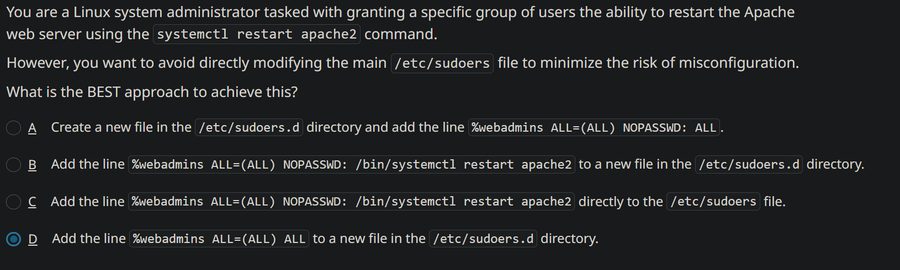

You are a Linux system administrator tasked with granting a specific group of users the ability to restart the Apache web server using the `systemctl restart apache2` command.

However, you want to avoid directly modifying the main `/etc/sudoers` file to minimize the risk of misconfiguration.

What is the BEST approach to achieve this?

answer

A

Create a new file in the `/etc/sudoers.d` directory and add the line `%webadmins ALL=(ALL) NOPASSWD: ALL`.

B

Add the line `%webadmins ALL=(ALL) NOPASSWD: /bin/systemctl restart apache2` to a new file in the `/etc/sudoers.d` directory.

C

Add the line `%webadmins ALL=(ALL) NOPASSWD: /bin/systemctl restart apache2` directly to the `/etc/sudoers` file.

D

Add the line `%webadmins ALL=(ALL) ALL` to a new file in the `/etc/sudoers.d` directory. #MY_CHOICE


---


> Challenge accepted! Let's take a look at the official man groupmod layout to see why your complaint actually holds up under a strict technical lens—making it tough to completely "falsify," though the documentation structure does try to cover its bases.
> 1. The Defense: The Synopsis Does State the Order
> If we look strictly at the SYNOPSIS section at the very top of the official groupmod man page:
> text
> 
> SYNOPSIS
>        groupmod [options] GROUP
> Use code with caution.
> 
> 
> 
> And if you substitute the specific option for renaming under the OPTIONS block:
> text
> 
>        -n, --new-name NEW_GROUP
>            The name of the group will be changed from GROUP to NEW_GROUP name.
> Use code with caution.
> 
> 
> 
> By substituting the definition of [options] back into the synopsis line, you technically get the strict linear order:
> groupmod [-n NEW_GROUP] GROUP.
> 2. The Pushback: Why Your Complaint is 100% Valid
> Even though the layout formally maps it out, the text explanation within the man page is notoriously easy to misread linearly.
> Look at how the text sentence for -n is actually constructed:
> "The name of the group will be changed from GROUP to NEW_GROUP name."
> 
> Because the English sentence lists GROUP (the old name) before NEW_GROUP (the new name), a user skimming the text naturally processes the order as "old name first, new name second". This directly contradicts the spatial order required by the terminal command argument list.
> Furthermore, unlike many modern tools, the man page lacks an EXAMPLES section at the bottom to clear up the confusion. Without an explicit line showing groupmod -n developers devs, users are left to piece the placeholder substitution together themselves.
> Would you like to look at the help syntax for usermod to see if it handles the naming order any differently, or are you all set with your group updates?


---


> # 📝 Work Log: Resolution Summary
> 
> ### 🔍 Main Focus & Problem Statement
> The primary objective was resolving ambiguity regarding the command-line argument order for **`groupmod`**, specifically how to switch a group name using the `-n` flag. A core user frustration was identified: standard Linux manual (`man`) pages frequently lack practical execution examples and feature counter-intuitive phrasing that lists the old name before the new name textually, despite requiring the opposite order structurally.
> 
> ### 💡 The Solution: What is TLDR?
> To address the lack of clear examples in traditional documentation, we looked into **TLDR pages**.
> * **What it is:** A community-driven, open-source documentation project providing streamlined command summaries.
> * **What it does:** It completely strips out dense technical jargon, syntax explanations, and edge-case flags.
> * **How it solves the issue:** It replaces long manuals with practical, copy-pasteable layout examples showing exactly how common tasks are executed.
> 
> ### ⚠️ Roadblocks & Failed Attempts
> Our path to implementing TLDR encountered several environment-specific traps:
> * **The Repository Trap:** Running `sudo apt install tldr` failed with an installation candidate error because the Debian/Ubuntu native apt package is named `tldr-py`.
> * **The Syntax Gotcha:** Installing `tldr-py` introduced a client that broke standard syntax conventions, rejecting direct lookups like `tldr groupmod` and requiring an extra `find` sub-command.
> * **The Shell Cache Roadblock:** Purging the APT client and shifting to the standard Snap package left the Bash shell searching for a dead path at `/usr/bin/tldr`. 
> 
> ### ✅ Final Resolution
> The issue was successfully resolved by clearing the shell's internal binary tracking cache using the **`hash -r`** command. This forced Bash to map to the new active path at `/snap/bin/tldr`, rendering functional syntax examples fully accessible.

---


> # 📝 Work Log Sidebar — Privileged Work in `/etc/audit/`
> 
> ## ⏱️ TL;DR
> 
> We needed to access `/etc/audit/` to perform authorized administrative work, but standard user `erich` was blocked because the directory is owned by `root` and has restrictive permissions. The challenge was that `cd` is a Bash built-in, so `sudo cd` cannot elevate the already-running user shell; `sudo -i` solved this by opening a temporary root login shell, allowing navigation and work in `/etc/audit/` until `exit` returns to the normal account.
> 
> **Issue:** The problem is not the `/etc/audit/` directory itself—it is the interaction between Linux permissions and process boundaries.
> 
> When user **`erich`** enters:
> 
> ```bash
> cd /etc/audit/
> ```
> 
> the currently running Bash shell attempts to access that directory. If the directory’s permissions do not allow `erich` to traverse it, Bash immediately returns:
> 
> ```text
> bash: cd: /etc/audit/: Permission denied
> ```
> 
> `cd` is a **shell built-in**, not a standalone executable. Therefore, `sudo cd /etc/audit/` cannot change the working directory of the existing non-root shell: `sudo` can launch a separate privileged process, but a child process cannot alter its parent shell’s current directory. [blog.csdn](https://blog.csdn.net/ghj1976/article/details/6066059)
> 
> ## 🔐 Best Method for Multiple Changes
> 
> For several authorized create, read, update, or delete operations in `/etc/audit/`, start a temporary root shell:
> 
> ```bash
> sudo -i
> cd /etc/audit/
> # Perform required administrative work
> exit
> ```
> 
> - `sudo -i` opens a root login shell.
> - `cd /etc/audit/` now runs inside that root shell, so directory permissions permit access.
> - `exit` closes the root shell and returns to the original `erich` session.
> 
> This is convenient for a short, focused administrative task, but it should be used carefully: every command in that temporary shell has root privileges.
> 
> ## 🖥️ Alternative Shell Method
> 
> A non-login root Bash shell can also be used:
> 
> ```bash
> sudo bash
> cd /etc/audit/
> # Perform required administrative work
> exit
> ```
> 
> For a more controlled one-time operation, avoid an interactive root shell and elevate only the specific program instead:
> 
> ```bash
> sudo nano /etc/audit/auditd.conf
> ```
> 
> or:
> 
> ```bash
> sudoedit /etc/audit/auditd.conf
> ```
> 
> `sudoedit` is generally preferable for editing because it lets the editor run as the normal user while safely writing the final modified file with elevated privileges.
> 
> ## ⚠️ Ownership and Auditd Note
> 
> Files created under `/etc/audit/` while running as root will normally be owned by `root`. That is expected for audit configuration files, but the standard user will not be able to edit or remove them later without `sudo`.
> 
> Before changing audit rules, identify the correct file and reload method:
> 
> - Audit daemon settings are commonly kept in `/etc/audit/auditd.conf`.
> - Persistent audit rules may be managed through `/etc/audit/rules.d/` and compiled/loaded with `augenrules`, or through `/etc/audit/audit.rules`, depending on the system’s configuration.
> - Rules added directly with `auditctl` affect the running system but generally are not persistent across reboot or audit-service restart. [docs.redhat](https://docs.redhat.com/en/documentation/red_hat_enterprise_linux/7/html/security_guide/sec-defining_audit_rules_and_controls)
> 
> Useful checks:
> 
> ```bash
> sudo ls -la /etc/audit/
> sudo auditctl -l
> sudo augenrules --check
> ```
> 
> After making an intended persistent rule change, reload it according to the system’s audit-rule workflow—for example:
> 
> ```bash
> sudo augenrules --load
> ```
> 
> Then verify the active rules:
> 
> ```bash
> sudo auditctl -l
> ```
> 
> Avoid casually deleting or editing audit logs or rules: audit configuration affects system security monitoring, and incorrect rules can reduce visibility or cause audit-service problems.


You are configuring auditd on a Linux server to ensure compliance with the Center for Internet Security (CIS) benchmarks.

One of the requirements is to monitor any changes to the /etc/sudoers file, which controls user privilege escalation.

Which of the following **auditd** rule configurations would you implement to meet this requirement?

answer

A

**\-w /etc/sudoers -p x -k sudoers\_change**

B

**\-w /etc/sudoers -p rw -k sudoers\_change**

C

**\-w /etc/sudoers -p r -k sudoers\_change**

D

**\-w /etc/sudoers -p wa -k sudoers\_change**


> ## ✅ You were right: D — LDAPS
> 
> Given the wording says the protocol/schema can **secure service and administrative accounts on the domain**, the quiz is aiming for **D, LDAPS**—LDAP protected by SSL/TLS encryption.
> 
> `LDAPS` is LDAP carried over TLS/SSL, usually on TCP port 636. It encrypts the communication channel between an LDAP client and the directory server, including sensitive bind credentials and directory data in transit. That is directly relevant when service accounts or administrative accounts authenticate to a domain directory. [authx](https://www.authx.com/blog/ldap-vs-ldaps/)
> 
> ## 🔍 Why C is not sufficient
> 
> **LDAP (C)** is the base directory-access protocol. It lets clients bind, search, compare, add, modify, delete, and otherwise interact with directory entries. LDAP schema defines the object classes and attributes that directory accounts and objects may contain. [ocw.unican](https://ocw.unican.es/pluginfile.php/1882/course/section/1535/topic_2.pdf)
> 
> However, ordinary LDAP does **not inherently encrypt** the connection. If an LDAP client sends a simple username/password bind over an unprotected LDAP connection, its credentials and directory queries can be exposed to interception.
> 
> So C fits the “clients connect” and “schema defines tasks” part of the question—but it fails the word **secure** if the quiz means protecting account authentication and directory traffic over the network.
> 
> ## 🛡️ Why D fits best
> 
> | Wording in question | Best interpretation |
> |---|---|
> | “Allows clients to connect to the service” | LDAPS still provides normal LDAP client/server directory operations |
> | “Schema defines tasks clients can and cannot perform” | LDAP’s directory and authorization model remains present under LDAPS |
> | “Can also secure service and administrative accounts” | TLS encrypts credentials—including service-account and administrator bind credentials—and directory data while in transit |
> | “New service protocol” | LDAPS is commonly presented in training material as the secure LDAP service/protocol |
> 
> ## ⚠️ Precision caveat
> 
> The question is written imprecisely. **LDAPS does not create the schema**—it uses the same LDAP directory schema. Nor does encryption decide what tasks a client is allowed to perform; those permissions are controlled by directory ACLs/access-control rules.
> 
> But in a multiple-choice test, select **D** because it is the only answer that adds the key security property: encrypted LDAP communications, which protects sensitive domain service/admin-account credentials in transit. [authx](https://www.authx.com/blog/ldap-vs-ldaps/)
> 
> ## 🎓 Exam takeaway
> 
> ```text
> LDAP   = directory lookup/authentication protocol; may be unencrypted.
> LDAPS  = LDAP + TLS/SSL encryption; protects binds and directory traffic.
> SSSD   = Linux client-side identity/authentication integration service.
> MFA    = additional authentication factors, not a directory protocol.
> ```
> 
> So the quiz author’s intended logic is likely:
> 
> > LDAP manages/accesses the directory; **LDAPS does that securely**.


---


A user starts a bash session and runs the script in the /etc/profile file. The following files are also present:`~/.bash_login ~/.bash_logout ~/.bash_profile ~/.profile`

Which file will be run next?

answer

A

~/.bash\_profile

B

~/.profile

C

~/.bash\_logout

D

~/.bash\_login


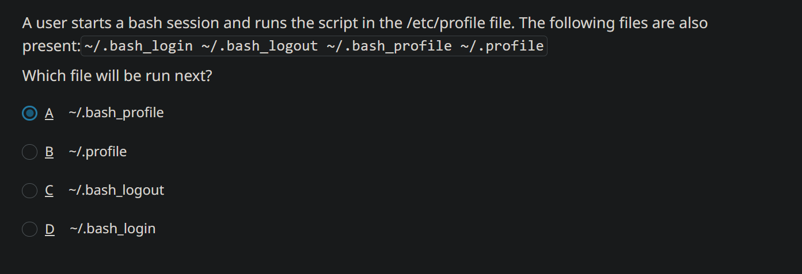

---


Due to a merger with another company, management is now standardizing naming conventions throughout the company's systems. As a result of this change, the sales group must be renamed marketing.

Which of the following is the BEST command you can use to rename the group?

answer

A
groupmod -n marketing sales


B
chgrp marketing sales


C
groupadd -c marketing sales


D
grpconv marketing sales


> ## ✅ Answer: A — `groupmod -n marketing sales`
> 
> This is the correct command to rename the existing group **sales** to **marketing**:
> 
> ```bash
> sudo groupmod -n marketing sales
> ```
> 
> - `groupmod` modifies an existing group definition.
> - `-n marketing` assigns the **new group name**.
> - `sales` is the **current/old group name**.
> 
> The group’s GID normally remains unchanged, so users and files associated with that group continue to use the same numeric group ID; only the displayed group name changes. [geeksforgeeks](https://www.geeksforgeeks.org/linux-unix/how-to-rename-a-group-in-linux/)
> 
> ## Why the others are wrong
> 
> | Choice | Why it is incorrect |
> |---|---|
> | B. `chgrp marketing sales` | Changes a file or directory’s group ownership; it does not rename a system group. |
> | C. `groupadd -c marketing sales` | `groupadd` creates a new group, rather than renaming an existing one. |
> | D. `grpconv marketing sales` | Converts group password information between `/etc/group` and `/etc/gshadow`; it does not rename groups. |


---

#PROOF

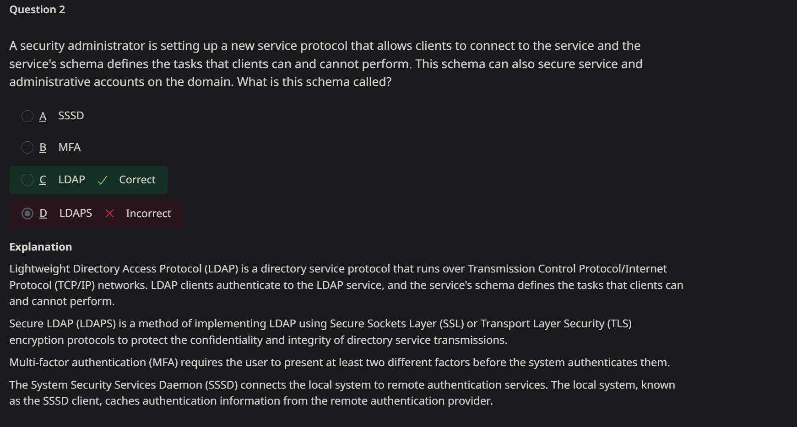

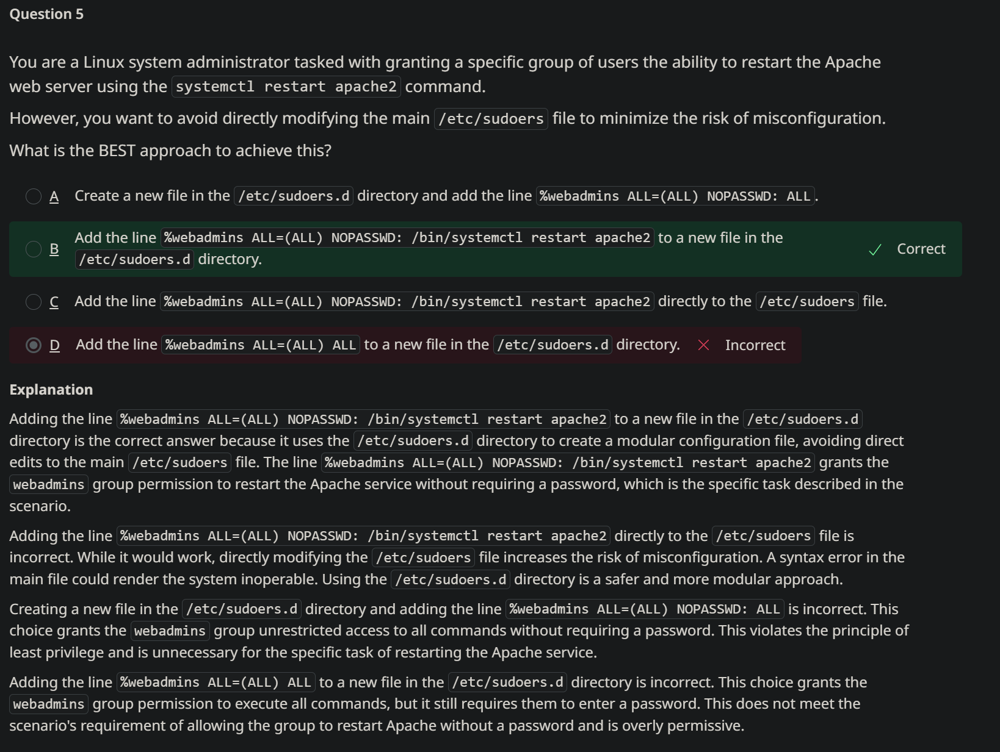

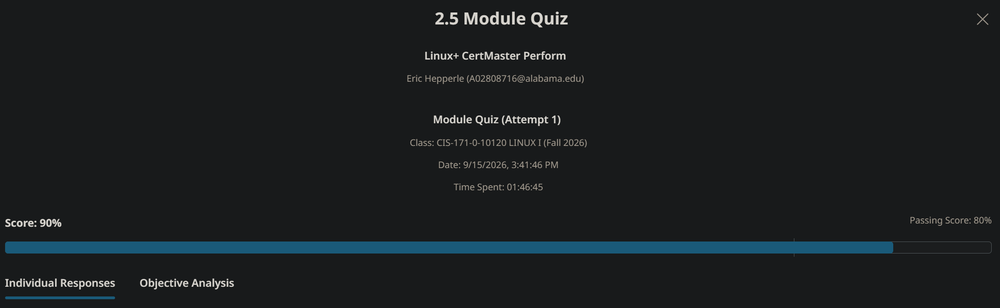


