<!-- Custom stylesheet -->
<link rel="stylesheet" href="../../_css/main.css">

<!-- Site logo -->


> [🏚️ README](../../../README.md) | [📁 Courses](../../index.md) | [📚 Vocabulary](../../Vocabulary.md) | [🗓️ Assignments Schedule](../Assignments_Schedule.md) | [🔖 Bookmark](#bookmark)


# CIS 171 - Linux I:  <br> NOTES: 

> The following are my notes on the **CompTIA: Linux+ CertMaster Perform** V8 learning platform course
> The represent sparse notes thrown together, not perfectly organizized while cramming to complete assignments
> It seems it will be better to complete the assignments and then go take notes later based on the format the labs are given in (it gives you the instructions and)

# 📖 ??? - Live Lab: Manage Group Accounts


## Scenario

You are a junior Linux systems administrator at a mid-sized software development company. The company recently reorganized its departments, and your manager has tasked you with updating the group accounts and user memberships on the Linux server to reflect the new structure.

This task is critical to ensure that team members have the correct access permissions and that the server remains organized and secure.

Your Mission is to:

Create, rename, and delete Linux group accounts.
Add and remove users from groups.
Display and verify group memberships.
Automate group management tasks using a basic shell script.
Exam Objectives
This activity is designed to test your understanding of and ability to apply content examples in the following CompTIA Linux+ objectives:

2.2: Given a scenario, perform local account management in a Linux environment.
4.2: Given a scenario, perform automated tasks using shell scripting.

---

## Implementing Access Control

As a Linux administrator, it is your job to implement a role-based access control (RBAC) system that is organized and auditable.

Administrators use RBAC because it assigns permissions to groups instead of individual users, which makes managing access easier. This process keeps things organized, secure, and easier to track and update as needed.
The /etc directory is an important directory that contains nearly all of the system configuration files in Linux.
Because the company reorganized, you need to maintain security by making sure only those who need access have the appropriate permissions.

## Using the /etc Directory

In this section, you will be configuring account membership in the `/etc/group` file.

REMEMBER: This lab is designed for you to learn syntax and spacing by typing in the commands. Ensure you double-check the command before entering.

This lab is hosted in a Linux container that automatically logs you in as the root user.

Important Security Note: It is critical to understand that you should not use the root account in a production environment; instead login with a user account and elevate permissions as needed.

Display the contents of the /etc/group file with the command cat /etc/group.

Observe the structure of the file. Each line represents a group and follows this format:

`group_name:x:group_id:group_members`

- **group_name**: The name of the group.
- **x**: Placeholder for the group password (usually not used).
- **group_id**: The unique numeric ID assigned to the group.
- **group_members**: A comma-separated list of users in the group.

Answer the following question to check your understanding:

> What is the GID of the root group?

---

## Create and Rename Group Accounts

You will create group accounts for the engineering and operations teams. By creating groups such as "engineering" and "operations," you can assign permissions and access rights to specific roles rather than individual users. This simplifies the management of permissions and ensures that users in the same role have consistent access to resources.

Create the engineering group with a numeric group ID of 8000 by using the groupadd command: `groupadd -g 8000 engineering`.

The -g option in the `groupadd` command is used to specify the numeric Group ID (GID) for the group being created. This allows you to assign a specific GID to the group instead of letting the system automatically generate one.

Now, create an operations group with a numeric group ID of 8001: `groupadd -g 8001 operations`.

Verify both groups were created by using the tail command again to display the last few lines of the /etc/group file: `tail /etc/group`.

The tail command is used to display the last few lines of the /etc/group file. This is helpful for quickly verifying recent changes, such as renaming a group, without having to scroll through the entire file.

Next, with the `groupmod` command, rename the operations group to devops: `groupmod -n devops operations`

The -n option in the groupmod command is used to rename an existing group. This allows you to change the group's name while keeping its Group ID (GID) and other settings intact.

Now, verify the group name change with the tail command again to display the last few lines of the /etc/group file: tail /etc/group.

Confirm that you created the engineering group and renamed the devops group

---

## Add Users to Groups

You will create user accounts and add them to the groups you created.

Create two user accounts with the useradd command: useradd testuser1.

Using the same command, add a testuser2 account: useradd testuser2.

Now, with the usermod command, add the testuser1 account to the engineering and devops groups.

```sh
usermod -aG engineering testuser1

usermod -aG devops testuser1
```

The -aG options will append the user to the group in case the user is a member to other groups. Check out man usermod for more information.

> #GOTCHA: Without the -a option, the user would be removed from all other groups and only added to the specified group, which could cause unintended permission issues.

Repeat the above steps, but this time add testuser2 to the engineering and devops groups.

Verify the group memberships for both users by using the grep command: `grep testuser /etc/group`.

Confirm that you added both users to the engineering and devops groups.

---


## Verify Group Memberships

You will display group memberships for users.

Change your account to the testuser1 user with the su command: su - testuser1.

You do not need to know the user's password because you are the root user. The root user may become any other user without knowing or using the user's password.

Ensure you include a space on either side of the - between su and testuser1

Check your accounts group memberships: groups.

Use the same command to show the group memberships for testuser2 by adding the intended user account: groups testuser2.

You do NOT have to be root or use privilege escalation to display group membership for yourself or other users.

Exit the testuser1 account and return to the root user account for the next exercise by simply using the exit command: exit.

Confirm that you checked group memberships for testuser1 and testuser2.


---

## Remove a User from a Group

It is important to always keep **role-based access control** (RBAC) in mind when managing users in an organization. In the event that a user no longer requires access to a group, you should remove them. You will remove the testuser2 account from the devops group.

First, display the testuser2's group memberships again using the groups command: `groups testuser2`.

Next, remove testuser2 from the devops group with the gpasswd command: `gpasswd -d testuser2 devops`.

The gpasswd command is used to administer a group's membership. ***The -d option specifically removes a user from a group***, ensuring they no longer have access to the permissions associated with that group.

Use the groups command to verify that testuser2 is no longer a member of the devops group: groups testuser2.

Confirm that you removed testuser2 from the devops group.


---


## Automate Group Management with a Shell Script

Create a simple shell script to automate creating groups and adding users. Automating repetitive tasks like managing users and groups saves time and effort, especially in environments with many users and groups.

Create a script named group_manager.sh: vi /etc/group_manager.sh

Since you are using the vi editor, press the i key to enter Insert mode.

The vi editor opens in Command mode, which does not allow you to enter text. Press the i key to switch to Insert mode, where you will be able to enter text.

Add the following content to the script:

```sh
#!/bin/bash

group_name=$1
group_id=$2
user1=$3
user2=$4

# Create the group
groupadd -g $group_id $group_name

# Add users to the group
usermod -aG $group_name $user1
usermod -aG $group_name $user2

# Output success message
echo "Group $group_name created with GID $group_id. Users $user1 and $user2 added."
```

- #!/bin/bash: Specifies that the script should be executed using the Bash shell.
- group_name=$1, group_id=$2, user1=$3, user2=$4: These variables take input arguments passed to the script when it is executed.
- groupadd -g $group_id $group_name: Creates a group with the specified name and group ID. If the group already exists or the GID is in use, the command will fail.
- usermod -aG $group_name $user1 and usermod -aG $group_name $user2: Appends the specified users to the group without removing them from other groups.
- echo: Outputs a confirmation message to indicate that the group was created and the users were successfully added.
Press the ESC key to exit vi's Insert mode, then press :wq to write your changes and quit vi.

Next, make the script file executable by using the chmod command.

chmod +x /etc/group_manager.sh

Once, the file is executable, it will show up as green in the directory.

Run the script to create a new group and add users: /etc/group_manager.sh devteam 8003 testuser1 testuser2.

Verify the group and user memberships: grep devteam /etc/group.

Verify script created and groups with correct users have been created.

---

Grade Lab
You have completed the following tasks:

Viewed and modified the /etc/group file.
Created, renamed, and deleted group accounts.
Added and removed users from groups.
Automated group management tasks using a shell script.
Please ensure you check your work to submit for a grade.

Select check boxes to mark all tasks complete.
Submit responses to all questions/activities.
Select:

Submit in the bottom right corner, then Yes, end my lab to score and record your grade.
Save & Exit in the top corner to save your progress and return. You will have seven (7) days to complete your progress.


---


## 📖 2.2.12 - Live Lab: Manage Group Accounts


Which of the following permissions allows a user to access resources managed by another group?

answer

A
SUID


B
GPedit


C
SGID


D
EGID

> ## 🐧 Correct answer: C — SGID
> 
> **SGID** (*Set Group ID*) allows a program to run with the permissions of the file’s owning group. This can let a user access resources that belong to that group, even if the user’s usual primary group is different.
> 
> For shared directories, SGID also makes new files inherit the directory’s group ownership, helping a team work with the same group permissions. [redhat](https://www.redhat.com/en/blog/suid-sgid-sticky-bit)


---


You have a project directory /specialproj that you want to share only with members of the projdev group. Some members of the projdev group are also members of a larger group called productdev.

What should you do to meet the requirements for the /specialproj directory?

answer

A
Keep the ownership of the /specialproj directory as yourself and add your account to the projdev group.


B
Grant all projdev group members root level permissions.


C
Change the group ownership of the /specialproj directory to projdev and ensure the correct access permissions are configured for the group.


D
Change the permissions of the /specialproj directory to give all groups access to it.


> ## ✅ Correct answer: C
> 
> **C — Change the group ownership of `/specialproj` to `projdev` and ensure the correct access permissions are configured for the group.**
> 
> Linux permissions apply based on the directory’s assigned group. Making `projdev` the group owner and giving that group appropriate permissions—typically `rwx` for a shared project directory—lets only `projdev` members access it. Members of the broader `productdev` group do **not** automatically gain access just because some users belong to both groups. [redhat](https://www.redhat.com/en/blog/linux-file-permissions-explained)
> 
> For example:
> 
> ```bash
> sudo chgrp projdev /specialproj
> sudo chmod 770 /specialproj
> ```
> 
> `770` gives the owner and `projdev` full directory access while giving everyone else no access.


---

What is the meaning behind an exit code with the value 2 in relation to the groupadd command?

answer

A
GID not unique.


B
Group does not exist.


C
Cannot update group file.


D
Invalid command syntax. #MY_GUESS


#PROOF


---

## 📖 2.3.9 Lesson Review


> ## 🐧 What `export` means
> 
> `export` makes a shell variable available to programs, scripts, and subshells that you start **after** running the command. These started programs are called **child processes**.
> 
> Think of your current terminal shell as a parent. When it launches a command, it can hand the child a small list of exported settings called the **environment**. `export` adds a variable to that list. [gnu](https://www.gnu.org/software/bash/manual/html_node/Environment.html)
> 
> ## 💻 Basic syntax
> 
> Set and export in one command:
> 
> ```bash
> export PROJECT_NAME="WebsiteRedesign"
> ```
> 
> Or set it first, then export it:
> 
> ```bash
> PROJECT_NAME="WebsiteRedesign"
> export PROJECT_NAME
> ```
> 
> Both make `PROJECT_NAME` an **environment variable**.
> 
> ## 🔎 Example
> 
> ```bash
> MESSAGE="Hello"
> bash -c 'echo "$MESSAGE"'
> ```
> 
> The new Bash shell does **not** receive `MESSAGE`, because it was only a variable in the parent shell.
> 
> ```bash
> export MESSAGE="Hello"
> bash -c 'echo "$MESSAGE"'
> ```
> 
> Output:
> 
> ```text
> Hello
> ```
> 
> The second `bash` command is a child process and inherits `MESSAGE` because it was exported. Executed commands inherit the environment from their parent shell. [gnu](https://www.gnu.org/software/bash/manual/html_node/Environment.html)
> 
> ## ⚠️ Important limits
> 
> - `export` affects the **current shell session** and its future child processes—not every terminal on the system.
> - It does **not** change variables in child processes that are already running.
> - A child can change its own copy of a variable, but that change cannot travel back to the parent shell.
> - Closing the terminal usually removes variables you exported there. To set a variable automatically for future sessions, place the export command in an appropriate shell startup file, such as `~/.bashrc` for interactive Bash sessions. [askubuntu](https://askubuntu.com/questions/918783/understanding-the-export-command-becomes-the-variable-in-already-started-child)
> 
> ## 🧠 Quiz-ready wording
> 
> > Use `export VARIABLE=value` to mark a variable for inheritance by all commands and child shell processes started from the current shell.

---


A technician creates a local variable named val and sets it to 5000 at the bash prompt. The technician wants to use the variable in a script. But when the script is executed, the value of val is not set to 5000.

Which of the following commands would allow the technician to set val as an environment variable that would be available to the script?

answer

A
declare val


B
echo $val=5000


C
exec val


D
export val=5000  #MY_GUESS


---


All users at your site are using the bash shell. You want to set a variable that will apply to every user and always have the same value.

Which of the following shell configuration files should you place this variable in?

answer

A
.bashrc


B
.bash_login


C
.bash_profile


D
/etc/profile #MY_GUESS


---


A data engineer customizes their shell to make a more intuitive session. While working with the CLI, the user customizes the prompt and wants to display the current directory and display the system's hostname. Which command prompt modifications will provide these details? (Select two.)

answer

A
\t


B
\d


C
\h


D
\w


---
https://askubuntu.com/questions/1411833/what-goes-in-profile-and-bashrc


---


---

#PROOF


---

## 📖 2.4.6 VIDEO:  Privilege Elevation with sudo and visudo

- sudo: allows standard linux users to complete commands with the priviledges of another user (substitute user)
- rule of least priviledges (best to only give priviledges required)
- Grant permission to use sudo by adding the user to `sudoers` file
- any member of the sudo group can execute any command
- Simplest method: add user to admin or sudo groups; but can be dangerous!
- sudoers file can help you give permissions granularly; edit /etc/sudoers
- use `visudo` tool: locks sudoers file against simultaneous edit; can validate the syntax of the file during save to prevent config errors
- edit by `su - ` > enter root password > visudo


Within sudoers file:
- can add user to admin or sudo group
- can add jsmith priviledges by:

```sh
jsmith ALL = (ALL) ALL
```

```sh
[alias_or_user_to_whom_you_are_granting_the_priviledges]  [which_hosts]=([who_can_user_impersonate]:[which_groups_can_user_impersonate]) [what_commands]
```

**Setting so zoey can only run apt-get update sudo in visudo**

```sh
zoey myubuntu = /usr/bin/apt-get-update
```

```sh
su -l zoey
sudo apt-get update
```


---

2.4.7 Lab: Use sudo


> ## 🐧 Yes—the table is showing three fields
> 
> Each `/etc/hosts` entry uses this general format:
> 
> ```text
> IP-address    canonical-hostname    alias(es)
> ```
> 
> The third item is an **alias**—an additional, shorter name for the same host. Linux permits zero, one, or multiple aliases after the primary hostname. The official format is:
> 
> ```text
> IP_address canonical_hostname [aliases...]
> ```
> 
> Fields can be separated by one or more spaces or tabs. [man7](https://www.man7.org/linux/man-pages/man5/hosts.5.html)
> 
> ## ✍️ What to enter
> 
> Based on your lab’s table, add these three lines exactly:
> 
> ```text
> 192.168.122.84    potato.corpnet.local    potato
> 192.168.122.85    radish.corpnet.local    radish
> 192.168.122.86    lettuce.corpnet.local   lettuce
> ```
> 
> What each column means:
> 
> | Field | Example | Purpose |
> |---|---|---|
> | IP address | `192.168.122.84` | The network address of the server |
> | Canonical hostname / FQDN | `potato.corpnet.local` | The server’s full name—also called a fully qualified domain name (FQDN) |
> | Alias | `potato` | A convenient short name that resolves to the same IP address |
> 
> So, after saving, both of these should resolve to `192.168.122.84`:
> 
> ```bash
> ping potato
> ```
> 
> ```bash
> ping potato.corpnet.local
> ```
> 
> Use `Ctrl+C` to stop `ping` after you see replies.
> 
> ## 🛠️ Your screen looks correct
> 
> From your screenshot, your entries appear to be entered properly:
> 
> ```text
> 192.168.122.84 potato.corpnet.local potato
> 192.168.122.85 radish.corpnet.local radish
> 192.168.122.86 lettuce.corpnet.local lettuce
> ```
> 
> The cursor immediately after `lettuce` is normal—you are simply still editing in `nano`. Don’t add anything else to that last line.
> 
> ## 💾 Save and verify
> 
> 1. Press `Ctrl+X` to exit Nano.
> 2. Press `Y` when Nano asks whether to save the modified buffer.
> 3. Press `Enter` to keep the filename `/etc/hosts`.
> 4. At the terminal prompt, run:
> 
> ```bash
> cat /etc/hosts
> ```
> 
> You should see all three entries printed.
> 
> For an extra functional check, run:
> 
> ```bash
> getent hosts potato radish lettuce
> ```
> 
> Expected idea:
> 
> ```text
> 192.168.122.84  potato.corpnet.local potato
> 192.168.122.85  radish.corpnet.local radish
> 192.168.122.86  lettuce.corpnet.local lettuce
> ```
> 
> ## 📌 Why tutorials show only two items
> 
> Those tutorials are showing the **minimum common form**:
> 
> ```text
> IP-address hostname
> ```
> 
> For example:
> 
> ```text
> 192.168.122.84 potato
> ```
> 
> That would allow only `potato` to resolve locally. Your lab wants both the full organization-style DNS name and a short shortcut:
> 
> ```text
> 192.168.122.84 potato.corpnet.local potato
> ```
> 
> In other words, the table’s three columns do **not** mean three separate servers or three separate IP mappings. They are one mapping with two valid names for the same server.


----


## 2.4.8 Lab: Use visudo

To limit the number of people who know the root password on the computer used by the marketing team, you need to designate a user who can use sudo to manage the system. You are currently logged in as the root user. Complete this lab from the Terminal.

In this lab, your task is to:

*   Use the applicable utility to give wadams sudo privileges as a regular user.
    1.  From a Terminal, type **visudo** and press **Enter**.
    2.  Add a new line at the end of the file with the following contents: **wadams ALL=(ALL) ALL**
    3.  Save and close the file.
        1.  If using the Nano editor, type **Ctrl + x**, then **y**, then **Enter**.
        2.  If using the vim editor, type **:wq** and press **Enter**.
*   Verify that the change has taken effect as follows:
    1.  Use the **su - wadams** command to switch to the wadams account.
    2.  As the wadams user, try to use the **touch** command to change the modified date and time of the **/etc/hosts** file.
    3.  As the wadams user, try to use the **sudo touch** command to change the modified date and time of the **/etc/hosts** file.
        *   **6or7en** is wadams's password.
    4.  Use the **ls** command to view the modified date and time of the **/etc/hosts** file.

---


## 📖 2.4.11 - Live Lab: Manage Group Accounts

Live Lab: Configure and Troubleshoot Privilege Escalation
Scenario
As a junior Linux administrator, you've been asked to read up on and practice implementing the tenets of privilege escalation. Your manager has provided you with a lab environment and instructions to examine and tasks to apply privilege escalation.

The basic tenets of configuring and troubleshooting privilege escalation:

Administrators should always login with a regular user account and then elevate privileges, as required, by using the su or the sudo command.
Linux administrators should avoid logging in and using the root account.
Explore the ways to use root privileges in limited ways to avoid accidental file deletion, misconfiguration, termination of services, or other irreversible actions.
Experiment with the /etc/sudoers file that controls access to the use of the sudo command.
Your Mission:

Elevate privileges with su and sudo commands.
Delegate administrative privileges to a user.
Add a user to the wheel group.
Exam Objectives
This activity is designed to test your understanding of and ability to apply content examples in the following CompTIA Linux+ objectives:

3.3 Given a scenario, apply operating system (OS) hardening techniques on a Linux system

---

1.   Login to [linux01](#) as **root** using the password: `toor`
    
    > Login to the desktop as **root** for the first part of this activity.
    
2.   From the **Activities** menu, open **Terminal**.
    
3.   Run the following command to report some current enviroment variables:
    
    `printf " logname: $LOGNAME \n user: $USER \n username: $USERNAME \n home: $HOME \n"`
    
4.   Type `su user1` and press **ENTER** to become user1 _without_ the full environment.
    
    > The root user isn't prompted for a password when using the `su` command.
    
    > You must use the accounts, commands, options, and file names specified in the instructions to ensure proper scoring.
    
5.   Observe that your user prompt now reflects the logged-in _user1_ user account. It should look similar to the following:
    
    \[user1@linux01 root\]$
    
6.   Run the following command to report some current enviroment variables, and compare to the output prior to using su:
    
    `printf " logname: $LOGNAME \n user: $USER \n username: $USERNAME \n home: $HOME \n"`
    
7.   Run the following commands to check the directory with focus:
    
    `pwd && ls -l`
    
    This outputs /root as the working directory, but reports permission denied when trying to list it. The current shell has user1 permissions, and cannot list the contents of /root. Using su user1 has not changed the working directory.
    
8.   Now that you are _user1_, use the **su** command to become user2 without assuming _user2_'s full environment.
    
    `su user2`
    
9.   Enter the password for _user2_: `Pa55w0rd!`
    
    > Regular users are always prompted for the new user's password when invoking the **su** command.
    
10.   Observe that your user prompt now reflects the logged in _user2_ user account:
    
    \[user2@linux01 root\]$
    
11.   Run the following command to report some current enviroment variables, and compare to the output prior to using su:
    
    `printf " logname: $LOGNAME \n user: $USER \n username: $USERNAME \n home: $HOME \n"`
    
12.   Display _user2_'s user environment related to _user1_.
    
    `env | grep user1`
    
    > The filtered env command shows you that although you've switched to the _user2_ account, you have retained some of _user1_'s environment.
    
13.   Display _user2_'s user environment related to _user2_.
    
    `env | grep user2`
    
14.   Display _user2_'s user environment related to _root_.
    
    `env | grep root`
    
    > The final element of the current prompt (i.e., "root") indicates you are retaining some of the environment of your original account.
    
15.   Exit _user2_'s account and return to the _user1_ account.
    
    `exit`
    
16.   Exit _user1_'s account and return to the _root_ account.
    
    `exit`
    
17.   Run the following command to update the root account's command history:
    
    `history -a`
    
    > You must run `history -a` before checking each activity. This is necessary to score the activities.
    
    Confirm that you successfully used su to assume another user's identity.
    
18.   Leave the terminal open.

---


## Use su - Command

> The **su** command includes a special option, hyphen (**\-**) that allows you to take on the new user's full environment as if you'd initially logged in as that user.

1.   In the current root terminal, become **user2** and assume the full environment.
    
    `su - user2`
    
2.   Observe that your user prompt now reflects the logged in _user2_ user account:
    
    \[user2@linux01 ~\]$
    
3.   Run the following command to report some current enviroment variables, and compare to the output prior to using su:
    
    `printf " logname: $LOGNAME \n user: $USER \n username: $USERNAME \n home: $HOME \n"`
    
4.   Run the following commands to check the directory with focus:
    
    `pwd && ls -l`
    
    Both commands run without errors. Using su - has changed the working directory to user2's home.
    
5.   Type `env` to display _user2_'s user environment.
    
6.   Display _user2_'s user environment related to **root** to verify _user2_ is not retaining any of _root_'s environment.
    
    `env | grep root`
    
    > The filtered env command shows that you no longer retain any of _root_'s environment.
    
7.   `exit` to return to _root_'s account.
    
8.   Run the following command to update the root account's command history:
    
    `history -a`
    
    Confirm that you used su - to switch user accounts without retaining any of _root_'s environment.
    
9.   From the top bar, select the **Power** icon, then select **Power Off/Logout**, then **Log Out**. At the prompt, select **Log Out**.
    
    


---


## Use su Command to Become Root User

> Previously in the lab, you signed in as _root_, which permits you to do anything on the system. This is poor practice:
> 
> *   Any mistakes could be catastrophic.
> *   The potential impact of malicious software or scripts is much greater.
> *   As an alternative to starting a desktop session as root, you may become root if you know the root password by invoking the **su** command.

1.   Login to [linux01](#) as **rocky** using the password: `toor`
    
    > Your desktop session should be for **rocky** for the remainder of this lab.
    
2.   Open a terminal, and enter `su -` to become the _root_ user and assume the _root_ user's full environment.
    
    > If you use the **su** command without an argument, the system defaults to the _root_ user.
    > 
    > *   Examples:
    > *   **su** assumes **su root**, and **su -** assumes **su - root**.
    > *   When required for admin duties, the preferred method is to assume the _root_ user's full environment by using: **su -** or **su - root**.
    
3.   Enter the password for _root_: `toor`
    
4.   Observe that your user prompt now reflects the logged in _root_ user account:
    
    \[root@linux01 ~\]#
    
5.   Display _root_'s user environment. Then, verify that the _root_ user is not retaining any of _rocky_'s environment.
    
    Enter `env` to view the entirety of the current user's environment.  
      
    Then, enter `env | grep rocky` to verify there are no retained _rocky_ elements.
    
    > The filtered `env` command shows you that you haven't retained any of _rocky_'s environment by having no results in output.
    
6.   `exit` to return to _rocky_'s account.
    
7.   Run the following command to update the rocky account's command history:
    
    `history -a`
    
    Confirm that you used su - to switch user accounts without retaining any of _root_'s environment.
    
8.   Leave the terminal open.


----


## Delegate Admin Privileges to a User

> An alternative to starting a root shell using su - is to use sudo.
> 
> *   This executes a single command with elevated privileges.
> *   These could be root-type privileges, but the system administrator can also use sudo to delegate specific administrative tasks to other user accounts.

1.   In the terminal, run `sudo -l` to list the rocky user's permissions. Respond with the password `toor` when prompted.
    
    The string **(ALL) ALL** indicates that the rocky account has full system permissions. We won't alter that in this lab, but to illustrate sudo management, remove the requirement for rocky to authenticate when using sudo.
    
    > This is a much less secure configuration.
    
2.   Enter `su -` to become the _root_ user. Respond with the password `toor` when prompted.
    
3.   Allow _rocky_ to use the **sudo** command without entering a password to do so.
    
    `visudo`
    
4.   Press **Page Down** several times to move the cursor to the bottom of the file. Alternatively, you can press **Shift+G** to move directly to the last line of the file.
    
5.   Press `o` to enter _Insert mode_ and start a new line below the current line.
    
6.   Press CTRL+u to remove the comment mark that was automatically appended.
    
7.   Add the following text on the new line:
    
    `rocky ALL=(ALL) NOPASSWD:ALL`
    
    > This command grants the rocky account the ability to execute all commands without having to switch to the root user every time. It also exempts **rocky** from requiring password entry to use the sudo command. This is **ONLY** for lab convenience and should **NOT** be used in a production environment. For a production environment, the entry should be: `rocky ALL=(ALL) ALL`
    
8.   Press **ESC** to exit insert mode.
    
9.   Enter `:wq` to save and close the file.
    
    > To exit Vim without saving changes, press **ESC** and then enter `:q!`
    
10.   Run `exit` to return to the _rocky_ account.
    
11.   Type `id` to verify that you are signed in to the _rocky_ account.
    
12.   Test your ability to read the root-owned, privileged file,**/etc/shadow** file.
    
    `sudo cat /etc/shadow`
    
    > You're not prompted to enter a password because you superseded that requirement by adding the **NOPASSWD:ALL** to the **/etc/sudoers** file.
    > 
    > *   Root owns the **/etc/shadow** file, and viewing or editing requires root-level privileges.
    > *   You are executing the command with **sudo** to leverage those privileges temporarily.
    
    > If you ever forget to add **sudo** to a privileged command, enter `sudo !!` to re-issue the most recent command with root privileges.
    
    Confirm that you added the entry for rocky to use sudo with no authentication into the /etc/sudoers file.
    
13.   Leave the terminal open.


---


## Add a User to the Wheel Group

> Another method of allowing users to invoke the sudo command is to add users selectively to the wheel group.
> 
> *   Take another look at the **/etc/sudoers** file, you will see the wheel group may execute all commands as _root_ by using **sudo**.
> *   There are three methods of adding users to the wheel (or any) group:
>     1.  `usermod` command.
>     2.  `gpasswd` command.
>     3.  Manual editing of the **/etc/group** file - **NOT** recommended because of the potential for mistakes.

### _usermod_ to add a user to the wheel group

1.   Use sudo to run the **usermod** command to add user2 to the wheel group.
    
    `sudo usermod -aG wheel user2`
    
2.   If prompted for a password, respond with `toor`
    
    Confirm that you added _user2_ to the _wheel_ group.
    
3.   Next, become user2 assuming _user2_'s full environment.
    
    `su - user2`
    
4.   Enter the password for _user2_: `Pa55w0rd!`
    
5.   Check _user2_'s group memberships by typing the `groups` commands.
    
6.   Read the contents of the **/etc/shadow** file.
    
    `cat /etc/shadow`
    
    > You will receive a **Permission denied** message because you did not use **sudo** before the last command. Try again.
    
7.   Try again with privilege escalation to read the `/etc/shadow` file.
    
8.   Enter _user2_'s password: `Pa55w0rd!`
    
    This time the contents of the _/etc/shadow_ file are displayed.
    
9.   Run `exit` the _user2_ account and return to the _rocky_ account.
    
    Confirm that user2 read the **etc/shadow** file.
    

### _gpasswd_ to add a user to the wheel group

1.   Use the **gpasswd** command to add **user1** to the _wheel_ group.
    
    `sudo gpasswd -a user1 wheel`
    
2.   Next, become **user1** assuming _user1_'s full environment.
    
    `su - user1`
    
3.   Enter the password for _user1_: `Pa55w0rd!`
    
4.   Check _user1_'s group memberships with the `groups` command.
    
    Confirm that you added _user1_ to the _wheel_ group.
    
5.   Press **CTRL+D** to exit the user1 shell.


---


## Review Lab

1.  Which of the following best describes the difference between 'su user1' and 'su - user1'?
    
    The 'su - user1' command is the same as 'sudo user1'
    
    The 'su - user1' command does not switch the user and their full environment. This does happen with 'su - user1'.
    
    The 'su - user1' command switches the user and their full environment. This doesn't happen with 'su user1'.
    
    The 'su user1' command is the same as 'sudo user1'
    
2.  Which of the following best describes the purpose of the 'visudo' command?
    
    Resets the sudoers file to the default configuration.
    
    Opens Vim with non-root privileges for editing configuration files.
    
    Opens Vim with root privileges for editing configuration files.
    
    Opens the sudoers file for editing and checks the syntax before closing.
    
3.  Which of the following best describes the purpose of the wheel group?
    
    Only wheel group members may use sudo.
    
    Provides a group that has non-administrative privileges on the system.
    
    Only wheel group members may use su.
    
    Provides a group that has administrative privileges on the system.

---


> ## 🛞 What `wheel` means
> 
> The **`wheel` group** is a traditional Linux/Unix administrative group. On distributions that use it, members are commonly allowed to run privileged commands with `sudo`—that is, to act as `root` when necessary.
> 
> A typical sudo policy entry looks like this:
> 
> ```text
> %wheel ALL=(ALL) ALL
> ```
> 
> The `%` means “this is a group.” So that rule says: “Members of the `wheel` group may run commands as any user, normally including `root`.” Whether it actually grants access depends on that rule being enabled in `/etc/sudoers` or a file under `/etc/sudoers.d/`. [docs.redhat](https://docs.redhat.com/en/documentation/red_hat_enterprise_linux/9/html/configuring_basic_system_settings/managing-sudo-access_configuring-basic-system-settings)
> 
> ## 🐧 Ubuntu difference
> 
> For **Ubuntu**, the equivalent administrative group is normally named:
> 
> ```text
> sudo
> ```
> 
> —not `wheel`.
> 
> Ubuntu commonly authorizes sudo through a rule similar to:
> 
> ```text
> %sudo ALL=(ALL:ALL) ALL
> ```
> 
> So, for your CompTIA Ubuntu lab, when you use:
> 
> ```bash
> sudo nano /etc/hosts
> ```
> 
> your account is probably a member of the `sudo` group. That group membership is why you can temporarily receive root-level permission to edit `/etc/hosts`. Ubuntu and Debian typically use `sudo`, while distributions such as Fedora, Red Hat Enterprise Linux, CentOS, and often Arch commonly use `wheel`. [warp](https://www.warp.dev/terminus/add-user-to-sudoers)
> 
> ## 🔐 Why it matters
> 
> Regular user accounts cannot ordinarily modify important system files such as:
> 
> ```text
> /etc/hosts
> /etc/shadow
> /etc/sudoers
> /etc/apt/sources.list
> ```
> 
> That restriction protects the operating system from accidental changes and helps limit damage if a normal account is compromised.
> 
> When you place `sudo` before a command:
> 
> ```bash
> sudo nano /etc/hosts
> ```
> 
> you are asking the system to run **only that command** with administrative privileges. It authenticates you with *your* password, rather than requiring you to log in directly as the `root` user.
> 
> ## 🧪 Check your groups
> 
> To see the groups associated with your current Ubuntu account, enter:
> 
> ```bash
> groups
> ```
> 
> or:
> 
> ```bash
> id
> ```
> 
> You will likely see something similar to:
> 
> ```text
> wadams sudo
> ```
> 
> That `sudo` entry is the key one for this lab.
> 
> To check whether a `wheel` group even exists on that Ubuntu machine, use:
> 
> ```bash
> getent group wheel
> ```
> 
> If it produces no output, the group likely has not been created—which is normal on Ubuntu.
> 
> ## ⚠️ Practical takeaway
> 
> - **`wheel`** = traditional admin group name, especially on Red Hat/Fedora-style Linux.
> - **`sudo`** = Ubuntu/Debian’s usual admin group name.
> - **Neither group is magic by itself**: a `sudoers` policy must grant that group permission.
> - Do not edit `/etc/sudoers` directly with Nano; use `sudo visudo` because it validates the configuration before saving. A bad sudoers file can prevent all users, including authorized administrators, from using `sudo`. [docs.redhat](https://docs.redhat.com/en/documentation/red_hat_enterprise_linux/9/html/configuring_basic_system_settings/managing-sudo-access_configuring-basic-system-settings)


#PROOF


----


## 2.4.12 Lesson Review


#PROOF


---

## 2.5 Module Quiz


You are a Linux system administrator tasked with granting a specific group of users the ability to restart the Apache web server using the `systemctl restart apache2` command.

However, you want to avoid directly modifying the main `/etc/sudoers` file to minimize the risk of misconfiguration.

What is the BEST approach to achieve this?

answer

A

Create a new file in the `/etc/sudoers.d` directory and add the line `%webadmins ALL=(ALL) NOPASSWD: ALL`.

B

Add the line `%webadmins ALL=(ALL) NOPASSWD: /bin/systemctl restart apache2` to a new file in the `/etc/sudoers.d` directory.

C

Add the line `%webadmins ALL=(ALL) NOPASSWD: /bin/systemctl restart apache2` directly to the `/etc/sudoers` file.

D

Add the line `%webadmins ALL=(ALL) ALL` to a new file in the `/etc/sudoers.d` directory. #MY_CHOICE


---


> Challenge accepted! Let's take a look at the official man groupmod layout to see why your complaint actually holds up under a strict technical lens—making it tough to completely "falsify," though the documentation structure does try to cover its bases.
> 1. The Defense: The Synopsis Does State the Order
> If we look strictly at the SYNOPSIS section at the very top of the official groupmod man page:
> text
> 
> SYNOPSIS
>        groupmod [options] GROUP
> Use code with caution.
> 
> 
> 
> And if you substitute the specific option for renaming under the OPTIONS block:
> text
> 
>        -n, --new-name NEW_GROUP
>            The name of the group will be changed from GROUP to NEW_GROUP name.
> Use code with caution.
> 
> 
> 
> By substituting the definition of [options] back into the synopsis line, you technically get the strict linear order:
> groupmod [-n NEW_GROUP] GROUP.
> 2. The Pushback: Why Your Complaint is 100% Valid
> Even though the layout formally maps it out, the text explanation within the man page is notoriously easy to misread linearly.
> Look at how the text sentence for -n is actually constructed:
> "The name of the group will be changed from GROUP to NEW_GROUP name."
> 
> Because the English sentence lists GROUP (the old name) before NEW_GROUP (the new name), a user skimming the text naturally processes the order as "old name first, new name second". This directly contradicts the spatial order required by the terminal command argument list.
> Furthermore, unlike many modern tools, the man page lacks an EXAMPLES section at the bottom to clear up the confusion. Without an explicit line showing groupmod -n developers devs, users are left to piece the placeholder substitution together themselves.
> Would you like to look at the help syntax for usermod to see if it handles the naming order any differently, or are you all set with your group updates?


---


> # 📝 Work Log: Resolution Summary
> 
> ### 🔍 Main Focus & Problem Statement
> The primary objective was resolving ambiguity regarding the command-line argument order for **`groupmod`**, specifically how to switch a group name using the `-n` flag. A core user frustration was identified: standard Linux manual (`man`) pages frequently lack practical execution examples and feature counter-intuitive phrasing that lists the old name before the new name textually, despite requiring the opposite order structurally.
> 
> ### 💡 The Solution: What is TLDR?
> To address the lack of clear examples in traditional documentation, we looked into **TLDR pages**.
> * **What it is:** A community-driven, open-source documentation project providing streamlined command summaries.
> * **What it does:** It completely strips out dense technical jargon, syntax explanations, and edge-case flags.
> * **How it solves the issue:** It replaces long manuals with practical, copy-pasteable layout examples showing exactly how common tasks are executed.
> 
> ### ⚠️ Roadblocks & Failed Attempts
> Our path to implementing TLDR encountered several environment-specific traps:
> * **The Repository Trap:** Running `sudo apt install tldr` failed with an installation candidate error because the Debian/Ubuntu native apt package is named `tldr-py`.
> * **The Syntax Gotcha:** Installing `tldr-py` introduced a client that broke standard syntax conventions, rejecting direct lookups like `tldr groupmod` and requiring an extra `find` sub-command.
> * **The Shell Cache Roadblock:** Purging the APT client and shifting to the standard Snap package left the Bash shell searching for a dead path at `/usr/bin/tldr`. 
> 
> ### ✅ Final Resolution
> The issue was successfully resolved by clearing the shell's internal binary tracking cache using the **`hash -r`** command. This forced Bash to map to the new active path at `/snap/bin/tldr`, rendering functional syntax examples fully accessible.

---


> # 📝 Work Log Sidebar — Privileged Work in `/etc/audit/`
> 
> ## ⏱️ TL;DR
> 
> We needed to access `/etc/audit/` to perform authorized administrative work, but standard user `erich` was blocked because the directory is owned by `root` and has restrictive permissions. The challenge was that `cd` is a Bash built-in, so `sudo cd` cannot elevate the already-running user shell; `sudo -i` solved this by opening a temporary root login shell, allowing navigation and work in `/etc/audit/` until `exit` returns to the normal account.
> 
> **Issue:** The problem is not the `/etc/audit/` directory itself—it is the interaction between Linux permissions and process boundaries.
> 
> When user **`erich`** enters:
> 
> ```bash
> cd /etc/audit/
> ```
> 
> the currently running Bash shell attempts to access that directory. If the directory’s permissions do not allow `erich` to traverse it, Bash immediately returns:
> 
> ```text
> bash: cd: /etc/audit/: Permission denied
> ```
> 
> `cd` is a **shell built-in**, not a standalone executable. Therefore, `sudo cd /etc/audit/` cannot change the working directory of the existing non-root shell: `sudo` can launch a separate privileged process, but a child process cannot alter its parent shell’s current directory. [blog.csdn](https://blog.csdn.net/ghj1976/article/details/6066059)
> 
> ## 🔐 Best Method for Multiple Changes
> 
> For several authorized create, read, update, or delete operations in `/etc/audit/`, start a temporary root shell:
> 
> ```bash
> sudo -i
> cd /etc/audit/
> # Perform required administrative work
> exit
> ```
> 
> - `sudo -i` opens a root login shell.
> - `cd /etc/audit/` now runs inside that root shell, so directory permissions permit access.
> - `exit` closes the root shell and returns to the original `erich` session.
> 
> This is convenient for a short, focused administrative task, but it should be used carefully: every command in that temporary shell has root privileges.
> 
> ## 🖥️ Alternative Shell Method
> 
> A non-login root Bash shell can also be used:
> 
> ```bash
> sudo bash
> cd /etc/audit/
> # Perform required administrative work
> exit
> ```
> 
> For a more controlled one-time operation, avoid an interactive root shell and elevate only the specific program instead:
> 
> ```bash
> sudo nano /etc/audit/auditd.conf
> ```
> 
> or:
> 
> ```bash
> sudoedit /etc/audit/auditd.conf
> ```
> 
> `sudoedit` is generally preferable for editing because it lets the editor run as the normal user while safely writing the final modified file with elevated privileges.
> 
> ## ⚠️ Ownership and Auditd Note
> 
> Files created under `/etc/audit/` while running as root will normally be owned by `root`. That is expected for audit configuration files, but the standard user will not be able to edit or remove them later without `sudo`.
> 
> Before changing audit rules, identify the correct file and reload method:
> 
> - Audit daemon settings are commonly kept in `/etc/audit/auditd.conf`.
> - Persistent audit rules may be managed through `/etc/audit/rules.d/` and compiled/loaded with `augenrules`, or through `/etc/audit/audit.rules`, depending on the system’s configuration.
> - Rules added directly with `auditctl` affect the running system but generally are not persistent across reboot or audit-service restart. [docs.redhat](https://docs.redhat.com/en/documentation/red_hat_enterprise_linux/7/html/security_guide/sec-defining_audit_rules_and_controls)
> 
> Useful checks:
> 
> ```bash
> sudo ls -la /etc/audit/
> sudo auditctl -l
> sudo augenrules --check
> ```
> 
> After making an intended persistent rule change, reload it according to the system’s audit-rule workflow—for example:
> 
> ```bash
> sudo augenrules --load
> ```
> 
> Then verify the active rules:
> 
> ```bash
> sudo auditctl -l
> ```
> 
> Avoid casually deleting or editing audit logs or rules: audit configuration affects system security monitoring, and incorrect rules can reduce visibility or cause audit-service problems.


You are configuring auditd on a Linux server to ensure compliance with the Center for Internet Security (CIS) benchmarks.

One of the requirements is to monitor any changes to the /etc/sudoers file, which controls user privilege escalation.

Which of the following **auditd** rule configurations would you implement to meet this requirement?

answer

A

**\-w /etc/sudoers -p x -k sudoers\_change**

B

**\-w /etc/sudoers -p rw -k sudoers\_change**

C

**\-w /etc/sudoers -p r -k sudoers\_change**

D

**\-w /etc/sudoers -p wa -k sudoers\_change**


> ## ✅ You were right: D — LDAPS
> 
> Given the wording says the protocol/schema can **secure service and administrative accounts on the domain**, the quiz is aiming for **D, LDAPS**—LDAP protected by SSL/TLS encryption.
> 
> `LDAPS` is LDAP carried over TLS/SSL, usually on TCP port 636. It encrypts the communication channel between an LDAP client and the directory server, including sensitive bind credentials and directory data in transit. That is directly relevant when service accounts or administrative accounts authenticate to a domain directory. [authx](https://www.authx.com/blog/ldap-vs-ldaps/)
> 
> ## 🔍 Why C is not sufficient
> 
> **LDAP (C)** is the base directory-access protocol. It lets clients bind, search, compare, add, modify, delete, and otherwise interact with directory entries. LDAP schema defines the object classes and attributes that directory accounts and objects may contain. [ocw.unican](https://ocw.unican.es/pluginfile.php/1882/course/section/1535/topic_2.pdf)
> 
> However, ordinary LDAP does **not inherently encrypt** the connection. If an LDAP client sends a simple username/password bind over an unprotected LDAP connection, its credentials and directory queries can be exposed to interception.
> 
> So C fits the “clients connect” and “schema defines tasks” part of the question—but it fails the word **secure** if the quiz means protecting account authentication and directory traffic over the network.
> 
> ## 🛡️ Why D fits best
> 
> | Wording in question | Best interpretation |
> |---|---|
> | “Allows clients to connect to the service” | LDAPS still provides normal LDAP client/server directory operations |
> | “Schema defines tasks clients can and cannot perform” | LDAP’s directory and authorization model remains present under LDAPS |
> | “Can also secure service and administrative accounts” | TLS encrypts credentials—including service-account and administrator bind credentials—and directory data while in transit |
> | “New service protocol” | LDAPS is commonly presented in training material as the secure LDAP service/protocol |
> 
> ## ⚠️ Precision caveat
> 
> The question is written imprecisely. **LDAPS does not create the schema**—it uses the same LDAP directory schema. Nor does encryption decide what tasks a client is allowed to perform; those permissions are controlled by directory ACLs/access-control rules.
> 
> But in a multiple-choice test, select **D** because it is the only answer that adds the key security property: encrypted LDAP communications, which protects sensitive domain service/admin-account credentials in transit. [authx](https://www.authx.com/blog/ldap-vs-ldaps/)
> 
> ## 🎓 Exam takeaway
> 
> ```text
> LDAP   = directory lookup/authentication protocol; may be unencrypted.
> LDAPS  = LDAP + TLS/SSL encryption; protects binds and directory traffic.
> SSSD   = Linux client-side identity/authentication integration service.
> MFA    = additional authentication factors, not a directory protocol.
> ```
> 
> So the quiz author’s intended logic is likely:
> 
> > LDAP manages/accesses the directory; **LDAPS does that securely**.


---


A user starts a bash session and runs the script in the /etc/profile file. The following files are also present:`~/.bash_login ~/.bash_logout ~/.bash_profile ~/.profile`

Which file will be run next?

answer

A

~/.bash\_profile

B

~/.profile

C

~/.bash\_logout

D

~/.bash\_login


---


Due to a merger with another company, management is now standardizing naming conventions throughout the company's systems. As a result of this change, the sales group must be renamed marketing.

Which of the following is the BEST command you can use to rename the group?

answer

A
groupmod -n marketing sales


B
chgrp marketing sales


C
groupadd -c marketing sales


D
grpconv marketing sales


> ## ✅ Answer: A — `groupmod -n marketing sales`
> 
> This is the correct command to rename the existing group **sales** to **marketing**:
> 
> ```bash
> sudo groupmod -n marketing sales
> ```
> 
> - `groupmod` modifies an existing group definition.
> - `-n marketing` assigns the **new group name**.
> - `sales` is the **current/old group name**.
> 
> The group’s GID normally remains unchanged, so users and files associated with that group continue to use the same numeric group ID; only the displayed group name changes. [geeksforgeeks](https://www.geeksforgeeks.org/linux-unix/how-to-rename-a-group-in-linux/)
> 
> ## Why the others are wrong
> 
> | Choice | Why it is incorrect |
> |---|---|
> | B. `chgrp marketing sales` | Changes a file or directory’s group ownership; it does not rename a system group. |
> | C. `groupadd -c marketing sales` | `groupadd` creates a new group, rather than renaming an existing one. |
> | D. `grpconv marketing sales` | Converts group password information between `/etc/group` and `/etc/gshadow`; it does not rename groups. |


---

#PROOF


---


# 🟣 3.1.8 Live Lab: Configure Standard Linux Permissions (CompTIA)


## Scenario

Linux system administrators are concerned about how to protect files and directories on a Linux server. In this lab, you will interpret the existing permissions of a few files and then configure permissions for the file owner, the group, and all others for files and directories.

> **Your Mission:**
> 
> *   Identify permissions
> *   Create a test directory and file
> *   Select permissions mode
> *   Modifying Default Permissions
> *   Modify File and Directory Ownership
> *   Create a directory, populate it with files, and then manage its ownership values
> *   Change the owner and group values of a directory and its contents (recursive)
> *   Set the Immutable Flag on a file

## Exam Objectives

This activity is designed to test your understanding of and ability to apply content examples in the following CompTIA Linux+ objectives:

*   2.2 Given a scenario, perform local account management in a Linux environment
*   3.3 Given a scenario, apply operating system (OS) hardening techniques on a Linux system


---


## Identify Permissions

In this section, you will identify permissions on existing system files.

> This lab is designed for you to type in the commands to learn **syntax and spacing**, so ensure you double-check the command before entering.

1.   Become the **student1** user with the full user environment to perform the tasks in this section.
    
    `su - student1`
    
2.   View the permissions string for all files and directories in the **student1** home directory.
    
    `ls -al`
    
    > Review the permissions assigned to the listed files and directories, identifying which bits are configured for the owner, the group, and all others.
    
3.   View the permissions for the **/etc/passwd** file.
    
    `ls -l /etc/passwd`
    
4.   Identify the permissions for the **owner**, **group**, and **others**.
    
5.   Verify the permissions below. You **must** type your answers in all lowercase and include the dash `-` character for any unassigned permission. For example, if the permission is Read/Write/Unassigned, type `rw-`
    
    Owner
    
    Group
    
    Other
    
6.   View the permissions for the **/var/log/lastlog** file.
    
    `ls -l /var/log/lastlog`
    
7.   Identify the permissions for the **owner**, **group**, and **others**.
    
    Owner
    
    Group
    
    Other

---


## Create a Test Directory and File

In this section, you will create a directory, a file and set permissions. Then, perform all of the following tasks as **student1**. If you are not logged in as **student1**, become **student1** with the user's full environment.

1.   Create the **permissions-demo** directory in **student1's** home directory.
    
    `mkdir permissions-demo`
    
2.   Change into the **permissions-demo** directory.
    
    `cd permissions-demo`
    
3.   Create a permissions demonstration directory named **DirA**.
    
    `mkdir DirA`
    
4.   Create a permissions demonstration file named **file1**.
    
    `touch file1`
    
5.   Display the current permissions on both objects.
    
    `ls -l`
    
    Confirm that you created the **permissions-demo** directory, **DirA**, and **file1**.


---

## Select Permissions Mode

> Permissions are applied using the `chmod` command and either **absolute** mode or **symbolic** mode settings.
> 
> *   **Absolute mode** relies on octal (Base 8) values to represent access levels.
> *   **Symbolic** mode uses letters to represent these levels.
> *   Linux users should understand both modes.

### Use Absolute Mode

In this section, you will use `chmod` (change mode) to set permissions with absolute mode. Perform all of the following tasks as **student1**.

> Absolute mode assigns octal (Base 8) values to the three access levels: **read = 4, write = 2, execute = 1**.
> 
> *   If the file owner has `rwx` access, the absolute mode value is `7` (the sum of 4+2+1).
> *   The leftmost octal value is the user's permission, the middle value is the group's permission, and the rightmost value is the others permission.

1.   Enter `chmod 755 DirA` to set permissions on **DirA** to **drwxr-xr-x**.
    
2.   Display permissions to see how they have changed on the directory.
    
    `ls -l`
    
3.   Set permissions on **file1** to **\-r--r-----**.
    
    `chmod 440 file1`
    
4.   Check to see how the permissions have changed on **file1**.
    
    `ls -l`
    
5.   Assign new permissions on **DirA** as **drwxr-x---**.
    
    `chmod 750 DirA`
    
6.   Check to see how the permissions have changed on **DirA**.
    
    `ls -l`
    
7.   Set the permissions on **file1** to **\-rwxr--r--**.
    
    `chmod 744 file1`
    
8.   Check to see how the permissions changed on **file1**.
    
    `ls -l`
    
> *   The final permissions state of the directory **DirA** should be: **`drwxr-x---`**.
> *   The final permissions state of the file **file1** should be: **`-rwxr--r--`**.
> *   Confirm that you created the correct permissions for **DirA** and **file1**.

---


### Use Symbolic Mode

You will use the `chmod` command to set permissions using symbolic mode. Perform all of the following tasks as **student1**.

> Symbolic mode assigns a letter to each of the three access levels (read, write, execute).
> 
> *   **Read = r, write = w, execute = x.** Operators such as `+`, `-`, and `=` are used to add or remove levels of access.

1.   Set permissions on **DirA** for **others** as **read-only**.
    
    `chmod o=r DirA`
    
2.   Check how the permissions have changed on **DirA**.
    
    `ls -l`
    
3.   Change the permissions on **file1** to **read/write** for the **group owner** and **others**.
    
    `chmod go+rw file1`
    
4.   Check to see how the permissions have changed on **file1**.
    
    `ls -l`
    
5.   Remove all permissions on **DirA** from the **group owner** and **others**.
    
    `chmod go-rwx DirA`
    
6.   View the permissions changes on **DirA**.
    
    `ls -l`
    
7.   Remove the **write** permission for the **group owner** and **others** on **file1**.
    
    `chmod go-w file1`
    
8.   Note the permissions changes on **file1**.
    
    `ls -l`
    
    > *   The final permissions state of the directory **DirA** should be: **`drwx------`**.
    > *   The final permissions state of the file **file1** should be: **`-rwxr--r--`**.
    > *   Confirm that you created the correct permissions for **DirA** and **file1**.
    
    DirA, file1 permissions check

---


## Modifying Default Permissions with umask

> In this section, you will be using **umask (user file creation mode mask)**.
> 
> *   umask is a _default system setting_ that controls permissions assigned to files and directories when created by a user or a process.
> *   It essentially "masks out" (removes) certain permissions from default permissions, enhancing system security and file sharing protocols.
> *   umask value is subtracted from default permissions to determine the final permission of new files/directories.  
>     

Perform all of the following tasks as **student1**.

1.   Display the current **umask** value that defines default permissions for newly-created files and directories.
    
    `umask`
    
> How to calculate umask permissions.
> 
> *   **umask permission calculation:**  
>     
>     *   **final permission = default permission - umask**  
>         
>     *   For example, if your umask is 022:  
>         
>     *   Files: 666 - 022 = 644 (rw-r--r--)  
>         
>     *   Directories: 777 - 022 = 755 (rwxr-xr-x)  
>         
>     
>     Common umask values
>     
>     | umask | Files | Dirs | Description |
>     | --- | --- | --- | --- |
>     | 022 | 644 | 755 | Default for many systems |
>     | 027 | 640 | 750 | More restrictive |
>     | 077 | 600 | 700 | Most restrictive (private) |
>     |     |     |     |     |
>     
    
    What is the current umask value?
    
    0644
    
    0640
    
    777
    
    0022
    
    > For standard users, no advanced permissions are set by default (the first 0), owner and group permissions aren't masked, and other user permissions are masked by 2. On the system we've been working on, the umask is not standard.


---


## Set umask in the .bashrc File

In this section, you will configure **student1's** `.bashrc` file with a non-standard umask value. Perform all of the following tasks as **student1**.

1.   Return to **student1's** home directory to perform this task.
    
    `cd`
    
2.   Open the **.bashrc** file in the **Vim** text editor.
    
    `vim .bashrc`
    
3.   Press **Page Down** to move the cursor to the bottom of the file.
    
4.   Press **i** to enter Insert mode.
    
    > You could use the built-in Vim commands **Go** to jump to the bottom of the file and switch to Insert mode with a new line.
    
5.   Press **End** to move to the end of the current text line, then press **Enter** to create a new line.
    
6.   Add the following text on the new line:
    
    `umask 002`
    
7.   Press **Esc** to exit Insert mode.
    
8.   Type **:wq** then press **Enter** to save and close the file.
    
9.   Execute the **.bashrc** file.
    
    `source .bashrc`
    
    > Executing the **.bashrc** file forces your shell to reread it to activate changes that you've made to it.
    
    Confirm that you successfully edited **student1's .bashrc** file and added the new **umask** value.

---


## Test New Default Permissions

1.   Display the current **umask** settings.
    
    `umask`
    
    What is the new mask value?
    
    0640
    
    0002
    
    777
    
    0777
    
2.   Create a new file named **test-file**.
    
    `touch test-file`
    
3.   Verify that the permissions for **test-file** match the newly configured umask value.
    
    `ls -l`
    
    > *   The permissions should be: **`-rw-rw-r--`**
    
    Confirm that you successfully created a file with the new **umask** value.


---

## Modify File and Directory Ownership

> In this section, you will:
> 
> *   Create a Graphics department directory where department members can store content.
> *   Configure ownership and group associations of the directory and files.

Display the current ownership and group associations for files and directories.

1.   Make sure you are the `root` user. You may have to type `exit` and press `Enter` to return to root.
    
2.   Type the `mkdir /Graphics` command to create a new directory.
    
3.   Type the `touch /Graphics/README.md` command to create a new file in the directory.
    
4.   Type the `ls -ld /Graphics` command to display ownership information for the new directory.
    
5.   Type the `chown -R student1:graphicsdept /Graphics` command to change the user and group ownership for the directory and its contents.
    
6.   Repeat the above **ls** command to confirm the ownership change.
    
    Confirm student1 owns the /Graphics directory.
    
    Confirm that the graphicsdept groups owns the /Graphics directory.

---


## Create and Modify a Directory

In this section, you will create a directory, populate it with files, and then manage its ownership values.

1.   As the `root` user, create a file named **file1** in the **Graphics** directory.
    
    `touch /Graphics/file1`
    
2.   Repeat this command with **file2** and **file3** to create two additional empty files inside the directory.
    
    Confirm that you created **file1, file2, and file3** in the **/Graphics** directory.
    
3.   Display the ownership information for the **/Graphics** directory contents.
    
    `ls -l /Graphics`
    
    The owner is the creator; in this case, that is the `root` account.
    
4.   Set the permissions on the **/Graphics** directory and its contents to **drwxrwxr--**.
    
    `chmod -R 774 /Graphics`
    
5.   View the new permissions on the **/Graphics** directory.
    
    `ls -ld /Graphics`
    
    > The **`ls -ld`** command uses the **\-d** switch to display the directory's permissions rather than the permissions of the directory's contents. Be sure to specify the directory for which you want to view permissions.
    
    [more...](#)
    
    Confirm that you set the correct permissions on the **/Graphics** directory.

---


## Modify Ownership and Group Values

Change the owner and group values of the **/Graphics** directory and its contents

1.   As the root user, set the group ownership of the /Graphics directory to the **graphicsdept** group.
    
    `chown -R :graphicsdept /Graphics`
    
2.   Display the permission changes you made to the **/Graphics** directory.
    
    `ls -ld /Graphics`
    
3.   Change the ownership of **file2** to **student1**.
    
    `chown student1 /Graphics/file2`
    
4.   Confirm that **student1** is now the owner of **file2**.
    
    `ls -l /Graphics`
    
    Confirm that you changed ownership permissions on the **/Graphics** directory and for **/Graphics/file2**.


---


## Review lab

1.  What three absolute mode digits represent the following level of access: user = rwx, group = rw, others = read
    
    777
    
    764
    
    rwxrw-r--
    
    640
    
2.  Which of the following best describes the purpose of the umask value?
    
    umask sets full access for the user, group, and others identities.
    
    umask clears custom permission settings from directories and files.
    
    umask sets no access for the user, group, and others identities.
    
    umask defines default permissions for newly-created directories and files.  #MY_GUESS_VERIFIED
    
3.  Which of the following answers best describes the effect of the following command: chown user1:sales file1
    
    Sets user1 as the group, sales as the owner for file1.
    
    Sets user1 as the owner, sales as the group for file1.
    
    Sets rwx for the user and the group for file1.
    
    Sets no access for the user and the group for file1.

---


## Grade Lab

> You have completed the following tasks:
> 
> *   Identify permissions
> *   Create a test directory and file
> *   Select permissions mode
> *   Modifying Default Permissions
> *   Modify File and Directory Ownership
> *   Create a directory, populate it with files, and then manage its ownership values
> *   Change the owner and group values of a directory and its contents (recursive)
> *   Set the Immutable Flag on a file

That concludes this lab. Please ensure you check your work to submit for a grade:

1.  Select check boxes to mark all tasks complete.
2.  Submit responses to all questions/activities.

> Select:
> 
> *   **Submit** in the bottom right corner, then **Yes, end my lab** to score and record your grade. You can relaunch again at any time.
> *   **Save & Exit** in the top corner to save your progress and return. You will seven (7) days to complete your progress.


--- ---- ---- END LAB


#PROOF


# 🟣 3.1.9 Lesson Review

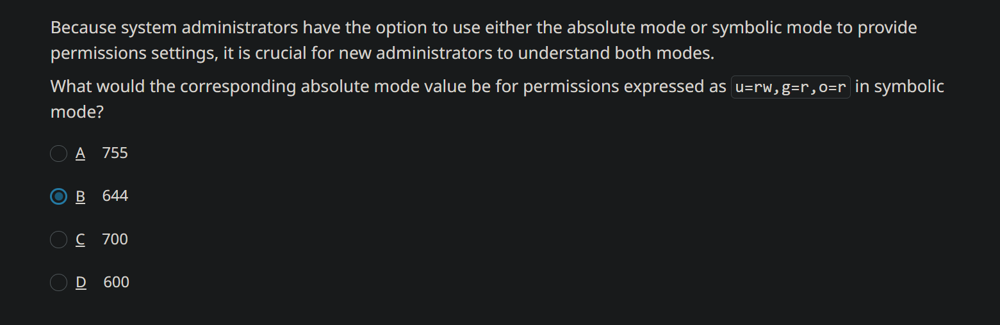

---

A user, ljenkins, contacts the help desk about an error received while removing a file from their home directory with the `rm` command. When prompted to remove the write-protected file, ljenkins entered **yes** and received an "Operation not permitted" error message:

> `[ljenkins@fileserver]$ rm report.txt rm: remove write-protected regular empty file 'myfile2.txt'? **y** rm: cannot remove 'myfile2.txt': Operation not permitted`

While troubleshooting the issue, you list files in the directory to see if you can discover the issue:`[ljenkins@fileserver]$ ls -al total 4 drwxr-xr-x. 2 ljenkins ljenkins 24 Feb 25 12:04 . drwx 15 ljenkins ljenkins 4096 Feb 25 11:04 .. -rw-rw-r--. 1 ljenkins ljenkins 346 Feb 25 11:32 report.txt`

As the help desk technician, you attempt to remove the file with root privileges and receive the same error message. You decide to view the file attributes and receive the following output:`[helpdesk@fileserver]$ lsattr ----I----------- ./report.txt`

Which of the following commands would resolve the problem and allow the file to be deleted?

answer

A

`sudo rm -vR report.txt`

B

`sudo lsattr report.txt | rm report.txt`

C

`sudo rm --force report.txt`

D

`sudo chattr -i report.txt && rm report.txt`


> #ERRATTA #GOTCHA: The capital `I` in the `lsattr` result almost certainly was meant to be a lower-case `i`, because the capital I means the file is indexed, which has nothing to do with whether it is deleteable or not

---


> lsattr lowercase i = immutable
> - Cannot modify, rename, or delete the file.
> - Clear it: sudo chattr -i filename
> 
> lsattr uppercase I = indexed directory
> - Filesystem metadata for a directory using an htree index.
> - Informational/read-only; not a deletion lock.


---

The Human Resources director for your company has been given an expanded role that covers internal training courses for the company. All the internal training course files are located in the /training/int directory.

The director, whose username is pmadison, has requested ownership of all these files.

Which of the following commands would you use to make pmadison the owner of all the files and directories within the /training/int directory?

answer

A
chown pmadison /training/int


B
chown -v pmadison /training/int


C
chown -f pmadison /training/int


D
chown -R pmadison /training/int   #MY_GUESS


---

Roberto, a help desk technician, receives a call from Alex, an employee who is not able to change to a directory that they own. The following is the output from the commands that Alex entered:

```sh
[alex@linux ~]$ ls -al 
drw-rw-rw-. 2 alex alex 6 Mar 24 16:08 Reports 
[alex@linux ~]$ cd Reports/
bash: cd: Reports/: Permission denied 
[alex@linux -]$
```

Based on the output, which of the following describes the problem?

answer

A

Alex requires administrative privileges to access their own directory.

B

Alex does not have the execute permission as owner of the directory. #MY_GUESS

C

Alex needs to view the directory's ACL for more details.

D

Alex needs to retype the command `cd Reports` without the forward slash (`/`) character.


---

A newly hired manager has brought a file from their previous employer and copied it to their new Linux workstation. Each time the manager tries to open or edit the file, they receive an "access denied" error. The manager is neither the owner of the file nor a member of its group

Which of the following represents the LEAST set of file permissions needed for the manager to be able to read and write to the file?

answer

A
111


B
222


C
444


D
666  #MY_GUESS


---


The following are the permissions currently assigned to the customer\_list file:

`-rwxr-xr-x 1 mfoote finance 8045 July 24 2022 customer_list`

You want to add the write permission for the finance group and remove all permissions for others.

Which of the following commands would accomplish this task?

answer

A

`chmod 750`

B

`chmod g+w,o-w customer_list`

C

`chmod g+w,o-r,o-x customer_list`   #MY_GUESS

D

`chmod 760`


---


Which of the following sets of permissions represent the minimal permissions required to allow a user to list the contents of a directory?

answer

A
r-- #MY_GUESS


B
rw-


C
rwx


D
r-x   


> - #GOTCHA:  **Newbie permission trap:** On directories, `r` lets you list names (like reading a building kiosk), but `x` lets you traverse/enter it (like badge access to the elevator). Even the owner cannot `cd` into a directory without `x`; ownership only selects the owner permission bits and allows `chmod` changes.

> NOTE: Based on this gotcha, I originally would have chose `r-x` as the answer, but now I'm choosing `r--`. I also verified it in an Ubuntu VM


---


A system administrator is troubleshooting a permissions issue with a file named customer\_list. The administrator runs the following command:`setfacl -m u:gsmith:r customer_list` After this, a user named gsmith attempts to access the file.

What is the impact of this command on the customer\_list file?

answer

A

It grants the group to which gsmith belongs read access to the customer\_list file.

B

It removes read access for the group to which gsmith belongs to the customer\_list file.

C

It removes read access to the customer\_list file for the gsmith user.

D

It grants the user gsmith read access to the customer\_list file.  #MY_GUESS


---


You recently learned that by default, newly created files on Linux are assigned permissions of `rw-rw-rw-` (666), and new directories are assigned `rwxrwxrwx` (777).

However, when creating a new file in the /data directory, you notice its permissions are `rw-r--r--` (644).

Which of the following BEST explains why this occurs?

answer

A

There are more restrictive permissions assigned to the /data directory, and any new files created inside that directory will inherit the more restrictive permissions. #MY_CHOICE

B

You are logged in as the root user, and all files created by the root user are assigned these permissions. Only normal users get `rwxrwxrwx` (777 octal) permissions on newly created files.

C

Because you are logged in as a normal user and not the root user, all files that you create will be created with a more restrictive set of permissions.

D

The umask must be set to 0022 and, therefore, block the write permission for the group owner and everyone else. #PERPLEXITY_ANSWER


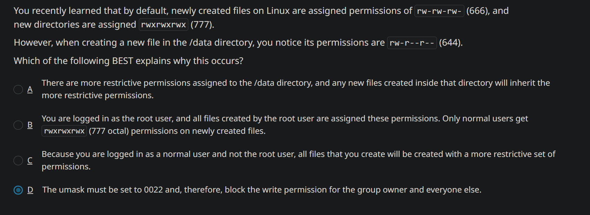


---


#PROOF

#ERRATA: The quiz is wrong on this one -- I thought it was r-x originally, but I tested it in Ubuntu and it doesn't need x but it absolutely needs r and I can list directory contents just fine with 400 permissions

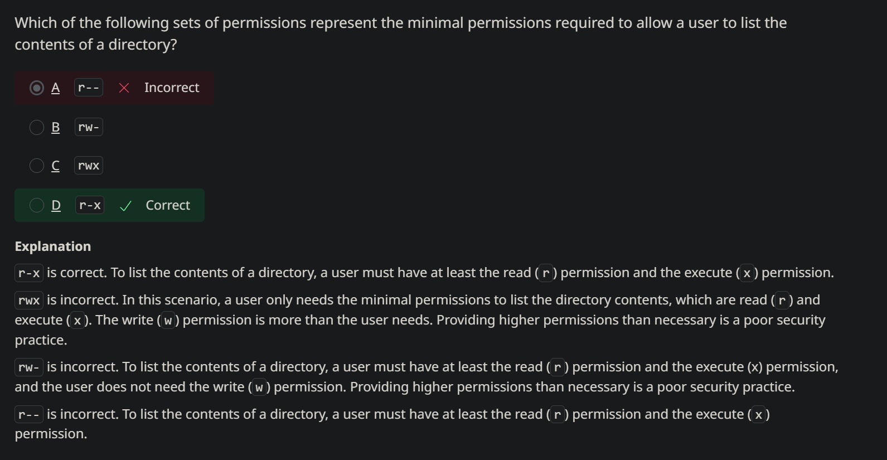

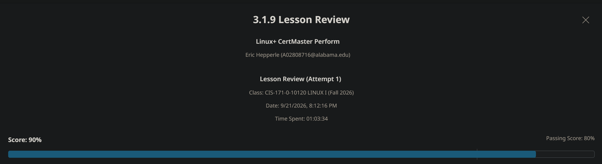


---

# 🟣 3.2.3 Lab: Set the SUID Bit

You have a Linux workstation, which you use at home for browsing the internet, playing music, and writing letters. When you run your MP3 player, it sometimes pauses in playback. You have heard that you might be able to alleviate the problem by raising the priority of the program. You decide to set the SUID bit to automatically run the program as root and, thereby, raise its priority. Complete this lab from the Terminal.

In this lab, your task is to:

*   Set the **SUID bit** for the /usr/bin/xmms program.
    *   From the Terminal, type **chmod u+s /usr/bin/xmms** and press **Enter**.
*   Do not change any other permissions on the file.


---


# 🟣 3.2.4 Lab: Remove SUID and SGID Permissions

You have a Linux workstation that you use at home. You are the only person that uses this computer. You want to improve security by removing the SUID and SGID from some files. Complete this lab from the Terminal.

In this lab, your task is to:

*   Remove the SUID from the following files:
    
    *   **/usr/bin/gpasswd**
    *   **/usr/bin/newgrp**
    
    1.  From a Terminal, type **chmod u-s /usr/bin/gpasswd** and press **Enter**. Do the same for **/usr/bin/newgrp**.
*   Remove the SGID from the following files:
    
    *   **/usr/bin/wall**
    *   **/usr/bin/write**
    
    1.  Type **chmod g-s /usr/bin/wall** and press **Enter**. Do the same for **/usr/bin/write**.
*   Leave permissions on the files as they are.


---


# 🟣 3.2.5 The Sticky Bit

The sticky bit is a special permission bit that protects files in a directory. It ensures that only the file or directory owner or root can delete the file or directory. Without the sticky bit, any user with write and execute permissions on the resource could delete it. The sticky bit ensures that these users do not have delete privileges but still have the rest of the privileges that come with the write and execute permissions on files and directories.

> - #TIP: sticky bit prevents users from having DELETE privileges to specific files; it is applied to the directory though — only the user who OWNS a file is able to DELETE that file in this specific directory; this is basically file protection

Like SUID and SGID, you set a sticky bit using the `chmod` command. The octal value for the sticky bit is 1. The `ls -l` command displays the sticky bit in the execute position for other users (the last position) as the lowercase letter `t` or the uppercase letter `T` if the execute permission is not set for others.

> - #HISTORY: The sticky bit originally was used to tell the OS that file would be executed frequently, so would essentially cache it in system memory; modern versions of Linux ignore this aspect "on files"

In older versions of the kernel, a sticky bit could force a program or file to remain in memory so that the system wouldn't need to reload it when it was invoked again. A sticky bit on a file informed the operating system that the file would be executed frequently. Modern versions of the Linux kernel ignore this aspect of the sticky bit on files; if you want to protect specific files, you must apply the sticky bit on the directory containing them.

In absolute mode, set the sticky bit using this syntax: `chmod 1--- {directoryname}`.

In symbolic mode, set the sticky bit using this syntax: `chmod +t {directoryname}`.

As with SUID and SGID, use `-` or `0` to clear the sticky bit.

---


# #VIDEO 3.2.6 Set the Sticky Bit Permissions


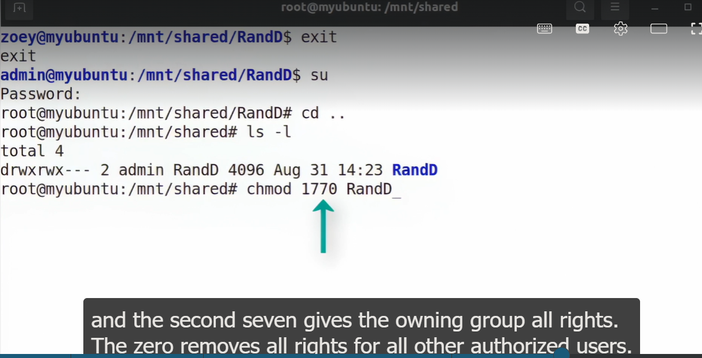

- The `T` tells us the sticky bit has been enabled

---

# 🟣 3.2.7 Troubleshooting Special Permissions Access

Troubleshooting special permissions is more difficult than finding issues with standard permissions, but the steps are similar. First, confirm any identities and group memberships. Next, ensure permissions are set correctly by using `ls -l`, and make any updates with `chmod`.

*   Confirm the SUID permission is set correctly for executable files.
*   Confirm the SGID permission is set correctly for directories to permit files created in the directory to inherit the group association.
*   Confirm the sticky bit permission is set correctly.

Suppose a user submits a ticket indicating that when they create a file in the sales department's /sales-tools directory, the file shows the user's account as the owner and the user's group as the associated group. Both you and the user expected the sales group to be associated with the new file. What is the likely problem?

Chances are, you haven't set the SGID special permission yet. Do so by typing the `chmod g+s /sales-tools` command, then have the user create a new file to test the access levels.

Other possible problems include making accidental changes to existing permissions when updating standard permissions. Consider the following examples.

Be careful not to misconfigure the standard permissions for the user, group, and others when adjusting the SUID or SGID special permissions, especially in absolute mode. You must define all four sets of permissions, even if you're only adjusting the special permission value in the first field.

Be sure to use the `ls -l` command before and after setting special permissions to ensure you haven't inadvertently changed the standard permissions.

Don't forget the proper syntax for setting SUID and SGID special permissions. Use the `u+s` setting for SUID and the `g+s` setting for SGID.


---


# 🟣 4.1.6 Lab: Create a Hard Link

Will Adams (wadams) owns and maintains a database file in the /home/wadams directory called contacts.db. The file holds contact information for prospective clients. Brenda Cassini (bcassini) and Vera Edwards (vedwards) want to access and add contact information to the file to share the data among the three users. You have decided to meet their request using a hard link.

In this lab, your task is to create hard link files to /home/wadams/contacts.db as follows:

*   Create the file in the following directories:
    
    *   **/home/bcassini**
    *   **/home/vedwards**
    
    1.  From a Terminal, type **ln /home/wadams/contacts.db /home/bcassini/contacts\_link** and press **Enter**.
    2.  Perform similar steps for the **/home/vedwards** directory.
*   Use **contacts\_link** as the name for the new hard links.

---


# 🟣 4.1.7 Lab: Create a Symbolic Link

Your company uses a proprietary graphics program called Imitator. This program is stored in the /root directory. Maggie Brown (mbrown) needs to create and modify images using the Imitator program.

In this lab, your task is to create a symbolic link file to /root/imitator as follows:

*   Use **imitator\_link** as the symbolic link name.
*   Create the link file in **/home/mbrown**.
    1.  From a Terminal, type **ln -s /root/imitator /home/mbrown/imitator\_link** and press **Enter**.


---

# 🟣 4.2.3 Lab: Create Directories

You are preparing to manage a new project, which is code-named White Horse. You need to prepare directories for White Horse documents. You are logged in as the wadams user.

In this lab, your task is to complete the following:

*   From the command line, create a directory called **wh** in /home/wadams.
    1.  From a Terminal, type **mkdir wh**
*   Also, from the command line, create the following directories in /home/wadams/wh:
    
    *   **implement**
    *   **plan**
    *   **research**
    
    1.  Use the **cd** command to change into the **wh** directory: **cd wh**.
    2.  Type **mkdir implement** and press **Enter**.
    3.  Use similar commands for the **plan** and **research** directories.
*   Use the **ls** command to verify the creation of the directories.


---

# 🟣 4.2.5 Lab: Move Files

Peter Lacy (placy) has taken an extended leave from the company for personal reasons. However, he was working on a critical project code named White Horse with several other employees. The project leader requested that you move any White Horse documents in Peter Lacy's home directory to Brenda Cassini's (bcassini's) home directory. You're logged on as wadams. Complete this lab from the Terminal.

In this lab, your task is to:

*   Switch to the root user using **1worm4b8** for the root user password.  
    You must have root user permissions to move other people's files.
*   Move the following files from Peter's home directory (placy) to Brenda's home directory (bcassini).
    
    *   **confid\_wh**
    *   **projplan\_wh**
    
    1.  Use the **cd** command to switch to the **/home/placy** directory.
    2.  Type **mv confid\_wh ../bcassini** and press **Enter**.
    3.  Use a similar command to move the **projplan\_wh** file.
*   Use the **ls** command to verify the files' new location.


---

# 🟣 4.2.7 Lab: Delete Files

Someone created duplicate versions of three project documents. To avoid version control problems, you need to delete the duplicate files. When deleting the files, use the switch that will allow you to delete a file without any promptings. Complete this lab from the Terminal.

In this lab, your task is to:

*   Delete the following files from the /projects directory:
    *   **darkhorse1**
    *   **camouflage1**
    *   **endgame1**

1.  From a Terminal, use the **cd** command to change to the **/projects** folder.
2.  Type **rm -f darkhorse1** and press **Enter**.
3.  Use similar commands to remove the **camouflage1** and **endgame1** files.

*   When you are finished, use the **ls** command to verify the deletion.


---

# 🟣 4.2.8 Lab: Delete Directories

Your company recently changed directions and decided to terminate three products. All the necessary files have been backed up, archived, and deleted. Now, you need to clean up your system by removing the directories that were used to hold the product files.

In this lab, your task is to complete the following:

*   From the command line, delete the following directories from the /projects directory:
    *   **heartbt**
    *   **heartmon**
    *   **heartstrng**

1.  From a Terminal, type **cd /projects** and press **Enter**.
2.  Use the following command to remove all of the directories: **rmdir heartbt heartmon heartstrng**.

*   Use the **ls** command to verify the deletion of the directories.


---

# 🟣 4.2.11 Lab: Use grep

Vera Edwards (vedwards) was recently hired as a new salesperson for your company. She cannot access the files in the sales folder and has asked for your help. Although you thought you had added her to the group, you want to verify this on her system. When you arrive to help her, she tells you that she cannot find a proposal file she has written, and she would like you to help her find it. Complete this lab from the Terminal.

In this lab, your task is to use **grep** to:

*   Find the current members of the **/etc/group** named **sales**.
    *   From a Terminal, type **grep sales /etc/group** and press **Enter**.
*   From the top right, select **Questions** and answer Question 1.
*   Find which proposal file contains the phrase _The Fluid Data_. The file is either in her home directory or in one of her sub-directories.
    *   Type **grep -r "The Fluid Data" \*** and press **Enter**.
*   Answer Question 2.


---
---


# 🟣 3.2.8 Live Lab: Set Special Linux Permissions

> In this lab, you will configure special Linux permissions, including SGID, the sticky bit, and the immutable flag.

# Live Lab: Configure Special Linux Permissions

You are a Linux administrator for a large party supply company. Your role is to manage a shared Linux server for multiple departments within your company. Each department has its own directory for storing files, and these directories are shared among team members. Recently there has been some confusion and conflict regarding which files belong to which department.

In order to keep the collaboration running smoothly, and to follow best security practices, your manager has tasked you with configuring **SGID (Set Group ID)** permissions on the department directories. This way, files created within those directories will inherit the group ownership of the directory.

> **Your Mission:**
> 
> *   Understand the purpose and functionality of SGID permissions and Sticky Bits.
> *   Configure SGID permissions on directories to enforce group ownership inheritance.
> *   Apply the Sticky Bit to restrict file deletion for non-owners.
> *   Verify the correct configuration of SGID and Sticky Bits using command-line tools.

## Exam Objectives

This activity is designed to test your understanding of and ability to apply content examples in the following CompTIA Linux+ objectives:

*   3.3 Given a scenario, apply operating systerm (OS) hardening techniques on a Linux system

> This lab only implements the local network, so adapters will display a _No Internet access_ tooltip. This is not an error.

---

## Use (Set Group ID) SGID

In this section, you will use SGID to automatically set group associations.

Login instructions

Use [Ctrl+Alt+Delete](#) to start, sign in and authenticate.  

| Host | User | Passwd |
| --- | --- | --- |
| linux01, linux02 | `rocky` | `toor` |
| linux01, linux02 | `user1` | `Pa55w0rd!` |
| linux01, linux02 | `user2` | `Pa55w0rd!` |
| linux01, linux02 | `root` | `toor` |

> NOTE: the entire lab series is designed for you to type in the **commands to learn syntax and spacing**, so ensure you double-check what you have typed before entering.

1.   Log into [linux01](#) system as **rocky** using `toor` as the password.
    
2.   From the **_Activities_** menu, select **_Terminal_**.
    
3.   Use the `su -` command to gain root privileges. The root password is `toor`.
    
4.   Check the default permissions on the **/Images** directory. `ls -ld /Images`
    
    The permissions are: **drwxrwxr--**
    
5.   Apply the SGID on **/Images** so that newly created files will get the group association. `chmod g+s /Images`
    
    Confirm that you applied the SGID on the /Images directory.
    
6.   Display the new permissions on the **/Images** directory. `ls -ld /Images`
    
7.   Switch to Rose Stanley's user account. `su - rstanley`
    
8.   Make the **/Images** directory your current directory. `cd /Images`
    
9.   Create a new file named **file4** with `touch file4`, then view the permissions on the contents of the current directory. `ls -l`
    
    Confirm that rstanley is the owner and the group is graphicsdept for file4.
    
10.   Exit to return to the **root** login. `exit`


---

## Use Sticky Bit to Protect Files from Deletion

1.   Assign the sticky bit to the **/Images** directory. `chmod +t /Images`
    
    Confirm that you set the sticky bit on the /Images directory.
    
2.   Switch to the **jrobinson** user account. `su - jrobinson`
    
3.   Make the **/Images** your current directory. `cd /Images`
    
4.   Attempt to remove **file4**, which is owned by **rstanley**. `rm file4`
    
    When prompted, reply with a **y** to attempt to remove file4.
    

> Note that you receive an "Operation not permitted" response. If this were a permissions issue, you would receive an "access denied" response instead. Even though jrobinson is a member of the graphicsdept group, and that group has permission to delete a file in this directory, the sticky bit prevents file deletion from a non-owner.

1.   Exit to return to the **root** login. `exit`
    
    Confirm that you attempted to remove file4 from the /Images directory.


---

## Set the Immutable Flag on a File

You have created a README text file stored in the **/Images** directory to help guide users on the proper use of the content. You will set the immutable attribute to ensure that no one, not even the root user, can accidentally delete the file.

1.   Create a file named **README** in the **/Images** directory.`touch /Images/README`
    
2.   View the current permissions settings for the **README** file.`ls -l /Images`
    
3.   Set the immutable attribute on the **README** file.`chattr +i /Images/README`
    
4.   View the current standard permissions on the **/Images** directory and verify that they have not changed.`ls -ld /Images`
    
5.   Display the immutable attribute on the **/Images/README** file.`lsattr /Images/README`
    
    Confirm that you set the immutable flag on the /Images/README file.
    
6.   Attempt to delete the **README** file from the **/Images** directory.`rm /Images/README`
    
    When prompted, reply with a **y** to attempt to remove the /Images/README file.
    
    > You cannot remove the **README** file due to the immutable attribute. Note the **Operation not permitted** response rather than the "access denied" response that indicates a permissions issue.


---

## Remove Immutable Flag and Delete File

You can remove the immutable flag so that the file can then be removed.

1.   Unset the immutable attribute on the **README** file.`chattr -i /Images/README`
    
2.   Remove the **README** file.`rm /Images/README`
    
    When prompted, reply with a **y** to attempt to remove the `/Images/README` file.
    
    Confirm that you removed the /Images/README file.

---

## Review Lab

1.  Who can delete a file with the immutable flag set?
    
    Only root and the owner
    
    No one
    
    Any user with the execute permission
    
    Only root
    
2.  Who can delete a file with the sticky bit set? (Select 2)
    
    Anyone with the execute permission
    
    others
    
    owner #CORRECT
    
    root #CORRECT
    
    group
    
3.  If the SGID is set on a directory, and the directory's associated group is sales, what group will be assigned to new files created in the directory?
    
    The sales group.
    
    The creator's primary group.
    
    The root group.
    
    No group will be assigned.


---

## Grade Lab

> You have completed the following tasks:
> 
> *   Understand the purpose and functionality of SGID permissions and Sticky Bits.
> *   Configure SGID permissions on directories to enforce group ownership inheritance.
> *   Apply the Sticky Bit to restrict file deletion.
> *   Verify the correct configuration of SGID and Sticky Bits using command-line tools.

That concludes this lab. Please ensure you check your work to submit for a grade:

1.  Select check boxes to mark all tasks complete.
2.  Submit responses to all questions/activities.

> Select:
> 
> *   **Submit** in the bottom right corner, then **Yes, end my lab** to score and record your grade. You can relaunch again at any time.
> *   **Save & Exit** in the top corner to save your progress and return. You will seven (7) days to complete your progress.

---

#PROOF

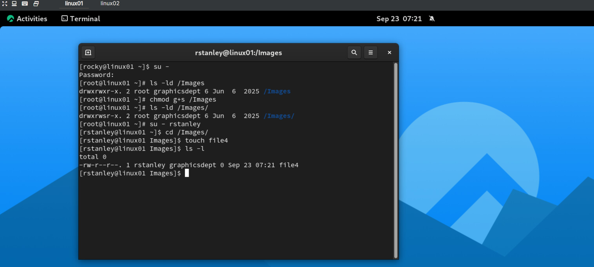


---

# 🟣 3.3.4 Live Lab: Configure Access Control Lists

> In this activity, you will display and configure Linux access control lists (ACLs).

## Scenario

You are a systems administrator at a medium-sized printing company. The Graphics department has requested that you give read-only access to the Marketing department for the **/Projects** directory. With standard permissions, only one group association can exist.

> - #GOTCHA:  *With standard permissions, only one group association can exist.*

You will use access control lists (ACLs) to ensure that the Graphics and Marketing departments have access. You will set an ACL on one file in the **/Projects** directory for a single user.

> **Your Mission** is to:
> 
> *   Display ACLs
> *   Set a recursive directory ACL
> *   Set an ACL for a user, modify an ACL

## Exam Objectives

This activity is designed to test your understanding of and ability to apply content examples in the following CompTIA Linux+ objectives:

*   2.1 Given a scenario, manage files and directories on a Linux system
*   2.2 Given a scenario, perform local account management in a Linux environment
*   3.3 Given a scenario, apply operating system (OS) hardening techniques on a Linux system

## Lab environment

The Linux+ lab environment consists of one Rocky Linux 9.5 VM.

---

## Set a Directory ACL

In this section, you will learn how to set an ACL on a directory for the marketing department.

> You are already logged in as the **root** user.

1.   Type the `getfacl /Projects` command to display the current ACL on the **/Projects** directory.
    
    > This lab is designed for you to type in the commands to learn syntax and spacing, so ensure you double-check the command before entering.
    
2.   Type the `setfacl -R -m g:MarketingDept:rx /Projects` command to grant read and execute permissions to the **MarketingDept** to the **/Projects** directory and its contents.
    
    > The execute permission is required to `cd` into a directory.
    
3.   Recheck the ACL to view the new level of access you set for the **MarketingDept**.
    
    Confirm that you created the ACL for the **MarketingDept** on the **/Projects** directory.
    
4.   Type the `usermod -a -G MarketingDept bsmith` command to add the user **bsmith** to the **MarketingDept** group.
    
5.   Type the `getent group MarketingDept` command to verify that **bsmith** is a member of the **MarketingDept** group.


---

## Set a File ACL

You can set ACLs on specific files. In this section, you will set an ACL on a file for an individual user.

1.   Type the `ls -l /Projects/Client_Profiles.txt` command to display the current standard permissions on the **/Projects/Client\_Profiles.txt** file.
    
2.   Type the `getfacl /Projects/Client_Profiles.txt` command to display the current ACL on the **/Projects/Client\_Profiles.txt** file.
    
3.   Type the `setfacl -m u:bsmith:rw /Projects/Client_Profiles.txt` command to grant read and write permissions to **Betty Smith (bsmith)** to the **/Projects/Client\_Profiles.txt** file using an ACL.
    
4.   Display the ACL to review the new level of access you set for **bsmith**.
    
5.   Type the `su - bsmith` command to switch to the **bsmith** user account.
    
6.   Type the `echo "ABC Client contacted 03/01/2022" >> /Projects/Client_Profiles.txt` command to add the text into the **/Projects/Client\_Profiles.txt** file, demonstrating that user **bsmith** can write to the **/Projects/Client\_Profiles.txt** file.
    
7.   Type the `exit` command to return to the **root** user account.
    
8.   Type the `ls -l /Projects/Client_Profiles.txt` command to display the standard permissions on the **/Projects/Client\_Profiles.txt** file and confirm that the **root** user owns the file. **Betty Smith** was able to write to the file because of the ACL applied to it.
    
    Confirm that you created the ACL for user **Betty Smith** on the **/Projects/Client\_Profiles.txt** file.

---

## Review lab

1.  Which of the following best describe how ACLs are more flexible than standard permissions? (Select two.)
    
    ACLs can grant multiple permissions to multiple users.
    
    ACLs can grant multiple permissions to multiple groups.
    
    Standard permissions can grant multiple permissions to multiple groups.
    
    Standard permissions can grant multiple permissions to multiple users.
    
2.  What is the purpose of the execute (x) permission for directories.
    
    The execute (x) permission on a directory allows a user to use cd to access a directory.
    
    The execute (x) permission on a directory prevents a user from using cd to access a directory.
    
    The execute (x) permission prevents both read and write privileges to the directory.
    
    The execute (x) permission allows both read and write privileges to the directory.
    
3.  What command displays currently configured ACLs?
    
    getacl
    
    ls -l
    
    getfacl
    
    setfacl
    
    setacl

---

## Grade Lab

> You have completed the following tasks:
> 
> *   Display ACLs
> *   Set a recursive directory ACL
> *   Set and modify an ACL for a user

That concludes this lab. Please ensure you check your work to submit for a grade:

1.  Select check boxes to mark all tasks complete.
2.  Submit responses to all questions/activities.

> Select:
> 
> *   **Submit** in the bottom right corner, then **Yes, end my lab** to score and record your grade. You can relaunch again at any time.
> *   **Save & Exit** in the top corner to save your progress and return. You will have seven (7) days to complete your progress.

---

#PROOF

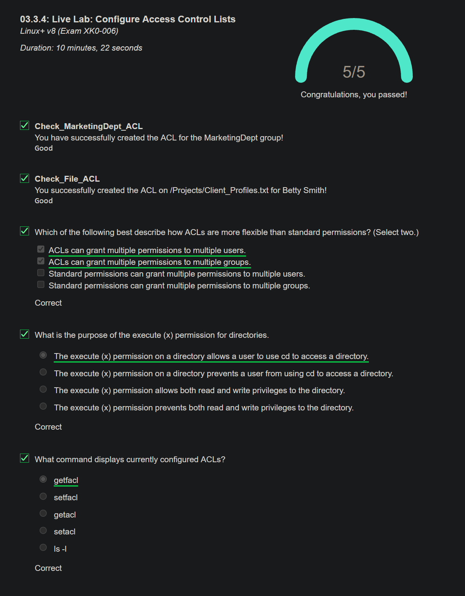


---

# 🟣 3.3.7 Applied Live Lab: Manage Identity And Access Control

> In this applied lab you will manage identities, both users and groups, and access control.

## Scenario

You are a Linux Systems Administrator, and have been given a Rocky Linux system on which to perform configuration tasks that include creating, modifying, removing user and group accounts and seting and modifying file and directory permissions.

> **Your Mission:**
> 
> *   Manage user and group accounts.
> *   Set standard Linux permissions.
> *   Use and manage privilege escalation.
> *   Work with the umask command and settings.
> *   Set the sticky bit on files and directories.

## Exam Objectives

This activity is designed to test your understanding of and ability to apply content examples in the following CompTIA Linux+ objectives:

*   3.3 Given a scenario, apply operating systerm (OS) hardening techniques on a Linux system

> This is an **applied lab**, and is designed for you to recall previous efforts and strive to complete tasks without guided steps and hints. If guidance is required, click on the **Enable Hints** button to reveal. You can only achieve the maximum score without hints.


---

## TASK 1: Manage User Accounts

> NOTE: the entire lab series is designed for you to type in the **commands to learn syntax and spacing**, so ensure you double-check what you have typed before entering.

1.   Sign in to [linux01](#) as `rocky` using password `toor`.
    
2.   Create and configure the following user accounts:
    
    | User | Name | Default Shell |
    | --- | --- | --- |
    | `sam` | `Sam Sales` |     |
    | `rene` | `Rene HR` | `zsh` |
    | `temp` |     |     |
    
3.   Set all accounts to use the password `Pa55w0rd!`
    
4.   When you have created and configured the accounts, delete the temp account, while leaving the home directory intact. This simulates the idea that it was used as a contractor account for a single project.
    

> Make sure you complete all the steps and create any objects you subsequently delete. If steps are not followed exactly, the task will be evaluated as incomplete.

## Choose Guided Steps and Hints

You can work independently to complete the task or you can choose to show guided steps and hints. You can only achieve the maximum score if you keep hints hidden.

1.  To create the sam account and set a password, run the following commands, responding with the password `toor` when prompted to authenticate the use of sudo:
    
    `sudo useradd sam`
    
2.  To set the password, run the following command and respond with `Pa55w0rd!`
    
    `sudo passwd sam`
    
3.  Use the following commands to create the next two users:
    
    `sudo useradd rene`
    
    `sudo useradd temp`
    
4.  To set the passwords, run the following commands and respond with with `Pa55w0rd!`
    
    `sudo passwd rene`
    
    `sudo passwd temp`
    
5.  To add the names, use the following commands:
    
    `sudo usermod -c "Sam Sales" sam`
    
    `sudo usermod -c "Rene HR" rene`
    
6.  Run `cat /etc/shells` to verify that the zsh is available, then run the following command to configure it as the default for rene's account:
    
    `sudo usermod -s /bin/zsh rene`
    
7.  Run the following command to remove the temp account _without_ deleting the associated home directory:
    
    `sudo userdel temp`
    

- - -

Check your work

*   Run `cat /etc/passwd` and verify the following:
    *   That the sam and rene accounts and names are present.
    *   That rene is set to use /bin/zsh by default.
    *   That the temp account is NOT present.
*   Run `ls /home` and verify that the temp directory is still present.

Select the **Evaluate** button to assess and score the task:

Checking task completion …

Checking for hint use …

Checking for retries …

> You may retry evaluation as many times as you like, but you will only receive maximum marks if your first scoring attempt is successful.

---

## TASK 2: Manage Group Accounts

1.   Create groups to manage users on the on the [linux01](#) VM.
    
    | Group | GID | 2ndary Group Members |
    | --- | --- | --- |
    | `recruiting` | `8000` | `rene`  <br>`user1` |
    | `medical` | `8050` |     |
    | `multimedia` | `8100` | `sam`  <br>`user2` |
    
2.   Create the following directories and files:
    
    *   `/opt/recruiting/`
    *   `/opt/socialmedia/`
    *   `/opt/socialmedia/favorites/`
3.   Create the following files:
    
    *   `/opt/recruiting/hrpolicy.txt`
    *   `/opt/socialmedia/README`
    
    Perform the following operations implementing changes to the inital setup:
    
4.   Remove `user1` from the `recruiting` group.
    
5.   Rename the `multimedia` group to `socialmedia`.
    
6.   Remove the `medical` group.
    

## Choose Guided Steps and Hints

You can work independently to complete the task or you can choose to show guided steps and hints. You can only achieve the maximum score if you keep hints hidden.

1.  Run the following commands to create the groups, responding with `toor` if prompted to authenticate use of sudo:
    
    `sudo groupadd -g 8000 recruiting`
    
    `sudo groupadd -g 8050 medical`
    
    `sudo groupadd -g 8100 multimedia`
    
2.  Run the following commands to add the groups to user accounts:
    
    `sudo usermod -aG recruiting rene`
    
    `sudo usermod -aG recruiting user1`
    
    `sudo usermod -aG multimedia sam`
    
    `sudo usermod -aG multimedia user2`
    
3.  Create the required directories:
    
    `sudo mkdir /opt/recruiting`
    
    `sudo mkdir -p /opt/socialmedia/favorites`
    
4.  Create the required files:
    
    `sudo touch /opt/recruiting/hrpolicy.txt`
    
    `sudo touch /opt/socialmedia/README`
    
5.  Run `sudo gpasswd -d user1 recruiting` to remove the account from the group.
    
6.  Run `sudo groupmod -n socialmedia multimedia` to rename the group.
    
7.  Run `sudo groupdel medical` to delete the group.
    

- - -

Check your work

*   Run `cat /etc/group` and verify the following:
    *   The recruiting group has GID 8000 and rene as a member.
    *   The socialmedia group has GID 8100 and sam and user2 as members.
    *   The medical account is NOT present.
*   Run `ls /opt/recruiting && ls /opt/socialmedia` and verify the hrpolicy.txt, README files and favorites subdirectory are present.

Select the **Evaluate** button to assess and score the task:

Checking task completion …

Checking for hint use …

Checking for retries …

> You may retry evaluation as many times as you like, but you will only receive maximum marks if your first scoring attempt is successful.

---

## TASK 3: Configure Permissions

Now that you have users and groups, you can control access to the resources you create by using permissions.

1.   Configure the group owners for the recruiting and social media directories:
    
    1.   Assign the **recruiting** group to `/opt/recruiting` and all its children.
    2.   Assign the **socialmedia** group to `/opt/socialmedia` and all children.
2.   Configure recursive permissions for the `/opt/recruiting` directory:
    
    1.   Add **write** permission for the **recruiting** group.
    2.   Remove all permissions for **others**.
3.   Configure recursive permissions for the `/opt/socialmedia` directory:
    
    1.   Add **write** permission for the **socialmedia** group.
    2.   On `/opt/socialmedia/README`, set only **read** permission for the **owner, group, and others**.

## Choose Guided Steps and Hints

You can work independently to complete the task or you can choose to show guided steps and hints. You can only achieve the maximum score if you keep hints hidden.

1.  Set the group owners as specified, responding with `toor` if prompted to authenticate use of sudo:
    
    `sudo chgrp -R recruiting /opt/recruiting`
    
    `sudo chgrp -R socialmedia /opt/socialmedia`
    
2.  Run `ls -ld /opt/recruiting` to verify the current permissions.
    
3.  Configure recursive permissions for the /opt/recruiting directory to achieve the required configuration:
    
    `sudo chmod -R g+w,o-r,o-x /opt/recruiting`
    
4.  Run `ls -l /opt/socialmedia` to verify the current permissions.
    
5.  Configure recursive permissions for the /opt/socialmedia directory and README file to achieve the required configuration:
    
    `sudo chmod -R g+w /opt/socialmedia`
    
    `sudo chmod g-w,u-w /opt/socialmedia/README`
    

- - -

Check your work

*   Run `sudo ls -Rl /opt | grep 'recruiting\|socialmedia`
*   Verify the configuration:
    *   /opt/recruitment and its child objects should be owned by root:recruiting
    *   /opt/recruitment should have the permission string drwxrwx---
    *   /opt/recruitment/hrpolicy.txt should have the permission string \-rw-rw----
    *   /opt/socialmedia and its child objects should be owned by root:socialmedia
    *   /opt/socialmedia and /opt/socialmedia/favorites should have the permission string drwxrwxr-x
    *   /opt/recruitment/README should have the permission string \-r--r--r--

Select the **Evaluate** button to assess and score the task:

Checking task completion …

Checking for hint use …

Checking for retries …

> You may retry evaluation as many times as you like, but you will only receive maximum marks if your first scoring attempt is successful.

---

## TASK 4: Manage Privilege Escalation

Elevate administrative privileges to user accounts.

1.   Grant administrative privileges to **rene** by adding the account to the **wheel** group as a secondary group.
    
2.   Configure _/etc/sudoers_ so the **rocky** user does not have to supply a password when using a shutdown or reboot command.
    
    Shutdown commands `Cmnd_Alias SHUTDOWN=/sbin/poweroff, /sbin/reboot, /sbin/shutdown, /usr/sbin/reboot, /usr/sbin/poweroff, /usr/sbin/shutdown, /usr/bin/systemctl poweroff, /usr/bin/systemctl reboot`
    

## Choose Guided Steps and Hints

You can work independently to complete the task or you can choose to show guided steps and hints. You can only achieve the maximum score if you keep hints hidden.

1.  Add rene to the wheel account:
    
    `sudo usermod -aG wheel rene`
    
2.  Run `sudo visudo` to edit the /etc/sudoers file.
    
3.  Type `Go` to insert a new line at the end of the file, then type **BACKSPACE** to remove the autogenerated comment marker.
    
4.  Add the following line to the bottom of the file to create an alias representing the shutdown/reboot commands:
    
    `Cmnd_Alias SHUTDOWN=/sbin/poweroff, /sbin/reboot, /sbin/shutdown, /usr/sbin/reboot, /usr/sbin/poweroff, /usr/sbin/shutdown, /usr/bin/systemctl poweroff, /usr/bin/systemctl reboot`
    
5.  Press **ENTER**, and type the following line to allocate permission to use these commands without authenticating:
    
    `rocky ALL=(ALL) NOPASSWD:SHUTDOWN`
    
6.  Press **ESC**, then enter `:wq` to write changes and exit.
    

- - -

Check your work

*   Run `cat /etc/group | grep wheel` and verify that the rene user is listed.
*   `sudo -l` and verify that NOPASSWD permission is set for the shutdown/reboot commands.

Select the **Evaluate** button to assess and score the task:

Checking task completion …

Checking for hint use …

Checking for retries …

> You may retry evaluation as many times as you like, but you will only receive maximum marks if your first scoring attempt is successful.

---

## TASK 5: Apply the umask Command

1.   Change the _rocky_ user's **umask** permanently to **027**.

## Choose Guided Steps and Hints

You can work independently to complete the task or you can choose to show guided steps and hints. You can only achieve the maximum score if you keep hints hidden.

1.  Run `echo "umask 027" >> ~/.bashrc` to add the umask value to the shell initialization file.
    
2.  To load the new **umask** value, run `source ~/.bashrc`
    

- - -

Check your work

*   Create a new file `touch umask-test`
*   Create a new directory named `mkdir umask-dir`
*   Run `ls -l` to verify that file and the directory have the permission string rw-r-----.

Select the **Evaluate** button to assess and score the task:

Checking task completion …

Checking for hint use …

Checking for retries …

> You may retry evaluation as many times as you like, but you will only receive maximum marks if your first scoring attempt is successful.

---

## TASK 6: Set Special Permissions

Configure an /opt/shared directory with special permissions.

1.   Create a new directory /opt/shared.
    
2.   Change the group owner of the directory to **rocky**.
    
3.   Set the SGID and sticky bits on /opt/shared
    
4.   Set permissions on the /opt/shared directory to : **world read, writable, and executable**.
    
5.   Open a new terminal tab, sign in as _rene_ with `Pa55w0rd!` and create a new file in the /opt/shared/rene.txt.
    
6.   Return to the previous tab, and set **group writable** permissions on the files in /opt/shared.
    

## Choose Guided Steps and Hints

You can work independently to complete the task or you can choose to show guided steps and hints. You can only achieve the maximum score on your first attempt.

1.  Create a new directory /opt/shared.
    
    `sudo mkdir /opt/shared`
    
2.  Change the group owner of the directory to **rocky**.
    
    `sudo chgrp -R rocky /opt/shared`
    
3.  Configure the specified permissions /opt/shared
    
    `sudo chmod -R o+r,o+w,o+x,g+s,+t /opt/shared`
    
4.  Open a new terminal tab, run `su - rene` and respond with `Pa55w0rd!`
    
5.  Create a new file in the `touch /opt/shared/rene.txt`
    
6.  Return to the previous tab, and set **group writable** permissions on the files in /opt/shared:
    
    `sudo chmod -R g+w /opt/shared`
    

- - -

Check your work

*   Run `ls -ld /opt/shared` and verify that the permission string is drwxrwsrwt
    *   The owner is root with rwx permissions.
    *   The group is rocky with rw and setgid permissions.
    *   Other has rw and sticky permissions.
*   Verify permissions on rene.txt `ls -l /opt/shared` .
    *   The owner is rene with rw permissions.
    *   The group is rocky with rw permissions.
*   Run `rm /opt/shared/rene.txt` to verify rocky cannot modify or delete rene's file in /opt/shared, even though the rocky group has write permission.

Select the **Evaluate** button to assess and score the task:

Checking task completion …

Checking for hint use …

Checking for retries …

> You may retry evaluation as many times as you like, but you will only receive maximum marks if your first scoring attempt is successful.

---

## Grade Lab

> You have completed the following tasks:
> 
> *   Manage user and group accounts.
> *   Set standard Linux permissions.
> *   Use and manage privilege escalation.
> *   Work with the umask command and settings.
> *   Set the sticky bit on files and directories.

That concludes this lab. Please ensure you Check Your Work to submit for a grade:

1.  Select check boxes to mark all tasks complete.
2.  Submit responses to all questions/activities.

> Select:
> 
> *   **Submit** in the bottom right corner, then **Yes, end my lab** to score and record your grade. You can relaunch again at any time.
> *   **Save & Exit** in the top corner to save your progress and return. You will seven (7) days to complete your progress.

---

#PROOF

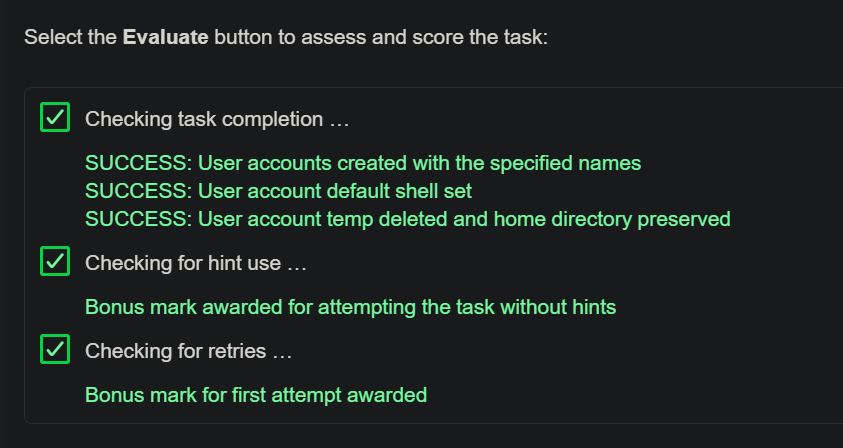

> #TIP: Use `tail /etc/group` after assigning users to groups with `usermod`

> #TIP: Delete group with `sudo groupdel [groupname]`

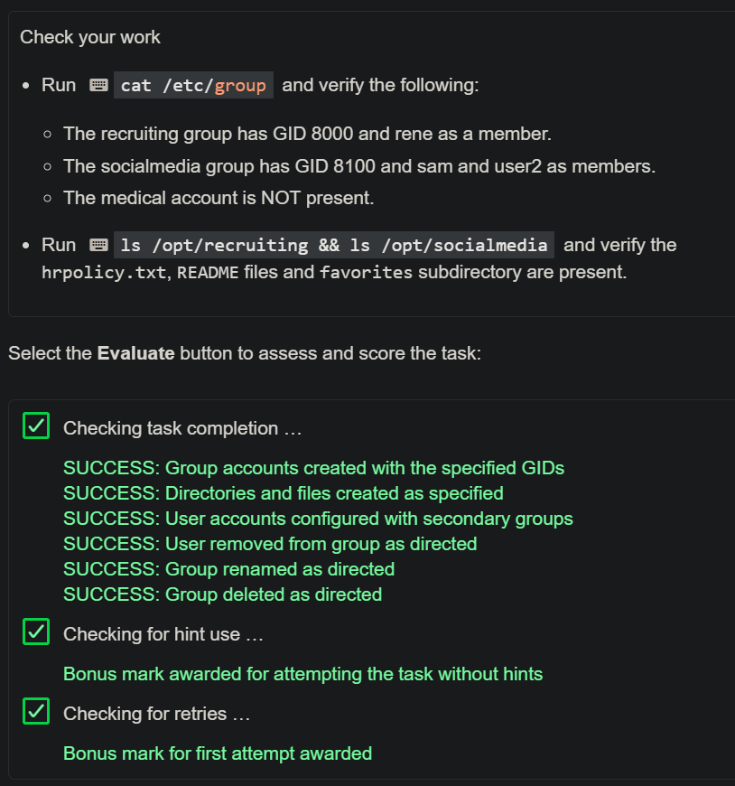

    
> - #TIP: To change group ownership: `sudo chgrp -R recruiting /opt/recruiting`

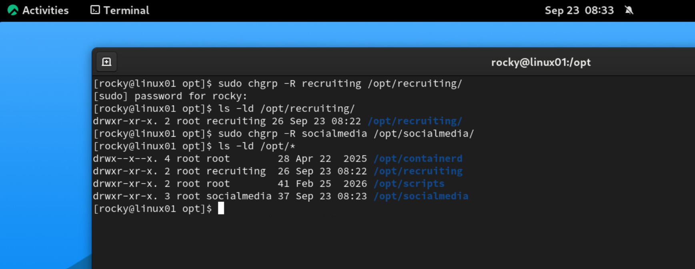

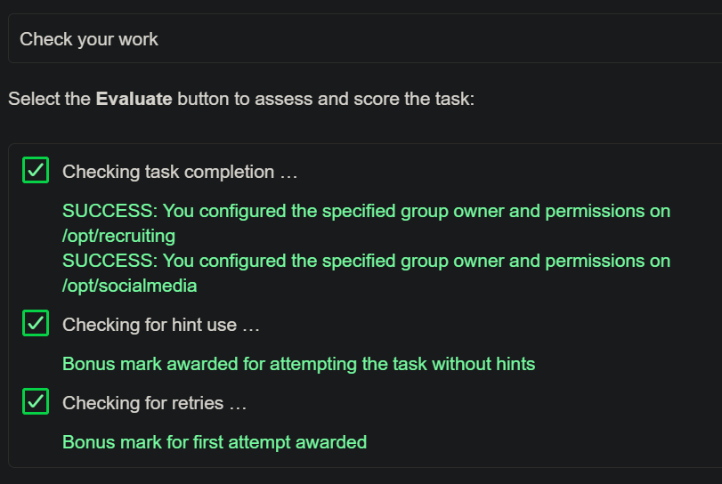

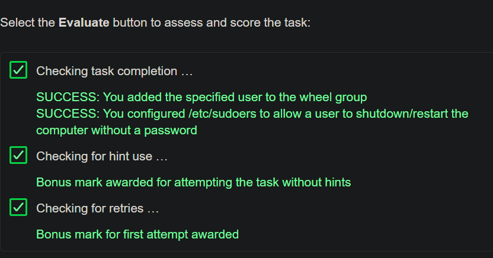


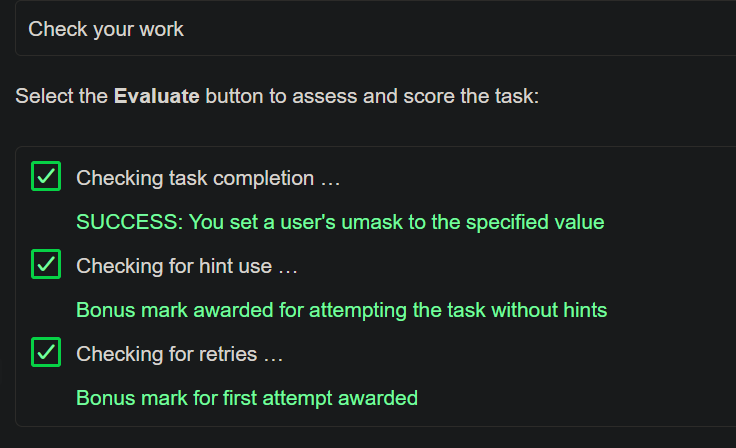

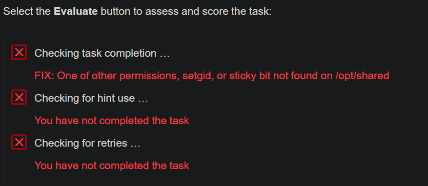

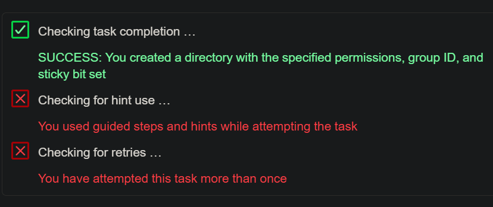

---

# 🟣 

---

# 🟣 

---

# 🟣 

---

# 🟣 


--- --- --- END  --- --- ---


