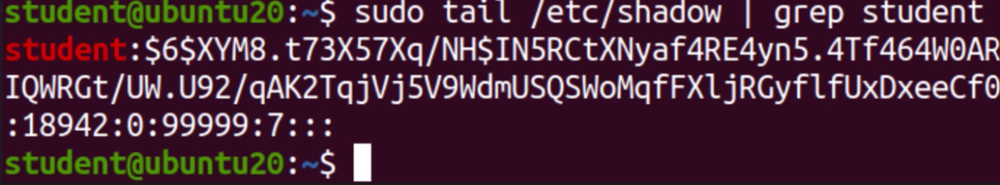
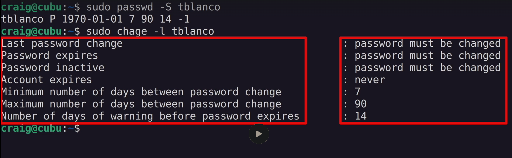
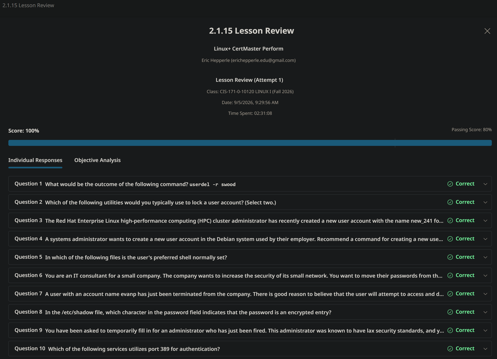

<!-- Custom stylesheet -->
<link rel="stylesheet" href="../../_css/main.css">

<!-- Site logo -->


> [🏚️ README](../../../README.md) | [📁 Courses](../../index.md) | [📚 Vocabulary](../../Vocabulary.md) | [🗓️ Assignments Schedule](../Assignments_Schedule.md) | [🔖 Bookmark](#bookmark)


# CIS 171 - Linux I:  <br> NOTES: Week 2 - Manage files, directories, and permissions

> The following are my notes on the **CompTIA: Linux+ CertMaster Perform** V8 learning platform course

## 📖 2.1 - Manage User Accounts

Exam Objectives

*   2.2 **Given a scenario, perform local account management in a Linux environment**
*   3.1 **Summarize authorization, authentication, and accounting methods**
*   4.2 **Given a scenario, perform automated tasks using shell scripting**
*   5.4 **Given a scenario, analyze and troubleshoot security issues on a Linux system**
  
System administrators play a critical role in managing user accounts on a system. These user accounts are essential because they personalize the user environment and control access to system resources, such as files, applications, and network services. Properly managing user accounts ensures that each user has the appropriate permissions and access needed to perform their tasks while maintaining the security and integrity of the system. To effectively administer user accounts, sysadmins must have a thorough understanding of the files and tools used for account management.


---

2.1.1 User Account Concepts


Accounts represent identities on the computer. Linux grants different types of privileges to accounts on the system. For example, users may be able to run certain programs, or Linux services may have access to processor, memory, storage, and network resources.

Three types of accounts exist in Linux: system, service, and user accounts. You will spend most of your time working with user accounts, but it's important to recognize the roles of system and service accounts.

*   **System accounts** represent parts of the Linux operating system itself. Various Linux components have access to different resources, and that access is managed based on system accounts.
    
*   **Service accounts** allow applications to access system resources, such as central processing unit (CPU) time, memory, and networking. For example, the Apache web server service (httpd) needs to consume system resources to provide web pages to external clients. Linux grants (and limits) the required privileges for Apache's service account.
    
> - **httpd:** the Apache web server service

Users also need access to CPU, memory, storage, and network resources. Each resource has a permissions list specifying what identities can use it. **Linux compares the account's user ID (UID) against the resource permissions to determine whether to allow access to it.** If the user has the correct permissions, they can use that resource.

Administrators usually work with accounts based on recognizable labels, such as `kgarcia` for a user named Kai Garcia. These labels are called **usernames**, and they can vary according to an organization's preference or standards. For example, Kai Garcia could be called kgarcia, kaig, or kai\_garcia. However, the Linux system works with the accounts based on **unique user ID numbers (UID)**.

Linux also implements **Effective UID (EUID)** values in some special circumstances, such as **privilege escalation** or when **running programs or scripts as another user**.

*   **System accounts:** Accounts critical to the running of the operating system. These have a user identification (UID) range of 1-4, as UID 0 is reserved for root.
   
> - UID 0 is reserved for root

    
*   **Service accounts:** Accounts necessary for the operating system, applications, and services. These usually have a UID range of 100-999, though the exact range varies by distribution.
    
*   **User accounts:** Accounts that represent people authenticating to the system to access resources. These have a UID range of 1000 and upward. This may vary by distribution.

---

2.1.2 User Configuration Files

Like most Linux settings, user accounts are stored in text files. However, **administrators do not simply edit these text files directly to manage user accounts because the risk of making typographical errors is too great**. Instead, they use specific applications to create, modify, and remove user accounts on the Linux system. Even though administrators don't interact with those files directly, it's still important to know which files hold user account information.

## User Account Storage

Two files store user account data: `/etc/passwd` and `/etc/shadow`. Note that both of them reside in the `/etc` directory, where most Linux configuration files reside. The `/etc/passwd` file stores the actual user accounts and many of their settings. The `/etc/shadow` file stores password information for the accounts. It also contains account expiration information.

> - The `/etc/shadow` file stores password information for the accounts. It also contains account expiration information.

Figure 1. User Account in /etc/shadow!



Description

The `/etc/shadow` file. Note the long string representing the hashed or encrypted password.

*   **Username:** The name the user logs into the system with.
*   **Password hash:** The stored password hash for the account. A special value, such as ! or \*, can indicate that password login is locked or disabled.
    
*   **Last password change:** The date when the password was last changed, stored as the number of days since January 1, 1970.
*   **Minimum password age:** The minimum number of days that must pass before the user can change the password again.
*   **Maximum password age:** The maximum number of days the password can be used before it must be changed.
*   **Warning period:** The number of days before password expiration that the user receives a warning.
*   **Inactive period:** The number of days after password expiration before the account is disabled.
*   **Account expiration date:** The date when the account expires, stored as the number of days since January 1, 1970.
*   **Reserved field:** A field reserved for future use.

The default shell setting, defined in the last field of the `/etc/passwd` file, specifies which shell will launch when the user logs in. There are many different shells and some users may prefer one over another. Bash is the default shell and, therefore, the most common.

For example, imagine a scenario in which a user, Kai Garcia, has experience with several Unix flavors and is already familiar with the Korn shell (ksh). The sysadmin may install ksh and set it as the default shell for this user. The last field of the Kai Garcia line in `/etc/passwd` will read `/bin/ksh`. Another user might be more comfortable with the Bash shell. In that case, the sysadmin leaves the default shell value as `/bin/bash` for that user.

It may seem odd that account information exists in two files and that password information is stored in a different file from user accounts. Password hashes were originally stored in the second field of the /etc/passwd file. This file is world-readable, meaning that all users have read permission to it. To improve security, modern Linux systems store password hashes in /etc/shadow, which is readable only by privileged users, such as root.


## Transcript

close interactive script

- - -

Click one of the buttons to take you to that part of the video.

### 1. Introduction: The Locked Room Analogy

00:05 This is a locked room, guarding sensitive company

00:09 information, not just anybody can get inside.

00:13 You need the right key.

### 2. Different Access Levels

00:17 Once inside, the contents of the room are also locked.

00:20 Let's say three people entered the room.

00:23 They don't have the same access, because their

00:25 key cards give them different permissions.

00:28 Maybe one key card allows access to the filing cabinets.

00:32 One allows access to all the

00:34 machines, and one key card, nothing.

### 3. Linux Permissions Concept

00:40 Permissions in Linux work kind of like this.

00:43 Files and directories are like locked rooms,

00:47 and permissions act as keys that determine

00:49 who can access, modify, or execute them.

### 4. The Importance of Proper Permissions

00:54 Misconfigured permissions can lead to

00:56 data breaches or accidental changes.

00:59 That's why correctly managing permissions is so important.

### 5. Permissions in Multiuser Environments

01:03 Permissions scale well in multiuser environments,

01:07 allowing administrators to manage access for

01:10 hundreds or thousands of users efficiently.

### 6. Categories of Permissions

01:13 Permissions are divided into three categories:

01:16 **owner**, the person who owns the file or directory;

01:19 **group**, a specific group of users who share

01:22 **access**; others, everyone else on the system.

### 7. Types of Permissions

01:27 Each key grants specific actions: read, view the

01:31 contents of the file; write, modify or delete the

01:35 file; execute, run the file as a program or script.

### 8. Different Sets of Permissions

01:41 And different keys can also have

01:43 different sets of permissions.

01:45 These permissions can also be changed by

01:47 administrators using command line tools, like

01:49 `chmod`, or change mode; `chown`, or change ownership;

01:56 and lastly, an `ls -l`, or list in long format.

### 9. Best Practices for Administrators

02:01 If you are an administrator, follow these best

02:04 practices: **principle of least privilege**, only grant

02:07 permissions to those who need them; regular audits, check

02:11 who has access and ensure permissions are appropriate;

02:15 restrict others, avoid giving write or execute

02:18 permissions to others unless absolutely necessary.

### 10. Conclusion

02:22 By managing these keys carefully, you can protect your

02:25 system from unauthorized access and accidental changes.

---


2.1.3 User Account Creation

There are three primary commands for managing user accounts in Red Hat–based distributions. The `useradd` command creates users, while `usermod` modifies existing users and `userdel` removes existing users. Many Debian-based distributions recognize these commands, but they also support the `adduser` and `deluser` commands.

Figure 1. User Management

Description

The user management lifecycle, including adding, modifying, and deleting a user.

Some common options for the `useradd` command include:

*   `**-c**` Sets the comment value, usually the user's full name.
    
*   `**-e**` Sets the expiration date for the user account, in the format YYYY-MM-DD.
    
*   `**-m**` Creates a user home directory in `/home`.
    
*   `**-s**` Sets the user's default shell.
    
*   `**-u**` Sets a specific user ID value.
    
*   `**-D**` Displays the default settings.
    

The syntax for using `useradd` is `useradd -options argument`.

For example, if you are creating a new user account for a user named Kai Garcia whose account will expire on December 31, 2030, and you know that Kai prefers the Korn shell, the command will look like this: `useradd -c "Kai Garcia" -e 2030-12-31 -s /bin/ksh kgarcia`.

Confirm you created the new user by displaying the last line in the `/etc/passwd` file.

> Note:
> Observe that the comment value is enclosed in double quotes (" "). The quotes cause Bash to recognize the enclosed information as a single object. If the quotes did not exist, the system would see the first name as a separate item from the last name, resulting in an error.

**How to add a new user (the -m ensures the /home dir is created for the user):**
```sh
useradd -m ajensen
```

> **`ps -p $$`:** command to show which shell you are using 

## Set a Password

The `useradd` command creates the user but does not set a password. Most Linux systems will not allow users to log in with a blank password, so even though the account exists, it is not yet usable. The `passwd` command sets passwords for user accounts.

The syntax for using the `passwd` command is `passwd {username}`.

For example, to reset Kai Garcia's password, type `passwd kgarcia`.

**You must enter a new password twice.** Use the `passwd` command to configure a password for a new account and reset a forgotten password for an existing user.

Figure 2. Reset Password

Description

Resetting the password for the kgarcia account. Note that the cursor does not move when the admin types the password. This is a security feature intended to obscure the number of characters in a password.

Display user account password information by using the `getent passwd` command. Carefully review this information to ensure password settings meet your security requirements. This command is similar to using `tail /etc/passwd` to display recent additions to the `/etc/passwd` file. The primary benefit of the `getent passwd` command is that it also displays users stored in directory services, such as Lightweight Directory Access Protocol (LDAP).

Figure 3. Display User Information

Description

Use the `getent passwd` command to display local and centralized user account information.

## The `adduser` Command

Some Linux distributions use the `adduser` command instead of `useradd`. Some systems recognize both. The `adduser` command prompts administrators for details, including home directory locations and full names. Perhaps most importantly, `adduser` prompts sysadmins to set a user password. You, or a senior administrator, can add the `adduser` command to a Linux system.

Many Debian-derived distributions include the `adduser` command instead of `useradd`. The `adduser` command is a modified version of the `useradd` command that extends its functionality to include custom scripts, prompts for additional account details, and more. One important prompt is to set a password.

Options for the `adduser` command include:

*   `**--home /path/for/home**` Creates a home directory along the given path.
    
*   `**--shell /bin/sh**` Sets the default shell.
    
*   `**--groups group1,group2**` Adds the user to the specified groups.
    

The syntax for using `adduser` is `adduser {username}`.

You can use a package manager to install `adduser` if your chosen distribution does not already include it. If you are using the apt package manager, you would type `apt-get install adduser`.

And if you use the DNF manager, type `dnf install adduser`.

Figure 4. Output of the adduser Command

Description

The `adduser` command walks the admin through each field of the user account information.


```sh
cat /etc/default/useradd
```

- specifies group id, home dir, active or not

useradd -D

- useradd automatically assigned uid number

/etc/login.defs - defines uid numbers that will be used

- the next available userid number will be used if you don't specify a UID


---

## 🧪 2.1.4 Lab: Create a User Account

#CASE_STUDY

> The VP of Marketing has told you that Paul Denunzio will join the company as a market analyst in two weeks. You need to create a new user account for him.

In this lab, your task is to:

*   Create the **pdenunzio** user account.
    *   Include the full name (**Paul Denunzio**) as a comment for the user account.
*   Set **eye8cereal** as the password for the user account.
*   When you're finished, view the **/etc/passwd** file to verify the creation of the account.
*   Answer the question.

Use the following steps:

1.  From a Terminal, type **useradd -c "Paul Denunzio" pdenunzio** and press **Enter**.
2.  Type **passwd pdenunzio** and press **Enter**.
3.  Enter the password as noted above. You'll have to enter it twice.
4.  Type **cat /etc/passwd** and press **Enter**, then answer the question.


```sh
> useradd -c "Paul Denunzio" pdenunzio
> passwd pdenunzio
New password:  [manually type] eye8cereal
Retype new password: eye8cereal
passwrd: all authentication tokens updated successfully
> cat /etc/passwd

```

---

### 🟣 2.1.5 User Account Modification

The sysadmin doesn't only make new accounts. A new policy might require sysadmins to update some users' accounts from time to time, or a user's preference might change. Just as you add new users when they onboard, you must remove user accounts during the offboarding process to ensure the system's integrity.

## The `usermod` Command

Modify these existing user accounts by using the `usermod` command. This command relies on many options. Use the following examples to understand its capabilities.

The comment field is useful for storing a user's full name. For example, to place the full name as a comment for user jdeng, type `usermod -c "Joseph Deng" jdeng`.

Administrators can set account expirations for users. Maybe user Alex Lee is a temporary employee whose contract ends December 31, 2027. You could use the -e option of the usermod command to configure an expiration by typing: usermod -e 2027-12-31 alee. This will not delete the account but keep it from authenticating after the set date.

The default Linux shell is Bash, found at `/bin/bash`. Suppose user Kai Garcia wants the Korn shell (ksh) as their default command-line interface. You would update their account in the `/etc/passwd` file by typing `usermod -s /bin/ksh kgarcia`.

#CASE_STUDY

> Alex Lee is a temp employee whose contract ends Dec 31, 2027

> - Use `-e` option with `usermod` to configure an expiration - the account won't delete, but he won't be able to logon after that date

```sh
usermod -e 2027-12-31 alee
```

#CASE_STUDY

> Kai Garcia prefers the Korn shell (ksh) as the default CLI

```sh
usermod -s /bin/ksh kgarcia
```

#CASE_STUDY

> Change the `djenson` account comment field to Diane Jenson:

```sh
usermod -c "Diane Jenson" djenson
```

---


## The `userdel` Command

The `userdel` command removes existing users from the system. By default, the command **does not remove the user's home directory**. This is important, as **the user data may need to be assigned to other users**.

However, the `-r` option can be added to the command to remove the account and its associated home directory.

The syntax for using `userdel` is `userdel {username}`.

For example, to delete the Alex Lee account, type `userdel alee`.

Neither the `usermod` nor `userdel` commands will modify users if the accounts have running processes.

The `deluser` command removes user accounts from the system on some distributions.


---


## The `deluser` Command

The `deluser` command removes user accounts from the system on some distributions. Debian-based distributions in particular commonly rely on the user-friendly `deluser` command. Like the `adduser` command, it is a modified interface to the `userdel` command. The `deluser` command provides some additional flexibility, including the **ability to run custom scripts or backup user files before deleting the account**.

> - `deluser` command provides opportunity to backup user file before deleting account

Options for the `deluser` command include:

*   `**--remove-all-files**` Deletes all files owned by the user.
    
*   `**--backup-to /path/for/backup**` Backs up user files to the specified path as a .tar.gz file.
    
*   `**--remove-home**` Deletes the user's home directory.
    

The syntax for using `deluser` is `deluser {username}`.

Deleted user accounts cannot be recovered. You can recreate them, but they will be a different identity because they have a different user ID (UID). It is often better to disable a user account rather than delete it.

> - #GOTCHA: It is often better to DISABLE a user account rather than fully delete it


## VIDEO

- when a user's home directory is created a series of files and subdirs will be automatically added

#CASE_STUDY

> Add a specific file / folder to every newly created user account

> - `/etc/skel`: any files and folders in here will automatically be added to every newly created user's home dir


---


## User Account Verification

When you use the `useradd`, `usermod`, or `userdel` commands to manage users, the system records the command's result, even if nothing appears on the screen. For example, when you correctly create a user, nothing happens on the screen. When something goes wrong, an error appears to explain the issue. Some messages are self-explanatory, such as "Username already in use," which informs you that the username you tried to set exists already.

All error messages are labeled using a number called an exit code. You can see the results of the most recent command by typing `echo $?`.

> - **exit code:** A value that a child process passes back to its parent process when the child process terminates.

In many cases, the resulting output would be:

```
# echo $?
0
```

A zero indicates success; any other value indicates an error. Exit codes for the `useradd` command include:

*   `0` Success.
*   `1` Couldn't update the `/etc/passwd` file.
*   `9` Username is already in use.
*   `12` Couldn't create the home directory.

The error values differ slightly for the `usermod` and `userdel` commands.

*   `0` Success.
*   `1` Couldn't update the `/etc/passwd` file.
*   `2` Invalid command syntax.
*   `6` Specified user doesn't exist.
*   `8` Cannot delete user because the specified user is currently logged in.

There are many other exit codes, with some shared among the three user management commands and some unique. View the man page for the command to see its specific exit values.

All executables have exit codes. Use the `echo $?` command to display the exit status of the most recent command.


---

## 🧪 Lab: Rename a User Account

#CASE_STUDY

> Brenda Cassini (bcassini) was recently married. Her name is now Brenda Palmer. You need to update her user account to reflect her new last name.

In this lab, your task is to:

*   Rename Brenda's user account **bpalmer**.
*   Change the comment field to read **Brenda Palmer**.
*   Change Brenda's home directory to **/home/bpalmer**, moving the contents of the old home directory to the new location.
*   View the **/etc/passwd** file and the **/home** directory to verify the modification.
    1.  From a Terminal, type **usermod -c "Brenda Palmer" -d /home/bpalmer -m -l bpalmer bcassini** and press **Enter**.
    2.  Type **cat /etc/passwd** and press **Enter** to confirm the account was renamed.
    3.  Type **ls /home** and press **Enter** to confirm the home directory was changed.


---

## 🧪 2.1.7 Lab: Delete a User

#CASE_STUDY

> Terry Haslam (thaslam) was dismissed from the organization. His colleagues have **harvested** the files they need from his home directory and other directories. Your company's Security Policy states that upon dismissal, users accounts should be removed in their entirety.

In this lab, your task is to:

*   Remove the thaslam user account and home directory from the system.
*   View the **/etc/passwd** file and **/home** directory to verify the account's removal.

Use the following steps:

1.  From the Terminal, type **userdel -r thaslam** and press **Enter**.
2.  Type **cat /etc/passwd** and press **Enter**.
3.  Use the **ls** command to verify the /home directory for the user was removed.


---


> #NOTE:  From here on, I may not be taking notes on everything I should
> !!! GO BACK AND TAKE NOTES !!!


### 🟣 2.1.8 User Management Command Scripts

Running the same commands repeatedly to create multiple users is tedious, and you may want a way to save time. You may also want to ensure all user settings are consistent with no forgotten options. The solution is scripting.

> - **script:** Series of simple or complex commands, parameters, variables, and other components stored in a text file and processed by a shell interpreter.

Basic scripts are text documents containing one or more commands. The system reads the document and runs the commands. Scripting is the most basic form of automation, and automation is a critical aspect of any sysadmin's job.

Here are the first steps to creating a basic script:

1.  Create a text document containing the commands.
2.  Enter one or more commands in the document before saving and closing it.
3.  Set the execute permission on the document, enabling the system to run the commands found in the script file.

## Write a Script that Creates a Single User

Suppose you want the script to configure the following options for a new user:

*   Create a home directory at `/home/developers`.
*   Set a default shell of `/bin/ksh`.
*   Set a comment containing the user's full name.
*   Expire the account on January 1, 2030.

A simple script to create the user, with an explanatory comment on the first line, looks like this:

```
#This script adds a user, sets a full name comment, expiration, custom home directory location, and default shell. Edit the name information for each new user.
useradd -c "kai garcia" -e 2030-1-1 -d /home/developers/ -s /bin/ksh kgarcia
```

Note:

You may experiment with this script at your convenience and modify it to gain a better understanding of how it works. However, do not run it on a production computer. Instead, use a test system or a virtual machine to ensure safety.

This script contains only the `useradd` command and its supporting options. You only need to change the username and comment field in the script file whenever you want to create a new user account, ensuring all accounts are created with the same options.

Scripts may do as many tasks as you wish, though they become more complex as you add more commands, options, and components. It's a best practice to add comments to the script that explain its purpose, any odd or unique settings, and indicate what each section does. Comments are sections of text preceded by the hash (`#`) character.

Figure 1. Script Comment

Comments clarify the purpose and options for script commands, which is especially helpful when sharing scripts with other administrators.

## Write a Script that Creates Multiple Users

Here is a more complex example that creates multiple users. The new user accounts are listed in a text file. The script accesses the text file and creates accounts with custom options for each name.

Figure 2. Create Multiple Users

Description

This script creates multiple users from the specified usernames.

The script also relies on a variable, which is like a placeholder for values. The first character of the variable string is a `$`. In this case, the script substitutes a username from the text file in place of the variable, which allows the script to create the account from the list.

Figure 3. Execute the Script

Description

Executing the script to create multiple users.

## Script Repetitive Tasks

Linux administrators often create scripts for any repetitive tasks. Scripts offer the following benefits:

*   **Consistent settings:** The script runs the same way every time.
*   **Speed:** The system processes the script commands more quickly than you could type them.
*   **Reduced errors:** The script cannot make typographical errors, if the script itself is correct.

You will discover many opportunities for automating everyday Linux tasks using scripts.

---


### 🟣 2.1.9 Account Configuration Commands

Linux includes many additional account management and configuration commands. Several commands display account information, while others configure password settings and other default values. Configuration files also set default values for new user accounts.

## Display Account Information

You can configure the Bash command prompt to display the current user, but that setting is optional. Typing the `whoami` command displays the current username. This command is useful when the prompt does not display this information.

Figure 1. Current User

Description

The `whoami` command displays the current user's username.

The `w` and `who` commands display all accounts that are currently logged in to the system, including those that might have remote terminal connections. Suppose you decide to restart a Linux server but wish to know whether any users are currently on the system. Type the `w` command to display the users so you can warn them of the impending restart.

#CASE_STUDY

> Suppose you decide to restart a Linux server but wish to know whether any users are currently on the system. Type the `w` command to display the users so you can warn them of the impending restart.

Figure 2. All Logged In Accounts

Description

The `w` and `who` commands display currently logged on users.

You can also display account information using the `id` command. Typing `id` with no argument displays information for the current user. Add a username to the `id` command to display information about that account, including user ID, group ID, and group memberships.

The syntax for using the `id` command is `id {username}`.

For example, to gather account information for the Kai Garcia account, type `id kgarcia`.

To set a password for your own account, type `passwd`.

As the root user, you can change any account password. The syntax is `passwd {username}`.

Linux prompts you to type the password twice.

For security reasons, Linux does not place characters on the screen when entering the password, so the system may appear unresponsive. **Linux prevents other users from counting the number of characters in your password by not displaying any indicators.** This is a long-standing Unix tradition.

## Pluggable Authentication Modules

Standard Linux authentication relies solely on the `/etc/passwd` and `/etc/shadow` files. Often, businesses require more flexible authentication standards than these files can enforce. For example, banks need more comprehensive authentication standards than barber shops. Pluggable Authentication Modules (PAM) supplement authentication methods with additional options and flexibility.

Two PAM modules help administrators manage authentication. The oldest module type is `pam_tally2`, and the most current version is `pam_faillock`. The `pam_tally2` module is deprecated and should only be used if `pam_faillock` is not available on the system.

The **`pam_faillock`** module tracks login attempts and **can block authentication if too many attempts fail**. Sysadmins may configure the `pam_faillock` module to lockout a user account after three failed login attempts. The root user can display login attempt information by using the `faillock` command.


---

### 🟣 2.1.10 User Login Commands

Administrators need to know who has tried to log in and succeeded, as well as who has tried to log in and failed. Linux tracks this information, which you can display by using several different commands.

The `lastlog` command displays the last login times for accounts. This information allows administrators to know who was logged in at any given time. You will use this information in system audits and security reviews. The `lastlog` utility uses its own log file (usually found at `/var/log/lastlog`).

The `last` command displays the contents of the `wtmp` file, which includes every login and logoff event on the system. The output can be filtered by timestamp and even displays information for remote users. The `wtmp` file is usually found at `/var/log/wtmp`.

Figure 1. Timestamped Logins

Description

The `last` command displays the most recent logins and logouts.

Note:

It is a good security practice to delete unused user accounts, and these tools help identify such accounts.

While the historical data displayed by `last` and `lastlog` can be helpful, it's also useful to know what users are currently on the system. Both the `w` and `who` commands display this information. The `w` command is particularly useful because it shows the user's idle time, which indicates the user may be logged on but no longer interacting with the session.


---

### 🟣 2.1.11 Managing User Passwords

- Use `passwd` tool to manage your password and others if you are admin

#CASE_STUDY

> Change / Update user password

```
> sudo passwd -S [username]
[username] L 2026-04-23 0 99999 7 -1
```

- username
- L = account is locked
- date of last passwd change
- [he didn't discuss what the zero was]
- max num days before pass must be change
- days before password expirtation when user will be warned (ex, 1 week = 7)
- num days to wait after password expires to disable the account

to unlock the account change user paswd

sudo passwd [username]

#CASE_STUDY

> Force user to change passwd next time they login:

sudo passwd --expire [username]

sudo passwd -x 90 [username] // set expiration to 90 days

sudo passwd -n 7 [username] // set min num of days between passwd change

sudo passwd -w 14 [username] // set warning that password will expire in 14 days


verify by

sudo passwd -S username

or 

sudo chage -l username




---

### 🧪 2.1.12 Lab: Change Your Password

You use a special user account called Administrator to log on to your computer. However, you think that someone has learned your password. You are currently logged on as Administrator.

In this lab, your task is to:

*   Change your password.
    *   The current Administrator account uses 7hevn9jan as the password.
    *   New password: **r8ting4str**

1.  From a Terminal, type **passwd** and press **Enter**.
2.  Enter **7hevn9jan** as the current password.
3.  Enter the new password as noted above. You'll have to enter it twice.

As you type in the password, the cursor will not move. Continue entering the password anyway.


---


### 🟣 2.1.13 Troubleshooting User Login Issues

When you troubleshoot most problems, you should begin with the most basic checks. Login issues are no different. Begin by ensuring that accounts exist and have a valid password. Linux has several commands to help administrators gather information about login attempts and current user sessions.

Users may fail to authenticate to the system. These failures are often associated with user account and password misconfigurations. Account information is stored in the `/etc/passwd` and `/etc/shadow` files, which are good places to begin your troubleshooting.

## User Login Attempt Failures

Confirm the user has an account on the system by displaying the contents of `/etc/passwd`. If necessary, create an account for the user by using the `useradd` command.

If the account exists, confirm that a password is set. Display the contents of `/etc/shadow`, and verify a hashed password exists. Use the `passwd` command to set a password if one does not exist.

If the account exists and a password is set, the user may have forgotten the correct password. Reset the password with the `passwd` command.

If the account exists and a password is set, the password may be expired. Reset the password by using the `passwd` command.

If the account exists and a password is set, the account may be locked. Unlock it using either of these commands: `passwd -u {username}` or `usermod -U {username}`.

If the account is expired, unlock it by using the `chage` command.

## Review the Login Process

Refer to the login process to help pinpoint specific issues. The system goes through a logical order, and understanding where in that process a failure could occur is a great place to begin troubleshooting.

The operating system boots and the kernel loads. Assume the system boots to the CLI and displays an authentication prompt.

The user enters a name and password combination. The Linux authentication process checks these entries against the `/etc/passwd` and `/etc/shadow` files. Linux also checks for other account settings at this point, such as expired passwords and locked accounts.

Next, Linux processes the system and user profile files, presenting the user with an authenticated and customized environment that includes user-specific command aliases, preferences, custom command prompts, and more.


---

### 🧪 2.1.14 Live Lab: Manage User Accounts Localization

In this activity, you have the opportunity to use various command to manage user accounts.

Leaving a lab inactive for over 10 minutes could cause the lab to close without warning.


# Live Lab: Manage User Accounts & Localization

## Scenario

You are a Linux systems administrator for a company famous for creative treats and clever flavor names. As part of your role, you regularly manage local user accounts to ensure secure, organized access to shared systems. Today, your manager has tasked you with several real-world identity management and localization actions, including scripting simple account creation, auditing account details, and removing accounts in compliance with company policy.

> **Your Mission:**
> 
> *   Audit and inspect current user account records on the system.
> *   Create, modify, and delete user accounts using proper Linux commands.
> *   Edit and verify user account attributes, including full name and default shell.
> *   Automate the creation of multiple user accounts with a shell script.
> *   Investigate user activity by querying login and session records.

- - -

## Exam Objectives

*   2.2 Given a scenario, perform local account management in a Linux environment.
*   4.2 Given a scenario, perform automated tasks using shell scripting.
*   

---


## Audit Local User Accounts

> What is the GECOS/Comment Field?
> 
> *   The **GECOS (comment) field** is an optional descriptive section within a Linux user account.
> *   It typically holds the user's full name, and may include other information such as job title, phone number, or location.
> *   You will use the GECOS/comment field in this lab to record each user's full name.

> NOTE: the entire lab series is designed for you to type in the **commands to learn syntax and spacing**, so ensure you double-check what you have typed before entering.

1.   Login to [linux01](#) with the **rocky** acount and password `toor`.
    
2.   View all user account details using: `getent passwd`
    
3.   Display the contents of **/etc/passwd** with: `cat /etc/passwd`
    
4.   View the secure user shadow file with: `cat /etc/shadow`
    
    > If you received an unprivileged error message, remember to elevate your permissions to root by using the `su -` command, `toor` as the password and attempting the previous command again. The **/etc/shadow** file is only available to the root user. You will also need to use elevated permissions for the rest of this lab.
    
    Why is **/etc/shadow** only accessible by root?
    
    To enable system logging
    
    Because it contains user home directories
    
    For system performance
    
    To prevent unauthorized access to password hashes

> Correct! /etc/shadow contains encrypted user password hashes. Restricting access to root helps secure user credentials and protect against unauthorized access.

---

## Create User Accounts

In this section, you will create user accounts, set a full name and password. You can type all of these commands or use the UP arrow keys to modify and reuse previous commands.

1.   Create a user account named **gerry**:
    
    `sudo useradd gerry`
    
2.   When prompted, enter `toor` to authenticate the use of sudo.
    
3.   Set the full name (GECOS/comment) for the user **gerry** to **Gerry Garcia**:
    
    `sudo usermod -c "Gerry Garcia" gerry`
    
4.   Set the password for **gerry**: `sudo passwd gerry`
    
5.   Enter `No1$unda3!` as the password when prompted.
    
    > Linux commands are **case-sensitive**. Make sure to review **syntax, spacing and special characters** before entering or if you receive an error message.
    
6.   Adapt the previous commands to create a second user named **charlie**:
    
    *   Set the full name (GECOS/comment) for **charlie** to `Charles Monkeigh`
    *   Set the password to `No1$unda3!`
    
    > Use the **Up** key to browse previous commands. You can edit these with new arguments before pressing **ENTER** to execute.
    
7.   Next, verify the accounts were created correctly.
    
    `getent passwd gerry`  
    `getent passwd charlie`
    
    What is the significance of the -c flag when used with the usermod command in Linux?
    
    It sets the user's default path.
    
     It creates a new permanent user account.
    
    It sets the comment (GECOS) field for the user account.
    
    It changes the user's group membership.
    
    Confirm that both user accounts were created successfully.


---

## Modify Account Attributes

In this section, you will be asked to make modifications to user accounts created in the last section.

1.   Change the default shell for **charlie** to **zsh**:
    
    `sudo usermod -s /bin/zsh charlie`
    
    > The credential for sudo is cached for a few minutes. If you are asked for a password again, respond with `toor`
    
2.   Change the default shell for **gerry** to **zsh**.
    
    `sudo chsh -s /bin/zsh gerry`
    
    > Both the **usermod** and **chsh (change shell)** commands change the users shell and use the -s option. Note that only the **chsh** command returns a confirmation message.
    
3.   Verify the the correct modifications have been made.
    
    `getent passwd gerry`  
    `getent passwd charlie`
    
What is the purpose of the comment (GECOS) field?

Contains the default shell only

Stores user's phone number only

Sets the user’s password

Holds optional descriptive information about the user

> Correct! The comment (GECOS) field can store a user's full name, job title, and other descriptive information to help identify the account.

What is the significance of the -s option for the usermod command?

It sets and locks the user account.

It changes the default shell for the user to the specified shell.

It sets a new password for the user.

It changes the user's home directory.

Confirm that you successfully changed charlie's shell to zsh.


---


## Remove User Accounts

In this section, you will practice the commands to remove user accounts.

1.   Remove the user **gerry** and **preserve** their home directory.
    
    `sudo userdel gerry`
    
2.   Check that the home directory for **gerry** is still present: `ls /home`
    
3.   Remove the user **charlie** and **delete** their home directory.
    
    `sudo userdel -r charlie`
    
4.   Verify that charlie's home directory is deleted: `ls /home`
    
Why might an organization want to keep a user’s home directory after removing their account?
    
To allow another user to take the account.

To automatically backup the directory.

To save disk space.

To review or retain user files for business reasons.

> Correct! Home directories often contain important company files or work products. Keeping the directory allows for review or retention of those files.

Confirm the accounts have been removed and that gerry's home directory has been preserved.


---


## Automate User Account Creation

In this section, you will use shell scripting to automate user account creation.

1.   Use the `pwd` command to verify that you are in the **/home/rocky** directory. If not, use `cd` to switch to it now.
    
2.   Open **vim** to create a new file named **create\_users.sh** with: `vim create_users.sh`
    
3.   Press `i` to enter insert mode in **vim**.
    
4.   Copy and paste or carefully type the following script content:
    

```sh    
#!/bin/bash
for user in philippa carol dublin toni
do
useradd -m $user
done
usermod -c "Philippa Foode" philippa
usermod -c "Carol Surtra" carol
usermod -c "Dublin Mudslon" dublin
usermod -c "Toni Doughtery" toni
```

5.   Press **ESC** to exit insert mode.
    
6.   Type `:wq` and press **ENTER** to save and exit **vim**.
    
7.   Make your script executable with: `chmod +x ~/create_users.sh`
    
8.   Run the script to create the users with: `sudo ./create_users.sh`
    
9.   Use the `sudo passwd` command you've used previously to set the password `No1$unda3!` for each new user below.
    
    *   `philippa`
    *   `carol`
    *   `dublin`
    *   `toni`
10.   Now, recall the command `getent passwd` used previously and type the correct command to verify each new user account.
    
    What is the primary advantage of using a script for user creation?
    
It creates user accounts more securely than commands typed by hand

It encrypts all passwords automatically

It manages system services

It reduces errors and saves time with repetitive tasks

Confirm that you successfully created all scripted user accounts and set their full names.


---

## Inspect User Activity

1.   Display currently logged-in users with: `who`
    
2.   Show your username with: `whoami`
    
3.   Display your user and group IDs with: `id`
    
4.   Show the last login sessions on the system with: `last`
    
5.   View the most recent logins for all accounts with: `lastlog`
    
    Which command will list all users who have logged in recently and when?
    
id

lastlog

who

last

> Correct! The last command lists users who have logged in recently, along with the date, time, and duration of their sessions.


---


## Review Lab

Answer the following review questions.

What is the effect of _userdel -r_ versus _userdel_?

- *userdel -r* only disables the account
- *userdel -r* also deletes the home directory #CORRECT
- *userdel -r* changes the shell
- *userdel -r* locks the account
Which method is best for adding multiple users automatically?

chmod

Bash script

id

passwd

Which command lists information from the account database in the system and supports output filtering?

passwd

getent

grep

echo

What does the id command show about the user?

Their password expiration

The user’s login shell

Their UID, GID, and groups

Their last login info


---


## Grade Lab

> You have completed the following tasks.
> 
> *   Displayed and analyzed user account records.
> *   Created and removed user accounts.
> *   Modified user account attributes.
> *   Automated user creation with shell scripting.
> *   Investigated user login activity.

Please ensure you check your work to submit for a grade.

1.  Select check boxes to mark all tasks complete.
2.  Submit responses to all questions/activities.

> Select:
> 
> *   **Submit** in the bottom right corner, then **Yes, end my lab** to score and record your grade.
> *   **Save & Exit** in the top corner to save your progress and return. You will have seven (7) days to complete your progress.


---

### 🟣  2.1.15 Lesson Review

## Information

*   No time limit
*   10 questions
*   80% passing score

## Features

*   Questions are presented in original order.
*   You can skip questions and return to previous questions.

## After Finishing

*   You can view your score in the score report.
*   You can receive feedback for all questions by clicking "Individual Responses" in the score report screen.
*   If you did not feel comfortable with the concepts and tasks in the assessment, consider re-studying the prerequisite material.


---

> ## To check if a user ID is locked in Linux, use the passwd -S command with root privileges. [1, 2] 
> 
> sudo passwd -S username
> 
> ## Understanding the Output
> The command returns a string of status fields. Look closely at the second field: [2, 3, 4, 5] 
> 
> * LK or L: The user account is Locked.
> * PS or P: The user account is active with a Valid Password.
> * NP: The user has No Password. [1, 2, 5] 
> 
> ------------------------------
> ## Alternative Methods
> 
> * Check /etc/shadow directly: Run sudo grep username /etc/shadow. If the encrypted password field starts with an exclamation mark (!) or asterisk (*), the password authentication is locked.
> * List all locked users on the system: Run this quick pipeline to filter out only the locked accounts:
> 
> ```sh
>  sudo passwd -S -a | grep LK
> ```
>
> Would you like to know how to unlock a specific user account, or do you need to check if the account is disabled by an expiration date instead? [10, 11] 
> 
> [1] [https://medium.com](https://medium.com/@farissi.infos/how-to-check-the-lock-status-of-a-user-account-in-linux-f6d38ef8d813)
> [2] [https://www.youtube.com](https://www.youtube.com/watch?v=M9FccMReqzQ&vl=en-US&t=633)
> [3] [https://stackoverflow.com](https://stackoverflow.com/questions/18093497/what-is-the-best-way-to-check-users-locked)
> [4] [https://unix.stackexchange.com](https://unix.stackexchange.com/questions/526761/what-does-the-l-returned-from-passwd-status-mean)
> [5] [https://www.youtube.com](https://www.youtube.com/watch?v=5Ea09FW7LWA&t=267)
> [6] [https://superuser.com](https://superuser.com/questions/369221/how-can-i-list-all-locked-users-in-linux)
> [7] [https://www.youtube.com](https://www.youtube.com/watch?v=5Ea09FW7LWA&t=149)
> [8] [https://www.youtube.com](https://www.youtube.com/watch?v=svsk3mB-Rio)
> [9] [https://superuser.com](https://superuser.com/questions/369221/how-can-i-list-all-locked-users-in-linux)
> [10] [https://serverfault.com](https://serverfault.com/questions/300213/linux-disabled-user-accounts-is-there-a-non-root-shell-command-that-can-show-i)
> [11] [https://www.youtube.com](https://www.youtube.com/watch?v=svsk3mB-Rio)

---


LINUX:  Which of the following utilities would you typically use to lock a user account? (Select two.)
answer
A
useradd
B
userdel
C
gpasswd
D
usermod
E
passwd

> ## The two utilities you’d typically use to lock a user account in Linux are:
> 
> - **D — `usermod`** (with `-L` to lock)
> - **E — `passwd`** (with `-l` to lock) [quizlet](https://quizlet.com/872215626/chapter-7-pq-linux-net227-flash-cards/)
> 
> ## Why these two
> 
> - **`passwd -l username`**  
>   Locks the account by prepending `!` to the encrypted password in `/etc/shadow`, preventing password-based logins. [linuxhandbook](https://linuxhandbook.com/lock-unlock-user/)
> 
> - **`usermod -L username`**  
>   Also locks the account by modifying the password field in `/etc/shadow` (functionally similar effect for login purposes). [tecmint](https://www.tecmint.com/usermod-command-examples-linux/lock-user-account/)
> 
> Both are standard, commonly taught methods for “locking” a user so they can’t log in with a password, while keeping the account and its files intact.
> 
> ## Why not the others
> 
> - **`useradd`**: Creates new accounts, doesn’t lock existing ones. [linuxconcept](https://linuxconcept.com/tutorials/user-group-management/user-management-commands/usermod-command)
> - **`userdel`**: Deletes accounts entirely, not just locks them. [linuxconcept](https://linuxconcept.com/tutorials/user-group-management/user-management-commands/usermod-command)
> - **`gpasswd`**: Manages group passwords/membership, not user account locking. [linuxconcept](https://linuxconcept.com/tutorials/user-group-management/user-management-commands/usermod-command)
> 
> So the correct selections are **D (`usermod`)** and **E (`passwd`)**. [quizlet](https://quizlet.com/872215626/chapter-7-pq-linux-net227-flash-cards/)


---

#CASE_STUDY

> The Red Hat Enterprise Linux high-performance computing (HPC) cluster administrator has recently created a new user account with the name new_241 for a new employee using the following command: useradd new_241. However, the employee is unable to log in.

What is the likely cause of the employee's difficulty logging into the new account?

answer

A
The useradd command does not create a password for the newly created user. #CORRECT


B
The useradd command expects a default shell path to pass as an argument.


C
The useradd command expects a password to pass as an argument.


D
Red Hat Linux does not recognize the useradd command.


---


A systems administrator wants to create a new user account in the Debian system used by their employer. Recommend a command for creating a new user that will also prompt the administrator to set a password.

answer

A
The who command


B
The useradd command


C
The adduser command


D
The passwd command


---

#CASE_STUDY

> You are an IT consultant for a small company. The company wants to increase the security of its small network. You want to move their passwords from the /etc/passwd file to the /etc/shadow file.

Which of the following utilities will BEST accomplish this task?

answer

A
shadow


B
cp


C
pwconv


D
cd


---


(source: from TutorialsPoint: )

> # pwconv Command in Linux
> 
> The **pwconv** command in Linux creates or updates the shadow file using the passwd file. It ensures that password hashes are moved from the /etc/passwd file to the /etc/shadow file for better security.
> 
> In older Unix systems, password hashes were stored in the /etc/passwd file, which is world-readable. This posed a security risk because password hashes could be accessed and cracked. Modern systems store these hashes in the /etc/shadow file, which is only readable by privileged users.
> 
> The pwconv command automates the migration process. It updates the shadow file, ensuring password hashes are not left in the /etc/passwd file.
>  
> ## Syntax of pwconv Command
> 
> The syntax of the **pwconv** command in Linux is as follows:
> 
> pwconv
> 
> The **pwconv** command does not require additional arguments. It is designed to perform a single task without the need for customization.
> 
> ## Important Considerations Before Using pwconv Command
> 
> Before using the **pwconv** command, backup both /etc/passwd or /etc/shadow files using the following commands −
> 
> sudo cp /etc/passwd /etc/passwd.bak
> sudo cp /etc/shadow /etc/shadow.bak
> 
> Make sure the permissions of the /etc/shadow file are read only by the root user.
> 
> ls -l /etc/shadow
> 
> ## Example of pwconv Command in Linux
> 
> The main purpose of the **pwconv** command is to enhance system security by synchronizing the /etc/passwd file with the /etc/shadow file, ensuring that password hashes are stored securely in the /etc/shadow file instead of the publicly readable /etc/passwd file.
> 
> To synchronize the /etc/passwd and /etc/shadow files, use the pwconv command with sudo. For example, the following /etc/passwd file contains users along with password hashes, as shown in the image below −
> 
> Now, execute the pwconv command.
> 
> `sudo pwconv`
> 
> The **pwconv** command creates a shadow file in the /etc directory, removes the password hashes from the /etc/passwd file, and replaces it with an x as shown in the image below −
> 
> A shadow file will also be created, which will contain the password hashes of all users, as shown in the image below −
> 
> ## Enabling the Legacy Format
> 
> The legacy format for the /etc/passwd file refers to the format where user account information, including the password hash, is stored directly in the /etc/passwd file.
> 
> To enable the shadowless format, use the pwunconv command. It will remove the shadow file and add the password hashes of all users to the passwd file.
> 
> sudo pwunconv
> 
> **Note** − The legacy or shadowless format is not recommended due to security risks.
> 
> ## Conclusion
> 
> The **pwconv** command in Linux improves system security by transferring password hashes from the world-readable /etc/passwd file to the more secure /etc/shadow file, which is accessible only to privileged users. This process mitigates the risk of password hashes being exposed or cracked. Running pwconv with administrative privileges updates the shadow file and ensures proper synchronization with the /etc/passwd file.
> 
> Before using the command, it is essential to back up both files and verify proper shadow file permissions. While the pwunconv command can revert to the standard format, it is not recommended due to potential security vulnerabilities.


---


A user with an account name evanp has just been terminated from the company. There is good reason to believe that the user will attempt to access and damage files in your system in the very near future.

Which of the following commands will disable or remove the user account from the system and remove that user's home directory?

answer

A
userdel rm evanp


B
userdel -home evanp


C
userdel evanp


D
userdel -r evanp


---

> The character in the password field of the  file that indicates an encrypted (hashed) password entry is the  sign (preceding the algorithm ID, salt, and hash). [1, 2]  
> Details on Password Field Markers 
> 
> •  (Dollar sign): Identifies a standard encrypted/hashed password (for example,  indicates SHA-512). 
> •  or  (Exclamation mark): Indicates that the account is locked or has no password set, preventing login. 
> •  (Asterisk): Indicates that password authentication is disabled or it is a system account that cannot be used to log in. [1, 3, 4]  
> 
> Would you like to know more about how to unlock an account or how password hashing algorithms work in Linux? 
> AI responses may include mistakes.
> 
> [1] https://www.coursehero.com/file/138969481/717-Practice-Questionsdocx/
> [2] https://medium.com/@aybala.sevinc/understanding-the-etc-shadow-file-in-linux-674555ab345e
> [3] https://www.cyberciti.biz/faq/understanding-etcshadow-file/
> [4] https://linuxize.com/post/etc-shadow-file/

---

#CASE_STUDY

> You have been asked to temporarily fill in for an administrator who has just been fired. This administrator was known to have lax security standards, and you suspect that passwords are still kept in the /etc/passwd file.
>
> Which of the following entry examples within the passwd file would indicate that the passwords are being stored there, instead of in another file?

answer

A
adam:x:341:52:Adam Fox:/users/adam:/bin/bash


B
kolton:34uyz:431:0:Back Door:/root:/bin/bash


C
eddie:x:100:100:://users/eddie:


D
clifford:x:687:301:non secure user:/root:


---

(Ref: https://www.cyberciti.biz/faq/where-are-the-passwords-of-the-users-located-in-linux/)

> In traditional Unix/Linux systems, the `/etc/passwd` file has this format per line:
> 
> `username:password:UID:GID:comment:home_directory:shell`
> 
> - The **second field** is the password field.  
> - Modern systems **do not store real passwords** there; they put an `x` (or `*`/`!`) to mean “password is in `/etc/shadow`”.
> - If you see an **actual-looking encrypted password string** in that second field, that means passwords are being stored directly in `/etc/passwd` (a security risk). 
> 
> Think of each line like a form with boxes:
> 
> `[name] : [password] : [user ID] : [group ID] : [notes] : [home folder] : [login shell]`
> 
> - If the “password” box has an `x`, it’s like a note saying: “The real password is in a more secure file.”
> - If the “password” box has some random-looking text (like `34uyz`), that means: “The password is actually written right here,” which is insecure.


---

Which of the following services utilizes port 389 for authentication?

answer

A
Kerberos


B
SAMBA


C
DNS


D
LDAP #SOLVED

(ref: https://www.cbtnuggets.com/common-ports/what-is-port-389)


> Port 389 is utilized by the Lightweight Directory Access Protocol (LDAP) for directory services, user authentication, and authorization queries. [1]  
> Key Details About Port 389 
> 
> • Protocol: LDAP (Lightweight Directory Access Protocol). 
> • Function: Allows clients to connect to a directory server (such as Microsoft Active Directory or OpenLDAP) to verify credentials and query user/group information. 
> • Security: Operates in plain text (cleartext) by default, though it can be upgraded to use encryption via STARTTLS on the same port. (Note: Fully encrypted LDAP over SSL/TLS, known as LDAPS, runs on port 636 instead).
> 
> [1] https://www.security.gov.uk/services-resources/cyber-services-government/domain-and-vulnerability-knowledge-base/open-port-389-lightweight-directory-access-protocol-ldap/
> [2] https://www.pentestpad.com/port-exploit/port-389-ldap-lightweight-directory-access-protocol
> [3] https://jumpcloud.com/blog/ldap-vs-ldaps

---

2.1.15 Lesson Review

#PROOF



---

## 📖 Lesson 2.2 Manage Group Accounts

Linux+ (XK0-006) Exam Objectives

*   2.2 **Given a scenario, perform local account management in a Linux environment**
*   3.3 **Given a scenario, apply operating system (OS) hardening techniques on a Linux system**

Managing groups in Linux, much like managing user accounts, requires a solid understanding of the configuration files and commands that control group settings. Groups play a crucial role in organizing users and streamlining administrative tasks. By grouping users together, administrators can efficiently assign permissions and access rights to multiple users at once, rather than configuring them individually. This approach not only saves time but also ensures consistency in how access is granted across the system.


-----


