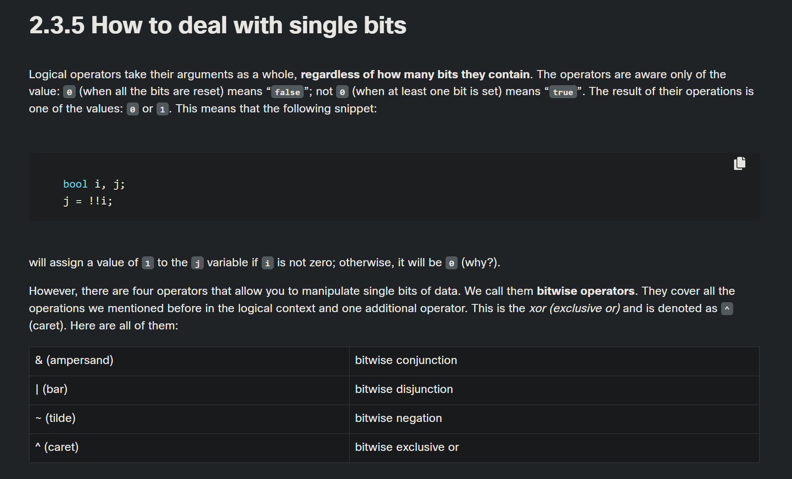

<!-- 🔗 Custom Stylesheet -->
<link rel="stylesheet" href="../../../_css/main.css">

<!-- 🖼️ Site Logo -->


# NOTES: (CIS 251 - C++ Programming)

> This file represents my notes taken while cramming to finish the coursework so I can get my module 3 badge

# 🧩 CPPE1: Module ?: ???

## 📖 2.3.

### 🟣 2.3.5 How to deal with single bits



Logical operators take their arguments as a whole, **regardless of how many bits they contain**. The operators are aware only of the value: 0 (when all the bits are reset) means “false”; not 0 (when at least one bit is set) means “true”. The result of their operations is one of the values: 0 or 1. This means that the following snippet:

```
bool i, j;
j = !!i;
```

will assign a value of 1 to the j variable if i is not zero; otherwise, it will be 0 (why?).

However, there are four operators that allow you to manipulate single bits of data. We call them **bitwise operators**. They cover all the operations we mentioned before in the logical context and one additional operator. This is the _xor (exclusive or)_ and is denoted as ^ (caret). Here are all of them:

|               |                      |
| ------------- | -------------------- |
| & (ampersand) | bitwise conjunction  |
| \| (bar)      | bitwise disjunction  |
| ~ (tilde)     | bitwise negation     |
| ^ (caret)     | bitwise exclusive or |

Let's make it easier:

- & requires exactly two “1s” to provide “1” as the result
- | requires at least one “1” to provide “1” as the result
- ^ requires only one “1” to provide “1” as the result
- ~ (is one argument and) requires “0” to provide “1” as the result

But take note: arguments of these operators **must be integers** (int as well as long, short or char); we must not use floats here.

The difference in the operation of the logical and bit operators is important: the logical operators do not penetrate into the bit level of its argument. They’re only interested in the final integer value.

Bitwise operators are stricter: **they deal with every bit separately**. If we assume that the int variable occupies 32 bits, you can imagine the bitwise operation as a 32-fold evaluation of the logical operator for each pair of bits of the arguments. Obviously, this analogy is somewhat imperfect, as in the real world all these 32 operations are performed at the same time.

|      |       |            |             |            |
| ---- | ----- | ---------- | ----------- | ---------- |
| left | right | left&right | left\|right | left^right |
| 0    | 0     | 0          | 0           | 0          |
| 0    | 1     | 0          | 1           | 1          |
| 1    | 0     | 0          | 1           | 1          |
| 1    | 1     | 1          | 1           | 0          |

|     |      |
| --- | ---- |
| arg | ~arg |
| 0   | 1    |
| 1   | 0    |

Let’s have a look at an example of the difference in operation between logical and bit operations. Let’s assume that the following declaration has been performed:

```
int i = 15, j = 22;
```

Let’s have a look at an example of the difference in operation between logical and bit operations. Let’s assume that the following declaration has been performed:

```
i: 00000000000000000000000000001111
j: 00000000000000000000000000010110
```

The declaration is given:

int log = i && j;

We’re dealing with a logical conjunction. Let’s trace the course of the calculations. Both variables i and j are not zeros so will be deemed to represent “true”.

If we look at the truth table for the && operator, we can see that the result will be “true” and that it’s an integer equal to 1. This means that the bitwise image of the log variable is as follows:

log:00000000000000000000000000000001

Now the bitwise operation – here it is:

int bit = i & j;

The & operator will operate with each pair of corresponding bits separately, producing the values of the relevant bits of the result. Therefore the result is this:

bit:00000000000000000000000000000110

These bits correspond to the integer value of 6.

Let's try the negation operators now. First the logical one:

int logneg = !i;

The logneg variable will be set to 0, so its image will consist of zeros only.

The result:

logneg:00000000000000000000000000000000

The bitwise negation goes here:

int bitneg = ~i;

The result:

bitneg:11111111111111111111111111110000

It may surprise you to learn that the bitneg variable value is -16. Strange? No, not at all!

If it surprises you, try to spend some time looking into the secrets of the binary numeral system and the rules governing so-called two's complement numbers. It makes for good bedtime reading.

We can use each of the previous two-argument operators in their abbreviated forms. These are the examples of equivalent notations:

We'll now show what you can use bitwise operators for.

Imagine that you have to write an important piece of an operating system. You’ve been told that you’re to use a variable declared in the following way:

int flag_register;

The variable stores the information about various aspects of system operation. Each bit of the variable stores one yes/no value.

You’ve also been told that only one of these bits is yours – bit number three (remember that bits are numbered from 0 and bit number 0 is the lowest one, while the highest is number 31).

The remaining bits are not allowed to change because they’re intended to store other data.

Here's your bit marked with the letter “x”:

0000000000000000000000000000x000

You may face the following tasks:

#1:

Check the state of your bit – you want to find out the value of your bit; comparing the whole variable to zero will not do anything, because the remaining bits can have completely unpredictable values, but we can use the following conjunction property:

x & 1 = x
x & 0 = 0

If we apply the & operation to the flag_register variable along with the following bit image:

00000000000000000000000000001000

(note the "1" at your bit's position) we obtain one of the following bit strings as a result

00000000000000000000000000001000

if your bit was set to “1”

00000000000000000000000000000000

if your bit was reset to “0”.

A sequence of zeros and ones whose task is to grab the value or to change the selected bits is called a bitmask. Let’s try to build a bitmask to detect the state of your bit. It should point to the third bit. That bit has the weight of 23 = 8. A suitable mask could be created by the following declaration:

int the_mask = 8;

We can also make a sequence of instructions depending on the state of your bit – here it is:

if(flag_register & the_mask) {
/_ my bit is set _/
} else {
/_ my bit is reset _/
}

#2:

Reset your bit – you assign a zero to the bit while all other bits remain unchanged; we’ll use the same property of the conjunction as before, but we’ll use a slightly different mask – just like this:

1111111111111111111111111111110111

Note that the mask was created as a result of the negation of all bits of the_mask variable.

Resetting the bit is simple and looks like these (choose the one you like most):

flag_register = flag_register & ~the_mask;

flag_register &= ~the_mask;

#3:

Set your bit – you assign a “one” to your bit while all the remaining bits must remain unchanged; we’ll use the following disjunction's property:

x | 1 = 1

x | 0 = x

We’re ready to set your bit with one of the following instructions.

flag_register = flag_register | the_mask;

flag_register |= the_mask;

#4:

Negate your bit – you replace a “one” with a “zero” and a “zero” with a “one”. We’ll use an interesting property of the xor operator:

x ^ 1 = !x

x ^ 0 = x

Now let's negate your bit with the instructions:

flag_register = flag_register ^ the_mask;

flag_register ^= the_mask;

The C++ language offers us yet another operation relating to single bits: shifting. It applies only to integer values and you can’t use it with floats as arguments. You use this operation unconsciously all the time. How do you multiply any number by 10? Take a look:

12345 ∙ 10 = 123450

As you can see, multiplying by ten is in fact a shift of all the digits to the left and filling the resulting gap with a “0”. Division by 10? Let's look:

12340 ÷ 10 = 1234

Dividing by 10 is nothing more than shifting the digits to the right.

The same kind of operation is performed by the computer, but with one difference: as 2 is the base for binary numbers (not 10), shifting a value one bit to the left corresponds to multiplying it by 2; respectively, shifting one bit to the right is like dividing by 2 (notice that the right-most bit is lost).

Bit shifting can be:

logical, if all the bits of the variable are shifted; shifting takes place when you apply it to the unsigned integers;
arithmetic, if the shift omits the sign bit – in two's complement notation, the role of the sign bit is played by the highest bit of a variable; if it’s equal to "1", the value is treated as a negative; this means than the arithmetic shift cannot change the sign of the shifted value.
The shift operators in the C++ language are a pair of digraphs, << and >>, clearly suggesting in which direction the shift will act. The left argument of these operators is the integer value whose bits are shifted. The right argument determines the size of the shift. This shows that this operation is certainly not commutative.

value << bits

value >> bits

The priority of these operators is very high. You'll see them in the updated table of priorities which we’ll show you at the end of this section.

Let’s assume the following declarations exist:

int signed = -8, var_s;
unsigned unsigned = 6, var_u;

Take a look at the shifts in the editor:

```cpp
// STARTER CODE
/* equivalent to division by 2 –> var_s == -4 */
var_s = signed >> 1;

/* equivalent to multiplication by 4 –> var_s == -32 */
var_s = signed << 2;

/* equivalent to division by 4 –> var_u == 1 */
var_u = unsigned >> 2;

/* equivalent to multiplication by 2 –> var_u == 12 */
var_u = unsigned << 1;
```

Both operators can be used in the shortcut form as below:

```
signed >>= 1; /* division by 2 */
unsigned <<= 1; /* multiplication by 2 */
```

And here’s the updated priority table, containing all the operators introduced in this section.

|                                     |        |
| ----------------------------------- | ------ |
| ! ~ (type) ++ -- + -                | unary  |
| \* / %                              |        |
| \+ -                                | binary |
| << >>                               |        |
| < <= > >=                           |        |
| \== !=                              |        |
| &                                   |        |
| \|                                  |        |
| &&                                  |        |
| \|                                  |        |
| \= += -= \*= /= %= &= ^= \| >>= <<= |        |

---

10. What is the value of the following literal? -1e-1 • -0.1 • -10.0 • -1.0 • The literal is invalid. 11. What is the value of the i variable? float x = 1.0 / 4.0; int i = x; • 1 • 0 • a quarter • 0.25 12. What is the value of the x variable? float x = 1. / 2. + 2. / 4.; • 1.0 • 0.75 • 0.5
    Sign up to view the full document!

11. What is the value of the x variable? float x = 1. / 2. + 2. / 4.; • 1.0 • 0.75 •

---
