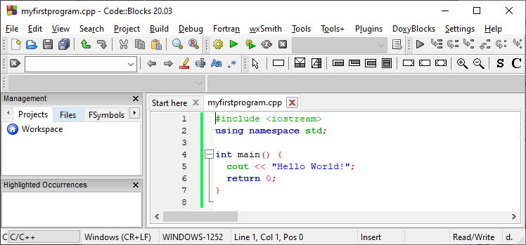

# C++ Getting Started

## Get Started With C++

At W3Schools, you can try C++ without installing anything.

Our Online C++ Editor runs directly in your browser, and shows both the code and the result:

Code:

```cpp
#include <iostream>  
using namespace std;  
  
int main() {  
  cout << "Hello World!";  
  return 0;  
}
```
Result:

`Hello World!`

[Try it Yourself »](https://www.w3schools.com/cpp/trycpp.asp?filename=demo_helloworld)

This editor will be used in the entire tutorial to demonstrate the different aspects of C++.

- - -

## Install C++

If you want to run C++ on your own computer, you need two things:

*   A text editor, like Notepad, to write C++ code
*   A compiler, like GCC, to translate the C++ code into a language that the computer will understand

There are many text editors and compilers to choose from. In the next steps, we will show you how to use an **_IDE_** that includes both.

- - -

## Install C++ IDE

An IDE (Integrated Development Environment) is used to edit AND compile the code.

Popular IDE's include Code::Blocks, Eclipse, and Visual Studio. These are all free, and they can be used to both edit and debug C++ code.

**Note:** Web-based IDE's can work as well, but functionality is limited.

We will use **Code::Blocks** in our tutorial, which we believe is a good place to start.

You can find the latest version of Codeblocks at [http://www.codeblocks.org/](https://www.codeblocks.org/downloads/binaries/). Download the `mingw-setup.exe` file, which will install the text editor with a compiler.

- - -

## C++ Quickstart

Let's create our first C++ file.

Open Codeblocks and go to **File > New > Empty File**.

Write the following C++ code and save the file as `myfirstprogram.cpp` (**File > Save File as**):

#### myfirstprogram.cpp

```cpp
#include <iostream>  
using namespace std;  
  
int main() {  
  cout << "Hello World!";  
  return 0;  
}
```

Don't worry if you don't understand the code above - we will discuss it in detail in later chapters. For now, focus on how to run the code.

In Codeblocks, it should look like this:



Then, go to **Build > Build and Run** to run (execute) the program. The result will look something to this:

`Hello World!   Process returned 0 (0x0) execution time : 0.011 s   Press any key to continue.`

**Congratulations**! You have now written and executed your first C++ program.
