<!-- 🔗 Custom Stylesheet -->
<link rel="stylesheet" href="../../../_css/main.css">

<!-- 🖼️ Site Logo -->


# NOTES: Week 2 (CIS 251 - C++ Programming)

# 🧩 CPPE1: Welcome to C++ Essentials 1

## 🟣 Understanding Course Structure and Certification Opportunities

### About C++ Essentials 1

The **C++ Essentials 1** course (CPPE1) offers a comprehensive exploration of the C++ programming language, covering fundamental programming techniques, conventions, and terminology, as well as commonly used library functions. Throughout this course, your primary objective is to develop a robust understanding of fundamental computer programming concepts and tools. You'll delve into C++ syntax, semantics, and critical programming concepts such as **data types, control flow mechanisms, pointers, functions, memory management, objects, and exceptions handling in C++**.

The course is divided into four modules. You have access to study resources, quizzes, and hand-on labs to apply your skills and knowledge to real programming tasks and situations.

Geared towards beginners, C++ Essentials 1 requires **no prior programming knowledge**, making it accessible to anyone interested in learning C++. Upon completion, you will be well-prepared to pursue the [CPE – C++ Certified Entry-Level Programmer](https://cppinstitute.org/cpe) qualification offered by the C++ Institute.


---

### Syllabus and Course Structure

#### Welcome to C++ Essentials 1

*   Understanding Course Structure and Certification Opportunities
*   Getting Started with C++ Programming

#### Module 1: Intro to Programming and Basics of C++

*   Differentiating between machine and high-level languages
*   Understanding machine code and compilation
*   Working with variables, integers, and characters
*   Utilizing comments in code
*   Basics of flow control
*   Dealing with streams and basic I/O operations
*   Writing simple programs
*   Module 1 Test

#### Module 2: Control Structures and Data Types in C++

*   Controlling program flow
*   Exploring more data types
*   Conditional instructions: if, else, switch
*   Understanding loops and controlling loop execution
*   Working with logic, bitwise, and arithmetic operators
*   Introduction to vectors and multidimensional arrays
*   Declaring and initializing structures
*   Module 2 Test

#### Module 3: Functions, Pointers, and Memory Management

*   Designing, declaring, and invoking functions
*   Understanding pointers and their usage
*   Different methods of passing parameters and their purpose
*   Working with default parameters and inline functions
*   Understanding overloaded functions
*   Sorting data
*   Managing memory dynamically
*   Module 3 Test

#### Module 4: Advanced Data Handling and Exception Handling in C++

*   Understanding arrays of pointers
*   Working with conversions
*   Manipulating strings: declarations, initializations, assignments
*   Utilizing strings as examples of objects: methods and properties
*   Declaring and using namespaces
*   Handling exceptions in code
*   Module 4 Test

#### Course Completion

*   C Essentials 2 – Final Test (Score 70% or more to qualify for a 20% discount on the CPE exam)
*   Become CPE certified (Paid Option)

---

### Certification

C++ Essentials 1 is designed to prepare you for the [CPE – C++ Certified Entry-Level Programmer](https://cppinstitute.org/cpe) certification.

The CPE certification is a professional credential that assesses your ability to complete coding tasks related to essential programming concepts in the C++ language. Candidates are expected to demonstrate sufficient knowledge of universal programming concepts, C language syntax and semantics, including data types, flow control, arrays, pointers, memory management, and structures.

Additionally, candidates must exhibit proficiency in fundamental programming techniques specific to C++, as well as the use of basic standard library functions.

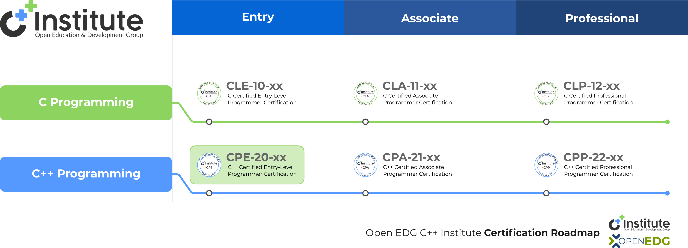

The CPE certification demonstrates your proficiency in fundamental programming concepts essential for entry-level C++ programmers, laying a strong groundwork for pursuing roles in beginner-level C++ programming positions.

Are you ready to begin your journey into the world of C++ programming? Click "Next" and let's get started. See you on the inside!

---

## 🟣 Getting Started with C++ Programming

### Where to begin?

Every creative activity needs tools, and programming is no exception. In its simplest (not to say the most primitive) form, programming requires a sheet of paper and a pencil.

Of course, we’re not going to practice programming like this – it would be quite good practice for writing raw code, but it’s impossible to run and quite impractical. As running the code is the only method of finding out whether it’s correct, programming requires a computer equipped with some additional tools.

In this section, we’ll show you some ways of using your computer as a developer's workstation.

However, don't forget that there are many factors affecting actions that must (or mustn’t) be performed: hardware platform, operating system, operating system version, etc. We don’t know your system, so our guide is general. We’ll show you the direction – you’ll have to find solutions yourself.

All our recommendations need internet access, whether it's just for a short time or throughout. You'll either have to download installation files from the product websites, or use some of the tools that are only available online. Unfortunately, there's no way around this.

Interestingly, you can run all our programs and examples using just a basic text editor and command-line compiler tools, without needing any special software.

However, we advise against this approach. Instead, we suggest using specific applications that bring together a variety of tools in one convenient place.

We generally recommend two approaches:

- Using IDEs installed on your computer, and
- using online tools.

The good news for you is that we've developed Edube Interactive, an online programming environment integrated directly into the course.

This lets you start coding right away without any installations. It's a handy online IDE designed specifically for this course.

But before we dive deeper into Edube Interactive, let's understand what an IDE is and look at some popular ones, in case you're considering installing additional software locally.


---


### What is IDE?

IDE (Integrated Development Environment) is **a software application that typically consists of a code editor, a compiler, a debugger, and a graphical user interface (GUI) builder**.

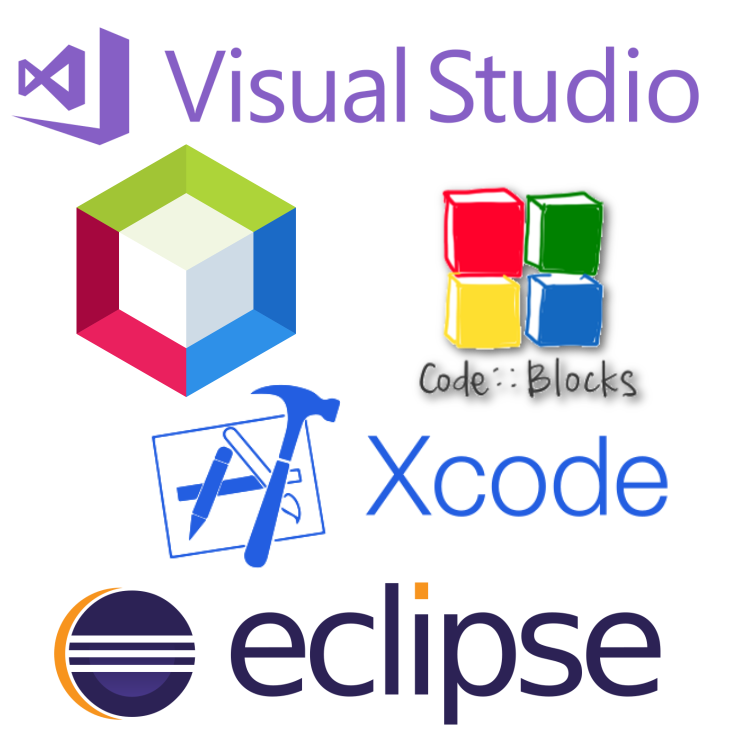

Programming with an IDE has many advantages: you get a toolkit containing everything you may need. Real programmers usually use an IDE too. An IDE gives you a comfortable desk equipped with all means, supplies and aids.

There are some disadvantages, too. Comfortable desks usually weigh a lot. So do IDEs. They may consume a lot of resources and, frankly speaking, you probably don’t need most of the functions they can perform.

Using on-line tools allows you to write, store and run your code without installing anything. Imagine it as a simplified IDE accessible remotely via the Internet. That means that you need two things: an Internet browser and Internet access.

If you can try both approaches, then choose the one that’s more convenient for you. If you can't – choose the one you can use.

### Choose your IDE

There are many IDEs on the market, both free and not free. To get a rough idea of how big the list of integrated development environments for the C language is, you can visit this [Wikipedia page](https://en.wikipedia.org/wiki/Comparison_of_integrated_development_environments#C.2FC.2B.2B).

We wrote and tested all our examples with NetBeans and Edube Interactive (EI). It doesn't mean that we think NetBeans and EI are the best. It may be that other products are more in line with your tastes and habits, so you don’t need to follow our path. Feel free to make your own decisions. However, please be aware that very few of the exercises in this course may be **preconfigured for NetBeans and EI**.

For this reason, you need to remember that some practical elements of the course might not work in some other IDEs the way we intended them to work.

We want to show you 5 sample IDEs. Again, this doesn’t mean that we think they’re better than the others – they may be more popular than many others, or we do actually like them for various reasons (not all technical reasons). Here they are:

  

## Microsoft © Visual Studio Express ®

A single-platform development environment designed especially for building C/C++ programs, both under and for the MS Windows operating system.

*   home site: [https://www.visualstudio.com](https://www.visualstudio.com)
*   downloads: [https://visualstudio.microsoft.com/free-developer-offers/](https://visualstudio.microsoft.com/free-developer-offers/)
*   license: proprietary, but limited free version named Visual Studio Community is available for download; registration required.


## Eclipse

Multi-platform development environment designed especially for Java. C programming possible without additional configuration (dedicated C/C++ version available for download).

*   home site: [https://eclipse.org](https://eclipse.org)
*   downloads: [https://www.eclipse.org/downloads](https://www.eclipse.org/downloads)
*   license: Eclipse Public License (free and open).


## NetBeans

Multi-platform development environment designed especially for Java. C programming possible without additional configuration (dedicated C/C++ version available for download).

*   home site: [https://netbeans.org](https://netbeans.org)
*   downloads: [https://netbeans.apache.org/front/main/download/index.html](https://netbeans.apache.org/front/main/download/index.html)
*   license: Common Development and Distribution License or GNU Public License version 2 (free and open).

## Code::Blocks

Multi-platform development environment designed for C/C++ programming. Default Windows installer does not include C compiler - use the one containing “mingw-setup” inside the file name instead.

*   home site: [https://www.codeblocks.org/](https://www.codeblocks.org/)
*   downloads: [https://www.codeblocks.org/downloads/binaries/](https://www.codeblocks.org/downloads/binaries/)
*   license: GNU Public License version 3 (free and open).


## XCode

Single-platform development environment designed especially for building applications for operating systems designed by Apple Inc. Programming in C fully available.

*   home site: [https://developer.apple.com/xcode/](https://developer.apple.com/xcode/)
*   downloads: [https://apps.apple.com/us/app/xcode/id497799835?mt=12/](https://apps.apple.com/us/app/xcode/id497799835?mt=12/)
*   license: proprietary but free for Max OS X users; integrated with OS X and preinstalled.


Unfortunately, we can’t provide any support in the installation and/or use of any IDE, either for the ones we mentioned and the ones we didn’t mention. If you run into problems, seek help from vendor of your software or (recommended) from other users of the particular product. There are many available sources: FAQs, forums, help-desks, communities, knowledge bases, etc. It’s unlikely that your problem hasn’t already happened to somebody else, and if it has, it’s very likely that it was solved. Search for solutions and you’ll find them.

If you’re a **Linux user**, try to use your primary system tools to download and install an IDE. If you use any other OS, search for a complete native installation package.


---

### Online Tools


To get started with programming, you don't have to install anything. If you're reading this, you (most likely) have a working Internet browser and an active Internet connection. This means that you can use one of the sites below and start programming immediately – just like that.

#### Ideone

The first one is named **ideone** available at [http://ideone.com](http://ideone.com "http://ideone.com"). Although you don’t need to register to start your work, we suggest that you do – it’ll enable some additional, valuable features.

Signing up is easy – certainly not more difficult than the registration on the S4A website. You can also use your Facebook account to sign into ideone – it’ll make the whole process even faster and more convenient.

After signing in, you’ll have to do some customizing, and two things are essential: change your default programming language to "C++" (don't forget to do that) and then enable syntax highlighting – it’ll make it easier to do your work.

To test the Ideone environment, go to the "new code" tab and just copy-and-paste the text in the editor.

```cpp
#include <iostream>

using namespace std;
int main(void) {
    cout << "It's working\n" << endl;
}
```

Next click the "Ideone it" button. Text saying "It's working" should appear almost immediately in the stdout field – this means that your source code has been happily compiled and run.

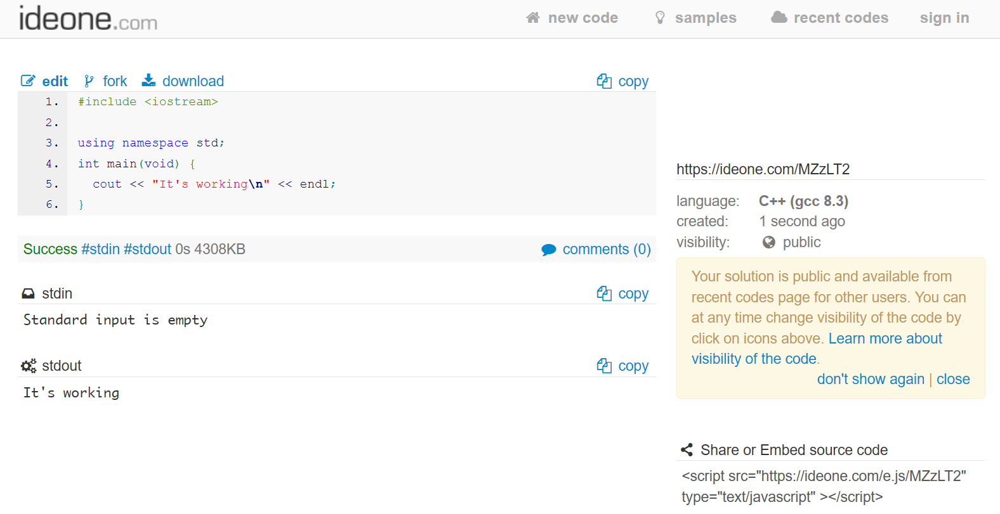

Easy? Easy! But... there’s one catch: you’re not allowed to send more than 1000 submissions a month. We don't think that’s really going to affect you, though.

Something important: if your program reads any data from a user, you’ll have to prepare the data inside the stdin field before the code is run (normally the process of reading input is interactive). Check out [http://ideone.com/faq](http://ideone.com/faq "http://ideone.com/faq") for more details.


#### CPP.SH

Another online tool with similar functionality is **C++ shell**, accessible at [http://cpp.sh/](http://cpp.sh/ "http://cpp.sh/").

Unlike ideone, C++ shell does not require registration and operates on similar principles. However, it lacks some features such as the ability to save or publish your code.

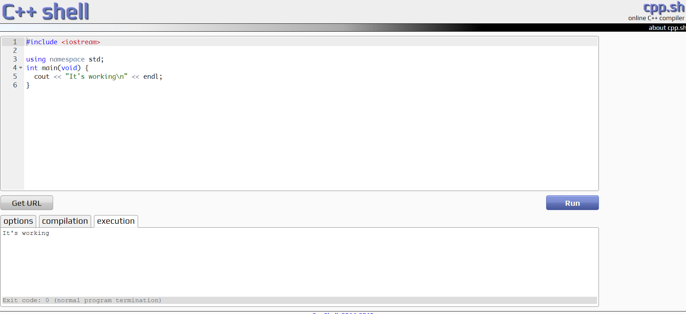

It doesn't include any support, but to tell you the truth, it’s so simple to use that you actually don’t need any help.

Okay, now it's time to start learning some real programming.


#### Edube Interactive (EI): Your In-Course Tool

As mentioned before, **there's no need for you to install anything**. For all coding practice and experiments, Edube Interactive is at your service, directly within the course.

This interactive online environment is tailored specifically for this course, offering a browser-based sandbox for C++ programming. It lets you run and test code, as well as carry out lab exercises designed to enhance your learning experience.

Click the triangular "Run" button and observe the outcome.

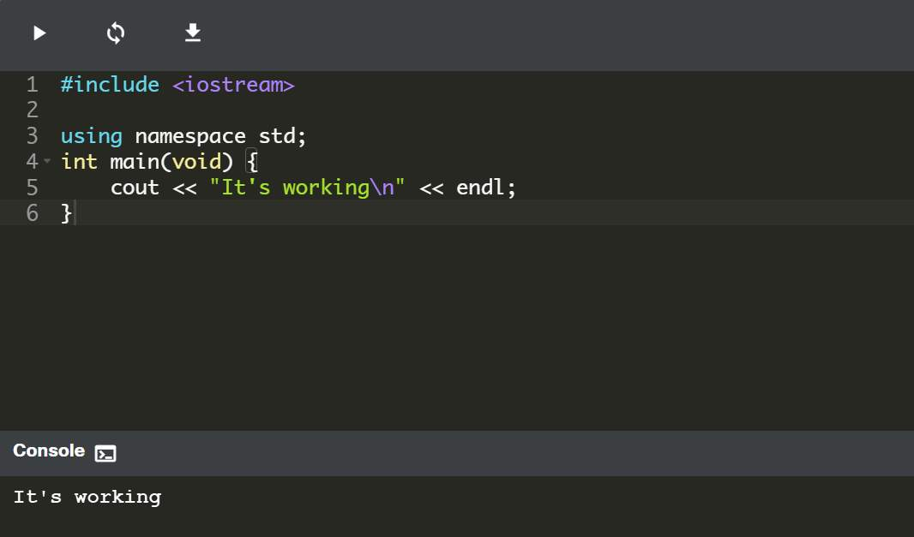

In the _Console_ window, you should be able to see the following output:

```sh
It's working
```

which indicates that the code in the editor has been successfully compiled. Congratulations!

We hope you'll appreciate its flexibility and lightweight format as you progress through the course. Ready to dive into some real coding?


---


## 🟣 1.1 Beginning the Coding Adventure: Your First Program

### 🟢 1.1.1 Writing you first program

**Lazy Function**

We can even create a function that is lazy – it can be encoded like this:

```cpp
void lazy(void) { }
```

This drone provides no result (the first void), its name is "lazy", it doesn't take any parameters (the second void) and it does absolutely nothing (the blank space between brackets).

---

> - each statement) in C++ must end with a semicolon – without it the program will be incorrect.


---

### 🧪 1.1.2 LAB Your First Program

## Objectives

Familiarize the student with:

*   explaining how an existing C++ program works;
*   discovering and fixing basic syntax errors;
*   the concept of include and using directives;
*   modifying the structure of a C++ program.

## Scenario

We strongly encourage you to play (yes, to play!) with your first program and make some (maybe even destructive) amendments. Feel free to modify any part of the code, but there is one condition – learn from your mistakes and draw your own conclusions!

Try to:

*   add a greeting – let the program welcome you in a warm and pleasant way;
*   duplicate (or triplicate) the greeting to welcome more than one person;
*   insert a line saying `cout << endl`; between two other couts and check the effects it has; does it look interesting? You're going to learn more about it soon;
*   now try to insert a mysteriously-looking sequence of chars into any of the greeting: `\n` – there are exactly two characters: a backslash and lower-case n; what happens now?;
*   try to remove any of the semicolons and look carefully at the compiler's response; pay attention to where the compiler sees an error – is this where the error really is?
*   change the name of the `main` function to any other lexically correct word (e.g. Main); what happens now? Can you explain the result?
*   remove some of the quotes (opening and closing ones respectively); does the compiler like that? What does it think of your actions?


- **`cout << endl;`**: Adds a blank carriage return between lines

---

## 🟣 The Basics of Integers and Variables

### 🟢 1.2.2 A variable is a variable

  

Let's start with the issues connected with a variable’s name.

Variables don’t magically appear in our program. We (as developers) decide how many, and which variables, we want to have in our program. We also **give them their names**, almost becoming their godparents. If you want to give a name to the variable, you have to follow some strict rules:

*   the name of the variable must be composed of **upper-case or lower-case Latin letters, digits and the character** \_ (_underscore_);
*   the name of the variable must **begin with a letter**;
*   the **underline character is a letter** (strange but true);
*   upper- and lower-case letters are treated as **different** (a little differently than in the real world – Alice and ALICE are the same given names but they are two different variable names, consequently, two different variables);

These same restrictions apply to all entity names used in C++.

The standard of the C++ language does not impose restrictions on the length of variable names, but a specific compiler may have a different opinion on this matter. Don't worry; usually the limitation is so high that it’s unlikely you would actually want to use such long variable names (or functions).

  

Here are some correct, but not always convenient variable names:

*   variable
*   i
*   t10
*   Exchange\_Rate
*   counter
*   DaysToTheEndOfTheWorld
*   TheNameOfAVariableWhichIsSoLongThatYouWillNotBeAbleToWriteItWithoutMistakes
*   \_

The last name may be ridiculous from your perspective, but your compiler thinks it’s just great.

And now some incorrect names:

*   10t (does not begin with a letter)
*   Adiós\_Señora (contains illegal characters)
*   Exchange Rate (contains a space)

You can find more information about C++ naming style and conventions in the [C++ Core Guidelines](http://isocpp.github.io/CppCoreGuidelines/CppCoreGuidelines#nl8-use-a-consistent-naming-style).


The **type** is an **attribute** that uniquely defines which values can be stored inside the variable. We’ve already encountered the integer (int) and floating point (_float_) types. The value of a variable is what we have put into it. Of course, you can only enter a value that is compatible with the variable’s type. Only an integer value can be assigned to an integer variable (or in other words, to a variable of type int). The compiler will not allow us to enter a floating-point number here.

Let's talk now about two important things – how the variables are created and how to enter a value inside them (or rather – how to give them a value).

The variable exists as a result of a **declaration**. A declaration is a syntactic structure that binds a name provided by the programmer with a specific type offered by the C++ language. The construction of such a declaration (or the declaration syntax) is simple: just use the name of the desired type, then the variable name (or variable names separated by commas if there are more than one). The whole statement ends with a semicolon.

---


### 🟢 1.2.4 Comments on the Comments

**Example of a file header comment:**

```cpp
/* ************************************************************
    Counting sheep version 1.1
    Author: Ronald Sleepyhead, 2024
    email: rs@insomnia.org

    Changes:
    2024-03-03: Ginny Drowsy: Counting black sheep improved
 ************************************************************ */
```

  

Note that, despite the complicated structure and the multitude of stars, the condition stating how the comment should be started and finished is fully met.

Comments may be **useful** in another respect - you can use them **to mark a piece of code that you currently don’t need** for whatever reason. We often do this during the testing of the program in order to isolate the place where an error could be hidden.

We’ve just got one more thing to say about comments. Compilers differ in assessing whether another comment may be placed within a single comment. Consider the following program:

```cpp
/* int i; /* int j; */ int k; */
```

The question is: are you allowed to nest one block comment (like `/* int j; */`) inside another block comment?

The answer is ***no***.

You can’t use such a construction in your code.


---

### 🧪 1.2.5 LAB Comments: are they always useful?

## Level of difficulty

Easy

## Objectives

Familiarize the student with:

*   using comments;
*   when not to use comments;
*   how to replace comments with code.

## Scenario

Comments are not always the best way to say something in code. Sometimes it's much better to leave some information in the code.

In the worst-case scenario, comments can lie to the user/programmer (you should never do that on purpose).

It's good to use readable variable names, and sometimes it's better to divide your code into named pieces (later we'll call these pieces functions).

In some situations, it's a good idea to write the steps of computations in a clearer way.

The code below contains some of these situations. Try to improve it (and remove the comments – removing the comments will sometimes be an improvement itself).

**Starting Code:**

```cpp
#include <iostream>//we included iostream
#include <iomanip>//we included iomanip
#include <string>//we included string

int main()
{
  int v=10800; // 3*60*60
  
  int zzz=3*60;// This is a variable to hold the value of 3 minutes in seconds

  int zzz=5*60;// This is a variable to hold the value of 6 minutes in seconds
  
  float siii=3.141526; //This is the value of pi
  
  
  //std::cout << "result:  " << result <<  std::endl;
  // here we should print the v value but a programmer didn't have time to write any code
  // but he/she likes writing long comments
}
```

---

### 🟢 1.3.15 Increment and decrement operators
  
```cpp
variable++

variable--
```

Return the original (unchanged) variable's value and then increment/decrement the variable by 1.

This behavior justifies the presence of the prefix _pre-_ (before) and _post-_ (after) in the operators’ names: _pre-_ because the variable is modified **first** and then its value is **used**; _post-_ because the variable's value is **used** and then **modified**.


---

### 🟢 1.3.16 Pre-and post-operators and their priorities

#ERIC_WEAK

```cpp
int i, j;

i = 1;
j = i++;
```

First, the variable i is set to 1. In the second statement, we’ll see the following steps:

*   the value of i will be taken (as we use the _post-incrementation_);
*   the variable i will be increased by 1.

In effect, j will receive the value of 1 and i the value of 2.

Things go a bit differently here.

```cpp
int i, j;

i = 1;
j = ++i;
```

  

The variable i is assigned with the value of 1; next, the i variable is incremented and is equal to 2; next, the increased value is assigned to the j variable.

In effect, both i and j will be equal to 2.


Look carefully at this program. Let’s trace its execution step by step.

```cpp
int i, j;

i = 4;
j = 2 * i++;
i = 2 * --j;
```

1.  The i variable is assigned the value of 4;
2.  We take the original value of i (4), multiply it by 2, assign the result (8) to j and eventually (post-)increment the i variable (it equals 5 now);
3.  We (pre-)decrement the value of j (it equals 7 now); this reduced value is taken and multiplied by 2 and the result (14) is assigned to the variable i.

What else do you need to know about the new operators? Firstly, their priority is quite high – higher than the "*", "/" and "%" operators. Secondly, their binding depends on whether you use the prefix or postfix version. The prefix version operators have a right-to-left binding, while the postfix operators bind from left to right.

Our priority table now reads as follows:

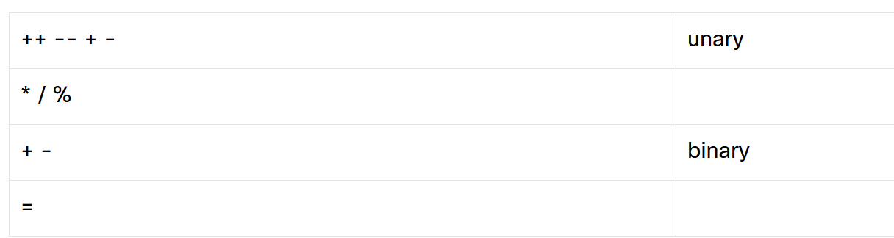


---

### 🟢 1.3.17 Shortcut operators

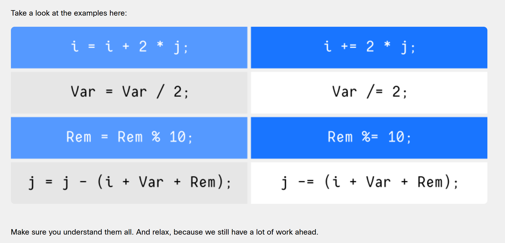


---

### 🧪 1.3.18   LAB   Parentheses

## Level of difficulty

Easy

## Objectives

Familiarize the student with:

*   the order of operations;
*   the use of parentheses to change the order of operations.

## Scenario

Add some parentheses (none, one or two pairs) in the code below to get the expected results. Try to do this before you run the program.

```sh
result: 6 expected result : 6
result: 24 expected result : 24
result: 6 expected result : 6
result: 32 expected result : 32
result: 0 expected result : 0
```

**Starting Code:**

```cpp
#include <iostream>
#include <iomanip>
#include <string>

int main()
{
  float v=2;
  float result = v + 1 * 2;
  std::cout << "result:  " << result <<  "  expected result :  6" << std::endl;
  result = v + 1 * v + 2 * 2;
  std::cout << "result: " << result <<  "  expected result : 24" << std::endl;
  result = v - 1 * 2 + 2 * 2;
  std::cout << "result:  " << result <<  "  expected result :  6" << std::endl;
  result = v + v * v + v * 2;
  std::cout << "result: " << result <<  "  expected result : 32" << std::endl;
  result = (int)v % 2 * v + 2 * 2;
  std::cout << "result:  " << result <<  "  expected result :  0" << std::endl;
}
```


**Eric's Answer:** #CORRECT

```cpp
#include <iostream>
#include <iomanip>
#include <string>

int main()
{
  float v=2;
  float result = (v + 1) * 2;
  std::cout << "result:  " << result <<  "  expected result :  6" << std::endl;
  result = (v + 1) * (v + 2) * 2;
  std::cout << "result: " << result <<  "  expected result : 24" << std::endl;
  result = (v - 1) * 2 + (2 * 2);
  std::cout << "result:  " << result <<  "  expected result :  6" << std::endl;
  result = (v + v) * (v + v) * 2;
  std::cout << "result: " << result <<  "  expected result : 32" << std::endl;
  result = ((int)v % 2) * (v + 2 * 2);
  std::cout << "result:  " << result <<  "  expected result :  0" << std::endl;
}
```

---

### 🧪 1.3.19   LAB   Floats: operators and expressions

## Objectives

Familiarize the student with:

*   the concept of integers, floating-point numbers, operators and arithmetic operations in C++ programming;
*   understanding the precedence and associativity of C++ operators as well as the proper use of parentheses;
*   performing basic calculations.

## Scenario

Take a look at the code in the editor - it reads a float value, puts it into a variable named _x_ and prints the value of a variable named _y_. Your task is to complete the code in order to evaluate the following expression:

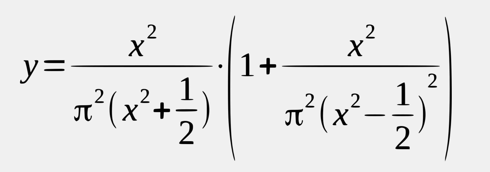

We expect the result to be assigned to _y_.

Note: we've prepared a variable containing the value of π. Use it.

Be careful! Watch the operators and keep their priorities in mind. Remember that classical algebraic notation likes to omit the multiplication operator – you need to use it explicitly.

Don't hesitate to use as many parentheses as you need. Keep your code clean and readable – surround the operators with spaces.

Use additional variables to shorten the expression.

Hint: multiply _x_ by _x_ to get _x_ squared.

Test your code by using the data we've provided – don't be discouraged by any initial failures. Be persistent and inquisitive. Good luck!

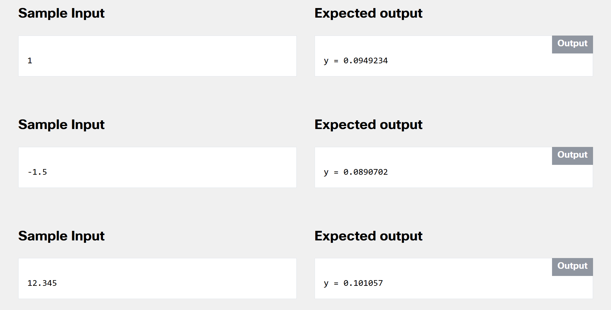

**Starting Code:**

```cpp
#include <iostream>

using namespace std;

int main(void) {
	float pi = 3.14159265359;
	float x,y;

	cout << "Enter value for x: ";
	cin >> x;

	// put your code here
	
	cout << "y = " << y;
	return 0;
}
```

> Be persistent and inquisitive.

**Eric's Answer:**

```cpp
/* ************************************************************
    1.3.19 LAB Floats: operators and expressions
    Student: Eric Hepperle
    Created: 2026-08-29

    GitHub: https://github.com/codewizard13
    email: codewizard13@gmail.com
 ************************************************************ */
#include <iostream>
using namespace std;

int main(void) {
	float pi = 3.14159265359;
	float x,y;

	cout << "Enter value for x: ";
	cin >> x;
	
	float x_squared = x*x;
	float pi_squared = pi*pi;

	// put your code here
	float right_den = pi_squared * ((x_squared - (1.0f/2.0f))*(x_squared - (1.0f/2.0f)));
	float right = 1.0f + (x_squared/right_den);
	float left = x_squared / (pi_squared * (x_squared + (1.0f/2.0f)));

	y = left * right;
	
	cout << "y = " << y;

	return 0;
}
```

### #LESSONS_LEARNED 🧠:

> - ⚠️ #GOTCHA: Even though I declared all my variables as `floats`, when I just left the `1/2` as integers, the numbers didn't turn out right. I used Perplexity to help troubleshoot, and learned that you have to pseudo-cast literal ints as floats by adding the `f` prefix onto the end. I had read about that in a previous lesson, but didn't really fully understand the application until I ran into this issue.
>
> - Now I understand that whenever you have an int used in a float calculation, you must write the int as a decimal and append the `f` (ex: `1` should be `1.0f`)
(Ref: https://www.perplexity.ai/computer/tasks/94ca1dd6-4166-48b9-a790-7db3abd63769)

---

### 🧪 1.3.20   LAB   Ints: operators and expressions


## Level of difficulty

Easy

## Objectives

Familiarize the student with:

*   shortcut and pre/post increment/decrement operators;
*   building simple expressions;
*   translating verbal description into programming language;
*   testing code using known input and output data.

## Scenario

Take a look at the code below: it reads two integer values, manipulates them and finally outputs the _k_ variable. The problem is that the manipulations have been described using natural language, so the code is completely useless now.

We want you to act as an intelligent (naturally!) compiler and to translate the formula into real C++ notation. Try to use pre/post and short-cut operators – they fit perfectly into some of the steps.

Test your code using the data we've provided.

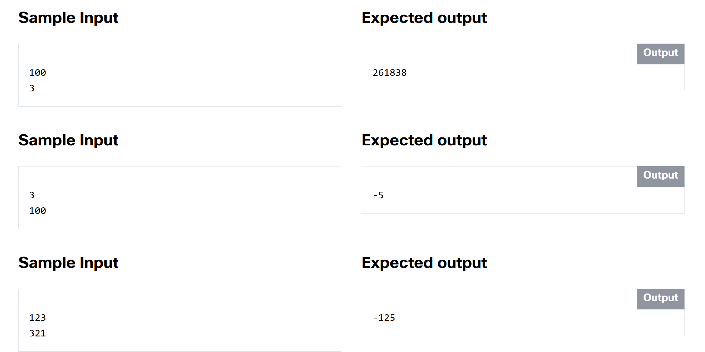


**Starting Code:**

```cpp
#include <iostream>

using namespace std;

int main(void) {
	int i, j, k;
	
	cout << "Enter i: ";
	cin >> i;
	cout << "Enter j: ";
	cin >> j;
	
	// increment i by 2
	// decrement j by i
	// divide i by j giving k
	// increment k by k
	// decrement k by 1
	// assign k modulo i to j
	// increment k by k added to i
	// increment k by k divided by j
	// assign k times k times k to k
	// increment k by i times j
	
	cout << k;
	return 0;
}
```


**Eric's Answer:**

```cpp
/* ************************************************************
    1.3.20 LAB Ints: operators and expressions
    Student: Eric Hepperle
    Created: 2026-08-29

    GitHub: https://github.com/codewizard13
    email: codewizard13@gmail.com
 ************************************************************ */
#include <iostream>
using namespace std;

int main(void) {
	int i, j, k;
	
	cout << "Enter i: ";
	cin >> i;
	cout << "Enter j: ";
	cin >> j;

    // // DEBUGGING: Fixed i, j values
    // i = 100;
    // j = 3;
	
	// increment i by 2
    i += 2;

    cout << "i += 2: " << i << endl;

	// decrement j by i
    j -= i;

    cout << "j -= i: " << j << endl;

	// divide i by j giving k
    k = i/j;

    cout << "k = i/j: " << k << endl;

	// increment k by k
    k += k;

	// decrement k by 1
    k--;

	// assign k modulo i to j
    j = k % i;

	// increment k by k added to i
    k += k + i;

	// increment k by k divided by j
    k += k/j;

	// assign k times k times k to k
    k = k * k * k;

	// increment k by i times j
    k += i * j;
	
	cout << "k = " << k << endl;
	return 0;
}
```

### #LESSONS_LEARNED 🧠:

> - ⚠️ #GOTCHA: By not putting `endl` or `\n` at the end of console out statement, it ended up "gluing" the correct 101 value i after the first increment to the incorrect value of k, but it was listing it as the `i` value. I cleared this issue up by adding the `endl` to the end of my debugging line outputting the `i` value. Then I added a label `k = ` to front of the k value for extra clarity and user-friendliness.
>
> - ⚠️ #GOTCHA: I was too eager to use shortcut operators as much as possible, I missed some important instruction discrepancies that skewed my k value by a lot. Eg, I interpreted the instruct5ion `increment k by k added to i` as `k += i`, but the correct **expression** was `k += k + i`. Once I knew that, I was able to understand and interpret what the code should be for the other two statements that I'd broken. BONUS: As a troubleshooting step I even created a truth table in Google Sheets and it was also producing wrong output, so at that point, I asked Perplexity for help. Once he located the first issue, I was able to solve the rest.


---


## 🟣 1.4 Characters: Handling Textual Data in C++

> - **word:** string of characters (letters, numbers, punctuation marks, etc.)


> - 📌 #TIP: in the C++ language **all strings are treated as arrays**.

> - **char:** the character (single) data type


---

### 🟢 1.4.2 ASCII code

**Computers store characters as numbers**. Every character used by a computer corresponds to a unique number, and vice versa. This system of assignments includes more characters than you would probably expect. Many of them are invisible to humans but essential for computers. Some of these characters are called **white spaces**, while others are named **control characters**, because their purpose is to **control** the input/output devices. An example of a white space that is completely invisible to the naked eye is a special code, or a pair of codes (different operating systems may treat this issue differently), which are used to mark the ends of lines inside text files. People don’t see this sign (or these signs), but they can see their effect where the lines are broken.

We can create virtually any number of assignments, but a world in which each computer type uses different character encoding would be extremely inconvenient. This has created a need to introduce a universal and widely accepted standard implemented by (almost) all computers and operating systems all over the world. **ASCII** (which is a short for _American Standard Code for Information Interchange_) is the most widely used system in the world, and it’s safe to assume that nearly all modern devices (like computers, printers, mobile phones, tablets, etc.) use this code. The code provides space for 256 different characters, but we’re only interested in the first 128. If you want to see how the code is constructed, go to the table on the right.

  

Look at it carefully – there are some interesting facts about it that you might notice. We'll show you one. Do you see what the code of the most common character is – the space? Yes – it’s 32. Now look at what the code of the lower-case letter “a” is. It’s 97, right? And now let's find the upper-case “A”. Its code is 65. What’s the difference between the code of “a” and “A”? It’s 32. Yes, that's the code of a space. We’ll use that interesting feature of the ASCII code soon.

Also, note that the letters are arranged in **the same order** as in the **Latin alphabet**.

By the way, ASCII code is being superseded (or rather extended) by a new international standard named UNICODE.

Fortunately, the ASCII set is a [UNICODE](https://en.wikipedia.org/wiki/Unicode "UNICODE") subset. UNICODE is able to represent virtually all characters used throughout the world. We’ll spend a little more time on this later.

  

|     |     |     |     |     |     |     |     |     |     |     |     |     |     |     |     |
| --- | --- | --- | --- | --- | --- | --- | --- | --- | --- | --- | --- | --- | --- | --- | --- |
| Character | Dec | Hex |     | Character | Dec | Hex |     | Character | Dec | Hex |     | Character | Dec | Hex |     |
| (NUL) | 0   | 0   |     | (space) | 32  | 20  |     | @   | 64  | 40  |     | \`  | 96  | 60  |
| (SOH) | 1   | 1   |     | !   | 33  | 21  |     | A   | 65  | 41  |     | a   | 97  | 61  |
| (STX) | 2   | 2   |     | "   | 34  | 22  |     | B   | 66  | 42  |     | b   | 98  | 62  |
| (ETX) | 3   | 3   |     | #   | 35  | 23  |     | C   | 67  | 43  |     | c   | 99  | 63  |
| (EOT) | 4   | 4   |     | ($) | 36  | 24  |     | D   | 68  | 44  |     | d   | 100 | 64  |
| (ENQ) | 5   | 5   |     | %   | 37  | 25  |     | E   | 69  | 45  |     | e   | 101 | 65  |
| (ACK) | 6   | 6   |     | &   | 38  | 26  |     | F   | 70  | 46  |     | f   | 102 | 66  |
| (BEL) | 7   | 7   |     | '   | 39  | 27  |     | G   | 71  | 47  |     | g   | 103 | 67  |
| (BS) | 8   | 8   |     | (   | 40  | 28  |     | H   | 72  | 48  |     | h   | 104 | 68  |
| (HT) | 9   | 9   |     | )   | 41  | 29  |     | I   | 73  | 49  |     | i   | 105 | 69  |
| (LF) | 10  | 0A  |     | \*  | 42  | 2A  |     | J   | 74  | 4A  |     | j   | 106 | 6A  |
| (VT) | 11  | 0B  |     | +   | 43  | 2B  |     | K   | 75  | 4B  |     | k   | 107 | 6B  |
| (FF) | 12  | 0C  |     | ,   | 44  | 2C  |     | L   | 76  | 4C  |     | l   | 108 | 6C  |
| (CR) | 13  | 0D  |     | \-  | 45  | 2D  |     | M   | 77  | 4D  |     | m   | 109 | 6D  |
| (SO) | 14  | 0E  |     | .   | 46  | 2E  |     | N   | 78  | 4E  |     | n   | 110 | 6E  |
| (SI) | 15  | 0F  |     | /   | 47  | 2F  |     | O   | 79  | 4F  |     | o   | 111 | 6F  |
| (DLE) | 16  | 10  |     | 0   | 48  | 30  |     | P   | 80  | 50  |     | p   | 112 | 70  |
| (DC1) | 17  | 11  |     | 1   | 49  | 31  |     | Q   | 81  | 51  |     | q   | 113 | 71  |
| (DC2) | 18  | 12  |     | 2   | 50  | 32  |     | R   | 82  | 52  |     | r   | 114 | 72  |
| (DC3) | 19  | 13  |     | 3   | 51  | 33  |     | S   | 83  | 53  |     | s   | 115 | 73  |
| (DC4) | 20  | 14  |     | 4   | 52  | 34  |     | T   | 84  | 54  |     | t   | 116 | 74  |
| (NAK) | 21  | 15  |     | 5   | 53  | 35  |     | U   | 85  | 55  |     | u   | 117 | 75  |
| (SYN) | 22  | 16  |     | 6   | 54  | 36  |     | V   | 86  | 56  |     | v   | 118 | 76  |
| (ETB) | 23  | 17  |     | 7   | 55  | 37  |     | W   | 87  | 57  |     | w   | 119 | 77  |
| (CAN) | 24  | 18  |     | 8   | 56  | 38  |     | X   | 88  | 58  |     | x   | 120 | 78  |
| (EM) | 25  | 19  |     | 9   | 57  | 39  |     | Y   | 89  | 59  |     | y   | 121 | 79  |
| (SUB) | 26  | 1A  |     | :   | 58  | 3A  |     | Z   | 90  | 5A  |     | z   | 122 | 7A  |
| (ESC) | 27  | 1B  |     | ;   | 59  | 3B  |     | \[  | 91  | 5B  |     | {   | 123 | 7B  |
| (FS) | 28  | 1C  |     | <   | 60  | 3C  |     | \\  | 92  | 5C  |     | \|  | 124 | 7C  |
| (GS) | 29  | 1D  |     | \=  | 61  | 3D  |     | \]  | 93  | 5D  |     | }   | 125 | 7D  |
| (RS) | 30  | 1E  |     | \>  | 62  | 3E  |     | ^   | 94  | 5E  |     | ~   | 126 | 7E  |
| (US) | 31  | 1F  |     | ?   | 63  | 3F  |     | \_  | 95  | 5F  |     |     | 127 | 7F  |


---

### 🟢 1.4.3 Character type values

How do we use the values of the char type in the C++ language? We can do it in two ways, which are not entirely equivalent.

The first way allows us to specify the character itself, but enclosed in single quotes (apostrophes). Let’s assume that we want the variable we declared a few slides earlier to be assigned the value of the upper-case letter “A”.

We do this as follows:

```cpp
character = 'A';
```

You’re not allowed to omit apostrophes under any circumstances.

Now let’s assign an asterisk to our variable. We do this as follows:


```cpp
character = '*';
```

The second method consists of assigning a **non-negative integer value** that is the code of the desired character. This means that the assignment below will put an “`A`” into the character variable.

```cpp
character = 65;
```

  

The second solution, however, is less recommended and if you can avoid it, you should. Why?

The second reason is more exotic, but still true. There’s a significant number of computers in the world which use codes **other than ASCII**. For example, many of the IBM mainframes use a code commonly called [EBCDIC](https://en.wikipedia.org/wiki/EBCDIC "EBCDIC") (_Extended Binary Coded Decimal Interchange Code_) which is very different from ASCII and is based on radically different concepts.


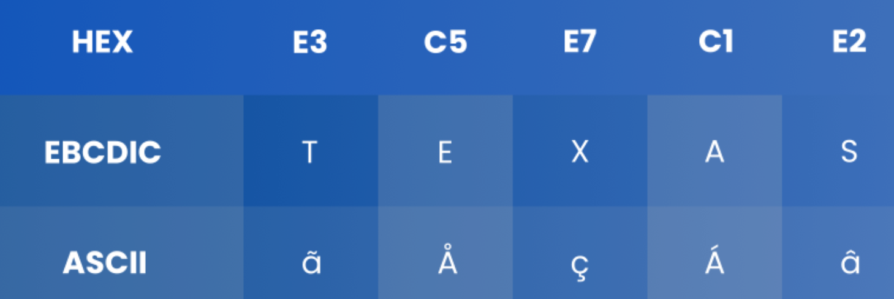

---

### 🟢 ASCII vs EBCDIC


Now imagine that you’ve written a wonderful program and decided to compile and run it on a computer utilizing the EBCDIC code. If you wrote something like this, the compiler running on that computer would notice the question mark and use the appropriate EBCDIC code for that character.

```cpp
character = '?';
```

But if you wrote it like this:

```cpp
character = 63;
```

---

### 🟢 1.4.5 Literal

Now’s probably a good time to bring a new term into the mix: a **literal**. The literal is a symbol which **uniquely identifies its value**. Some prefer to use a different definition: the **literal means itself**. Choose the definition that you consider to be clearer and look at the following simple examples:

*   `character`: this is not a literal; it’s probably a variable name; when you look at it, you cannot guess what value is currently assigned to that variable;
*   `'A'`: this is a literal; when you look at it you can immediately guess its value; you even know that it’s a literal of the `char` type;
*   `100`: this is a literal, too (of the `int` type);
*   `100.0`: this is another literal, this time of a **floating point** type;
*   `i + 100`: this is a combination of a variable and a literal joined together with the `+` operator; this structure is called an **expression**.

If you’re an inquisitive person, you probably want to ask a question: if a literal of type char is given as the character enclosed in apostrophes, how do we code the apostrophe itself?

The C++ language uses a special convention that also extends to other characters, not only to apostrophes. Let's start with an apostrophe anyway. An apostrophe looks like this:

```cpp
character = '\'';
```

The `\` character (called _backslash_) acts as an **escape character**, because by using the `\` we can escape from the normal meaning of the character that follows the slash. In this example, we **escape** from the usual role of the apostrophe (i.e. delimiting the literals of type `char`).

You can also use the escape character to **escape from the escape character**. Yes, it does sound weird, but the example below should make it clear. This is how we put a backslash into a variable of type char.

```cpp
character = '\\';
```


---


> - 📌 #TIP: It appears that you only the NUMERATOR (top number) needs to have a decimal point for the result to be a decimal point (float).


#ERROR_ENCOUNTERED

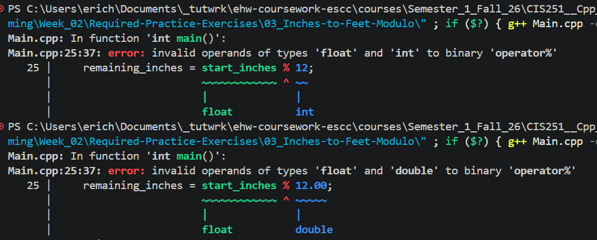


---

Guided Practice #4-5 PROOF:

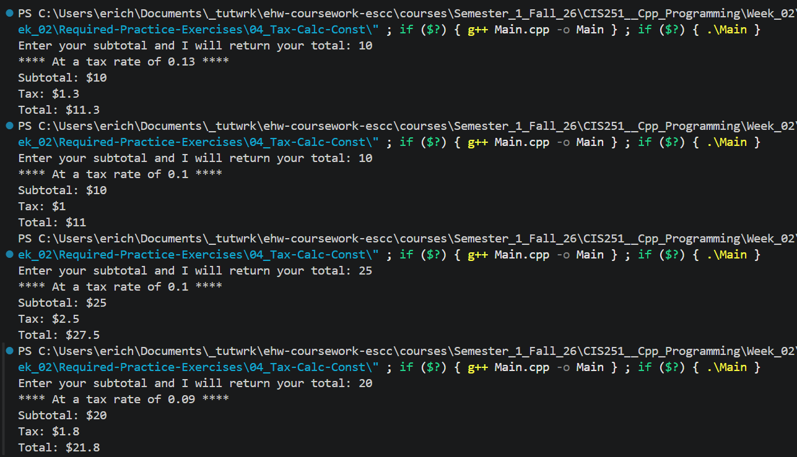


> - ⚠️ #GOTCHA: Integer division always ejects / truncates the decimal portion! Use casting on the denominator explicitly write the denominator as a decimal

---


Week 2 Assignment Results:

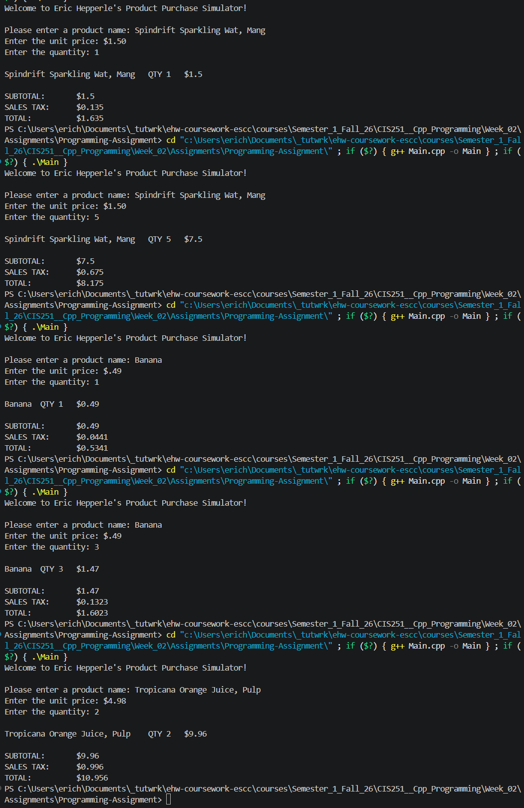


