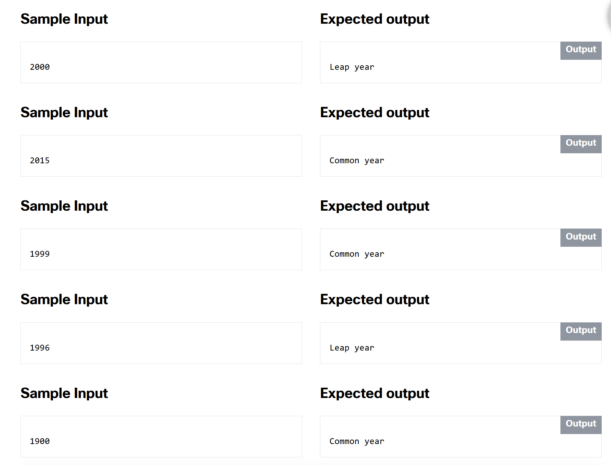

# 2.0.2   LAB   Essentials of if-else statement
> https://www.netacad.com/

---

## Level of difficulty

Easy

## Objectives

Familiarize the student with:

*   using the **if-else** statement;
*   finding proper C++ implementation of verbally defined rules;
*   testing code using sample input and output.

## Scenario

As you surely know, due to some astronomical reason, a year may be **leap** or **common**. The former is 366 days long while the latter is 365 days.

Since the introduction of the Gregorian calendar (in 1582), the following rule is used to determine the kind of year:

*   if the year number isn't divisible by 4, it is a common year;
*   otherwise, if the year number isn't divisible by 100, it is a leap year;
*   otherwise, if the year number isn't divisible by 400, it is a common year;
*   otherwise, it is a leap year.

The code should output one of two possible messages, which are Leap year or Common year, depending on the value entered.

It would be good to verify if the year entered falls into the Gregorian era and to output a warning otherwise.

Test your code using the data we've provided.



### Starting Code:


```cpp
using namespace std;

int main(void) {
	int year;
	
	cout << "Enter a year: ";
	cin >> year;
	
	// Insert your code here
	
	return 0;
}
```


