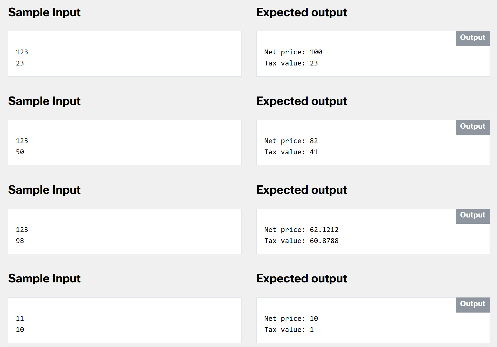

# 2.0.3   LAB   Some actual evaluations - taxes
> https://www.netacad.com/

---

## Level of difficulty

Medium

## Objectives

Familiarize the student with:

*   building a complete program that solves simple actual problems;
*   cautious treatment of the input data;
*   protecting code from incorrect input data.

## Scenario

Wherever you are and whatever you pay for, you usually spend your money on two things: the first is for a good or service you are buying, and the second is taxes. This means that the amount of money you are transferring (named "gross price") to the seller is a sum of the actual price (named "net price") and the tax. The tax is calculated as a percentage of the net price and its rate depends on a lot of unpredictable factors (e.g. where you live, what you buy, etc., etc., etc.).

Your task is to write a simple "tax calculator" – it should accept two values: a gross price and a tax rate expressed as a percentage (i.e. a value greater than 0 and, let's be optimistic, less than 100).

Look at the code below – it only reads two input values and outputs the results, so you need to complete it with a few smart calculations.

It would be good to verify if the values entered are reasonable (e.g. gross price is greater than zero and tax rate falls into the previously mentioned range).

Test your code using the data we've provided.



### Starting Code:


```cpp
#include <iostream>

using namespace std;

int main(void) {
	float grossprice, taxrate, netprice, taxvalue;
	
	cout << "Enter a gross price: ";
	cin >> grossprice;
	cout << "Enter a tax rate: ";
	cin >> taxrate;
	
	// Insert you code here
	
	cout << "Net price: " << netprice << endl;
	cout << "Tax value: " << taxvalue << endl;
	return 0;
}
```


