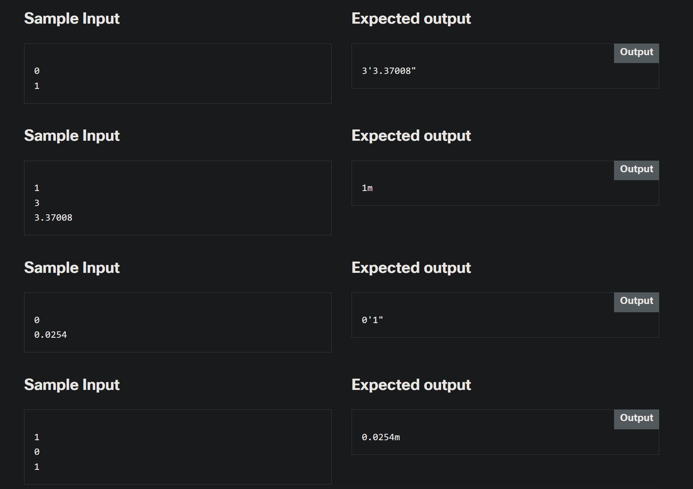

# 2.0.4   LAB   Some actual evaluations - converting measurement systems
> https://www.netacad.com/launch?id=4e9bfae1-812a-47b1-9052-43a5f27db6ff&tab=curriculum&view=ddd58074-95d2-5c5f-b56f-34c2e2a09b70

---

## Level of difficulty

Medium

## Objectives

Familiarize the student with:

*   finding information useful to solving typical problems;
*   implementing a simple conversational interface;
*   constructing branched, multifunctional code;
*   preparing clearly formatted output.

## Scenario

Among the many measurement systems available, two seem to be the most widespread: metric and imperial. To make things simpler, we assume that the first one uses the "meter" as its only unit (expressed as a real number), while the second uses the "foot" (always an integer) and the "inch" (a real number).

Your task is to write a simple "measurement converter". We want it to perform the following actions:

*   ask the user which system she/he uses to input data; we assume that 0 means "metric" and 1 means "imperial";
*   depending on the user's answer, ask either for meters or feet and inches;
*   output the distance in proper (different) units: either in feet and inches or in meters;
*   a result outputted as metric should look like **123.4m**;
*   a result outputted as imperial should look like **12'3.5"**.

Look at the code in the editor – it's only a template. Use it to implement the whole converter.

Make your code smart – it shouldn't be fooled by stupid or unreasonable inputs.

Test your code using the data we've provided.

---

### Starting Code:


```cpp
#include <iostream>

using namespace std;

int main(void) {
	int   sys;
	float m, ft, in;

	// Insert your code here
	
	return 0;
}
```

### Sample Input




