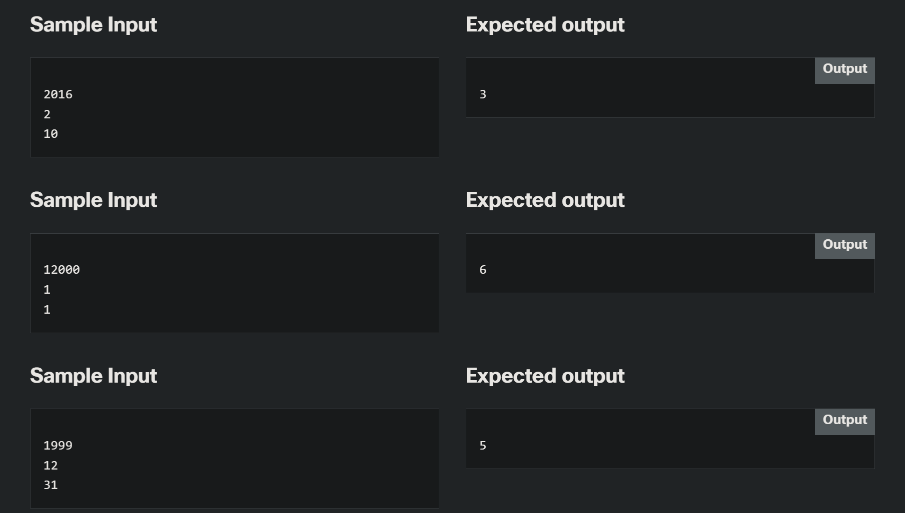

# 2.0.5   LAB   Some actual evaluations - finding day of week
> https://www.netacad.com/launch?id=4e9bfae1-812a-47b1-9052-43a5f27db6ff&tab=curriculum&view=ef5f346e-18dc-5e7f-8d23-a498d62f2e89

---

## Level of difficulty

Medium

## Objectives

Familiarize the student with:

*   building a complex sequence of elementary operations;
*   choosing types and operations adequate to a problem;
*   careful code testing.

## Scenario

Have you ever wondered how to find a weekday for any (past or future) date? Okay, you can check it in a calendar (you probably have one on your smartphone), but this is no solution for a coder. We do it the harder and more exciting way – we're going to write a program for it (did you ever suspect we were going to offer you anything else?)

One of the most popular algorithms for this task is the so-called "**Zeller's congruence**". Sounds complicated? Nothing could be further from the truth, and we're going to show you exactly that. You'll need three values:

*   year number (int – let's assume that we're interested only in dates from the 20th and 21st centuries);
*   month number (int – 1 to 12);
*   day number (int – 1 to _it depends_)

Be patient – this will take a while:

1.  Decrease month number by 2;
2.  if month number becomes less than 0, increment it by 12 and decrement year by 1;
3.  take month number and multiply it by 83 and divide it by 32;
4.  add day number to month;
5.  add year number to month;
6.  add year/4 to month;
7.  subtract year/100 from month;
8.  add year/400 to month;
9.  find the remainder of dividing month by 7;
10.  Congrats! A weekday number is ready for you! 0 – Sunday, 1 – Monday, ... and so on.

We want you to write a code which finds a weekday number for a date entered by a user. The program should ask the user for the year, month and day (in this order) and output a value indicating a weekday.

Make your code as smart as possible.

Test your code using the data we've provided.

---

### Starting Code:

> - NO starting code given! This assignment will be completely from scratch!

### Sample Input

