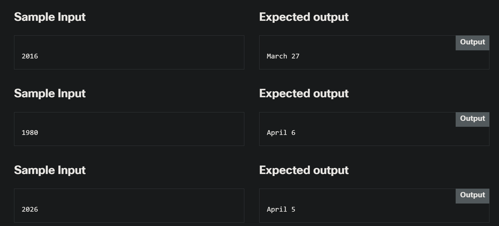

# 2.0.6   LAB   Some actual evaluations - finding date of Easter
> https://www.netacad.com/launch?id=4e9bfae1-812a-47b1-9052-43a5f27db6ff&tab=curriculum&view=e02aec09-4a7d-5193-89e0-a09e501ab7f7

---

## Level of difficulty

Medium

## Objectives

Improve the student's skills in:

*   building complex code and implementing a verbally defined algorithm;
*   choosing types and operations adequate to a problem.

## Scenario

Easter is a so-called _moveable feast_, and its date depends on two astronomical phenomena: the beginning of spring in the Northern hemisphere and the first full moon occurring after it. You may think that finding the date of Easter would be extremely complex and connected to complicated astronomical calculations, but, fortunately, it's much, much easier.

The algorithm we're going to show you was created by a famous German mathematician, **Carl Friedrich Gauss**. It's known in many variations – we're going to use one of the simpler forms adapted for the 20th and 21st centuries. The only data it uses is the year number. Okay, let's go!

1.  Divide year by 19 and find the remainder – assign it to a;
2.  divide year by 4 and find the remainder – assign it to b;
3.  divide year by 7 and find the remainder – assign it to c;
4.  take a, multiply it by 19, add 24, divide by 30 and find the remainder – assign it to d
5.  divide (2b + 4c + 6d + 5) by 7 and find the remainder - assign it to e;
6.  check the value of d + e;
7.  if it's less than 10, Easter falls on the (d + e + 22) day of March;
8.  otherwise it falls on the (d + e – 9) day of April;
9.  that's all!

Now you're familiar with all the theory you need to write a code to find the date of Easter. The program should ask the user for the year number and output a date in the form Month Day, e.g. April 5.

Test your code using the data we've provided.

---

### Starting Code:

> - NO starting code given! This assignment will be completely from scratch!

---

### Sample Input

