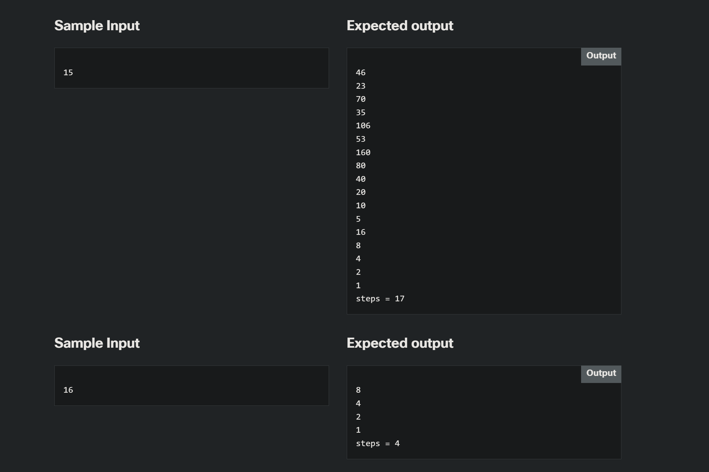

# 2.2.7 LAB Collatz's hypothesis

> https://www.netacad.com/launch?id=4e9bfae1-812a-47b1-9052-43a5f27db6ff&tab=curriculum&view=29172311-0b86-5713-9f57-90c2f64c5322

---

## Level of difficulty

Medium

## Objectives

Familiarize the student with:

- using the **while** loop;
- converting verbally defined loops into actual C++ code.

## Scenario

In 1937, a mathematician named **Lothar Collatz** formulated an intriguing hypothesis that ***remains unsolved to this day*** (perhaps this would be a good challenge for you?) which can be described in the following way:

1.  take any non-negative and non-zero integer number and name it _c0_;
2.  if it's even, evaluate a new _c0_ as _c0 / 2_
3.  otherwise, if it's odd, evaluate a new _c0_ as _3 ⋅ c0 + 1_
4.  if _c0 ≠ 1_, skip to point 2

The hypothesis says that, regardless of the initial value of _c0_, it will always (always!) go to 1.

Of course, it's an extremely complex task to use a computer in order to prove the hypothesis for any natural number (it may in fact need artificial intelligence), but you can use C++ to check some individual numbers. Maybe you can find the one that disproves the hypothesis and become a famous mathematician.

Okay, let's start. Write a program which reads one natural number and executes the above steps as long as _c0_ remains different from 1. Moreover, we'll give you another task – we want you to count the steps needed to achieve the goal. Your code should output all intermediate values of _c0_, too – it'll be very illustrative, won't it?

Hint: the most important part of the problem is how to transform Collatz's idea into a "while" loop – this is the key to success.

Test your code using the data we've provided.

---

### Starting Code:

> - NO starting code given! This assignment will be completely from scratch!

---

### Sample Input

**Sample Input Ex 2:**

| Turn No | Sample Input | Expected Output |
| ------- | ------------ | --------------- |
| 2       | 1023         | 3070            |
| "       | "            | 1535            |
| "       | "            | 4606            |
| "       | "            | 2303            |
| "       | "            | 6910            |
| "       | "            | 3455            |
| "       | "            | 10366           |
| "       | "            | 5183            |
| "       | "            | 15550           |
| "       | "            | 7775            |
| "       | "            | 23326           |
| "       | "            | 11663           |
| "       | "            | 34990           |
| "       | "            | 17495           |
| "       | "            | 52486           |
| "       | "            | 26243           |
| "       | "            | 78730           |
| "       | "            | 39365           |
| "       | "            | 118096          |
| "       | "            | 59048           |
| "       | "            | 29524           |
| "       | "            | 14762           |
| "       | "            | 7381            |
| "       | "            | 22144           |
| "       | "            | 11072           |
| "       | "            | 5536            |
| "       | "            | 2768            |
| "       | "            | 1384            |
| "       | "            | 692             |
| "       | "            | 346             |
| "       | "            | 173             |
| "       | "            | 520             |
| "       | "            | 260             |
| "       | "            | 130             |
| "       | "            | 65              |
| "       | "            | 196             |
| "       | "            | 98              |
| "       | "            | 49              |
| "       | "            | 148             |
| "       | "            | 74              |
| "       | "            | 37              |
| "       | "            | 112             |
| "       | "            | 56              |
| "       | "            | 28              |
| "       | "            | 14              |
| "       | "            | 7               |
| "       | "            | 22              |
| "       | "            | 11              |
| "       | "            | 34              |
| "       | "            | 17              |
| "       | "            | 52              |
| "       | "            | 26              |
| "       | "            | 13              |
| "       | "            | 40              |
| "       | "            | 20              |
| "       | "            | 10              |
| "       | "            | 5               |
| "       | "            | 16              |
| "       | "            | 8               |
| "       | "            | 4               |
| "       | "            | 2               |
| "       | "            | 1               |
| "       | "            | steps = 62      |
