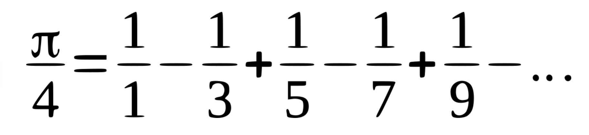
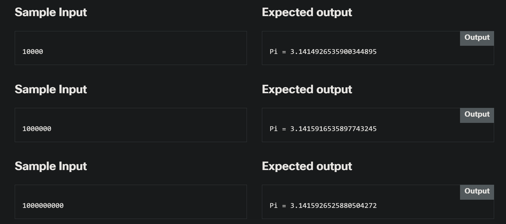

# 2.2.8 LAB  Some actual evaluations – finding the value of π

> https://www.netacad.com/launch?id=4e9bfae1-812a-47b1-9052-43a5f27db6ff&tab=curriculum&view=021df232-319d-5ab4-a687-6ca2a877bbd2

---

## Level of difficulty

Easy

## Objectives

Familiarize the student with:

*   using the **for** loop;
*   classical iterative algorithms;
*   the question of a calculation's accuracy.

## Scenario

One of the methods used to find the value of π (let's add: not a very effective method) is the **Leibniz formula**. At first glance, it looks complicated, but if you look at it carefully, you'll see a very simple recurrence and (we can bet on it!) you'll be able to imagine a draft of a very simple code implementing Leibniz's idea.

Here you are:




> Note:
> 
> *   you need to add a number of fractions – the sum will show you an approximate value of a quarter of π;
> *   some of the fractions are positive, some are negative – can you see the regularity?

Leibniz's formula needs a very large number of fractions to achieve good accuracy (you'll see this soon), but that's not a problem – ***we don't actually want to discover the value of π. We just want to check if we can find it.***

> - That's a weird thing to say

Your task is to complete the code below. The code should ask the user to enter a number of totaled fractions (in other words, the number of iterations) and to print the computed value of π. As we need good accuracy and a very large number of iterations, we use a **double** instead of a **float** and a **long** instead of an **int**.

Test your code using the data we've provided.


---

### Starting Code:

```cpp
#include <iostream>

using namespace std;

int main(void) {
	double pi4 = 0.;
	long   n;

	cout << "Number of iterations? ";
	cin >> n;

	// Insert your code here

	cout.precision(20);
	cout << "Pi = " << (pi4 * 4.) << endl;
	return 0;
}
```

---

### Sample Input


