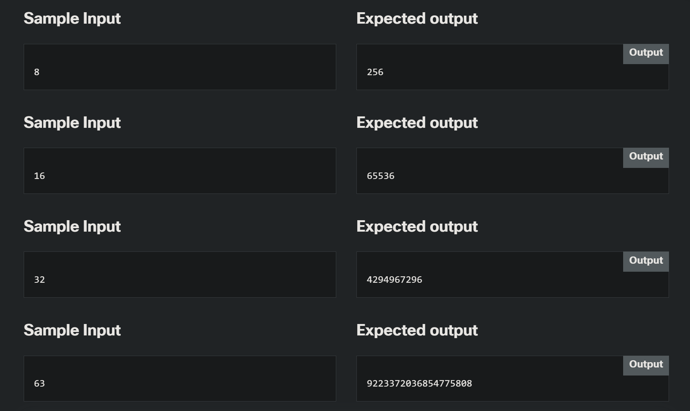

# 2.2.9 LAB  Finding positive powers of 2

> https://www.netacad.com/launch?id=4e9bfae1-812a-47b1-9052-43a5f27db6ff&tab=curriculum&view=6bf6127a-8a01-5cf0-b29f-d080f9fccbc8

---

## Level of difficulty

Easy

## Objectives

Improve the student's skills in:

*   using the **for** loop;
*   understanding integer type representation ranges.

## Scenario

As powers of ten play an important role in the real lives of humans, **powers of two are significant in computers' lives**. Can you enumerate the first few powers of two? It's easy at the beginning: 1, 2, 4, 8,.. but it gets complicated very soon and you'll need some time to find the next number.

This is a good reason to use a computer instead of our brains.

Write a program which shows the _n_\-th power of two (_n_ will be the input for the program). We'll use the following assumptions:

*   the largest value of _n_ to take into consideration is 63, as unsigned long integers use exactly 64 bits to represent their values (note: a value of 2n needs n+1 bits – can you explain why?);
*   we won't use any actual exponentiation – we're going to substitute it with repeated multiplications.

Write a program that implements the task described above.

Test your code using the data we've provided.

---

### Starting Code:

- NONE

---

### Sample Input

