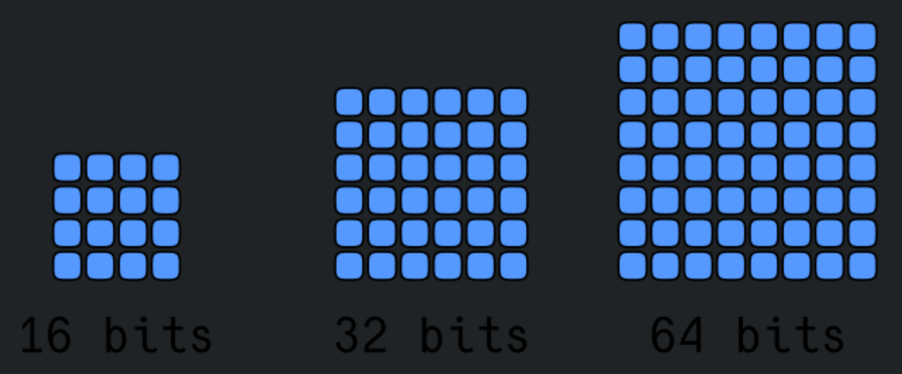
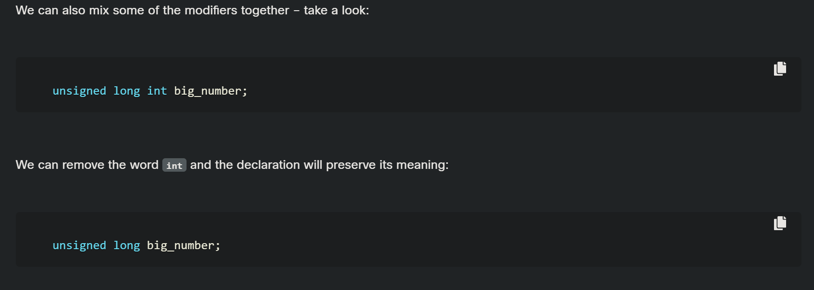
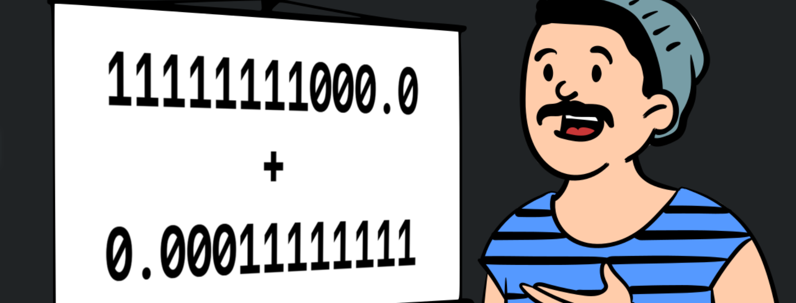
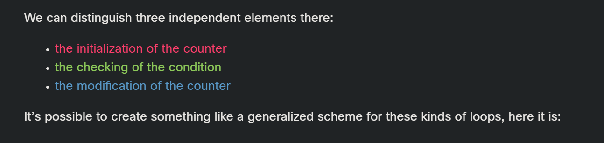

<!-- 🔗 Custom Stylesheet -->
<link rel="stylesheet" href="../../../_css/main.css">

<!-- 🖼️ Site Logo -->


# NOTES: Week 4 (CIS 251 - C++ Programming)

# 🧩 CPPE1: Module 2: Control Structures and Data Types in C++


## 📖 2.0. If and Else: Enhancing Conditional Instructions in C++


---

### 🟣 2.0.1 The conditional statement – more conditional than before


---

### 🟣 2.0.2 LAB Essentials of if-else statement


---

### 🟣 2.0.3 LAB Some actual evaluations - taxes


---

### 🟣 2.0.4 LAB Some actual evaluations - converting measurement systems


---

### 🟣 2.0.5 LAB Some actual evaluations - finding day of week


---

### 🟣 2.0.6 LAB Some actual evaluations - finding date of Easter


---


## 📖 2.1. Additional Data Types and Their Applications


---

### 🟣 2.1.1 Not only the int is an int

It would seem that the developer’s life would be organized well enough if they had type int to operate with integers, type char to manipulate characters and type float for floating-point calculations.

However, this practice has shown that such a narrow repertoire of types may raise some problems.

Most of the computers currently in use store ints using **32 bits** (4 bytes); this means that we can operate the ints within the range of [-2147483648 .. 2147483647]. It may happen that:

*   we don’t need such big values; if we count sheep, it’s unlikely that we’ll need to count two billion of them, so why waste the majority of these 32 bits if we don’t need them;
*   we need much larger values; for example, we intend to calculate the exact number of humans living on Earth; in this case we need more than 32 bits to represent that number;
*   this brings us to another observation – after all, the number of inhabitants on Earth will never be a negative number; it seems like a real waste that up to half of the permissible range will never be used.

For these reasons, the C++ language provides some methods for defining precisely how we intend to store large/small numbers. This allows the compiler to allocate memory, either smaller than usual (e.g. 16 bits instead of 32) or larger than usual (e.g. 64 bits instead of 32). We can also declare that we guarantee that the value stored in the variable will be **non-negative**.

In this case the width of the variable’s **range does not change**, but is **shifted** toward the positive numbers. This means that instead of the range of -2,147,483,648 .. 2,147,483,647 we get the range of 0 .. 4294967295.



  

To specify our memory requirements, we can use some additional keywords called _modifiers_:

*   _long_ – is used to declare that we need a wider range of ints than the standard one;
*   _short_ – is used to determine that we need a narrower range of ints than the standard one;
*   _unsigned_ – used to declare that a variable will be used only for non-negative numbers; this might surprise you, but we can use this modifier together with the type char; we’ll explain it soon.

Let’s look at some examples.

  

The `counter` variable will use fewer bits than the standard `int` (e.g., it could be 16 bits long – in this case, the range of the variable will be suppressed to the range of [-32768 to 32767]):

```cpp
short int counter;
```

The word int may be omitted as all the declarations are considered to be specifying int by default, like this:

```cpp
short Counter;
```
The ants variable will occupy more bits than the standard int (e.g. 64 bits, so it can be used to store numbers from the range of [-9223372036854775808 .. 9223372036854775807] – can you read such huge numbers?

```cpp
long int ants;
```

Note – we can again omit the word int:

```cpp
long ants;
```

If we come to the conclusion that a variable will never be a negative value, we can use the unsigned modifier:


```cpp
unsigned int positive;
```

Of course, we can omit the int as usual:


```cpp
unsigned positive;
```

We can also mix some of the modifiers together – take a look:


```cpp
unsigned long int big_number;
```

We can remove the word int and the declaration will preserve its meaning:

```cpp
unsigned long big_number;
```



A more modest example is here:

```cpp
unsigned short int lambs;
```

Its equivalent form is:

```cpp
unsigned short lambs;
```

  

The _long_ and _short_ modifiers **must not be used** in conjunction with the type char (why?) and (for obvious reasons) must not be used simultaneously in a single declaration. But there’s nothing preventing us from using the _unsigned_ modifier with a variable of type char. What do we get from this declaration?

Don’t forget that we’re not allowed to omit the word char. Most of the compilers currently in use assume that the chars are stored using 8 bits (1 byte). That may be enough to store a small value such as the number of months or even the day of the month.

If we treat the char variable as a signed integer number, its range would be \[-128 .. 127\]. If we don’t need any signed value (as in the example below), its range shifts to \[0 .. 255\]. This may be sufficient for many applications and may also result in significant savings in memory usage.

```cpp
unsigned char little_counter;
```

But we need to add an important remark. So far we’ve used integer literals, assuming that all of them are of type int. This is generally the case, but there are some cases when the compiler recognizes literals of type long. This will happen if:

*   a literal value goes **beyond the acceptable** range of type int;
*   **letter L or l is appended** to the literal, such as 0L or 1981l – both of these literals are of type long.


---

### 🟣 2.1.2 Another float type

The _short_ modifier cannot be used alongside the `float`, but we may use the _long_ modifier here. It’s assumed that type `long float` is a synonym for another type named `double`. The variables of type `double` may differ from the variables of type `float`, not only in **range**, but also in **accuracy**.

> - #TIP: Long float is synonomy for `double`

What does this mean? The data stored in a floating-point variable has **finite precision** – in other words, only a certain number of digits are **precisely stored** in the variable.

For example, we expect that the value:


```cpp
1111111111111111111.111111111111111111111
```

will be stored by a specific type of computer as:

```cpp
1111111131851653120.000000
```

We say that the variable saves (only) **8 precise digits**. This is within the expected accuracy of 32-bit long `float`s. Using a `double` (which is usually 64 bits long) guarantees that the variable will save a more significant number of digits – about **15-17**. This is where the name `double` comes from – its accuracy is **doubled** compared to `float`.

---

### 🟣 2.1.3 Floats and their traits

We told you some time ago that computer addition is not always commutative. Do you know why? Imagine that you have to add a large number of floating-point values – some of them are very large, some very small (close to zero). If a very small float value is added to another that’s very large, the result can be quite surprising.

Let’s go back to the previous example – we’ll assume that our computer only saves 8 precise digits of any float. If we add these two floats, we’ll probably get:


```cpp
11111110656.000000
```

as the result. The lower value simply vanished without a trace.

We can’t avoid these effects when we add/subtract the numbers of type float (and of double as well, because they’re also affected by this issue). The phenomenon described here is what we call a **numerical anomaly**.



> - #GOTCHA:  ??? So what do we do about numerical anomalies?

---

### 🟣 2.1.4 In memory of George Boole

**George Boole** (1815 –1864) was an English mathematician, philosopher and logician and we’re talking about him for a very important reason. One of his most important achievements was **algebraic logic**, referred to by Boole himself as “the laws of thought”. Algebraic logic does not operate on numbers but only on **two truth values**, and doesn’t use standard arithmetic operations like addition and multiplication, but **conjunction, disjunction** and **negation**.

Taking into account the fact that virtually all modern computers are built using Boole’s theorems, we can say without exaggeration that Boole was actually one of the founders of IT.

There is a type in the C++ language whose name commemorates George Boole – **the type `bool`**.

It’s a very intriguing type. Variables of this type are able to store only two distinct values: `true` and `false`. Note: all these new words (`bool`, `true` and `false`) are keywords. Don’t forget that.

Take a look at the example below:


```cpp
bool developer_is_hungry = false;
```

We’ve declared a variable there. Neither its name nor its value requires additional comments. There are many contexts where this variable may be useful. One of the most spectacular is the following:

```cpp
if(developer_is_hungry) {
	have_lunch();
	developer_is_hungry = !developer_is_hungry;
}
```

The exclamation mark we’ve used in the assignment is a negation operator. It’s a **unary prefix operator** that changes the logical value of its arguments: because of the operator, true becomes false and vice versa. As you see, having lunch changes the logical state of one of the most important factors of a programmer’s well-being.

To be honest, the `bool` type is only a very special variant of the `int` type. It’s very short (variables of this type occupy only 8 bits, which is still too much, because one bit would be enough). It behaves like an int inside expressions (**true is equivalent to 1 while false is equivalent to `0`**).

> - Bool is a special variant of `int` type (8 bits)

We’ll return to this type and its values soon, and to George Boole’s algebra and logical operators, too.


---


## 📖 2.2. Looping Constructs: Iterating Through Code Blocks


---

### 🟣 2.2.1 Two simple programs

Now we’re going to show you some simple but complete programs. We won’t explain them in detail, because we think the comments inside the code are sufficient guides.

All these programs solve the same problem – they find the largest of several numbers and print it out.

Let’s start with the simplest case – how to **identify the larger of two numbers**.

```cpp
/* finding the larger of two numbers */

#include <iostream>
using namespace std;

int main(void) {
  /* the two numbers */
  int number1, number2;

  /* we will save the larger number here */
  int max;

  /* read two numbers */
  cin >> number1;
  cin >> number2;

  /* we temporarily assume that the former number is the larger one */
  /* we will check it soon */
  max = number1;

  /* we check if the assumption was false */
  if (number2 > max)
    max = number2;

  /* we print the result */
  cout << "The larger number is " << max << endl;

  /* we finish the program successfully */
  return 0;
}
```

Now let's try to find **the largest of three numbers**. We find the larger of the first two and compare it with the third one. Here we go.

```cpp
/* finding the largest of three numbers */

#include <iostream>
using namespace std;

int main(void) {
  /* the three numbers */
  int number1, number2, number3;

  /* we will save the larger number here */
  int max;

  /* read three numbers */
  cin >> number1;
  cin >> number2;
  cin >> number3;

  /* we temporarily assume that the former number is the larger one */
  /* we will check it soon */
  max = number1;

  /* we check if the second value is the largest */
  if (number2 > max)
    max = number2;

  /* we check if the third value is the largest */
  if (number3 > max)
    max = number3;

  /* we print the result */
  cout << "The largest number is " << max << endl;

  /* we finish the program successfully */
  return 0;
}
```


---

### 🟣 2.2.2 Some simple programs

By this point, you should be able to write a program that finds the largest of four, five, six or even ten numbers. You already know the scheme, so the extension of the program doesn’t need to be particularly complex.

But what happens if we ask you to write a program that finds the largest of a hundred of numbers? Can you imagine the code?

*   You’d need hundreds of declarations of type int variables. If you think you can cope with that, then try to imagine searching for the greatest of a million numbers;
*   Imagine the code that contains 99 conditional statements and a hundred cin statements.

  

Let’s ignore the C++ language for the moment and try to analyze the problem while not thinking about the programming. In other words, let’s try to write the **algorithm**, and when we’re happy with it, we'll try to implement it.

We’re going to use a kind of notation that is not a programming language at all (it could be neither compiled nor executed), but is formalized, concise and readable. We call this **pseudo-code**.

There is an example of pseudo-code below. Take a look at it. What’s going on?

```
1. max = -999999999;
2. read number
3. if(number == -1) print max next stop;
4. if(number > max) max = number
5. go to 2
```

  

First, we can simplify our program if, at the very beginning of the code, we assign the variable max with a value which will be smaller than any of the numbers entered. We’ll use _\-999999999_ for this purpose.

Second, we assume that our algorithm doesn’t know in advance how many numbers will be delivered to the program. We expect that the user will enter as many numbers as she/he wants – the algorithm will work equally well with one hundred or one thousand numbers. How do we do that? Well, we make a deal with the user: when the value \-1 is entered, it will be a sign that there is no more data and the program should end its work. Otherwise, if the entered value is not equal to - 1, the program will read another number and so on.

The trick is based on the assumption that any part of the code **can be performed more than once** – in fact, as many times as you need.

**Performing a certain part of the code more than once is called a loop**. You probably already know what a loop is. See, steps 2 through 5 make a loop. Can we use a similar structure in the program written in the C++ language? Yes, we can. And we’re going to tell all you about it soon.


---

### 🟣 2.2.3 The “while” loop

We want to ask you a strange question: how long do you usually take to wash your hands? Don’t think about it, just answer. Well, when your hands are very dirty, you wash them for a very long time. Otherwise it takes less time. Do you agree with this statement:

```
while my hands are dirty
  I am washing my hands;
```

Note that this also implies that if our hands are clean, we won’t wash them at all.
  
So now you've learnt one of the loops available in the C++ language. In general, the loop manifests itself as follows:

```cpp
while(conditional_expression)
  statement;
```

If you think it looks similar to the `if` instruction, you’re quite right. Indeed, there’s only one syntactic difference: we replaced the word “if” with the word “while”.

The semantic difference is more important: when the condition is met, `if` performs its statements only once; `while` repeats the execution as long as the condition evaluates to “true”.

Let’s make a few observations:

*   if you want while to execute **more than one** statement, you must (like with the if statement) use a block – take a look at the code in the editor;
*   an instruction or instructions executed inside the loop are called the **loop's body**;
*   if the condition is “false” (equal to zero) as early as when it’s tested for the first time, the **body is not executed** even once (note the analogy of not having to wash your hands if they’re not dirty);
*   the body should be able to change the condition value, because if the condition is true at the beginning, the body might **run continuously to infinity** (notice that washing changes the state of impurity).

```cpp
while(conditional_expression) {
  statement_1;
  statement_2;
  :
  :
  statement_n;
}
```

Here is an example of a loop that is not able to finish its execution:

```cpp
while(1) {
  cout << "I am stuck inside a loop" << endl;
}
```

This loop will infinitely print `I am stuck inside a loop` on the screen.

Let's go back to the algorithm we talked about recently. We’re going to show you how to use the newly learnt loop. By the way, we want to introduce you to one more novelty. So far we’ve declared variables in one place and assigned values to them in another.

We can combine these two steps by **declaring the variable and assigning the value at the same time**. This is done by adding the = sign followed by an expression whose value is assigned to the variable at the time of its creation.

For example, if you need a variable that needs the value of zero then you can do this:

```cpp
int variable = 0;
```

As usual on such occasions, a new word arrives into our vocabulary: the part of the declaration placed on the right side of the `=` sign is called an **initiator**.

The initiator you saw before was a literal, but you can also use more complex expressions, like the ones below.


```cpp
float PI = 3.1415;
double PI2 = 2.0 * PI;
```

We’ll be using initiators often. They’re extremely convenient and quite useful.

Analyze the program in the editor carefully. Locate the loop’s body and find out how the **body is exited**.


```cpp
#include <iostream>

using namespace std;
int main(void) {
  /* temporary storage for the incoming numbers */
  int number;
  /* get the first value */
  cin >> number;
  /* we will store the currently greatest number here */
  int max = number;
  /* if the number is not equal to -1 we will continue */
  while (number != -1) {
    /* is the number greater than max? */
    if (number > max)
      /* yes – update max */
      max = number;
    /* get next number */
    cin >> number;
  }
  /* print the largest number */
  cout << "The largest number is " << max << endl;
  /* finish the program successfully */
  return 0;
}
```

See how the above code implements the algorithm we made earlier.


This program counts odd and even numbers coming from the keyboard. Have a look at it.


```cpp
#include <iostream>
using namespace std;

int main() {
  /* we will count the numbers here */
  int Evens = 0, Odds = 0;

  /* we will store the incoming numbers here */
  int Number;

  /* read first number */
  cin >> Number;

  /* 0 terminates execution */
  while (Number != 0) {
    /* check if the number is odd */
    if (Number % 2 == 1)
      /* increase "odd" counter */
      Odds++;
    else
      /* increase "even" counter */
      Evens++;
    /* read next number */
    cin >> Number;
  }
  /* print results */
  cout << "Even numbers: " << Evens << endl;
  cout << "Odd numbers: " << Odds << endl;
  return 0;
}
```

Certain snippets can be simplified without changing the program’s behavior.

Try to recall how the “C++” language interprets the truth of a condition and note that these two forms are equivalent.

```cpp
while(number !=0) {...}
while(number) {...}
```

The condition that checks if a number is odd can be coded in like this:

```cpp
if(number % 2 ==1)...
if(number % 2)...
```

We guess that nothing surprises you, right? But there are two things that we can write more compactly. First, the condition of the while loop.

```cpp
int main(void) {
       int counter = 5;

      while(counter != 0) {
               cout << "I am an awesome program" << endl;
               counter--;
      }
      return 0;
}
```

Another change requires us to have some knowledge of how the **post-decrement** works. We’ll use it to compact our program once again.

> - **post-decrement:** ???

```cpp
int main(void) {
       int counter = 5;

       while(counter) {
                cout << "I am an awesome program" << endl;
                counter--;
       }
       return 0;
}
```

We’re convinced that this is the simplest form of this program, but you can challenge us if you dare.

```cpp
int main(void) {
       int counter = 5;

       while(counter--)
                cout << "I am an awesome program" << endl;
       return 0;
}
```


---

### 🟣 2.2.4 The “do” loop or do it at least once

We already know that the `while` loop has two important features:

*   it checks the condition **before** entering the body,
*   the body will not be entered if the condition is false.

These two properties can often cause unnecessary complications. For this reason, there’s another loop in the C++ language which **acts like a mirror image of the while loop**.

We say this because in that loop:

*   the condition is checked at the end of the body execution,
*   the loop's body is executed at least once, even if the condition is not met.

This loop is called the `do` loop. Its simplified syntax is listed in the editor.

```cpp
do
  statement;

while(condition);

do {
  statement_1;
  statement_2;
  :
  :
  statement_n;
} while(condition);
```

If you want to execute a body containing more than one statement, you need to use a block.

Let’s return to the program that searches for the largest number. Firstly, we will use the “`do`” loop instead of “`while`” for teaching purposes. Secondly, we remove the vulnerability involved in the excessive trust in the user’s good will. Our new program won’t be misled by entering the value of `-1` as the first number. Look at the editor. Here's our code.

```cpp
#include <iostream>

using namespace std;

int main(void) {
  int number;
  int max = -100000;
  int counter = 0;
  do {
    cin >> number;
    if (number != -1)
      counter++;
    if (number > max)
      max = number;
  } while (number != -1);
  if (counter)
    cout << "The largest number is " << max << endl;
  else
    cout << "Are you kidding? You haven't entered any number!" << endl;
  return 0;
}
```

Take a look. We used the `counter` variable to count the numbers entered so we can instruct the user that we cannot search for the greatest number if no number is given.

As we have to **read at least one number**, it makes sense to use the `do` loop. We use this approach in the program.


---

### 🟣 2.2.5 “for” - the last loop

The last available kind of loop in C++ language comes from the fact that sometimes it’s more important to **count the “turns” of the loop** than to check the conditions.

Imagine that a loop's body needs to be executed exactly one hundred times. If you want to use the `while` loop for that purpose, it may look something like this:

```cpp
int i;

i = 0;
while (i < 100) {
    /* the body goes here */
    i++;
}
```



We can distinguish three independent elements there:

- the initialization of the counter
- the checking of the condition
- the modification of the counter

It’s possible to create something like a generalized scheme for these kinds of loops, here it is:

```cpp
initialization;
while (checking) {
    /* the body goes here */
    modifying;
}
```

This way of coding the loop is very common, so there’s a special, brief way of writing it in “C++” language.


Below we’ve gathered all three decisive parts together. The loop is clear and easy to understand. Its name is `for`.

```cpp
for(initialization; checking; modifying; {
    /* the body goes here */
}
```

The `for` loop can take the form shown below:

```cpp
for(i = 0; i < 100; i++) {
  /* the body goes here */ 
}
```

The variable used for counting the loop's turns is often called a **control variable**.

Notice, that the control variable doesn’t have to be declared before it’s used within the `for` loop. It can be declared inside the loop, but in this case it’ll be available during and only during the loop execution.

The `for` loop has an interesting singularity. If we omit any of its three components, it is presumed that there is a 1 there instead.

One of the consequences of this is that a loop written in this way is an infinite loop (do you know why?).

Well, the conditional expression is not there, so it is automatically assumed to be true. And because the condition never becomes false, the loop becomes infinite.

```cpp
for( ; ; ) {
  /* the body goes here */ 
}
```

Let’s look at a short program whose task is to write some of the first powers of 2.

```cpp
#include <iostream>

using namespace std;

int main(void) {
  int pow = 1;

  for (int exp = 0; exp < 16; exp++) {
    cout << "2 to the power of " << exp << " is " << pow << endl;
    pow *= 2;
  }
  return 0;
}
```

The `exp` variable is used as a control variable for the loop and indicates the current value of the exponent. The exponentiation itself is replaced by multiplying by 2. Since 20 is equal to 1, then 2 ∙ 1 is equal to 21, 2 ∙ 21 is equal to 22 and so on.

Answer this question: what is the greatest exponent for which our program still prints the result?


```cpp

```


---

### 🟣 2.2.6 break and continue – the loop's spices


So far, we’ve treated the body of the loop as an **indivisible and inseparable** sequence of instructions that are performed completely at every turn of the loop. However, as a developer, you could be faced with the following choices:

*   it appears that it is unnecessary to continue the loop as a whole; we should stop executing the loop's body and go further;
*   it appears that we need to start the condition testing without completing the execution of the current turn.

The C++ language provides us with two special instructions to implement both these tasks. Let's say for the sake of accuracy that their existence in the language is not necessary - an experienced programmer can code any algorithm without these instructions.

The famous Dutch computer scientist [Edsger Dijkstra](https://en.wikipedia.org/wiki/Edsger_W._Dijkstra "Edsger Dijkstra") proved it in 1965. These additions, which don't improve the language's expressive power but only simplify the developer's work, are sometimes called **syntactic candies**.

> - **syntactic candies:** Me - I wonder if this is what is also called `syntactic sugar`???

These two instructions are:

*   `break` - exits the loop immediately and unconditionally ends the loop’s operation; the program begins to execute the nearest instruction after the loop's body;
*   `continue` – behaves as the program suddenly reached the end of the body; the end of the loop's body is reached and the condition expression is tested immediately.

Both these words are keywords.

Now let’s look at two simple examples. We’ll return to our program that recognizes the largest of the numbers entered. We’ll convert it twice, using both instructions. Analyze the code and judge whether and how you would use any of them.

You can see the `break` variant in the editor:

```cpp
#include <iostream>

using namespace std;

int main(void) {
  int number;
  int max = -100000;
  int counter = 0;
  for (;;) {
    cin >> number;
    if (number == -1)
      break;
    counter++;
    if (number > max)
      max = number;
  }
  if (counter)
    cout << "The largest number is " << max << endl;
  else
    cout << "Are you kidding? You haven't entered any number!" << endl;
  return 0;
}
```

Note that the only way to exit the body is to perform the break, as the loop itself is infinite (`for (;;)`).


And now the `continue` variant:


```cpp
#include <iostream>

using namespace std;

int main(void) {
int number;
int max = -100000;
int counter = 0;

do {
	cin >> number;
	if(number == -1)
		continue;
	counter++;
	if(number > max)
		max = number;
} while (number != -1);
if(counter)
	cout << "The largest number is " << max << endl;
else 
	cout << "Are you kidding? You haven't entered any number!" << endl;
return 0;
}
```


---

### 🟣 2.2.7 LAB Collatz's hypothesis


---

### 🟣 2.2.8 LAB Some actual evaluations – finding the value of π


---

### 🟣 2.2.9 LAB Finding positive powers of 2


---

### 🟣 2.2.10 LAB Finding negative powers of 2


---

### 🟣 2.2.11 LAB Drawing squares (actually: rectangles)


---

### 🟣 2.2.12 LAB Postcard from Gizah


---

### 🟣 2.2.13 LAB Do it yourself: Fibonacci sequence


---

### 🟣 2.2.14 LAB Do it yourself: factorials


---

### 🟣 2.2.15 LAB The riddle (a bit of a tricky one)


---
2.3. Algebra and Computer Logic


### 🟣 2.3.1 Computers and their logic


---

### 🟣 2.3.2 Pride && Prejudice


---

### 🟣 2.3.3 To be || not to be


---

### 🟣 2.3.4 Some logical expressions


---

### 🟣 2.3.5 How to deal with single bits


---

### 🟣 2.3.6 LAB Counting bits (the ones)


---

### 🟣 2.3.7 LAB Bitwise palindromes


---
2.4. Switch Statements: Another Perspective on Conditional Logic


### 🟣 2.4.1 Case and switch vs. if


---

### 🟣 2.4.2 LAB A real and usable calculator


---2.5. Arrays and Vectors: Why Are They Essential?


### 🟣 2.5.1 Arrays – why?


---


## 📖 2.6. Arrays: Simplifying Array Setup


---

### 🟣 2.6.1 Array initialization


---
2.7. Arrays of Arrays: Understanding Multidimensional Arrays


### 🟣 2.7.1 Not only ints


---

### 🟣 2.7.2 Not only vectors


---
2.8. Structures: Their Importance and Functionality


### 🟣 2.8.1 Structures – why do we need them?


---

### 🟣 2.8.2 Declaring the structures


---

### 🟣 2.8.3 Structures – how do we use them?


---

### 🟣 2.8.4 LAB Simple vector manipulations


---

### 🟣 2.8.5 LAB Collecting banknotes


---

### 🟣 2.8.6 LAB Palindromes once again


---

### 🟣 2.8.7 LAB Evaluating different kinds of means


---

### 🟣 2.8.8 LAB Two-dimensional square array – symmetric or not?


---2.9. Declaring and Initializing Structures: Fundamentals and Techniques


### 🟣 2.9.1 Structures – a few important rules


---

### 🟣 2.9.2 LAB Structure of time or time of structure


---

### 🟣 2.9.3 LAB Times and durations


---2.10. Module 2 Completion – Module Test
assignment
100 Pts


### 🟣 2.10.1 Congratulations! You have completed Module 2


---

### 🟣 2.10.2 Module 2 Test


---

