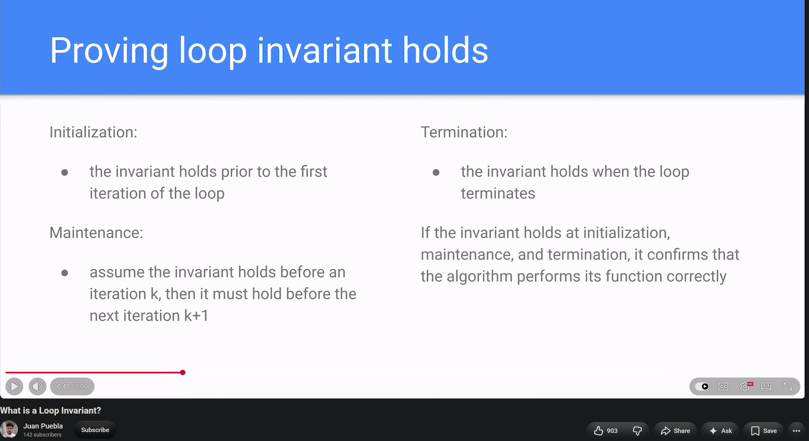
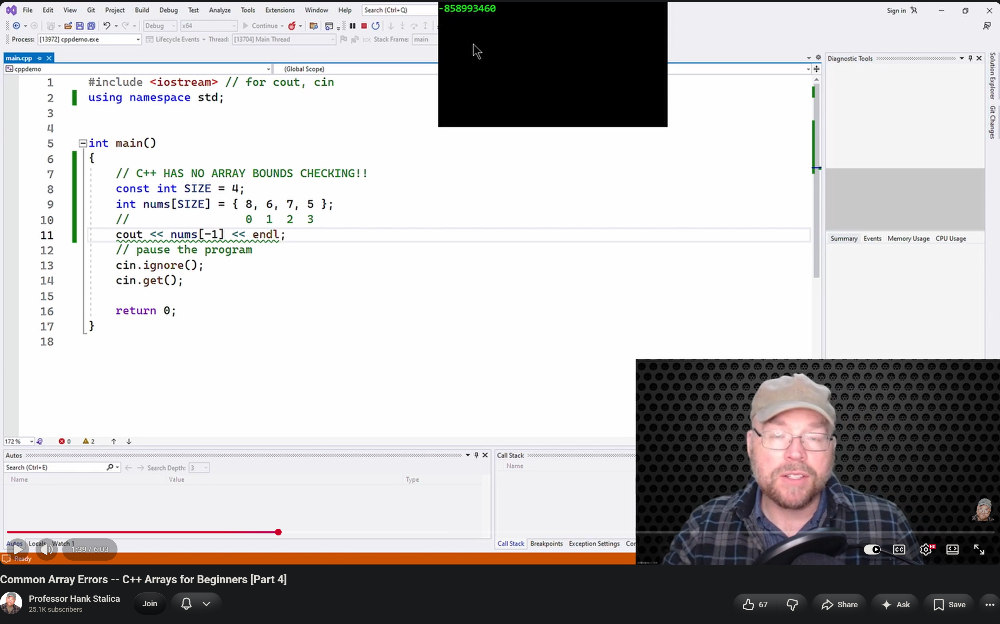

<!-- 🔗 Custom Stylesheet -->
<link rel="stylesheet" href="../../../_css/main.css">

<!-- 🖼️ Site Logo -->


# NOTES: Week 6 (CIS 251 - C++ Programming)

> These are my research notes on the Week 6 Discussion Topic: 
> "*Why is array-bound reasoning a systems-programming concern, and how should AI suggestions involving indexing be verified?*"


---


- What is 'array-bound reasoning'?
- What is 'systems-programming'
- Loop invariant is a discrete structures concept

## Loop Invariants

- **Initialization**: the invariant holds prior to the first iteration of the loop
- **Maintenance**: assume the invariant holds before an iteration `k`, then it must hold before the next iteration `k+1`
- **Termination:** the invariant holds when the loop terminates
- If the invariant holds at initialization, maintenance, and termination, it confirms that the algorithm performs its function correctly

Array-bound reasoning is a systems-programming concern because systems code often handles memory directly or operates near hardware and operating-system interfaces. A bad index can read or write memory that does not belong to the intended array.

In C++, indexing beyond an array’s valid range is **undefined behavior**. That means the C++ language does not guarantee a safe, predictable result. The program might appear to work, print a wrong value, corrupt unrelated data, crash later, or create a security vulnerability.



---


**Array-bound reasoning** means carefully proving that every array index your code uses is valid.

If an array has \(n\) elements, its valid indexes are:

\[
0 \text{ through } n - 1
\]

So for:

```cpp
int scores [coursera](https://www.coursera.org/in/articles/system-programming) = {90, 80, 70, 60, 50};
```

the only valid indexes are `0`, `1`, `2`, `3`, and `4`. Array-bound reasoning asks questions such as:

- How many elements are actually in this array?
- What is the smallest index this loop can produce?
- What is the largest index it can produce?
- Is every access guaranteed to stay from `0` through `size - 1`?
- Does a calculation such as `i + 1`, `row * columns + col`, or `count - 1` ever go outside that range?

In C++, the first element is index `0`, and the last valid element of an array with `n` elements is index `n - 1`. Ordinary array indexing does not automatically protect you from an invalid index, so the programmer must ensure the index stays valid. [learn.microsoft](https://learn.microsoft.com/en-us/cpp/cpp/arrays-cpp?view=msvc-170)

## 🧪 Example

This loop is correct:

```cpp
int values [coursera](https://www.coursera.org/in/articles/system-programming) = {10, 20, 30, 40, 50};

for (int i = 0; i < 5; i++) {
    cout << values[i] << endl;
}
```

Why? The loop gives `i` these values:

```text
0, 1, 2, 3, 4
```

Those are exactly the valid indexes for a five-element array.

This version has an error:

```cpp
for (int i = 0; i <= 5; i++) {
    cout << values[i] << endl;
}
```

Because `<= 5` allows `i` to become `5`. But `values [coursera](https://www.coursera.org/in/articles/system-programming)` is the **sixth** position—not part of `values [coursera](https://www.coursera.org/in/articles/system-programming)`, whose valid indexes stop at `4`.

That one-character difference—`<` versus `<=`—is a classic off-by-one error.

---


https://www.youtube.com/watch?v=yucYw4Tnh3M

- Negative 1 `-1` as a subscript
- -1 as a subscript accesses the 4 bytes before the beginning of the array - whatever happens to be there - no control because that's not a value we put there
- **off-by-one error:** Occurs during loop setup, as opposed to the input bounds (cout << scores[-1] ) -- in python and other languages, -1 is a valid index that means the last item of the array, but in C++ it is invalid and will just give you garbage
- Hank Stalica says "the solution to logic errors is always doing some kind of hand-tracing"
- 


---


## Vectors

- Tech With Tim — Learn C++ With Me #18 - Vectors:  https://www.youtube.com/watch?v=RXzzE2wnnlo
- **vectors:** an array that can change its size; opposite of a fixed-size array