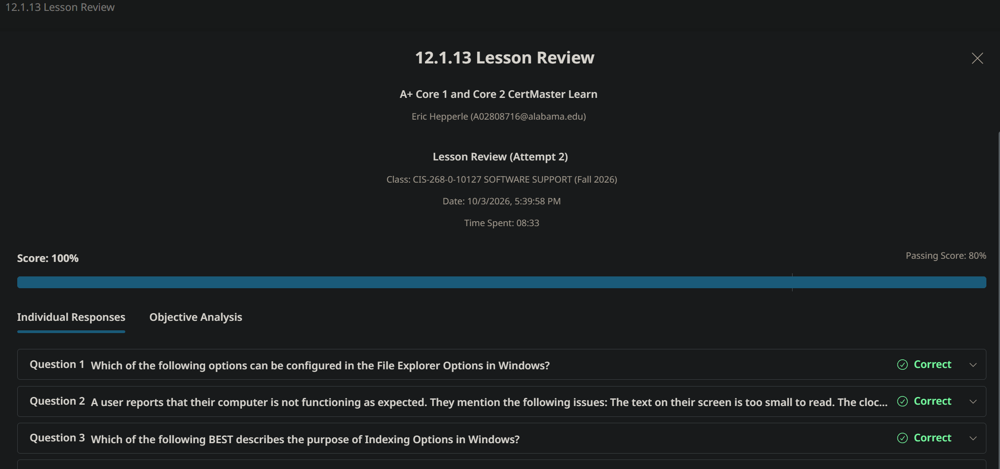
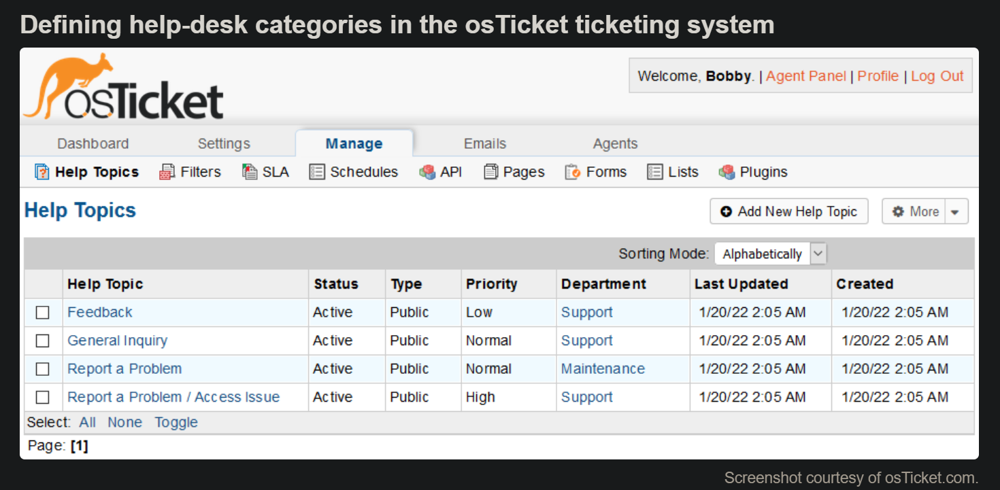
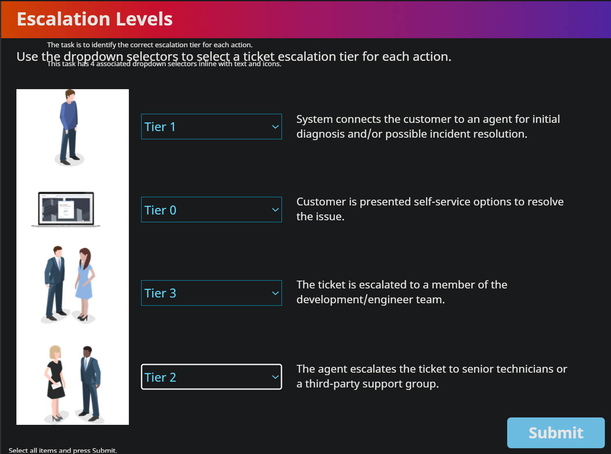
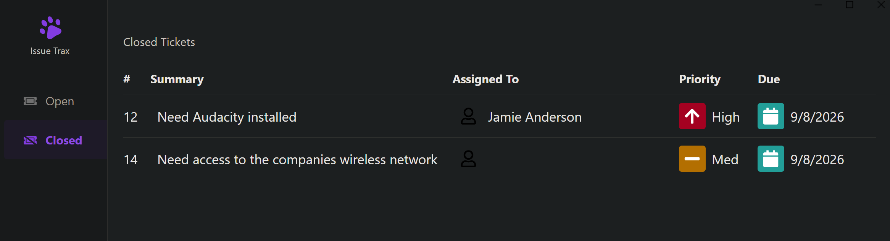
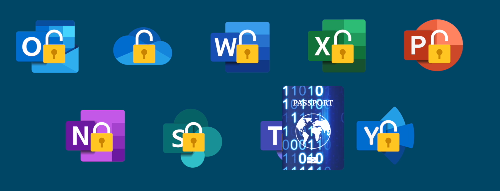
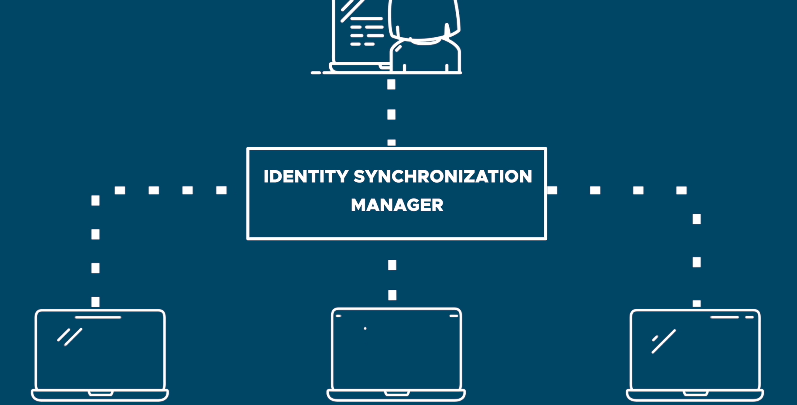

<!-- Custom stylesheet -->
<link rel="stylesheet" href="../../_css/main.css">

<!-- Site logo -->

> [🏚️ README](../../../README.md) | [📁 Courses](../../index.md) | [📚 Vocabulary](../../Vocabulary.md) | [🗓️ Assignments Schedule](../Assignments_Schedule.md) | [🔖 Bookmark](#bookmark)

# ESCC CIS 268 - Software Support:  NOTES: SCRATCH (going forth 10/3/2026)

---

# 📖 Lesson 12.1 Windows User Settings

## 🟣 12.1.6 Privacy Settings

Privacy and Security Settings govern what usage data Windows is permitted to collect and what device functions are enabled and for which apps. The security settings allow a user to change antivirus, browser, and firewall settings. There are multiple settings toggles to determine what data collection and app permissions are allowed:

Data collection allows Microsoft to process usage telemetry. It affects use of speech and input personalization, language settings, general diagnostics, and activity history.
App permissions allow or deny access to devices such as the location service, camera, and microphone and to user data such as contacts, calendar items, email, and files.
General privacy settings in Windows 11
A privacy and settings in Windows, showing toggles for app permissions.
Screenshot courtesy of Microsoft.

Description

---

## 🟣 12.1.7 Desktop Settings

The desktop can be configured to use local settings and personalized to adjust its appearance.

Time and Language Settings
The Time and Language settings pages are used for two main purposes:

Set the correct date/time and time zone. Keeping the PC synchronized to an accurate time source is important for processes such as authentication and backup.

Set region options for appropriate spelling and localization, keyboard input method, and speech recognition. Optionally, multiple languages can be enabled. The active language is toggled using an icon in the notification area (or START+SPACE).
Language settings
A Windows settings interface for Language.
Screenshot courtesy of Microsoft.

Description
Personalization Settings
The Personalization Settings allow you to select and customize themes, which set the appearance of the desktop environment. Personalization and theme settings include the desktop wallpaper, screen saver, color scheme, font, and properties for the Start menu and taskbar.

---

## 🟣 12.1.9 Ease of Access Settings

Ease of Access (or Ease of Access/Accessibility) settings configure input and output options to best suit each user. There are three main settings groups:

Vision configures options for cursor indicators, high-contrast and color-filter modes, and the Magnifier zoom tool. Additionally, the Narrator tool can be used to enable audio descriptions of the current selection.
Hearing configures options for volume, mono sound mixing, visual notifications, and closed-captioning.
Interaction configures options for keyboard and mouse usability. The user can also enable speech- and eye-controlled input methods.
Accessibility settings in Windows 11
A Windows Accessibility settings interface in window 11.
Screenshot courtesy of Microsoft.

Description
Note:
Ease of Access can be configured via Settings or via Control Panel. In Windows 11, these settings are found under the Accessibility heading.

---

## 🟣 12.1.10 File Explorer

File management is a critical part of using a computer. As a computer support professional, you will often have to assist users with locating files. In Windows, file management is performed using the File Explorer app. File Explorer enables you to open, copy, move, rename, view, and delete files and folders.

Note:

File Explorer is often just referred to as "Explorer," as the process is run from the file explorer.exe .

Figure 1. File Explorer in Windows 10  
  

Screenshot courtesy of Microsoft.

Description

The screen shows 7 folders 3D Objects, Desktop, Documents, Downloads, Music, Pictures, and Videos. On the bottom, a section for Devices and drives is visible, listing Local Disk (C), B D - ROM Drive (D), Seagate Expansion Drive (E), and Flash Drive (I). The description of the Local Disk (C) is listed on the right as follows: Space Used: More than 75 percent Space free: 78.8 G B File system: N T F S Bitlocker status: Off

## System Objects

In Windows, access to data files is typically mediated by system objects. These are shown in the left-hand navigation pane in File Explorer. Some of the main system objects are:

*   **User account**\- Contains personal data folders belonging to the signed-in account profile. For example, in the previous screenshot, the user account is listed as "James at CompTIA."
*   One Drive\- If you sign into the computer with a Microsoft account, this shows the files and folders saved to your cloud storage service on the Internet.
*   This PC\- Also contains the personal folders from the profile but also the fixed disks and removable storage drives attached to the PC.
*   Network\- Contains computers, shared folders, and shared printers available over the network.
*   Recycle Bin\- Provides an option for recovering files and folders that have been marked for deletion.

## Drives and Folders

While the system objects represent logical storage areas, the actual data files are written to disk drives. Within the This PC object, drives are referred to by letters and optional labels. A "drive" can be a single physical disk or a partition on a disk, a shared network folder mapped to a drive letter, or a removable disk. By convention, the A: drive is the floppy disk (very rarely seen these days) and the C: drive is the partition on the primary fixed disk holding the Windows installation.

Every drive contains a directory called the root directory. The root directory is represented by the backslash ( \\ ). For example, the root directory of the C: drive is C:\\. Below the root directory is a hierarchy of subdirectories, referred to in Windows as folders. Each directory can contain subfolders and files.

Figure 2. Typical Windows directory structure  
  
Description

Key subdirectories include Users, Program Files, and Windows. Under Windows, a subdirectory System 32 is highlighted, containing further subdirectories like Config, Drivers, and others.

## System Files

System files are the files that are required for the operating system to function. The root directory of a typical Windows installation normally contains the following folders to separate system files from user data files:

*   **Windows**\- The system root, containing drivers, logs, add-in applications, system and configuration files (notably the System32 subdirectory), fonts, and so on.
*   **Program Files/Program Files (x86)**\- Subdirectories for installed applications software. In 64-bit versions of Windows, a Program Files (x86) folder is created to store 32-bit applications.
*   **Users**\- Storage for users' profile settings and data. Each user has a folder named after their user account. This subfolder contains NTUSER.DAT (registry data) plus subfolders for personal data files. The profile folder also contains hidden subfolders used to store application settings and customizations, favorite links, shortcuts, and temporary files.

### 🎬Video Transcript

### 1. Creating a New Folder

In this video, we'll go over some basic file and folder management. First, we'll learn how to create a new folder. Let's navigate to the Documents folder by opening File Explorer and double-clicking Documents. We want to make a new folder right here, so we'll right-click, say New Folder, then we can give it a name and press Enter.

### 2. Copying a File

Next, let's copy a file into this new folder. This file is on the data drive, so we'll select the file. There are a few ways to do this. The easiest is to hold Control on the keyboard and press C to copy. Then we'll go back to the Documents folder, double-click on our new folder, and press Control V to paste. That made a copy of this document into our new folder.

### 3. Renaming a File

Suppose we want to give this file a new name. We can right-click and then click Rename. Then we can type a new name for the file.

### 4. Deleting a File

Next, let's learn how to delete a file. We'll select the file, and the easiest way to do it is to press Delete on the keyboard. That doesn't delete the file entirely; it sends it to the Recycle Bin, which is a waiting area for files that we want to delete but haven't committed to completely removing from the computer yet.

### 5. Restoring a File from the Recycle Bin

So, on the desktop, we can double-click the Recycle Bin. Here's the file that we just deleted, along with a couple of other files. Let's say that we decide that we actually do want this file. We can restore it to its original location. Right-click and then select Restore. Now, if we go back to our Documents folder, we can see that the file has been restored from the Recycle Bin.

### 6. Emptying the Recycle Bin

Now, if we look at these files and decide that we definitely don't want them again and we want to free up some space on our computer, we can empty the Recycle Bin. To do that, we just select right here, Empty Recycle Bin. When the Recycle Bin is empty, the icon changes to an empty bin icon here on the desktop.

Resume Auto-Scroll

*   headingStyle (setext or atx)
*   horizontalRule (\*, -, or \_)
*   bullet (\*, -, or )
*   codeBlockStyle (indented or fenced)
*   fence (\` or ~)
*   emDelimiter (\_ or \*)
*   strongDelimiter (\*\* or \_\_)
*   linkStyle (inlined or referenced)
*   linkReferenceStyle (full, collapsed, or shortcut)

---

## 🟣 12.1.11 File Explorer Options

File Explorer has configurable options for view settings and file search.

The File Explorer Options applet in Control Panel governs how Explorer shows folders and files. On the **General** tab, you can set options for the layout of Explorer windows and switch between the single-click and double-click styles of opening shortcuts, among other options.

Figure 1. General and view configuration settings in the File Explorer Options dialog  
  

Screenshot courtesy of Microsoft.

Description

Left Panel: The General tab with options to open File Explorer to Quick Access. The radio buttons under the head Browse folders are open each folder in the same window and open each folder in its own window. The radio buttons under the head click items as follows are single click to open an item (point to select) and double-click to open an item (single-click to select). The radio buttons under the head privacy are show recently used files in Quick access and Show frequently used folders in Quick access.

On the **View** tab, among many other options, you can configure the following settings:

*   **Hide extensions** for known file types- Windows files are identified by a three- or four-character extension following the final period in the file name. The file extension can be used to associate a file type with a software application. Overtyping the file extension (when renaming a file) can make it difficult to open, so extensions are normally hidden from view.
*   **Hidden files and folders**\- A file or folder can be marked as "Hidden" through its file attributes. Files marked as hidden are not shown by default but can be revealed by setting the "Show hidden files, folders, and drives" option.
*   **Hide protected operating system files**\- This configures files marked with the System attribute as hidden. It is worth noting that in Windows, File/Resource Protection prevents users (even administrative users) from deleting these files anyway.
*   Other Options- Default folder/item view, search options, and search behavior settings can also be modified here.

---

## 🟣 12.1.12 Indexing Options

You can configure file search behavior on the **Search** tab of the File Explorer Options dialog. Search is also governed by settings configured in the Indexing Options applet. This allows you to define indexed locations and rebuild the index. Indexed locations can include both folders and email data stores. A corrupted index is a common cause of search problems.

Figure 1. Indexing Options dialogs.  
  

Screenshot courtesy of Microsoft.

Description

The text reads, 78,121 items indexed. Indexing complete. Index these locations: Included locations are COURSEWARE, Internet Explorer History, Start Menu, Users, and Window 10. Modify and Advanced buttons are at the bottom. How does indexing affect searches and Troubleshoot search and indexing links are located below. Another window titled Advanced Options has tabs for Index Settings and File Types. The Index Settings is selected. The checkboxes under the head file settings are index encrypted files and treat similar words with diacritics as different words. The text under the head troubleshooting is delete and rebuild index. A rebuild button is on the right. Below is a link to troubleshoot search and indexing. The head index location has fields for current location and new location, after service is restarted. A select new button is at the bottom. An advanced indexing help is below it and ok and cancel buttons are below.

> - **indexing options:** Control Panel app related to search database maintenance.

---

## 🟣 12.1.13 LESSON REVIEW

#PROOF 100%

---

# 📖 Lesson 12.2 Windows System Settings

Core 2 Exam Objectives Covered

*   1.6 Given a scenario, configure Microsoft Windows settings.

While most users will find default settings sufficient for their use of the Windows OS, some users may wish to customize how their system functions in their own unique environment. For example, a personal home user may be fine with the automatic updates provided by Microsoft for the OS and firewall, but **enterprise environments may require the auto-update feature to be turned off** so that updates can be evaluated by system administrators. The Windows Defender Firewall may also be disabled and replaced by an enterprise security monitoring application. Understanding the features and settings of the Windows environment will play a role in ensuring the system functions for the end user environment.

## Learning Outcomes

As you study this lesson, answer the following questions:

*   What information is presented on the System Settings page?
    
*   What is the default setting for Windows Update?
    
*   What is the difference between the hibernate and sleep power options?
    
*   What are the two rule sets listed in Windows Defender Firewall?
    
*   How can you access the Administrative Tools menu in Windows?

---

## 🟣 12.2.1 System Settings

The System Settings page in the Settings app presents options for configuring input and output devices, power, remote desktop, notifications, and clipboard (data copying). There is also an **About** page listing key hardware and OS version information.

Figure 1. About settings page in Windows 10  
  

Screenshot courtesy of Microsoft.

Description

The menu on the left has a find a setting field at the top followed by options Display, Sound, Notifications and actions, Focus assist, Power and sleep, Storage, Tablet, Muti-tasking, Projecting to this PC, Shared experiences, clipboard, remote desktop, about under the head System. The head about is followed by the text, your PC is being monitored and protected. A link to see detail in windows security is below. The device specifications like the device name, processor, installed RAM, device ID, Product ID, system type, and pen and touch are listed below. A button to copy and rename the PC is at the bottom. The window specifications such as the edition, version, installed on, OS build, and experience is given below.

The bottom of this page contains links to related settings. These shortcuts access configuration pages for the BitLocker disk encryption product, system protection, and advanced system settings. Advanced settings allow the configuration of:

*   Performance options to configure desktop visual effects for best appearance or best performance, manually configure virtual memory (paging), and operation mode. The computer can be set to favor performance of either foreground or background processes. A desktop PC should always be left optimized for foreground processes.
*   Startup and recovery options, environment variables, and user profiles.
    
    Note:
    
    Environment variables set various useful file paths. For example, the `%SYSTEMROOT%` variable expands to the location of the Windows folder ( `C:\Windows` , by default).
    

In earlier versions of Windows, these options could also be managed via a **System Applet** in Control Panel, but use of this applet now allows direct access to the System Settings menu.

---

## 🟣 12.2.2 Update and Security Settings

The Windows Update and Privacy & Security Settings provide a single interface to manage a secure and reliable computing environment:

*   Patch management is an important maintenance task to ensure that PCs operate reliably and securely. A patch or update is a file containing replacement system or application code. The replacement file fixes some sort of coding problem in the original file. The fix could be made to improve reliability, security, or performance.
*   Security apps detect and block threats to the computer system and data, such as viruses and other malware in files and unauthorized network traffic.

## Windows Update

**Windows Update** hosts critical updates and security patches plus optional software and hardware device driver updates.

Figure 1. Windows Update  
  

Screenshot courtesy of Microsoft.

Description

The menu on the left has a find a setting field at the top followed by options Window Update, Delivery Optimization, Window Security, Backup, Troubleshoot, Recovery, Activation, Find my device, For developers, and Windows Insider Programme under the head Update and Security. The status shows You're up to date, with the last checked time displayed. A check for updates button is below. A message below reads, This PC doesn't currently meet the minimum system requirements to run Windows 11. A get PC health check link is on the right. Below are the options to pause updates for 7 days, change active hours, view update history, and advanced options.

Update detection and scheduling can be configured via **Settings > Update & Security**. Note that, in the basic interface, **Windows Update** can only be paused temporarily and cannot be completely disabled. You can use the page to check for updates manually and choose which optional updates to apply.

As well as patches, Windows Update can be used to select a Feature Update. This type of update is released periodically and introduces changes to OS features and tools. You can also perform an in-place upgrade from Windows 10 to Windows 11 if the hardware platform is compatible.

Note:

Update activity is recorded by Windows Event Viewer (in the Applications and Service Logs > Microsoft\\Windows > WindowsUpdateClient > Operational log file). If an update fails to install, you should check the log to find the cause; the update will fail with an error code that you can look up on the Microsoft Knowledge Base.

## Windows Security

The **Windows Security** page contains shortcuts to the management pages for the built-in Windows Defender virus/threat protection and firewall product.

Note:

Workstation security and the functions of antivirus software and firewalls are covered in detail later in the course. In Windows 11, Privacy & security settings are collected under the same heading and Windows Update is a separate heading.

## Activation

**Microsoft Product Activation** is an anti-piracy technology that verifies that software products are legitimately purchased. You must activate Windows within a given number of days after installation. After the grace period, certain features will be disabled until the system is activated over the Internet using a valid product key or digital license.

The Activation page shows current status. You can input a different product key here too.

### 🎬Video Transcript

### 1. Introduction to Update and Security:  

Another important administrator tool that you will use is the update and security area of Windows settings. Let me show you. I'm gonna go in here and go into settings and you'll notice this window opens up. Not gonna go where accounts live, right? We're gonna go check out this update and security section.

### 2. Exploring Update and Security Menus:  

And as you go in here, there's a whole set of menus that you can take a look at. Take a look at the Windows Update. This is where you can determine how to update your particular system.

### 3. Managing Updates:  

In some cases, like in my particular Windows system, updates are managed by my organization, but in some cases you might be working on a stand-alone Windows system where you have full control of how those updates work. You can pause updates. You can take a look at the update history. What's been happening in the past, and these are very important things because as updates happen, you can make sure that your system has been properly secured, or if something has gone wrong you can see hey, we did an update and there's some sort of interference going on.

### 4. Windows Security Overview:  

You can also click on the Windows security section. This is where you can identify the antivirus tools that are being used on your system. You can see the tool that's being used on this particular system.

### 5. Firewall and Network Protection:  

You can also check out the firewall and network protection which is divided into 3 separate areas. Domain, Private network and public network. Domain meaning if your system is attached to a particular Windows domain which this one is, you can also check out on your private network, let's say your home network or if you're out and about, you can determine setting how your Windows Firewall will handle particular things that happen as you're out and about in the world.

### 6. Adjusting Firewall Settings:  

And this is important because as you go out into the world, you may want to create more strict settings than when you're at home. In some cases, you can do that.

### 7. Importance of Update and Security Settings:  

So these are all the different types of settings that will help you understand to use Windows Defender firewall, the virus protection and even understand how to troubleshoot and recover from problems here. These are really important settings to check out that Windows Update and security settings.

---

## 🟣 12.2.4 Device Settings

Most Windows-compatible hardware devices use Plug and Play. This means that Windows automatically detects when a new device is connected, locates drivers for it, and installs and configures it with minimal user input. In some cases, you may need to install the hardware vendor's driver before connecting the device. The vendor usually provides a setup program to accomplish this. More typically, device drivers are supplied via Windows Update.

Note:

When using a 64-bit edition of Windows, you must obtain 64-bit device drivers. 32-bit drivers will not work.

Several interfaces are used to perform hardware device configuration and management:

*   The System settings pages contain options for configuring **Display** and **Sound** devices.
*   The **Bluetooth & Devices** settings pages contain options for input devices (mice, keyboards, and touch), print/scan devices, and adding and managing other peripherals attached over Bluetooth or USB.
    
    Figure 1. Devices settings in Windows 11  
      
    
    Screenshot courtesy of Microsoft.
    
    Description
    
    The menu on the left has a field to find a setting followed by options Home, System, Bluetooth and devices, Network and internet, personalization, apps, accounts, time and language, gaming, accessibility, privacy and security, and windows update. The Bluetooth and devices is selected. Bluetooth is toggled on, showing a connected device like COMPTIA-LABS. Below are options for devices (along with a add device button on the right), printers and scanners, mobile devices, cameras, mouse, pen and windows link, autoplay, and USB.
    
*   **Mobile Devices** settings allow a smartphone to be linked to the computer.
*   The **Devices and Printers** applet in Control Panel provides an interface for adding devices manually and shortcuts to the configuration pages for connected devices.
    
    Figure 2. Devices and Printers applet in Control Panel  
      
    
    Screenshot courtesy of Microsoft.
    
    Description
    
    The devices are BRAVIA KDL-42W653A, CadMouse, COMPTIA-LABS, HP Z23n Narrow Bezel IPS Display, Logitech USB Keyboard, and TP-Link Wireless USB Adapter. The multimedia devices are Archer underscore VR900 and KDL-40WE663. The printers are Fax, NPID1F937 (HP LaserJet 200 colorMFP M276nw), Microsoft Print to PDF, and Microsoft XPS Document Writer.
    
*   Device Manager provides an advanced management console interface for managing both system and peripheral devices. Device properties, details, driver settings, and events pertaining to each device can also be accessed from Device Manager.

---

## 🟣 12.2.5 Display and Sound Settings

The principal **Display** configuration settings are:

*   **Scale**—A large high-resolution screen can use quite small font sizes for the user interface. Scaling makes the system use proportionally larger fonts.
*   **Color**—When the computer is used for graphics design, the monitor must be calibrated to ensure that colors match what the designer intends.
*   **Multiple displays**—If the desktop is extended over multiple screens, the relative positions should be set correctly so that the cursor moves between them in a predictable pattern.
*   **Resolution and refresh rate**—Most computers are now used with TFT or OLED display screens. These screens are designed to be used only at their native resolution and refresh rate. Windows should detect this and configure itself appropriately, but they can be manually adjusted if necessary.

Use the **Sound Applet** in Settings or in Control Panel to choose input (microphone) and output (headphones/speakers) devices and to set and test audio levels.

Figure 1. Settings for output and input audio devices  
  

Screenshot courtesy of Microsoft.

Description

The menu on the left has a field to find a setting followed by options Home, System, Bluetooth and devices, Network and internet, personalization, apps, accounts, time and language, gaming, accessibility, privacy and security, and windows update. The system is selected. The output section reads, choose where to play sound. The three options are listed below. A bar to adjust the volume is below the output section. The input section reads, choose a device for speaking or recording. The two options are listed below.

You can also use the icon in the Notification Area to control the volume.

### 🎬Video Transcript

### 1. Introduction to Customizing Windows Settings:

In this video, we'll learn how to customize a few settings on Windows. To start, we'll go to the Start menu, then select Settings.

### 2. Adjusting Display Resolution: 

First, let's adjust the display resolution. We'll select Display, and then we can choose a new resolution from this list.

### 3. Changing the Screen Saver: 

Next, let's learn how to change the screen saver. We'll go to Personalization, scroll down, and click Lock Screen. From here, we can scroll down and click Screen Saver. Right now, we're set to not have a screen saver, but we can change that by choosing one from this list. We can also choose how long to wait before the screen saver will turn on. If we select this box, then we'll have to put in our username and password to turn the screen saver off. When we're done, we can select OK.

---

## 🟣 12.2.6 Power Options

Power management allows Windows to selectively reduce or turn off the power supplied to hardware components. The computer can be configured to enter a power-saving mode automatically; for example, if there is no use of an input device for a set period. This is important to avoid wasting energy when the computer is on but not being used and to maximize run-time when on battery power. The user can also put the computer into a power-saving state rather than shutting down.

The Advanced Configuration and Power Interface (ACPI) specification is designed to ensure software and hardware compatibility for different power-saving modes. There are several levels of ACPI power mode, starting with S0 (powered on) and ending with S5 (soft power off) and G3 (mechanically powered off). In between these are different kinds of power-saving modes:

*   **Standby/Suspend to RAM**\- Cuts power to most devices (for example, the CPU, monitor, disk drives, and peripherals) but maintains power to the memory. This is also referred to as ACPI modes S1–S3.
*   **Hibernate/Suspend to Disk**\- Saves any open but unsaved file data in memory to disk (as hiberfil.sys in the root of the boot volume) and then turns the computer off. This is also referred to as ACPI mode S4.

In Windows, these ACPI modes are implemented as the **Sleep**, hybrid sleep, and modern standby modes:

*   A laptop goes into the standby state as normal; if running on battery power, it will switch from standby to hibernate before the battery runs down.
*   A desktop creates a hibernation file and then goes into the standby state. This is referred to as hybrid sleep mode. It can also be configured to switch to the full hibernation state after a defined period.
*   Modern Standby utilizes a device's ability to function in an S0 low-power idle mode to maintain network connectivity without consuming too much energy.

You can also set sleep timers for an individual component, such as the display or hard drive so that it enters a power-saving state if it goes unused for a defined period.

The **System Power** settings provide an interface for configuring timers for turning off the screen and putting the computer to sleep when no user activity is detected. The Control Panel **Power Options** applet exposes additional configuration options.

One such option is defining what pressing the power button and/or closing the lid of a laptop should perform (shut down, sleep, or hibernate, for instance).

Figure 1. Configuring power settings via the Power Options applet in Control Panel  
  

Screenshot courtesy of Microsoft.

Description

The head choose or customize a power plan is followed by the text, A power plan is a collection of hardware and system settings (like display, brightness, sleep, etc) that manages how your computer uses power. A link reads, tell me more about power plans. The head preferred plans has subheads, balanced (recommended) and power saver. The head, hide additional plans has a subhead high performance. A link to change plan settings in on the right of each plan.

You can also use the Power Options applet to enable or disable **Fast Startup**. This uses the hibernation file to instantly restore the previous system RAM contents and make the computer ready for input more quickly than with the traditional hibernate option.

If necessary, a more detailed **power plan** can be configured via Power Options. A power plan enables the user to switch between different sets of preconfigured options easily. Advanced power plan settings allow you to configure a very wide range of options, including CPU states, search and indexing behavior, display brightness, and so on. You can also enable **Universal Serial Bus (USB) selective suspend** to turn off power to peripheral devices.

---

## 🟣 12.2.8 Apps, Programs, and Features

Windows supports several types of installable software:

*   Windows Features are components of the operating system that can be enabled or disabled. For example, the Hyper-V virtualization platform can be installed as an optional feature in supported Windows editions.
*   Store apps are installed via the Microsoft Store. Store apps can be transferred between any Windows device where the user signs in with that Microsoft account. Unlike desktop applications, store apps run in a restrictive sandbox. This sandbox is designed to prevent a store app from making system-wide changes and prevent a faulty store app from "crashing" the whole OS or interfering with other apps and applications. This extra level of protection means that users with only standard permissions are allowed to install store apps. Installing a store app does not require confirmation with UAC or computer administrator-level privileges.
*   User-context applications can be installed in a user's AppData folder. These applications do not need administrative credentials to install, as they do not install in either the System folders or Program Files folders.
*   Desktop apps are installed by running a setup program or MSI installer. These apps require administrator privileges to install.
*   Windows Subsystem for Linux (WSL) allows the installation of a Linux distribution and the use of Linux applications without the use of a virtual machine or configuring dual boot options.

---

## 🟣 12.2.9 Apps Settings

In the Settings app, the **Apps Settings** group is used to view and remove installed apps and Windows Features. You can also configure which app should act as the default for opening, editing, and printing particular file types and manage which apps run at startup.

Figure 1. Apps & features settings can be used to uninstall software apps, add/remove Windows features, and set default apps  
  

Screenshot courtesy of Microsoft.

Description

The menu on the left has a field to find a setting followed by options Home, System, Bluetooth and devices, Network and internet, personalization, apps, accounts, time and language, gaming, accessibility, privacy and security, and windows update. The apps is selected. The tabs under the head apps are as follows: Installed Apps, Advanced app settings, Default apps, Offline maps, Apps for websites, Video playback, and Startup.

Note:

To uninstall a program successfully, you should exit any applications or files that might lock files installed by the application, or the PC will need to be restarted. You may also need to disable antivirus software. If the uninstall program cannot remove locked files, it will normally prompt you to check its log file for details (the files and directories can then be deleted manually).

## Programs and Features

The **Programs and Features** Control Panel applet is the legacy software management interface. You can use it to install and modify desktop applications and Windows Features.

## Mail

The **Mail Applet** in Control Panel is added if the Microsoft Outlook client email application is installed on the computer. It can be used to add email accounts/profiles and manage the .OST and .PST data files used to cache and archive messages. Detailed configuration of the email account, sync settings, and data file selections will be managed within the Microsoft Outlook Settings menu, the Mail Applet just contains basic settings.

Figure 2. Mail applet configuration options for accounts and data files in the Microsoft Outlook email, contact, and calendar client app  
  

Screenshot courtesy of Microsoft.

Description

The text under the head Email Accounts reads, setup email accounts and directories. A button reads, email accounts on the right. The text under the head data files reads, change settings for the files outlook uses to store email messages and documents. A button reads, data files on the right. The text under the head profile reads, setup multiple profiles of email accounts and data files. Typically, you only need one. A button reads, show profiles on the right. A close button is on the bottom right.

## Gaming

The **Gaming settings** page is used to toggle game mode on and off. Game mode suspends Windows Update and dedicates resources to supporting the 3-D performance and frame rate of the active game app rather than other software or background services.

There are also options for managing captures, recording preferences, and in-game chat/broadcast features.

---

## 🟣 12.2.10 Network Settings

A Windows host can be configured with one or more types of network adapters. Adapter types include Ethernet, Wi-Fi, cellular radio, and virtual private network (VPN). Each adapter must be configured with Internet Protocol (IP) address information. Each network that an adapter is used to connect to must be assigned a trust profile, such as public, private, or domain. The network profile type determines firewall settings. A public network is configured with more restrictive firewall policies than a private or domain network.

This network connection status and adapter information is managed via various configuration utilities:

*   **Network and Internet settings** is the modern settings app used to view network status, change the IP address properties of each adapter, and access other tools.
*   **Network Connections (ncpa.cpl)** is a Control Panel applet for managing adapter devices, including IP address information.
*   **Network and Sharing Center** is a Control Panel applet that shows status information.
*   **Advanced sharing settings** is a Control Panel applet that configures network discovery (allows detection of other hosts on the network) and enables or disables file and printer sharing.

## Windows Defender Firewall

Windows Defender firewall determines which processes, protocols, and hosts are allowed to communicate with the local computer over the network. The Windows Security settings app and the applet in Control Panel allow the firewall to be enabled or disabled. Complex firewall rules can be applied via the Windows Defender with Advanced Security management console.

## Internet Options

The **Internet Options** Control Panel applet exposes the configuration settings for web browsers installed on the Windows system. The Security tab is used to restrict what types of potentially risky active content are allowed to run. While these settings do affect all browsers installed on the system, modern browsers such as Microsoft's Edge browser and the Chrome browser from Google, will have their own built-in settings menu also.

Note:

Windows network, firewall, and configuration of modern browsers, such as Microsoft Edge, Google Chrome, Apple Safari, and Mozilla Firefox, are covered in more detail later in the course.

---

## 🟣 12.2.11 Administrative Tools

Settings and most Control Panel applets provide interfaces for managing basic desktop, device, and app configuration parameters. One of the options in Control Panel is the **Administrative Tools** or **Windows Tools** shortcut. This links to a folder of shortcuts to several advanced configuration consoles.

Figure 1. Windows Tools folder Windows 11

  
  

Screenshot courtesy of Microsoft.

Description

The home option is selected from the menu on the left. The options are as follows: Character Map, Command Prompt, Component Services, Computer Management, Control Panel, Defragment and Optimize Drives, Dev Home, Disk Cleanup, Event Viewer, Hyper-V Manager, Hyper-V Quick Create, iSCSI Initiator, Local Security Policy, ODBC Data Sources (32 bit), ODBC Data Sources (64 bit), Performance Monitor, Power Automate, Print Management, Quick Assist, Recovery Drive, Registry Editor, Remote Desktop Connection, Resource Monitor, Run, Services, Steps Recorder, System Configuration, System Information, Task Manager, and Task Scheduler.

A Microsoft Management Console (MMC) contains one or more snap-ins that are used to modify advanced settings for a subsystem, such as disks or users. The principal consoles available via Administrative Tools are:

*   **Computer Management (compmgmt.msc)**\- The default management console with multiple snap-ins to schedule tasks and configure local users and groups, disks, services, devices, and so on.
    
    Figure 2. The default Computer Management console in Windows 10 with the configuration snap-ins shown on the left.  
      
    
    Screenshot courtesy of Microsoft.
    
    Description
    
    The event viewer option is selected from the menu on the left. The center is titled, overview and summary. The overview is followed by summary of administrative events, recently viewed nodes, and log summary. The actions are listed on the right. The event viewer tab is selected.
    
*   **Defragment and Optimize Drives (dfrgui.exe)**\- Maintain disk performance by optimizing file storage patterns.
*   **Disk Cleanup (cleanmgr.exe)**\- Regain disk capacity by deleting unwanted files.
*   **Event Viewer (eventvwr.msc)**\- Review system, security, and application logs.
*   **Local Security Policy (secpol.msc)**\- View and edit the security settings.
*   **Resource Monitor (resmon.exe)** and **Performance Monitoring (perfmon.msc)**\- View and log performance statistics.
*   **Registry Editor (regedit.exe)**\- Make manual edits to the database of Windows configuration settings.
*   **Services console (services.msc)**\- Start, stop, and pause processes running in the background.
*   **Task Scheduler (taskschd.msc)**\- Run software and scripts according to calendar or event triggers.

### 🎬Video Transcript

### 1. Windows Operating System Interfaces: 

00:08 The Windows operating system has two main interfaces or ways to interact with the computer and the operating system. We have the graphical user interface, which you're looking at right now, and this is where you can go in and look at various icons to run certain things. For example, you can check out and see, "I can run this Adobe Acrobat," or I can run various types of applications. The second one is the command line interface, and I could bring that up just really quick just to show you what that looks like. This is an example of the command line interface; it's something called PowerShell. Now, we're not going to talk about that right now. We're going to talk about the graphical user interface, or as most people call it, the GUI.

### 2. Exploring the Graphical User Interface (GUI):

What's great is that it allows you to bring up really cool windows that allow you to get deeper into the operating system and how it runs. So let me show you real quick here. You could take a look at the window, Administrative Tools. Now, notice I'm typing here, and you might be thinking, "Well, why should I have to type?" Well, you're still going to have to do that even in the GUI, just to point it out. And so if I click on Windows Administrative Tools here, I now can click on the GUI, and notice this folder shows up, and inside of this folder, you'll see all sorts of different shortcuts. I'm going to show you what some of these shortcuts mean.

### 3. Computer Management and Event Viewer:

To bring up various graphical user interface little applications. This one here is called Computer Management, and it allows you to get deeper into the guts or the workings of the operating system. For example, Event Viewer allows you to look at all the different log files here. For example, if you've got an application that's not working right, you can look at the application log if you have permissions to see what might not be working right. You can also take a look at the storage in your particular operating system, as long as you have permission. You can also take a look at the performance of how the system is working, so there are various things that you can do here to understand the types of services and applications that are running here.

### 4. Performance Monitoring:

Let me close this and move on to something else. Another thing you can look at, for example, is Performance Monitor, which is always a fun thing to look at. Performance Monitor allows you to understand really what's going on in terms of your system, and to get there, probably the best way to do it is to open your Task Manager. That's where you do the three-fingered salute: Control, Alt, Delete—use three fingers all at the same time, and you can bring up something called the Task Manager. Now, the Task Manager has many tabs on it, and one of the tabs is Performance. This is where it allows you to see, "Well, how is the CPU running? What's your percentage?" So in this case, I'm looking pretty good. My CPU is not working too hard, about 32%, at least one of the CPUs. I have a few on this operating system. Here's your random access memory. Is the disk thrashing, as they say, or is it working too hard? So if you're running into problems with your network not running right, or it seems like your disk is running into performance problems or CPU problems, you can go in here and use these graphical user interface GUI tools to get deeper into how things are working.

### 5. Taking Control of the Operating System:

The thing I love about this is that you can go in here and check out how printing tools work. For example, you can check out and see with the services tool to see what's working and what's not, because what I find is that oftentimes when we are using an operating system, sometimes it seems to run us rather than us using the operating system. With these kinds of tools, both at the command line and at the GUI, it allows us to take control of the operating system so that we're running it rather than it running us.

---

## 🟣 12.2.12 Management Shortcuts

To access the various administrative interfaces and management consoles quickly, it is worth learning shortcut methods for opening them.

*   Pressing **WINDOWS** \+ **X** or right-clicking the **Windows** button shows a shortcut menu with links to the main management utilities, such as Device Manager, Computer Management, Command Prompt, and Windows Terminal (PowerShell).
    
    Figure 1. Windows 11 WinX menu (right-click the Windows button)
    
    Screenshot courtesy of Microsoft.
    
    Description
    
    The menu lists, installed apps, power options, event viewer, system, device manager, network connections, disk management, computer management, terminal, terminal (admin), task manager, settings, file explorer, search, run, shut down or sign out, and desktop. A search bar is given below.
    
*   The **Instant Search** box on the Windows menu will execute programs and configuration options using simple names. Press the **WINDOWS** key, and then simply type the program file name or utility name. You can also open files or unregistered programs by typing the path to the file.
*   The **Run** dialog ( **WINDOWS** + **R**) can be used to execute a program with switches that modify the operation of the software.
    
    Figure 2. The Run dialog allows you to execute a command with switches 
    
    Screenshot courtesy of Microsoft.
    
    Description
    
    The text above reads, type the name of a program, folder, document, or internet resource, and windows will open it for you. The command perfmon slash comp is entered in the input field. Ok, Cancel, and Browse buttons are at the bottom.
    
    The shortcut menus for system objects and notification area icons contain links to configuration tools. For example, the **Properties** item for This PC opens the System settings app, while **Manage** opens the Computer Management console.
    
    Note:
    
    Individual Settings app pages can be accessed from the Run dialog using uniform resource indicators such as `ms-settings:system`. Control Panel applets can be opened using commands in the form `control ncpa.cpl`.

---

## 🟣 12.2.13 LESSON REVIEW

> # ❓ Why Is Device Manager the Best Windows 10 Tool to Update a Printer Driver—Rather Than “Devices and Printers”?
> 
> > **Windows 10 scope:** This module explains the expected answer for a Windows 10/A+ quiz. Do not apply Windows 11 Settings menus or terminology to this question.
> 
> ## 🧩 Two Parts of Printer Management
> 
> Windows treats a printer as both:
> 
> - A **device** connected to the computer, which needs a working driver.
> - A **printer configuration**, which controls how Windows sends print jobs.
> 
> The driver is the software translator between Windows and the printer hardware. If it is missing, damaged, incompatible, or outdated, the printer may appear installed but not print correctly.
> 
> ## 🔧 Device Manager: Hardware and Drivers
> 
> **Device Manager** is Windows 10’s general tool for managing hardware devices and their drivers.
> 
> For a printer-driver problem, it is the direct match because you can:
> 
> - Confirm that Windows detects the printer device.
> - Check the device’s status and error information.
> - Select **Update driver**.
> - Uninstall the device/driver and reinstall it if needed.
> - Disable and re-enable the device during troubleshooting.
> 
> Microsoft’s driver-update workflow specifically uses Device Manager: locate the device, right-click it, and select **Update driver**. For a printer, expand **Printers** and perform that action on the applicable printer. [support.microsoft](https://support.microsoft.com/en-us/windows/update-drivers-through-device-manager-in-windows-ec62f46c-ff14-c91d-eead-d7126dc1f7b6?pubDate=20250526)
> 
> ## 🖨️ Devices and Printers: Printing Configuration
> 
> The **Devices and Printers** Control Panel applet primarily manages the printer as a printing service—not as a general hardware driver.
> 
> Use it to:
> 
> - Set the default printer.
> - Open and manage the print queue.
> - Configure ports, sharing, and printing preferences.
> - Print a test page.
> - Review printer properties, such as paper and finishing options.
> 
> It can expose some driver-related information through Printer Properties, and particular printer software or installers may use this area while replacing a driver. That does **not** make it the standard Windows 10 tool that an A+ question expects for verifying and updating hardware drivers. [learn.microsoft](https://learn.microsoft.com/en-us/answers/questions/5849617/printer-will-not-print-word-documents)
> 
> ## 🎓 A+ Recognition Rule
> 
> | Question wording | Best Windows 10 tool |
> |---|---|
> | “Verify/update the driver,” “device error,” “hardware status,” “rollback,” “uninstall device” | **Device Manager** |
> | “Set default printer,” “view queue,” “paper tray,” “sharing,” “port,” “test page,” “printer preferences” | **Devices and Printers** |
> 
> **Quiz conclusion:** For “verify the printer driver and update it if necessary,” choose **D. Device Manager**.

---

A user reports that their USB mouse, which was working previously, is no longer functioning after a recent Windows update.

Upon investigation, you find that the mouse is listed in the Device Manager with a warning icon. You suspect the issue is related to the driver.

What is the BEST course of action to resolve the issue based on your analysis of the situation?

answer

A
Adjust the performance options in the System Settings page to prioritize foreground processes.

B
Roll back the driver to a previous version using Device Manager.   #MY_GUESS

C
Use the Devices and Printers applet to manually add the mouse again.

D
Disable and re-enable the mouse in the Bluetooth & Devices Settings page.

#PROOF 100%

---

# 📖 Lesson 12.3 Install and Configure Applications

> Core 2 Exam Objectives Covered
>
> *   1.10 Given a scenario, install applications according to requirements.

While the operating system provides the basic functionality and GUI for a user, the applications you choose to install on the system expand its capabilities. A new service ticket has just been assigned to you for installation of several applications necessary for the employee to complete their work tasks. The applications include the company's financial software and access to the database application. This will allow the user to query the database of completed work for the project and then utilize the financial software to invoice the customer for the work completed. There are many types of applications you will utilize for productivity and work assignments and there are others meant for entertainment, such as playing a game or watching online content. Either type of application installation will require examining not only if the application is appropriate for the user, but is supported by the system hardware.

## Learning Outcomes

As you study this lesson, answer the following questions:

*   What requirements are included in the listing for minimum system requirements?
    
*   What are common application distribution methods for applications?
    
*   What considerations should be evaluated before installing an application?
    
*   Are there any risks involved with installation of applications? If so, what are they?
    

### 🎬Video Transcript

### 1. Importance of Applications:

You could argue that applications are kind of the lifeblood of a company's productivity. In a sense, it's obviously end users, but applications are so important and they need support. To explain more about what it means to support applications, we've brought in Kendra Plant. Kendra, how you doing? I'm doing great. How are you? I'm doing great. Tell us who you work for, the kind of things that you do, and let's start talking about supporting applications.

### 2. Supporting Applications:

I've been an IT technician for two years. I work for a company that does medical devices. I support a variety of operating systems and applications that run on those, and sometimes things don't go exactly as planned.

### 3. Key Reasons for Application Issues:

What are some of the key reasons why an application would start, say, slowing down or having problems? What are some of the biggies? Yeah. So when I'm working with application issues, I try to find out as much as I can about the application. Hopefully, I'm a user of the application. I have access to test it out and see if my experience is the same as the user's. You know, you identify the issues. If it's slow, like you mentioned, there might be an issue with the device. Maybe the device doesn't have the specs needed to run the program. Maybe it doesn't have the right amount of RAM. Maybe it doesn't have a graphical processing unit. Working in the medical device field, there are engineers who are using applications that are very demanding. They're designing products, and they can't just have a standard laptop that we would give to just a user. It has to be specifically for the engineer so it can run that application. There are other things that can happen, of course, to applications, including networking issues, bottlenecks, and things with the application itself.

### 4. Networking and Cloud-Based Applications:

And these bottlenecks you mentioned, networking can certainly happen because you're supporting not only applications that are installed purely on some sort of device, but you're also working with cloud-based apps, right? That's correct. So I support a lot of applications. My users are using applications all day long, from everything to email to those really intensive, large applications. They have a lot of nuances. We have an application, for example, that is in-house. We develop it and support it. Sometimes, when there's an issue with that application, if I'm unable to reach a resolution, I can simply reach out to the team who supports that. They've designed the application. They know the bottlenecks better than I do, and they can either guide me or they can help the user themselves. Sometimes there needs to be an app update that happens. So there's lots of things that can be happening. It's my job to do my due diligence and do the basic troubleshooting steps.

### 5. System Limitations and New Applications:

I'm sure that you have situations where everything's been going great for that particular worker, but then a new application gets installed that somehow goes over the threshold of what that particular system can do. You know what I'm trying to say? Have you seen that sort of thing happen? Oh, definitely, yeah. There are a lot of limitations on resources, too. Some users have had a laptop for a while and are trying to run something that's very intensive with memory. No matter what you try, it's not going to work. It just doesn't have the specifications it needs. We're just not slapping RAM in every computer that somebody's like, "This is running a little slow." No, no, we need to figure out, is that actually why it's running slow, and then take it from there. Maybe it is the device specifically. But again, maybe it is the application.

### 6. Research and Documentation:

So that way, if you go up to the forums for the application manufacturer or the developer in-house, or even users who are using it, you can then make an informed decision about what particular step to take. About well a new system or adding more RAM or something like that. That's a great point. knowing your resources is great. If it is an application that has a lot of documentation online, and there are lots of those, you can just simply do some research online. You can do research in the knowledge base of your organization as well, if it's a popular application, and talk to the user to find out information. You're right. Sometimes you just need to either go to the company who hosts that application or the developers and get some help.

### 7. Conclusion:

Kendra, thanks so much for giving us your knowledge about what it means to support applications today. Really appreciate it. Thank you.

---

## 🟣 12.3.1 System Requirements for Applications

System requirements for applications refers to the PC specification required to run third-party software. The app vendor should publish the requirements as support information.

## Central Processing Unit, System Memory, and Storage Requirements

**Central Processing Unit (CPU) requirements** refers to the performance and features of the computer's main processor. Like operating systems, software applications can be developed as **32-bit or 64-bit** software. Some apps may have both 32-bit and 64-bit versions. A 64-bit application requires a 64-bit CPU and OS platform. It cannot be installed on a 32-bit platform. **32-bit software applications CAN usually be installed on 64-bit platforms, however.**

Some applications will define minimum requirements for the CPU generation, clock speed, or number of cores. An application may also require a particular CPU feature, such as hardware-assisted virtualization or a trusted platform module (TPM).

Note:

If a required feature is not detected, check the system setup program to make sure it hasn't just been disabled.

There may also be a specific **RAM requirement**. This will generally assume that no other foreground software will run at the same time. Running multiple programs simultaneously will require more RAM.

**Storage requirements** refers to the amount of installation space the software will take up on the fixed disk. Of course, you must also provision space for additional file creation, such as user-generated data, temporary files, and log files.

## Dedicated Graphics Card Requirements

A PC's graphics subsystem can be implemented as a feature of either the CPU or the motherboard chipset. This is referred to as **integrated graphics**. A demanding application, such as graphic design software or a game, is likely to require a **dedicated graphics card** with its own **video RAM (VRAM)**, separate from the general system RAM.

Figure 1. This computer's graphics adapter does not meet the minimum specification, so setup cannot proceed  
  

Screenshot courtesy of Microsoft.

Description

The error message reads, R T X features are not available for this device. Please make sure you are running with a supported G P U and driver. The application will now exit. An OK button is at the bottom.

## External Hardware Token Requirements

An app might have a requirement or recommendation for using a more secure authentication method than a simple password. An **external hardware token** is a smart card or USB form factor device that stores some cryptographic user identification data. The user must present the token and supply a password, PIN, or fingerprint scan to authenticate.

> - #NOTE: This **hardware token** seems to be what we used to call a USB `dongle`

---

## 🟣 12.3.2 OS Requirements for Applications

Software apps also have **OS requirements**. One of these is **application to OS compatibility**. Every software application is designed to run under a specific operating system. When purchasing, you need to make sure you select the version for your OS. If you buy the macOS version, it will not run on Windows. Additionally, a software application might not be supported for use under newer operating systems. For example, if you have been using version 1 of the Widget App on Windows 7 and you subsequently upgrade to Windows 10, the Widget App might need to be upgraded to version 2 for full compatibility.

In Linux there are different package formats, but compatibility between distros is not generally an issue. Even if an app has not been released in a compatible package for a specific distro, it can still be compiled from its source code manually.

As noted above, if the application software is **64-bit**, then the CPU and the OS must also both be 64-bit. If the application is **32-bit**, it can be installed under either a 32-bit or 64-bit platform. For example, many of the software applications available for Windows are still 32-bit. In 64-bit Windows, they run within a special application environment called WOW64 (Windows on Windows 64-bit). This environment replicates the 32-bit environment expected by the application and translates its requests into ones that can be processed by the 64-bit CPU, memory, and file subsystems.

In a 64-bit Windows environment, 32-bit application files are installed to the `Program Files (x86)` folder, while 64-bit applications are stored in `Program Files` (unless the user chooses custom installation options). Windows' 64-bit shared system files (DLLs and EXEs) are stored in `%SystemRoot%\system32`; that is, the same system folder as 32-bit versions of Windows. Files for the 32-bit versions are stored in `%SystemRoot%\syswow64`.

Note:

To view program application compatibility settings, simply locate the executable file (.exe) for the application, Right Click, and open the Properties menu. Then select the Compatibility tab.

---

## 🟣 12.3.3 Distribution Methods

An app distribution method is the means by which the vendor makes it available to install. Many apps are published through app stores, in which case the installation mechanics are handled automatically.

Desktop applications are installed from a setup file. In Windows, these use either .EXE or .MSI extensions. Apps for macOS can use DMG or PKG formats. Linux packages use DEB packages with the APT package manager or RPM for Dandified YUM (DNF).

The setup file packs the application's executable(s), configuration files, and media files within it. During setup, the files are extracted and copied to a directory reserved for use for application installation.

This type of setup file can be distributed on **physical media**, such as CD/DVD or a USB thumb drive, or it could be **downloaded** from the Internet. When downloading an installer from an Internet location, it is imperative to verify the authenticity and integrity of the package and to scan it for malware. Windows uses a system of digital signatures to identify valid developers and software sources. Linux software is verified by publishing a hash value of the package. After downloading, you should generate your own hash of the package and compare it to the value published by the package maintainer.

Alternatively, enterprise networks may utilize a network push of an application through an **image deployment**. This requires a system image of the workstation to be completed. The ***image file will contain all of the operating system settings and files, application settings and files, and licensing and activation settings.*** This image deployment deploys as an entire installation unit rather than simply installing one application at a time.

Figure 1. Unknown publisher UAC notification  
  

Screenshot courtesy of Microsoft.

Description

The question at the top reads, Do you want to allow this app from an unknown publisher to make changes to your device? The app is from an unknown publisher with file origin as hard drive on this computer. A link to show more details is at the bottom. Yes and No buttons are present below.

As an alternative to physical media, an ISO file contains the contents of an optical disc in a single file. ISO files stored on removable media or a host system are often used to install virtual machine operating systems. A mountable ISO is often used to install complex apps, such as databases, where there are many separate components and large file sizes to install. In Windows, right-click an ISO file and select Mount. The ISO file will appear in File Explorer with the next available drive letter.

---

## 🟣 12.3.4 Other Considerations

To maintain a secure and robust computing environment, impact on business, operations, and network devices from deploying new applications must be assessed and mitigated. It is important that the IT department maintains control and oversight of all third-party software installed to network hosts. Unsanctioned software and devices- shadow IT- raises substantial operational and business risks.

## Impact to Business

In a corporate environment, any application that is installed must also be supported.

*   **Licensing**\- Commercial software must be used within the constraints of its license. This is likely to restrict either the number of devices on which the software can be installed or the number of users that can access it. Installing unlicensed software exposes a company to financial and legal penalties.
*   **Support**\- Software might be available with paid-for support to obtain updates, monitor and fix security issues, and provide technical assistance. Alternatively, security monitoring and user assistance could be performed by internal staff, but the impact on IT operations still needs assessing.
*   **Training**\- Complex apps can have a substantial and expensive user-training requirement. This can be an ongoing cost as new versions can introduce interface or feature changes that require more training or new employees require initial training. If the app is supported internally, there might also be a technical training requirement to ensure that staff can provide support and maintain the application in a secure state.

## Impact to Operation

As well as the broader business impacts, a project to deploy a new application must also consider impacts to operations. Where there are hundreds of desktops, the IT department will need to use automated tools to deploy, update, and support the app.

When an organization wants to deploy an application to several desktops, it is likely to use a **network-based installer**. In this scenario, the setup file is simply copied to a shared folder on the network, and client computers run the setup file from the network folder. ***In Windows, you can use policies- Group Policy Objects (GPOs)- to set a computer to remotely install an application from a network folder without any manual intervention from an administrator.*** Products such as centrally managed antivirus suites often support "push" deployment tools to remotely install the client or security sensor on each desktop.

> - #TIP: *In Windows, you can use policies- Group Policy Objects (GPOs)- to set a computer to remotely install an application from a network folder without any manual intervention from an administrator.*

"Pushing" an installation or system image deployment over the network will cause network congestion and increase latency. Many organizations will limit over-the-network deployments to non-critical times such as overnight or on weekends to prevent disruptions during normal operations.

One advantage of using a tool such as GPO to deploy applications is that a user does not have to log on to the local client with administrator privileges. Writing/modifying permissions over folders to which the application-executable files are installed are restricted to administrator-level accounts. This prevents unauthorized modification of the computer or the installation of programs that could threaten security policies. The setup file for a deployed application can run using a service account.

To run an application, the user needs to be granted read/execute permission over the application's installation directory. Any files created using the application or custom settings/preferences specific to a particular user should be saved to the user's home folder/profile rather than the application directory.

## Impact to Device and to Network

When selecting applications for installation on desktops, proper security considerations need to be made regarding potential **impacts to the device** (computer) and **to the network**. The principal threat is that of a Trojan Horse; that is, software whose true (malicious) purpose is concealed. Such malware is likely to be configured to try to steal data or provide covert remote access to the host or network once installed. A setup file could also be wittingly or unwittingly infected with a computer virus. These security issues can be mitigated by ensuring that software is only installed from trusted sources and that the installer code is digitally signed by a reputable software publisher.

As well as overt malware threats, **software could impact the stability and performance of a computer or network.** The software might consume more CPU and memory resources than anticipated or use an excessive amount of network bandwidth. There could be compatibility problems with other local or network applications. The software could contain unpatched vulnerabilities that could allow worm malware to propagate and crash the network. Ideally, applications should be tested in a lab environment before being deployed more widely. Research any security advisories associated with the software, and ensure that the developer has a robust approach to identifying and resolving security issues.

---

## 🟣 12.3.5 LESSON REVIEW

#PROOF 100%

---

# 📖 Lesson 12.4 Cloud-Based Applications

Core 2 Exam Objectives Covered

*   1.11 Given a scenario, install and configure cloud-based productivity tools.

While many users are familiar with locally installed and run applications, many companies have begun to deploy their applications to a cloud environment. This means that the application is not running on your local hardware, but rather it is run on the cloud infrastructure of the cloud service provider. Office productivity software such as Microsoft Office® and Adobe Photoshop® are now available in a cloud-based application format. There are many benefits to deploying applications in this manner, but there are also drawbacks. Understanding how cloud-based applications work and how they should be installed and configured will ensure your organization is using the right application format for its environment.

## Learning Outcomes

After you study this lesson, answer the following questions:

*   What is a cloud-based application?
    
*   How do cloud-based applications work in comparison to local installation of the application?
    
*   What benefits and drawbacks exist with the utilization of cloud-based applications?
    
*   What are some examples of cloud-based applications used today?

---

## 🟣 12.4.1 Email Systems

Online or cloud based email programs have existed since the dawn of the internet. From the early years to today, many personal email accounts are considered cloud-based since they are accessed and managed through an internet browser. While many enterprise organizations may still have an on premises email server using Microsoft Exchange or another email server application, some have moved their email operations into the cloud.

Examples of enterprise cloud-based email systems include Outlook Web through the Microsoft 365 portal and Gmail accounts from Google's Workspace environment. The email accounts are able to be accessed through their respective web portals by users, as long as they have an internet connection available. This connection allows the email system to not only be accessed from any web browser but also ensures the account syncs the email and folders across many devices. Many organizations have chosen cloud based email solutions as a way to handle synchronization and collaboration between employees.

---

## 🟣 12.4.2 Storage

Cloud storage solutions are very popular today. From iCloud from Apple to Google Drive or even Microsoft's OneDrive, being able to easily store documents and files that can be accessed from any location and any device with internet access is very convenient.

Some storage providers also include a file management application that makes the access and management of the storage solution very easy. From simple file storage for your resume to personal pictures and videos, the ease of sharing and accessing these files is increased by having them located in a cloud environment.

You can also select certain files and folders from your personal computer or device to synchronize any changes to the cloud storage solution. This ensures that files are up to date and can be easily accessed from other locations. You also have the option to pause or suspend synchronization. This can be helpful when utilizing a metered connection in which there is limited bandwidth or an increased monetary cost for the network connection and data throughput.

Figure 1. Microsoft OneDrive­® folder in File Explorer. Note the green check mark symbol showing the files are synchronized to the cloud. . 

Screenshot courtesy of Microsoft.

Description

Files are listed with sync statuses, including green checkmarks for completed synchronization and timestamps for last modifications. The files instructor PowerPoint presentations for A plus core 1 (220 - 1101) and instructor PowerPoint presentations for A plus core 2 (220 - 1102) is highlighted.

---

## 🟣 12.4.3 Collaboration Tools

Collaboration tools allow multiple users to work together simultaneously or allows users to connect remotely to work together on projects and have meetings.

Documents such as spreadsheets and presentations may require multiple users to be working within the same file. By using a cloud-based application suite such as Microsoft Office 365 or Google's Google Docs and Slides applications, users across the globe can edit and manage the same document in real-time. These applications can also track which user made edits within the document. This ensures that while users may not be located in the same location, they can still work together to accomplish their work or personal tasks easily.

Videoconferencing software such as Microsoft Teams, Slack, and Zoom provides an easy way to connect via video and audio calls. This allows users to meet, discuss, and work together as if they were sitting in the same office or conference room. Over the last several years, remote work opportunities have expanded due to the widespread use of videoconferencing software. Teams and Slack also include the ability to instant message users when asking questions or needing quick updates on the status of a task or project. Other programs may include the ability to provide reactions to emails such as a thumbs up or an OK emoji.

These additional software packages and installs may need to have permissions adjusted to access files from your local computer to allow for synchronization, access the web camera and microphone for video and audio calls, or other hardware resources to support their functionality.

Some cloud based collaboration tools are used directly in the web browser and may have an option to switch to the desktop version of the application. For example, when using Office 365 in the web portal a user can switch to their desktop installed version of the application. This is useful as there may be a feature that is available on the desktop version and not available in the cloud-based application.

Figure 1. Outlook reactions menu

Screenshot courtesy of Microsoft.

Description

The emojis are thumbs up, heart, party, face with tears of joy, surprised face, panic face above a chat timestamp. Arrows are marked at the bottom.

---

## 🟣 12.4.4 User Licensing

Licensing of cloud-based applications may be similar to the locally installed application license agreements in that they provide the terms and conditions of the use of the software application and its limitations. For example, when you purchase a single installation, single-user license for an application, you are normally authorized to install it on one system and it is to be used by a single user. If you were to buy this type of license and then install it on several systems and/or allow multiple users to use the application, this could be considered a violation of the terms of the license. Many applications have both individual licenses and also commercial or business license terms, depending on the desired use.

When it comes to cloud-based applications, there may be some differences such as who owns the works created by the software, and that may be further complicated if you are using a cloud-based storage solution as well to store the completed works. You must read and understand the terms and conditions of any software licenses you purchase for personal or commercial use. Problems can be minimized by ensuring the appropriate license types are utilized by the organization. If the wrong license is assigned, this should be corrected by changing the license or going through an uninstall and re-installation with the correct license.

This includes the assignment of licenses to cloud applications for employees. This can easily be managed through an administrative portal such as the Microsoft Entra admin center.

Figure 1. Microsoft Entra administration center license assignment window

Screenshot courtesy of Microsoft.

Description

The identify and Licenses options from the menu on the left is highlighted. The center is titled, Licenses, all products. All product option on the left is selected. The lists of licenses is to its right. The Enterprise Mobility plus Security E 3, Office 365 E 3, and Rights Management Adhoc licenses options are checked in. The review license options are checked in on the right.

---

## 🟣 12.4.5 Identity Synchronization

The use of an online or cloud-based identity provider can simplify how users sign in and access resources in an enterprise environment. Having a single set of credentials to log into a cloud resource and then being able to use those same credentials to access an on-premise resource, such as their workstation, decreases the number of credentials a user must remember. It also reduces how an organization will manage the rights and permissions in the two environments. The same control policies of access to resources can be synchronized across the cloud and on-premise systems, ensuring a cohesive environment is maintained and the same permissions are applied across the entire environment.

You can also synchronize access between cloud service providers such as Google Cloud and Microsoft's Azure environment. Instead of having two sets of credentials for each service provider, synchronization of permissions and rights can easily be configured. This reduces the management and administrative burden when troubleshooting issues with permissions as well.

Figure 1. Microsoft Entra Connect synchronization 

Screenshot courtesy of Microsoft.

Description

The left section represents On-premises A D and contains Active Directory connected to A D Sync Service Account, Microsoft Entra Connect, and S Q L by a double sided arrow labeled A D D S connector account.

## Transcript

### 1. Traveling Across Borders: 

Imagine that you're traveling to multiple countries on a trip. You arrive at the first border, and you have to provide tons of personal information to prove your identity. Next border, and you have to do it all again. Next border, again. Wouldn't that be exhausting? But luckily, passports simplify things. Your passport serves as an up-to-date proof of your identity and eligibility for travel. Simply present this one document at each country's border, and instantly your entry is granted without the hassle of reproving who you are.

### 2. Identity Synchronization in Tech:  

In tech, identity synchronization works in similar ways. It allows you to use one login, like a tech passport, to grant you access to different apps and systems within your organization. If information about you changes, like your password or access permissions, there's no need to update it in multiple places. Update it once, and identity synchronization will update the information across resources for you. How easy is that?

---

## 🟣 

---

## 🟣 

---

## 🟣 

---

## 🟣 

---

## 🟣 

---

## 🟣 

---

## 🟣 

---

## 🟣 

---

## 🟣 

---

## 🟣 

---

## 🟣 

---

## 🟣 

---

## 🟣 

---

## 🟣 

---

## 🟣 

---

## 🟣 

---

## 🟣 

---

## 🟣 

---

## 🟣 

---

## 🟣 

---

## 🟣 

---

## 🟣 

---

## 🟣 

---

## 🟣 

---

## 🟣 

---

## 🟣 

---

## 🟣 

---

## 🟣 

---

## 🟣 

---

## 🟣 

---

## 🟣 

---

## 🟣 

---

## 🟣 

---

## 🟣 

---

## 🟣 

---

## 🟣 

---

## 🟣 

---

## 🟣 

---

## 🟣 

---

## 🟣 

---

## 🟣 

---

## 🟣 

---

## 🟣 

---

## 🟣 

---

## 🟣 

---

## 🟣 

---

## 🟣 

---

## 🟣 

---

## 🟣 

---

## 🟣 

---

## 🟣 

---

## 🟣 

---

## 🟣 

---

## 🟣 

---

## 🟣 

---

## 🟣 

---

## 🟣 

---

## 🟣 

---

## 🟣 

---

## 🟣 

---

## 🟣 

---

## 🟣 

---

## 🟣 

---

## 🟣 

---

## 🟣 

---

## 🟣 

---

## 🟣 

---

## 🟣 

---

## 🟣 

---

## 🟣 

---

## 🟣 

---

## 🟣 

---

## 🟣 

---

## 🟣 

---

## 🟣 

---

## 🟣 

---

## 🟣 

