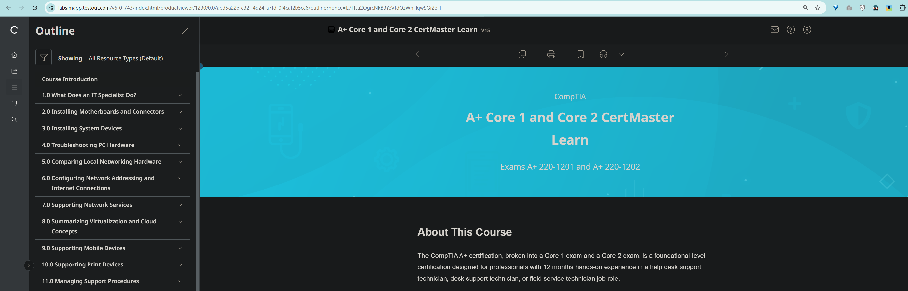

<!-- Custom stylesheet -->
<link rel="stylesheet" href="../../_css/main.css">

<!-- Site logo -->

> [🏚️ README](../../../README.md) | [📁 Courses](../../index.md) | [📚 Vocabulary](../../Vocabulary.md) | [🗓️ Assignments Schedule](../Assignments_Schedule.md) | [🔖 Bookmark](#bookmark)

> CIS 268 - Software Support - Fall 2026
### NOTES: A+ Core 1 and Core 2 CertMaster Learn:

# 🧩 0.0 Course Intro

> The following are part of the **CompTIA: A+ Core 1 and Core 2 CertMaster Learn** V15 learning platform
>
> Exams A+ 220-1201 and A+ 220-1202

## About This Course

The CompTIA A+ certification, broken into a Core 1 exam and a Core 2 exam, is a foundational-level certification designed for professionals with 12 months hands-on experience in a help desk support technician, desk support technician, or field service technician job role.

This course can benefit you in two ways. If you intend to pass the CompTIA A+ Core 1 and Core 2 (Exams 220-1201 and 220-1202) exams to receive an A+ certification, this course can be a significant part of your preparation. However, certification is not the only key to professional success in the field of IT support. Today's job market demands individuals have demonstrable skills, and the information and activities in this course can help you build your skill set so that you can confidently perform your duties in any entry-level IT support role.

The course content is broken down to cover both Core 1 and Core 2 objectives:

*   A+ Core 1 is covered in Modules 1-10.
    
*   A+ Core 2 is covered in Modules 11-22.
    

Upon course completion, you will be able to:

*   Define the role of an IT Specialist
    
*   Install Motherboards and Connectors
    
*   Install System Devices
    
*   Troubleshoot PC Hardware
    
*   Compare Local Networking Hardware
    
*   Configure Network Addressing and Internet
    
*   Support Network Services
    
*   Summarize Virtualization and Cloud Concepts
    
*   Support Mobile Devices
    
*   Support Print Devices
    
*   Manage Support Procedures
    
*   Configure Windows
    
*   Manage Windows
    
*   Support Windows
    
*   Secure Windows
    
*   Install Operating Systems
    
*   Support Other OS
    
*   Configure SOHO Network Security
    
*   Manage Security Settings
    
*   Support Mobile Software
    
*   Use Data Security
    
*   Implement Operational Procedures
    

## Course Design

This course is designed to optimize knowledge acquisition and skills development related to the learning objectives and related job task requirements through a learning progression model. The learning progression model follows a series of steps to contextualize, elaborate, provide relevance through practice and personalized feedback, contextualized application, and demonstrable evidence of skills gained.

Different activities throughout the course will help you practice and develop your skills as well as gauge your understanding of the various topics covered. The course is broken into modules and lessons. At the end of each module, a quiz will confirm your knowledge retention. Most modules also end with a challenge live lab to test your skills.

## Prerequisites

To ensure your success in this course, have a minimum of 12 months of hands-on experience in a help desk technician, desktop support technician, or field service technician job role. The prerequisites for this course might differ significantly from the prerequisites for the CompTIA certification exams. For the most up-to-date information about the exam prerequisites, visit this page: [https://www.comptia.org/en-us/certifications/a/](https://www.comptia.org/en-us/certifications/a/).

Notice:

Copyright © 2026 CompTIA, Inc. All Rights Reserved. Reference to any specific product, service, process, or method by trade name, trademark, manufacturer or otherwise on this website is for educational purposes only and does not constitute an implied or expressed recommendation or endorsement by said third party. CompTIA, Inc. does not have any affiliation with any of these companies, and the products and services advertised herein are not endorsed by them.

---

