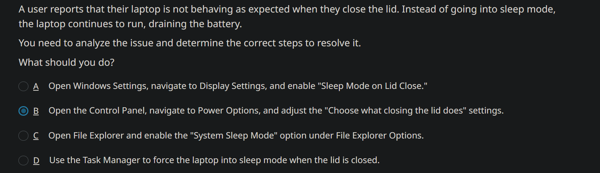
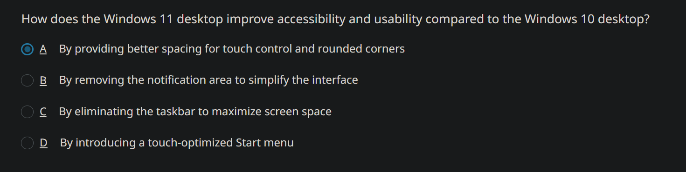
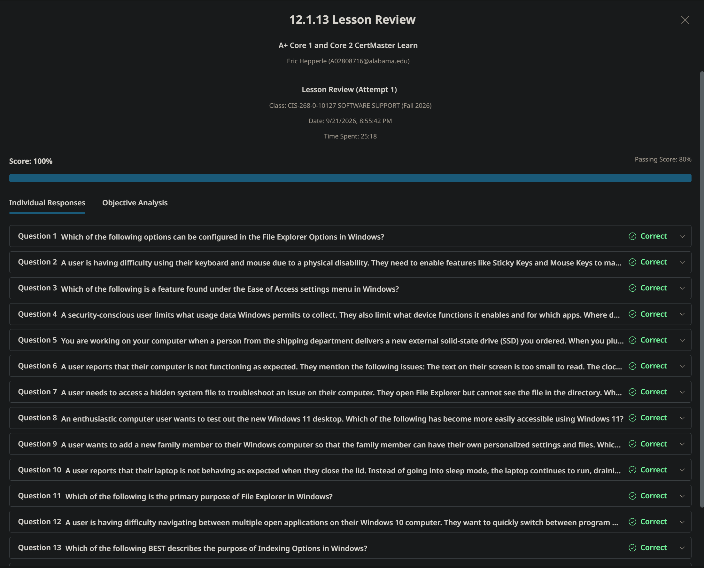

<!-- Custom stylesheet -->
<link rel="stylesheet" href="../../_css/main.css">

<!-- Site logo -->

> [🏚️ README](../../../README.md) | [📁 Courses](../../index.md) | [📚 Vocabulary](../../Vocabulary.md) | [🗓️ Assignments Schedule](../Assignments_Schedule.md) | [🔖 Bookmark](#bookmark)

> CIS 268 - Software Support - Fall 2026
>### NOTES: A+ Core 1 and Core 2 CertMaster Learn:
>
> The following are part of the **CompTIA: A+ Core 1 and Core 2 CertMaster Learn** V15 learning platform
>
> Exams A+ 220-1201 and A+ 220-1202

# 🧩 12.1 Configuring Windows (cont.)

## 🟣 12.1.13 Lesson Review

#PROOF - 100%

---

