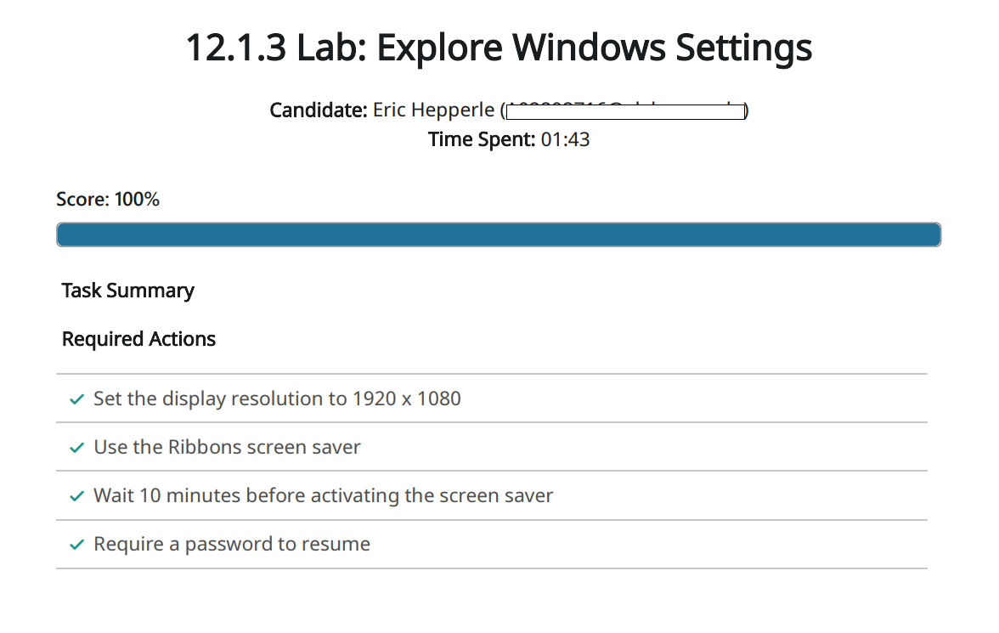

<!-- Custom stylesheet -->
<link rel="stylesheet" href="../../_css/main.css">

### CIS 268 - Software Support

>  Week 4 - Windows User Configuration (Sept 7 - 14)

# LAB — 12.1.3 Explore Windows Settings

You recently purchased a new monitor for your desktop computer system. Your old monitor used a display resolution of 1280 x 720. However, your new monitor uses a much higher display resolution. You need to change your display settings in Windows to match what is supported by the monitor.

To protect your new monitor, you want the screen saver to come on after the system has been idle for a brief period of time. In addition, you want to require the user to log in before the screen saver will deactivate.

Your task in this lab is to:

*   Set the display resolution to **1920 x 1080**.
*   Set the screensaver to **Ribbons**.
*   Configure the screensaver to activate after the system has been idle for **10** minutes.
*   Require the user to log on before resuming.

To set the display resolution:

1.  Right-click the desktop, then select **Display Settings**.
2.  Choose the desired resolution from the Display resolution dropdown.
3.  When prompted, select **Keep Changes**. _Note that the resolution of the simulated environment will not visibly change_.

To set a screensaver:

1.  On the left side of the Settings dialog box, select **Personalization**.
2.  Select **Lock Screen**, then **Screen Saver**.
3.  Select a screen saver from the dropdown.
4.  Set the amount of time to wait before the screen saver turns on.
5.  Check the option to display the logon screen when the user resumes activity.
6.  Select **OK**.

---

# RESULTS

#PROOF

