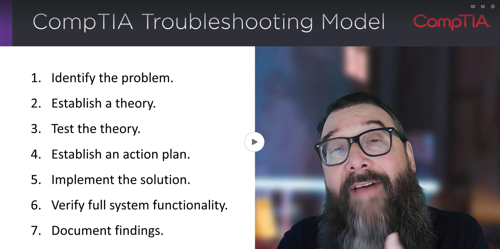

<!-- Custom stylesheet -->
<link rel="stylesheet" href="../../_css/main.css">

<!-- Site logo -->

> [🏚️ README](../../../README.md) | [📁 Courses](../../index.md) | [📚 Vocabulary](../../Vocabulary.md) | [🗓️ Assignments Schedule](../Assignments_Schedule.md) | [🔖 Bookmark](#bookmark)

# CIS 268 - Software Support:    NOTES: Week 2 - IT Support Fundamentals (Aug 24 - 31)

## ⭐ **This week, you will:**

* [x]  Review the role and responsibilities of an IT support technician.
* [x]  Learn and apply the CompTIA troubleshooting methodology.

**To do this week:**

* [x]  Complete all assigned lessons and assignment.

**By the end of this week, you should be able to:**

* [x]  Apply a structured troubleshooting process.

- - -

## 📖 LEARN

> The following are part of the **CompTIA: A+ Core 1 and Core 2 CertMaster Learn** V15 learning platform

### 🟣 1.1 - The Hero of Problem Solving

#CASE_STUDY:

> It's your first day walking into the office, and you've already had three problems to solve. The receptionist, Aurora, is asking for help connecting their laptop to their email account. Two other colleagues are asking why the database server will not connect to their desktop systems. "The Internet must be down," Jim from accounting says. These are just a few examples of issues that you may be asked to solve for your company. Understanding what your role is as an IT specialist and how you can provide timely solutions that ultimately enable the company to continue to move forward with their projects can be time-consuming but also rewarding.

#### 1.1.1 Role of an IT Specialist

**Types of tasks IT specialists do:**

- fixing issues with user login credentials
- configuring the network to support more users
- (more listed in the cases studies)

IT specialists can expect a dynamic and variable work environment daily

#CASE_STUDY

> For example, when a company purchases a new server or printer for the organization, they will rely on an IT specialist to unpack, set up, and configure the system for operations. They may even require you to provide training to other employees on how to use the new server or printer. The new printer may also come with new software that must be installed by you in order to ensure the printer works correctly and users can access all the features of the printer.

#CASE_STUDY

> IT specialist will also be called upon to provide support to existing systems and applications. From performing a memory upgrade on the server to improve its performance or replacing a hard drive that decided to fail, you can expect to spend a good portion of your time responding to problems and issues facing your users. Some of these issues may be a quick fix, while others may take several technicians many hours to resolve. This direct support of the organization's IT systems will also include ensuring those systems and data remain secure from users who are not authorized access.

### 🎬 Intro to IT Support

#DAY_IN_THE_LIFE: Entry Level IT Support Professional

**Things You'll Do**

- Helping people resolve common IT problems
- Solve tech issues, computer hardware & software problems
- Installing new software
- Walking people through training
- helping fix devices

**What your title could be**

- IT Support Specialist
- IT Support Technician
- Help Desk Technician
- Tier 1 Support - First line of defense - troubleshoot on a basic level

**How a typical day looks**

- logging in and setting up the apps you'll need
- support tix via email, phone, chat
- help internal or external users

**Types of Questions You May Get**

- Specific applications
- Network connectivity
- software updates / installation
- troubleshooting household IT products

- "I can't open a program - can you help?"
- "I'm having trouble with my internet connection"

**When a ticket comes in**

- Simple fix
- complex fix, may need to dig in database of known issues

MOST IT SUPPORT JOBS REQUIRE COMPTIA IT SUPPORT CERT

- Soft skills are critical
- Walk use through step by step

---

#### 1.1.2 Skills & Abilities

- Very broad skillset
- Can be specific to the company you work for

> "*A great IT specialist should be able to problem solve, communicate effectively, be organized in their communications and within their workspace, and utilize their technical acumen to provide solutions.*"

> - **technical acumen**

**Problem Solving**

- Identify problem
- Establish theory of **probable cause**

> - 🔑 #Key: Understanding the company's network config, policies, and practices

#CASE_STUDY

> A user reports that their computer is not working, and they need it right now to complete a project. When talking with the user, you learn that the computer is on and functioning. However, the project application is not able to locate the file the user is trying to open. You click the mouse and attempt to use the keyboard, but it seems the application is just not able to find the file.
>
>To determine what may be causing the issue, you begin to think about how this application is installed on the local computer and how the files the user is trying to access are located on a server across town at the company's headquarters. You brainstorm that the problem might be that the network connection between your building and the headquarters building is not working.
>
>You run a connection test and find that the headquarters building is currently experiencing a power outage. You then explain to the user that the file they need is on the file server across town, but there is no power at that location. Therefore, the server cannot be accessed. You suggest that the user inform their supervisor of the problem and tell them that you will contact them once power has been restored at headquarters to ensure they can access the file.

> - 🔑 #Key: Great problem solvers establish a step-by-step process to use for every issue they asked to resolve; a reusable process

> - 📌 #TIP: Being conistent with your problem-solving process ensures you don't miss something easy by skipping steps

> - **SOP**: standard operation procedure; some companies establish these as set problem-solving processes set in place by management; customized to each orgs IT environment; ensures repeatable process is followed by all technicians.

> - 📌 #TIP: a great IT specialist will also consider potential causes and solutions that have not been considered before. By **thinking outside the box**, you may find a solution that works more effectively for you and the organization.

>- **Electronic trouble ticket system**: use solution to a previous issue to a newly reported problem

- Requires lifelong learning

> "_While you may not be expected to be the expert on all things IT-related, you will be expected to conduct research and work to keep expanding your knowledge level. Becoming a lifelong learner is a byproduct of being in the IT field, with existing systems being upgraded and expanded and new technology being developed every day._"

- IT specialists require a lot of different skills to be great in their role. From understanding the technical content and infrastructure to effective oral and written communication, a great technician must obtain these skills and abilities to ensure they are both effective and efficient at solving the IT issues that organizations face today.

### 🟣 1.2 - The Troubleshooting Methodology

To some extent, being an effective troubleshooter simply involves having a detailed knowledge of how something is supposed to work and the sort of things that typically go wrong. However, the more complex a system is, the less likely it is that this sort of information will be at hand. Consequently, it is **important to develop general troubleshooting skills to approach new and unexpected situations confidently.**

> - 🔑 #Key: important to develop GENERAL TROUBLESHOOTING SKILLS

#### Learning Outcomes

As you study this lesson, answer the following questions:

- What is the troubleshooting methodology?
- Why would a technician want to utilize a process to troubleshoot?

#### 1.2.1 Best Practice Methodology

- Troubleshooting **starts** with a **process of problem solving** 
- problems have **causes**, **symptoms**, and **consequences**. For example:

- A computer system has a fault in the hard disk drive (cause).
- Because the disk drive is faulty, the operating system is displaying a "blue screen" (symptom).
- Because of the fault, the user cannot do any work (consequence).

**Business Point of View**

#BUISNESS_NEEDS #CASE_STUDY

From a **business point of view**, **resolving the consequences or impact of the problem is more important than solving the original cause**. For example, the most effective solution might be to provide the user with another workstation, then get the drive replaced.

**Severity Level & Priorty**

Problems also need to be dealt with according to priority and severity. The disk issue affects a single user and cannot take priority over issues with wider impact, such as a data center suddenly losing power.

**Symptom of a Larger Problem**

It is also important to realize that the cause of a specific problem might be the **symptom of a larger problem**. This is **particularly true if the same problem recurs**. For example, you might ask why the disk drive is faulty; is it a one-off error, or are there problems in the environment, supply chain, and so on?

**Best Practice Methodologies**

#BEST_PRACTICE

These issues mean that the troubleshooting procedures should be developed in the context of best practice methodologies and approaches. One such best practice framework is CompTIA's troubleshooting model, or methodology.

## **🧭 THE ACTUAL METHODOLOGY MODEL:**

1. 🔎 Identify the problem:
    1.  Gather information from the user, identify user changes, and, if applicable, perform backups before making changes.
        
        1.  Begin documentation of the problem. Update as necessary throughout the full process.
        
    2.  Inquire regarding environmental or infrastructure changes.
2. 🔎 Establish a theory of probable cause (question the obvious):
    1.  If necessary, conduct external or internal research based on symptoms.
3. 🔎 Test the theory to determine the cause:
    1.  Once the theory is confirmed, determine the next steps to resolve the problem.
    2.  If the theory is not confirmed, reestablish a new theory or escalate.
4. 🔎 Establish a plan of action to resolve the problem and implement the solution:
    1.  Refer to the vendor’s instructions for guidance.
5. 🔎 Verify full-system functionality and, if applicable, implement preventive measures.
6. 🔎 Document the findings, lessons learned, actions, and outcomes.

#### 1.2.2 Identify the Problem

🚀 The troubleshooting process starts by **identifying the problem**. Identifying the problem means establishing the consequence or impact of the issue and listing symptoms. The consequence can be used to prioritize each support case within the overall process of problem management.

## Gather Information from the User

**The first report of a problem will typically come from a user or another technician**, and this person will be one of the best sources of information if you can ask the right questions. Before you begin examining settings in Windows or taking the PC apart, spend some time **gathering information from the user** about the problem. Ensure you ask the user to describe _all_ the circumstances and symptoms. Some good questions to ask include:

*   What are the exact error messages appearing on the screen or coming from the speaker?
    
*   Is anyone else experiencing the same problem?
*   How long has the problem been occurring?
*   What changes have been made recently to the system? Were these changes initiated by you or via another support request?
*   If something worked previously, then **experiences** mechanical failures, are there any changes made by the user or from **environmental or infrastructure change**?
*   Have you tried anything to solve the problem?

## 💾 Perform Backups

Consider the importance of data stored on the local computer when you open a support case. Check when a **backup** was last made. If a backup has not been made, perform one before changing the system configuration, if possible.

> - ⚠️ #GOTCHA: Always perform backups of user's system before changing the system config, where possible

---

#### 1.2.3 Establish and Test a Theory

> - **severity**: how many users are affected

> - **diagnose**: identify the symptoms

- With all problems, run through a list of possibilities for deciding on a probable cause

> - **intermittent problems**: cannot be repeated reliably; often transitory and hardest to troubleshoot

---

If you obtain accurate answers to your initial questions, you will have determined the severity of the problem (how many are affected), a rough idea of what to investigate (hardware or OS, for instance), and whether to consider the cause as deriving from a recent change, an oversight in the initial configuration, or some unexpected environmental or mechanical event.

You diagnose a problem by identifying the symptoms. By knowing what causes such symptoms, you can consider possible causes to determine the probable cause and then devise tests to show whether it is the cause or not. If you switch your television on and the screen remains dark, you could ask yourself, "Is the problem in the television? Has the fuse blown? Is there a problem at the broadcasting station rather than with my television?" With all problems, we run through a list of possibilities before deciding. The trick is to do this methodically (so that possible causes are not overlooked) and efficiently (so that the problem can be solved quickly).

## Conduct Research

You cannot always rely on the user to describe the problem accurately or comprehensively. You may need to use research techniques to identify or clarify symptoms and possible causes. One of the most useful troubleshooting skills is being able to perform research to find information quickly. Learn to use web and database search tools so that you can locate information that is relevant and useful. Identify different knowledge sources available to you. When you research a problem, be aware of both internal documentation and information and external support resources, such as vendor support or forums.

*   **Physical Inspection:** Make a physical inspection; look and listen. You may be able to see or hear a fault (scorched motherboard, "sick"-sounding disk drive, no fan noise, and so on).
    
*   **Issue Reproduction:** If the symptoms of the problem are no longer apparent, a basic technique is to reproduce the problem; that is, repeat the exact circumstances that produced the failure or error. Some problems are intermittent, though, which means that they cannot be repeated reliably. Issues that are transitory or difficult to reproduce are often the hardest to troubleshoot.
*   **System Documentation:** Check the system documentation, installation and event logs, and diagnostic tools for useful information.
*   **Other Techs:** Consult other technicians who might have worked on the system recently or might be working now on some related issue. Consider that environmental or infrastructure changes might have been instigated by a different group within the company. Perhaps you are responsible for application support, and the network infrastructure group has made some changes without issuing proper notice.
*  **Vendor Docs & Web Search:** Consult vendor documentation and use web search and forum resources to see if the issue is well-known and has an existing fix. **#KNOWN_ISSUE**

> - ⚠️ #GOTCHA:  Environmental or infrastructure changes might have been instigated by a different group within the company

---

#### 1.2.4 Question the Obvious

As you identify symptoms and diagnose causes, take care not to overlook the obvious; sometimes seemingly intractable problems are caused by the simplest things. Diagnosis requires both attention to detail and a willingness to be systematic.

**Step through What SHOULD Happen**

One way to consider a computer problem systematically is to step through what should happen, either by performing the steps yourself or by observing the user. Hopefully, this will identify the exact point at which there is a failure or error.

**Break Process into Categories**

If this approach does not work, break the troubleshooting process into compartments or categories, such as power, hardware components, drivers/firmware, software, network, and user actions. If you can isolate your investigation to a particular **subsystem** by ***eliminating non-causes***, you can troubleshoot the problem more quickly. For example, when troubleshooting a PC, you might work as follows:

1.  Decide whether the problem is hardware or software related.
2.  Decide which hardware subsystem is affected, including the hard drive, power supply, and random access memory.
3.  Decide whether the problem is in the physical disk unit or the connectors and cabling. With software issues, you may want to uninstall and then reinstall the software or perform a repair of the file system.
4.  Test your theory.

> - **subsystem**: a system that is complete in itself, but is part of a larger system; ex: an alternator has its own inputs and outputs but is part of an automotive ignition system, which itself is part of entire automobile

> - 📌 #TIP: A basic technique when troubleshooting a cable, connector, or device is to have a "known good" duplicate on hand. This is another copy of the same cable or device that you know works that you can use to test by substitution.

> - **known good duplicate:** a duplicate of the component you suspect is malfunctioning within a system; ex: test a suspected-faulty monitor cable by replacing with a known good cable -- if it works then you've correctly identified the cable as the problem.

> - ⚠️ #GOTCHA: Be careful not to overlook the obvious

> - 📌 #TIP: Diagnosis requires **attention to detail** and willingness to be **systematic**

#### 1.2.5 Establish a New Theory or Escalate

#BUSINESS_NEEDS

If your theory is not proven by the tests you make or the research you undertake, you must **establish a new theory**. If one does not suggest what you have discovered so far, there may be more lengthy procedures you can use to diagnose a cause. Remember to assess business needs before embarking on very lengthy and **possibly disruptive** tests. Is there a simpler workaround that you are overlooking?

> - ⚠️ #GOTCHA: Is there a SIMPLER workaround that you are overlooking?

If a problem is particularly intractable, you can take the system down to its **base configuration** (the minimum needed to run). When this works, you can then add peripherals and devices or software subsystems one by one, testing after each, until eventually the problem is located. This is time-consuming but may be necessary if nothing else provides a solution.

> - 📌 #TIP: For especially stubborn issues, try taking system down to a minimal base config only; eg: booting Windows OS in "safe mode"; if base config works, incrementally add systems/components back until it breaks; tradeoff: time-consuming.

If you cannot solve a problem yourself, it is better to use issue escalation than to waste a lot of time trying to come up with an answer. Formal escalation routes depend on the type of support service you are operating and the terms of any warranties or service contracts that apply. Some generic escalation routes include:

> - **escalation:** In the context of support procedures, incident response, and breach-reporting, escalation is the process of **involving expert and senior staff** to assist in problem management.

> - 📌 #TIP: If you can't solve a problem yourself, it is beter to escalate the issue than **waste a lot of time trying to come up with an answer**.

> - **formal escalation routes:** structured step-by-step pathways used to route unresolved issues, conflicts, or critical incidents to higher levels of authority or specialized teams

*   **Senior technical and administrative staff**, subject matter experts (SMEs), and developers/programmers within your company.
*   **Suppliers and manufacturers** (vendors) via warranty and support contracts and helplines or web contact portals.
*   Other support contractors/consultants, websites, and social media.

> - ⚠️ #GOTCHA: Obtain authorization to use social media or public forums. Do not disclose proprietary, confidential, or personal information when discussing an issue publicly.

Choosing whether to escalate a problem is complex because you must balance the need to resolve a problem in a timely fashion against the possibility of incurring additional costs or adding to the burdens that senior staff are already coping with. You should be guided by policies and practices in the company you work for. When you escalate a problem, make sure that what you have found out or attempted so far is documented. After that, describe the problem clearly to whoever takes over or provides you with assistance.

> - ⚠️ #GOTCHA: "*Choosing whether to escalate a problem is complex because you must balance the need to resolve a problem in a timely fashion against the possibility of incurring additional costs or adding to the burdens that senior staff are already coping with.*"

> - 📌 #TIP: When you escalate a problem, make sure that what you have found out or attempted so far is **documented**

#### 1.2.6 Implement a Plan of Action

When you have a reliable theory of probable cause, you then need to determine the **next steps to solve the problem**.

Troubleshooting is not just a diagnostic process. Devising and implementing a plan to solve the problem requires effective decision-making. Sometimes, there is no simple solution. There may be several solutions, and which is best might not be obvious. An apparent solution might solve the symptoms of the problem but not the cause. A solution might be impractical or too costly. Finally, a solution might be the cause of further problems, which could be even worse than the original problem.

> - ⚠️ #GOTCHA: An apparent solution might solve the symptoms of the problem but not the cause

There are typically three generic approaches to resolving an IT problem:

*   **Repair**: You need to determine whether the cost of repair makes this the best option.
*   **Replace:** This is often more expensive and may be time-consuming if a part is not available. There may also be an opportunity to upgrade the part or software.
*   **Workaround**: Not all problems are critical. If neither repair nor replacement is cost-effective, it may be best to either find a workaround or just document the issue and move on.

> - 📌 #TIP: If a part or system is under warranty, you can return the broken part for a replacement. To do this, you normally need to obtain a returned materials authorization (RMA) ticket from the vendor.

> - **RMA**: return materials authorization; obtain from vendor

## Establish a Plan of Action

>- **plan of action**: the steps to implement a proposed solution

> - ⚠️ #GOTCHA: ALWAYS seek proper authorization before implementing any plan of action

When you determine the best solution, you must devise a **plan of action** to put the solution in place. You have to assess the resources, time, and cost required. Another consideration is potential **impacts** on the rest of the system that your plan of action may have. A typical example is applying a software patch, which might fix a given problem but cause other programs not to work.

An effective [**change and configuration management system**](02__aigen_vocab__it-change-mgt.md) will help you to understand how different systems are interconnected. You must seek the proper authorization for your plan and conduct all remedial activities within the constraints of **corporate policies and procedures**.

## Implement the Solution

If you do not have authorization to implement a solution, ***you will need to escalate the problem to more senior personnel***. If applying the solution is disruptive to the wider network or business, you also need to consider the most appropriate time to schedule the reconfiguration work and plan how to notify other network users.

When you make a change to the system as part of **implementing a solution**, test after each change. If the change does not fix the problem, reverse it and then try something else. If you make a series of changes without recording what you have done, you could find yourself in a tricky position.

> - 📌 #TIP: Remember that troubleshooting involves more than fixing a particular problem; it is about ***maintaining the resources that users need to do their work***.

## Refer to Vendor Instructions

If you are completing troubleshooting steps **under instruction** from another technician—the vendor's support service, for instance—make sure you properly understand the steps you are being asked to take, especially if it requires disassembly of a component or reconfiguration of software that you are not familiar with.

---

#### 1.2.7 Verify and Document

When you apply a solution, test that it fixes the reported problem and that the **system as a whole continues to function normally**. Tests could involve any of the following:

*   **Trying to use a component** or performing the activity that prompted the problem report
*   **Inspecting a component** to see whether it is properly connected or damaged or whether any status or indicator lights show a problem
*   **Disabling or uninstalling the component** (if it might be the cause of a wider problem)
*   **Consulting logs and software tools** to confirm a component is configured properly
*   **Updating software** or a device driver

Before you can consider a problem closed, you should both be satisfied in your own mind that you have resolved it and get the customer's acceptance that it has been fixed. Restate what the problem was and how it was resolved, and then confirm with the customer that the **incident log** can be closed.

> - 📌 #TIP: Get customer's acceptance that the issue has been fixed before closing the ticket

## Implement Preventive Measures

To fully solve a problem, you should implement **preventive measures**. This means eliminating any factors that could cause the problem to reoccur. For example, if the power cable on a PC blows a fuse, you should not only replace the fuse, but you should also check to see if there are any power problems in the building that may have caused the fuse to blow in the first place. If a computer is infected with a virus, ensure that the antivirus software is updating itself regularly and users are trained to avoid malware risks.

## Document Findings, Lessons Learned, Actions, and Outcomes

Most troubleshooting takes place within the context of a **ticket system**. This shows who is responsible for any particular problem and what its status is. This gives you the opportunity to add a complete description of the problem and its solution (**findings, lessons learned, actions, and outcomes**).

This is very useful for future troubleshooting, as problems fitting into the same category can be reviewed to see if the same solution applies. Troubleshooting steps can be gathered into a "**Knowledge Base**" or **Frequently Asked Questions (FAQ)** of support articles. They also help to analyze IT infrastructure by gathering statistics on what types of problems occur and how frequently.

> - **IT infrastructure:** hardware, software and networking components enterprises rely on to manage and run their IT environments effectively [IBM.com](https://www.ibm.com/think/topics/infrastructure)

The other value of a log is that it **demonstrates what the support department is doing to help the business**. This is particularly important for **third-party support companies**, who **need to prove the value achieved in service contracts**. When you complete a problem log, remember that people other than you may come to rely on it. Also, logs may be presented to customers as proof of troubleshooting activity. Write clearly and concisely, checking for spelling and grammar errors.

---

### 🎬 1.3.1 Troubleshooting Methodology

> - 📌 #TIP: Replacing a user's device with a loaner can often be part of a good plan of action

### 1. Identify the problem

### 2. Establish a Theory

### 3. Test the Theory

### 4. Establish an Action Plan

### 5. Implement the Solution

### 6. Verify Full System Functionality

### 7. Document Findings

> - 📌 #TIP: Take advantage of opportunities to have teaching moments with clients/users when you can

-------

## 💻 APPLY

