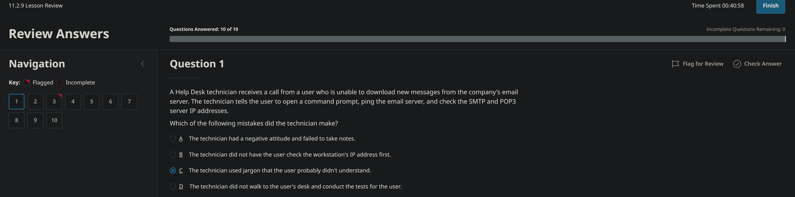
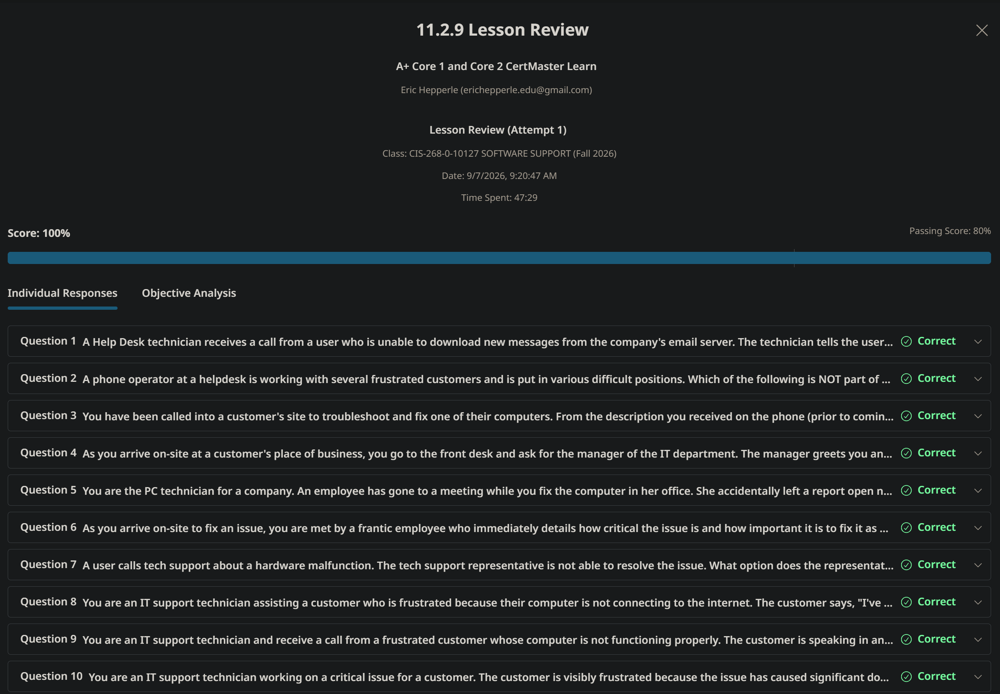
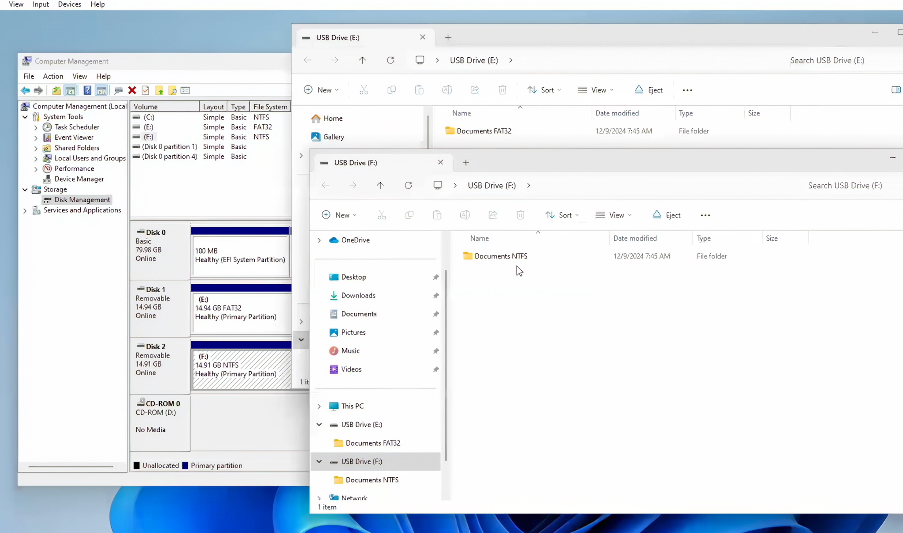
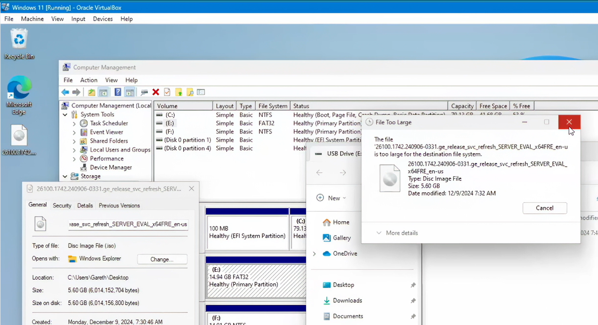
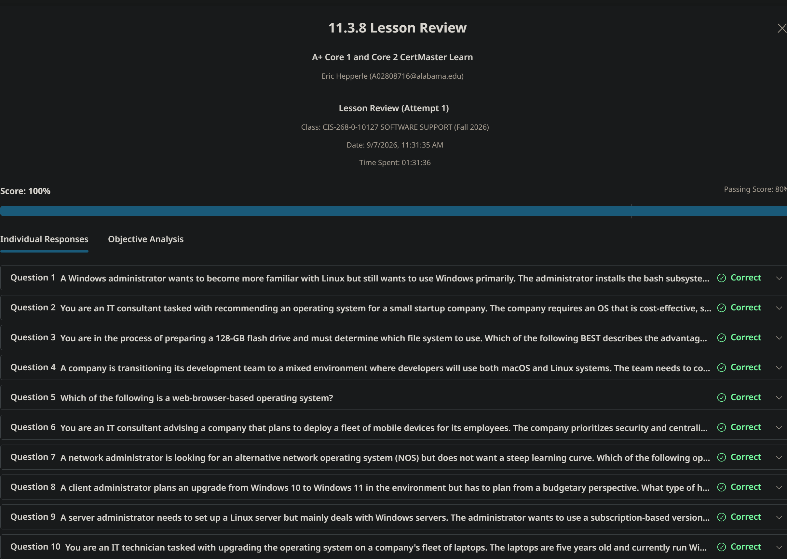
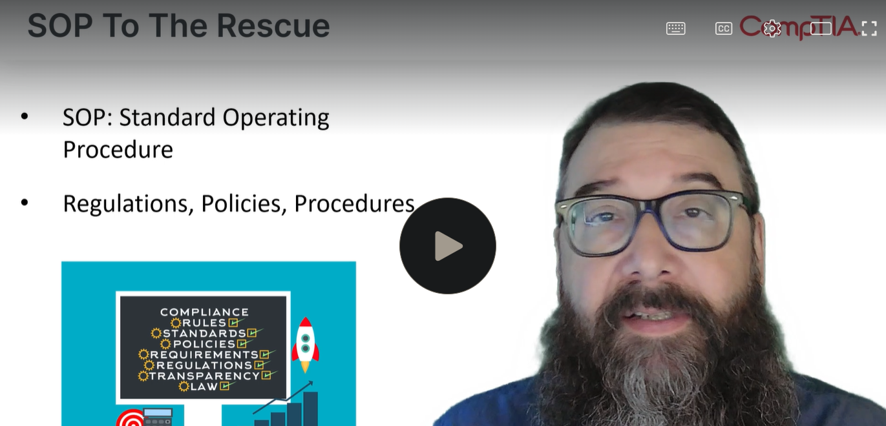
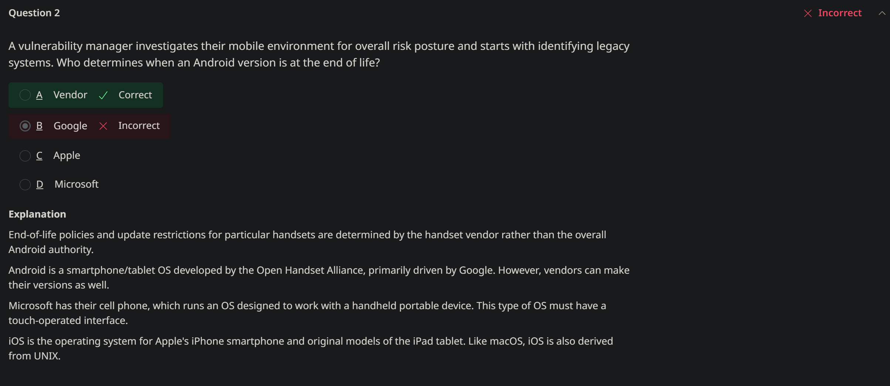
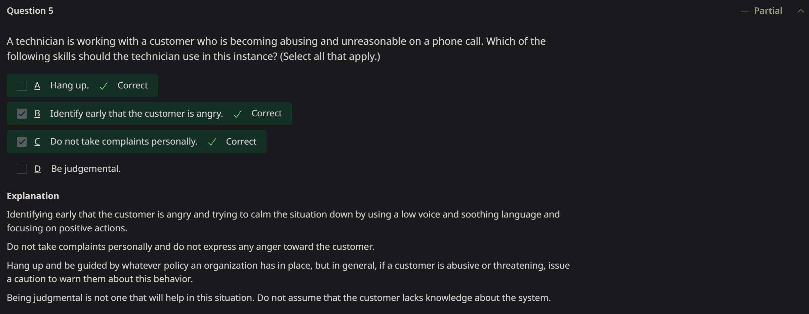
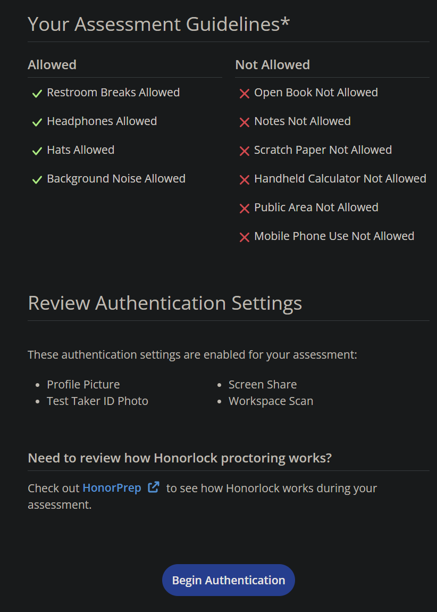
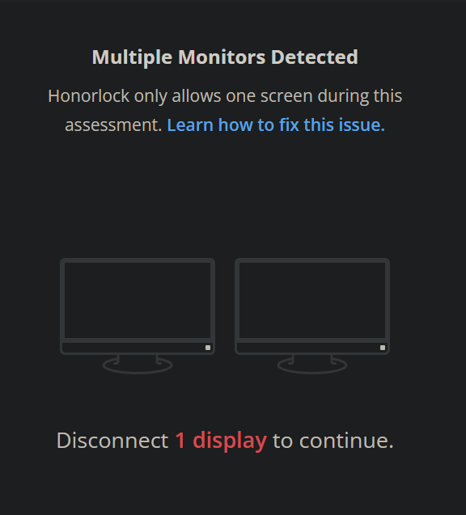

<!-- Custom stylesheet -->
<link rel="stylesheet" href="../../_css/main.css">

<!-- Site logo -->

> [🏚️ README](../../../README.md) | [📁 Courses](../../index.md) | [📚 Vocabulary](../../Vocabulary.md) | [🗓️ Assignments Schedule](../Assignments_Schedule.md) | [🔖 Bookmark](#bookmark)

# CIS 268 - Software Support:    NOTES: Week 3 - IT Support Fundamentals (Aug 31 - Sept 7)

# ➡️ Week 3

## **Focus:** Professional Practices

**This week, you will:**

*   Study professionalism, documentation, ticketing systems, and escalation procedures.
*   Review operating system types and basic compatibility concepts.
*   Submit the proctored quiz.

**To do this week:**

*   Complete all assigned lessons and assignment.
*   Complete proctored quiz.

**By the end of this week, you should be able to:**

*   Communicate professionally with end users.
*   Accurately document and escalate support issues.

---

> The following are part of the **CompTIA: A+ Core 1 and Core 2 CertMaster Learn** V15 learning platform

> **#CLARIFICATION:** Whenever the `#CORRECT` hashtag is used, that's me marking what I THINK is the correct answer — it should NOT be taken to mean it IS the correct answer without verification.

## 📖 Module 11.0 Managing Support Procedures

### 🟣 Lesson 11.0

Support for customers and clients provides an interesting dynamic to working as an IT specialist. Every issue is something new to learn and resolve. While the issues change, the process by which we resolve them should not vary much issue to issue. Imagine you have been assigned to resolve an issue with an employee's laptop. This employee works remotely in another time zone, and you will need to rely on email and phone conversations to work through the troubleshooting steps. Ensuring that you communicate efficiently and effectively will be key to handling the issue as a professional.

As you work through the process, you will also need to ensure you are documenting the steps you have taken and the results of any test you have run. In some cases, the problem will not be resolved in the same day and other team members may need to continue to find a solution after your shift ends. Tracking and documentation of steps taken thus far allows them to continue the process rather than starting all over again with the issue. Understanding which application you are working with and ensuring the correct operating system has been identified will be helpful in finding a resolution as well.

> Prepare for A+ Core 2 by:
> 
> *   Understanding industry best practices in support documentation
> *   Understanding and use professional communication
> *   Identifying various operating systems and their uses

---

### 🟣 Lesson 11.1 Documentation

Core 2 Exam Objectives Covered

*   4.1 Given a scenario, implement best practices associated with documentation and support systems information management.
*   4.6 Explain the importance of prohibited content/activity and privacy, licensing, and policy concepts.(Acceptable Use Policy)

You are nearing the end of your work shift at the data center. You have been working frantically to resolve an outage of a hosted application for a customer. After working through the initial documentation and collecting details of the issues, you now are at a point where you need to think about handing this issue over to someone on the next support shift.

You log into the support ticket system and begin making notes about what you have done to troubleshoot the issue so far. You have rebooted the server, ensured a network connection has been established, and were planning on testing the application to ensure the right version was installed on the server. Since we cannot work 24 hours a day, seven days a week, your documentation of your steps will allow the next shift to pick up where you left off and continue to work toward a solution.

## Learning Outcomes

As you study this lesson, answer the following questions:

*   What is an SOP and how is it different from a policy?
    
*   How do ticketing systems assist in documentation of issues?
    
*   How are support tickets prioritized?
    
*   What are the characteristics of good documentation?

---

### 🟣 11.1.1 Standard Operating Procedure

Employees must understand how to use computers and networked services securely and safely and be aware of their responsibilities. To support this, the organization needs to create written policies and procedures to help staff understand and fulfill their tasks and follow best practices:

*   A policy is an overall statement of intent.
*   A Standard Operating Procedure (SOP) is a step-by-step list of the actions that must be completed for any given task to comply with policy. Most IT procedures should be governed by SOPs.
*   Guidelines are for areas of policy where there are no procedures, either because the situation has not been fully assessed or because the decision-making process is too complex and subject to variables to be able to capture it in an SOP. Guidelines may also describe circumstances where it is appropriate to deviate from a specified procedure.

Typical examples of SOPs are as follows:

*   Procedures for custom installation of software packages, such as verifying system requirements, validating download/installation source, confirming license validity, adding the software to change control/monitoring processes, and developing support/training documentation
*   New-user setup checklist as part of the onboarding process for new employees and employees changing job roles. Typical tasks include identification/enrollment with secure credentials, allocation of devices, and allocation of permissions/assignment to security groups
*   End-user termination checklist as part of the offboarding process for employees who are retiring, changing job roles, or have been fired. Typical tasks include returning and sanitizing devices, releasing software licenses, and disabling account permissions/access

---

### 🟣 Service Level Agreements

Service level agreements (SLAs) define the level of service requirements from an internal department or external, third-party vendor. Examples of services that most likely have an SLA in place include:

*   Internal departments of the company that are providing resources to one another such as access to hardware resources; a company's maintenance department may also have a SLA that details how they are to provide support to the other departments within the company when it comes to building maintenance, etc.
    
*   External agreements will normally be provided by the ISP as to the metrics of throughput they will provide a company for the internet connection; a cloud service provider will also have a SLA in place that details the service delivery metrics of the organizations cloud resources.
    

SLAs normally include a description of the service being provided, along with the metrics that are used to measure the level of service being provided. In some cases, the SLA may dictate the expected up time, when the service is available, and what is not considered down time (service not available) for the service. The Rule of Nines is a very popular metric used for this purpose.

Rule of 4 Nines means the service or system will be available 99.99% of the time. This allows for a maximum of 52 minutes of downtime per year. Whereas a service with the Rule of 11 Nines means the service will be up 99.999999999% of the time, would only be allowed 315.58 microseconds of downtime.

The Rule of Nines can also be used to calculate the durability of file and data storage services. The Rule of 11 Nines for durability means that even with 1 billion objects in storage, you would be able to go 100 years without losing a single object.

Should the delivery metrics not be met by the provider, the SLA will detail the recourse process to make a complaint against the service provider. It may also detail the amount of money the customer may be able to recover since the service is not meeting the requirements of the SLA.

---

### 🟣 11.1.3 Incident and Ticketing Systems

A ticketing system manages requests, incidents, and problems. Ticketing systems can be used to support both internal end-users and external customers.

The general process of ticket management is as follows:

1.  A user contacts the help desk, perhaps by phone or email, or directly via the ticketing system.
    
    A unique job ticket ID is generated, and an agent is assigned to the ticket. The ticket will also need to capture some basic details:
    
    *   User information: The user’s name, contact details, and other relevant information, such as department or job role. It might be possible to link the ticket to an employee database or customer relationship management (CRM) database.
    *   Device information: If relevant, the ticket should record information about the user’s device. It might be possible to link to the relevant inventory record via a service tag or asset ID.
    
2.  The user supplies a description of the issue.
    
    The agent might ask clarifying questions to ensure an accurate initial description.
    
3.  The agent categorizes the support case, assesses how urgent or severe it is, and determines how long it will take to fix.
4.  The agent may take the user through initial troubleshooting steps. If these do not work, the ticket may be escalated to deskside support or a senior technician.

Figure 1. Defining help-desk categories in the osTicket ticketing system  
  

Screenshot courtesy of osTicket.com.

Description

A table below lists the help topics with status, type, priority, department, last updated, and created.

---

### 🟣 11.1.4 Categories and Severity

## Categories

Categories and subcategories group related tickets together. This is useful for assigning tickets to the relevant support section or technician and for reporting and analysis.

Service management standards distinguish between the following basic ticket types:

*   Requests are for provisioning things that the IT department has a SOP for, such as setting up new user accounts, purchasing new hardware or software, deploying a web server, and so on. Complex requests that aren't covered by existing procedures are better treated as projects rather than handled via the ticketing system.
*   Incidents are related to any errors or unexpected situations faced by end-users or customers. Incidents may be further categorized by severity (impact and urgency), such as minor, major, and critical.
*   Problems are causes of incidents and will probably require analysis and service reconfiguration to solve. This type of ticket is likely to be generated internally when the help desk starts to receive many incidents of the same type.

Using these types as top-level categories for an end-user facing system is not always practical, however. End-users are not likely to know how to distinguish incidents from problems, for example. Devising categories that are narrow enough to be useful but not so numerous as to be confusing or to slow down the whole ticketing process is a challenging task.

One strategy is for a few simple, top-level categories that end-users can self-select, such as New Device Request, New App Request, Employee Onboarding, Employee Offboarding, Help/Support, and Security Incident. Then, when assigned to the ticket, the support technician can select from a longer list of additional categories and subcategories to help group related tickets for reporting and analysis purposes. Alternatively, or to supplement categories, the system might support adding standard keyword tags to each ticket. A keyword system is more flexible but does depend on each technician tagging the ticket appropriately.

---

### 🟣 11.1.5 Ticket Management

After opening an incident or problem ticket, the troubleshooting process is applied until the issue is resolved. At each stage, the system must track the ownership of the ticket (who is dealing with it) and its status (what has been done).

This process requires clear written communication and might involve tracking through different escalation routes.

## Escalation Levels

Escalation occurs when an agent cannot resolve the ticket. Some of the many reasons for escalation include:

*   The incident is related to a problem and requires analysis by senior technicians or by a third-party/warranty support service.
    
*   The incident severity needs to be escalated from minor to major or major to critical and now needs the involvement of senior decision-makers.
*   The incident needs the involvement of sales or marketing to deal with service complaints or refund requests.

The support team can be organized into tiers to clarify escalation levels. For example:

*   Tier 0 presents self-service options for the customer to try to resolve an incident via advice from a knowledge base or "help bot." A knowledge base is a collection of FAQs and common troubleshooting procedures that a user can refer to before filing a trouble ticket.
    
*   Tier 1 connects the customer to an agent for initial diagnosis and possible incident resolution.
*   Tier 2 allows the agent to escalate the ticket to senior technicians (Tier 2 – Internal) or to a third-party support group (Tier 2 – External).
*   Tier 3 escalates the ticket as a problem to a development/engineer team or to senior managers and decision-makers.

---

### 🟣 11.1.6 Activity: Escalation Levels

---

### 🟣 11.1.7 Support Documentation and Knowledge Base Articles

It is also useful to link an inventory record to appropriate troubleshooting and support sources. At a minimum, this should include the product documentation/setup guide plus a deployment checklist and secure configuration template.

It might be possible to cross-reference the inventory and ticket systems. This allows incident and problem statistics to be associated with assets for analysis and reporting. It also allows an agent to view a history of previous tickets associated with an asset.

A knowledge base is a repository for articles that answer frequently asked questions (FAQs) and document common or significant troubleshooting scenarios and examples. Each inventory record could be tagged with a cross-reference to an internal knowledge base to implement self-service support and to assist technicians.

An asset notes field could be used to link to external knowledge base articles, blog posts, and forum posts that are relevant to support. Be sure to take into consideration who wrote the article and any verifiable credentials so you can determine the legitimacy of the article content.

---

### 🟣 11.1.8 Lessons Learned

For critical and major incidents, it may be appropriate to develop a more in-depth lessons learned report, also referred to as an **after-action report (AAR)** or as lessons learned (post-mortem?). An **incident report** solicits the opinions of users/customers, technicians, managers, and stakeholders with some business or ownership interest in the problem being investigated. The purpose of an incident report is to identify underlying causes and recommend remediation steps or preventive measures to mitigate the risk of a repeat of the issue.

Incident reports and support tickets can also be turned into new SOPs or assist in revising existing SOPs and policies. This report can also be filed into the organization's knowledge base for record-keeping and reference in future trouble tickets and incidents.

---

### 🟣 11.1.9 Clear Written Communication

Free-form text fields allow ticket requesters and agents to add descriptive information. There are normally three fields to reflect the ticket life cycle:

*   **Issue description** records the initial request with any detail that could easily be collected at the time.
*   **Progress notes** record what diagnostic tools and processes have discovered and the identification and confirmation of a probable cause.
*   **Problem resolution** sets out the plan of action and documents the successful implementation and testing of that plan and full system functionality. It should also record end-user or customer acceptance that the ticket can be closed.

At any point in the ticket life cycle, other agents, technicians, or managers may need to decide something or continue a troubleshooting process using just the information in the ticket. Tickets are likely to be reviewed and analyzed. It is also possible that tickets will be forwarded to customers as a record of the jobs performed. Consequently, it is important to use clear and concise written communication to complete description and progress fields, with due regard for spelling, grammar, and style.

*   **Clear** means using plain language rather than jargon.
*   **Concise** means using as few words as possible in short sentences. State the minimum of fact and action required to describe the issue or process.

---

### 🟣 11.1.10 Knowledge Base

A knowledge base is a self-serve central repository for information. IT service organizations will normally house troubleshooting articles that end users can refer to when attempting to self-correct or diagnose an issue. Frequently asked questions (FAQs) may also be provided to answer the most common questions or issues that an end user may face.

The knowledge base can easily be expanded to provide more in-depth information of services and remedies for issues the organization has faced in the past as well. A trouble ticket or service ticket tracking system may have the ability to store this content as well.

For example, an organization may have checklists that require a user to log out of a system and restart it as a first step in troubleshooting an application not functioning correctly. Another article in the knowledge may contain basic printer and copier troubleshooting steps should a user run into an issue while printing or making a copy.

Some of this knowledge may be the result of previous service request that the IT support team have responded to and corrected.

There are also many external knowledge base systems from different vendors and manufacturers of IT systems and software. Microsoft has their own FAQ and Help section under their Learn platform. Dell and HP have website repositories of similar content for their products. While these are built and maintained by the manufacturer themselves, they contain a wealth of knowledge and information that may be helpful for users and technicians alike when beginning the troubleshooting process.

> Note:
> 
> The Microsoft Learn website is https://learn.microsoft.com/en-us/training/support/. Other manufacturer and vendor help and support areas can be found easy on the OEM websites. Look for Help or Support icons on the site.

---

### 🟣 11.1.11 Knowledge Base Articles

- Ross is an Azure product tech
- Let you know how to do operations you otherwise don't know how to do
> - #CASE_STUDY: The web dev made a knowledgebase article before he left the company. It got the IT team back up within an hour

---

### 🟣 11.1.12 Policy Documentation

An acceptable use policy (AUP) sets out what someone is allowed to use a particular service or resource for. Such a policy might be used in different contexts. For example, an AUP could be enforced by a business to govern how employees use equipment and services such as telephone or Internet access provided to them at work. Another example might be an AUP enforcing a fair use policy governing usage of its Internet access services.

> - **acceptable use policy (AUP):** A policy that governs employees' use of company equipment and Internet services. ISPs may also apply AUPs to their customers.

Enforcing an AUP is important to protect the organization from the security and legal implications of employees (or customers) misusing its equipment. Typically, the policy will forbid the use of equipment to defraud, defame, or to obtain illegal material. It is also likely to prohibit the installation of unauthorized hardware or software and to explicitly forbid actual or attempted intrusion (snooping). An organization's acceptable use policy may forbid use of Internet tools outside of work-related duties or restrict such use to break times.

Further to AUPs, it may be necessary to implement regulatory compliance requirements as logical controls or notices. For example, a splash screen might be configured to show at login to remind users of data handling requirements or other regulated use of a workstation or network app.

> - **splash screen:** Displaying terms of use or other restrictions before use of a computer or app is allowed.

---

### 🧪 11.1.13 Lab: Create a Ticket

#CASE_STUDY

> You are a new employee on a computer named `Office1`. After working for a few days, you realize it would be helpful if you had the digital audio editor named Audacity installed on your computer. When you try to install this program, your system shows you a prompt asking you to enter a username and password for an administrator account. Since you have not been given local administrative rights, you need to create a help desk ticket requesting that this software be installed.

In this lab, your task is to:

*   Open the company's help desk ticketing system, **Issue Trax**.
*   Create a new ticket requesting that Audacity be installed using the following information:
    *   Summary: **Need Audacity installed**
    *   Description: Enter a description of your choice explaining the need to have Audacity installed.
    *   Contact Info: **435-555-1234**
    *   Device Info: **HP Laptop/Win11**
    *   Priority: **High**
    *   Assignee: **Joshua Anderson**
    *   Due Date: Select tomorrow's date.
    *   Category: **Software**

---

### 🧪 11.1.14 Lab: Close a Ticket 

#CASE_STUDY

> Your name is Jamie Anderson, and you work in the IT department for a small company. An employee by the name of Taylor Quick assigned you a help desk ticket requesting that the software program named Audacity be installed on her system. You installed the program after work hours yesterday, and you need to update the ticket accordingly.

In this lab, your task is to complete the following:

*   Open the company's help desk ticketing system, **Issue Trax**.
*   For the ticket created by Taylor (and assigned to you), add the following comment and close the ticket:  
    **Taylor,  
    I installed Audacity on your system last night.**
*   Verify that the closed ticket is now showing under the _Closed_ category of the ticketing system.

#PROOF

---

### 🧪 11.1.15 Lab: Use Help Desk System 

Congratulations! Today is your first day at your new IT helpdesk job. Your boss has assigned you a ticket in Issue Trax, your company's ticketing system.

To complete this lab, search for and open IssueTrax on the ITAdmin computer, then read and follow the instructions in the ticket.

#PROOF

---

### 🟣 11.1.16 Lesson Review

(source: Perplexity):

> ## 📘 Policy: Key Characteristics
> 
> ### ✅ Core traits of a policy
> 
> - **Organizational rules:** A policy includes rules that have been set by an organization to address a particular problem or concern.   
> - **Outcome-focused guidance:** A policy defines a desired outcome and outlines how that outcome should be met, without prescribing every detailed step.   
> 
> ### ❌ What policies are not
> 
> - **Not step-by-step instructions:** Details such as exactly who should complete the work, which specific action to take, and when it should be completed are usually documented in **procedures** or **work instructions**, not in the policy itself.   
> - **Not overly specific action plans:** While a policy may explain why action is needed, it generally avoids dictating precise actions; that level of detail belongs in supporting documents.

(source: Google search AI):

> An SOP (Standard Operating Procedure) provides detailed, step-by-step instructions on how to complete a specific task, while a policy defines the high-level rules and guidelines of what is and is not allowed. [1, 2]  
> 📌 Key Differences 
> 
> | Feature | 📜 Policy | 📋 SOP  |
> | --- | --- | --- |
> | Focus | The what and why (rules, intent, and principles) | The how (actionable, sequential steps)  |
> | Scope | Broad and company-wide | Narrow and task-specific  |
> | Audience | Everyone in the organization | Specific roles or teams executing the task  |
> | Change Frequency | Static; rarely changes | Dynamic; updates as tools or processes evolve  |
> 
> 💡 Example in Practice 
> 
> • The Policy: "All customer refund requests must be processed within 30 days of purchase." (Sets the boundary and legal/business rule). 
> • The SOP: Log into the CRM, navigate to the billing tab, click "Issue Refund," and select the 30-day override code. (Gives the exact button-by-button execution). [1]  
> 
> 🔎 Further Exploration 
> 
> • Read a complete overview on Waybook to compare SOPs and policies. 
> • Learn when to deploy each document type with Scribe. 
> • Review guidelines on the differences via Touch Stay. [1, 3, 4]  
> 
> If you'd like, let me know:What industry or department you are writing forWhether you need help drafting a specific policy or SOPI can help you build a tailored outline. 
> AI responses may include mistakes.
> 
> [1] https://www.waybook.com/blog/sop-vs-policy-vs-procedure-vs-process-what-are-the-key-differences
> [2] https://www.sweetprocess.com/sop-vs-policy/
> [3] https://scribe.com/library/policy-vs-sop
> [4] https://touchstay.com/blog/sop-vs-policy

A company's help desk receives multiple tickets reporting that customers cannot access the company's online payment system.

Upon investigation, it is discovered that the issue is affecting all customers and may involve a potential data breach.

Based on the standard severity levels, how should this incident be classified?

answer

A
Minor Incident

B
Request

C
Major Incident

D
Critical Incident #CORRECT

---

You are a manager at an IT company, and your team is reviewing the organization's policy documentation to ensure compliance with company standards.

During the review, you notice that a Standard Operating Procedure (SOP) for onboarding new employees includes steps for granting access to IT systems but does not reference the Acceptable Use Policy (AUP).

How should you address this issue?

answer

A

Leave the SOP as it is since policies and SOPs are independent of each other and do not need to reference one another.

B

Remove the SOP entirely, as it does not align with the organization's policies.

C

Update the SOP to include a step requiring new employees to review and acknowledge the Acceptable Use Policy (AUP).

D

Create a new policy specifically for onboarding employees to address the gap in the SOP.

---

#CASE_STUDY

> Jason is a sales rep with a computer company that sells customized laptops to the public. He is opening a ticket to help resolve a customer issue with a malfunctioning laptop, which was purchased by an important customer who is relying on the laptop to complete a critical project.

Which of the following items in the ticket can Jason use to help the support team immediately determine the time sensitivity of resolving this issue?

answer

A
Tier assignment

B
Detailed issue description

C
Department assignment

D
Severity level #CORRECT

---

Why is clear written communication important during the ticket management process?

answer

A
It guarantees that all tickets are resolved within the SLA timeframe.

B
It allows end-users to resolve their own issues without contacting support.

C
It eliminates the need for escalation to higher support tiers.

D
It ensures that all team members understand the ticket's history and current status. #CORRECT

---

A company is experiencing a high volume of support tickets for common, repetitive issues.

How effective would implementing a Knowledge Base be in addressing this problem?

answer

A
Ineffective, as it does not address the root cause of the repetitive issues

B
Ineffective, as it primarily focuses on categorizing and prioritizing tickets rather than resolving them

C
Somewhat effective, as it reduces the workload for Tier 3 support but not for Tier 1 or Tier 2 support

D
Highly effective, as it provides users with self-service options to resolve common issues without filing tickets  #CORRECT

---

A help desk team is receiving multiple tickets from users reporting that they cannot access a shared drive.

Upon reviewing the tickets, you notice that all the affected users are from the same department, and the issue started after a recent server update.

What should you do to address the situation effectively?

answer

A
Escalate one ticket to Tier 2 and close the rest, assuming they are duplicates.

B
Reassign the tickets to different agents to speed up resolution.

C
Treat each ticket as a separate incident and troubleshoot them individually.

D
Analyze the tickets to identify a common cause and open a problem ticket for further investigation. #CORRECT

> ## ✅ You’re right: **D** is the best answer
> 
> ### 🎯 Why D is correct
> 
> - **Pattern recognition:** Multiple users from the same department lost access after a server update — this strongly suggests a **common underlying cause**, not isolated incidents.   
> - **Problem vs. incident:** In ITIL/Service+ terms, an **incident** is a single disruption; a **problem** is the underlying cause of one or more incidents. When you see a pattern, you should **link the incidents and open a problem record** to investigate the root cause.   
> - **Efficient resolution:** Fixing the root cause (e.g., permissions change, group policy, share configuration) will resolve all affected users at once, instead of applying temporary workarounds per ticket.   
> 
> ### ❌ Why the other options are weaker
> 
> - **A – Escalate one ticket and close the rest as duplicates:**  
>   This ignores the need to formally track the underlying issue and may cause loss of useful data (affected users, impact, timeline).   
> 
> - **B – Reassign tickets to different agents:**  
>   This fragments effort and risks inconsistent troubleshooting when a coordinated, root-cause approach is needed.   
> 
> - **C – Treat each ticket as a separate incident:**  
>   This is inefficient and misses the opportunity to identify and fix the common cause; it’s appropriate only when incidents truly appear unrelated.   
> 
> So for this scenario, the most effective action is:  
> **D – Analyze the tickets to identify a common cause and open a problem ticket for further investigation.**

---

What is the primary purpose of documenting "Lessons Learned" in IT support processes?

answer

A
To track the number of incidents handled by each technician.

B
To improve future processes and prevent recurring issues. #CORRECT

C
To ensure all tickets are closed on time.

D
To identify and assign blame for incidents.

> ## ✅ You’re right: **B** is the best answer
> 
> ### 🎯 Why B is correct
> 
> - **Continuous improvement:** The primary purpose of “Lessons Learned” is to capture what went well, what didn’t, and what can be changed so that **future processes improve** and similar issues are less likely to recur.   
> - **Preventing recurrence:** By documenting root causes, effective fixes, and process gaps, teams can update procedures, training, and monitoring to **prevent recurring issues**.   
> 
> ### ❌ Why the other options are incorrect
> 
> - **A – Track the number of incidents per technician:**  
>   That’s a **metric/reporting** function, not the purpose of Lessons Learned.   
> 
> - **C – Ensure all tickets are closed on time:**  
>   Timely closure is about **SLA management** and workflow discipline, not the reflective improvement focus of Lessons Learned.   
> 
> - **D – Identify and assign blame:**  
>   Lessons Learned should be **blameless** and focused on system/process improvement, not on punishing individuals.   
> 
> So the correct choice is:  
> **B – To improve future processes and prevent recurring issues.**

> ## 📘 Lessons Learned / AAR vs. Sprint Retrospective
> 
> Both are structured reflections aimed at improvement, but they differ in scope, timing, and typical use.
> 
> ### 🎯 Purpose and focus
> 
> - **Lessons Learned / After-Action Review (AAR)**  
>   - Focuses on a **specific incident, project, or change** (e.g., major outage, migration, security event).  
>   - Asks: *What happened? Why? What should we sustain or change next time?*  
>   - Strong emphasis on **root causes, decisions, and process gaps** tied to that event. 
> 
> - **Sprint Retrospective**  
>   - Focuses on the **team’s way of working over the last sprint** (process, collaboration, tools, flow).  
>   - Asks: *What went well? What didn’t? What will we try differently next sprint?*  
>   - Emphasis on **team practices, workflow, and continuous incremental improvement**. 
> 
> ### ⏱ Timing and cadence
> 
> - **Lessons Learned / AAR**  
>   - Conducted **after a defined event or project phase** (post-incident, post-change, post-project).  
>   - Irregular cadence; triggered by significant work or events. 
> 
> - **Sprint Retrospective**  
>   - Held **every sprint** (e.g., every 1–2 weeks) as a fixed Scrum ceremony.  
>   - Regular, predictable rhythm regardless of incidents. 
> 
> ### 👥 Participants
> 
> - **Lessons Learned / AAR**  
>   - Often includes **all stakeholders involved in the event**: support, engineering, security, change management, sometimes leadership.  
>   - Can be cross-functional and broader than a single team. 
> 
> - **Sprint Retrospective**  
>   - Typically the **Scrum Team**: developers, tester(s), Scrum Master, Product Owner.  
>   - More team-centric; outside stakeholders attend only occasionally. 
> 
> ### 🧾 Outputs and artifacts
> 
> - **Lessons Learned / AAR**  
>   - Produces a **lessons log or report** with:
>     - Summary of the event
>     - Root causes / contributing factors
>     - Specific recommendations and action items (often tracked in a problem record or project plan)  
>   - Often tied to **problem management, change management, or project closure**. 
> 
> - **Sprint Retrospective**  
>   - Produces a short list of **experiments or improvements** for the next sprint (e.g., “limit WIP,” “add code review checklist,” “refine grooming”).  
>   - Actions are usually owned by the team and tracked in the **team board or backlog**. 
> 
> ### 🧩 Typical questions
> 
> - **Lessons Learned / AAR**
>   - What was supposed to happen?  
>   - What actually happened?  
>   - Why were there differences?  
>   - What will we do differently next time (process, tooling, design, runbook)? 
> 
> - **Sprint Retrospective**
>   - What went well this sprint?  
>   - What didn’t go well?  
>   - What can we improve in our process or collaboration?  
>   - What 1–3 things will we try next sprint? 
> 
> ### 🧭 When to use which
> 
> - Use a **Lessons Learned / AAR** when:
>   - There’s a **major incident, outage, failed change, or completed project**.  
>   - You need a formal record for **problem management, compliance, or organizational learning**. 
> 
> - Use a **Sprint Retrospective** when:
>   - You’re running **Agile/Scrum** and want to continuously tune **team process and delivery flow** every sprint. 
> 
> In practice, teams often **feed insights from AARs into retrospectives** (and vice versa): an AAR might reveal a systemic process issue that becomes a recurring improvement theme in several sprint retros.

---

A company has an SLA with a cloud service provider that guarantees 99.99% uptime for their services. During the past year, the company experienced a total of 2 hours of downtime.

Based on the SLA, what should the company do next?

answer

A
Terminate the SLA immediately due to the service provider's failure to meet expectations.

B
File a complaint with the service provider for failing to meet the SLA and request compensation.

C
Review the SLA to determine whether or not 2 hours of downtime is within the acceptable limit for 99.99% uptime. #CORRECT

D
Escalate the issue to Tier 3 support for further investigation.

---

#PROOF

Which of the following are true about a policy? (Select two.)

answer

A

Defines who should complete the work.

B

Explains which action should be taken.

C

Defines when the work should be completed.

D

Includes rules that have been set by an organization to address a particular problem or concern.

Correct Answer:Correct

E

Identifies the problem, such as why action is needed and which action should be taken.

Correct Answer:Correct

F

Defines a desired outcome and outlines how that outcome should be met.

> Incorrect answer:Incorrect
> 
> ### Explanation
> 
> A "policy" is a high-level statement of intent that includes rules established by an organization to address specific problems or concerns. These rules are designed to guide employee behavior and ensure compliance with organizational goals, legal requirements, and best practices.
> 
> A policy often identifies the problem it is addressing, explaining why action is necessary and providing guidance on the type of action that should be taken. This ensures that employees understand the purpose of the policy and the rationale behind the rules it enforces.
> 
> While a policy may provide general guidance on actions to address a problem, it does not typically include detailed, step-by-step instructions. Instead, this level of detail is usually found in Standard Operating Procedures (SOPs), which are designed to operationalize policies. Therefore, this is not an accurate description of a policy.
> 
> ***A policy defines a desired outcome but does not typically outline the specific steps or procedures to achieve that outcome.*** The "how" is usually addressed in SOPs or guidelines, which are more detailed and task-specific. Thus, this is not entirely accurate for a policy.
> 
> A policy does not generally specify who is responsible for completing specific tasks. This level of detail is typically found in SOPs or role-specific documentation. Policies focus on overarching rules and objectives rather than assigning responsibilities.
> 
> A policy does not usually include timelines or deadlines for completing specific tasks. This information is more likely to be found in project plans, SOPs, or operational guidelines. Policies are broader in scope and focus on principles rather than operational details.

## 📖 Lesson 11.2 Professional Communication

> Core 2 Exam Objectives Covered
> 
> *   4.7 Given a scenario, use proper communication techniques and professionalism.

It is the end of the work day and you have just received an email from the ticketing system. This newly assigned ticket states that a critical server to the organization is down and needs to be dealt with today. You make a phone call to your supervisor and explain that it is the end of your shift and that the ticket will need to wait until tomorrow or be reassigned to a technician on the night shift. The supervisor states that unfortunately, the ticket must be resolved now and you will need to stay late. Your temper begins to flare and you voice your frustration with them on the phone.

You end the call and grab your tool bag, heading off to resolve the issue. You are visibly frustrated and become very short with the user who reported the issue while on site. You dismiss their questions and become judgmental, stating that they should have just waited until tomorrow to report the issue. After correcting the issue, you post on social media about the encounter and having to stay late to fix the issue that "could" have waited until tomorrow.

Unfortunately, this conduct is unprofessional and can lead to consequences for your employer. Regardless of the incident and circumstances, a true professional maintains a positive and helpful attitude while assisting the customer. Understanding and using professional communication in all aspects of the job, on site and remotely, will be critical to your success as an IT specialist.

## Learning Outcomes

As you study this lesson, answer the following questions:

*   What are the characteristics of professional communication?
    
*   How does maintaining a positive attitude affect a service call?
    
*   How should you deal with a difficult situation such as an angry client or customer?

---

### 🟣 11.2.1 Professional Support Processes

From the point of first contact, the support process must reassure customers that their inquiry will be handled efficiently. If the customer has already encountered a problem with a product, finding that the support process is also faulty will double their poor impression of your company.

## Professional Documentation

Support contact information and hours of operation should be well-advertised so that the customer knows exactly how to open a ticket. The service should have **proper documentation** so the customer knows what to expect regarding supported items, how long incidents may take to resolve, when they can expect an item to be replaced instead of repaired, and so on.

## Set Expectations and Timeline

On receiving the request (whether it is a call, email, or face-to-face contact), acknowledge the request and set expectations. For example, repeat the request back to the customer, then state the next steps and establish a timeline. For example, "I have assigned this problem to Evan Pierce. If you don't hear from us by 3 p.m., please call me." The customer may have a complaint, a problem with some equipment, or simply a request for information. It is important to clarify the nature of these factors:

*   The customer's expectations of what will be done to fix the problem and when.
    
*   The customer's concerns about cost or the impact on business processes.
*   Your constraints—time, parts, costs, contractual obligations, and so on.

## Meet Expectations and Timeline

If possible, the request should be resolved in one call. If this is not possible, the call should be dealt with as quickly as possible and escalated to a senior support team if a solution cannot be found promptly. What is important is that you drive problem acceptance and resolution, either by working on a solution yourself or ensuring that the problem is accepted by the assigned person or department. Open tickets should be monitored and re-prioritized to ensure that they do not fail to meet the agreed-upon service and performance levels.

It is imperative to manage the customer's expectations of when the problem will be resolved. Customers should not feel the need to call you to find out what's happening. This is irritating for them to do and wastes time dealing with an unnecessary call.

A common problem when dealing with customer complaints is feeling that you must defend every action of your company or department. If the customer makes a true statement about your levels of service (or that of other employees), do not try to think of a clever excuse or mitigating circumstance for the failing; you will sound as though you do not care. If you have let a customer down, be accurate and honest. Empathize with the customer, but identify a positive action to resolve the situation:

`"You're right, I'm sorry the technician didn't turn up. I guarantee that a technician will be with you by 3 p.m., and I'll let my supervisor know that you have had to call us. Shall I call you back just after 3 to make sure that things are OK?"`

## Repair and Replace Options

If there is a product issue that cannot be solved remotely, you might offer to repair or replace the product:

*   **Repair**\-—The customer will need clear instructions about how to pack and return the item to a repair center, along with a ticket-tracking number and **returned-merchandise authorization (RMA)**. The customer must be kept up to date on the progress of the repair.
*   **Replace**\-—Give the customer clear instructions for how the product will be delivered or how it can be re-ordered, and whether the broken product must be returned.

## Follow Up

If you have resolved the ticket and tested that the system is operating normally again, you should give the customer a general indication of what caused the issue and what you did to fix it, along with assurance that the problem is now fixed and unlikely to reoccur. Upon leaving or ending the call, thank the customer for their time and assistance, and show that you have appreciated the chance to solve the issue.

It might be appropriate to arrange a follow-up call at a later date to verify that the issue has not reoccurred and that the customer is satisfied with the assistance provided. When the solution has been tested and verified and the customer has expressed satisfaction with the resolution of the problem, log the ticket as closed. Record the solution and send verification to the customer via email or phone call.

- - -

**VIDEO NOTES:**

### 1\. Importance of Effective Communication

- Juan Fernandez moved up through tier 1/2/3/4, sup, mgr, leader, business owner, ceo
- Communication is key

### 2\. Communication in the Tech World

- Challenge for laymen outside of tech to have meaningful convos with people that don't know the jargon

### 3\. Communicating with Customers

- We have to think in a different way when having customer conversations
- FAT32 "32LBS overweight?"
- voice phone "But, I have a hardline phone!?"

### 4\. Cultural Sensitivity in Communication

- Many large orgs using non-centralized helpdesks distributed throughout the world
- Be cognizant of words being used outside the us that don't mean the same ('false friends')

### 5\. Handling Upset Customers

- put customer at ease, not argue with them, put everyon in position to solve the problem
- Be upfront about what hte problem is and explaining it simply
- set proper expectations
- comms clearly and effectively
- educate end-user on the situation, the history, the root cause, etc., of the issue

---

### 🟣 11.2.2 Professional Support Delivery

Respect means that you treat others (and their property) as you would like to be treated. Respect is one of the hallmarks of professionalism.

## Be On Time

Ensure that you are on time for each in-person appointment or contact call. If it becomes obvious that you are not going to be on time, inform the customer as soon as possible. Be accountable for your actions, both before you arrive on site and while on site. This means being honest and direct about delays, but make sure this is done in a positive manner. For example:

"I'm sorry I'm late—show me this faulty PC and I'll start work right away."

"The printer needs a new fuser and I'm afraid I don't have this type with me. What I will do is call the office and find out how quickly we can get one..."

"I haven't seen this problem before, but I have taken some notes and I'll check this out as soon as I get back to the office. I'll give you a call this afternoon—will that be OK?"

## Avoid Distractions

A distraction is anything that interrupts you from the task of resolving the ticket. Other than a genuinely critical incident taking priority, do not allow interruptions when you are working at a customer's site. Do not take calls from colleagues unless they are work-related and urgent. Other than a genuine family emergency, do not take personal calls or texts. Do not browse websites, play games, or respond to posts on social media.

If you are speaking with a customer on the telephone, always ask their permission before putting the call on hold or transferring the call.

## Deal Appropriately with Confidential and Private Materials

You must also demonstrate respect for the customer's property, including any confidential or private data they might have stored on a PC or smartphone, or printed as a document:

*   Do not open data files, email applications, contact managers, web pages that are signed into an account, or any other store of confidential or private information. If any of these apps or files are open on the desktop, ask the customer to close them before you start work.
    
*   Similarly, if there are printed copies of confidential materials (bank statements or personal letters, for instance) on or near a desk, do not look at them. Make the customer aware of them, and allow time for them to be put away.
*   Do not use any equipment or services such as PCs, printers, web access, or phones for any purpose other than resolving the ticket.
*   If you are making a site visit, keep the area in which you are working clean and tidy, and leave it as you found it.

---

### 🟣 11.2.3 Professional Appearance

There are many things that contribute to the art of presentation. Your appearance and attire, the words you use, and respecting cultural sensitivities are particularly important.

## Professional Appearance and Attire

When you visit a customer site, you must represent the professionalism of your company in the way you are dressed and groomed. If you do not have a company uniform, you must wear clothes that are suitable for the given environment or circumstance:

*   Formal attire means matching suit clothes in sober colors and with minimal accessories or jewelry. Business formal is only usually required for initial client meetings.
    
*   Business casual means smart clothes. Notably, jeans, shorts and short skirts, and T-shirts/vests are not smart workwear. Business casual is typically sufficient for troubleshooting appointments.
*   You may also need to bring a dust protection suit or coveralls if any planned maintenance may dirty or soil your clothing. For example, when needing to run a new network cable through an attic or crawl space. Just be sure your company is aware and has approved the attire for use for the situation.
    
    Figure 1. Business casual can mean a wide range of smart clothes  
      
    
    Image by goodluz © 123RF.com.
    

## Using Proper Language

When you greet someone, you should be conscious of making a good first impression. When you arrive on site, make eye contact, greet the customer, and introduce yourself and your company. When you answer the phone, introduce yourself and your department and offer assistance.

When you speak to a customer, you need to make sense. Obviously, you must be factually accurate, but it is equally important that the customer understands what you are saying. Not only does this show the customer that you are competent, but it also proves that you are in control of the situation, giving the customer confidence in your abilities. You need to use clear and concise statements that avoid jargon, abbreviations, acronyms, and other technical language that a user might not understand. For example, compare the following scenarios:

"Looking at the TFT, can you tell me whether the driver is signed?"

"Is a green check mark displayed on the icon?"

The first question depends on the user understanding what a TFT is, what a signed driver might be, and knowing that a green check mark indicates one. The second question gives you the same information without having to rely on the user's understanding.

While you do not have to speak very formally, avoid being over-familiar with customers. Do not use slang phrases and do not use any language that may cause any sort of offense. For example, you should greet a customer by saying "Hello" or "Good morning" rather than "Hey!"

## Cultural Sensitivity

Cultural sensitivity means being aware of customs and habits used by other people. It is easy to associate culture simply with national elements, such as the difference between the way Americans and Japanese people greet one another. However, within each nation there are many different cultures created by social class, business opportunities, leisure pursuits, and so on. For example, a person may expect to be addressed by a professional title, such as "doctor" or "judge." Other people may be more comfortable speaking on a first-name basis. It is safer to start on a formal basis and use more informal terms of address if the customer signals that they are happier speaking that way.

Though people may be influenced by several cultures, their behavior is not determined by culture. Customer service and support require consideration for other people. You cannot show consideration if you make stereotyped assumptions about people's cultural backgrounds without treating them as an individual.

Accent, dialect, and language are some of the crucial elements of cultural sensitivity. These elements can make it hard for you to understand a customer and perhaps difficult for a customer to understand you. When dealing with a language barrier, use ***questions, summaries, and restatements*** to clarify customer statements. Consider using visual aids or demonstrations rather than trying to explain something in words.

Also, different cultures define personal space differently, so be aware of how close or far you are from the customer.

---

### 🟣 11.2.4 Professional Communications

You must listen carefully to what is being said to you; it will give you clues to the customer's technical level, enabling you to pace and adapt your replies accordingly.

## Active Listening

Active listening is the skill of listening to an individual with your full attention without arguing with, commenting on, or misinterpreting what they have said. With active listening, you make a conscious effort to keep your attention focused on what the other person is saying, as opposed to being distracted by what your reply is going to be or by some background noise or interruption. Some of the other techniques of active listening are to reflect phrases used by the other person, or to restate the issue and summarize what they have said. This helps to reassure the other person that you have attended to what has been said. You should also try to take notes of what the customer says so that you have an accurate record.

Figure 1. Listening carefully will help you to get the most information from what a customer tells you  
  

#IMAGE_CREDIT_EXAMPLE

Image by goodluz © 123RF.com.

---

### 🟣 11.2.5 Clarifying and Questioning Techniques

There will inevitably be a need to establish some technical facts with the customer. This means directing the customer to answer your questions. There are two broad types of questioning:

*   **Open-ended**—A question that invites the other person to compose a response. For example, "What seems to be the problem?" invites the customer to give an opinion about what they think the problem is.
*   **Closed**—A question that can only be answered with a "Yes" or "No" or that requires some other fixed response. For example, "What error number is displayed on the panel?" can only have one answer.

The basic technique is to start with open-ended questions. You may try to guide the customer toward information that is most helpful. For example, "When you say your printer is not working, what problem are you having? Will it not switch on?" However, be careful about assuming what the problem is and leading the customer to simply affirming a guess. As the customer explains what they mean, you may be able to perceive what the problem is. If so, do not assume anything too early. Ask pertinent closed questions that clarify customer statements and prove or disprove your perception. The customer may give you information that is vague or ambiguous. Clarify the customer's meaning by asking questions like, "What did the error message say?" or "When you say the printout is dark, is there a faint image or is it completely black?" or "Is the power LED on the printer lit?"

If a customer is not getting to the point or if you want to follow some specific steps, take charge of the conversation by restating the issue and asking closed questions. For example, consider this interaction:

`"It's been like this for ages now, and I've tried pressing a key and moving the mouse, but nothing happens."`

`"What does the screen look like?"`

`"It's dark. I thought the computer was just resting, and I know in that circumstance I need to press a key, but that's not working and I really need to get on with..."`

In this example, the technician asks an open question that prompts the user to say what they perceive to be the problem instead of relaying valuable troubleshooting information to the technician. Compare with the following scenario:

`"It's been like this for ages now, and I've tried pressing a key and moving the mouse, but nothing happens."`

`"OK, pressing a key should activate the monitor, but since that isn't happening, I'd like to investigate something else first. Can you tell me whether the light on the monitor is green?"`

`"I don't see a green light. There's a yellow light, though."`

Restating the issue and using a closed question allows the agent to start working through a series of symptoms to try to diagnose the problem.

Do note that a long sequence of closed questions fired off rapidly may overwhelm and confuse a customer. Do not try to force the pace. Establish the customer's technical level, and target the conversation accordingly.

---

### 🟣 11.2.6 Difficult Situations

A difficult situation occurs when either you or the customer becomes, or risks becoming, angry or upset. There are several techniques that you can use to defuse this type of tension.

> Note:
> 
> It is better to think of the situation as difficult and to avoid characterizing the customer as difficult. Do not personalize support issues.

## Maintain a Positive Attitude

Understand that an angry customer is usually frustrated that things are not working properly, or feels let down. Perhaps a technician arrived late and the customer is already irritated. Or perhaps the customer has spent a large amount of money and is now anxious that it has been wasted on a poor-quality product. Empathizing with the customer is a good way to develop a positive relationship and show that you want to resolve the problem. Saying you are sorry does not necessarily mean you agree with what the customer is saying, but rather that you understand their point of view.

"I'm sorry you're having a problem with your new PC. Let's see what we can do to sort things out..."

As part of maintaining a positive attitude and projecting confidence, avoid the following situations:

*   **Arguing with the customer**—Remain calm and only advance facts and practical suggestions that will push the support case toward a resolution.
*   **Denying that a problem exists or dismissing its importance**—If the customer has taken an issue to the point of complaining, then they clearly feel that it is important. Whether you consider the matter trivial is not the issue. Acknowledge the customer's statement about the problem, and demonstrate how it can be resolved.
*   Avoid **being judgmental**—Do not assume that the customer lacks knowledge about the system and is therefore causing the problem.

---

### 🟣 11.2.7 Dealing with Difficult Customers

It is never easy to talk to someone who is unreasonable, abusive, or shouting, but it is important to be able to deal with these situations professionally.

1.  **Identify early signs that a customer is becoming angry**—Indicators of tension include a raised voice, speaking too quickly, interrupting, and so on.
    
    Try to calm the situation down by using a low voice and soothing language and focusing on positive actions.
    
2.  **Do not take complaints personally**—Any anger expressed by the customer toward you is not personal but rather a symptom of the customer’s frustration or anxiety.
3.  **Let the customer explain the problem while you actively listen**—Draw out the facts, and use them as a positive action plan to drive the support case forward.
4.  **Hang up**—Be guided by whatever policy your organization has in place, but in general terms, if a customer is abusive or threatening, issue a caution to warn them about this behavior.
    
    If the abuse continues, end the call or escalate it to a manager. Make sure you explain and document your reasons.
    

Figure 1. Identify early signs that a customer is becoming angry  
  

Image by Wang Tom © 123RF.com.

---

### 🟣 11.2.8 Do Not Post Experiences on Social Media

Everyone has bad days when they feel the need to get some difficult situation off their chest. Find a colleague for a private face-to-face chat, but under no circumstances should you ever disclose these types of experiences via social media outlets.

Technicians should always exercise discretion and professionalism when referencing specific incidents and cases they are involved in. Remember that anything posted to social media or revealed publicly is very hard to withdraw and can cause unpredictable reactions from customers and the organization you work for.

---

### 🧠 11.2.9 Lesson Review

## Information

*   No time limit
*   10 questions
*   80% passing score

## Features

*   Questions are presented in random order.
*   You can skip questions and return to previous questions.

## After Finishing

*   You can view your score in the score report.
*   You can receive feedback for all questions by clicking "Individual Responses" in the score report screen.
*   If you did not feel comfortable with the concepts and tasks in the assessment, consider re-studying the prerequisite material.

A Help Desk technician receives a call from a user who is unable to download new messages from the company's email server. The technician tells the user to open a command prompt, ping the email server, and check the SMTP and POP3 server IP addresses.

Which of the following mistakes did the technician make?

answer

A
The technician had a negative attitude and failed to take notes.

B
The technician did not have the user check the workstation's IP address first.

C
The technician used jargon that the user probably didn't understand. #CORRECT

D
The technician did not walk to the user's desk and conduct the tests for the user. 

---

#CASE_STUDY

> You have been called into a customer's site to troubleshoot and fix one of their computers. From the description you received on the phone (prior to coming to their office), you have already given the customer an idea of which component may need to be replaced and how much it would cost to repair. You have been given permission to fix that component at the cost you quoted.
>
> When you open the computer and begin troubleshooting, you notice that what you suspected was broken was, instead, working perfectly. You soon discover the real issue. After checking with your suppliers, you find that the replacement component is less than the component you had intended to fix.

Which of the following is the BEST course of action?

answer

A
Decline to fix the broken component.

B
Fix the broken component and surprise the owner with a lower price than expected.

C
Fix the broken component for the agreed price and let the customer think you fixed the other component.

D
Obtain authorization before repairing the broken component. #CORRECT

> ## ✅ Best answer: **D — Obtain authorization first**
> 
> Your customer-service instinct is excellent: the goal is to restore the customer’s work and peace of mind with minimal friction. But the original authorization was for a **specific component and quoted repair**, not automatically for a different diagnosis and repair—even if the new repair costs less. Good repair practice is to explain the finding, provide the revised scope and lower price, and get the customer’s approval before doing the work. [documentorium](https://www.documentorium.com/blog/estimate-authorization-state-approval-rules-for-repair-shops)
> 
> ## 🔍 Why B is tempting—but not best
> 
> **B** is honest and customer-friendly about the price, so it is much better than **C**. However, “surprising” the customer means completing a repair they did not explicitly authorize. The customer may want to understand the new issue, consider options, or decide not to proceed—even at a lower cost. A changed part, repair method, or scope calls for reauthorization. [firstunderwriters](https://www.firstunderwriters.com/repair-authorization/)
> 
> - **A:** Declining to repair does not address the actual problem.
> - **B:** Honest price, but it skips permission for the newly identified repair.
> - **C:** Dishonest; it misrepresents both the work completed and the charge.
> - **D:** Transparent, ethical, documented, and still low-friction: a quick call or message can confirm the revised repair.
> 
> The key distinction is: permission to spend **up to an amount** is not necessarily permission to perform **any repair** under that amount. How would you briefly explain the changed diagnosis and lower-cost repair when requesting the customer’s authorization?

---

#CASE_STUDY

> As you arrive on-site at a customer's place of business, you go to the front desk and ask for the manager of the IT department. The manager greets you and tells you to use their first name, which is Robin. Robin then escorts you to the printer, which is jammed.
> 
> After you fix the printer, the existing print job completes. As the paper comes out, you notice that one of them is marked confidential and has to do with an upcoming merger. You find Robin and say, "Robin, your printer is fixed and working perfectly."
> 
> Robin then escorts you off the premises. When you get home that evening, you tell your spouse about the merger document you saw. The next day, you call Robin to verify that the printer is still functioning properly.

Which of the following professionalism principles did you fail to follow?

answer

A
Avoid being judgmental.

B
Use appropriate professional titles.

C
Follow up with the customer to verify satisfaction.

D
Deal with confidential materials appropriately. #CORRECT

---

You are the PC technician for a company. An employee has gone to a meeting while you fix the computer in her office. She accidentally left a report open next to her computer. It states that a friend of yours in accounting will be submitted for review if their poor work performance continues.

Which of the following is the BEST action to take?

answer

A
Give your friend a heads up about what you found, but don't tell them how you got the information.

B
Tell your fellow PC technicians about what you saw and let them decide what to do with the information.

C
Tell your friend about the report you saw and whose desk it was on.

D
Ignore the paper and tell no one of its contents. #CORRECT

---

As you arrive on-site to fix an issue, you are met by a frantic employee who immediately details how critical the issue is and how important it is to fix it as quickly as possible. Having seen this same issue many times, you say to the customer, "Stop worrying. I know what I'm doing."

Which of the following professionalism principles are you failing to follow?

answer

A
Avoid being judgmental.

B
Avoid an argument with the customer.

C
Maintain a positive attitude.

D
Avoid dismissing customer problems. #CORRECT

---

A user calls tech support about a hardware malfunction. The tech support representative is not able to resolve the issue.

What option does the representative choose next?

answer

A
VNF

B
MANO

C
API calls

D
Replacement  #CORRECT?

---

You are an IT support technician assisting a customer who is frustrated because their computer is not connecting to the internet. The customer says, "I've tried everything, and it's still not working!"

To clarify the issue and gather more information, what is the BEST response?

answer

A
"I understand your frustration. Can you tell me exactly what steps you've already tried to fix the issue?" #CORRECT

B
"It's probably a problem with your router. Let me reset it for you."

C
"Why didn't you call us earlier if you were having this problem?"

D
"I'll just run some diagnostics on your computer and let you know what's wrong."

---

You are an IT support technician and receive a call from a frustrated customer whose computer is not functioning properly.

The customer is speaking in an angry tone and blames your company for the issue.

How should you respond to the customer to demonstrate professional communication and resolve the situation effectively?

answer

A
Listen actively to the customer's concerns, empathize with their frustration, and assure them that you will work on a solution. #CORRECT

B
Interrupt the customer and explain that the issue is not your fault, but you will try to help them.

C
Defend your company's reputation by explaining why the issue is not related to your company's services.

D
Tell the customer that you will escalate the issue to a senior technician and end the call immediately.

---

You are an IT support technician working on a critical issue for a customer. The customer is visibly frustrated because the issue has caused significant downtime for their business. They are blaming your company for the delay in resolving the issue.

You empathize with the customer and assure them that you will work to resolve the problem as quickly as possible. However, the customer continues to express their dissatisfaction.

What is the MOST professional and solution-focused action you should take next?

answer

A
Apologize again and explain in detail why the issue occurred, emphasizing the limitations of your company's processes.

B
Politely ask the customer to calm down and remind them that you are doing your best to resolve the issue.

C
Suggest escalating the issue to your supervisor and provide a clear timeline for the next steps to resolve the problem. #CORRECT

D
Defend your company's actions and explain that the delay was unavoidable due to external factors.

---

#PROOF

---

## 📖 Lesson 11.3 Types of Operating Systems

Core 2 Exam Objectives Covered

*   1.1 Explain common operating system (OS) types and their purposes

You have been assigned a new trouble ticket. This ticket is for a new server that runs the Linux operating system. You have not used Linux and this causes an uneasy feeling as you gather your tool bag and contact the customer needing support. While you are very familiar with the Windows operating system, Linux brings a new flavor to the enterprise environment.

Once on site, you set the server up and boot it for the first time. It boots and a login screen appears. You are unsure of the credentials to log in, so you conduct research online and in the owner's manual. You have the credentials and log in. The logon process completes and a simple black screen appears with white text. Now the fun can begin as you learn how to configure the server with a brand new operating system.

## Learning Outcomes

As you study this lesson, please answer the following questions:

*   What are the four main operating systems found on computer systems?
    
*   What are the two most common mobile operating systems?
    
*   What file systems are commonly used by each operating system?
    
*   What happens when a system reaches end-of-life?

---

### 🟣 11.3.1 Windows and macOS

The market for operating systems is divided into four main types:

*   **Business client**: Designed for use as a client in centrally managed business domain networks.
*   **Network Operating System (NOS)**: Designed to run servers in business networks.
*   **Home client**: Designed for standalone use or in a workgroup network in a home or small office.
*   **Cell phone (smartphone)/Tablet**: Designed for handheld devices with a touch-operated interface.
    
> Note:
> 
> A business client PC is often called a workstation. However, hardware vendors typically use "workstation" to refer to a powerful PC used for tasks like graphic design, video editing, or software development.
    

## Microsoft Windows

Microsoft Windows serves all four market segments:

*   **Windows 10 and Windows 11**: Available in editions for both business workstations and home PCs, supporting touch interfaces for tablets and laptops. (Note: Windows smartphones are discontinued.)
*   **Windows Server 2019, 2022, and 2025**: Optimized as Network Operating Systems (NOSs), sharing the same underlying code and desktop interface as the client versions.

## Apple macOS

macOS is exclusively available on Apple-built devices, such as Mac desktops, iMac all-in-ones, and MacBooks. It cannot be purchased or installed on non-Apple PCs, which enhances stability but limits hardware options. Derived from a type of UNIX kernel, but macOS includes additional code for its graphical interface and system utilities. It supports the Magic Trackpad, but not touch screens.

Figure 1. macOS 15 Desktop  
  

Screenshot reprinted with permission from Apple Inc.

Apple offers free periodic updates for macOS. Currently supported versions are macOS 12 (Monterey), macOS 13 (Ventura), and macOS 14 (Sonoma), while older versions like 10.15 (Catalina) and 11 (Big Sur) are gradually losing support. Each macOS release has specific hardware requirements, and compatibility with older Mac models may vary. Hardware compatibility details are available on Apple's support site ([support.apple.com](https://support.apple.com/)​).

---

### 🟣 11.3.2 UNIX, Linux, and Chrome OS

While Windows and macOS dominate the desktop and workstation market, a third family of operating systems, based on UNIX-like systems, is widely used across a broad range of devices.

## UNIX

UNIX-systems is a trademark for a family of operating systems developed at Bell Laboratories in the late 1960s. UNIX systems feature a kernel/shell architecture. The kernel manages system resources like CPU, RAM, and I/O devices, while the shell provides the user interface. Known for their portability (unlike Windows and macOS), UNIX systems can run on diverse hardware platforms, from personal computers to mainframes.

## Linux

Developed by Linus Torvalds, **Linux** is an open-source OS kernel derived from UNIX. It includes features like a shell command interpreter, desktop environment, and app packages. Unlike Windows and macOS, Linux has numerous distributions (distros), each with its own package set. Notable distros include SUSE, Red Hat Enterprise Linux (RHEL), Fedora, Debian, Ubuntu, Mint, and Arch, each offering different licensing and support options. SUSE and Red Hat are **subscription-based**, Ubuntu offers free installation with paid enterprise support, and Fedora, Debian, Mint, and Arch are community-supported.

Figure 1. Ubuntu Linux desktop with apps for package and file management open  
  

Linux distros follow two release models:

*   **Standard Release**: Uses versioning for updates, with some versions offering long-term support (LTS).
*   **Rolling Release**: Provides updates as they become stable, without version distinctions.

Linux serves as both a desktop and server OS. It is often used in schools and universities as a desktop OS and dominates the web server market as a server OS. Additionally, it is widely used in smart appliances and Internet of Things (IoT) devices.

## Chrome OS

Chrome OS, developed by Google, is a proprietary operating system derived from the open-source Chromium OS, which is based on Linux. It is designed for specific hardware, such as Chromebooks (laptops) and Chromeboxes (PCs), targeting budget and education markets.

Primarily built for web applications, Chrome OS relies on server-hosted software accessed via a browser, reducing the need for powerful client hardware. Its minimal environment minimizes interference from other software or drivers, enhancing browser performance.

Chrome OS also supports offline "packaged" apps and can run Android and Linux apps, offering flexibility for users and developers.

---

### 🟣 11.3.3 iOS and Android

Cell phone and tablet operating systems are designed exclusively for touch-screen interfaces. The main OSs in this category are Apple iOS**/**iPadOS and Android.

## Apple iOS

iOS is the operating system for Apple's iPhone and early iPad models. iOS is based on the macOS operating system and is closed-source, meaning only Apple can modify the code, and it runs exclusively on Apple devices. This operating system provides the support for the touchscreen interface and applications.

Figure 1. iOS 18 running on an iPad  
  

Screenshot reprinted with permission from Apple Inc.

New iOS versions are released annually, with version 17 being the latest at the time of writing. Updates are free, but older devices may not support all features or may not be supported at all. Update limitations are detailed at [support.apple.com](https://support.apple.com/).

## Apple iPadOS

iPadOS, developed from iOS, supports the latest iPad models (2019 and later). It offers enhanced multitasking capabilities and better support for the Apple Pencil. iPadOS versions are released alongside iOS updates.

## Android™

Android is an open-source operating system developed by the **Open Handset Alliance**, driven by Google. Based on Linux, its source code is publicly available, allowing manufacturers to create custom versions for their devices. This results in a wide variety of Android-powered smartphones and tablets from brands like Acer, Asus, HTC, LG, Motorola, Samsung, Google (Pixel), Xiaomi, OnePlus, and Oppo, each with unique features or interfaces.

Figure 2. Android 15 home screen

  
{height=275px}

Screenshot courtesy of Android platform.

The current stable version is Android 14 (at the time of writing). A key challenge with Android is **fragmentation** — while Google issues regular updates, manufacturers decide when or if their devices receive them, leading to varied compatibility and support across devices.

---

### 🟣 11.3.4 Windows File System Types

High-level formatting prepares a partition on a disk device for use with an operating system. The format process creates a file system on the disk partition. Each OS is associated with various types of file systems.

## New Technology File System

The New Technology File System (NTFS) is a proprietary file system developed by Microsoft for use with Windows. It provides a 64-bit addressing scheme, allowing for very large volumes and file sizes. In theory, the maximum volume size is 16 Exabytes, but actual implementations of NTFS are limited to between 137 GB and 256 Terabytes, depending on the version of Windows and the allocation unit size. The key NTFS features are:

*   **Journaling**—When data is written to an NTFS volume, it is re-read, verified, and logged. In the event of a problem, the sector concerned is marked as bad and the data relocated. Journaling makes recovery after power outages and crashes faster and more reliable.
*   **Snapshots**—This allows the Volume Shadow Copy Service to make read-only copies of files at given points in time even if the file is locked by another process. This file version history allows users to revert changes more easily and supports backup operations.
*   **Security**—Features such as file permissions and ownership, file access audit trails, quota management, and encrypting file system (EFS) allow administrators to ensure only authorized users can read/modify file data.
*   **POSIX Compliance**—To support UNIX/Linux compatibility, Microsoft engineered NTFS to support case-sensitive naming, hard links, and other key features required by UNIX/Linux applications. Although the file system is case-sensitive capable and preserves case, Windows does not insist upon case-sensitive naming.
*   **Indexing**—The Indexing Service creates a catalog of file and folder locations and properties, speeding up searches.
*   **Dynamic Disks**—This disk management feature allows space on multiple physical disks to be combined into volumes.

Note:

Windows Home editions do not support dynamic disks or encryption. The latest Windows feature updates have increased the maximum possible NTFS volume size to 8 Petabytes (PB), or 8,000 TB.

**Windows can only be installed to an NTFS-formatted partition.** NTFS is also usually the best choice for additional partitions and removable drives that will be used with Windows. The only significant drawback of NTFS is that it is not fully supported by operating systems other than Windows. macOS can read NTFS drives, but cannot write to them. Linux distributions and utilities may be able to support NTFS to some degree.

## Resilient File System

The Resilient File System (ReFS) is Microsoft's newest file system for use with Windows. This new file system is designed for making data easy to access, handle large amounts of data efficiently for different tasks, and keep data safe and protected from damage. The key benefits of ReFS include:

*   Resiliency—ability to detect corrupted files and data and repair them while still online and in use, even in virtualized environments.
    
*   High Performance—storage solution improvement along with optimization of data increases the performance with large data sets and workloads through configuration of two logical storage groups or tiers.
    
*   Scalability—supports millions of terabytes of data without impacting performance metrics.
    

While NTFS remains the predominant file system for many general users, Microsoft supports ReFS for specialized customers requiring the increased availability, resiliency, and scaling that it provides.

Note:

Detailed information on the ReFS and Microsoft's support of the file system can be found at: https://learn.microsoft.com/en-us/windows-server/storage/refs/refs-overview

## FAT32

The FAT file system is a very early type named for its method of organization—the file allocation table. The FAT provides links from one allocation unit to another. File allocation table (FAT) is a variant of FAT that uses a 32-bit allocation table, nominally supporting volumes up to 2 TB. The maximum file size is 4 GB minus 1 byte.

FAT32 does not support any of the reliability or security features of NTFS. It is typically used to format the system partition (the one that holds the boot loader). It is also useful when formatting removable drives and memory cards intended for multiple operating systems and devices.

## exFAT

Extended File Allocation Table(exFAT) is a 64-bit version of FAT designed for use with removable hard drives and flash media. Like NTFS, exFAT supports large volumes, up to a recommended maximum size of 512 Terabytes (TB). There is also support for access permissions but not encryption.

---

**VIDEO NOTES:**

### 1\. Introduction to File System Types

### 2\. Exploring FAT32 and NTFS Volumes

### 3\. Security Differences Between FAT32 and NTFS

- NTFS has Security tab with users and groups

### 4\. File Size Limitations of FAT32

- FAT32 can't handle files larger than 4GB #GOTCHA!
- #GOTCHA: FAT32 with give a "file too large" error even though the file size is less than the available space

### 5\. Compatibility and Choosing the Right File System

- exFAT is newer version of FAT32 that CAN handle large files
- exFAT is cross-platform, whereas NTFS is Microsoft

---

### 🟣 11.3.5 Linux and macOS File System Types

While Linux and macOS provide some degree of support for FAT32 and NTFS as removable media, they use dedicated file systems to format fixed disks.

## Linux File Systems

Most Linux distributions use some version of the extended (ext) file system to format partitions on mass storage devices. **ext4** delivers better performance and supports journaling.

Linux will also support FAT/FAT32 (designated as VFAT) and XFS as alternatives to ext.

**XFS** was introduced in 1993 as the High Performance Scalable File System and provided a 64-bit journaling file system. It is the default file system for Red Hat Enterprise Linux (RHEL) installations and is supported by other Linux distributions.

Additional protocols such as the Network File System (NFS) can be used to mount remote storage devices to the local file system of the Linux OS. This can be used to connect to a file resource on another physical system as if the file system was directly attached to the user's own system.

Figure 1. Ubuntu installer applying default ext4 formatting to the target disk  
  
Description

The pop up reads, if you continue, the changes listed below will be written to the disks. Otherwise, you will be able to make further changes manually. The partition tables of the following devices are changed: SCSI 1 (0, 0, 0) (sda). The following partitions are going to be formatted: partition 1 of SCSI 1 (0, 0, 0) (sda) as ESP. Partition 2 of SCSI 1 (0, 0, 0) (sda) as ext4.

## Apple File System

Where Windows uses NTFS and Linux typically uses ext3 or ext4, Apple Mac workstations and laptops use the proprietary Apple File System (APFS), which supports journaling, snapshots, permissions/ownership, and encryption.

---

### 🟣 11.3.6 OS Compatibility Issues

One of the major challenges of supporting a computing environment composed of devices that use different operating systems is compatibility concerns. Compatibility concern can be considered in several categories: OS compatibility with device hardware, software app compatibility with an OS, host-to-host compatibility for exchanging data over a network, and user training requirements.

## Hardware Compatibility and Update Limitations

When you plan to install a new version of an operating system as an upgrade or replace one OS with another, you must check that your computer meets the new hardware requirements. There is always a chance that some change in a new OS version will have update limitations that make the CPU and memory technology incompatible or cause hardware device drivers written for an older version not to work properly. For example, Windows 11 requires a CPU or motherboard with support for Trusted Platform Module (TPM) version 2. This strongly limits its compatibility with older PCs and laptops.

Figure 1. Running PC Health Check to verify compatibility with Windows 11  
  

Screenshot courtesy of Microsoft.

Description

The pop up reads, this PC doesn't currently meet windows 11 system requirements. Check to see if there are things you can do, and if not, you'll keep getting Windows 10 updates. TPM 2.0 must be supported and enabled on this PC. The processor isn't currently supported by Windows 11. The see all results and device specification buttons are at the bottom.

## Software Compatibility

A software application is coded to run on a particular OS. You cannot install an app written for iOS on an Android smartphone, for instance. The developer must create a different version of the app. This can be relatively easy for the developer or quite difficult, depending on the way the app is coded and the target platforms. The app ecosystem—the range of software available for a particular OS—is a big factor in determining whether an OS becomes established in the marketplace.

## Network Compatibility

Compatibility is also a consideration for how devices running different operating systems can communicate on data networks. Devices running different operating systems cannot "talk" to one another directly. The operating systems must support common network protocols that allow data to be exchanged in a standard format.

## User Training and Support

Different desktop styles introduced by a new OS version or changing from one OS to another can generate issues as users struggle to navigate the new desktop and file system. An upgrade project must take account of this and prepare training programs and self-help resources as well as prepare technicians to provide support on the new interface.

In the business client market, upgrade limitations and compatibility concerns make companies reluctant to update to new OS versions without extensive testing. As extensive testing is very expensive, they are generally reluctant to adopt new versions without a compelling need to do so.

> Note:
>
> These compatibility concerns are being mitigated somewhat using web applications and cloud services. A web application only needs the browser to be compatible, not the whole OS. The main compatibility issue for a web application is supporting a touch interface and a very wide range of display resolutions on the different devices that might connect to it.

- - -

**VIDEO NOTES:**

### 1\. Introduction

### 2\. Compatibility Issues on Windows

- `Select an app to open` message indicates the required software is not installed on the user's system. Solution: possibly install from a network share

### 3\. Installing Microsoft Teams on Windows

### 4\. Shortcuts on Windows

### 5\. Compatibility Issues on Linux

- The `.url` file opens as a text document in Linux instead of launching a browser

### 6\. Opening PowerPoint Files on Linux

- LibreOffice opens PowerPoint on Linux
- Looks acts and operates / button layout can be somewhat different
- Font style can be different

### 7\. Importance of Understanding Device Types

 - "The file is broken" could actually be they are trying open a file for a different operating system

---

### 🟣 11.3.7 Vendor Life-cycle Limitations

A vendor life cycle describes the policies and procedures an OS developer or device vendor puts in place to support a product. Policy specifics are unique to each vendor, but the following general life-cycle phases are typical:

*   A public beta phase might be used to gather user feedback. Microsoft operates a Windows Insider Program where you can sign up to use early release Windows versions and feature updates.
*   During the supported phase when the product is being actively marketed, the vendor releases regular patches to fix critical security and operational issues and feature upgrades to expand OS functionality. Supported devices should be able to install OS upgrade versions.
*   During the extended support phase, the product is no longer commercially available, but the vendor continues to issue critical patches. Devices that are in extended support may or may not be able to install OS upgrades.
*   An end-of-life system is one that is no longer supported by its developer or vendor. EOL systems no longer receive security updates and therefore represent a critical vulnerability for a company's security systems if any remain in active use.

> Note:
> 
> Microsoft designated October 14, 2025 as the end-of-life date for Windows 10. No free support or updates will be provided by Microsoft after this date.

---

### 🧠 11.3.8 Lesson Review

A Windows administrator wants to become more familiar with Linux but still wants to use Windows primarily.

The administrator installs the bash subsystem for Windows and is reading about how Windows has made strides to become more compatible with Linux.

To facilitate better compatibility with Linux, which of the following was part of the changes to the underlying New Technology File System (NTFS) structure?

answer

A
Journaling

B
Indexing

C
Snapshots

D
Case-sensitive naming  #CORRECT

---

You are an IT consultant tasked with recommending an operating system for a small startup company. The company requires an OS that is cost-effective, supports a wide range of hardware, and can be used for both desktop and server environments.

Additionally, the company values flexibility in software customization and prefers an open-source solution.

Which operating system would you recommend?

answer

A
Linux #CORRECT

B
Windows Server 2022

C
macOS

D
Chrome OS

---

You are in the process of preparing a 128-GB flash drive and must determine which file system to use.

Which of the following BEST describes the advantages of using the exFAT file system rather than NTFS on the flash drive?

answer

A
Support for files over 4 GB

B
Lower overhead and risk of corruption

C
Access control lists and permissions

D
Support for volumes over 32 GB

> ## 🧠 Why A and D Are Not Best
> 
> You are correct:
> 
> - **A. Support for files over 4 GB** — both **exFAT and NTFS** support files larger than 4 GB.
> - **D. Support for volumes over 32 GB** — both **exFAT and NTFS** support volumes larger than 32 GB.
> 
> Those are mainly advantages over **FAT32**, not advantages of exFAT *rather than* NTFS.
> 
> ## ✅ Best Answer: B
> 
> **B. Lower overhead and risk of corruption**
> 
> exFAT is simpler than NTFS and is designed for removable flash storage. NTFS includes extra features, such as journaling, permissions, and access control lists; those features add overhead and are more useful on internal Windows drives than on a typical USB flash drive.
> 
> ## ❌ Why C Is Wrong
> 
> **C. Access control lists and permissions** is an advantage of **NTFS**, not exFAT. exFAT does not provide NTFS-style file permissions.
> 
> **Answer: \(\boxed{\text{B}}\)**
> 
> What key difference would you use to explain why NTFS is usually better for an internal Windows drive while exFAT is often preferable for a flash drive?

---

A company is transitioning its development team to a mixed environment where developers will use both macOS and Linux systems. The team needs to collaborate on large project files stored on a shared external drive.

The file system must support large file sizes and provide reliable read/write access for both macOS and Linux.

After analyzing the requirements, which file system would BEST meet the team's needs?

answer

A
ext4

B
APFS

C
exFAT

D
HFS+

> ## ✅ Your Thinking Is Correct
> 
> **exFAT is primarily designed for removable storage**—but that category includes more than thumb drives: USB external hard drives, portable SSDs, SD cards, and shared transfer drives. Its advantage in this question is that it supports large files while providing practical read/write compatibility across macOS and Linux. [howtogeek](https://www.howtogeek.com/177529/why-are-removable-drives-still-using-fat32-or-exfat-instead-of-ntfs/)
> 
> ## 🔒 The Tradeoff
> 
> You are also correct that exFAT lacks major NTFS-style security and resilience features:
> 
> - No access-control lists or per-user file permissions.
> - No journaling, so unsafe removal or power loss during a write can raise the risk of file-system corruption.
> - It is not ideal for an operating-system drive, sensitive data requiring local permission controls, or high-integrity long-term storage. [amagicsoft](https://www.amagicsoft.com/wiki/exfat-file-system.html)
> 
> ## 🎯 Why It Still Wins Here
> 
> The question does **not** require permissions, encryption, journaling, or an OS boot volume. It emphasizes a **shared external drive**, **large project files**, and **macOS/Linux read-write access**. Of the four choices, exFAT is the intended best fit because the other options are platform-native formats: ext4 for Linux, and APFS/HFS+ for macOS. [apple.stackexchange](https://apple.stackexchange.com/questions/404879/best-file-system-for-external-hard-drive-to-be-used-on-both-linux-and-macos)
> 
> So the answer is **\(\boxed{\text{C. exFAT}}\)**—not because it is the most secure file system, but because it best matches the stated compatibility requirement.
> 
> What added requirement in the scenario would make exFAT a poor choice?

---

You are an IT consultant advising a company that plans to deploy a fleet of mobile devices for its employees. The company prioritizes security and centralized control over the devices, ensuring that only approved apps can be installed.

Additionally, the company wants to minimize fragmentation issues across devices.

Based on these requirements, which mobile operating system would you recommend?

answer

A
Android

B
Chrome OS 

C
iOS #CORRECT

D
Linux

> ## ✅ Your Understanding of “Centralized Control” Is Correct
> 
> In enterprise IT, **“centralized control”** means the **company’s IT department** manages devices from a central console (mobile device management, group policies, configuration profiles, etc.), not that the manufacturer micromanages the business.
> 
> ## 🧩 Why the Question Still Points to iOS
> 
> The exam’s logic is not “Apple runs the company’s IT.” It is:
> 
> - **Which mobile platform makes it easier for the company’s IT team to centrally manage devices, restrict apps, and keep a uniform environment?**
> 
> From that angle, the course material matters:
> 
> - **Android** = many manufacturers and update paths → more **fragmentation** and more variation in how management features behave across devices. [course]
> - **iOS/iPadOS** = Apple controls both hardware and OS updates → more consistent behavior and update timing across the fleet, which simplifies the company’s centralized management. [course]
> 
> So “centralized control” still refers to the **company’s IT**, but the question is asking which OS **best supports** that goal given its ecosystem characteristics.
> 
> ## 🎯 How to Spot This on Exams
> 
> When you see:
> 
> - “fleet of mobile devices”
> - “security and centralized control”
> - “only approved apps”
> - “minimize fragmentation”
> 
> treat that as code for: **closed, uniform mobile ecosystem → iOS/iPadOS** rather than the more fragmented, multi-vendor Android world.
> 
> Given that, would you now pick iOS for this scenario, or do you still see a strong case for Android?

> ## 🎯 Two Key Reasons ChromeOS Is Not the Best Answer
> 
> ### 1️⃣ It Is Not a **Mobile** OS in the Exam’s Sense
> 
> The lesson explicitly groups mobile operating systems as:
> 
> > “The main OSs in this category are **Apple iOS/iPadOS** and **Android**.” [course]
> 
> ChromeOS is covered in the **desktop/laptop** section (“Chromebooks and Chromeboxes”) and is described as a **Linux-based, browser-centric desktop OS**, not a smartphone/tablet OS. [course]
> 
> The question says:
> 
> > “deploy a **fleet of mobile devices** for its employees”
> 
> In CompTIA A+ language, “mobile devices” = phones/tablets → iOS or Android, not Chromebooks.
> 
> ### 2️⃣ ChromeOS Still Doesn’t Beat iOS on the Given Criteria
> 
> Even if we ignore the “mobile” label and just compare manageability:
> 
> - **ChromeOS** can be centrally managed and can restrict apps, but it is primarily a **laptop/desktop platform** and often requires an enterprise upgrade/license for full device management. [support.google](https://support.google.com/chrome/a/answer/1289314?hl=en)
> - **iOS/iPadOS** is built around a **mobile-first** model with mature MDM support, strict app distribution controls, and a single-vendor update path that minimizes fragmentation. [support.apple](https://support.apple.com/guide/deployment/distribute-managed-apps-dep575bfed86/web)
> 
> So ChromeOS is **manageable**, but it is:
> 
> - Not the intended “mobile OS” category, and  
> - Not the best fit for a **phone/tablet fleet** scenario focused on fragmentation and mobile app control.
> 
> ## ✅ Bottom Line
> 
> Given the course’s definitions and the wording “mobile devices,” the intended best answer is **\(\boxed{\text{C. iOS}}\)**, not ChromeOS.
> 
> If the question had said “fleet of laptops for education or thin-client workloads,” would ChromeOS then become your top pick?

---

You are an IT technician tasked with upgrading the operating system on a company's fleet of laptops. The laptops are five years old and currently run Windows 10. The company wants to upgrade to Windows 11 to take advantage of new features.

However, after reviewing the hardware specifications of the laptops, you discover that they do not meet the minimum requirements for Windows 11.

What should you conclude about the situation?

answer

A
The laptops should remain on Windows 10 because compatibility issues are irrelevant.

B
The laptops will need hardware upgrades or replacements to support Windows 11. #CORRECT

C
The laptops can run Windows 11 if you install additional drivers.

D
The laptops can run Windows 11 without any issues because they already run Windows 10.

---

You are a system administrator tasked with configuring a new Windows 11 workstation for a graphic design team.

The team requires a file system that supports large file sizes, advanced permissions, and encryption to ensure data security.

Which file system should you choose to meet these requirements?

answer

A
NTFS   #CORRECT

B
exFAT

C
ReFS

D
FAT32

> ## ✅ Your Reasoning Is Spot On
> 
> You are right to eliminate:
> 
> - **FAT32** — 4 GB file size limit and no modern security features. [course]
> - **exFAT** — supports large files but lacks the full NTFS-style permissions and encryption expected on a Windows workstation. [course]
> 
> That leaves **NTFS** vs **ReFS**.
> 
> ## 🔍 NTFS vs ReFS on a Windows 11 Workstation
> 
> Key points from Microsoft and training docs:
> 
> - **NTFS** is the standard, fully supported file system for **Windows 11 client workstations**, with:
>   - Large file and volume support
>   - Advanced permissions (ACLs)
>   - File-level encryption via **EFS** and full-disk encryption via **BitLocker** [course] [learn.microsoft](https://learn.microsoft.com/en-us/windows/win32/fileio/file-encryption)
> 
> - **ReFS** is designed mainly for **Windows Server** and specialized scenarios (large data sets, Storage Spaces, integrity features). On client Windows:
>   - Support is limited and often tied to **Storage Spaces** or **Dev Drive**.
>   - Historically, ReFS **did not support EFS** and lacked several NTFS features (compression, quotas, etc.). [learn.microsoft](https://learn.microsoft.com/en-us/training/modules/explore-windows-client-file-systems/4-examine-resilient-file-system)
>   - Newer builds (Windows 11 24H2 / Server 2025) add some encryption capabilities, but ReFS is still **not the default or general-purpose choice** for a typical Windows 11 workstation. [en.wikipedia](https://en.wikipedia.org/wiki/ReFS)
> 
> For an exam-style question about a **new Windows 11 workstation** needing large files, advanced permissions, and encryption, the intended answer is the standard, fully featured client file system.
> 
> ## 🎯 Best Answer
> 
> **\(\boxed{\text{A. NTFS}}\)**
> 
> Which requirement in the scenario (large files, permissions, or encryption) do you see as the strongest reason to prefer NTFS over ReFS for a normal Windows 11 PC?

> ## 🔎 “Large File Sizes” vs “Large Data Sets”
> 
> These sound similar, but they emphasize different things.
> 
> ### 📁 Large File Sizes
> 
> - Focus: **individual files** can be very big.
> - Examples:
>   - A single 200 GB video project file
>   - A 50 GB disk image (`.iso` / `.vhdx`)
>   - A huge Photoshop or 3D render file
> - What matters: the file system’s **maximum file size** and how it handles very large contiguous files.
> 
> ### 🗃️ Large Data Sets
> 
> - Focus: **total amount of data** across **many files and folders**, often at **scale**.
> - Examples:
>   - A database with millions of rows spread over many files
>   - A backup repository with tens of thousands of files totaling hundreds of terabytes
>   - A data lake or analytics cluster storing petabytes of logs, metrics, and datasets
> - What matters:
>   - How the file system scales with **millions/billions of files**
>   - Metadata performance, directory scaling
>   - Integrity features (checksums, self-healing)
>   - Integration with things like **Storage Spaces**, failover clusters, or scale-out storage
> 
> ### 🧩 Why ReFS Is Described That Way
> 
> Microsoft positions ReFS for:
> 
> - **Large data sets** on servers: huge total capacity, many files, high availability, integrity streams, automatic repair with Storage Spaces. [learn.microsoft](https://learn.microsoft.com/en-us/windows-server/storage/refs/refs-overview)
> 
> NTFS already supports **very large individual files** (far beyond what a graphic design workstation needs), so for the exam’s “large file sizes” requirement, NTFS is more than sufficient and is the standard choice on Windows 11 clients. [course]

---

Which of the following statements is true about macOS?

answer

A
macOS is available in editions for both business workstations and home PCs.

B
macOS can be installed on both Apple and non-Apple PCs.

C
macOS is derived from the UNIX kernel. #CORRECT

D
macOS supports touch screens on all Apple devices.

---

The lead for a company's **vulnerability management** program is looking at the mobile aspect of the company's program.

They started with **end of life devices, then addressed patching statuses, and are now looking at hardening**.

Which of the following has the widest variety of change and will prove the most difficult?

answer

A
iOS

B
Android #CORRECT

C
Windows

D
iPadOS

---

#PROOF

---

## 📖 Lesson 11.4 Additional Resources

These additional resources are provided to help deepen your understanding of the material. Resources will be listed as separate pages within this section. If this section is empty, there are no resources for this module, and you can skip this section.

---

### 🟣 11.4.1 Operating System Types

**VIDEO NOTES:**

- Operating systems are on microwaves, tvs, in our car, etc., as well as on computers and mobile devices
- What makes an OS:
  - communicate with hardware
  - provide a user interface
  - provide a file system
  - provide a platform for applications
  - provide security (user accounts, policies)

- TOP 4 DESKTOP OSs:
  - MS Windows
  - MacOS
  - Linux
  - UNIX - been around since 60s, developed by Bell Labs, powerful out of the box, multi user, multi accounts; mostly used on servers nowadays

- MOBILE OSs:
  - The most common way people interact with the internet today
---

### 🟣 11.4.2 Documentation Policies and Procedures

**VIDEO NOTES:**

- The PROBLEM:
  - When there is CHAOS, people make bad decisions

- SOP to the Rescue
  - SOP: Standard operating procedure
  - Regulations, policies, procedures
- REGULATIONS
  - fed and state laws regulate businesses and industries (useally governmental)
- PROCEDURES
  - Step by step instuctions on how to do something
- POLICIES
  - set of basic principles and associated guidelines
  - sometimes based on regulations, but not always (eg, casual fridays)
  - they can be internal like dresscodes, etc.

---

### 🚀 11.4.3 Exercise: Incident Lifecycle Mapping

## Learning Outcomes and Exam Objectives

By completing this exercise, you will:

*   Identify the purpose and importance of each step in the incident lifecycle.
*   Indicate how incidents are managed systematically to ensure timely resolution.
*   Determine the role of prioritization and escalation in incident management.
*   Create a clear and logical process flow for incident handling.

This exercise supports the understanding of the following objectives for the A+ Core 2 (220-1202) Exam:

*   4.1 Given a scenario, implement best practices associated with documentation and support systems information management.
*   4.7 Given a scenario, use proper communication techniques and professionalism.

## Instructions

This exercise is designed to help you understand and visualize the lifecycle of an incident within an IT environment by creating a flowchart or diagram. Through this activity, you will learn about:

1.  The steps in the incident lifecycle.
2.  Decision points.

For this activity, you will:

1.  Review the following key steps to familiarize yourself with the lifecycle of an incident:
    
    *   Incident Reporting: How incidents are identified and reported.
        
    *   Ticket Creation: Documenting the incident in a tracking system.
        
    *   Categorization: Classifying the incident based on type or category.
        
    *   Prioritization: Assigning a priority level based on the impact and urgency.
        
    *   Escalation: Transferring the incident to higher-level support if necessary.
        
    *   Resolution: Implementing a solution to resolve the incident.
        
    *   Closure: Verifying resolution and formally closing the ticket.
        
2.  Determine the decision points that may arise during the lifecycle of an incident. For example:
    
    *   What happens if an incident cannot be resolved at the current level? The decision point would be to escalate it.
        
    *   What happens if the resolution is not verified? You would need to reopen the ticket.
        
3.  Create a flowchart or diagram of the lifecycle of an incident and its decision points using a tool of your choice (e.g., pen and paper, Microsoft PowerPoint, Google Drawings, or a flowchart software such as Lucidchart or Visio) to design a visual representation of the steps of the incident lifecycle and decision points. Make sure to include:
    
    *   All the key steps and decision points.
        
    *   Arrows to clearly indicate the flow from one step to the next.
        
    *   Brief descriptions or notes for each step to clarify its purpose.
        
    *   An easy-to-read flowchart or diagram.
        
    *   Shapes (e.g., rectangles for steps and diamonds for decision points) and colors to organize your diagram.

---

### 🚀 11.4.4 Exercise: Elevator Pitch Practice

## Learning Outcomes and Exam Objective

By completing this exercise, you will:

*   Determine how to gain confidence in introducing yourself or your work in a professional setting.
*   Determine how to communicate your value or the importance of your project in a concise and impactful way.
*   Develop a polished and professional elevator pitch that you can use in networking opportunities, interviews, or presentations.

This exercise supports the understanding of the following objective for the A+ Core 2 (220-1202) Exam:

*   4.7 Given a scenario, use proper communication techniques and professionalism.

## Instructions

This exercise is designed to help you improve your communication skills by crafting and delivering a professional and concise elevator pitch in the form of a video or podcast. An elevator pitch is a short, persuasive speech intended to generate interest in who you are or what you're working on. It should be clear, engaging, and professional, with a duration of no more than 30 seconds. Through this activity, you will learn how to confidently present yourself or a project you are working on in a clear and engaging way through the submission of an elevator pitch.

For this activity, you will:

1.  Outline the script for an elevator pitch about yourself or a project you are currently working on. Your pitch should include the following elements:
    
    *   Who you are: Introduce yourself by stating your name and providing a brief overview of your role or background.
        
    *   What you do: Highlight your key skills, areas of expertise, or the project you are currently working on.
        
    *   Why it matters: Explain the value you bring or the significance of your project.
        
    *   Call to action (optional): Conclude with a statement that encourages further conversation or collaboration.
        
    *   Example structure: 
  > "Hi, my name is [Your Name], and I'm a [Your Role/Title]. I specialize in [Your Expertise/Skills], and I'm currently working on [Your Project/Goal]. This project is focused on [Key Impact/Value]. I'm excited about [Future Goals/Opportunities], and I'd love to discuss how we can collaborate further."
        
1.  Practice and evaluate your pitch by rehearsing and delivering your pitch aloud several times. Make sure to pay attention to the following aspects:
    
    *   Ensure your pitch stays within the thirty-second time limit.
        
    *   Speak clearly and with enthusiasm.
        
    *   Maintain a positive, polished, and professional tone.
        
    *   Is the pitch clear and easy to understand?
        
    *   Does it effectively communicate your value or the importance of your project?
        
    *   Does it sound natural and confident?
        
2.  Create your finalized pitch by recording yourself delivering the pitch in a video or audio format.
    
3.  Reflect on the following:
    
    *   What did you find most challenging about creating your elevator pitch?
        
    *   How did practicing your pitch improve your delivery and confidence?
        
    *   How can you use this skill in your future professional interactions?

---

### 🚀 11.4.5 Exercise: Operating System History Timeline 

## Learning Outcomes and Exam Objective

By completing this exercise, you will:

*   Identify the historical progression of operating systems and their technological advancements.
*   Determine the key milestones and innovations that have shaped modern computing.
*   Reflect on the impact of operating systems on the accessibility, functionality, and evolution of technology.

This exercise supports the understanding of the following objective for the A+ Core 2 (220-1202) Exam:

*   1.1 Explain common operating system (OS) types and their purposes.

## Instructions

This exercise is designed to help you understand the evolution of operating systems and their pivotal role in shaping modern computing through the creation of a timeline. By completing this activity, you will explore:

1.  Key milestones in the development of operating systems.
2.  Innovations introduced by significant operating systems.
3.  The impact of operating systems on technology and society.

For this activity, you will:

1.  Research the history and evolution of operating systems, starting from the earliest systems to modern-day platforms.
2.  Identify key milestones in the development of operating systems, including the introduction of batch processing, time-sharing systems, graphical user interfaces (GUIs), and mobile operating systems.
3.  Identify major operating systems releases by highlighting significant operating systems and their release dates, such as:
    *   UNIX
    *   MS-DOS
    *   Windows (various versions)
    *   macOS
    *   Linux
    *   Android
    *   iOS
4.  Evaluate the impact of each operating system by briefly explaining its significance and how it influenced the computing world. For example:
    *   Did it introduce a new feature or innovation?
    *   Did it make computing more accessible to the general public?
    *   Did it set a standard for future operating systems?
5.  Organize the information you've gathered into a clear, visually appealing, and easy-to-follow timeline. Use a visual tool (e.g., PowerPoint, Canva, or a simple drawing) to create a chronological representation of the evolution of operating systems.
6.  Write a short paragraph summarizing what you learned about the progression of operating systems that reflects on how these advancements have shaped the way people interact with technology today.

---

### 🚀 11.4.6 Exercise: Incident Response Plan Capstone

## Learning Outcomes and Exam Objectives

By completing this exercise, you will:

*   Identify the steps involved in responding to cybersecurity incidents.
*   Draft a structured plan that can be implemented in a real-world environment.
*   Develop the ability to document incidents effectively using a ticketing system.
*   Determine the importance of communication and collaboration during incidents.

This exercise supports the understanding of the following objectives for the A+ Core 2 (220-1202) Exam:

*   4.1 Given a scenario, implement best practices associated with documentation and support systems information management.
*   4.7 Given a scenario, use proper communication techniques and professionalism.

## Instructions

This exercise is designed to help you understand the key components of an Incident Response Plan (IRP) and develop the skills to effectively write an Incident Response Plan. By completing this activity, you will explore the following components of an Incident Response Plan:

1.  Incident Reporting
    
2.  Incident Documentation
    
3.  Incident Resolution
    
4.  Communication Plan
    

For this activity, you will:

1.  Review the following scenario: You are a cybersecurity analyst for a mid-sized company. Your manager has tasked you with drafting a basic Incident Response Plan (IRP) to ensure the organization is prepared to handle potential security incidents. The plan will serve as a guide for the team to follow when responding to incidents.
    
2.  Write a clear and concise basic Incident Response Plan (approximately 1-2 pages) that includes the following four components:
    
    *   Incident Reporting:
        
        *   Define the process for identifying and reporting incidents.
            
        *   Specify who is responsible for reporting incidents and how they should do it (e.g., email, phone, or ticketing system).
            
        *   Include a sample incident reporting form or template.
            
    *   Incident Documentation:
        
        *   Outline how incidents will be documented in the ticketing system.
            
        *   Identify the key details that must be recorded, such as:
            
            *   Date and time of the incident.
                
            *   Description of the incident.
                
            *   Systems or data affected.
                
            *   Actions taken to mitigate the issue.
                
        *   Emphasize the importance of maintaining accurate and detailed records.
            
    *   Incident Resolution:
        
        *   Describe the steps for resolving incidents, including:
            
            *   Initial assessment and prioritization of the incident.
                
            *   Assigning the ticket to the appropriate team or individual.
                
            *   Implementing a resolution and verifying its effectiveness.
                
        *   Include a process for closing the ticket and conducting a post-incident review.
            
    *   Communication Plan:
        
        *   Explain how the team will communicate an incident.
            
        *   Identify key stakeholders who need to be informed and how updates will be shared.

---

### 🎓 11.5 Module Quiz

## Information

*   No time limit
*   15 questions
*   80% passing score

## Features

*   Questions are presented in random order.
*   You can skip questions and return to previous questions.

## After Finishing

*   You can view your score in the score report.
*   You can receive feedback for all questions by clicking "Individual Responses" in the score report screen.
*   If you did not feel comfortable with the concepts and tasks in the assessment, consider re-studying the prerequisite material.
  

A vulnerability manager investigates their mobile environment for overall risk posture and starts with identifying legacy systems. Who determines when an Android version is at the end of life?

answer

A
Vendor

B
Google #CORRECT

C
Apple

D
Microsoft

---

A curious IT administrator notices issues with certain applications invoking the kernel. Which operating system would allow the administrator to change the underlying operating system?

answer

A
iOS

B
Android #CORRECT

C
iPadOS

D
macOS

> I see why this feels ambiguous, and your “desktop vs mobile” reading is reasonable. But given how A+–style questions are usually written, **Android** is still the stronger answer. Here’s the exam logic in plain terms.
> 
> ## 🧠 What the Question Is Testing
> 
> Key phrase:  
> > “Which operating system would allow the administrator to **change the underlying operating system**?”
> 
> In A+ / IT Essentials context, “change the underlying operating system” on a device usually means:
> 
> - Replace the stock OS image with a **different OS build** (custom ROM / alternate distribution).
> - Potentially change or modify the **kernel** and low‑level behavior.
> 
> That is something you can realistically do on **Android** devices (custom ROMs, custom kernels, rooting, etc.), but not in any supported, enterprise way on Apple platforms.
> 
> ## 🔍 Compare the Choices
> 
> - **iOS / iPadOS**  
>   - Closed ecosystem, no official way to replace the OS or kernel.  
>   - “Jailbreaking” exists but is unsupported, risky, and not an admin-level solution.  
> 
> - **macOS**  
>   - You can reinstall or upgrade macOS, or even install a different *version* of macOS, but you cannot swap in a completely different underlying OS or kernel in a supported way.  
>   - The hardware is tied to Apple’s OS; there’s no concept of “custom macOS ROMs” the way there are custom Android ROMs.
> 
> - **Android**  
>   - Based on the open-source Linux kernel and AOSP.  
>   - Administrators/developers can:
>     - Install **custom ROMs** (LineageOS, etc.)
>     - Flash **custom kernels**
>     - Modify low-level behavior to address kernel-related issues  
>   - This directly matches “change the underlying operating system.”
> 
> Your “desktop vs mobile” interpretation would only make sense if the question were clearly about **which is a desktop OS**, but all four options are OS types; the differentiator they’re after is **openness/modifiability**, not “desktopness.”
> 
> ## ✅ Best Answer (Exam Intent)
> 
> **\(\boxed{\text{B. Android}}\)**
> 
> If your course or instructor explicitly marked **macOS** as correct, it’s likely a poorly worded question or a keying error; from an A+ and real-world standpoint, Android is the only platform here where “changing the underlying OS” is a realistic, documented capability.

---

A technician reviews the organization's policy to ensure it is abiding by regulated data classifications. What type of data can the technician use to identify, contact, or locate an individual?

answer

A
Personal government-issued information

B
Personally identifiable information #CORRECT

C
Incident data

D
Healthcare data

> ## ✅ You’re Right — B Is Best
> 
> The definition in the question maps directly to the standard term:
> 
> > “Data that can be used to **identify, contact, or locate an individual**” = **Personally Identifiable Information (PII)**. 
> 
> That’s exactly what option **B** states.
> 
> ## 🧩 Why the Others Don’t Fit as Well
> 
> - **A. Personal government-issued information**  
>   - Examples: passport number, driver’s license, SSN.  
>   - These are **types of PII**, but the category is narrower than the definition given.
> 
> - **C. Incident data**  
>   - Refers to records about security incidents, breaches, help desk tickets, etc.  
>   - Not defined by its ability to identify a person.
> 
> - **D. Healthcare data**  
>   - Often includes PII and is specially regulated (e.g., HIPAA), but “healthcare data” is a domain category, not the general definition of data used to identify/contact/locate someone.
> 
> ## 🎯 Best Answer
> 
> **\(\boxed{\text{B. Personally identifiable information}}\)**
> 
> What example of PII would you list first if you had to give one in an interview or on a job task?

---

An employee needs to ensure that the customer receives a professional support delivery. Which of the following does this include? (Select all that apply.)

answer #CORRECT: A, B, D

A
Deal appropriately with confidential and private materials.

B
Provide proper documentation.

C
Take routine personal phone calls

D
Be on time.

---

#PROOF

A vulnerability manager investigates their mobile environment for overall risk posture and starts with identifying legacy systems. Who determines when an Android version is at the end of life?

answer

A
Vendor

Correct Answer:
Correct

B
Google

Incorrect answer:
Incorrect

C
Apple

D
Microsoft

Explanation
End-of-life policies and update restrictions for particular handsets are determined by the handset vendor rather than the overall Android authority.

Android is a smartphone/tablet OS developed by the Open Handset Alliance, primarily driven by Google. However, vendors can make their versions as well.

Microsoft has their cell phone, which runs an OS designed to work with a handheld portable device. This type of OS must have a touch-operated interface.

iOS is the operating system for Apple's iPhone smartphone and original models of the iPad tablet. Like macOS, iOS is also derived from UNIX.

---

### HONORLOCK PROCTORED EXAM GUIDELINES

## Your Assessment Guidelines\*

Allowed

*   Restroom Breaks Allowed
*   Headphones Allowed
*   Hats Allowed
*   Background Noise Allowed

Not Allowed

*   Open Book Not Allowed
*   Notes Not Allowed
*   Scratch Paper Not Allowed
*   Handheld Calculator Not Allowed
*   Public Area Not Allowed
*   Mobile Phone Use Not Allowed

## Review Authentication Settings

These authentication settings are enabled for your assessment:

*   Profile Picture
*   Screen Share
*   Test Taker ID Photo
*   Workspace Scan

### Need to review how Honorlock proctoring works?

Check out [HonorPrep](https://prep.honorlock.com/assessment?token=eyJpdiI6IjZZd25KUlZCQ0s3SXdCYytpa2hSWHc9PSIsInZhbHVlIjoiUHBmV2VOVmw3NGNkNytyMkptUVZEL1JwZ3ZjN3d2d1grUHg5UG9IWnZPMD0iLCJtYWMiOiJjZGJlZmRhNjVlMGEwODcyMmJlNGFmNzQ5NGMwODY0ZmZhZjg5OTI1N2VkZWMxMTg4OGE0ODQ3MzQ4YmQzY2U3IiwidGFnIjoiIn0=) to see how Honorlock works during your assessment.

Begin Authentication

---

### 🟣 

---

### 🟣 

---

### 🟣 

---

### 🟣 

---

### 🟣 

---

### 🟣 

---

### 🟣 

---

### 🟣 

---

### 🟣 

---

### 🟣 

---

### 🟣 

---

### 🟣 

