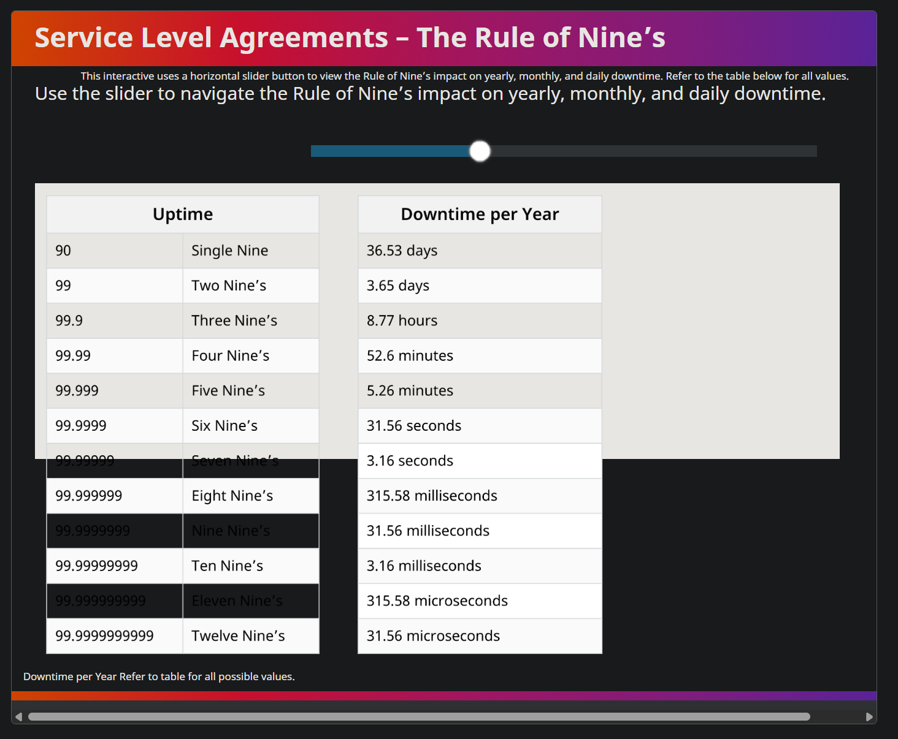
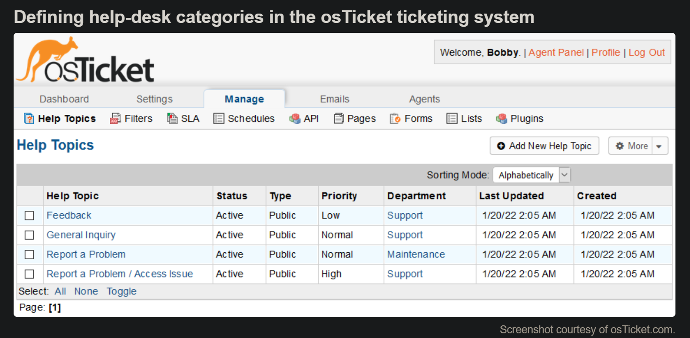
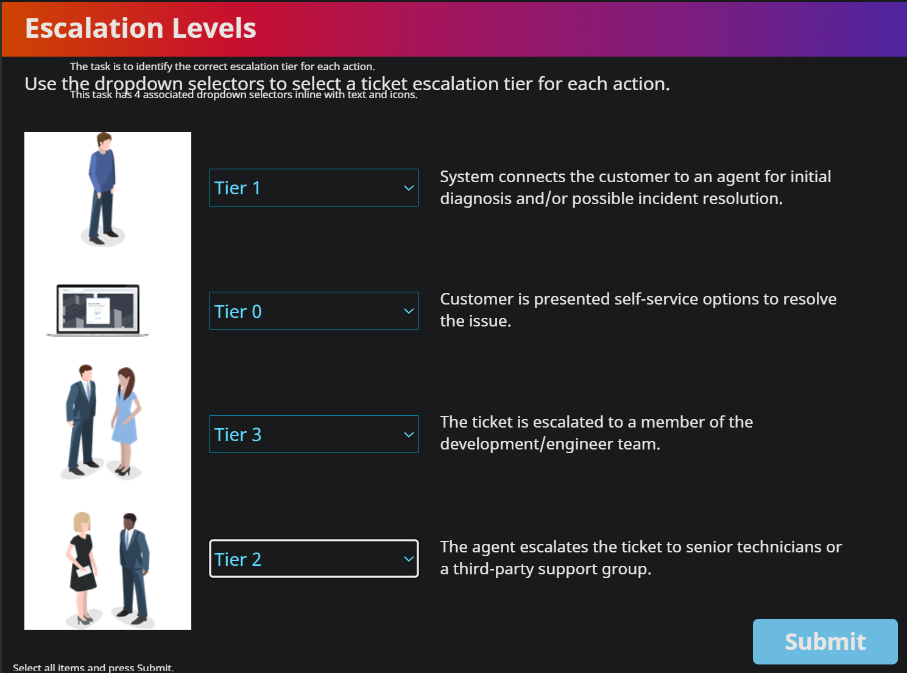
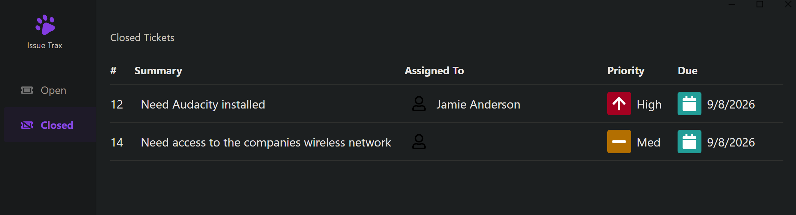
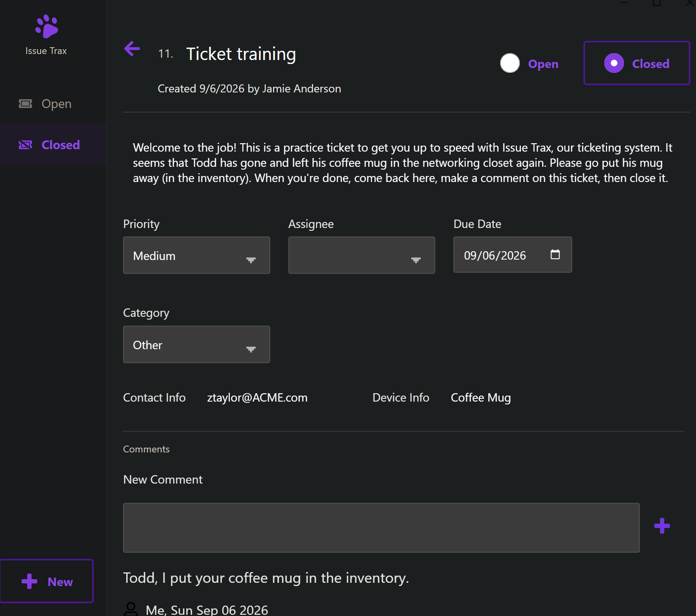
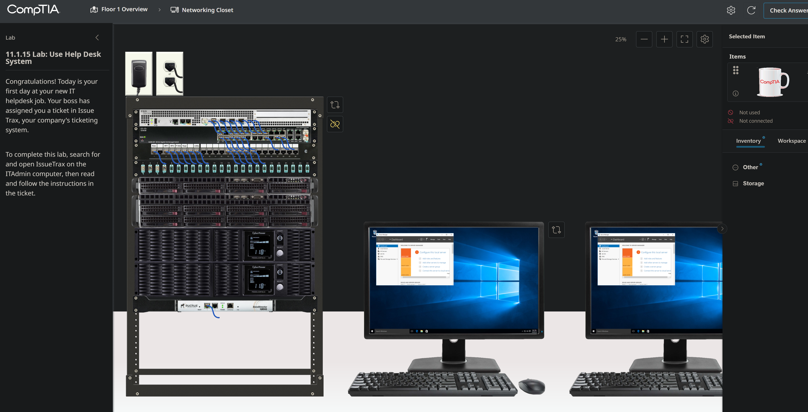

<!-- Custom stylesheet -->
<link rel="stylesheet" href="../../_css/main.css">

<!-- Site logo -->

> [🏚️ README](../../../README.md) | [📁 Courses](../../index.md) | [📚 Vocabulary](../../Vocabulary.md) | [🗓️ Assignments Schedule](../Assignments_Schedule.md) | [🔖 Bookmark](#bookmark)

# CIS 268 - Software Support:    NOTES: Week 3 - IT Support Fundamentals (Aug 31 - Sept 7)

# ➡️ Week 3

## **Focus:** Professional Practices

**This week, you will:**

*   Study professionalism, documentation, ticketing systems, and escalation procedures.
*   Review operating system types and basic compatibility concepts.
*   Submit the proctored quiz.

**To do this week:**

*   Complete all assigned lessons and assignment.
*   Complete proctored quiz.

**By the end of this week, you should be able to:**

*   Communicate professionally with end users.
*   Accurately document and escalate support issues.

---

> The following are part of the **CompTIA: A+ Core 1 and Core 2 CertMaster Learn** V15 learning platform

## 📖 Module 11.0 Managing Support Procedures

### 🟣 Lesson 11.0

Support for customers and clients provides an interesting dynamic to working as an IT specialist. Every issue is something new to learn and resolve. While the issues change, the process by which we resolve them should not vary much issue to issue. Imagine you have been assigned to resolve an issue with an employee's laptop. This employee works remotely in another time zone, and you will need to rely on email and phone conversations to work through the troubleshooting steps. Ensuring that you communicate efficiently and effectively will be key to handling the issue as a professional.

As you work through the process, you will also need to ensure you are documenting the steps you have taken and the results of any test you have run. In some cases, the problem will not be resolved in the same day and other team members may need to continue to find a solution after your shift ends. Tracking and documentation of steps taken thus far allows them to continue the process rather than starting all over again with the issue. Understanding which application you are working with and ensuring the correct operating system has been identified will be helpful in finding a resolution as well.

> Prepare for A+ Core 2 by:
> 
> *   Understanding industry best practices in support documentation
> *   Understanding and use professional communication
> *   Identifying various operating systems and their uses

---

### 🟣 Lesson 11.1 Documentation

Core 2 Exam Objectives Covered

*   4.1 Given a scenario, implement best practices associated with documentation and support systems information management.
*   4.6 Explain the importance of prohibited content/activity and privacy, licensing, and policy concepts.(Acceptable Use Policy)

You are nearing the end of your work shift at the data center. You have been working frantically to resolve an outage of a hosted application for a customer. After working through the initial documentation and collecting details of the issues, you now are at a point where you need to think about handing this issue over to someone on the next support shift.

You log into the support ticket system and begin making notes about what you have done to troubleshoot the issue so far. You have rebooted the server, ensured a network connection has been established, and were planning on testing the application to ensure the right version was installed on the server. Since we cannot work 24 hours a day, seven days a week, your documentation of your steps will allow the next shift to pick up where you left off and continue to work toward a solution.

## Learning Outcomes

As you study this lesson, answer the following questions:

*   What is an SOP and how is it different from a policy?
    
*   How do ticketing systems assist in documentation of issues?
    
*   How are support tickets prioritized?
    
*   What are the characteristics of good documentation?

---

### 🟣 11.1.1 Standard Operating Procedure

Employees must understand how to use computers and networked services securely and safely and be aware of their responsibilities. To support this, the organization needs to create written policies and procedures to help staff understand and fulfill their tasks and follow best practices:

*   A policy is an overall statement of intent.
*   A Standard Operating Procedure (SOP) is a step-by-step list of the actions that must be completed for any given task to comply with policy. Most IT procedures should be governed by SOPs.
*   Guidelines are for areas of policy where there are no procedures, either because the situation has not been fully assessed or because the decision-making process is too complex and subject to variables to be able to capture it in an SOP. Guidelines may also describe circumstances where it is appropriate to deviate from a specified procedure.

Typical examples of SOPs are as follows:

*   Procedures for custom installation of software packages, such as verifying system requirements, validating download/installation source, confirming license validity, adding the software to change control/monitoring processes, and developing support/training documentation
*   New-user setup checklist as part of the onboarding process for new employees and employees changing job roles. Typical tasks include identification/enrollment with secure credentials, allocation of devices, and allocation of permissions/assignment to security groups
*   End-user termination checklist as part of the offboarding process for employees who are retiring, changing job roles, or have been fired. Typical tasks include returning and sanitizing devices, releasing software licenses, and disabling account permissions/access

---

### 🟣 Service Level Agreements

Service level agreements (SLAs) define the level of service requirements from an internal department or external, third-party vendor. Examples of services that most likely have an SLA in place include:

*   Internal departments of the company that are providing resources to one another such as access to hardware resources; a company's maintenance department may also have a SLA that details how they are to provide support to the other departments within the company when it comes to building maintenance, etc.
    
*   External agreements will normally be provided by the ISP as to the metrics of throughput they will provide a company for the internet connection; a cloud service provider will also have a SLA in place that details the service delivery metrics of the organizations cloud resources.
    

SLAs normally include a description of the service being provided, along with the metrics that are used to measure the level of service being provided. In some cases, the SLA may dictate the expected up time, when the service is available, and what is not considered down time (service not available) for the service. The Rule of Nines is a very popular metric used for this purpose.

Rule of 4 Nines means the service or system will be available 99.99% of the time. This allows for a maximum of 52 minutes of downtime per year. Whereas a service with the Rule of 11 Nines means the service will be up 99.999999999% of the time, would only be allowed 315.58 microseconds of downtime.

The Rule of Nines can also be used to calculate the durability of file and data storage services. The Rule of 11 Nines for durability means that even with 1 billion objects in storage, you would be able to go 100 years without losing a single object.

Should the delivery metrics not be met by the provider, the SLA will detail the recourse process to make a complaint against the service provider. It may also detail the amount of money the customer may be able to recover since the service is not meeting the requirements of the SLA.

---

### 🟣 11.1.3 Incident and Ticketing Systems

A ticketing system manages requests, incidents, and problems. Ticketing systems can be used to support both internal end-users and external customers.

The general process of ticket management is as follows:

1.  A user contacts the help desk, perhaps by phone or email, or directly via the ticketing system.
    
    A unique job ticket ID is generated, and an agent is assigned to the ticket. The ticket will also need to capture some basic details:
    
    *   User information: The user’s name, contact details, and other relevant information, such as department or job role. It might be possible to link the ticket to an employee database or customer relationship management (CRM) database.
    *   Device information: If relevant, the ticket should record information about the user’s device. It might be possible to link to the relevant inventory record via a service tag or asset ID.
    
2.  The user supplies a description of the issue.
    
    The agent might ask clarifying questions to ensure an accurate initial description.
    
3.  The agent categorizes the support case, assesses how urgent or severe it is, and determines how long it will take to fix.
4.  The agent may take the user through initial troubleshooting steps. If these do not work, the ticket may be escalated to deskside support or a senior technician.

Figure 1. Defining help-desk categories in the osTicket ticketing system  
  

Screenshot courtesy of osTicket.com.

Description

A table below lists the help topics with status, type, priority, department, last updated, and created.

---

### 🟣 11.1.4 Categories and Severity

## Categories

Categories and subcategories group related tickets together. This is useful for assigning tickets to the relevant support section or technician and for reporting and analysis.

Service management standards distinguish between the following basic ticket types:

*   Requests are for provisioning things that the IT department has a SOP for, such as setting up new user accounts, purchasing new hardware or software, deploying a web server, and so on. Complex requests that aren't covered by existing procedures are better treated as projects rather than handled via the ticketing system.
*   Incidents are related to any errors or unexpected situations faced by end-users or customers. Incidents may be further categorized by severity (impact and urgency), such as minor, major, and critical.
*   Problems are causes of incidents and will probably require analysis and service reconfiguration to solve. This type of ticket is likely to be generated internally when the help desk starts to receive many incidents of the same type.

Using these types as top-level categories for an end-user facing system is not always practical, however. End-users are not likely to know how to distinguish incidents from problems, for example. Devising categories that are narrow enough to be useful but not so numerous as to be confusing or to slow down the whole ticketing process is a challenging task.

One strategy is for a few simple, top-level categories that end-users can self-select, such as New Device Request, New App Request, Employee Onboarding, Employee Offboarding, Help/Support, and Security Incident. Then, when assigned to the ticket, the support technician can select from a longer list of additional categories and subcategories to help group related tickets for reporting and analysis purposes. Alternatively, or to supplement categories, the system might support adding standard keyword tags to each ticket. A keyword system is more flexible but does depend on each technician tagging the ticket appropriately.

---

### 🟣 11.1.5 Ticket Management

After opening an incident or problem ticket, the troubleshooting process is applied until the issue is resolved. At each stage, the system must track the ownership of the ticket (who is dealing with it) and its status (what has been done).

This process requires clear written communication and might involve tracking through different escalation routes.

## Escalation Levels

Escalation occurs when an agent cannot resolve the ticket. Some of the many reasons for escalation include:

*   The incident is related to a problem and requires analysis by senior technicians or by a third-party/warranty support service.
    
*   The incident severity needs to be escalated from minor to major or major to critical and now needs the involvement of senior decision-makers.
*   The incident needs the involvement of sales or marketing to deal with service complaints or refund requests.

The support team can be organized into tiers to clarify escalation levels. For example:

*   Tier 0 presents self-service options for the customer to try to resolve an incident via advice from a knowledge base or "help bot." A knowledge base is a collection of FAQs and common troubleshooting procedures that a user can refer to before filing a trouble ticket.
    
*   Tier 1 connects the customer to an agent for initial diagnosis and possible incident resolution.
*   Tier 2 allows the agent to escalate the ticket to senior technicians (Tier 2 – Internal) or to a third-party support group (Tier 2 – External).
*   Tier 3 escalates the ticket as a problem to a development/engineer team or to senior managers and decision-makers.

---

### 🟣 11.1.6 Activity: Escalation Levels

---

### 🟣 11.1.7 Support Documentation and Knowledge Base Articles

It is also useful to link an inventory record to appropriate troubleshooting and support sources. At a minimum, this should include the product documentation/setup guide plus a deployment checklist and secure configuration template.

It might be possible to cross-reference the inventory and ticket systems. This allows incident and problem statistics to be associated with assets for analysis and reporting. It also allows an agent to view a history of previous tickets associated with an asset.

A knowledge base is a repository for articles that answer frequently asked questions (FAQs) and document common or significant troubleshooting scenarios and examples. Each inventory record could be tagged with a cross-reference to an internal knowledge base to implement self-service support and to assist technicians.

An asset notes field could be used to link to external knowledge base articles, blog posts, and forum posts that are relevant to support. Be sure to take into consideration who wrote the article and any verifiable credentials so you can determine the legitimacy of the article content.

---

### 🟣 11.1.8 Lessons Learned

For critical and major incidents, it may be appropriate to develop a more in-depth lessons learned report, also referred to as an **after-action report (AAR)** or as lessons learned (post-mortem?). An **incident report** solicits the opinions of users/customers, technicians, managers, and stakeholders with some business or ownership interest in the problem being investigated. The purpose of an incident report is to identify underlying causes and recommend remediation steps or preventive measures to mitigate the risk of a repeat of the issue.

Incident reports and support tickets can also be turned into new SOPs or assist in revising existing SOPs and policies. This report can also be filed into the organization's knowledge base for record-keeping and reference in future trouble tickets and incidents.

---

### 🟣 11.1.9 Clear Written Communication

Free-form text fields allow ticket requesters and agents to add descriptive information. There are normally three fields to reflect the ticket life cycle:

*   **Issue description** records the initial request with any detail that could easily be collected at the time.
*   **Progress notes** record what diagnostic tools and processes have discovered and the identification and confirmation of a probable cause.
*   **Problem resolution** sets out the plan of action and documents the successful implementation and testing of that plan and full system functionality. It should also record end-user or customer acceptance that the ticket can be closed.

At any point in the ticket life cycle, other agents, technicians, or managers may need to decide something or continue a troubleshooting process using just the information in the ticket. Tickets are likely to be reviewed and analyzed. It is also possible that tickets will be forwarded to customers as a record of the jobs performed. Consequently, it is important to use clear and concise written communication to complete description and progress fields, with due regard for spelling, grammar, and style.

*   **Clear** means using plain language rather than jargon.
*   **Concise** means using as few words as possible in short sentences. State the minimum of fact and action required to describe the issue or process.

---

### 🟣 11.1.10 Knowledge Base

A knowledge base is a self-serve central repository for information. IT service organizations will normally house troubleshooting articles that end users can refer to when attempting to self-correct or diagnose an issue. Frequently asked questions (FAQs) may also be provided to answer the most common questions or issues that an end user may face.

The knowledge base can easily be expanded to provide more in-depth information of services and remedies for issues the organization has faced in the past as well. A trouble ticket or service ticket tracking system may have the ability to store this content as well.

For example, an organization may have checklists that require a user to log out of a system and restart it as a first step in troubleshooting an application not functioning correctly. Another article in the knowledge may contain basic printer and copier troubleshooting steps should a user run into an issue while printing or making a copy.

Some of this knowledge may be the result of previous service request that the IT support team have responded to and corrected.

There are also many external knowledge base systems from different vendors and manufacturers of IT systems and software. Microsoft has their own FAQ and Help section under their Learn platform. Dell and HP have website repositories of similar content for their products. While these are built and maintained by the manufacturer themselves, they contain a wealth of knowledge and information that may be helpful for users and technicians alike when beginning the troubleshooting process.

> Note:
> 
> The Microsoft Learn website is https://learn.microsoft.com/en-us/training/support/. Other manufacturer and vendor help and support areas can be found easy on the OEM websites. Look for Help or Support icons on the site.

---

### 🟣 11.1.11 Knowledge Base Articles

- Ross is an Azure product tech
- Let you know how to do operations you otherwise don't know how to do
> - #CASE_STUDY: The web dev made a knowledgebase article before he left the company. It got the IT team back up within an hour

---

### 🟣 11.1.12 Policy Documentation

An acceptable use policy (AUP) sets out what someone is allowed to use a particular service or resource for. Such a policy might be used in different contexts. For example, an AUP could be enforced by a business to govern how employees use equipment and services such as telephone or Internet access provided to them at work. Another example might be an AUP enforcing a fair use policy governing usage of its Internet access services.

> - **acceptable use policy (AUP):** A policy that governs employees' use of company equipment and Internet services. ISPs may also apply AUPs to their customers.

Enforcing an AUP is important to protect the organization from the security and legal implications of employees (or customers) misusing its equipment. Typically, the policy will forbid the use of equipment to defraud, defame, or to obtain illegal material. It is also likely to prohibit the installation of unauthorized hardware or software and to explicitly forbid actual or attempted intrusion (snooping). An organization's acceptable use policy may forbid use of Internet tools outside of work-related duties or restrict such use to break times.

Further to AUPs, it may be necessary to implement regulatory compliance requirements as logical controls or notices. For example, a splash screen might be configured to show at login to remind users of data handling requirements or other regulated use of a workstation or network app.

> - **splash screen:** Displaying terms of use or other restrictions before use of a computer or app is allowed.

---

### 🧪 11.1.13 Lab: Create a Ticket

#CASE_STUDY

> You are a new employee on a computer named `Office1`. After working for a few days, you realize it would be helpful if you had the digital audio editor named Audacity installed on your computer. When you try to install this program, your system shows you a prompt asking you to enter a username and password for an administrator account. Since you have not been given local administrative rights, you need to create a help desk ticket requesting that this software be installed.

In this lab, your task is to:

*   Open the company's help desk ticketing system, **Issue Trax**.
*   Create a new ticket requesting that Audacity be installed using the following information:
    *   Summary: **Need Audacity installed**
    *   Description: Enter a description of your choice explaining the need to have Audacity installed.
    *   Contact Info: **435-555-1234**
    *   Device Info: **HP Laptop/Win11**
    *   Priority: **High**
    *   Assignee: **Joshua Anderson**
    *   Due Date: Select tomorrow's date.
    *   Category: **Software**

---

### 🧪 11.1.14 Lab: Close a Ticket 

#CASE_STUDY

> Your name is Jamie Anderson, and you work in the IT department for a small company. An employee by the name of Taylor Quick assigned you a help desk ticket requesting that the software program named Audacity be installed on her system. You installed the program after work hours yesterday, and you need to update the ticket accordingly.

In this lab, your task is to complete the following:

*   Open the company's help desk ticketing system, **Issue Trax**.
*   For the ticket created by Taylor (and assigned to you), add the following comment and close the ticket:  
    **Taylor,  
    I installed Audacity on your system last night.**
*   Verify that the closed ticket is now showing under the _Closed_ category of the ticketing system.

#PROOF

---

### 🧪 11.1.15 Lab: Use Help Desk System 

Congratulations! Today is your first day at your new IT helpdesk job. Your boss has assigned you a ticket in Issue Trax, your company's ticketing system.

To complete this lab, search for and open IssueTrax on the ITAdmin computer, then read and follow the instructions in the ticket.

#PROOF

---

### 🟣 11.1.16 Lesson Review

(source: Perplexity):

> ## 📘 Policy: Key Characteristics
> 
> ### ✅ Core traits of a policy
> 
> - **Organizational rules:** A policy includes rules that have been set by an organization to address a particular problem or concern.   
> - **Outcome-focused guidance:** A policy defines a desired outcome and outlines how that outcome should be met, without prescribing every detailed step.   
> 
> ### ❌ What policies are not
> 
> - **Not step-by-step instructions:** Details such as exactly who should complete the work, which specific action to take, and when it should be completed are usually documented in **procedures** or **work instructions**, not in the policy itself.   
> - **Not overly specific action plans:** While a policy may explain why action is needed, it generally avoids dictating precise actions; that level of detail belongs in supporting documents.

(source: Google search AI):

> An SOP (Standard Operating Procedure) provides detailed, step-by-step instructions on how to complete a specific task, while a policy defines the high-level rules and guidelines of what is and is not allowed. [1, 2]  
> 📌 Key Differences 
> 
> | Feature | 📜 Policy | 📋 SOP  |
> | --- | --- | --- |
> | Focus | The what and why (rules, intent, and principles) | The how (actionable, sequential steps)  |
> | Scope | Broad and company-wide | Narrow and task-specific  |
> | Audience | Everyone in the organization | Specific roles or teams executing the task  |
> | Change Frequency | Static; rarely changes | Dynamic; updates as tools or processes evolve  |
> 
> 💡 Example in Practice 
> 
> • The Policy: "All customer refund requests must be processed within 30 days of purchase." (Sets the boundary and legal/business rule). 
> • The SOP: Log into the CRM, navigate to the billing tab, click "Issue Refund," and select the 30-day override code. (Gives the exact button-by-button execution). [1]  
> 
> 🔎 Further Exploration 
> 
> • Read a complete overview on Waybook to compare SOPs and policies. 
> • Learn when to deploy each document type with Scribe. 
> • Review guidelines on the differences via Touch Stay. [1, 3, 4]  
> 
> If you'd like, let me know:What industry or department you are writing forWhether you need help drafting a specific policy or SOPI can help you build a tailored outline. 
> AI responses may include mistakes.
> 
> [1] https://www.waybook.com/blog/sop-vs-policy-vs-procedure-vs-process-what-are-the-key-differences
> [2] https://www.sweetprocess.com/sop-vs-policy/
> [3] https://scribe.com/library/policy-vs-sop
> [4] https://touchstay.com/blog/sop-vs-policy

A company's help desk receives multiple tickets reporting that customers cannot access the company's online payment system.

Upon investigation, it is discovered that the issue is affecting all customers and may involve a potential data breach.

Based on the standard severity levels, how should this incident be classified?

answer

A
Minor Incident

B
Request

C
Major Incident

D
Critical Incident #CORRECT

---

You are a manager at an IT company, and your team is reviewing the organization's policy documentation to ensure compliance with company standards.

During the review, you notice that a Standard Operating Procedure (SOP) for onboarding new employees includes steps for granting access to IT systems but does not reference the Acceptable Use Policy (AUP).

How should you address this issue?

answer

A

Leave the SOP as it is since policies and SOPs are independent of each other and do not need to reference one another.

B

Remove the SOP entirely, as it does not align with the organization's policies.

C

Update the SOP to include a step requiring new employees to review and acknowledge the Acceptable Use Policy (AUP).

D

Create a new policy specifically for onboarding employees to address the gap in the SOP.

---

#CASE_STUDY

> Jason is a sales rep with a computer company that sells customized laptops to the public. He is opening a ticket to help resolve a customer issue with a malfunctioning laptop, which was purchased by an important customer who is relying on the laptop to complete a critical project.

Which of the following items in the ticket can Jason use to help the support team immediately determine the time sensitivity of resolving this issue?

answer

A
Tier assignment

B
Detailed issue description

C
Department assignment

D
Severity level #CORRECT

---

Why is clear written communication important during the ticket management process?

answer

A
It guarantees that all tickets are resolved within the SLA timeframe.

B
It allows end-users to resolve their own issues without contacting support.

C
It eliminates the need for escalation to higher support tiers.

D
It ensures that all team members understand the ticket's history and current status. #CORRECT

---

A company is experiencing a high volume of support tickets for common, repetitive issues.

How effective would implementing a Knowledge Base be in addressing this problem?

answer

A
Ineffective, as it does not address the root cause of the repetitive issues

B
Ineffective, as it primarily focuses on categorizing and prioritizing tickets rather than resolving them

C
Somewhat effective, as it reduces the workload for Tier 3 support but not for Tier 1 or Tier 2 support

D
Highly effective, as it provides users with self-service options to resolve common issues without filing tickets  #CORRECT

---

A help desk team is receiving multiple tickets from users reporting that they cannot access a shared drive.

Upon reviewing the tickets, you notice that all the affected users are from the same department, and the issue started after a recent server update.

What should you do to address the situation effectively?

answer

A
Escalate one ticket to Tier 2 and close the rest, assuming they are duplicates.

B
Reassign the tickets to different agents to speed up resolution.

C
Treat each ticket as a separate incident and troubleshoot them individually.

D
Analyze the tickets to identify a common cause and open a problem ticket for further investigation. #CORRECT

> ## ✅ You’re right: **D** is the best answer
> 
> ### 🎯 Why D is correct
> 
> - **Pattern recognition:** Multiple users from the same department lost access after a server update — this strongly suggests a **common underlying cause**, not isolated incidents.   
> - **Problem vs. incident:** In ITIL/Service+ terms, an **incident** is a single disruption; a **problem** is the underlying cause of one or more incidents. When you see a pattern, you should **link the incidents and open a problem record** to investigate the root cause.   
> - **Efficient resolution:** Fixing the root cause (e.g., permissions change, group policy, share configuration) will resolve all affected users at once, instead of applying temporary workarounds per ticket.   
> 
> ### ❌ Why the other options are weaker
> 
> - **A – Escalate one ticket and close the rest as duplicates:**  
>   This ignores the need to formally track the underlying issue and may cause loss of useful data (affected users, impact, timeline).   
> 
> - **B – Reassign tickets to different agents:**  
>   This fragments effort and risks inconsistent troubleshooting when a coordinated, root-cause approach is needed.   
> 
> - **C – Treat each ticket as a separate incident:**  
>   This is inefficient and misses the opportunity to identify and fix the common cause; it’s appropriate only when incidents truly appear unrelated.   
> 
> So for this scenario, the most effective action is:  
> **D – Analyze the tickets to identify a common cause and open a problem ticket for further investigation.**

---

What is the primary purpose of documenting "Lessons Learned" in IT support processes?

answer

A
To track the number of incidents handled by each technician.

B
To improve future processes and prevent recurring issues. #CORRECT

C
To ensure all tickets are closed on time.

D
To identify and assign blame for incidents.

> ## ✅ You’re right: **B** is the best answer
> 
> ### 🎯 Why B is correct
> 
> - **Continuous improvement:** The primary purpose of “Lessons Learned” is to capture what went well, what didn’t, and what can be changed so that **future processes improve** and similar issues are less likely to recur.   
> - **Preventing recurrence:** By documenting root causes, effective fixes, and process gaps, teams can update procedures, training, and monitoring to **prevent recurring issues**.   
> 
> ### ❌ Why the other options are incorrect
> 
> - **A – Track the number of incidents per technician:**  
>   That’s a **metric/reporting** function, not the purpose of Lessons Learned.   
> 
> - **C – Ensure all tickets are closed on time:**  
>   Timely closure is about **SLA management** and workflow discipline, not the reflective improvement focus of Lessons Learned.   
> 
> - **D – Identify and assign blame:**  
>   Lessons Learned should be **blameless** and focused on system/process improvement, not on punishing individuals.   
> 
> So the correct choice is:  
> **B – To improve future processes and prevent recurring issues.**

> ## 📘 Lessons Learned / AAR vs. Sprint Retrospective
> 
> Both are structured reflections aimed at improvement, but they differ in scope, timing, and typical use.
> 
> ### 🎯 Purpose and focus
> 
> - **Lessons Learned / After-Action Review (AAR)**  
>   - Focuses on a **specific incident, project, or change** (e.g., major outage, migration, security event).  
>   - Asks: *What happened? Why? What should we sustain or change next time?*  
>   - Strong emphasis on **root causes, decisions, and process gaps** tied to that event. 
> 
> - **Sprint Retrospective**  
>   - Focuses on the **team’s way of working over the last sprint** (process, collaboration, tools, flow).  
>   - Asks: *What went well? What didn’t? What will we try differently next sprint?*  
>   - Emphasis on **team practices, workflow, and continuous incremental improvement**. 
> 
> ### ⏱ Timing and cadence
> 
> - **Lessons Learned / AAR**  
>   - Conducted **after a defined event or project phase** (post-incident, post-change, post-project).  
>   - Irregular cadence; triggered by significant work or events. 
> 
> - **Sprint Retrospective**  
>   - Held **every sprint** (e.g., every 1–2 weeks) as a fixed Scrum ceremony.  
>   - Regular, predictable rhythm regardless of incidents. 
> 
> ### 👥 Participants
> 
> - **Lessons Learned / AAR**  
>   - Often includes **all stakeholders involved in the event**: support, engineering, security, change management, sometimes leadership.  
>   - Can be cross-functional and broader than a single team. 
> 
> - **Sprint Retrospective**  
>   - Typically the **Scrum Team**: developers, tester(s), Scrum Master, Product Owner.  
>   - More team-centric; outside stakeholders attend only occasionally. 
> 
> ### 🧾 Outputs and artifacts
> 
> - **Lessons Learned / AAR**  
>   - Produces a **lessons log or report** with:
>     - Summary of the event
>     - Root causes / contributing factors
>     - Specific recommendations and action items (often tracked in a problem record or project plan)  
>   - Often tied to **problem management, change management, or project closure**. 
> 
> - **Sprint Retrospective**  
>   - Produces a short list of **experiments or improvements** for the next sprint (e.g., “limit WIP,” “add code review checklist,” “refine grooming”).  
>   - Actions are usually owned by the team and tracked in the **team board or backlog**. 
> 
> ### 🧩 Typical questions
> 
> - **Lessons Learned / AAR**
>   - What was supposed to happen?  
>   - What actually happened?  
>   - Why were there differences?  
>   - What will we do differently next time (process, tooling, design, runbook)? 
> 
> - **Sprint Retrospective**
>   - What went well this sprint?  
>   - What didn’t go well?  
>   - What can we improve in our process or collaboration?  
>   - What 1–3 things will we try next sprint? 
> 
> ### 🧭 When to use which
> 
> - Use a **Lessons Learned / AAR** when:
>   - There’s a **major incident, outage, failed change, or completed project**.  
>   - You need a formal record for **problem management, compliance, or organizational learning**. 
> 
> - Use a **Sprint Retrospective** when:
>   - You’re running **Agile/Scrum** and want to continuously tune **team process and delivery flow** every sprint. 
> 
> In practice, teams often **feed insights from AARs into retrospectives** (and vice versa): an AAR might reveal a systemic process issue that becomes a recurring improvement theme in several sprint retros.

---

A company has an SLA with a cloud service provider that guarantees 99.99% uptime for their services. During the past year, the company experienced a total of 2 hours of downtime.

Based on the SLA, what should the company do next?

answer

A
Terminate the SLA immediately due to the service provider's failure to meet expectations.

B
File a complaint with the service provider for failing to meet the SLA and request compensation.

C
Review the SLA to determine whether or not 2 hours of downtime is within the acceptable limit for 99.99% uptime. #CORRECT

D
Escalate the issue to Tier 3 support for further investigation.

---

#PROOF

Which of the following are true about a policy? (Select two.)

answer

A

Defines who should complete the work.

B

Explains which action should be taken.

C

Defines when the work should be completed.

D

Includes rules that have been set by an organization to address a particular problem or concern.

Correct Answer:Correct

E

Identifies the problem, such as why action is needed and which action should be taken.

Correct Answer:Correct

F

Defines a desired outcome and outlines how that outcome should be met.

> Incorrect answer:Incorrect
> 
> ### Explanation
> 
> A "policy" is a high-level statement of intent that includes rules established by an organization to address specific problems or concerns. These rules are designed to guide employee behavior and ensure compliance with organizational goals, legal requirements, and best practices.
> 
> A policy often identifies the problem it is addressing, explaining why action is necessary and providing guidance on the type of action that should be taken. This ensures that employees understand the purpose of the policy and the rationale behind the rules it enforces.
> 
> While a policy may provide general guidance on actions to address a problem, it does not typically include detailed, step-by-step instructions. Instead, this level of detail is usually found in Standard Operating Procedures (SOPs), which are designed to operationalize policies. Therefore, this is not an accurate description of a policy.
> 
> A policy defines a desired outcome but does not typically outline the specific steps or procedures to achieve that outcome. The "how" is usually addressed in SOPs or guidelines, which are more detailed and task-specific. Thus, this is not entirely accurate for a policy.
> 
> A policy does not generally specify who is responsible for completing specific tasks. This level of detail is typically found in SOPs or role-specific documentation. Policies focus on overarching rules and objectives rather than assigning responsibilities.
> 
> A policy does not usually include timelines or deadlines for completing specific tasks. This information is more likely to be found in project plans, SOPs, or operational guidelines. Policies are broader in scope and focus on principles rather than operational details.

---

### 🟣 

---

### 🟣 

---

### 🟣 

---

### 🟣 

---

### 🟣 

---

### 🟣 

---

### 🟣 

---

### 🟣 

---

### 🟣 

---

### 🟣 

---

### 🟣 

